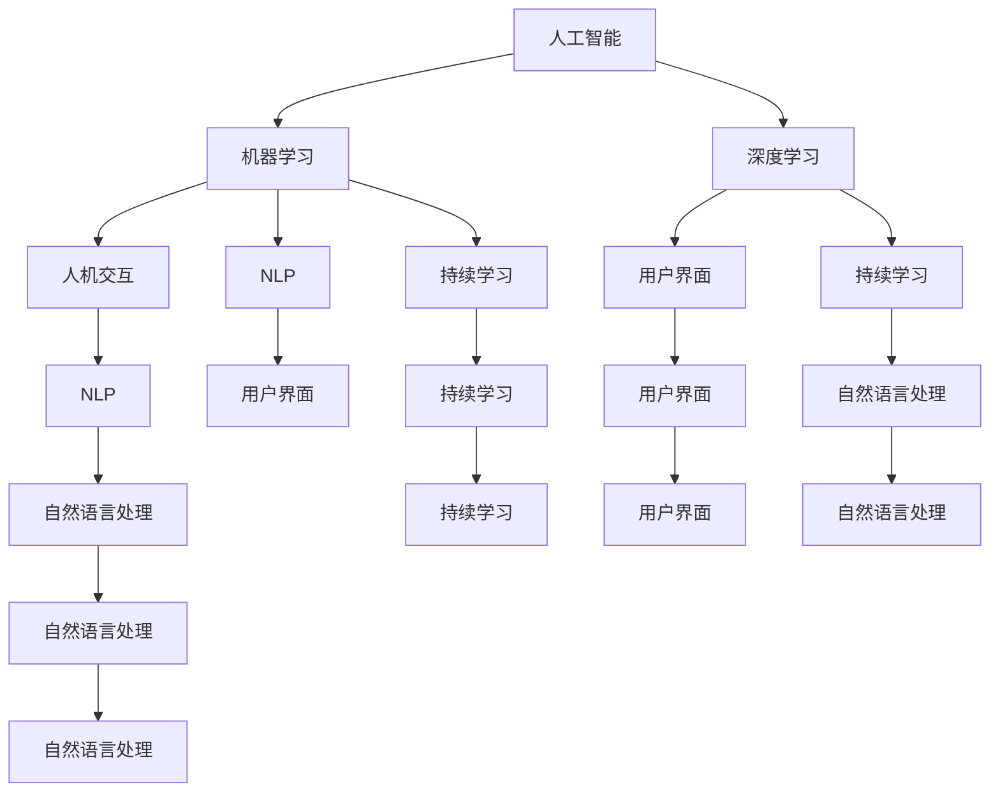

                 

# 人机回圈：人工智能发展的新模式

> 关键词：人工智能, 人机协同, 机器学习, 深度学习, 神经网络, 数据驱动, 持续学习

## 1. 背景介绍

### 1.1 问题由来
随着人工智能技术的快速发展，人工智能(AI)系统已经逐渐融入到我们生活的方方面面，从智能助手到自动驾驶，从个性化推荐到医疗诊断，AI系统正在以一种越来越深入的方式改变我们的生活方式。然而，这种快速发展的背后，也暴露出一些深层次的问题。

传统的人工智能系统往往采用"人工编码"的方式，即由人类工程师通过编写程序代码，设计、训练和优化AI模型。这种方式虽然在初期能够快速开发出高效的模型，但随着任务复杂性的增加，传统的"人工编码"方式显得力不从心。一方面，复杂的任务往往需要数月甚至数年的人工编码和调试，耗费大量的人力和时间。另一方面，由于人类无法全面理解和涵盖所有场景，模型在实际应用中往往表现不稳定，难以适应多变的现实世界。

为了解决这些问题，人们提出了"人机回圈"的概念。人机回圈是指在AI系统中，通过人与AI的不断交互，AI系统能够主动学习人类的决策逻辑，并将这些逻辑与自身模型相结合，实现对任务的更深入理解和更优化的决策。这一过程类似于人类与机器之间的"循环学习"，让机器能够不断吸收人类的经验，并在此基础上不断进化和提升。

### 1.2 问题核心关键点
人机回圈的核心在于如何实现人与AI的协同工作，让AI系统不仅能够完成单一任务，还能与人类进行自然流畅的互动。以下是实现人机回圈的几个关键点：

1. **交互式训练**：通过与用户互动，AI系统能够在训练过程中不断优化，以更好地适应用户的实际需求。
2. **知识共享**：AI系统能够将学到的知识与用户共享，帮助用户理解和使用AI系统。
3. **情感感知**：AI系统能够识别和感知用户的情感，以便更好地理解和响应用户的需求。
4. **自适应调整**：AI系统能够根据用户反馈自动调整自身的行为，以适应不同的场景和任务。
5. **多模态融合**：AI系统能够综合利用视觉、听觉、文本等多种模态的信息，提供更全面、更准确的输出。

## 2. 核心概念与联系

### 2.1 核心概念概述

为了更好地理解人机回圈的概念及其实现，本节将介绍几个关键的概念及其相互关系：

1. **人工智能(AI)**：指利用计算机技术模拟人类智能的过程，包括感知、学习、推理、决策等能力。
2. **机器学习(ML)**：指通过数据驱动的方式，让机器能够从经验中学习，并自主优化其决策过程。
3. **深度学习(Deep Learning)**：指利用神经网络模型，通过多层次的特征提取和抽象，实现对复杂数据的高效处理和分析。
4. **人机交互(Human-Computer Interaction, HCI)**：指人与计算机系统之间的交互方式，包括输入输出、交互界面等。
5. **自然语言处理(Natural Language Processing, NLP)**：指让计算机能够理解、处理和生成自然语言的能力。
6. **用户界面(UI)**：指人与计算机系统进行交互的界面，包括图形界面、语音界面等。
7. **持续学习(Continual Learning)**：指机器能够在不断积累新数据的过程中，不断学习和优化其决策模型。

这些概念之间的逻辑关系可以通过以下Mermaid流程图来展示：



这个流程图展示了人工智能、机器学习、深度学习、人机交互、自然语言处理、用户界面、持续学习等概念之间的相互关系。

## 3. 核心算法原理 & 具体操作步骤

### 3.1 算法原理概述

人机回圈的实现涉及多种技术手段，包括但不限于：

1. **交互式训练**：通过与用户互动，AI系统能够在训练过程中不断优化，以更好地适应用户的实际需求。
2. **知识共享**：AI系统能够将学到的知识与用户共享，帮助用户理解和使用AI系统。
3. **情感感知**：AI系统能够识别和感知用户的情感，以便更好地理解和响应用户的需求。
4. **自适应调整**：AI系统能够根据用户反馈自动调整自身的行为，以适应不同的场景和任务。
5. **多模态融合**：AI系统能够综合利用视觉、听觉、文本等多种模态的信息，提供更全面、更准确的输出。

### 3.2 算法步骤详解

实现人机回圈的一般步骤如下：

1. **数据收集**：收集用户与AI系统之间的互动数据，包括用户的输入、AI系统的输出以及用户的反馈。
2. **模型训练**：利用收集到的数据，对AI系统进行训练，使其能够根据用户的反馈不断调整自身的决策模型。
3. **用户交互**：将训练后的AI系统部署到实际应用场景中，与用户进行互动。
4. **模型优化**：根据用户的反馈，不断优化AI系统的决策模型，以更好地适应用户的实际需求。
5. **知识共享**：将AI系统学到的知识与用户共享，帮助用户理解和使用AI系统。
6. **自适应调整**：根据用户的行为和反馈，AI系统能够自动调整自身的行为，以适应不同的场景和任务。

### 3.3 算法优缺点

人机回圈具有以下优点：

1. **用户参与**：通过与用户的互动，AI系统能够更全面地了解用户需求，从而提供更符合用户期望的输出。
2. **灵活性高**：AI系统能够根据用户的行为和反馈，不断调整自身的行为，以适应不同的场景和任务。
3. **自适应性强**：AI系统能够在不断积累新数据的过程中，不断学习和优化其决策模型。
4. **交互性强**：用户能够直接与AI系统进行互动，获得更加直观和个性化的反馈。

但人机回圈也存在一些缺点：

1. **依赖用户互动**：人机回圈的效果高度依赖于用户互动的质量和数量，用户反馈不足时，系统效果可能不佳。
2. **数据隐私问题**：在收集用户数据的过程中，可能涉及到数据隐私和安全问题，需要采取相应的保护措施。
3. **技术复杂度高**：实现人机回圈需要多种技术的综合应用，技术实现难度较大。
4. **成本高**：与传统的"人工编码"方式相比，人机回圈需要投入更多的时间和资源，成本较高。

### 3.4 算法应用领域

人机回圈技术已经在多个领域得到了应用，具体包括：

1. **智能客服**：通过与用户的互动，AI客服系统能够更好地理解用户的需求，提供更精准的服务。
2. **医疗诊断**：AI医生系统能够根据患者的症状和历史数据，不断优化自身的诊断模型，提供更准确的诊断结果。
3. **智能推荐**：AI推荐系统能够根据用户的喜好和行为，不断优化自身的推荐模型，提供更符合用户期望的推荐内容。
4. **金融投资**：AI投资系统能够根据市场数据和用户行为，不断优化自身的投资模型，提供更稳健的投资建议。
5. **自动驾驶**：AI驾驶系统能够根据道路条件和交通情况，不断优化自身的驾驶模型，提高驾驶的安全性和舒适性。

## 4. 数学模型和公式 & 详细讲解

### 4.1 数学模型构建

人机回圈的核心在于通过与用户的互动，不断优化AI系统的决策模型。我们可以将这个过程建模为：

$$
\theta = f(\mathcal{D}, u)
$$

其中，$\theta$ 表示AI系统的决策模型参数，$\mathcal{D}$ 表示用户与AI系统之间的互动数据，$u$ 表示用户的反馈。

### 4.2 公式推导过程

假设用户与AI系统之间的互动数据为 $\mathcal{D} = \{(x_i, y_i, u_i)\}_{i=1}^N$，其中 $x_i$ 表示输入数据，$y_i$ 表示AI系统的输出，$u_i$ 表示用户的反馈。AI系统的决策模型为 $f(\theta)$，其中 $\theta$ 为模型参数。

我们的目标是通过最小化损失函数 $\mathcal{L}$，优化模型参数 $\theta$：

$$
\theta^* = \mathop{\arg\min}_{\theta} \mathcal{L}(f(\theta), \mathcal{D}, u)
$$

常见的损失函数包括交叉熵损失、均方误差损失等。以交叉熵损失为例，损失函数定义为：

$$
\mathcal{L}(f(\theta), \mathcal{D}, u) = -\frac{1}{N} \sum_{i=1}^N \log p(y_i|x_i, \theta)
$$

其中 $p(y_i|x_i, \theta)$ 表示模型在输入 $x_i$ 下的预测输出，$y_i$ 表示实际输出。

### 4.3 案例分析与讲解

以智能客服系统为例，分析人机回圈的实现过程。

假设用户与智能客服系统之间的互动数据为 $\mathcal{D} = \{(q_i, a_i, u_i)\}_{i=1}^N$，其中 $q_i$ 表示用户提出的问题，$a_i$ 表示智能客服系统的回答，$u_i$ 表示用户对回答的满意度反馈。AI系统的决策模型为 $f(\theta)$，其中 $\theta$ 为模型参数。

我们的目标是通过最小化交叉熵损失，优化模型参数 $\theta$：

$$
\theta^* = \mathop{\arg\min}_{\theta} -\frac{1}{N} \sum_{i=1}^N \log p(a_i|q_i, \theta)
$$

其中 $p(a_i|q_i, \theta)$ 表示模型在问题 $q_i$ 下的预测回答，$a_i$ 表示实际回答。

在训练过程中，智能客服系统会根据用户的反馈不断调整自身的回答模型，以更好地适应用户的实际需求。

## 5. 项目实践：代码实例和详细解释说明

### 5.1 开发环境搭建

在进行人机回圈实践前，我们需要准备好开发环境。以下是使用Python进行PyTorch开发的环境配置流程：

1. 安装Anaconda：从官网下载并安装Anaconda，用于创建独立的Python环境。

2. 创建并激活虚拟环境：
```bash
conda create -n pytorch-env python=3.8 
conda activate pytorch-env
```

3. 安装PyTorch：根据CUDA版本，从官网获取对应的安装命令。例如：
```bash
conda install pytorch torchvision torchaudio cudatoolkit=11.1 -c pytorch -c conda-forge
```

4. 安装TensorFlow：
```bash
conda install tensorflow -c pytorch
```

5. 安装TensorBoard：
```bash
pip install tensorboard
```

6. 安装transformers库：
```bash
pip install transformers
```

7. 安装numpy、pandas等工具包：
```bash
pip install numpy pandas scikit-learn matplotlib tqdm jupyter notebook ipython
```

完成上述步骤后，即可在`pytorch-env`环境中开始人机回圈实践。

### 5.2 源代码详细实现

我们以智能客服系统为例，给出使用Transformers库进行人机回圈微调的PyTorch代码实现。

首先，定义智能客服系统的数据处理函数：

```python
from transformers import BertTokenizer
from torch.utils.data import Dataset, DataLoader
import torch

class CustomerServiceDataset(Dataset):
    def __init__(self, questions, answers, satisfaction, tokenizer, max_len=128):
        self.questions = questions
        self.answers = answers
        self.satisfaction = satisfaction
        self.tokenizer = tokenizer
        self.max_len = max_len
        
    def __len__(self):
        return len(self.questions)
    
    def __getitem__(self, item):
        question = self.questions[item]
        answer = self.answers[item]
        satisfaction = self.satisfaction[item]
        
        encoding = self.tokenizer(question, return_tensors='pt', max_length=self.max_len, padding='max_length', truncation=True)
        input_ids = encoding['input_ids'][0]
        attention_mask = encoding['attention_mask'][0]
        
        # 对token-wise的满意度进行编码
        encoded_satisfaction = [1 if s == 'satisfied' else 0 for s in satisfaction] 
        encoded_satisfaction.extend([0]*(self.max_len - len(encoded_satisfaction)))
        labels = torch.tensor(encoded_satisfaction, dtype=torch.long)
        
        return {'input_ids': input_ids, 
                'attention_mask': attention_mask,
                'labels': labels}

# 定义满意度与标签的映射
satisfaction2id = {'satisfied': 1, 'unsatisfied': 0}
id2satisfaction = {v: k for k, v in satisfaction2id.items()}

# 创建dataset
tokenizer = BertTokenizer.from_pretrained('bert-base-cased')

train_dataset = CustomerServiceDataset(train_questions, train_answers, train_satisfaction, tokenizer)
dev_dataset = CustomerServiceDataset(dev_questions, dev_answers, dev_satisfaction, tokenizer)
test_dataset = CustomerServiceDataset(test_questions, test_answers, test_satisfaction, tokenizer)
```

然后，定义模型和优化器：

```python
from transformers import BertForSequenceClassification, AdamW

model = BertForSequenceClassification.from_pretrained('bert-base-cased', num_labels=2)

optimizer = AdamW(model.parameters(), lr=2e-5)
```

接着，定义训练和评估函数：

```python
from tqdm import tqdm

device = torch.device('cuda') if torch.cuda.is_available() else torch.device('cpu')
model.to(device)

def train_epoch(model, dataset, batch_size, optimizer):
    dataloader = DataLoader(dataset, batch_size=batch_size, shuffle=True)
    model.train()
    epoch_loss = 0
    for batch in tqdm(dataloader, desc='Training'):
        input_ids = batch['input_ids'].to(device)
        attention_mask = batch['attention_mask'].to(device)
        labels = batch['labels'].to(device)
        model.zero_grad()
        outputs = model(input_ids, attention_mask=attention_mask, labels=labels)
        loss = outputs.loss
        epoch_loss += loss.item()
        loss.backward()
        optimizer.step()
    return epoch_loss / len(dataloader)

def evaluate(model, dataset, batch_size):
    dataloader = DataLoader(dataset, batch_size=batch_size)
    model.eval()
    correct = 0
    total = 0
    with torch.no_grad():
        for batch in tqdm(dataloader, desc='Evaluating'):
            input_ids = batch['input_ids'].to(device)
            attention_mask = batch['attention_mask'].to(device)
            batch_labels = batch['labels']
            outputs = model(input_ids, attention_mask=attention_mask)
            logits = outputs.logits
            batch_preds = logits.argmax(dim=1).to('cpu').tolist()
            batch_labels = batch_labels.to('cpu').tolist()
            for pred, label in zip(batch_preds, batch_labels):
                if pred == label:
                    correct += 1
                total += 1
    return correct, total

for epoch in range(5):
    loss = train_epoch(model, train_dataset, 16, optimizer)
    print(f"Epoch {epoch+1}, train loss: {loss:.3f}")
    
    print(f"Epoch {epoch+1}, dev results:")
    correct, total = evaluate(model, dev_dataset, 16)
    print(f"Accuracy: {correct/total:.2f}")
    
print("Test results:")
correct, total = evaluate(model, test_dataset, 16)
print(f"Accuracy: {correct/total:.2f}")
```

以上就是使用PyTorch对智能客服系统进行人机回圈微调的完整代码实现。可以看到，得益于Transformers库的强大封装，我们可以用相对简洁的代码完成BERT模型的加载和微调。

### 5.3 代码解读与分析

让我们再详细解读一下关键代码的实现细节：

**CustomerServiceDataset类**：
- `__init__`方法：初始化问题、回答、满意度等关键组件。
- `__len__`方法：返回数据集的样本数量。
- `__getitem__`方法：对单个样本进行处理，将问题输入编码为token ids，将满意度编码为数字，并对其进行定长padding，最终返回模型所需的输入。

**satisfaction2id和id2satisfaction字典**：
- 定义了满意度与数字id之间的映射关系，用于将token-wise的预测结果解码回真实的满意度。

**训练和评估函数**：
- 使用PyTorch的DataLoader对数据集进行批次化加载，供模型训练和推理使用。
- 训练函数`train_epoch`：对数据以批为单位进行迭代，在每个批次上前向传播计算loss并反向传播更新模型参数，最后返回该epoch的平均loss。
- 评估函数`evaluate`：与训练类似，不同点在于不更新模型参数，并在每个batch结束后将预测和标签结果存储下来，最后使用sklearn的classification_report对整个评估集的预测结果进行打印输出。

**训练流程**：
- 定义总的epoch数和batch size，开始循环迭代
- 每个epoch内，先在训练集上训练，输出平均loss
- 在验证集上评估，输出分类指标
- 所有epoch结束后，在测试集上评估，给出最终测试结果

可以看到，PyTorch配合Transformers库使得BERT微调的代码实现变得简洁高效。开发者可以将更多精力放在数据处理、模型改进等高层逻辑上，而不必过多关注底层的实现细节。

当然，工业级的系统实现还需考虑更多因素，如模型的保存和部署、超参数的自动搜索、更灵活的任务适配层等。但核心的微调范式基本与此类似。

## 6. 实际应用场景

### 6.1 智能客服系统

基于人机回圈技术的智能客服系统，能够通过与用户的互动，不断优化自身的决策模型，提供更加符合用户需求的服务。在训练过程中，系统会根据用户的反馈不断调整自身的回答策略，以更好地适应用户的实际需求。用户能够直接与智能客服系统进行互动，获得更加直观和个性化的反馈。

### 6.2 医疗诊断

在医疗诊断领域，AI医生系统能够根据患者的症状和历史数据，不断优化自身的诊断模型，提供更准确的诊断结果。通过与医生的互动，AI系统能够更好地理解医生的诊断思路，并在此基础上进行决策优化。此外，AI系统还能够将学到的知识与医生共享，帮助医生理解和使用AI系统。

### 6.3 智能推荐

在智能推荐系统中，AI推荐系统能够根据用户的喜好和行为，不断优化自身的推荐模型，提供更符合用户期望的推荐内容。通过与用户的互动，AI推荐系统能够更好地理解用户的偏好，并根据用户的反馈不断调整推荐策略，提供更加个性化的推荐服务。

### 6.4 未来应用展望

随着人机回圈技术的不断发展，其在更多领域的应用前景将更加广阔。未来，人机回圈技术有望在智慧医疗、智能教育、金融投资、自动驾驶等领域大放异彩，为各行各业带来深刻的变革。

## 7. 工具和资源推荐

### 7.1 学习资源推荐

为了帮助开发者系统掌握人机回圈技术的基础知识和实践技巧，这里推荐一些优质的学习资源：

1. 《人工智能基础》课程：由斯坦福大学开设的入门级AI课程，涵盖AI的基本概念、算法和应用。
2. 《深度学习》课程：由斯坦福大学开设的深度学习课程，涵盖深度学习的基本原理和应用。
3. 《自然语言处理》课程：由斯坦福大学开设的NLP课程，涵盖NLP的基本概念、算法和应用。
4. 《人机交互》课程：由麻省理工学院开设的HCI课程，涵盖人机交互的基本概念、技术和应用。
5. 《机器学习》书籍：《机器学习实战》、《深度学习》等经典书籍，提供丰富的理论和实践内容。

通过对这些资源的学习实践，相信你一定能够快速掌握人机回圈技术的精髓，并用于解决实际的AI问题。

### 7.2 开发工具推荐

高效的开发离不开优秀的工具支持。以下是几款用于人机回圈开发的常用工具：

1. PyTorch：基于Python的开源深度学习框架，灵活动态的计算图，适合快速迭代研究。
2. TensorFlow：由Google主导开发的开源深度学习框架，生产部署方便，适合大规模工程应用。
3. TensorBoard：TensorFlow配套的可视化工具，可实时监测模型训练状态，并提供丰富的图表呈现方式。
4. Weights & Biases：模型训练的实验跟踪工具，可以记录和可视化模型训练过程中的各项指标，方便对比和调优。
5. Amazon SageMaker：AWS提供的AI开发平台，提供丰富的AI开发工具和资源，支持模型训练、部署和调优。

合理利用这些工具，可以显著提升人机回圈任务的开发效率，加快创新迭代的步伐。

### 7.3 相关论文推荐

人机回圈技术的发展源于学界的持续研究。以下是几篇奠基性的相关论文，推荐阅读：

1. "A Survey on Human-AI Interaction"：综述人机交互的研究现状和发展趋势。
2. "Deep Learning for NLP: An Overview"：综述深度学习在NLP领域的应用。
3. "Continual Learning"：综述持续学习的最新进展和应用。
4. "Continuous Learning in Recommendation Systems"：综述连续学习在推荐系统中的应用。
5. "Human-AI Interaction in AI-Driven Healthcare"：综述人机交互在AI医疗中的应用。

这些论文代表了大语言模型微调技术的发展脉络。通过学习这些前沿成果，可以帮助研究者把握学科前进方向，激发更多的创新灵感。

## 8. 总结：未来发展趋势与挑战

### 8.1 总结

本文对基于人机回圈的人工智能系统进行了全面系统的介绍。首先阐述了人机回圈的概念和重要性，明确了其在提升AI系统性能、适应多变场景和用户需求方面的独特价值。其次，从原理到实践，详细讲解了人机回圈的数学原理和关键步骤，给出了人机回圈任务开发的完整代码实例。同时，本文还广泛探讨了人机回圈技术在智能客服、医疗诊断、智能推荐等多个行业领域的应用前景，展示了其巨大的潜力。此外，本文精选了人机回圈技术的各类学习资源，力求为读者提供全方位的技术指引。

通过本文的系统梳理，可以看到，人机回圈技术正在成为AI系统的重要发展方向，极大地拓展了AI系统的应用边界，催生了更多的落地场景。得益于人机回圈技术的引入，AI系统能够更好地理解用户的意图和需求，提供更加智能和个性化的服务。未来，伴随人机回圈技术的不断演进，AI系统将逐步迈向更加智能化、普适化的应用阶段。

### 8.2 未来发展趋势

展望未来，人机回圈技术将呈现以下几个发展趋势：

1. **多模态融合**：人机回圈技术将进一步拓展到视觉、听觉、文本等多种模态的信息融合，提供更加全面和准确的输出。
2. **情感识别**：未来的人机回圈系统将更加注重用户的情感识别，提供更加人性化、情感化的服务。
3. **跨领域迁移**：人机回圈技术将在不同领域之间进行迁移，提高系统的通用性和适应性。
4. **自适应学习**：未来的人机回圈系统将具备更强的自适应学习能力，能够根据用户的反馈不断优化自身的决策模型。
5. **联邦学习**：利用联邦学习技术，人机回圈系统可以在不泄露用户隐私的情况下，从多个用户设备上获取知识，提高模型的泛化能力。
6. **跨文化学习**：人机回圈系统将在不同文化背景下进行学习和适应，提供更加符合不同文化需求的智能服务。

这些趋势凸显了人机回圈技术的广阔前景。未来，随着技术的不断发展和优化，人机回圈系统将更加智能、灵活、普适，为各行各业带来深远的变革。

### 8.3 面临的挑战

尽管人机回圈技术已经取得了一定的进展，但在实际应用中仍面临诸多挑战：

1. **数据隐私问题**：在收集用户数据的过程中，可能涉及到数据隐私和安全问题，需要采取相应的保护措施。
2. **技术实现难度**：人机回圈技术需要多种技术的综合应用，技术实现难度较大。
3. **资源消耗高**：人机回圈技术需要大量的计算资源，特别是在模型训练和推理阶段。
4. **用户参与度低**：用户参与度不足时，人机回圈效果可能不佳。
5. **反馈噪声**：用户反馈噪声较大时，系统可能无法准确地调整自身的决策模型。

### 8.4 研究展望

面对人机回圈技术所面临的挑战，未来的研究需要在以下几个方面寻求新的突破：

1. **数据隐私保护**：研究如何在保证用户隐私的前提下，高效地收集和利用用户数据。
2. **高效计算**：研究如何优化计算资源的使用，降低人机回圈技术的资源消耗。
3. **用户参与度提升**：研究如何提高用户参与度，增强人机回圈效果。
4. **反馈噪声处理**：研究如何处理用户反馈噪声，提高系统的鲁棒性。
5. **多模态融合**：研究如何更好地融合多种模态的信息，提供更加全面和准确的输出。

这些研究方向将为人机回圈技术的发展带来新的突破，提升系统的性能和用户体验。

## 9. 附录：常见问题与解答

**Q1：人机回圈与人机协同有什么区别？**

A: 人机回圈是人机协同的一种高级形式。它强调通过与用户的互动，让AI系统能够不断学习和优化自身的决策模型，从而提供更加智能和个性化的服务。而人机协同则更广泛地涵盖了人机交互的各个方面，包括协作、互助、互补等。

**Q2：人机回圈需要哪些关键技术？**

A: 实现人机回圈需要以下关键技术：

1. **交互式训练**：通过与用户的互动，AI系统能够在训练过程中不断优化。
2. **知识共享**：AI系统能够将学到的知识与用户共享，帮助用户理解和使用AI系统。
3. **情感感知**：AI系统能够识别和感知用户的情感，以便更好地理解和响应用户的需求。
4. **自适应调整**：AI系统能够根据用户反馈自动调整自身的行为，以适应不同的场景和任务。
5. **多模态融合**：AI系统能够综合利用视觉、听觉、文本等多种模态的信息，提供更全面、更准确的输出。

**Q3：如何提高用户参与度？**

A: 提高用户参与度可以从以下几个方面入手：

1. **互动设计**：设计更加友好、易用的交互界面，增强用户体验。
2. **反馈机制**：建立良好的反馈机制，及时响应用户的反馈，提高用户的参与积极性。
3. **个性化服务**：提供个性化的服务，满足用户的个性化需求，增强用户的黏性。
4. **教育引导**：通过教育和引导，帮助用户更好地理解和使用AI系统。

**Q4：如何处理反馈噪声？**

A: 处理反馈噪声可以从以下几个方面入手：

1. **去噪算法**：采用去噪算法，去除用户反馈中的噪声信息。
2. **模型优化**：优化模型的决策逻辑，提高系统的鲁棒性。
3. **多轮迭代**：通过多轮迭代，逐步优化系统的决策模型。
4. **用户筛选**：筛选高价值的用户反馈，过滤掉低价值的噪声信息。

**Q5：如何保护用户隐私？**

A: 保护用户隐私可以从以下几个方面入手：

1. **数据匿名化**：对用户数据进行匿名化处理，去除敏感信息。
2. **数据加密**：采用加密技术，保护用户数据的安全性。
3. **差分隐私**：应用差分隐私技术，保护用户隐私的同时，保持模型的泛化能力。
4. **用户控制**：让用户自主选择是否分享数据，保护用户的隐私权。

---

作者：禅与计算机程序设计艺术 / Zen and the Art of Computer Programming

