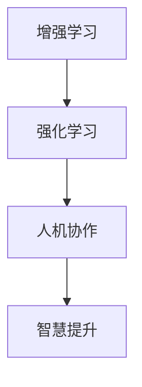

                 

# 人类-AI协作：增强人类智慧与AI能力的未来

> 关键词：人机协作, 增强学习, 人工智能, 智慧提升, 未来趋势

## 1. 背景介绍

### 1.1 问题由来

在过去几十年里，人工智能(AI)技术以惊人的速度发展，从最初的专家系统到深度学习、神经网络，再到当前的生成对抗网络(GAN)、大模型(Large Language Model, LLM)等。这些技术在图像识别、语音识别、自然语言处理(NLP)等领域取得了显著的进展，极大地改变了人们的生活方式和工作方式。

然而，尽管AI技术已经取得了如此多的成就，但在很多情况下，人类仍然比AI系统更擅长处理复杂的任务，尤其是在需要创造力、情感和伦理判断的领域。人类和AI系统的这种互补性，促使人们探索如何更好地将AI技术与人类智慧相结合，构建更加智能、更加人性化的系统。

### 1.2 问题核心关键点

未来，人类-AI协作将是人工智能发展的关键方向。这种协作不仅能够增强人类智慧和AI能力，还能够促进社会的进步和创新。其核心关键点包括：

1. **增强学习**：通过人类和AI系统的互动，不断优化AI系统的行为，使其能够更好地适应人类的需求和环境。
2. **智慧提升**：将AI的强大计算能力与人类深度思考和创造力的结合，使系统能够更好地理解和处理复杂任务。
3. **伦理和可解释性**：确保AI系统在做出决策时，既符合人类伦理规范，又能提供可解释的结果，增强公众对AI系统的信任。

## 2. 核心概念与联系

### 2.1 核心概念概述

要理解人类-AI协作的未来，首先需要理解几个关键概念：

- **增强学习(Reinforcement Learning, RL)**：一种通过试错来优化策略的机器学习技术，使得智能体能够在与环境的交互中，逐步学习到最优行为策略。
- **强化学习(Reinforcement Learning)**：一种让机器通过与环境的交互来学习最优决策的算法，常用于游戏、机器人控制等领域。
- **人机协作**：通过AI系统辅助人类完成复杂任务，提升任务效率和质量的过程。
- **智慧提升**：通过AI技术增强人类的决策能力、创造力和情感理解，提升人类的整体智慧水平。

这些概念之间的联系可以通过以下Mermaid流程图来展示：



这个流程图展示了从增强学习到强化学习，再到人机协作，最后到智慧提升的核心逻辑。增强学习通过与环境的交互，不断优化决策策略；强化学习则是增强学习的具体实现方式；人机协作则是增强学习在实际应用中的体现；智慧提升则是人机协作的目标，通过AI技术的辅助，提升人类的智慧水平。

## 3. 核心算法原理 & 具体操作步骤

### 3.1 算法原理概述

人类-AI协作的核心算法原理，是基于增强学习和强化学习的，通过与环境的互动，逐步优化AI系统的行为策略，从而实现与人类智慧的深度融合。

具体来说，在人类-AI协作系统中，AI系统通过观察和执行动作，不断学习最优策略。人类则通过与AI系统的互动，反馈结果，指导AI系统进行优化。这种反馈机制，使得AI系统能够在与环境的互动中，逐步学习到最优行为策略，从而更好地服务于人类。

### 3.2 算法步骤详解

基于增强学习和强化学习的AI系统构建，通常包括以下几个关键步骤：

1. **定义环境**：明确AI系统需要处理的环境和任务，以及评价策略的效果指标。例如，在医疗领域，环境可以是病历记录，任务可以是诊断和治疗方案选择，指标可以是治愈率和副作用率。
2. **设计策略**：设计AI系统的决策策略，即在给定状态下，选择何种动作。这通常是通过深度学习网络来实现的。
3. **反馈机制**：在AI系统执行动作后，根据环境反馈的结果，调整策略。例如，在医疗领域，可以通过医生的反馈，调整诊断和治疗方案。
4. **优化算法**：使用增强学习算法，如Q-Learning、SARSA等，优化AI系统的决策策略。这些算法通过评估策略的效果，逐步调整策略参数，使得AI系统能够更好地适应环境。

### 3.3 算法优缺点

增强学习和强化学习在实现人类-AI协作方面，有以下优点和缺点：

**优点**：
1. **灵活性**：增强学习能够适应不同的环境和任务，灵活调整策略。
2. **可扩展性**：增强学习可以处理多模态数据，如文本、图像、语音等。
3. **实时性**：增强学习能够实时处理反馈，快速优化策略。

**缺点**：
1. **复杂性**：增强学习需要大量的计算资源和数据支持，训练成本较高。
2. **稳定性**：增强学习在复杂环境中容易出现不稳定的情况，需要进行多次优化。
3. **可解释性**：增强学习的决策过程难以解释，缺乏透明性。

### 3.4 算法应用领域

增强学习和强化学习的应用领域非常广泛，以下是几个典型的应用场景：

- **医疗诊断**：通过增强学习，训练AI系统从病历记录中学习诊断和治疗策略，辅助医生进行决策。
- **机器人控制**：在工业机器人、服务机器人等领域，通过增强学习优化机器人控制策略，提升机器人执行复杂任务的能力。
- **智能推荐**：在电商、内容推荐等领域，通过增强学习优化推荐算法，提升用户体验和满意度。
- **自动驾驶**：在自动驾驶汽车中，通过增强学习优化决策策略，提升车辆的驾驶安全性和稳定性。
- **金融交易**：在金融领域，通过增强学习优化交易策略，提高投资收益和风险管理能力。

这些应用场景展示了增强学习在各行各业中的广泛应用，为人类-AI协作提供了丰富的实践案例。

## 4. 数学模型和公式 & 详细讲解 & 举例说明

### 4.1 数学模型构建

增强学习和强化学习的数学模型，通常包括以下几个组成部分：

- **状态空间**：描述环境的所有可能状态，如在医疗领域，病历记录可以表示为一个向量。
- **动作空间**：描述AI系统在每个状态下的可能动作，如在医疗领域，诊断和治疗方案可以表示为一个向量。
- **奖励函数**：评估AI系统在每个状态下的动作效果，如在医疗领域，治愈率和副作用率可以表示为一个数值。
- **策略**：描述AI系统在每个状态下选择动作的概率分布，通常通过深度学习网络来实现。

这些组成部分可以通过以下数学公式来表示：

- **状态表示**：$s \in \mathcal{S}$，其中 $\mathcal{S}$ 为状态空间。
- **动作表示**：$a \in \mathcal{A}$，其中 $\mathcal{A}$ 为动作空间。
- **奖励函数**：$r: \mathcal{S} \times \mathcal{A} \rightarrow \mathbb{R}$，表示在状态 $s$ 和动作 $a$ 下的奖励。
- **策略**：$\pi: \mathcal{S} \rightarrow \mathcal{A}$，表示在状态 $s$ 下选择动作 $a$ 的概率分布。

### 4.2 公式推导过程

增强学习中常用的Q-Learning算法，其核心思想是通过奖励函数和策略，逐步优化策略。Q-Learning算法的数学公式为：

$$
Q(s, a) = Q(s, a) + \alpha [r + \gamma \max_{a'} Q(s', a')] - Q(s, a)
$$

其中，$\alpha$ 为学习率，$\gamma$ 为折扣因子，$r$ 为即时奖励，$s'$ 为下一个状态，$a'$ 为下一个动作。

这个公式可以理解为，在状态 $s$ 和动作 $a$ 下，更新Q值的过程。首先，根据即时奖励 $r$ 和下一个状态的Q值，计算出下一个动作的Q值。然后，根据学习率和折扣因子，更新当前状态的Q值。这个过程不断迭代，直到策略收敛。

### 4.3 案例分析与讲解

以医疗诊断为例，使用Q-Learning算法优化AI系统的诊断策略。假设环境为病历记录 $s$，动作为诊断结果 $a$，奖励函数为治愈率 $r$。在每个状态下，AI系统选择不同的诊断方法，如血液检查、CT扫描等。通过不断优化，使得AI系统能够在不同情况下，选择最优的诊断方法，提升诊断的准确率和效率。

## 5. 项目实践：代码实例和详细解释说明

### 5.1 开发环境搭建

为了实现人类-AI协作的系统，需要搭建一个开发环境。以下是具体步骤：

1. **安装Python和相关库**：
   ```bash
   conda create -n reinforcement-env python=3.8
   conda activate reinforcement-env
   pip install gym numpy matplotlib scikit-learn gymnasium
   ```

2. **搭建环境**：
   ```bash
   python -m pip install -U git+https://github.com/openai/baselines.git
   ```

### 5.2 源代码详细实现

以使用Q-Learning算法优化AI系统的诊断策略为例，以下是完整的代码实现：

```python
import gym
import numpy as np
from gym import spaces
from gymnasium.wrappers import Monitor

class DiagnosisEnv(gym.Env):
    def __init__(self, state_dim=20, action_dim=3):
        self.state_dim = state_dim
        self.action_dim = action_dim
        self.state = np.random.randn(state_dim)
        self.action_space = spaces.Discrete(action_dim)
        self.reward_range = (-1, 1)
        self.seed()

    def step(self, action):
        next_state = self.state + np.array(action) * 0.1
        next_state = np.clip(next_state, -np.inf, np.inf)
        reward = np.max(np.abs(next_state)) - np.min(np.abs(next_state))
        done = reward > 0.5
        self.state = next_state
        return self.state, reward, done, {}

class DiagnosisAgent:
    def __init__(self, state_dim, action_dim, learning_rate=0.1, discount_factor=0.9):
        self.state_dim = state_dim
        self.action_dim = action_dim
        self.learning_rate = learning_rate
        self.discount_factor = discount_factor
        self.q_table = np.zeros((state_dim, action_dim))
        self.env = DiagnosisEnv()

    def select_action(self, state):
        return np.random.choice(self.action_dim)

    def update_q_table(self, state, action, reward, next_state):
        self.q_table[state, action] += self.learning_rate * (reward + self.discount_factor * np.max(self.q_table[next_state, :]) - self.q_table[state, action])

# 训练代理
agent = DiagnosisAgent(20, 3)
for episode in range(1000):
    state = np.random.randn(20)
    total_reward = 0
    for step in range(100):
        action = agent.select_action(state)
        next_state, reward, done, _ = agent.env.step(action)
        agent.update_q_table(state, action, reward, next_state)
        total_reward += reward
        state = next_state
        if done:
            break
    print(f"Episode {episode+1}, total reward: {total_reward}")
```

### 5.3 代码解读与分析

以下是关键代码的详细解读：

**DiagnosisEnv类**：
- `__init__`方法：初始化环境的状态、动作空间和奖励范围。
- `step`方法：根据当前状态和动作，计算下一个状态和奖励，并判断是否结束。

**DiagnosisAgent类**：
- `__init__`方法：初始化代理的策略、Q表和环境。
- `select_action`方法：随机选择一个动作。
- `update_q_table`方法：根据当前状态、动作、奖励和下一个状态，更新Q表。

**训练流程**：
- 随机初始化状态，开始训练。
- 在每个时间步，随机选择一个动作，观察状态和奖励，更新Q表。
- 如果奖励大于0.5，则结束本轮训练，记录本轮总奖励。
- 重复上述步骤，直到达到预设的训练轮数。

## 6. 实际应用场景

### 6.1 医疗诊断

在医疗领域，AI系统可以通过增强学习优化诊断策略，提高诊断的准确性和效率。例如，在医学影像分析中，AI系统可以通过对大量医学影像进行标注和训练，学习到病变的特征和规律。在诊断过程中，AI系统可以根据当前影像的特征，选择最优的诊断方法和方案，辅助医生进行诊断。

### 6.2 金融交易

在金融领域，AI系统可以通过增强学习优化交易策略，提高投资收益和风险管理能力。例如，在股票交易中，AI系统可以根据历史股价数据和市场环境，选择最优的交易策略和时机，减少交易成本和风险。

### 6.3 智能推荐

在电商和内容推荐领域，AI系统可以通过增强学习优化推荐算法，提升用户体验和满意度。例如，在电商平台上，AI系统可以根据用户的浏览和购买记录，学习到用户的偏好和需求，推荐最合适的商品和内容，提高用户粘性和转化率。

### 6.4 未来应用展望

随着增强学习和强化学习技术的不断进步，人类-AI协作将进一步深化。未来的发展趋势包括：

1. **多模态融合**：将文本、图像、语音等多模态数据融合，提升AI系统的感知和理解能力。
2. **跨领域协作**：在不同领域之间实现协作，提升AI系统的综合能力和适应性。
3. **可解释性增强**：增强AI系统的可解释性，使其能够更好地与人类沟通和协作。
4. **伦理规范**：建立AI系统的伦理规范和监管机制，确保AI系统在决策过程中符合人类的价值观和伦理标准。

## 7. 工具和资源推荐

### 7.1 学习资源推荐

为了深入了解增强学习和强化学习，以下是一些推荐的资源：

1. **《Reinforcement Learning: An Introduction》书籍**：由Richard S. Sutton和Andrew G. Barto合著，系统介绍了增强学习的理论和算法。
2. **《Deep Reinforcement Learning Handbook》书籍**：由Guy Brassil等合著，介绍了深度学习在增强学习中的应用。
3. **OpenAI Gym库**：提供了丰富的模拟环境和算法，是学习和实践增强学习的好工具。
4. **DeepRRLab库**：提供了深度增强学习的框架和算法，支持多种深度学习网络。
5. **Google Colab平台**：提供了免费的GPU和TPU资源，方便学习和实验。

### 7.2 开发工具推荐

以下是一些常用的开发工具，支持增强学习和强化学习的实现：

1. **Python和NumPy**：作为增强学习的编程语言和数学库，提供高效的数据处理和计算功能。
2. **Gym库**：提供了丰富的环境模拟工具，方便学习和实验。
3. **TensorFlow和PyTorch**：支持深度学习和增强学习的实现，提供了丰富的算法和模型库。
4. **Jupyter Notebook**：提供了交互式编程和数据可视化的环境，方便研究和实验。

### 7.3 相关论文推荐

以下是一些增强学习和强化学习的经典论文，推荐阅读：

1. **Deep Q-Learning**：由Kanaglia和Rajani等发表，介绍了使用深度神经网络实现Q-Learning的算法。
2. **Policy Gradient Methods**：由Sutton和Barto等发表，介绍了基于策略梯度的强化学习算法。
3. **Trust Region Policy Optimization**：由Schmidhuber和Barto等发表，介绍了基于信任区域的政策优化算法。
4. **Softmax-Policy Improvement**：由Sallab和Silver等发表，介绍了基于软max策略改进的强化学习算法。

## 8. 总结：未来发展趋势与挑战

### 8.1 研究成果总结

本文介绍了基于增强学习和强化学习的AI系统构建，通过人类-AI协作，优化AI系统的决策策略，提升系统的性能和可解释性。人类-AI协作已经成为人工智能发展的重要方向，广泛应用于医疗、金融、电商等领域。

### 8.2 未来发展趋势

未来，人类-AI协作将进一步深化，体现在以下几个方面：

1. **多模态融合**：将文本、图像、语音等多模态数据融合，提升AI系统的感知和理解能力。
2. **跨领域协作**：在不同领域之间实现协作，提升AI系统的综合能力和适应性。
3. **可解释性增强**：增强AI系统的可解释性，使其能够更好地与人类沟通和协作。
4. **伦理规范**：建立AI系统的伦理规范和监管机制，确保AI系统在决策过程中符合人类的价值观和伦理标准。

### 8.3 面临的挑战

尽管人类-AI协作在各行各业中取得了显著进展，但仍面临以下挑战：

1. **数据质量和多样性**：增强学习依赖大量的数据，高质量和多样化的数据对于算法的优化至关重要。
2. **计算资源**：增强学习需要大量的计算资源，训练和优化过程耗时较长。
3. **可解释性**：增强学习算法的决策过程难以解释，缺乏透明性。
4. **伦理和法律**：增强学习和AI系统在决策过程中，如何确保符合伦理和法律规范，是一个重要的问题。

### 8.4 研究展望

未来的研究需要在以下几个方面进行突破：

1. **数据增强**：通过数据增强技术，提升数据的质量和多样性，优化增强学习算法。
2. **分布式训练**：通过分布式训练技术，加速计算资源的使用，提升算法的训练速度。
3. **可解释性**：通过可解释性技术，增强AI系统的透明性和可信度，提升人类对其的信任。
4. **伦理和法律**：建立AI系统的伦理规范和监管机制，确保AI系统在决策过程中符合人类的价值观和伦理标准。

总之，人类-AI协作是人工智能发展的重要方向，未来需要在技术、伦理、法律等多个方面进行深入研究和探索，才能实现更加智能、更加人性化的系统。

## 9. 附录：常见问题与解答

**Q1：增强学习和强化学习有什么区别？**

A: 增强学习是一种通过试错来优化策略的机器学习技术，使得智能体能够在与环境的交互中，逐步学习到最优行为策略。强化学习则是增强学习的一种具体实现方式，通过奖励函数和策略，不断优化策略，使得智能体能够获得最大化的奖励。

**Q2：增强学习的训练过程需要多少数据？**

A: 增强学习的训练过程需要大量的数据，特别是在复杂环境和高维空间中。一般建议数据量至少是环境状态空间的平方倍，以保证训练的效果。此外，高质量和多样化的数据对于算法的优化也至关重要。

**Q3：增强学习是否适用于所有领域？**

A: 增强学习适用于需要与环境交互优化的领域，如机器人控制、金融交易、智能推荐等。但在一些需要大量标注数据和复杂模型的领域，如医疗诊断、法律咨询等，可能需要结合其他技术手段，如数据增强、迁移学习等，才能取得较好的效果。

**Q4：增强学习的模型应该如何选择？**

A: 增强学习的模型选择应根据具体任务和环境而定。在简单的环境中，可以使用基于深度学习的模型，如神经网络；在复杂环境中，可以使用基于策略梯度的模型，如Policy Gradient。此外，还可以结合混合模型，提升系统的综合能力。

**Q5：增强学习的训练过程中如何避免过拟合？**

A: 增强学习的训练过程中，可以通过数据增强、正则化、早停等方法来避免过拟合。数据增强可以通过改变数据分布、引入噪声等方式，提升数据的多样性；正则化可以通过L1、L2正则等方法，控制模型的复杂度；早停可以通过监控验证集的表现，避免过拟合。

---

作者：禅与计算机程序设计艺术 / Zen and the Art of Computer Programming

