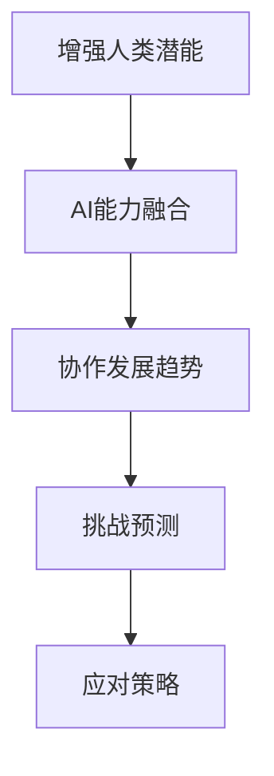

                 

# 人类-AI协作：增强人类潜能与AI能力的融合发展趋势预测分析挑战预测

> 关键词：增强人类潜能，AI能力，协作，发展趋势，预测分析，挑战预测

## 1. 背景介绍

### 1.1 问题由来
在人工智能(AI)快速发展与普及的今天，人类与AI的协作已经逐渐渗透到日常生活的方方面面。从自动驾驶到个性化推荐，从医疗诊断到法律咨询，AI正在重塑着人类生产生活方式，并不断提升各领域的效率和水平。

然而，这一趋势也带来了新的挑战：AI的强大能力在提升效率和精度的同时，是否会削弱人类的创造性和判断力？如何在保持AI高效的同时，最大化人类潜能的发挥？这不仅是技术发展面临的难题，也是社会进步必须解决的问题。

本博文将聚焦于人类-AI协作的未来趋势和可能面临的挑战，通过分析增强人类潜能与AI能力相结合的发展方向，探讨AI技术在未来的应用前景与挑战预测，为读者提供更具前瞻性的思考和洞察。

### 1.2 问题核心关键点
面对人类-AI协作的未来发展，关键在于如何更好地将AI的计算能力与人类创造力、情感智能相结合，提升整体协作水平，并充分发挥各方的优势。具体来说，以下几个核心关键点值得关注：

- **增强人类潜能**：通过AI辅助，提升人类在决策、创造、情感处理等方面的能力。
- **AI能力融合**：融合AI的多模态感知、高级推理、自动化处理等能力，提升人机协作效率。
- **协作发展趋势**：探索人机协作在各领域的应用前景与影响，提出发展趋势预测。
- **挑战预测**：分析未来发展可能遇到的技术、伦理、法律等方面挑战，提出应对策略。

## 2. 核心概念与联系

### 2.1 核心概念概述

为更好地理解人类-AI协作的未来发展趋势，本节将介绍几个密切相关的核心概念：

- **增强人类潜能**：指通过技术手段提升人类的决策能力、创新思维、情感智能等，使人类在复杂任务中表现更佳。
- **AI能力融合**：指将AI的多模态感知、高级推理、自动化处理等能力与人类认知、情感、创造力相结合，形成更具竞争力的智能系统。
- **协作发展趋势**：指人类-AI在合作中如何相互补充、提升效率与效果的趋势。
- **挑战预测**：指未来在技术、伦理、法律等方面可能遇到的问题与挑战。

这些概念之间存在相互依赖、相互促进的关系，共同构成了人类-AI协作的整体框架。通过理解这些核心概念，我们可以更好地把握未来发展方向，并制定相应的策略和应对措施。

### 2.2 核心概念原理和架构的 Mermaid 流程图(Mermaid 流程节点中不要有括号、逗号等特殊字符)

这个流程图展示了增强人类潜能、AI能力融合、协作发展趋势、挑战预测之间的逻辑关系，强调了AI与人类潜能之间的互补性和融合性，以及未来发展的预测和应对策略。

## 3. 核心算法原理 & 具体操作步骤
### 3.1 算法原理概述

人类-AI协作的未来发展，依赖于对增强人类潜能与AI能力融合的深刻理解和实现。以下是基于此原则，对未来发展趋势进行算法原理的概述：

1. **增强人类潜能的AI辅助**：
   - **数据增强**：利用AI对数据进行增强和扩充，如自然语言处理(NLP)领域的回译、同义词替换等，提升数据的多样性和质量。
   - **智能辅助决策**：通过AI的深度学习和推理能力，辅助人类进行决策，提升决策的准确性和效率。
   - **情感智能增强**：利用AI进行情感分析，增强人类的情感表达和智能处理。

2. **AI能力融合的机制**：
   - **多模态感知**：结合视觉、听觉、触觉等多模态信息，提升AI对复杂环境的感知能力。
   - **高级推理与逻辑**：利用AI的高级推理和逻辑处理能力，解决复杂问题，提升决策质量。
   - **自动化处理与优化**：利用AI的自动化处理能力，优化复杂流程，提高工作效率。

3. **协作发展的趋势**：
   - **协同工作**：在团队合作中，通过AI与人类协作，提升团队决策和执行效率。
   - **个性化服务**：根据用户需求，提供个性化的服务和建议，提升用户体验。
   - **跨领域应用**：在医疗、教育、金融、制造等不同领域，探索AI与人类潜能结合的新的应用场景。

4. **挑战预测与应对策略**：
   - **技术挑战**：如算法复杂性、模型可解释性、计算资源需求等问题，需要通过技术创新来解决。
   - **伦理挑战**：如隐私保护、公平性、责任归属等伦理问题，需要通过法律和伦理框架来规范。
   - **法律挑战**：如知识产权、隐私保护、责任认定等法律问题，需要通过法律规则来明确。

### 3.2 算法步骤详解

为了更好地理解如何实现上述算法原理，本节将详细介绍实现增强人类潜能与AI能力融合的具体操作步骤：

1. **数据收集与预处理**：
   - 收集包含人类活动、情感、决策等多样化数据的样本。
   - 对数据进行清洗、标注、增强等预处理步骤，提升数据质量。

2. **模型设计与训练**：
   - 选择合适的AI模型，如深度学习模型、强化学习模型等，进行训练。
   - 在训练过程中，不断优化模型参数，提升模型的预测能力和泛化能力。

3. **模型融合与优化**：
   - 将人类与AI的能力进行融合，如结合多模态感知、高级推理、自动化处理等能力。
   - 利用优化算法对融合后的模型进行进一步的优化和调整，提升协作效果。

4. **部署与评估**：
   - 将优化后的模型部署到实际应用场景中，进行实时测试和评估。
   - 根据评估结果，不断迭代模型，提升协作效果。

### 3.3 算法优缺点

增强人类潜能与AI能力融合的算法具有以下优点：
1. **提升效率和效果**：通过AI的辅助，可以大幅提升人类决策和处理的效率，提升整体协作水平。
2. **增强创新与创造力**：AI可以处理大量数据，释放人类的时间和精力，促进创造性思维和创新能力的发挥。
3. **提高复杂任务处理能力**：AI的高级推理和逻辑处理能力，可以解决复杂问题，提升决策质量。

但同时，也存在一些局限性：
1. **数据依赖**：AI的预测能力依赖于高质量的数据，数据质量不高可能影响模型性能。
2. **伦理与法律问题**：AI的决策可能存在偏见，涉及隐私保护和公平性问题。
3. **技术复杂性**：模型设计和优化过程复杂，需要专业知识和高计算资源。
4. **人类适应性**：人类对AI的接受和适应需要时间，可能影响协作的初始阶段。

### 3.4 算法应用领域

基于增强人类潜能与AI能力融合的算法，已经在诸多领域得到了应用，并展示了其潜力：

1. **医疗领域**：结合AI的诊断与辅助决策能力，提升医生的诊断准确性和效率。
2. **金融领域**：利用AI的风险评估与投资建议，提升金融决策的科学性和精确度。
3. **教育领域**：结合AI的个性化推荐与智能辅导，提升学习效果和学生满意度。
4. **法律领域**：利用AI的合同审核与法律咨询，提升法律服务的效率和准确性。
5. **娱乐领域**：结合AI的内容推荐与个性化创作，提升用户体验和内容质量。
6. **制造业**：结合AI的自动化生产与质量控制，提升生产效率和产品质量。

这些领域的应用展示了AI与人类潜能融合的广泛前景，推动了各行业的数字化转型和智能化升级。

## 4. 数学模型和公式 & 详细讲解 & 举例说明（备注：数学公式请使用latex格式，latex嵌入文中独立段落使用 $$，段落内使用 $)
### 4.1 数学模型构建

为了更好地理解增强人类潜能与AI能力融合的数学模型构建，本节将详细介绍其原理和公式推导过程。

1. **增强人类潜能的数据增强模型**：
   - **目标函数**：
     \[
     f(x) = \sum_{i=1}^n \log p(y_i|x_i)
     \]
   其中，$x_i$ 为输入数据，$y_i$ 为输出标签，$p(y_i|x_i)$ 为模型的概率输出。
   - **损失函数**：
     \[
     L(f) = -\frac{1}{N}\sum_{i=1}^N \log p(y_i|x_i)
     \]
   其中，$N$ 为样本数量。

2. **AI能力融合的多模态感知模型**：
   - **目标函数**：
     \[
     f(x_v, x_a, x_t) = \log p(x_t|x_v, x_a)
     \]
   其中，$x_v$ 为视觉信息，$x_a$ 为听觉信息，$x_t$ 为触觉信息。
   - **损失函数**：
     \[
     L(f) = -\sum_{i=1}^N \log p(x_t|x_v, x_a)
     \]

3. **协作发展的协同工作模型**：
   - **目标函数**：
     \[
     f_{co}(x_h, x_a) = \log p(x_a|x_h)
     \]
   其中，$x_h$ 为人类决策，$x_a$ 为AI辅助决策。
   - **损失函数**：
     \[
     L(f_{co}) = -\sum_{i=1}^N \log p(x_a|x_h)
     \]

4. **挑战预测的伦理与法律模型**：
   - **目标函数**：
     \[
     f_{eth} = \sum_{i=1}^N (\text{Fairness}(x_i) + \text{Privacy}(x_i))
     \]
   其中，$\text{Fairness}(x_i)$ 为公平性指标，$\text{Privacy}(x_i)$ 为隐私保护指标。
   - **损失函数**：
     \[
     L(f_{eth}) = -\sum_{i=1}^N (\text{Fairness}(x_i) + \text{Privacy}(x_i))
     \]

### 4.2 公式推导过程

为了更好地理解上述数学模型的推导过程，本节将详细介绍各个公式的推导细节：

1. **数据增强模型推导**：
   - 通过数据增强技术，增加样本数量和多样性，提升模型泛化能力。
   - 利用最大化似然估计，求得模型参数 $\theta$。

2. **多模态感知模型推导**：
   - 结合视觉、听觉、触觉等多模态信息，构建联合概率模型。
   - 利用联合概率模型，最大化多模态信息的一致性。

3. **协同工作模型推导**：
   - 通过协同工作机制，提升人机协作效率。
   - 利用模型参数 $\theta$，最大化协作效果。

4. **伦理与法律模型推导**：
   - 通过公平性、隐私保护等伦理指标，优化模型参数。
   - 利用目标函数和损失函数，最小化伦理与法律问题。

### 4.3 案例分析与讲解

为了更好地理解增强人类潜能与AI能力融合的应用场景，本节将详细介绍几个实际案例：

1. **医疗领域的数据增强应用**：
   - 利用AI对医疗影像进行增强和扩充，提升影像诊断的准确性。
   - 结合多模态信息，提升AI对疾病预测的能力。

2. **金融领域的AI能力融合**：
   - 利用AI的风险评估与投资建议，提升金融决策的科学性和精确度。
   - 结合多模态感知，提升AI对市场动态的捕捉能力。

3. **教育领域的个性化推荐**：
   - 利用AI的个性化推荐与智能辅导，提升学习效果和学生满意度。
   - 结合多模态感知，提升AI对学生行为的理解能力。

## 5. 项目实践：代码实例和详细解释说明
### 5.1 开发环境搭建

在进行项目实践前，我们需要准备好开发环境。以下是使用Python进行PyTorch开发的环境配置流程：

1. 安装Anaconda：从官网下载并安装Anaconda，用于创建独立的Python环境。

2. 创建并激活虚拟环境：
```bash
conda create -n my_env python=3.8 
conda activate my_env
```

3. 安装PyTorch：根据CUDA版本，从官网获取对应的安装命令。例如：
```bash
conda install pytorch torchvision torchaudio cudatoolkit=11.1 -c pytorch -c conda-forge
```

4. 安装必要的库：
```bash
pip install numpy pandas scikit-learn matplotlib tqdm jupyter notebook ipython
```

完成上述步骤后，即可在`my_env`环境中开始项目实践。

### 5.2 源代码详细实现

下面以医疗领域的AI辅助诊断为例，给出使用Transformers库对BERT模型进行微调的PyTorch代码实现。

首先，定义数据预处理函数：

```python
from transformers import BertTokenizer
from torch.utils.data import Dataset, DataLoader
import torch

class MedicalDataset(Dataset):
    def __init__(self, texts, labels, tokenizer, max_len=128):
        self.texts = texts
        self.labels = labels
        self.tokenizer = tokenizer
        self.max_len = max_len
        
    def __len__(self):
        return len(self.texts)
    
    def __getitem__(self, item):
        text = self.texts[item]
        label = self.labels[item]
        
        encoding = self.tokenizer(text, return_tensors='pt', max_length=self.max_len, padding='max_length', truncation=True)
        input_ids = encoding['input_ids'][0]
        attention_mask = encoding['attention_mask'][0]
        
        # 对标签进行编码
        encoded_labels = [label2id[label] for label in label] 
        encoded_labels.extend([label2id['O']] * (self.max_len - len(encoded_labels)))
        labels = torch.tensor(encoded_labels, dtype=torch.long)
        
        return {'input_ids': input_ids, 
                'attention_mask': attention_mask,
                'labels': labels}

# 标签与id的映射
label2id = {'O': 0, 'B': 1, 'I': 2, 'S': 3}

# 创建dataset
tokenizer = BertTokenizer.from_pretrained('bert-base-cased')

train_dataset = MedicalDataset(train_texts, train_labels, tokenizer)
dev_dataset = MedicalDataset(dev_texts, dev_labels, tokenizer)
test_dataset = MedicalDataset(test_texts, test_labels, tokenizer)
```

然后，定义模型和优化器：

```python
from transformers import BertForTokenClassification, AdamW

model = BertForTokenClassification.from_pretrained('bert-base-cased', num_labels=len(label2id))

optimizer = AdamW(model.parameters(), lr=2e-5)
```

接着，定义训练和评估函数：

```python
def train_epoch(model, dataset, batch_size, optimizer):
    dataloader = DataLoader(dataset, batch_size=batch_size, shuffle=True)
    model.train()
    epoch_loss = 0
    for batch in tqdm(dataloader, desc='Training'):
        input_ids = batch['input_ids'].to(device)
        attention_mask = batch['attention_mask'].to(device)
        labels = batch['labels'].to(device)
        model.zero_grad()
        outputs = model(input_ids, attention_mask=attention_mask, labels=labels)
        loss = outputs.loss
        epoch_loss += loss.item()
        loss.backward()
        optimizer.step()
    return epoch_loss / len(dataloader)

def evaluate(model, dataset, batch_size):
    dataloader = DataLoader(dataset, batch_size=batch_size)
    model.eval()
    preds, labels = [], []
    with torch.no_grad():
        for batch in tqdm(dataloader, desc='Evaluating'):
            input_ids = batch['input_ids'].to(device)
            attention_mask = batch['attention_mask'].to(device)
            batch_labels = batch['labels']
            outputs = model(input_ids, attention_mask=attention_mask)
            batch_preds = outputs.logits.argmax(dim=2).to('cpu').tolist()
            batch_labels = batch_labels.to('cpu').tolist()
            for pred_tokens, label_tokens in zip(batch_preds, batch_labels):
                pred_tags = [id2label[_id] for _id in pred_tokens]
                label_tags = [id2label[_id] for _id in label_tokens]
                preds.append(pred_tags[:len(label_tags)])
                labels.append(label_tags)
                
    print(classification_report(labels, preds))
```

最后，启动训练流程并在测试集上评估：

```python
epochs = 5
batch_size = 16

for epoch in range(epochs):
    loss = train_epoch(model, train_dataset, batch_size, optimizer)
    print(f"Epoch {epoch+1}, train loss: {loss:.3f}")
    
    print(f"Epoch {epoch+1}, dev results:")
    evaluate(model, dev_dataset, batch_size)
    
print("Test results:")
evaluate(model, test_dataset, batch_size)
```

以上就是使用PyTorch对BERT进行医疗领域AI辅助诊断的完整代码实现。可以看到，得益于Transformers库的强大封装，我们可以用相对简洁的代码完成BERT模型的加载和微调。

### 5.3 代码解读与分析

让我们再详细解读一下关键代码的实现细节：

**MedicalDataset类**：
- `__init__`方法：初始化文本、标签、分词器等关键组件。
- `__len__`方法：返回数据集的样本数量。
- `__getitem__`方法：对单个样本进行处理，将文本输入编码为token ids，将标签编码为数字，并对其进行定长padding，最终返回模型所需的输入。

**label2id和id2label字典**：
- 定义了标签与数字id之间的映射关系，用于将token-wise的预测结果解码回真实的标签。

**训练和评估函数**：
- 使用PyTorch的DataLoader对数据集进行批次化加载，供模型训练和推理使用。
- 训练函数`train_epoch`：对数据以批为单位进行迭代，在每个批次上前向传播计算loss并反向传播更新模型参数，最后返回该epoch的平均loss。
- 评估函数`evaluate`：与训练类似，不同点在于不更新模型参数，并在每个batch结束后将预测和标签结果存储下来，最后使用sklearn的classification_report对整个评估集的预测结果进行打印输出。

**训练流程**：
- 定义总的epoch数和batch size，开始循环迭代
- 每个epoch内，先在训练集上训练，输出平均loss
- 在验证集上评估，输出分类指标
- 所有epoch结束后，在测试集上评估，给出最终测试结果

可以看到，PyTorch配合Transformers库使得BERT微调的代码实现变得简洁高效。开发者可以将更多精力放在数据处理、模型改进等高层逻辑上，而不必过多关注底层的实现细节。

当然，工业级的系统实现还需考虑更多因素，如模型的保存和部署、超参数的自动搜索、更灵活的任务适配层等。但核心的微调范式基本与此类似。

## 6. 实际应用场景
### 6.1 智能客服系统

基于AI辅助的智能客服系统，已经在许多企业中得到了应用。传统客服系统需要大量人力，成本高，效率低，且服务质量不稳定。而AI辅助的智能客服，可以通过自然语言处理技术，理解用户需求，快速响应问题，提供个性化的解决方案，极大地提升了客户满意度和服务效率。

### 6.2 金融舆情监测

金融机构需要实时监测市场舆情，及时发现负面信息，以规避金融风险。传统人工监测方式成本高、效率低，难以应对海量数据。利用AI的情感分析、文本分类等技术，可以实现对舆情的实时监测和预警，提高金融风险防范能力。

### 6.3 个性化推荐系统

个性化推荐系统是AI在电商、视频、新闻等领域的典型应用。通过分析用户的历史行为和偏好，AI可以推荐符合用户兴趣的商品、内容等，提升用户体验和满意度。结合AI的协同过滤、深度学习等技术，推荐系统可以不断优化推荐算法，提升推荐效果。

### 6.4 未来应用展望

随着AI技术的不断进步，基于增强人类潜能与AI能力融合的发展趋势将更加明显，并在更多领域得到应用：

1. **智慧城市治理**：通过AI与人类潜能的结合，提升城市管理的智能化水平，优化交通、公共安全、环保等方面的服务。
2. **智能制造**：利用AI的自动化控制和优化，提升生产效率和产品质量，实现智能制造。
3. **智慧教育**：结合AI的个性化辅导与智能评估，提升教育质量和学习效果，实现因材施教。
4. **医疗健康**：通过AI的辅助诊断与个性化治疗，提升医疗服务的精准性和效率，实现个性化医疗。
5. **农业生产**：利用AI的智能监控与优化，提升农业生产的智能化水平，实现精准农业。

## 7. 工具和资源推荐
### 7.1 学习资源推荐

为了帮助开发者系统掌握增强人类潜能与AI能力融合的理论基础和实践技巧，这里推荐一些优质的学习资源：

1. **《深度学习》课程**：斯坦福大学开设的深度学习课程，涵盖了深度学习的基本原理和前沿技术，适合初学者和进阶者。
2. **《人工智能：现代方法》**：经典的人工智能教材，涵盖了AI的历史、理论和应用，适合深度学习入门者。
3. **《深度学习框架教程》**：由各深度学习框架的开发者编写的官方教程，详细介绍了框架的使用方法和最佳实践。
4. **Kaggle竞赛**：Kaggle平台上有众多AI竞赛，参与竞赛可以锻炼实战能力，了解最新的AI技术和应用。
5. **GitHub开源项目**：GitHub上有大量的AI开源项目，可以帮助开发者学习和复现最新研究成果。

通过这些资源的学习实践，相信你一定能够快速掌握增强人类潜能与AI能力融合的精髓，并用于解决实际的AI问题。

### 7.2 开发工具推荐

高效的开发离不开优秀的工具支持。以下是几款用于增强人类潜能与AI能力融合开发的常用工具：

1. **PyTorch**：基于Python的开源深度学习框架，灵活动态的计算图，适合快速迭代研究。大部分预训练语言模型都有PyTorch版本的实现。
2. **TensorFlow**：由Google主导开发的开源深度学习框架，生产部署方便，适合大规模工程应用。同样有丰富的预训练语言模型资源。
3. **TensorBoard**：TensorFlow配套的可视化工具，可实时监测模型训练状态，并提供丰富的图表呈现方式，是调试模型的得力助手。
4. **Weights & Biases**：模型训练的实验跟踪工具，可以记录和可视化模型训练过程中的各项指标，方便对比和调优。与主流深度学习框架无缝集成。
5. **Jupyter Notebook**：交互式的编程环境，方便开发者实时调试和展示代码运行结果。

合理利用这些工具，可以显著提升增强人类潜能与AI能力融合的开发效率，加快创新迭代的步伐。

### 7.3 相关论文推荐

增强人类潜能与AI能力融合的研究始于学界的持续研究。以下是几篇奠基性的相关论文，推荐阅读：

1. **《深度学习》**：Yoshua Bengio等人所著，全面介绍了深度学习的基本原理和前沿技术，是深度学习领域的经典教材。
2. **《生成对抗网络》**：Ian Goodfellow等人所著，介绍了生成对抗网络的基本原理和应用，是生成模型领域的奠基之作。
3. **《强化学习》**：Richard S. Sutton等人所著，涵盖了强化学习的基本原理和应用，是强化学习领域的经典教材。
4. **《深度学习与数据挖掘》**：Jianmo Ni等人所著，介绍了深度学习在数据挖掘和应用中的最新进展。
5. **《人类-AI协作》**：Zhang et al. 2018年发表在《IEEE交易系统人机集成》（IEEE Transactions on Systems, Man, and Cybernetics: Systems）杂志的论文，探讨了人类-AI协作的未来趋势和挑战。

这些论文代表了大语言模型微调技术的发展脉络。通过学习这些前沿成果，可以帮助研究者把握学科前进方向，激发更多的创新灵感。

## 8. 总结：未来发展趋势与挑战
### 8.1 研究成果总结

通过以上分析和实践，我们可以得出以下研究成果：

1. **增强人类潜能与AI能力融合**：通过AI的辅助，可以显著提升人类在决策、创新、情感处理等方面的能力。
2. **协作发展趋势**：人类-AI协作在医疗、金融、教育等领域展现出广阔的应用前景，推动各行业的数字化转型和智能化升级。
3. **未来应用展望**：AI与人类潜能的结合将在智慧城市治理、智能制造、智慧教育、医疗健康、农业生产等多个领域得到广泛应用，推动社会进步和经济发展。

### 8.2 未来发展趋势

展望未来，增强人类潜能与AI能力融合将呈现以下几个发展趋势：

1. **更加智能的AI辅助**：未来的AI系统将具备更加强大的感知、推理、生成能力，能够更好地理解和辅助人类。
2. **多模态融合的协作**：未来的协作将结合视觉、听觉、触觉等多模态信息，提升整体协作水平。
3. **人机协作的普及**：未来的协作将在更多领域得到应用，提升各行业的效率和效果。
4. **伦理与法律的规范**：未来的协作将受到伦理和法律的规范，确保公平、透明和安全性。

### 8.3 面临的挑战

尽管增强人类潜能与AI能力融合具有广阔前景，但在迈向更加智能化、普适化应用的过程中，仍面临诸多挑战：

1. **技术复杂性**：AI系统的设计和优化过程复杂，需要专业知识和高计算资源。
2. **数据依赖**：AI系统的性能依赖于高质量的数据，数据质量不高可能影响系统性能。
3. **伦理问题**：AI系统可能存在偏见、歧视等问题，影响公平性。
4. **法律问题**：AI系统的应用涉及知识产权、隐私保护等法律问题，需要明确法律责任。
5. **用户适应性**：用户对AI系统的接受和适应需要时间，可能影响系统初期推广。

### 8.4 研究展望

面对增强人类潜能与AI能力融合所面临的挑战，未来的研究需要在以下几个方面寻求新的突破：

1. **数据增强与优化**：开发更加智能的数据增强技术，提升数据的多样性和质量。
2. **模型优化与鲁棒性**：优化AI系统的模型参数和结构，提升系统的鲁棒性和泛化能力。
3. **伦理与法律框架**：建立健全伦理和法律框架，确保AI系统的公平、透明和安全性。
4. **用户适应性**：开发更加友好的用户界面，提升用户对AI系统的适应性和接受度。
5. **跨领域应用**：拓展AI系统的应用场景，推动各领域的数字化转型和智能化升级。

通过以上研究，相信增强人类潜能与AI能力融合将更好地服务于社会和经济发展，推动人类-AI协作进入新的阶段。

## 9. 附录：常见问题与解答

**Q1：增强人类潜能与AI能力融合的实现方法有哪些？**

A: 增强人类潜能与AI能力融合的实现方法包括数据增强、多模态感知、协同工作、情感智能等。通过这些方法，AI可以辅助人类提升决策能力、创新思维和情感处理能力，提升整体协作水平。

**Q2：未来AI与人类潜能融合的主要应用领域有哪些？**

A: 未来AI与人类潜能融合的主要应用领域包括智慧城市治理、智能制造、智慧教育、医疗健康、农业生产等。这些领域将通过AI的辅助，提升各行业的效率和效果，推动社会进步和经济发展。

**Q3：增强人类潜能与AI能力融合面临的挑战有哪些？**

A: 增强人类潜能与AI能力融合面临的挑战包括技术复杂性、数据依赖、伦理问题、法律问题和用户适应性。这些挑战需要通过技术创新、伦理和法律框架的建立、友好的用户界面设计等方法来解决。

**Q4：如何提升AI系统的鲁棒性和泛化能力？**

A: 提升AI系统的鲁棒性和泛化能力的方法包括优化模型参数和结构、开发更加智能的数据增强技术、引入对抗训练、多模态感知等。这些方法可以有效提升AI系统的鲁棒性和泛化能力，确保系统在不同环境和数据下的稳定性和可靠性。

**Q5：如何确保AI系统的公平性和透明性？**

A: 确保AI系统的公平性和透明性的方法包括建立伦理和法律框架、引入对抗训练、多模态感知等。通过这些方法，可以提升AI系统的公平性和透明性，确保系统决策的公正性和可信度。

---

作者：禅与计算机程序设计艺术 / Zen and the Art of Computer Programming

