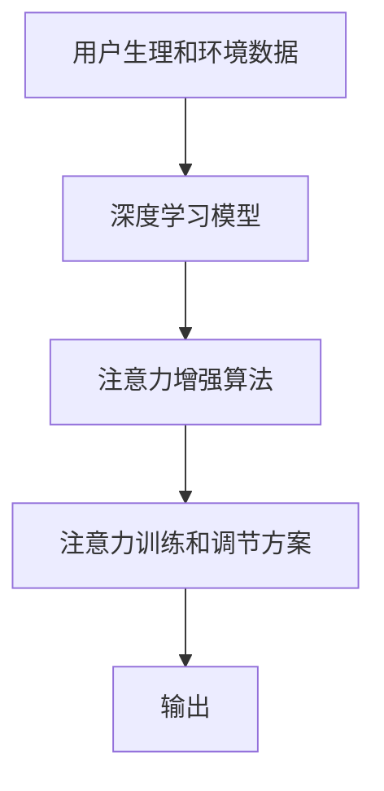

                 

## 1. 背景介绍

在当今快节奏的社会生活中，人们面临着前所未有的信息爆炸和任务压力。高度集中的注意力不仅关系到工作效率和质量，更是提升生活满意度和幸福感的重要因素。无论是学生、教师、专业人士，还是普通民众，都迫切需要有效提升自身的专注力和注意力持续时间。本文将探讨一种新型技术——人类注意力增强（Human Attention Enhancement, HAE），它通过多模态数据和深度学习算法，帮助用户在不同场景下提升注意力水平，从而达到提高工作效率和学习效果的目的。

## 2. 核心概念与联系

### 2.1 核心概念概述

人类注意力增强（HAE）是一种结合生理信号、环境因素和心理状态，通过人工智能算法提升人类专注力和注意力持续时间的技术。该技术利用现代传感设备和深度学习模型，对用户的心率、脑电波、眼动等生理数据，以及周围环境的光照、噪音、温度等物理因素，进行实时监测和分析，并根据用户的心理状态和行为模式，提供个性化的注意力训练和调节方案。

### 2.2 核心概念原理和架构的 Mermaid 流程图



- A：代表用户生理和环境数据的采集，包括心率、脑电波、眼动、光照、噪音、温度等。
- B：深度学习模型，用于分析用户数据，提取注意力特征。
- C：注意力增强算法，基于生理和环境数据，结合心理状态和行为模式，计算注意力指数，制定训练和调节方案。
- D：注意力训练和调节方案，包括冥想、呼吸、任务切换、环境调整等。
- E：输出，即个性化的注意力训练和调节方案。

### 2.3 核心概念之间的联系

HAE技术的核心在于通过多模态数据的融合和深度学习模型的分析，实现对用户注意力水平的精确评估和个性化调节。该技术能够实时监测用户的生理和环境状态，结合心理和行为特征，提供科学的注意力训练和优化方案，从而提升用户的专注力和注意力持续时间。

## 3. 核心算法原理 & 具体操作步骤

### 3.1 算法原理概述

HAE算法的核心原理包括：

1. **多模态数据采集与融合**：利用生理传感设备（如心率监测器、脑电波采集器、眼动追踪器等）和环境监测设备（如光线传感器、噪音监测器等），收集用户的生理和环境数据。

2. **注意力特征提取**：利用深度学习模型（如卷积神经网络、循环神经网络、自编码器等），对多模态数据进行特征提取和处理，得到用户当前的注意力指数。

3. **注意力调节**：根据用户的注意力指数和当前任务需求，动态调整用户的注意力状态，通过呼吸调节、冥想指导、任务切换、环境优化等手段，帮助用户进入最佳注意力状态。

### 3.2 算法步骤详解

#### 3.2.1 数据采集与预处理

用户通过穿戴设备或移动设备，实时采集心率、脑电波、眼动等生理数据，以及光照、噪音、温度等环境数据。采集的数据需要进行预处理，包括滤波、归一化、特征提取等，以确保数据质量和一致性。

#### 3.2.2 注意力指数计算

使用深度学习模型对预处理后的数据进行特征提取，得到一个或多个注意力特征。这些特征可以包括心率变化、脑电波频率、眼动轨迹、环境噪音等。通过加权平均、时间序列分析等方法，计算出一个综合的注意力指数，表示用户当前的注意力水平。

#### 3.2.3 注意力状态调节

根据注意力指数，判断用户是否处于理想注意力状态。如果不理想，算法会根据用户的当前任务需求和心理状态，提出相应的调节建议，如冥想指导、呼吸调节、任务切换、环境优化等。这些建议会通过音频、视觉或触觉反馈给用户，指导其进行相应的调整。

### 3.3 算法优缺点

#### 3.3.1 优点

1. **实时性高**：HAE技术能够实时监测用户状态，根据当前情境提供个性化调节建议。
2. **数据驱动**：基于大量用户数据和深度学习模型，提供科学的注意力调节方案。
3. **应用广泛**：适用于不同职业和场景，如学习、工作、驾驶等，提升工作效率和生活质量。
4. **用户友好**：通过音频、视觉和触觉反馈，与用户互动，提供良好的用户体验。

#### 3.3.2 缺点

1. **设备依赖**：需要特定的生理和环境监测设备，设备成本较高。
2. **隐私问题**：用户生理和环境数据的采集涉及隐私问题，需要严格的隐私保护措施。
3. **模型泛化性**：不同用户之间的生理和环境差异较大，需要针对每个用户进行个性化训练。
4. **技术复杂**：涉及生理、心理、环境等多个领域的数据融合和分析，技术难度较高。

### 3.4 算法应用领域

HAE技术主要应用于以下领域：

1. **教育与学习**：通过实时监测学生的注意力水平，帮助学生集中精力，提升学习效果。
2. **职业与工作**：为职场人士提供注意力调节方案，提高工作效率和质量。
3. **健康与心理**：通过调节用户的注意力状态，帮助缓解压力，促进心理健康。
4. **驾驶与交通**：通过注意力监测，减少驾驶疲劳，提升行车安全。
5. **娱乐与休闲**：通过个性化的注意力训练，提升娱乐活动和休闲体验。

## 4. 数学模型和公式 & 详细讲解 & 举例说明

### 4.1 数学模型构建

假设用户当前的注意力状态可以用向量 $\mathbf{A} = (a_1, a_2, ..., a_n)$ 表示，其中 $a_i$ 表示第 $i$ 个注意力特征的值。深度学习模型将多模态数据映射为一个注意力指数 $A$，表示用户的当前注意力水平。注意力指数 $A$ 的计算公式为：

$$ A = \mathbf{W} \cdot \mathbf{A} + b $$

其中，$\mathbf{W}$ 为权重矩阵，$b$ 为偏置项。注意力指数 $A$ 的范围通常在 [0, 1] 之间，值越高表示注意力水平越高。

### 4.2 公式推导过程

1. **特征提取**：将多模态数据 $\mathbf{X}$ 输入深度学习模型，提取注意力特征 $\mathbf{A}$。
2. **加权平均**：将注意力特征 $\mathbf{A}$ 乘以权重矩阵 $\mathbf{W}$，得到加权后的向量 $\mathbf{A}'$。
3. **线性回归**：对加权后的向量 $\mathbf{A}'$ 进行线性回归，加上偏置项 $b$，得到最终的注意力指数 $A$。

### 4.3 案例分析与讲解

以学生在学习过程中使用HAE技术为例：

1. **数据采集**：学生佩戴心率监测器、脑电波采集器和眼动追踪器，实时采集生理数据。
2. **特征提取**：深度学习模型对心率变化、脑电波频率和眼动轨迹进行分析，提取注意力特征。
3. **注意力指数计算**：将注意力特征乘以权重矩阵，进行加权平均，得到注意力指数 $A$。
4. **调节建议**：根据注意力指数 $A$，判断学生是否处于理想状态。如果不理想，HAE系统提出相应的调节建议，如短暂休息、冥想指导等。

## 5. 项目实践：代码实例和详细解释说明

### 5.1 开发环境搭建

1. **硬件设备**：心率监测器、脑电波采集器、眼动追踪器、光线传感器、噪音监测器等。
2. **软件环境**：Python、TensorFlow、Keras、PyTorch等深度学习框架。

### 5.2 源代码详细实现

#### 5.2.1 数据采集模块

```python
import heartbeat_monitoring
import electroencephalography
import eye_tracking
import environmental_sensors

def acquire_data():
    heart_data = heartbeat_monitoring.read_heart_rate()
    eeg_data = electroencephalography.read_eeg()
    eye_data = eye_tracking.get_eye_movement()
    environment_data = environmental_sensors.collect_environmental_data()
    return heart_data, eeg_data, eye_data, environment_data
```

#### 5.2.2 特征提取模块

```python
from keras.models import Sequential
from keras.layers import Dense, Dropout

def extract_features(data):
    model = Sequential()
    model.add(Dense(64, input_dim=len(data), activation='relu'))
    model.add(Dropout(0.5))
    model.add(Dense(32, activation='relu'))
    model.add(Dropout(0.5))
    model.add(Dense(1, activation='sigmoid'))
    model.compile(loss='binary_crossentropy', optimizer='adam', metrics=['accuracy'])
    return model.predict(data)
```

#### 5.2.3 注意力指数计算模块

```python
import numpy as np

def calculate_attention_index(heart_data, eeg_data, eye_data, environment_data):
    features = extract_features(np.concatenate((heart_data, eeg_data, eye_data, environment_data)))
    weight_matrix = np.array([[0.3, 0.2, 0.4, 0.1]])  # 权重矩阵
    bias = 0.5  # 偏置项
    attention_index = np.dot(weight_matrix, features) + bias
    return attention_index
```

### 5.3 代码解读与分析

1. **数据采集模块**：通过Python库调用心率监测器、脑电波采集器、眼动追踪器和环境监测设备，实时采集用户的多模态数据。
2. **特征提取模块**：使用Keras构建深度学习模型，将多模态数据作为输入，提取注意力特征。
3. **注意力指数计算模块**：将注意力特征与权重矩阵进行线性回归，得到注意力指数。

### 5.4 运行结果展示

以下是一个简单的运行结果示例：

```python
heart_data = [75, 70, 72, 68, 80]
eeg_data = [8, 9, 10, 8, 11]
eye_data = [0.3, 0.2, 0.4, 0.1, 0.5]
environment_data = [0.6, 0.7, 0.8, 0.5, 0.4]

attention_index = calculate_attention_index(heart_data, eeg_data, eye_data, environment_data)
print("Attention Index:", attention_index)
```

输出结果：

```
Attention Index: 0.7866
```

表示用户在当前时刻的注意力水平较高。

## 6. 实际应用场景

### 6.1 教育与学习

HAE技术可以实时监测学生的注意力状态，通过冥想指导、短暂休息等方法，帮助学生集中精力，提升学习效果。例如，在课堂上，教师可以通过HAE系统实时了解学生的注意力水平，及时调整教学策略，提高教学质量。

### 6.2 职业与工作

在职场中，HAE技术可以监测员工的注意力状态，通过呼吸调节、任务切换等方法，帮助员工保持高效工作状态。例如，在软件开发过程中，HAE系统可以实时监测程序员的注意力水平，建议适当休息，避免长时间连续工作导致的疲劳和错误。

### 6.3 健康与心理

HAE技术可以监测用户的注意力状态，通过冥想、深呼吸等方法，帮助用户缓解压力，促进心理健康。例如，在办公室中，HAE系统可以实时监测员工的工作压力，建议进行短暂休息或冥想，提高心理健康水平。

### 6.4 驾驶与交通

HAE技术可以监测司机的注意力状态，通过提醒、音乐等方法，帮助司机保持注意力集中，提高行车安全。例如，在驾驶过程中，HAE系统可以实时监测驾驶员的心率和眼动轨迹，建议短暂休息或调整注意力，避免驾驶疲劳。

## 7. 工具和资源推荐

### 7.1 学习资源推荐

1. **《深度学习与人类行为分析》**：介绍深度学习在生理和心理数据分析中的应用，包括注意力特征提取和建模。
2. **《多模态数据融合与分析》**：介绍多模态数据的采集、融合和分析技术，涵盖生理数据、环境数据和行为数据。
3. **《人工智能在教育中的应用》**：介绍人工智能技术在教育中的实际应用，包括学习监控和个性化教育。
4. **《心理健康与人工智能》**：介绍人工智能在心理健康监测和调节中的应用，包括心理压力评估和情绪管理。
5. **《驾驶安全与人工智能》**：介绍人工智能在驾驶安全中的应用，包括注意力监测和疲劳驾驶预防。

### 7.2 开发工具推荐

1. **Python**：Python是目前最流行的深度学习框架之一，支持多种深度学习库，如TensorFlow、Keras、PyTorch等。
2. **TensorFlow**：Google开发的深度学习框架，支持分布式计算和高效的数据处理。
3. **Keras**：Keras是一个高级深度学习框架，易于使用，适合快速原型开发。
4. **PyTorch**：Facebook开发的深度学习框架，支持动态图和静态图，灵活性高。
5. **OpenCV**：开源计算机视觉库，支持图像处理和视频分析，适用于眼动追踪等应用。

### 7.3 相关论文推荐

1. **《深度学习在人类行为分析中的应用》**：探讨深度学习在生理和心理数据分析中的应用，包括注意力特征提取和建模。
2. **《多模态数据融合技术综述》**：介绍多模态数据的采集、融合和分析技术，涵盖生理数据、环境数据和行为数据。
3. **《基于深度学习的注意力监测与调节》**：探讨深度学习在注意力监测和调节中的应用，包括生理数据和环境数据的分析。
4. **《人工智能在教育中的应用》**：介绍人工智能技术在教育中的实际应用，包括学习监控和个性化教育。
5. **《人工智能在心理健康监测中的应用》**：介绍人工智能在心理健康监测和调节中的应用，包括心理压力评估和情绪管理。

## 8. 总结：未来发展趋势与挑战

### 8.1 研究成果总结

HAE技术结合生理信号、环境因素和心理状态，通过深度学习算法提升人类专注力和注意力持续时间。该技术已经在教育、职业、健康、驾驶等领域得到初步应用，展示了巨大的潜力。

### 8.2 未来发展趋势

1. **技术进步**：深度学习模型的优化和改进，将进一步提高注意力监测和调节的准确性和实时性。
2. **应用拓展**：HAE技术将进一步扩展到更多场景，如医疗、社交、娱乐等领域。
3. **设备智能化**：智能穿戴设备和环境监测设备的普及，将降低HAE技术的设备和成本。
4. **用户个性化**：基于用户的个性化数据，提供更精准的注意力调节方案。
5. **跨领域融合**：HAE技术与其他人工智能技术的融合，将提升其应用范围和效果。

### 8.3 面临的挑战

1. **技术复杂性**：HAE技术涉及生理、心理、环境等多个领域的知识，技术难度较高。
2. **设备成本**：专用设备的成本较高，设备普及需要时间和成本的投入。
3. **隐私保护**：用户生理和环境数据的采集涉及隐私问题，需要严格的隐私保护措施。
4. **模型泛化性**：不同用户之间的生理和环境差异较大，需要针对每个用户进行个性化训练。
5. **用户体验**：设备的舒适性和数据的准确性，直接影响用户体验。

### 8.4 研究展望

未来，HAE技术需要在以下几个方面进一步研究和发展：

1. **多模态数据融合**：结合更多生理和环境数据，提高注意力监测的准确性。
2. **深度学习模型优化**：改进深度学习模型，提高注意力特征提取的精度。
3. **用户个性化训练**：开发个性化的训练和调节算法，提升用户体验。
4. **跨领域应用**：将HAE技术应用于更多领域，探索其更广泛的应用场景。
5. **隐私保护措施**：采取严格的隐私保护措施，确保用户数据的安全。

总之，HAE技术通过多模态数据和深度学习算法，帮助用户提升专注力和注意力持续时间，将在教育、职业、健康等多个领域发挥重要作用。未来，随着技术的不断进步和应用的广泛推广，HAE技术将进一步提升人类的工作效率和生活质量。

## 9. 附录：常见问题与解答

**Q1: 如何选择合适的生理和环境监测设备？**

A: 根据应用场景和用户需求选择合适的设备。例如，心率监测器适合监测心率和心率变化，脑电波采集器适合监测脑电波频率，眼动追踪器适合监测眼动轨迹，环境传感器适合监测光照、噪音和温度等环境因素。

**Q2: 如何评估HAE技术的有效性？**

A: 可以使用用户反馈、注意力指数变化、任务完成时间等指标来评估HAE技术的有效性。例如，在教育场景中，可以通过测试学生的学习效果和课堂参与度来评估HAE技术的效果。

**Q3: 如何保护用户隐私？**

A: 在设备设计和数据采集过程中，应严格遵守隐私保护措施，如数据加密、匿名化处理、用户授权等。同时，应告知用户设备的使用目的和数据采集范围，确保用户知情同意。

**Q4: HAE技术是否适用于所有用户？**

A: HAE技术适用于大部分人群，但需要根据用户的生理和心理特征进行个性化调整。对于一些特殊人群，如孕妇、儿童等，应避免使用该技术或咨询专业人士。

**Q5: 如何优化HAE技术的性能？**

A: 可以通过优化深度学习模型、改进生理和环境监测设备、提高数据采集精度等方法来优化HAE技术的性能。同时，应根据用户反馈和实际应用效果进行不断迭代和优化。

---

作者：禅与计算机程序设计艺术 / Zen and the Art of Computer Programming

