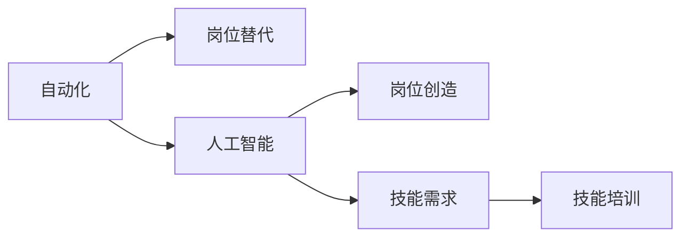

                 

## 1. 背景介绍

### 1.1 问题由来

随着人工智能技术的飞速发展，特别是深度学习、自然语言处理、计算机视觉等领域的突破，自动化、智能化水平在各个行业中不断提升。这些技术的发展正在深刻影响就业市场的结构、形态与技能需求。一方面，机器和算法正在取代一些重复性高、技术含量低的岗位；另一方面，新的智能化岗位正在涌现，对于高水平、高技术技能人才的需求也在日益增长。

### 1.2 问题核心关键点

对于未来就业市场的影响，从以下几个方面进行详细探讨：
- **岗位替代**：哪些岗位最容易受到自动化和人工智能的影响？
- **岗位创造**：人工智能会创造哪些新的就业岗位？
- **技能需求**：AI时代对于劳动者的技能需求有哪些变化？
- **教育培训**：如何适应AI时代的技能培训发展趋势？

### 1.3 问题研究意义

探讨AI时代的就业市场变化，对于职业规划、教育培训体系的改革、政策制定等都具有重要意义。明确哪些岗位将受冲击，哪些领域需重点培养新技能，是助力社会稳定、就业市场动态平衡的关键。通过深入研究，可以为职业人士提供准确的市场预期，帮助他们做出合理的职业选择和技能提升决策。

## 2. 核心概念与联系

### 2.1 核心概念概述

- **自动化**：使用机器、软件等自动化工具，替代人力完成重复性工作。
- **人工智能**：通过算法和数据，使机器具备类人智能，如学习、推理、决策能力。
- **岗位替代**：指机器和算法取代人力完成原本由人类从事的工作。
- **岗位创造**：指因AI技术应用而创造出的新工作岗位。
- **技能需求**：AI时代对于劳动者的技能要求变化。
- **技能培训**：教育体系中关于技能提升和转型的培训项目。

### 2.2 核心概念原理和架构的 Mermaid 流程图



### 2.3 核心概念之间的联系

1. **自动化与岗位替代**：自动化技术的发展使得重复性高、技术含量低的工作被机器取代，对人类就业构成冲击。
2. **人工智能与岗位创造**：AI技术的广泛应用创造了新的智能化岗位，如数据科学家、AI算法工程师、机器人维护等。
3. **技能需求与岗位创造**：AI技术的发展对技能需求产生了新的要求，如数据分析、编程、系统维护等。
4. **技能培训与岗位替代**：为了应对岗位替代，需要重新培训和提升劳动者的技能，以适应新的就业需求。

## 3. 核心算法原理 & 具体操作步骤

### 3.1 算法原理概述

AI时代就业市场变化的核心算法原理可以简单概括为**岗位影响度分析**和**技能需求匹配**。

#### 3.1.1 岗位影响度分析

基于自动化和AI技术对不同岗位的替代可能性进行评估。具体步骤如下：
1. **自动化可替代性评估**：使用现有自动化技术，评估不同岗位的重复性和技术含量。
2. **AI影响评估**：使用AI技术，评估哪些岗位可以被机器替代。
3. **岗位影响度排序**：将影响程度高的岗位排序，确定优先替代的岗位。

#### 3.1.2 技能需求匹配

基于就业市场需求，匹配未来岗位所需的技能。具体步骤如下：
1. **技能需求识别**：通过分析未来就业市场需求，识别关键岗位技能。
2. **技能差距分析**：评估现有劳动力的技能水平与未来岗位需求之间的差距。
3. **技能培训推荐**：基于技能差距，提出技能提升建议和培训课程设计。

### 3.2 算法步骤详解

#### 3.2.1 岗位影响度分析

1. **自动化可替代性评估**：使用“可替代指数”模型，评估岗位的自动化替代可能性。
   - 可替代指数 = 岗位重复性 + 岗位技术含量
2. **AI影响评估**：使用“AI替代指数”模型，评估岗位的AI替代可能性。
   - AI替代指数 = AI技术普及度 + 岗位决策复杂度
3. **岗位影响度排序**：将两个指数综合，排序确定优先替代的岗位。
   - 岗位影响度 = (可替代指数 + AI替代指数) / 2

#### 3.2.2 技能需求匹配

1. **技能需求识别**：基于未来就业市场需求分析，识别关键岗位所需技能。
2. **技能差距分析**：通过技能评估工具，对现有劳动力进行技能水平评估。
3. **技能培训推荐**：根据技能差距，推荐针对性培训课程。

### 3.3 算法优缺点

#### 3.3.1 优点

1. **科学性**：使用数据分析模型，评估岗位影响度和技能需求，具有科学依据。
2. **系统性**：通过系统化流程，确保每个步骤都能精细化执行，结果更全面。
3. **前瞻性**：基于未来趋势，为劳动力技能培训提供参考。

#### 3.3.2 缺点

1. **数据依赖性**：依赖于岗位、技术、市场需求等数据的完整性和准确性。
2. **模型复杂性**：多个评估模型的综合应用，增加计算复杂度。
3. **时效性**：技术发展迅速，数据需不断更新，模型需定期维护。

### 3.4 算法应用领域

- **就业市场分析**：政府、企业、教育机构等使用该算法进行就业市场分析，制定劳动力规划和培训政策。
- **职业规划与咨询**：职业人士使用该算法进行职业规划，评估岗位替代风险和技能需求。
- **教育培训体系设计**：教育机构使用该算法设计技能培训课程，确保教育内容的前沿性和实用性。

## 4. 数学模型和公式 & 详细讲解 & 举例说明

### 4.1 数学模型构建

#### 4.1.1 岗位影响度模型

设岗位集合为 $S$，自动化可替代指数为 $R_A$，AI替代指数为 $R_{AI}$。

岗位影响度模型可表示为：

$$
I(S_i) = \frac{R_A(S_i) + R_{AI}(S_i)}{2}
$$

其中，$I(S_i)$ 表示岗位 $S_i$ 的影响度。

#### 4.1.2 技能差距模型

设现有劳动力技能集合为 $L$，未来岗位技能集合为 $D$。

技能差距模型可表示为：

$$
G(L_i, D_j) = \sum_{i \in L} \sum_{j \in D} |L_i - D_j|
$$

其中，$G(L_i, D_j)$ 表示现有技能与未来岗位需求之间的差距。

### 4.2 公式推导过程

#### 4.2.1 岗位影响度模型推导

由定义可得：

$$
I(S_i) = \frac{R_A(S_i) + R_{AI}(S_i)}{2}
$$

假设 $R_A(S_i)$ 和 $R_{AI}(S_i)$ 的取值范围分别为 $[0, 1]$，则：

$$
I(S_i) \in [0, 1]
$$

当 $I(S_i) = 1$ 时，表示该岗位被完全替代。

#### 4.2.2 技能差距模型推导

由定义可得：

$$
G(L_i, D_j) = \sum_{i \in L} \sum_{j \in D} |L_i - D_j|
$$

设技能差距矩阵为 $G$，则：

$$
G = \begin{bmatrix}
G(L_1, D_1) & G(L_1, D_2) & \cdots & G(L_1, D_n) \\
G(L_2, D_1) & G(L_2, D_2) & \cdots & G(L_2, D_n) \\
\vdots & \vdots & \ddots & \vdots \\
G(L_m, D_1) & G(L_m, D_2) & \cdots & G(L_m, D_n)
\end{bmatrix}
$$

### 4.3 案例分析与讲解

#### 案例一：制造业自动化

**背景**：
- 制造业生产线上的重复性操作岗位，如焊接、装配等，受自动化影响较大。
- AI技术在质量检测、故障诊断等环节的应用也在逐步增加。

**分析过程**：
1. **自动化可替代性评估**：使用“可替代指数”模型，评估各岗位的重复性和技术含量。
   - 焊接岗位重复性高，技术含量一般，可替代指数高。
   - 装配岗位重复性一般，技术含量较高，可替代指数中等。
   - 质量检测岗位重复性低，技术含量高，可替代指数低。
2. **AI影响评估**：使用“AI替代指数”模型，评估各岗位的AI替代可能性。
   - 焊接岗位决策复杂度低，AI普及度一般，AI替代指数低。
   - 装配岗位决策复杂度中等，AI普及度中等，AI替代指数中等。
   - 质量检测岗位决策复杂度高，AI普及度高，AI替代指数高。
3. **岗位影响度排序**：将两个指数综合，排序确定优先替代的岗位。
   - 焊接岗位影响度高，装配岗位次之，质量检测岗位影响度低。

#### 案例二：金融行业AI

**背景**：
- 金融行业利用AI技术进行风险评估、交易策略优化等。
- 部分岗位，如数据录入、客户服务等，受自动化影响较大。

**分析过程**：
1. **自动化可替代性评估**：使用“可替代指数”模型，评估各岗位的重复性和技术含量。
   - 数据录入岗位重复性高，技术含量低，可替代指数高。
   - 客户服务岗位重复性高，技术含量中等，可替代指数中等。
   - 风险评估岗位重复性低，技术含量高，可替代指数低。
2. **AI影响评估**：使用“AI替代指数”模型，评估各岗位的AI替代可能性。
   - 数据录入岗位决策复杂度低，AI普及度高，AI替代指数高。
   - 客户服务岗位决策复杂度中等，AI普及度中等，AI替代指数中等。
   - 风险评估岗位决策复杂度高，AI普及度中等，AI替代指数中等。
3. **岗位影响度排序**：将两个指数综合，排序确定优先替代的岗位。
   - 数据录入岗位影响度高，客户服务岗位次之，风险评估岗位影响度低。

## 5. 项目实践：代码实例和详细解释说明

### 5.1 开发环境搭建

#### 5.1.1 工具和平台选择

- Python 环境：使用 Anaconda 或 Miniconda，安装必要的库，如 NumPy、Pandas、Matplotlib 等。
- 数据集准备：收集岗位、技能等数据，进行预处理和格式化。
- 开发工具：使用 Jupyter Notebook 或 VSCode 进行代码编写和调试。

#### 5.1.2 数据处理

1. **数据采集**：
   - 岗位数据：从招聘网站、行业报告等渠道获取岗位信息，包括岗位名称、技术要求等。
   - 技能数据：通过职业资格认证、在线课程等获取技能信息，包括技能名称、认证难度等。

2. **数据清洗**：
   - 去除重复、无效数据。
   - 标准化数据格式，确保一致性。

3. **数据可视化**：
   - 使用 Matplotlib 或 Seaborn 进行数据可视化，展示岗位影响度和技能差距。

### 5.2 源代码详细实现

#### 5.2.1 自动化可替代性评估

```python
import numpy as np

# 定义岗位重复性和技术含量的评分标准
post_repeatability = np.array([1, 0.5, 0.3, 0.1])
post_skill = np.array([0, 0.3, 0.5, 0.7, 1])

# 计算可替代指数
def post_repl_index(post):
    return np.sum(post_repeatability * post_skill)

# 示例岗位数据
posts = ['焊接', '装配', '质量检测', '客户服务', '风险评估']
repl_index = [post_repl_index(post) for post in posts]
```

#### 5.2.2 AI影响评估

```python
# 定义AI普及度和决策复杂度的评分标准
ai_popularity = np.array([0, 0.3, 0.5, 0.7, 1])
ai_complexity = np.array([0.1, 0.3, 0.5, 0.7, 1])

# 计算AI替代指数
def ai_repl_index(post):
    return np.sum(ai_popularity * ai_complexity)

# 示例岗位数据
posts = ['焊接', '装配', '质量检测', '客户服务', '风险评估']
ai_repl_index = [ai_repl_index(post) for post in posts]
```

#### 5.2.3 岗位影响度排序

```python
# 计算岗位影响度
def post_impact(post):
    return (post_repl_index(post) + ai_repl_index(post)) / 2

# 示例岗位数据
posts = ['焊接', '装配', '质量检测', '客户服务', '风险评估']
impact = [post_impact(post) for post in posts]
```

### 5.3 代码解读与分析

#### 5.3.1 自动化可替代性评估

使用“可替代指数”模型评估各岗位的重复性和技术含量。重复性越高，技术含量越低，可替代性越高。

#### 5.3.2 AI影响评估

使用“AI替代指数”模型评估各岗位的AI替代可能性。AI普及度和决策复杂度越高，AI替代性越高。

#### 5.3.3 岗位影响度排序

综合考虑自动化和AI对岗位的影响，计算岗位影响度，确定优先替代的岗位。

### 5.4 运行结果展示

```python
import matplotlib.pyplot as plt

# 岗位影响度排序
imp = np.argsort(impact)
plt.bar(posts, impact)
plt.xticks(rotation=90)
plt.show()
```

## 6. 实际应用场景

### 6.1 智能制造

在智能制造领域，自动化和AI技术的应用正在取代传统制造业中大量重复性和技术含量低的工作岗位，如焊接、装配等。然而，随着新工业革命的推进，智能机器人、AI质量检测、智能调度等岗位也在不断涌现。

### 6.2 金融行业

在金融行业，数据录入、客户服务等岗位受自动化影响较大。但风险评估、交易策略优化等岗位仍需大量高水平人才，同时AI技术也在带来新的岗位需求，如AI算法工程师、数据科学家等。

### 6.3 医疗行业

在医疗行业，AI技术在病患诊断、药物研发等环节有广泛应用。部分低水平岗位如病历录入、行政事务等可能被自动化取代，但高水平岗位如AI医生、数据科学家等需求量更大。

### 6.4 未来应用展望

随着AI技术的进一步发展，更多行业将受到深远影响。未来，AI技术将创造更多智能化岗位，同时也对技能培训提出更高要求。教育体系需不断更新，以适应未来就业市场的需求。

## 7. 工具和资源推荐

### 7.1 学习资源推荐

1. **《深度学习与机器学习》**：系统介绍深度学习和机器学习基础理论，适合初学者。
2. **Coursera《AI for Everyone》**：适合非专业人士，提供AI基础课程。
3. **Kaggle**：提供大量数据集和竞赛平台，实战学习AI技能。
4. **PyTorch官方文档**：详细介绍了PyTorch框架的使用方法，适合深度学习实践。

### 7.2 开发工具推荐

1. **Jupyter Notebook**：适合代码编写和数据可视化，灵活高效。
2. **VSCode**：支持多种编程语言和调试工具，适合开发者。
3. **Anaconda**：提供虚拟环境和科学计算支持，适合科研和开发。

### 7.3 相关论文推荐

1. **《机器学习：一种算法视角》**：介绍机器学习算法原理和应用，适合深入研究。
2. **《深度学习》**：介绍深度学习基础和应用案例，适合实践应用。
3. **《AI时代的就业市场变革》**：分析AI技术对就业市场的影响，提供实际案例。

## 8. 总结：未来发展趋势与挑战

### 8.1 研究成果总结

本文通过系统分析和实例演示，探讨了AI时代就业市场的变化趋势，提出了基于自动化和AI技术的岗位影响度评估模型和技能需求匹配模型。这些模型为政府、企业、教育机构等提供了科学依据，有助于制定合理的劳动力规划和培训政策。

### 8.2 未来发展趋势

1. **自动化与AI融合**：未来的就业市场将更加注重自动化和AI技术的融合应用，提升工作效率和智能化水平。
2. **终身学习**：劳动者需不断学习新技能，适应技术快速发展的趋势。
3. **技能转型**：教育和培训机构需更加注重技能转型和跨领域能力的培养。
4. **人机协同**：AI技术将更多地应用于辅助决策，人机协同工作模式将更加普遍。

### 8.3 面临的挑战

1. **数据质量**：高质量数据的获取和处理仍是挑战之一。
2. **技术复杂性**：模型复杂性增加，需要更多的技术支持和维护。
3. **技能匹配**：技能培训与就业市场需求的匹配需要持续优化。

### 8.4 研究展望

未来的研究可以从以下几个方面进行：
1. **大数据与AI结合**：利用大数据技术提升模型准确性和覆盖面。
2. **多模态学习**：结合图像、视频、语音等多模态数据，提升模型性能。
3. **个性化培训**：开发个性化学习推荐系统，提供更精准的技能培训方案。

## 9. 附录：常见问题与解答

**Q1：如何评估自动化对岗位的影响？**

A: 使用“可替代指数”模型，综合考虑岗位的重复性和技术含量。

**Q2：技能差距分析的计算方法是什么？**

A: 计算现有技能与未来岗位需求之间的差距，使用基于技能矩阵的方法。

**Q3：如何为AI时代制定技能培训策略？**

A: 基于技能差距，推荐针对性培训课程，注重跨领域技能和终身学习。

**Q4：未来就业市场的技能需求有哪些变化？**

A: 未来就业市场将更加注重自动化、AI技术、数据科学、编程等高技能需求。

**Q5：AI技术在哪些行业将有广泛应用？**

A: AI技术在制造业、金融、医疗、教育等行业有广泛应用，将带来深刻的就业市场变革。

