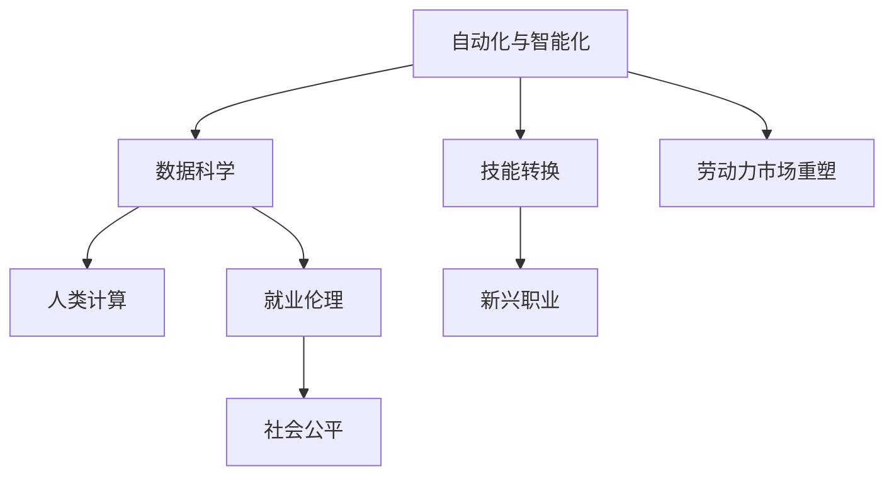

                 

# 人类计算：AI时代的未来就业趋势与技能发展分析

> 关键词：人工智能, 未来就业, 技能发展, 自动化, 数据科学, 人工智能伦理

## 1. 背景介绍

### 1.1 问题由来
随着人工智能技术的飞速发展，自动化和智能化逐渐渗透到各行各业，改变了传统的工作模式和就业结构。AI不仅在技术领域推动了诸多创新，也在其他行业引发了广泛变革。比如在制造业中，机器人流水线取代了部分人力，在医疗领域，智能诊断系统提高了诊疗效率，在金融服务中，量化模型替代了部分人工分析师的工作。这些变革无疑对现有的就业市场造成了深远影响，也促使人们思考未来的就业趋势与技能发展方向。

### 1.2 问题核心关键点
未来就业趋势与技能发展问题核心在于：
- **劳动力市场的重塑**：自动化和AI技术如何影响不同行业和职位的工作需求？
- **技能转换**：现有工作者如何适应新的技术环境？
- **新兴职业的出现**：哪些新职业会因为AI的发展而崛起？
- **伦理与社会责任**：AI技术的发展如何影响就业伦理与社会公平？

本文将从劳动力市场变化、技能需求变化、新兴职业发展以及伦理与社会责任四个维度，深入探讨AI时代未来就业与技能发展的趋势，并提出相应的应对策略。

## 2. 核心概念与联系

### 2.1 核心概念概述

为了更好地理解未来就业趋势与技能发展，我们首先明确几个核心概念：

- **自动化与智能化**：通过机器学习和人工智能技术，实现工作流程的自动化，提高工作效率和质量。
- **数据科学**：运用数据和算法，从数据中提取有用信息，指导决策和优化。
- **人类计算**：利用人类的创造力、直觉和判断，结合AI技术，解决复杂问题。
- **技能转换**：当前工作者如何适应技术变革，学习新技能，进行职业转换。
- **新兴职业**：随着AI技术的发展，新产生的职业和岗位需求。
- **就业伦理**：在AI技术广泛应用背景下，如何平衡技术发展与伦理社会责任。

这些概念之间相互关联，共同构成了AI时代就业与技能发展的复杂生态系统。以下Mermaid流程图展示了这些概念的相互关系：



该图展示了自动化和智能化技术如何通过数据科学和人类计算，影响技能转换和新兴职业的产生，并最终影响就业伦理和社会公平。

## 3. 核心算法原理 & 具体操作步骤

### 3.1 算法原理概述

未来就业趋势与技能发展的研究涉及多学科知识，包括经济学、社会学、心理学和数据科学。在实际应用中，常用的分析工具和方法包括回归分析、就业模型、趋势分析等。

1. **回归分析**：用于预测特定技能的需求与AI技术的应用程度之间的关系。
2. **就业模型**：基于劳动力市场的历史数据，预测未来各行业的就业情况。
3. **趋势分析**：通过分析历史数据，识别技术发展对就业趋势的影响。

### 3.2 算法步骤详解

以下详细介绍基于回归分析的就业趋势预测步骤：

1. **数据收集**：收集不同行业和职位的历史就业数据，以及相关AI技术的应用程度（如机器人、智能化系统等）。
2. **特征工程**：根据预测目标，选择并构建相关特征，例如就业人口、技术应用程度、行业特征等。
3. **模型建立**：选择适合的回归模型（如线性回归、岭回归等），并利用历史数据进行模型训练。
4. **模型验证**：使用交叉验证等方法，对模型进行验证，确保模型的预测能力。
5. **结果分析**：根据模型预测结果，分析不同技能的需求变化和未来就业趋势。

### 3.3 算法优缺点

基于回归分析的就业预测具有以下优点：
- **可操作性强**：模型训练和预测相对简单，易于实现。
- **数据驱动**：通过数据驱动的分析，预测结果具有较高可信度。

同时，也存在一些缺点：
- **假设限制**：回归模型假设数据符合一定的线性关系，可能不适用于复杂的情况。
- **忽略非线性关系**：模型可能无法捕捉到非线性关系，导致预测偏差。
- **模型不稳定性**：历史数据变化可能导致模型泛化能力下降。

### 3.4 算法应用领域

基于回归分析的就业预测模型广泛应用于以下几个领域：

1. **政府与公共政策**：帮助政府制定就业政策，优化就业结构。
2. **企业战略规划**：帮助企业预测未来劳动力需求，制定招聘和培训策略。
3. **职业指导**：为个人提供职业规划建议，指导职业转换。
4. **教育培训**：根据就业趋势调整教育培训内容，提升未来就业竞争力。

## 4. 数学模型和公式 & 详细讲解

### 4.1 数学模型构建

回归分析的基本数学模型为：

$$ y = \beta_0 + \beta_1x_1 + \beta_2x_2 + \cdots + \beta_nx_n + \epsilon $$

其中：
- $y$ 为因变量（如某行业的就业人口）。
- $x_1, x_2, \cdots, x_n$ 为自变量（如技术应用程度、行业特征等）。
- $\beta_0, \beta_1, \beta_2, \cdots, \beta_n$ 为回归系数。
- $\epsilon$ 为误差项。

### 4.2 公式推导过程

以线性回归为例，最小二乘法用于求解回归系数 $\beta_0, \beta_1, \beta_2, \cdots, \beta_n$：

$$ \hat{\beta} = (X^TX)^{-1}X^Ty $$

其中 $X = [x_1, x_2, \cdots, x_n]$，$y = [y_1, y_2, \cdots, y_n]$。

### 4.3 案例分析与讲解

以机器学习工程师为例，使用上述回归模型分析技术应用程度（$x$）与就业人口（$y$）之间的关系：

1. **数据收集**：收集机器学习工程师的历史就业数据和技术应用程度数据。
2. **模型建立**：选择线性回归模型，计算回归系数。
3. **模型验证**：使用交叉验证评估模型预测能力。
4. **结果分析**：分析技术应用程度对就业人口的影响，预测未来就业趋势。

## 5. 项目实践：代码实例和详细解释说明

### 5.1 开发环境搭建

要实现回归分析，需要先搭建Python开发环境：

1. 安装Anaconda：从官网下载并安装Anaconda，用于创建独立的Python环境。
2. 创建并激活虚拟环境：
```bash
conda create -n myenv python=3.8 
conda activate myenv
```
3. 安装必要的Python库：
```bash
pip install numpy pandas scikit-learn statsmodels matplotlib seaborn jupyter notebook
```

### 5.2 源代码详细实现

以下是一个简单的线性回归预测就业人数的Python代码：

```python
import numpy as np
from sklearn.linear_model import LinearRegression
from sklearn.metrics import mean_squared_error, r2_score

# 准备数据
X = np.array([[1], [2], [3], [4], [5]])
y = np.array([5, 10, 15, 20, 25])

# 建立模型
model = LinearRegression()
model.fit(X, y)

# 预测新数据
X_new = np.array([[6]])
y_pred = model.predict(X_new)

# 计算误差
mse = mean_squared_error(y, y_pred)
r2 = r2_score(y, y_pred)

print(f"Mean Squared Error: {mse}")
print(f"R-squared: {r2}")
```

### 5.3 代码解读与分析

代码中，首先定义了自变量 $X$ 和因变量 $y$，然后使用LinearRegression模型进行拟合，预测新数据。通过计算均方误差和R^2分数，评估模型预测效果。

## 6. 实际应用场景

### 6.1 制造业自动化

在制造业中，自动化和智能化技术（如工业机器人、智能质检系统等）的应用，改变了传统的人力密集型生产模式。例如，汽车制造业通过引入自动化装配线，提高了生产效率和质量，减少了人工成本。

### 6.2 医疗健康

AI在医疗健康领域的应用，如智能诊断系统、个性化治疗方案推荐等，提升了医疗服务的效率和质量。然而，这也对医疗从业人员提出了新的技能要求，如数据分析能力、AI系统的操作和维护等。

### 6.3 金融服务

金融服务行业引入量化交易和AI风险管理，显著提高了数据分析和决策的准确性。但同时也减少了部分中低端分析师和交易员的工作，推动了从业人员的技能升级。

### 6.4 未来应用展望

未来AI技术将在更多领域推广，如农业、教育、公共服务等。在此背景下，就业市场将面临以下变化：

1. **新兴职业**：如AI伦理顾问、数据治理专家、AI系统维护工程师等。
2. **技能升级**：数据分析、编程、人工智能知识等将成为必备技能。
3. **跨领域应用**：AI技术在多个领域的应用将推动跨学科技能的需求，如医疗与机器学习、金融与数据分析等。

## 7. 工具和资源推荐

### 7.1 学习资源推荐

1. **《Python机器学习》（Hands-On Machine Learning with Scikit-Learn, Keras, and TensorFlow）**：由Aurélien Géron所著，全面介绍了机器学习和深度学习的基本概念和实用技能。
2. **Coursera的“数据科学与机器学习”专业课程”（Data Science Specialization）**：由约翰·霍普金斯大学提供，涵盖数据科学、统计学和机器学习的基础和应用。
3. **Kaggle竞赛平台**：提供大量真实世界的机器学习竞赛数据集，通过实战练习提升技能。
4. **Google的TensorFlow官方文档**：提供丰富的教程和示例代码，支持深度学习和机器学习实践。
5. **Python Data Science Handbook**：由Jake VanderPlas编写，介绍了Python数据科学的核心工具和库。

### 7.2 开发工具推荐

1. **Anaconda**：管理Python环境和依赖的工具，方便快速安装和管理相关库。
2. **Jupyter Notebook**：交互式编程环境，支持Python、R等语言的实时编辑和执行。
3. **Google Colab**：免费的GPU/TPU资源，支持在云端进行高性能计算和数据科学练习。
4. **Scikit-learn**：Python科学计算库，提供丰富的机器学习算法和工具。
5. **TensorFlow**：Google开发的深度学习框架，支持构建复杂神经网络模型。

### 7.3 相关论文推荐

1. **《人工智能与劳动力市场》（Artificial Intelligence and Labor Markets）**：由Rusty Br grade、James H. Stock和Mark W. Watson撰写，分析了AI技术对劳动力市场的影响。
2. **《机器学习与数据科学的应用》（Machine Learning and Data Science: A Practical Guide）**：由Kaggle团队编写，介绍了机器学习和数据科学的实际应用案例。
3. **《未来工作：自动化、技能与就业》（The Future of Work: Automation, Skill, and Employment）**：由The McKinsey Global Institute发布，分析了自动化和AI对就业市场的长期影响。
4. **《大数据时代的技能缺口》（Skillshift: The Changing Demand for Labor in the Age of Data）**：由Duke University发布，分析了大数据技术对劳动市场需求的变化。

## 8. 总结：未来发展趋势与挑战

### 8.1 研究成果总结

本文从自动化和智能化技术对就业市场的重塑、技能转换、新兴职业发展以及就业伦理与社会公平四个维度，深入探讨了AI时代未来就业与技能发展的趋势。通过回归分析模型，预测了未来各行业和技能的需求变化。

### 8.2 未来发展趋势

未来就业与技能发展的趋势如下：

1. **技能需求多样化**：随着AI技术的发展，更多技能（如数据科学、编程、人工智能知识等）将成为必备。
2. **新兴职业崛起**：AI伦理顾问、数据治理专家等新兴职业将不断出现。
3. **跨领域应用广泛**：AI技术在多个领域的应用将推动跨学科技能的需求。
4. **终身学习成为常态**：为适应技术快速变化，终身学习和持续教育将成为趋势。

### 8.3 面临的挑战

AI时代未来就业与技能发展面临以下挑战：

1. **技能差距扩大**：现有工作者的技能与AI时代需求存在差距，需要更多培训和教育。
2. **就业不平等加剧**：AI技术可能加剧劳动力市场的分化，加剧不平等现象。
3. **伦理与法律问题**：AI技术的应用可能引发隐私、安全、伦理等问题。
4. **数据偏见**：AI系统的训练数据可能存在偏见，导致预测偏差和歧视。

### 8.4 研究展望

未来研究需要在以下几个方面进行进一步探索：

1. **公平与透明**：研究如何在AI技术应用中实现公平透明，减少偏见和歧视。
2. **终身学习与技能提升**：推动终身学习体系建设，帮助工作者提升技能，适应技术变化。
3. **跨学科研究**：结合经济学、社会学、心理学等学科，深入研究AI技术对就业市场的全面影响。
4. **伦理与社会责任**：探讨AI技术应用的伦理边界，制定相应的政策和法规。

总之，AI时代的就业与技能发展是一个复杂的系统性问题，需要多学科、多角度的深入研究。只有积极应对挑战，才能确保技术进步带来的益处，促进社会的和谐发展。

## 9. 附录：常见问题与解答

**Q1：AI技术的发展对就业市场有哪些影响？**

A: AI技术的发展对就业市场的影响是双刃剑。一方面，自动化和智能化提高了生产效率，减少了部分低技能工作的需求；另一方面，新技能和职业的需求增加，推动了技能升级和跨领域应用。

**Q2：如何应对AI时代的技术变革？**

A: 为应对AI时代的技术变革，应采取以下措施：
1. 终身学习：不断学习新技能，适应技术变化。
2. 跨领域应用：拓展跨学科知识，提升跨领域技能。
3. 技能转换：通过培训和教育，实现职业转换。

**Q3：AI技术的应用如何影响就业伦理？**

A: AI技术的应用可能引发隐私、安全、伦理等风险，需要关注以下几个方面：
1. 数据隐私：保护用户隐私，防止数据滥用。
2. 算法透明：提高算法的透明性，避免黑箱操作。
3. 公平性：避免算法偏见，确保公平性。

**Q4：AI技术对新兴职业的影响有哪些？**

A: AI技术的发展推动了新兴职业的崛起，例如：
1. AI伦理顾问：负责AI系统的伦理评估和管理。
2. 数据治理专家：负责数据收集、处理和治理，确保数据质量和安全。
3. AI系统维护工程师：负责AI系统的运行维护和优化。

**Q5：未来AI技术的发展方向有哪些？**

A: 未来AI技术的发展方向包括：
1. 自动化与智能化：进一步提升自动化水平，优化智能系统。
2. 数据科学与机器学习：提升数据科学和机器学习算法的效果和效率。
3. 多模态融合：实现视觉、语音、文本等多模态数据的融合。

总之，AI时代的未来就业与技能发展是一个复杂且动态变化的过程，需要不断关注技术发展趋势，积极应对挑战，制定合理的政策法规，以实现技术进步与社会发展的和谐共存。

