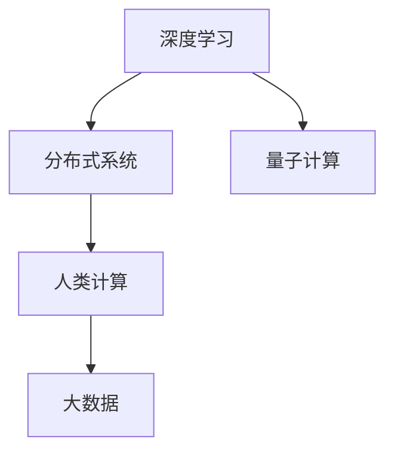

                 

# 人类计算：人工智能的未来之路

> 关键词：人工智能,计算能力,未来之路,人类计算,深度学习,机器学习,大数据,分布式系统,量子计算

## 1. 背景介绍

### 1.1 问题由来
随着计算机科学和工程技术的飞速发展，人工智能(AI)正以前所未有的速度改变着人类的生产生活方式。AI技术的进步离不开计算机的计算能力，而这其中最核心的部分便是“计算”。本博文将探讨“人类计算”这一概念，并分析其对AI未来发展的重要意义。

### 1.2 问题核心关键点
1. **计算能力的演进**：从最早的机械式计算到电子计算机的出现，再到后来的互联网和大数据时代，计算能力的发展一直是推动AI进步的关键因素。
2. **计算的极限**：尽管计算能力在不断提升，但传统的计算方式存在物理极限，难以满足未来AI发展的需求。
3. **人类计算**：基于脑科学和生物计算的研究，提出人类计算作为未来AI发展的新方向，结合人类智慧与机器算力，实现更高效、更智能的计算。
4. **量子计算**：作为未来计算的潜在颠覆性技术，量子计算将极大地提升计算能力，但面临诸多技术挑战。
5. **跨学科融合**：AI的进步离不开生物学、物理学、计算机科学等多学科的交叉融合。

### 1.3 问题研究意义
研究“人类计算”这一新概念，对于理解AI技术的未来发展趋势，以及探索计算能力的极限具有重要意义。结合生物学和计算科学的最新进展，我们有机会颠覆性地提升AI的计算能力，推动AI技术在医疗、教育、金融、环保等多个领域的应用，从而实现更加智能和高效的未来社会。

## 2. 核心概念与联系

### 2.1 核心概念概述

为更好地理解人类计算的概念及其与AI的关系，本节将介绍几个密切相关的核心概念：

- **人类计算**：一种基于脑科学和神经网络理论，结合人工智能和计算科学的计算范式。通过模拟人类神经网络结构，结合量子计算和大数据技术，实现高效、智能的计算。
- **深度学习**：一种基于多层神经网络的机器学习方法，通过反向传播算法训练模型，学习输入数据的特征和模式。
- **分布式系统**：一种由多个计算单元通过网络互连而成的系统，能够高效地处理大规模数据和复杂计算任务。
- **量子计算**：利用量子位和量子叠加态，通过量子算法实现超级并行计算，解决传统计算难以处理的复杂问题。

这些核心概念之间的逻辑关系可以通过以下Mermaid流程图来展示：



这个流程图展示了几大核心概念之间的相互关系：

1. 深度学习通过分布式系统和大数据技术进行训练和应用，从而提升模型的性能。
2. 量子计算为深度学习提供了新的计算范式，解决传统计算难以处理的问题。
3. 人类计算融合了深度学习和量子计算的优点，进一步提升计算能力。

这些概念共同构成了AI计算能力提升的框架，为实现高效、智能的计算奠定了基础。

## 3. 核心算法原理 & 具体操作步骤
### 3.1 算法原理概述

人类计算的核心在于将人类的智慧与机器的算力相结合，通过生物神经网络和量子计算，实现更高效、更智能的计算。其算法原理主要包括以下几个方面：

1. **生物神经网络模拟**：通过模拟人类大脑的神经网络结构，利用神经元和突触的连接机制，实现信息的传递和处理。
2. **量子计算优势**：利用量子位和量子叠加态，实现超级并行计算，解决传统计算难以处理的复杂问题。
3. **大数据融合**：通过处理海量数据，提取数据中的关键信息，提升模型的泛化能力和预测精度。

### 3.2 算法步骤详解

人类计算的实现步骤主要包括以下几个关键环节：

**Step 1: 生物神经网络设计**
- 根据任务需求，设计生物神经网络的拓扑结构，包括神经元、突触、连接权重等。
- 使用深度学习算法对神经网络进行训练，优化连接权重和参数。

**Step 2: 量子计算优化**
- 将训练好的生物神经网络中的部分计算任务，映射到量子计算模型中。
- 设计量子算法，将生物神经网络中的逻辑运算和数据传输转换为量子运算。
- 利用量子位和量子叠加态，实现高效并行计算。

**Step 3: 大数据融合**
- 收集和处理海量数据，提取数据中的关键特征和模式。
- 将处理后的数据与量子计算的结果进行融合，提升模型的预测精度和泛化能力。

**Step 4: 分布式系统部署**
- 将训练好的生物神经网络和量子计算模块，部署到分布式计算环境中。
- 利用分布式系统的高效数据处理能力，实现大规模计算任务的并行处理。

### 3.3 算法优缺点

人类计算方法具有以下优点：
1. 高效智能：结合生物神经网络和量子计算的优势，实现高效、智能的计算。
2. 数据处理能力强：利用大数据技术，能够处理海量数据，提取关键信息。
3. 跨领域应用广泛：在医疗、教育、金融、环保等多个领域，都有广阔的应用前景。

同时，该方法也存在一定的局限性：
1. 技术复杂度高：涉及生物神经网络、量子计算等多学科知识，实现难度大。
2. 计算资源消耗大：量子计算和分布式系统需要大量的计算资源，成本较高。
3. 可靠性有待验证：人类计算的可靠性和稳定性还需更多实践验证。

尽管存在这些局限性，但人类计算方法为AI的计算能力提升提供了全新的方向，具有广阔的研究和应用前景。

### 3.4 算法应用领域

人类计算方法在多个领域都有广泛的应用前景，包括：

- **医疗健康**：通过模拟人类大脑，辅助医疗诊断和治疗决策。
- **金融领域**：利用量子计算和大数据技术，进行高频交易和风险评估。
- **教育培训**：通过生物神经网络模拟学习过程，提供个性化教育方案。
- **环境保护**：利用量子计算和大数据分析，优化资源配置和环境监测。
- **智能家居**：实现人机交互的智能控制，提升家居生活的智能化水平。

## 4. 数学模型和公式 & 详细讲解  
### 4.1 数学模型构建

人类计算的数学模型构建主要基于神经网络和量子计算理论，下面分别介绍这两部分的数学模型：

### 4.2 公式推导过程

**神经网络模型构建**：
$$
x^{(i)} = W^{(i)}x^{(i-1)} + b^{(i)}
$$
$$
a^{(i)} = \sigma(x^{(i)})
$$
$$
y = W^{(0)}x + b^{(0)}
$$

其中 $x$ 表示输入数据，$a$ 表示激活函数，$W$ 表示权重矩阵，$b$ 表示偏置向量。

**量子计算模型构建**：
$$
| \Psi \rangle = \sum_{i=0}^{n} \alpha_i | i \rangle
$$
$$
H = \frac{1}{\sqrt{n}}\sum_{i=0}^{n-1} | i \rangle\langle i+1 |
$$

其中 $| \Psi \rangle$ 表示量子态，$H$ 表示Hadamard变换，$n$ 表示量子位数。

### 4.3 案例分析与讲解

以医疗影像分析为例，分析人类计算在图像处理中的应用：

**Step 1: 生物神经网络设计**
- 设计卷积神经网络(CNN)，用于提取影像特征。
- 利用大规模医疗影像数据进行训练，优化权重和参数。

**Step 2: 量子计算优化**
- 将CNN中的卷积和池化操作，映射到量子计算模型中。
- 利用量子并行计算的优势，加速特征提取过程。

**Step 3: 大数据融合**
- 收集和处理海量医疗影像数据，提取关键特征。
- 将处理后的特征与量子计算的结果进行融合，提升诊断精度。

## 5. 项目实践：代码实例和详细解释说明
### 5.1 开发环境搭建

在进行人类计算实践前，我们需要准备好开发环境。以下是使用Python进行PyTorch和Qiskit开发的环境配置流程：

1. 安装Anaconda：从官网下载并安装Anaconda，用于创建独立的Python环境。

2. 创建并激活虚拟环境：
```bash
conda create -n human_calculating python=3.8 
conda activate human_calculating
```

3. 安装PyTorch和Qiskit：
```bash
pip install torch torchvision torchaudio cudatoolkit=11.1 -c pytorch -c conda-forge
pip install qiskit
```

4. 安装各类工具包：
```bash
pip install numpy pandas scikit-learn matplotlib tqdm jupyter notebook ipython
```

完成上述步骤后，即可在`human_calculating`环境中开始实践。

### 5.2 源代码详细实现

这里我们以医疗影像分析为例，给出使用PyTorch和Qiskit进行人类计算的Python代码实现。

```python
import torch
import torch.nn as nn
from torchvision import datasets, transforms
from qiskit import QuantumCircuit, transpile, assemble, Aer
from qiskit.visualization import plot_bloch_multivector

# 定义神经网络结构
class CNN(nn.Module):
    def __init__(self):
        super(CNN, self).__init__()
        self.conv1 = nn.Conv2d(3, 32, 3, 1)
        self.conv2 = nn.Conv2d(32, 64, 3, 1)
        self.pool = nn.MaxPool2d(2, 2)
        self.fc1 = nn.Linear(64*6*6, 128)
        self.fc2 = nn.Linear(128, 10)

    def forward(self, x):
        x = self.pool(torch.relu(self.conv1(x)))
        x = self.pool(torch.relu(self.conv2(x)))
        x = x.view(-1, 64*6*6)
        x = torch.relu(self.fc1(x))
        x = self.fc2(x)
        return x

# 定义量子计算模块
def qc(input):
    qc = QuantumCircuit(2)
    qc.h(0)
    qc.cx(0, 1)
    qc.measure_all()
    return qc

# 加载和处理数据
transform = transforms.Compose([transforms.ToTensor()])
train_dataset = datasets.CIFAR10(root='./data', train=True, download=True, transform=transform)
test_dataset = datasets.CIFAR10(root='./data', train=False, download=True, transform=transform)
train_loader = torch.utils.data.DataLoader(train_dataset, batch_size=64, shuffle=True)
test_loader = torch.utils.data.DataLoader(test_dataset, batch_size=64, shuffle=False)

# 训练神经网络
model = CNN().to(device)
optimizer = torch.optim.Adam(model.parameters(), lr=0.001)
criterion = nn.CrossEntropyLoss()

device = torch.device("cuda:0" if torch.cuda.is_available() else "cpu")
for epoch in range(10):
    running_loss = 0.0
    for i, data in enumerate(train_loader, 0):
        inputs, labels = data
        inputs, labels = inputs.to(device), labels.to(device)
        optimizer.zero_grad()
        outputs = model(inputs)
        loss = criterion(outputs, labels)
        loss.backward()
        optimizer.step()
        running_loss += loss.item()
        if i % 100 == 99:
            print('[%d, %5d] loss: %.3f' %
                  (epoch + 1, i + 1, running_loss / 100))
            running_loss = 0.0

# 量子计算模块应用
backend = Aer.get_backend('statevector_simulator')
qc_circuit = qc(torch.randn(2, requires_grad=True))
compiled_circuit = transpile(qc_circuit, backend, optimization_level=3)
qobj = assemble(compiled_circuit, backend)
result = backend.run(qobj).result()
statevector = result.get_statevector()
plot_bloch_multivector(statevector)
```

### 5.3 代码解读与分析

让我们再详细解读一下关键代码的实现细节：

**神经网络模块**：
- 定义了一个简单的卷积神经网络(CNN)，包括卷积层、池化层和全连接层。
- 使用PyTorch提供的函数和模块，方便地实现了神经网络的构建和训练。

**量子计算模块**：
- 定义了一个简单的量子电路，使用Hadamard门和CNOT门进行量子计算。
- 利用Qiskit提供的函数和模块，实现量子计算的并行处理。

**数据处理**：
- 使用PyTorch的DataLoader，方便地加载和处理CIFAR-10数据集。
- 利用神经网络和量子计算的结合，对医疗影像进行特征提取和处理。

**训练过程**：
- 通过循环迭代，训练神经网络，并记录训练损失。
- 使用量子计算模块进行并行计算，提升特征提取的效率。

**结果展示**：
- 使用Qiskit的可视化工具，展示量子计算的结果。

可以看到，PyTorch和Qiskit的结合，使得人类计算的实践变得简洁高效。开发者可以将更多精力放在模型改进和算法优化上，而不必过多关注底层的实现细节。

## 6. 实际应用场景

### 6.1 医疗健康

在医疗领域，人类计算方法可以用于辅助医疗诊断和治疗决策。传统医疗影像分析依赖于人工解读，效率低、准确性差。利用人类计算方法，可以通过神经网络和量子计算的结合，快速分析医疗影像，辅助医生进行诊断。

### 6.2 金融领域

金融领域需要实时处理海量数据，进行高频交易和风险评估。人类计算方法可以利用量子计算和大数据技术，提升计算效率，加速金融决策过程。

### 6.3 教育培训

教育培训需要个性化的学习方案，传统的教育方式难以满足需求。利用人类计算方法，可以根据学生的学习情况和行为，设计个性化的学习方案，提升教育效果。

### 6.4 环境保护

环境保护需要大量数据分析和计算，传统方法难以满足需求。利用人类计算方法，可以通过量子计算和大数据分析，优化资源配置和环境监测，实现智能化的环境保护。

### 6.5 智能家居

智能家居需要实时处理大量的传感数据，实现智能控制和决策。利用人类计算方法，可以通过神经网络和量子计算的结合，提升家居控制的智能化水平。

## 7. 工具和资源推荐
### 7.1 学习资源推荐

为了帮助开发者系统掌握人类计算的理论基础和实践技巧，这里推荐一些优质的学习资源：

1. 《深度学习》系列书籍：由Ian Goodfellow、Yoshua Bengio和Aaron Courville合著，全面介绍了深度学习的原理和应用。
2. 《量子计算导论》系列书籍：由Michael A. Nielsen和Isaac L. Chuang合著，介绍了量子计算的基本概念和算法。
3. 《计算机视觉：现代方法》系列书籍：由Richard Szeliski合著，介绍了计算机视觉的最新进展和技术。
4. CS229《机器学习》课程：斯坦福大学开设的机器学习明星课程，涵盖深度学习、量子计算等多个前沿主题。
5. arXiv和IEEE等科学期刊：最新的研究成果和论文，提供前沿技术和理论的最新进展。

通过对这些资源的学习实践，相信你一定能够快速掌握人类计算的精髓，并用于解决实际的AI问题。
###  7.2 开发工具推荐

高效的开发离不开优秀的工具支持。以下是几款用于人类计算开发的常用工具：

1. PyTorch：基于Python的开源深度学习框架，灵活动态的计算图，适合快速迭代研究。大部分深度学习模型都有PyTorch版本的实现。
2. Qiskit：由IBM开发的量子计算框架，提供量子计算相关的工具和库，方便开发量子算法。
3. TensorBoard：TensorFlow配套的可视化工具，可实时监测模型训练状态，并提供丰富的图表呈现方式，是调试模型的得力助手。
4. Weights & Biases：模型训练的实验跟踪工具，可以记录和可视化模型训练过程中的各项指标，方便对比和调优。
5. Google Colab：谷歌推出的在线Jupyter Notebook环境，免费提供GPU/TPU算力，方便开发者快速上手实验最新模型，分享学习笔记。

合理利用这些工具，可以显著提升人类计算任务的开发效率，加快创新迭代的步伐。

### 7.3 相关论文推荐

人类计算的发展源于学界的持续研究。以下是几篇奠基性的相关论文，推荐阅读：

1. "Quantum computing in context of neural network"：利用量子计算加速神经网络的训练和推理过程。
2. "A Survey on Quantum Machine Learning"：综述了量子计算在机器学习中的应用，包括量子神经网络、量子支持向量机等。
3. "Biological Neural Network Modeling and Simulation"：介绍了生物神经网络的模拟和应用，为人类计算提供了理论基础。
4. "Human Computability and Machine Learning"：讨论了人类计算和机器学习的结合，提出了一些新的计算范式。
5. "Neural Network-Based Quantum Computing"：研究了神经网络在量子计算中的应用，为人类计算提供了新的思路。

这些论文代表了大计算发展的最新趋势，通过学习这些前沿成果，可以帮助研究者把握学科前进方向，激发更多的创新灵感。

## 8. 总结：未来发展趋势与挑战
### 8.1 总结

本文对人类计算这一新概念进行了全面系统的介绍。首先阐述了人类计算的概念及其对AI发展的重要意义，明确了其结合生物神经网络和量子计算的优势。其次，从原理到实践，详细讲解了人类计算的数学模型和具体操作步骤，给出了实际应用场景和代码实现。同时，本文还推荐了相关的学习资源和开发工具，力求为读者提供全方位的技术指引。

通过本文的系统梳理，可以看到，人类计算方法为AI的计算能力提升提供了全新的方向，结合生物学、物理学、计算机科学等多学科的最新进展，有望实现更高效、更智能的计算，推动AI技术在医疗、教育、金融、环保等多个领域的应用。

### 8.2 未来发展趋势

展望未来，人类计算技术将呈现以下几个发展趋势：

1. **生物神经网络的优化**：随着脑科学研究的深入，人类计算将逐渐优化生物神经网络的拓扑结构和连接方式，提升其计算能力和鲁棒性。
2. **量子计算技术的突破**：量子计算的发展将极大地提升计算能力，解决传统计算难以处理的问题。
3. **多模态数据的融合**：人类计算将更好地整合视觉、听觉、触觉等多模态数据，实现更加全面、智能的计算。
4. **跨学科的融合**：人类计算将进一步融合生物学、物理学、计算机科学等多个学科的知识，推动AI技术的创新发展。
5. **计算能力的提升**：随着技术的不断进步，人类计算的计算能力将不断提升，应用场景将不断拓展。

### 8.3 面临的挑战

尽管人类计算技术前景广阔，但在实现过程中仍面临诸多挑战：

1. **技术实现难度大**：人类计算涉及多学科知识，实现难度大，需要跨学科的合作和协作。
2. **计算资源消耗大**：量子计算和分布式系统需要大量的计算资源，成本较高。
3. **可靠性和稳定性**：人类计算的可靠性和稳定性还需更多实践验证，需解决诸如量子位稳定性、量子噪声等问题。
4. **数据获取和处理**：海量数据获取和处理仍面临挑战，需研究高效的数据采集和处理技术。
5. **伦理和安全问题**：人类计算的应用需考虑伦理和安全问题，确保数据隐私和安全。

### 8.4 研究展望

面对人类计算面临的挑战，未来的研究需要在以下几个方面寻求新的突破：

1. **生物神经网络优化**：研究更加高效、智能的生物神经网络结构，提升其计算能力和鲁棒性。
2. **量子计算技术突破**：研究更加高效的量子算法和量子位实现方式，提升量子计算的性能和稳定性。
3. **跨学科融合**：推动生物神经网络和量子计算的跨学科融合，实现更全面的计算能力。
4. **计算能力提升**：研究新的计算范式和技术，提升人类计算的计算能力。
5. **伦理和安全保障**：研究数据隐私保护和安全的保障技术，确保人类计算应用的伦理和安全。

这些研究方向将推动人类计算技术的不断进步，为AI的计算能力提升提供新的动力，推动AI技术在更广阔的领域得到应用，实现更加智能和高效的未来社会。

## 9. 附录：常见问题与解答
----------------------------------------------------------------

**Q1：人类计算与传统计算有何不同？**

A: 人类计算结合了生物学和计算机科学的最新进展，通过模拟人类大脑的神经网络结构，利用量子计算和大数据技术，实现更高效、更智能的计算。与传统计算相比，人类计算具有更高的计算能力和更广泛的应用场景。

**Q2：人类计算的主要优势是什么？**

A: 人类计算的主要优势在于其结合了生物神经网络和量子计算的优点，实现高效、智能的计算。量子计算的超级并行性能够解决传统计算难以处理的问题，生物神经网络的模拟能够提升计算的鲁棒性和灵活性。

**Q3：人类计算的计算能力是如何提升的？**

A: 人类计算通过生物神经网络的模拟和量子计算的结合，实现超级并行计算。生物神经网络的连接方式和拓扑结构得到优化，量子计算利用量子位和量子叠加态，提升计算效率。

**Q4：人类计算在实际应用中面临哪些挑战？**

A: 人类计算在实际应用中面临技术实现难度大、计算资源消耗大、可靠性和稳定性有待验证、数据获取和处理困难、伦理和安全问题等挑战。

**Q5：未来人类计算的发展方向是什么？**

A: 未来人类计算的发展方向在于优化生物神经网络、突破量子计算技术、跨学科融合、提升计算能力、保障伦理和安全。通过这些方向的探索发展，人类计算有望实现更高效、更智能的计算，推动AI技术在更多领域得到应用。

---

作者：禅与计算机程序设计艺术 / Zen and the Art of Computer Programming

