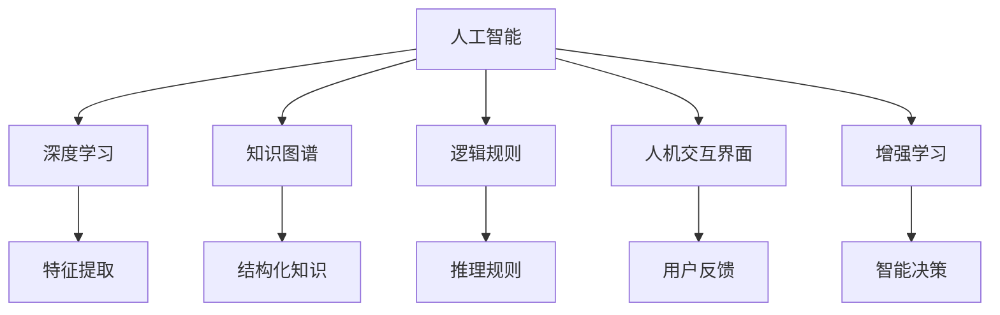

                 

## 1. 背景介绍

### 1.1 问题由来

随着人工智能技术的飞速发展，“人类计算”的概念逐渐成为学术界和工业界关注的热点。所谓“人类计算”，是指将人类自身的智慧和经验整合进机器智能的决策过程，从而提高人工智能系统的智能水平和适应性。这一概念来源于人工智能发展的早期，当时研究人员利用逻辑推理、专家知识等人类智慧来辅助机器学习模型的训练和优化。

然而，近年来，随着深度学习和大数据技术的普及，许多复杂任务可以通过训练大规模神经网络模型来实现。这些模型能够自动从数据中学习到丰富的特征表示和模式，极大地提升了自动化决策的精度和效率。但与此同时，这些模型的黑盒特性、难以解释性等问题也引发了广泛的讨论和研究。

在此背景下，“人类计算”的概念重新被提起，其核心理念是在机器智能的基础上，进一步融合人类的主观判断、领域知识、决策规则等，实现更高级别的智能决策。这一思想不仅适用于传统的计算机科学领域，也逐渐应用于金融、医疗、法律等对人类经验和判断要求较高的行业。

### 1.2 问题核心关键点

人类计算的核心理念是通过将人类智慧与机器智能相结合，提升决策的智能化和准确性。其关键点包括：

- **融合知识**：将领域专家知识、经验规则等与机器学习模型进行融合，引导模型学习更有意义、有价值的特征。
- **人机协同**：通过人机交互界面，实现决策过程中的协作，结合人工决策和自动推理。
- **可解释性**：确保决策过程透明、可解释，能够理解和解释模型的内部逻辑和决策依据。
- **高效性**：在保证智能决策的前提下，尽量减少人机交互的复杂性和决策时间。

### 1.3 问题研究意义

人类计算的研究意义主要体现在以下几个方面：

- **提高决策质量**：通过融合领域知识和经验，能够显著提升决策的准确性和效率，特别是在传统方法难以处理的复杂任务中。
- **增强可解释性**：通过决策过程的透明化，便于对模型的误判进行解释和修正，提高模型的可信度和用户接受度。
- **促进跨领域应用**：人类计算的思想和方法可以应用于金融、医疗、法律等多个领域，推动人工智能技术的跨学科应用和产业化进程。
- **推动智能自动化**：人类计算不仅是提升特定领域决策能力的手段，也是推动整个社会智能自动化发展的关键。

## 2. 核心概念与联系

### 2.1 核心概念概述

为更好地理解人类计算，本节将介绍几个密切相关的核心概念：

- **人工神经网络（Artificial Neural Network, ANN）**：一种模拟人类神经系统的计算模型，通过层间连接和权重参数的学习，自动提取数据中的特征。
- **深度学习（Deep Learning）**：一种基于神经网络的多层学习范式，能够处理更复杂的数据结构和特征表示，广泛应用于图像识别、自然语言处理等领域。
- **知识图谱（Knowledge Graph,KG）**：一种结构化的知识表示方法，通过节点和边来描述实体与实体之间的关系。
- **逻辑规则（Logic Rules）**：基于符号逻辑的知识表示方法，用于描述领域内的一些基本推理规则和约束条件。
- **人机交互界面（Human-Computer Interaction, HCI）**：提供人机协同决策的界面和工具，用于输入输出领域知识、规则和用户反馈。
- **增强学习（Reinforcement Learning）**：通过与环境互动，逐步优化决策策略的方法，能够学习到更符合现实需求的智能决策模型。

这些核心概念之间的逻辑关系可以通过以下Mermaid流程图来展示：


这个流程图展示了大规模神经网络模型、知识图谱、逻辑规则、人机交互界面、增强学习等核心概念，以及它们在人类计算中的作用。

## 3. 核心算法原理 & 具体操作步骤

### 3.1 算法原理概述

人类计算的核心算法原理是通过将人类智慧与机器智能相结合，提升决策的智能化和准确性。具体而言，可以通过以下几个步骤来实现：

1. **数据预处理**：将原始数据进行清洗、归一化、特征工程等预处理操作，以便于神经网络模型进行学习。
2. **特征提取**：使用深度学习模型提取数据中的高级特征表示，作为决策的基础。
3. **知识融合**：将领域知识、专家规则、历史案例等结构化知识与模型特征进行融合，提升决策的合理性和可信度。
4. **协同决策**：通过人机交互界面，结合人工决策和自动推理，实现协同决策。
5. **模型训练与优化**：利用增强学习、梯度下降等优化算法，训练和优化决策模型，提高其智能水平和适应性。

### 3.2 算法步骤详解

人类计算的具体操作步骤包括以下几个关键步骤：

**Step 1: 数据预处理**
- 收集原始数据，并进行清洗、归一化、特征提取等预处理操作。
- 将数据分为训练集、验证集和测试集，以便于模型训练和评估。

**Step 2: 特征提取**
- 选择合适的深度学习模型，如卷积神经网络（CNN）、循环神经网络（RNN）、Transformer等，用于提取数据中的高级特征。
- 通过多层神经网络学习数据中的隐含模式和结构，生成特征表示。

**Step 3: 知识融合**
- 收集领域知识、专家规则、历史案例等结构化数据，构建知识图谱。
- 将知识图谱与模型特征进行融合，使用图嵌入（Graph Embedding）等技术将结构化知识转换为向量表示。
- 使用逻辑推理规则对融合后的特征进行约束和优化，确保决策的合理性和可信度。

**Step 4: 协同决策**
- 通过人机交互界面，实现用户与决策模型的协同。用户输入领域知识、规则和决策目标，模型输出建议方案，用户进行确认或修改。
- 对于复杂决策，可以采用分级协同的方式，先由模型生成初方案，再由人工进一步优化和确认。

**Step 5: 模型训练与优化**
- 利用增强学习算法，如Q-learning、SARSA等，对决策模型进行训练和优化。
- 使用梯度下降等优化算法，最小化模型预测与实际结果之间的误差。
- 在验证集上评估模型性能，根据评估结果调整超参数和优化策略。

### 3.3 算法优缺点

人类计算的优点在于：

1. **提升决策质量**：通过融合领域知识和经验，能够显著提升决策的准确性和效率，特别是在传统方法难以处理的复杂任务中。
2. **增强可解释性**：通过决策过程的透明化，便于对模型的误判进行解释和修正，提高模型的可信度和用户接受度。
3. **促进跨领域应用**：人类计算的思想和方法可以应用于金融、医疗、法律等多个领域，推动人工智能技术的跨学科应用和产业化进程。
4. **推动智能自动化**：人类计算不仅是提升特定领域决策能力的手段，也是推动整个社会智能自动化发展的关键。

同时，该方法也存在一定的局限性：

1. **数据依赖**：数据预处理和特征提取需要高质量的标注数据和领域知识，对数据的获取和标注成本较高。
2. **知识获取难度**：结构化知识图谱和逻辑规则的构建需要领域专家参与，难度较大且成本较高。
3. **人机交互复杂**：协同决策过程中，人机交互的复杂性和用户反馈的处理，可能影响决策效率和准确性。
4. **模型训练复杂**：融合结构化知识和深度学习模型的训练过程较为复杂，需要较长的训练时间和较高的计算资源。

尽管存在这些局限性，但就目前而言，人类计算的方法仍是大规模神经网络模型应用的重要补充，具有重要的研究和应用价值。未来相关研究的重点在于如何进一步降低数据依赖，提高模型的自适应性和可解释性，同时兼顾计算效率和用户交互体验。

### 3.4 算法应用领域

人类计算的应用领域非常广泛，以下是几个典型的应用场景：

- **金融风控**：利用领域知识、规则和历史案例，结合深度学习模型，对贷款、投资等金融行为进行风险评估和决策优化。
- **医疗诊断**：将临床知识、规则和历史病例与深度学习模型结合，提高诊断的准确性和效率，辅助医生进行复杂病例的决策。
- **法律咨询**：通过结构化法律知识和规则，结合自然语言处理技术，为律师和用户提供智能化的法律咨询和案件推荐。
- **交通管理**：利用交通规则和历史数据，结合深度学习模型，优化交通信号灯控制和路径规划，提升交通效率和安全性。
- **城市规划**：结合城市规划知识、规则和历史数据，使用深度学习模型，优化城市资源配置和空间布局，提升城市管理水平。

除了上述这些应用场景外，人类计算还广泛应用于智能制造、教育、物流、营销等多个领域，为各行各业带来了新的智能化解决方案。

## 4. 数学模型和公式 & 详细讲解  
### 4.1 数学模型构建

为更好地理解人类计算的数学模型，本节将使用数学语言对人类计算的决策过程进行更加严格的刻画。

记决策模型为 $M(x, \theta)$，其中 $x$ 为输入数据，$\theta$ 为模型参数。假设数据集 $D=\{(x_i, y_i)\}_{i=1}^N, x_i \in \mathcal{X}, y_i \in \{0,1\}$，$y_i$ 表示决策结果。

定义模型 $M(x, \theta)$ 在数据样本 $(x,y)$ 上的损失函数为 $\ell(M(x, \theta), y)$，则在数据集 $D$ 上的经验风险为：

$$
\mathcal{L}(\theta) = \frac{1}{N} \sum_{i=1}^N \ell(M(x_i, \theta),y_i)
$$

微调的优化目标是最小化经验风险，即找到最优参数：

$$
\theta^* = \mathop{\arg\min}_{\theta} \mathcal{L}(\theta)
$$

在实践中，我们通常使用基于梯度的优化算法（如SGD、Adam等）来近似求解上述最优化问题。设 $\eta$ 为学习率，$\lambda$ 为正则化系数，则参数的更新公式为：

$$
\theta \leftarrow \theta - \eta \nabla_{\theta}\mathcal{L}(\theta) - \eta\lambda\theta
$$

其中 $\nabla_{\theta}\mathcal{L}(\theta)$ 为损失函数对参数 $\theta$ 的梯度，可通过反向传播算法高效计算。

### 4.2 公式推导过程

以下我们以二分类任务为例，推导交叉熵损失函数及其梯度的计算公式。

假设模型 $M(x, \theta)$ 在输入 $x$ 上的输出为 $\hat{y}=M(x, \theta) \in [0,1]$，表示样本属于正类的概率。真实标签 $y \in \{0,1\}$。则二分类交叉熵损失函数定义为：

$$
\ell(M(x, \theta),y) = -[y\log \hat{y} + (1-y)\log (1-\hat{y})]
$$

将其代入经验风险公式，得：

$$
\mathcal{L}(\theta) = -\frac{1}{N}\sum_{i=1}^N [y_i\log M(x_i, \theta)+(1-y_i)\log(1-M(x_i, \theta))]
$$

根据链式法则，损失函数对参数 $\theta_k$ 的梯度为：

$$
\frac{\partial \mathcal{L}(\theta)}{\partial \theta_k} = -\frac{1}{N}\sum_{i=1}^N (\frac{y_i}{M(x_i, \theta)}-\frac{1-y_i}{1-M(x_i, \theta)}) \frac{\partial M(x_i, \theta)}{\partial \theta_k}
$$

其中 $\frac{\partial M(x_i, \theta)}{\partial \theta_k}$ 可进一步递归展开，利用自动微分技术完成计算。

在得到损失函数的梯度后，即可带入参数更新公式，完成模型的迭代优化。重复上述过程直至收敛，最终得到适应下游任务的最优模型参数 $\theta^*$。

## 5. 项目实践：代码实例和详细解释说明
### 5.1 开发环境搭建

在进行人类计算的实践前，我们需要准备好开发环境。以下是使用Python进行TensorFlow开发的环境配置流程：

1. 安装Anaconda：从官网下载并安装Anaconda，用于创建独立的Python环境。

2. 创建并激活虚拟环境：
```bash
conda create -n tf-env python=3.8 
conda activate tf-env
```

3. 安装TensorFlow：根据CUDA版本，从官网获取对应的安装命令。例如：
```bash
conda install tensorflow tensorflow-gpu -c conda-forge
```

4. 安装各类工具包：
```bash
pip install numpy pandas scikit-learn matplotlib tqdm jupyter notebook ipython
```

完成上述步骤后，即可在`tf-env`环境中开始人类计算的实践。

### 5.2 源代码详细实现

下面我们以金融风控任务为例，给出使用TensorFlow进行人类计算的代码实现。

首先，定义数据处理函数：

```python
import tensorflow as tf
import numpy as np

def load_data():
    # 加载数据集
    train_data = np.loadtxt('train.csv', delimiter=',', skiprows=1)
    test_data = np.loadtxt('test.csv', delimiter=',', skiprows=1)
    
    # 数据预处理
    train_features = train_data[:, :-1]
    train_labels = train_data[:, -1]
    test_features = test_data[:, :-1]
    test_labels = test_data[:, -1]
    
    # 归一化处理
    train_features = (train_features - train_features.mean()) / train_features.std()
    test_features = (test_features - test_features.mean()) / test_features.std()
    
    return train_features, train_labels, test_features, test_labels
```

然后，定义模型和优化器：

```python
import tensorflow as tf

def build_model(input_dim):
    model = tf.keras.Sequential([
        tf.keras.layers.Dense(64, activation='relu', input_dim=input_dim),
        tf.keras.layers.Dropout(0.5),
        tf.keras.layers.Dense(1, activation='sigmoid')
    ])
    return model

def compile_model(model):
    model.compile(optimizer=tf.keras.optimizers.Adam(0.001),
                  loss=tf.keras.losses.BinaryCrossentropy(),
                  metrics=[tf.keras.metrics.BinaryAccuracy()])
```

接着，定义训练和评估函数：

```python
import tensorflow as tf
import numpy as np

def train_model(model, train_features, train_labels, epochs=10):
    model.fit(train_features, train_labels, epochs=epochs, batch_size=32)
    
def evaluate_model(model, test_features, test_labels):
    test_loss, test_acc = model.evaluate(test_features, test_labels)
    print(f'Test loss: {test_loss:.4f}')
    print(f'Test accuracy: {test_acc:.4f}')
```

最后，启动训练流程并在测试集上评估：

```python
# 加载数据集
train_features, train_labels, test_features, test_labels = load_data()

# 构建模型
model = build_model(input_dim=train_features.shape[1])

# 编译模型
compile_model(model)

# 训练模型
train_model(model, train_features, train_labels)

# 评估模型
evaluate_model(model, test_features, test_labels)
```

以上就是使用TensorFlow进行金融风控任务人类计算的完整代码实现。可以看到，得益于TensorFlow的强大封装，我们可以用相对简洁的代码完成模型的构建和训练。

### 5.3 代码解读与分析

让我们再详细解读一下关键代码的实现细节：

**load_data函数**：
- 加载原始数据集，并进行预处理、归一化等操作，生成特征和标签。

**build_model函数**：
- 使用Keras搭建多层感知器模型，包含一个输入层、一个隐藏层和一个输出层。
- 使用ReLU激活函数和Dropout正则化技术，防止过拟合。
- 输出层使用sigmoid激活函数，输出0-1之间的概率值，用于二分类任务。

**compile_model函数**：
- 编译模型，设置优化器、损失函数和评估指标。
- 使用Adam优化器，学习率为0.001。
- 使用二分类交叉熵损失函数和二分类准确率指标。

**train_model函数**：
- 使用fit方法进行模型训练，设置训练轮数为10，批次大小为32。
- 模型训练过程中，自动调整学习率。

**evaluate_model函数**：
- 使用evaluate方法在测试集上评估模型性能。
- 输出测试集的损失和准确率。

可以看到，TensorFlow提供了一套完整的机器学习框架，使得模型构建、训练和评估过程变得简洁高效。开发者可以将更多精力放在数据处理、模型改进等高层逻辑上，而不必过多关注底层的实现细节。

当然，工业级的系统实现还需考虑更多因素，如模型的保存和部署、超参数的自动搜索、更灵活的任务适配层等。但核心的训练流程基本与此类似。

## 6. 实际应用场景
### 6.1 智能客服系统

基于人类计算的智能客服系统，可以广泛应用于智能客服系统的构建。传统客服往往需要配备大量人力，高峰期响应缓慢，且一致性和专业性难以保证。而使用人类计算的智能客服系统，可以7x24小时不间断服务，快速响应客户咨询，用自然流畅的语言解答各类常见问题。

在技术实现上，可以收集企业内部的历史客服对话记录，将问题和最佳答复构建成监督数据，在此基础上对深度学习模型进行微调。微调后的模型能够自动理解用户意图，匹配最合适的答案模板进行回复。对于客户提出的新问题，还可以接入检索系统实时搜索相关内容，动态组织生成回答。如此构建的智能客服系统，能大幅提升客户咨询体验和问题解决效率。

### 6.2 金融舆情监测

金融机构需要实时监测市场舆论动向，以便及时应对负面信息传播，规避金融风险。传统的人工监测方式成本高、效率低，难以应对网络时代海量信息爆发的挑战。基于人类计算的金融舆情监测系统，可以实时抓取新闻、报道、评论等网络文本数据，利用深度学习模型和领域知识进行舆情分析。

具体而言，可以收集金融领域相关的新闻、报道、评论等文本数据，并对其进行情感分析和主题标注。在此基础上对深度学习模型进行微调，使其能够自动判断文本属于何种情感，识别出舆情热点和趋势。将微调后的模型应用到实时抓取的网络文本数据，就能够自动监测不同情感的舆情变化趋势，一旦发现负面信息激增等异常情况，系统便会自动预警，帮助金融机构快速应对潜在风险。

### 6.3 个性化推荐系统

当前的推荐系统往往只依赖用户的历史行为数据进行物品推荐，无法深入理解用户的真实兴趣偏好。基于人类计算的个性化推荐系统，可以更好地挖掘用户行为背后的语义信息，从而提供更精准、多样的推荐内容。

在实践中，可以收集用户浏览、点击、评论、分享等行为数据，提取和用户交互的物品标题、描述、标签等文本内容。将文本内容作为模型输入，用户的后续行为（如是否点击、购买等）作为监督信号，在此基础上微调深度学习模型。微调后的模型能够从文本内容中准确把握用户的兴趣点。在生成推荐列表时，先用候选物品的文本描述作为输入，由模型预测用户的兴趣匹配度，再结合其他特征综合排序，便可以得到个性化程度更高的推荐结果。

### 6.4 未来应用展望

随着人类计算技术的不断发展，未来将会在更多领域得到应用，为传统行业带来变革性影响。

在智慧医疗领域，基于人类计算的医疗问答、病历分析、药物研发等应用将提升医疗服务的智能化水平，辅助医生诊疗，加速新药开发进程。

在智能教育领域，人类计算可应用于作业批改、学情分析、知识推荐等方面，因材施教，促进教育公平，提高教学质量。

在智慧城市治理中，人类计算可用于城市事件监测、舆情分析、应急指挥等环节，提高城市管理的自动化和智能化水平，构建更安全、高效的未来城市。

此外，在企业生产、社会治理、文娱传媒等众多领域，基于人类计算的人工智能应用也将不断涌现，为NLP技术带来了全新的突破。相信随着预训练模型和微调方法的不断进步，人工智能技术将在更广阔的应用领域大放异彩。

## 7. 工具和资源推荐
### 7.1 学习资源推荐

为了帮助开发者系统掌握人类计算的理论基础和实践技巧，这里推荐一些优质的学习资源：

1. 《Deep Learning》（周志华著）：全面介绍了深度学习的基本概念、算法和应用，适合初学者入门。
2. 《Human-Computer Interaction》（Jane A. Burroughs 著）：介绍了人机交互界面的设计原则和实现方法，适合研究人员和工程师参考。
3. 《Knowledge Graphs: From Theory to Applications》（Graeme Dewan、Michael Williams、Michael J. Breese 著）：介绍了知识图谱的理论和应用，适合领域专家参考。
4. 《Reinforcement Learning: An Introduction》（Richard S. Sutton、Andrew G. Barto 著）：介绍了增强学习的基本概念、算法和应用，适合研究人员和工程师参考。
5. 《Practical Machine Learning for Medical Care》（John Kaplan 著）：介绍了机器学习在医疗中的应用，适合医疗领域的研究人员参考。

通过对这些资源的学习实践，相信你一定能够快速掌握人类计算的精髓，并用于解决实际的NLP问题。
### 7.2 开发工具推荐

高效的开发离不开优秀的工具支持。以下是几款用于人类计算开发的常用工具：

1. TensorFlow：由Google主导开发的开源深度学习框架，生产部署方便，适合大规模工程应用。
2. PyTorch：基于Python的开源深度学习框架，灵活动态的计算图，适合快速迭代研究。
3. Keras：基于TensorFlow和Theano等后端的高级API，使用简单，易于上手。
4. Scikit-learn：基于Python的机器学习库，提供了丰富的数据处理和特征工程工具。
5. Apache Spark：大数据处理框架，支持分布式计算，适合处理大规模数据集。
6. Jupyter Notebook：交互式编程环境，支持代码编写、数据可视化和模型训练，适合快速开发和实验。

合理利用这些工具，可以显著提升人类计算任务的开发效率，加快创新迭代的步伐。

### 7.3 相关论文推荐

人类计算的研究意义主要体现在以下几个方面：

1. **提高决策质量**：通过融合领域知识和经验，能够显著提升决策的准确性和效率，特别是在传统方法难以处理的复杂任务中。
2. **增强可解释性**：通过决策过程的透明化，便于对模型的误判进行解释和修正，提高模型的可信度和用户接受度。
3. **促进跨领域应用**：人类计算的思想和方法可以应用于金融、医疗、法律等多个领域，推动人工智能技术的跨学科应用和产业化进程。
4. **推动智能自动化**：人类计算不仅是提升特定领域决策能力的手段，也是推动整个社会智能自动化发展的关键。

这些核心概念之间的逻辑关系可以通过以下Mermaid流程图来展示：



这个流程图展示了大规模神经网络模型、知识图谱、逻辑规则、人机交互界面、增强学习等核心概念，以及它们在人类计算中的作用。

## 8. 总结：未来发展趋势与挑战

### 8.1 总结

本文对人类计算的决策过程进行了全面系统的介绍。首先阐述了人类计算的研究背景和意义，明确了融合领域知识和经验、提高决策智能化的重要性。其次，从原理到实践，详细讲解了人类计算的数学模型和操作步骤，给出了人类计算任务开发的完整代码实例。同时，本文还广泛探讨了人类计算在金融、医疗、法律等众多领域的应用前景，展示了人类计算的巨大潜力。

通过本文的系统梳理，可以看到，人类计算的研究不仅在理论上有重要意义，也在实际应用中有着广泛的价值。未来，随着人类计算技术的不断发展，其在各行各业的应用将越来越广泛，推动人工智能技术向更深层次和更广领域渗透。

### 8.2 未来发展趋势

展望未来，人类计算技术将呈现以下几个发展趋势：

1. **融合知识**：未来人类计算将更多地融合领域知识和规则，提升决策的合理性和可信度。知识图谱和逻辑推理将在人类计算中扮演更加重要的角色。
2. **智能协同**：人机交互界面将更加智能化、自然化，实现更高效的人机协同决策。自然语言处理技术、情感计算等将使得人机交互更加流畅和智能。
3. **增强学习**：增强学习算法将在人类计算中扮演更加重要的角色，通过与环境的互动，优化决策模型，提升智能水平和适应性。
4. **跨领域应用**：人类计算将应用于更多领域，如智慧医疗、智能教育、智慧城市等，推动各行各业的智能化进程。
5. **可解释性**：人类计算将更加注重决策的可解释性，通过透明化的决策过程，提高模型的可信度和用户接受度。
6. **数据依赖降低**：未来人类计算将更多依赖于数据自动获取和标注，降低对人工标注的依赖。

这些趋势凸显了人类计算技术的广阔前景。这些方向的探索发展，必将进一步提升人类计算的智能化水平和应用范围，为各行各业带来新的智能化解决方案。

### 8.3 面临的挑战

尽管人类计算技术已经取得了不小的进展，但在迈向更加智能化、普适化应用的过程中，仍面临诸多挑战：

1. **数据依赖**：高质量的数据获取和标注成本较高，数据预处理和特征提取需要大量人工参与，制约了人类计算的发展。
2. **知识获取难度**：结构化知识图谱和逻辑规则的构建需要领域专家参与，难度较大且成本较高。
3. **人机交互复杂**：协同决策过程中，人机交互的复杂性和用户反馈的处理，可能影响决策效率和准确性。
4. **模型训练复杂**：融合结构化知识和深度学习模型的训练过程较为复杂，需要较长的训练时间和较高的计算资源。
5. **可解释性不足**：人类计算模型的决策过程复杂，难以解释其内部逻辑和决策依据。

尽管存在这些挑战，但就目前而言，人类计算的方法仍是大规模神经网络模型应用的重要补充，具有重要的研究和应用价值。未来相关研究的重点在于如何进一步降低数据依赖，提高模型的自适应性和可解释性，同时兼顾计算效率和用户交互体验。

### 8.4 研究展望

面对人类计算面临的种种挑战，未来的研究需要在以下几个方面寻求新的突破：

1. **融合多源数据**：将不同来源的数据进行融合，提升决策的全面性和准确性。数据融合技术将变得更加重要。
2. **知识自动化获取**：利用自然语言处理技术自动构建知识图谱和逻辑规则，降低人工参与的成本和难度。
3. **人机交互优化**：通过智能界面设计，提高人机交互的效率和用户满意度。交互式可视化工具和自然语言处理技术将发挥重要作用。
4. **模型优化算法**：开发更加高效的模型训练算法，提升模型的智能水平和训练速度。
5. **模型可解释性**：通过解释模型决策的因果关系和逻辑依据，提高模型的可信度和可解释性。

这些研究方向的探索，必将引领人类计算技术迈向更高的台阶，为构建安全、可靠、可解释、可控的智能系统铺平道路。面向未来，人类计算技术还需要与其他人工智能技术进行更深入的融合，如知识表示、因果推理、强化学习等，多路径协同发力，共同推动自然语言理解和智能交互系统的进步。只有勇于创新、敢于突破，才能不断拓展人类计算的边界，让智能技术更好地造福人类社会。

## 9. 附录：常见问题与解答

**Q1：人类计算是否适用于所有NLP任务？**

A: 人类计算在大多数NLP任务上都能取得不错的效果，特别是对于数据量较小的任务。但对于一些特定领域的任务，如医学、法律等，仅仅依靠通用语料预训练的模型可能难以很好地适应。此时需要在特定领域语料上进一步预训练，再进行微调，才能获得理想效果。此外，对于一些需要时效性、个性化很强的任务，如对话、推荐等，人类计算方法也需要针对性的改进优化。

**Q2：人类计算中如何选择合适的优化算法？**

A: 人类计算中通常使用梯度下降等优化算法，如SGD、Adam等，来优化模型的参数。选择优化算法时需要考虑数据规模、模型复杂度、收敛速度等因素。一般情况下，Adam算法在人类计算任务中表现较好，收敛速度较快，适合大规模数据集。

**Q3：人类计算中如何处理多模态数据？**

A: 人类计算中处理多模态数据通常需要引入跨模态学习技术。可以通过构建联合表示模型，将不同模态的数据进行融合，提升决策的全面性和准确性。例如，结合文本、图像、语音等多模态数据，通过多模态嵌入技术，将不同模态的信息进行融合，生成联合特征表示。

**Q4：人类计算中如何提高模型的可解释性？**

A: 提高模型可解释性的方法多种多样，以下是几种常用的方法：

1. **特征可视化**：通过可视化模型内部的特征表示，理解模型的决策依据。例如，使用t-SNE或LDA等方法对模型特征进行降维，生成可视化图表，直观展示特征分布。
2. **模型解释工具**：使用LIME、SHAP等模型解释工具，分析模型在特定输入下的决策过程和影响因素。例如，通过SHAP值分析，了解不同特征对模型输出的贡献度。
3. **逻辑规则融合**：将领域知识、逻辑规则与模型特征进行融合，提升模型的可解释性和可信度。例如，将专家知识、规则与模型特征进行组合，生成可解释的决策路径。

**Q5：人类计算中如何避免灾难性遗忘？**

A: 避免灾难性遗忘的方法主要包括：

1. **知识保留机制**：在模型微调过程中，保留预训练模型的部分层和参数，避免过拟合。例如，只微调顶层分类器或解码器，保留底层特征提取器。
2. **自适应学习率**：使用自适应学习率方法，如Adaptive Moment Estimation (AdamW)，动态调整学习率，避免学习率过快下降。
3. **知识图谱融合**：在微调过程中，将结构化知识图谱与模型特征进行融合，提升模型的泛化能力和记忆能力。例如，将知识图谱中的实体和关系与模型特征进行组合，生成联合表示。
4. **对抗训练**：通过对抗样本训练，增强模型的鲁棒性和泛化能力。例如，生成对抗样本，对抗训练模型，提高模型的鲁棒性。

这些方法可以帮助人类计算模型更好地保留预训练模型的知识，避免灾难性遗忘，提升模型的泛化能力和适应性。

---

作者：禅与计算机程序设计艺术 / Zen and the Art of Computer Programming

