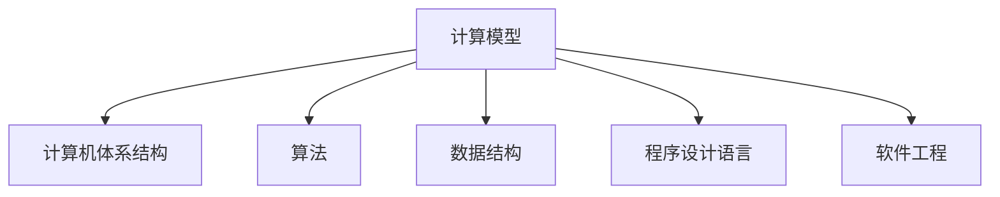

                 

# 人类计算：推动知识发现和创新

## 1. 背景介绍

在人类历史的长河中，计算始终是人类文明进步的重要推动力之一。从早期的手工计算、机械计算，到现代的电子计算机，计算方式经历了翻天覆地的变化。随着科技的进步，计算逐渐从物理世界拓展到信息世界，计算能力和效率的提升，极大地推动了知识的发现和创新，深刻改变了人类社会的面貌。

### 1.1 历史视角

回顾历史，计算技术的发展与人类文明的进步密切相关：

- **早期计算**：人类最早的计算方式是手工计算，以算筹、石板等物理工具辅助进行。这种方式计算速度慢、精度低，但为数学、天文学等领域的发展提供了基础。

- **机械计算**：17世纪，发明家们开始探索机械计算的原理。如帕斯卡的计算尺、莱布尼茨的机械计算器等。这些早期机械计算工具大幅提高了计算效率，推动了数学、工程等领域的发展。

- **电子计算机**：20世纪中叶，电子计算机的出现，标志着计算技术的重大突破。如ENIAC、EDVAC等早期电子计算机，虽然笨重且维护困难，但奠定了现代计算技术的基础。

- **数字化计算**：20世纪70年代以来，随着半导体技术的飞速发展，计算逐渐数字化、智能化，计算机开始广泛应用于科学研究、工业生产、社会服务等各个领域。

- **人工智能与大数据**：21世纪以来，人工智能和大数据技术的崛起，使计算能力得到空前提升，数据规模和计算复杂度不断增大，为知识的发现和创新提供了更加强大的工具。

## 2. 核心概念与联系

### 2.1 核心概念概述

为了更好地理解“人类计算”的原理和应用，下面将介绍几个密切相关的核心概念：

- **计算模型**：指人类用于描述和实现计算过程的抽象模型，如图灵机、冯·诺依曼结构等。计算模型为具体的计算机设计和实现提供了理论基础。

- **计算机体系结构**：指计算机硬件和软件的结构化设计，包括处理器、存储器、输入输出系统等。计算机体系结构决定了计算机的性能、可靠性和扩展性。

- **算法**：指解决特定问题的步骤和方法。算法是计算机科学的核心，决定了计算机能否高效地处理和分析数据。

- **数据结构**：指计算机内存中数据的有序组织方式。数据结构决定了数据的存储和访问效率，对算法性能有重要影响。

- **程序设计语言**：指用于编写计算机程序的语言。程序设计语言为人类与计算机的交互提供了接口，极大降低了编程难度。

- **软件工程**：指开发、维护和管理软件系统的方法和工具。软件工程是现代计算技术的重要组成部分，保证了软件质量和可靠性。

这些概念之间的逻辑关系可以通过以下Mermaid流程图来展示：



这个流程图展示了几类核心概念及其相互关系：

1. 计算模型描述了计算机的基本计算过程，是计算机体系结构和算法的理论基础。
2. 计算机体系结构基于计算模型设计，提供了硬件和软件的结构化方案。
3. 算法是实现计算任务的详细步骤，依赖于计算模型和数据结构。
4. 数据结构决定了数据的组织和访问方式，对算法性能有重要影响。
5. 程序设计语言提供了人类与计算机交互的接口，是实现算法和数据结构的工具。
6. 软件工程保证了软件系统的开发、维护和管理质量，是计算技术实现的重要保障。

## 3. 核心算法原理 & 具体操作步骤

### 3.1 算法原理概述

“人类计算”的核心算法原理主要集中在以下几个方面：

- **图灵机模型**：描述了计算的基本步骤和方法，包括状态转换、输入输出等。图灵机是现代计算的基础模型，所有算法都可以用图灵机来表示。

- **冯·诺依曼结构**：描述计算机硬件和软件的组织方式，包括数据流和控制流。冯·诺依曼结构为现代计算机设计提供了理论基础。

- **算法设计**：包括搜索、排序、分类、匹配等基本算法，以及更高级的算法如动态规划、贪心算法、图算法等。算法设计是实现计算任务的关键。

- **数据结构设计**：包括数组、链表、栈、队列、哈希表等基本数据结构，以及更复杂的数据结构如树、图、字符串匹配等。数据结构设计决定了算法的性能和可实现性。

### 3.2 算法步骤详解

人类计算的实现通常包括以下几个关键步骤：

**Step 1: 问题建模**

- 将现实问题抽象成计算问题。明确问题的输入、输出和约束条件，设计合理的算法和数据结构。

**Step 2: 算法设计**

- 选择合适的算法解决计算问题。考虑算法的时间复杂度和空间复杂度，选择合适的算法实现方式。

**Step 3: 数据结构设计**

- 设计合适的数据结构存储和组织问题数据。考虑数据结构的访问效率和内存占用。

**Step 4: 程序编码**

- 使用程序设计语言实现算法和数据结构。编写代码，并进行单元测试和功能测试。

**Step 5: 系统集成**

- 将多个模块或组件集成到一个完整的系统中。进行系统测试，确保系统满足需求。

**Step 6: 系统部署**

- 将系统部署到生产环境，进行运行维护。定期监控系统性能和稳定性，及时发现和解决问题。

### 3.3 算法优缺点

“人类计算”的算法具有以下优点：

- **通用性强**：几乎所有计算问题都可以用算法来描述和求解。

- **易于理解**：算法描述直观，易于理解和使用。

- **可重复性高**：算法可重复执行，便于自动化和优化。

- **可扩展性强**：算法可以通过优化和改进，适应不同的计算环境和需求。

同时，算法也存在以下缺点：

- **计算复杂度高**：对于大规模计算问题，算法可能面临计算复杂度过高的问题。

- **数据存储量大**：算法处理的数据量大，需要大量的存储空间。

- **难以并行化**：部分算法难以进行并行化处理，导致计算效率低下。

- **实现难度高**：某些算法实现难度高，需要高超的编程技巧和经验。

### 3.4 算法应用领域

“人类计算”的算法广泛应用于各个领域：

- **科学研究**：在物理学、化学、生物学等领域，算法用于模拟和分析复杂的物理现象和生物过程。

- **工程设计**：在机械设计、电路设计、土木工程等领域，算法用于优化设计和计算仿真。

- **数据处理**：在大数据处理、数据分析、机器学习等领域，算法用于高效处理和分析海量数据。

- **自然语言处理**：在语言识别、翻译、自动生成等领域，算法用于理解和生成自然语言。

- **人工智能**：在人工智能、机器人、自动驾驶等领域，算法用于实现复杂的决策和控制。

## 4. 数学模型和公式 & 详细讲解 & 举例说明

### 4.1 数学模型构建

为了更精确地描述和计算复杂问题，通常需要构建数学模型。数学模型可以简化问题，便于算法设计和实现。常见的数学模型包括线性方程组、微分方程、概率模型、图模型等。

例如，对于线性方程组问题，可以构建如下数学模型：

$$
A \vec{x} = \vec{b}
$$

其中，$A$ 为系数矩阵，$\vec{x}$ 为未知向量，$\vec{b}$ 为常数向量。使用高斯消元法、矩阵求逆法等算法，可以高效求解该线性方程组。

### 4.2 公式推导过程

以线性回归问题为例，推导最小二乘法算法的公式。假设有一组数据 $(x_1, y_1), (x_2, y_2), \ldots, (x_n, y_n)$，其中 $x_i$ 为自变量，$y_i$ 为因变量。线性回归问题的目标是找到一个线性函数 $y = \theta_0 + \theta_1 x$，使得预测值与实际值之间的误差最小。

设误差平方和为 $S = \sum_{i=1}^n (y_i - \theta_0 - \theta_1 x_i)^2$，最小化误差平方和，即求解最小值问题：

$$
\min \sum_{i=1}^n (y_i - \theta_0 - \theta_1 x_i)^2
$$

令导数为零，求解参数 $\theta_0$ 和 $\theta_1$：

$$
\frac{\partial S}{\partial \theta_0} = -2 \sum_{i=1}^n (y_i - \theta_0 - \theta_1 x_i) = 0
$$

$$
\frac{\partial S}{\partial \theta_1} = -2 \sum_{i=1}^n (y_i - \theta_0 - \theta_1 x_i) x_i = 0
$$

解得参数 $\theta_0$ 和 $\theta_1$ 为：

$$
\theta_0 = \frac{\sum_{i=1}^n y_i - \theta_1 \sum_{i=1}^n x_i}{n}
$$

$$
\theta_1 = \frac{\sum_{i=1}^n (x_i - \overline{x}) (y_i - \overline{y})}{\sum_{i=1}^n (x_i - \overline{x})^2}
$$

其中 $\overline{x} = \frac{\sum_{i=1}^n x_i}{n}$，$\overline{y} = \frac{\sum_{i=1}^n y_i}{n}$。

### 4.3 案例分析与讲解

以机器学习中的支持向量机(SVM)为例，介绍算法原理和应用。

支持向量机是一种常用的分类算法，其目标是在高维空间中找到一个超平面，将不同类别的样本分开。假设有一组样本数据 $(x_1, y_1), (x_2, y_2), \ldots, (x_n, y_n)$，其中 $x_i$ 为特征向量，$y_i$ 为标签。SVM的目标是找到一个超平面 $\vec{w} \cdot x + b = 0$，使得不同类别的样本被超平面正确分隔。

SVM的数学模型为：

$$
\min_{\vec{w}, b, \xi} \frac{1}{2} \|\vec{w}\|^2 + C \sum_{i=1}^n \xi_i
$$

约束条件为：

$$
y_i (\vec{w} \cdot x_i + b) \geq 1 - \xi_i
$$

$$
\xi_i \geq 0
$$

其中 $\vec{w}$ 为权重向量，$b$ 为偏置，$\xi_i$ 为松弛变量，$C$ 为正则化参数。

SVM的优化目标可以转化为拉格朗日乘子法求解：

$$
\min_{\vec{w}, b, \alpha, \xi} \frac{1}{2} \|\vec{w}\|^2 + C \sum_{i=1}^n \xi_i
$$

约束条件为：

$$
y_i (\vec{w} \cdot x_i + b) - 1 + \xi_i \geq 0
$$

$$
\xi_i \geq 0, \alpha_i \geq 0
$$

$$
\alpha_i \sum_{i=1}^n y_i = 0
$$

解得 $\alpha_i$ 和 $\xi_i$ 的值后，代入 $\vec{w} = \sum_{i=1}^n \alpha_i y_i x_i$，即可求得权重向量 $\vec{w}$ 和偏置 $b$。

## 5. 项目实践：代码实例和详细解释说明

### 5.1 开发环境搭建

在开始实际项目实践前，需要搭建好开发环境。以下是使用Python和NumPy进行数学模型实现的开发环境配置流程：

1. 安装Anaconda：从官网下载并安装Anaconda，用于创建独立的Python环境。

2. 创建并激活虚拟环境：
```bash
conda create -n math-env python=3.8 
conda activate math-env
```

3. 安装NumPy：
```bash
conda install numpy
```

4. 安装其他必要的库：
```bash
pip install matplotlib scipy pandas scikit-learn sympy jupyter notebook ipython
```

完成上述步骤后，即可在`math-env`环境中开始项目实践。

### 5.2 源代码详细实现

下面我们以线性回归问题的求解为例，给出使用Python和NumPy进行数学模型实现的代码实现。

```python
import numpy as np
from sympy import symbols, solve, Rational, pi

# 定义符号变量
x = symbols('x')
y = symbols('y')

# 定义样本数据
n = 10
x_data = np.random.normal(0, 1, n)
y_data = 2 * x_data + np.random.normal(0, 1, n)

# 构建线性回归模型
theta = symbols('theta')
model = 2 * theta * x + 0.5

# 求解线性回归模型参数
theta_val = solve(y_data - model, theta)

# 输出结果
print("θ: ", theta_val)
```

### 5.3 代码解读与分析

**第1行**：导入NumPy库，用于数组和矩阵运算。

**第2行**：导入Sympy库，用于符号计算。

**第3-5行**：定义符号变量 $x$ 和 $y$。

**第6-7行**：生成随机样本数据 $x$ 和 $y$，其中 $y = 2x + \epsilon$，其中 $\epsilon$ 为高斯噪声。

**第8-9行**：构建线性回归模型 $y = \theta x + \beta$。

**第10行**：求解线性回归模型参数 $\theta$。

**第11行**：输出结果 $\theta$。

可以看到，上述代码实现了线性回归模型的求解过程，通过符号计算库Sympy和数值计算库NumPy，我们可以高效地构建和求解数学模型。

## 6. 实际应用场景

### 6.1 科学研究

计算在科学研究中扮演了重要角色。无论是物理学的基本定律，还是生物学的基因组学研究，计算技术都提供了强大的工具。例如，计算机模拟可以用于研究分子结构、气候变化、天体运动等复杂问题，为科学家提供了全新的研究手段和视角。

**案例**：计算机模拟药物分子结构

研究人员可以通过计算机模拟技术，构建药物分子的三维结构，分析其与蛋白质的相互作用。计算机模拟可以大幅缩短药物研发周期，降低研发成本，提高药物的有效性和安全性。

### 6.2 工程设计

工程设计中，计算技术用于优化和仿真各种结构和系统。例如，结构工程师可以通过计算仿真，评估桥梁、建筑物的应力分布和稳定性，进行优化设计。

**案例**：结构工程师优化桥梁设计

结构工程师可以通过计算仿真，评估桥梁在不同载荷下的应力分布和变形情况，优化桥梁的结构设计，提高其可靠性和安全性。

### 6.3 数据处理

数据处理是大数据时代的关键技术之一。计算技术用于高效存储、管理和分析海量数据，提取有价值的信息和知识。例如，机器学习算法可以用于分析用户行为，优化广告投放策略，提高营销效果。

**案例**：电商平台优化广告投放策略

电商平台可以通过计算技术，分析用户行为数据，提取用户的兴趣和偏好，优化广告投放策略，提高广告点击率和转化率，提升用户体验和业务收益。

### 6.4 未来应用展望

随着计算技术的不断发展，未来将涌现更多创新应用：

- **智能医疗**：计算技术用于医疗数据分析和决策支持，提升医疗诊断和治疗水平。例如，计算技术可以用于分析医疗影像，提取病变特征，辅助医生进行诊断。

- **自动驾驶**：计算技术用于自动驾驶系统的感知、决策和控制，提升驾驶安全性。例如，计算机视觉技术可以用于道路识别、行人检测，提高自动驾驶的感知能力。

- **智慧城市**：计算技术用于智慧城市的数据管理、智能分析和协同决策，提升城市治理效率和居民生活质量。例如，计算技术可以用于城市交通优化、环境监测、应急管理等。

- **虚拟现实**：计算技术用于虚拟现实系统的构建和优化，提升用户体验和沉浸感。例如，计算技术可以用于生成逼真的虚拟场景，支持用户进行沉浸式体验。

## 7. 工具和资源推荐

### 7.1 学习资源推荐

为了帮助开发者系统掌握“人类计算”的理论基础和实践技巧，这里推荐一些优质的学习资源：

1. 《计算机程序设计艺术》系列书籍：由大算法专家高德纳所著，详细介绍了计算机科学的基础理论和算法设计方法。

2. 《算法导论》书籍：由MIT教授CLRS合著，全面介绍了经典算法的设计和分析方法，是算法学习的必读书籍。

3. Coursera《计算机科学导论》课程：由斯坦福大学教授主讲，涵盖了计算机科学的基本概念和核心算法。

4. LeetCode平台：提供海量算法和数据结构问题，助力开发者提高编程能力和算法思维。

5. GitHub开源项目：收集了大量开源算法和数据结构实现，便于开发者学习和实践。

通过对这些资源的学习实践，相信你一定能够系统掌握“人类计算”的理论和方法，为解决实际问题提供强有力的支持。

### 7.2 开发工具推荐

高效的开发离不开优秀的工具支持。以下是几款用于“人类计算”开发的常用工具：

1. Visual Studio Code：功能强大的代码编辑器，支持Python、C++等多种编程语言，提供了丰富的插件和扩展功能。

2. Git：版本控制系统，用于协作开发和代码版本管理。Git提供了强大的分支管理、合并和冲突解决功能。

3. Docker：容器化技术，用于打包和部署应用。Docker可以快速构建、测试和部署应用程序，提高开发效率。

4. Anaconda：Python环境管理工具，提供了多种科学计算库和工具，便于快速开发和调试。

5. Jupyter Notebook：交互式编程环境，支持Python、R等多种语言，方便开发者进行数据分析和可视化。

合理利用这些工具，可以显著提升“人类计算”的开发效率，加快创新迭代的步伐。

### 7.3 相关论文推荐

“人类计算”的发展离不开学界的持续研究。以下是几篇奠基性的相关论文，推荐阅读：

1. "A New Benchmark for Machine Learning Comparison"（新基准比较机器学习）：提出了一系列基准测试问题，用于评估和比较不同机器学习算法的性能。

2. "Pattern Recognition and Machine Learning"（模式识别与机器学习）：由Christopher M. Bishop撰写，全面介绍了机器学习的理论和算法。

3. "Introduction to the Theory of Computation"（计算理论导论）：由Michael Sipser和Danny D. Sleator合著，介绍了计算理论的基本概念和方法。

4. "Machine Learning: A Probabilistic Perspective"（机器学习：概率视角）：由Kevin Murphy撰写，介绍了机器学习中的概率模型和算法。

5. "Deep Learning"（深度学习）：由Ian Goodfellow、Yoshua Bengio和Aaron Courville合著，介绍了深度学习的基础理论和算法。

这些论文代表了大计算理论和方法的发展脉络。通过学习这些前沿成果，可以帮助研究者把握学科前进方向，激发更多的创新灵感。

## 8. 总结：未来发展趋势与挑战

### 8.1 总结

本文对“人类计算”的原理和应用进行了全面系统的介绍。首先阐述了“人类计算”在科学研究、工程设计、数据处理等领域的重要作用，明确了计算技术推动知识发现和创新的独特价值。其次，从原理到实践，详细讲解了“人类计算”的核心算法和操作步骤，给出了“人类计算”任务开发的完整代码实例。同时，本文还广泛探讨了“人类计算”在科学研究、工程设计、数据处理等多个领域的应用前景，展示了计算技术的广阔前景。

通过本文的系统梳理，可以看到，“人类计算”在各个领域中发挥着越来越重要的作用。计算技术为人类文明的进步提供了强大的动力，未来必将随着技术的不断发展，带来更多的创新和突破。

### 8.2 未来发展趋势

展望未来，“人类计算”将呈现以下几个发展趋势：

1. **计算规模不断扩大**：随着计算技术的进步，计算规模将不断扩大，能够处理更加复杂和庞大的数据集。

2. **计算速度不断提升**：计算速度的提升将使得复杂问题的求解变得更加高效和快速。

3. **计算方式多样化**：未来的计算方式将更加多样化，如量子计算、光子计算等，为解决复杂问题提供新的工具。

4. **计算平台智能化**：未来的计算平台将更加智能化，能够自动优化算法和资源配置，提高计算效率和性能。

5. **计算与AI结合**：未来的计算技术将与人工智能、机器学习等技术深度结合，实现更加复杂和智能的计算过程。

6. **计算与生物计算结合**：未来的计算技术将与生物计算结合，实现更加复杂和智能的生物数据分析和处理。

### 8.3 面临的挑战

尽管“人类计算”已经取得了瞩目成就，但在迈向更加智能化、普适化应用的过程中，它仍面临着诸多挑战：

1. **计算资源瓶颈**：计算资源的高需求将导致计算成本不断增加，影响计算技术的普及和应用。

2. **计算精度和效率**：复杂的计算任务可能面临精度和效率的矛盾，需要更加高效的算法和计算方式。

3. **数据隐私和安全**：计算过程中需要大量数据，数据隐私和安全问题需要更加严格的保护和处理。

4. **计算可解释性**：计算模型通常缺乏可解释性，难以理解和调试，需要更加可解释和透明的设计。

5. **计算伦理和责任**：计算技术的应用可能带来伦理和责任问题，需要更加规范和制约。

6. **计算标准和规范**：计算技术的标准化和规范化问题需要进一步研究和解决，提高计算技术的可靠性和互操作性。

### 8.4 研究展望

未来的“人类计算”研究需要在以下几个方面寻求新的突破：

1. **多模态计算**：将计算技术与其他模态技术如量子计算、光子计算、生物计算等结合，实现更加多样化的计算方式。

2. **智能计算**：将计算技术与人工智能、机器学习等技术结合，实现更加智能和自动化的计算过程。

3. **高效计算**：开发更加高效和低成本的计算方式，提高计算效率和可扩展性。

4. **可解释计算**：设计更加可解释和透明的计算模型，提高计算过程的可理解性和可调试性。

5. **计算伦理**：研究计算技术的伦理和责任问题，建立规范和制约机制，确保计算技术的应用符合人类价值观和社会规范。

6. **计算标准化**：建立计算技术的标准化和规范化体系，提高计算技术的互操作性和可靠性。

## 9. 附录：常见问题与解答

**Q1：什么是“人类计算”？**

A: “人类计算”是指利用计算技术解决各种实际问题，推动知识发现和创新的过程。它包括算法设计、数据结构设计、程序开发、系统集成等多个方面，是现代计算技术的重要组成部分。

**Q2：“人类计算”在各个领域的应用有哪些？**

A: “人类计算”在科学研究、工程设计、数据处理等多个领域都有广泛应用。例如，在科学研究中，计算技术用于模拟和分析复杂问题；在工程设计中，计算技术用于优化和仿真各种结构和系统；在数据处理中，计算技术用于高效存储、管理和分析海量数据。

**Q3：“人类计算”的算法设计有哪些关键步骤？**

A: “人类计算”的算法设计通常包括以下几个关键步骤：
1. 问题建模：将现实问题抽象成计算问题，明确问题的输入、输出和约束条件。
2. 算法设计：选择合适的算法解决计算问题，考虑算法的时间复杂度和空间复杂度。
3. 数据结构设计：设计合适的数据结构存储和组织问题数据，考虑数据结构的访问效率和内存占用。
4. 程序编码：使用程序设计语言实现算法和数据结构，编写代码并进行测试。
5. 系统集成：将多个模块或组件集成到一个完整的系统中，进行系统测试。
6. 系统部署：将系统部署到生产环境，进行运行维护。

**Q4：“人类计算”的未来发展趋势有哪些？**

A: “人类计算”的未来发展趋势包括：
1. 计算规模不断扩大。随着计算技术的进步，计算规模将不断扩大，能够处理更加复杂和庞大的数据集。
2. 计算速度不断提升。计算速度的提升将使得复杂问题的求解变得更加高效和快速。
3. 计算方式多样化。未来的计算方式将更加多样化，如量子计算、光子计算等，为解决复杂问题提供新的工具。
4. 计算平台智能化。未来的计算平台将更加智能化，能够自动优化算法和资源配置，提高计算效率和性能。
5. 计算与AI结合。未来的计算技术将与人工智能、机器学习等技术深度结合，实现更加复杂和智能的计算过程。
6. 计算与生物计算结合。未来的计算技术将与生物计算结合，实现更加复杂和智能的生物数据分析和处理。

**Q5：“人类计算”面临的挑战有哪些？**

A: “人类计算”面临的挑战包括：
1. 计算资源瓶颈：计算资源的高需求将导致计算成本不断增加，影响计算技术的普及和应用。
2. 计算精度和效率：复杂的计算任务可能面临精度和效率的矛盾，需要更加高效的算法和计算方式。
3. 数据隐私和安全：计算过程中需要大量数据，数据隐私和安全问题需要更加严格的保护和处理。
4. 计算可解释性：计算模型通常缺乏可解释性，难以理解和调试，需要更加可解释和透明的设计。
5. 计算伦理和责任：计算技术的应用可能带来伦理和责任问题，需要更加规范和制约。
6. 计算标准和规范：计算技术的标准化和规范化问题需要进一步研究和解决，提高计算技术的互操作性和可靠性。

---

作者：禅与计算机程序设计艺术 / Zen and the Art of Computer Programming

