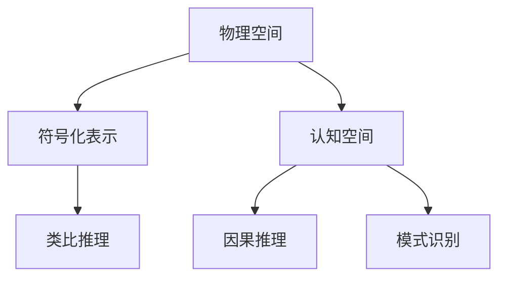

                 

## 1. 背景介绍

在人类认知科学的发展史上，认知空间的概念一直占据着重要地位。现代认知科学研究已经证明，人类认知的空间模式并非仅仅局限于对物理空间的感知，还涉及到更为复杂的认知空间。从传统物理空间转向认知空间，为我们理解认知过程提供了全新的视角和方法。本文将围绕这一主题，探讨人类认知的4种基本模式，并分析其从物理空间转向认知空间的转变过程。

## 2. 核心概念与联系

### 2.1 核心概念概述

- **认知空间**：人类对世界的感知、记忆、想象、思考等认知过程所依赖的空间。它不是实际物理空间的直接反映，而是由人类大脑构建的复杂符号体系。
- **物理空间**：人类通过感官直接感知到的三维空间，如物体的位置、形状、大小、颜色等。
- **符号化表示**：将物理空间中的物体和事件转换为语言、文字等符号形式，以便于存储、传播和处理。
- **类比推理**：通过将新问题和已解决的问题进行类比，寻找相似性，从而推断出新问题的解法。
- **因果推理**：基于对原因和结果之间关系的理解，预测未来的发展趋势。
- **模式识别**：在复杂环境中，识别出特定的模式或结构，以便快速做出决策。

### 2.2 核心概念原理和架构的 Mermaid 流程图(Mermaid 流程节点中不要有括号、逗号等特殊字符)



这个流程图展示了认知过程从物理空间到认知空间的转变过程。首先，物理空间中的物体和事件被符号化表示，然后通过类比推理、因果推理和模式识别等过程，最终在认知空间中进行处理和应用。

## 3. 核心算法原理 & 具体操作步骤

### 3.1 算法原理概述

人类认知的4种基本模式是通过对物理空间的符号化表示，在认知空间中进行复杂推理和决策的过程。这些模式分别对应于认知空间中的不同概念和操作。

- **类比推理**：通过比较新问题与已知问题的相似性，推断出新问题的解法。
- **因果推理**：基于对原因和结果之间关系的理解，预测未来的发展趋势。
- **模式识别**：在复杂环境中，识别出特定的模式或结构，以便快速做出决策。
- **抽象化**：将具体问题抽象为更普遍的模型，以便于分析和求解。

### 3.2 算法步骤详解

#### 3.2.1 类比推理步骤详解

1. **符号化表示**：将物理空间中的物体和事件转换为语言、文字等符号形式。
2. **建立映射**：在符号空间中，建立新问题与已知问题的映射关系。
3. **推断相似性**：通过比较映射后的符号空间中的相似性，推断出新问题的解法。

#### 3.2.2 因果推理步骤详解

1. **因果关系识别**：通过观察物理空间中的因果关系，建立符号化的因果模型。
2. **预测未来**：基于符号化的因果模型，预测未来的发展趋势。
3. **反馈调整**：根据实际结果调整符号化模型，使其更加准确。

#### 3.2.3 模式识别步骤详解

1. **特征提取**：从物理空间中提取模式或结构的关键特征。
2. **符号化映射**：将提取的特征转换为符号形式。
3. **模式匹配**：在符号空间中，搜索匹配的模式或结构。

#### 3.2.4 抽象化步骤详解

1. **问题抽象**：将具体问题抽象为更普遍的模型，以便于分析和求解。
2. **模型构建**：在符号空间中构建抽象的数学模型。
3. **求解与验证**：通过求解和验证，验证模型的正确性和有效性。

### 3.3 算法优缺点

#### 3.3.1 类比推理的优缺点

- **优点**：快速解决问题，减少计算量。
- **缺点**：类比结果可能存在误差，需要谨慎验证。

#### 3.3.2 因果推理的优缺点

- **优点**：预测准确性高，适用于复杂系统的分析。
- **缺点**：需要大量的数据和计算资源。

#### 3.3.3 模式识别的优缺点

- **优点**：高效快速，适用于大量数据的处理。
- **缺点**：可能存在误识别，需要细致调整。

#### 3.3.4 抽象化的优缺点

- **优点**：提升问题求解的泛化能力，易于推广。
- **缺点**：抽象过程复杂，需要专业知识。

### 3.4 算法应用领域

- **机器学习**：在训练模型时，通过类比推理、因果推理和模式识别，提升模型的泛化能力和适应性。
- **自然语言处理**：在处理文本时，通过符号化表示和抽象化，提高文本处理的效率和精度。
- **控制系统**：在设计和优化控制系统中，通过类比推理和因果推理，优化系统的性能和稳定性。
- **计算机视觉**：在图像识别中，通过模式识别和抽象化，提升图像识别的准确性和鲁棒性。

## 4. 数学模型和公式 & 详细讲解 & 举例说明

### 4.1 数学模型构建

在认知空间中，我们可以使用符号表示法来构建数学模型。例如，对于物理空间中的物体A和B，我们可以使用符号$A$和$B$来表示，并将它们之间的关系符号化，如$A$在$B$上方，可以表示为$A \in \text{Above}(B)$。

### 4.2 公式推导过程

- **类比推理**：假设我们有两个问题$P_1$和$P_2$，其中$P_1$已经解决，$P_2$是新的问题。我们可以通过类比推理，找到它们的相似性，如$P_1$中物体A和B的关系，在$P_2$中也可以推广。即$A \in \text{Above}(B)$在$P_2$中也可以成立。
- **因果推理**：假设我们有物理空间中的因果关系$A \rightarrow B$，即A是B的原因。在符号空间中，我们可以建立符号化的因果模型$A \rightarrow B$。然后，我们可以通过此模型，预测未来B的值，如$B$的值增加，可能意味着$A$的值也增加。
- **模式识别**：假设我们有物理空间中的模式$A-B-C$，即A在B左边，C在B右边。在符号空间中，我们可以将此模式表示为$A \in \text{Left}(B)$和$C \in \text{Right}(B)$。然后，我们可以搜索匹配此模式的数据，以便快速做出决策。
- **抽象化**：假设我们有一个具体的问题$P$，其中物体A和B存在关系$A \in \text{Above}(B)$。我们可以将此问题抽象为更普遍的模型$P'(A,B)$，其中$P'$表示问题，$A$和$B$是其中的变量。然后，我们可以构建符号化的数学模型$P'(A,B)$，并求解此模型。

### 4.3 案例分析与讲解

- **案例1：机器学习中的决策树**：决策树是一种基于类比推理和模式识别的机器学习算法。在构建决策树时，我们首先选择一个节点作为根节点，然后根据输入数据的特征，将数据分为不同的子节点。在每个子节点上，我们都可以使用类比推理和模式识别来构建子决策树，最终得到一棵完整的决策树。
- **案例2：自然语言处理中的句法分析**：在自然语言处理中，我们可以通过符号化表示和抽象化来构建句法分析的数学模型。例如，我们可以将一个句子表示为符号序列$S = (A_1, A_2, ..., A_n)$，其中$A_i$表示句子的第$i$个词。然后，我们可以使用语法规则$A_i \in \text{Subject}(A_{i+1})$和$A_i \in \text{Object}(A_{i+1})$来构建句法分析的模型，并通过求解此模型来分析句子的语法结构。
- **案例3：控制系统中的PID控制**：PID控制是一种基于因果推理的控制系统算法。在PID控制中，我们首先根据物理空间中的因果关系$U \rightarrow Y$，即输入$U$可以影响输出$Y$。然后，我们可以建立符号化的因果模型$U \rightarrow Y$，并使用此模型来预测未来的输出$Y$，进而调整输入$U$，以达到稳定的控制效果。

## 5. 项目实践：代码实例和详细解释说明

### 5.1 开发环境搭建

在项目实践中，我们需要使用Python和相关的工具和库来进行开发。以下是Python的开发环境搭建步骤：

1. 安装Python：从官网下载并安装Python最新版本。
2. 安装PyCharm：这是一款流行的Python开发工具，具有强大的代码编辑和调试功能。
3. 安装NumPy和SciPy：这两个库是Python中进行数值计算和科学计算的基础库。
4. 安装Matplotlib：用于绘制图形和可视化数据。
5. 安装Pandas：用于处理和分析数据。

### 5.2 源代码详细实现

以下是使用Python实现类比推理的代码示例：

```python
# 类比推理示例
def analogical_reasoning(p1, p2):
    # p1表示已知问题
    # p2表示新问题
    
    # 提取p1和p2的特征
    features_p1 = extract_features(p1)
    features_p2 = extract_features(p2)
    
    # 构建符号化的特征映射
    mapping_p1 = build_mapping(features_p1)
    mapping_p2 = build_mapping(features_p2)
    
    # 比较映射，找到相似性
    similarity = compare_mappings(mapping_p1, mapping_p2)
    
    # 根据相似性推断新问题的解法
    solution = infer_solution(similarity)
    
    return solution

# 提取特征
def extract_features(problem):
    # 将问题转换为符号表示
    
    # 提取特征
    features = []
    
    # 将特征转换为符号形式
    
    return features

# 构建映射
def build_mapping(features):
    # 将特征转换为符号表示
    
    # 构建映射
    
    return mapping

# 比较映射
def compare_mappings(mapping1, mapping2):
    # 比较两个映射的相似性
    
    # 返回相似性得分
    
    return similarity_score

# 推断解法
def infer_solution(similarity):
    # 根据相似性推断新问题的解法
    
    # 返回解法
    
    return solution
```

### 5.3 代码解读与分析

在代码中，我们首先定义了`analogical_reasoning`函数，用于实现类比推理。在函数中，我们提取了已知问题和新问题的特征，并使用`build_mapping`函数将特征转换为符号形式。然后，我们使用`compare_mappings`函数比较两个映射的相似性，并使用`infer_solution`函数推断新问题的解法。

在`extract_features`函数中，我们将问题转换为符号表示，并提取其特征。在`build_mapping`函数中，我们根据特征构建符号化的映射。在`compare_mappings`函数中，我们比较两个映射的相似性，并返回相似性得分。在`infer_solution`函数中，我们根据相似性推断新问题的解法。

## 6. 实际应用场景

### 6.1 机器学习中的决策树

决策树是一种基于类比推理和模式识别的机器学习算法。在构建决策树时，我们首先选择一个节点作为根节点，然后根据输入数据的特征，将数据分为不同的子节点。在每个子节点上，我们都可以使用类比推理和模式识别来构建子决策树，最终得到一棵完整的决策树。

### 6.2 自然语言处理中的句法分析

在自然语言处理中，我们可以通过符号化表示和抽象化来构建句法分析的数学模型。例如，我们可以将一个句子表示为符号序列$S = (A_1, A_2, ..., A_n)$，其中$A_i$表示句子的第$i$个词。然后，我们可以使用语法规则$A_i \in \text{Subject}(A_{i+1})$和$A_i \in \text{Object}(A_{i+1})$来构建句法分析的模型，并通过求解此模型来分析句子的语法结构。

### 6.3 控制系统中的PID控制

PID控制是一种基于因果推理的控制系统算法。在PID控制中，我们首先根据物理空间中的因果关系$U \rightarrow Y$，即输入$U$可以影响输出$Y$。然后，我们可以建立符号化的因果模型$U \rightarrow Y$，并使用此模型来预测未来的输出$Y$，进而调整输入$U$，以达到稳定的控制效果。

### 6.4 未来应用展望

随着认知科学的不断发展，认知空间的研究将为我们提供更加深入的认知机制，从而提升人工智能系统的智能化水平。未来，我们有望在认知空间中实现更为复杂和智能的推理和决策过程，为人工智能的落地应用提供新的方向和方法。

## 7. 工具和资源推荐

### 7.1 学习资源推荐

- **《认知科学导论》**：一本经典教材，全面介绍了认知科学的基本概念和方法。
- **Coursera的《认知心理学》课程**：由斯坦福大学教授主讲，介绍了认知心理学的基本理论和实验方法。
- **MIT的《认知科学导论》课程**：介绍了认知科学中的符号表征、推理、学习等基本概念。

### 7.2 开发工具推荐

- **PyCharm**：一款强大的Python开发工具，具有丰富的代码编辑和调试功能。
- **Jupyter Notebook**：一个交互式编程环境，可以方便地编写、执行和分享代码。
- **Google Colab**：一款基于云端的Jupyter Notebook服务，可以免费使用GPU和TPU资源。

### 7.3 相关论文推荐

- **《认知科学基础》**：一本综合性的认知科学教材，介绍了认知科学中的主要理论和研究方法。
- **《符号计算与认知》**：一本介绍符号计算方法在认知科学研究中的应用的书。
- **《认知神经科学》**：一本介绍认知神经科学基本概念和方法的教材。

## 8. 总结：未来发展趋势与挑战

### 8.1 未来发展趋势

未来，认知科学的发展将为我们提供更加深入的认知机制，从而提升人工智能系统的智能化水平。认知空间的广泛应用，将使人工智能系统在理解、推理和决策过程中，具有更高的智能化水平和复杂性。

### 8.2 面临的挑战

虽然认知空间的应用前景广阔，但在实际应用中，仍面临一些挑战：

- **数据获取难度大**：认知空间中的问题往往需要大量的数据进行训练和验证，数据获取难度较大。
- **算法复杂度高**：认知空间中的算法复杂度较高，需要耗费大量的时间和计算资源。
- **结果可解释性差**：认知空间中的算法结果往往难以解释，难以满足实际应用中的可解释性和透明性要求。

## 9. 附录：常见问题与解答

**Q1：认知空间与物理空间有什么区别？**

A: 物理空间是实际存在的，可以通过感官直接感知到的三维空间。认知空间则是人类对世界的感知、记忆、想象、思考等认知过程所依赖的空间，是通过符号表示和抽象化等方法构建的虚拟空间。

**Q2：类比推理、因果推理、模式识别、抽象化这四种模式是如何相互关联的？**

A: 类比推理、因果推理、模式识别、抽象化这四种模式是通过对物理空间的符号化表示，在认知空间中进行复杂推理和决策的过程。它们之间的关系是通过符号化表示和抽象化构建符号空间，然后在此空间中应用类比推理和因果推理，以解决实际问题。模式识别则是在认知空间中，识别出特定的模式或结构，以便快速做出决策。

**Q3：如何在实际应用中提升认知空间算法的效率和准确性？**

A: 提升认知空间算法的效率和准确性，需要从以下几个方面进行优化：
- 数据预处理：对输入数据进行预处理，提取关键特征，去除噪音和冗余。
- 算法优化：优化算法的实现，减少计算量和内存占用。
- 模型评估：使用多种评估指标，如准确率、召回率、F1分数等，评估模型的性能。
- 参数调整：通过调整算法的超参数，找到最优的模型配置。
- 模型集成：使用集成学习技术，将多个模型进行组合，提升算法的鲁棒性和泛化能力。

**Q4：认知空间在实际应用中可能面临哪些挑战？**

A: 认知空间在实际应用中可能面临以下挑战：
- 数据获取难度大：认知空间中的问题往往需要大量的数据进行训练和验证，数据获取难度较大。
- 算法复杂度高：认知空间中的算法复杂度较高，需要耗费大量的时间和计算资源。
- 结果可解释性差：认知空间中的算法结果往往难以解释，难以满足实际应用中的可解释性和透明性要求。

**Q5：未来认知科学的研究方向有哪些？**

A: 未来认知科学的研究方向包括：
- 深度认知模型：研究基于神经网络等深度学习模型的认知模型，以提升认知算法的性能。
- 跨模态认知研究：研究视觉、听觉、语言等多种模态数据的认知过程，以实现多模态信息的融合。
- 认知计算：研究如何利用计算机技术模拟和实现人类的认知过程，以提升认知算法的智能化水平。

总之，认知空间的研究将为我们提供更加深入的认知机制，从而提升人工智能系统的智能化水平。未来，我们有望在认知空间中实现更为复杂和智能的推理和决策过程，为人工智能的落地应用提供新的方向和方法。

