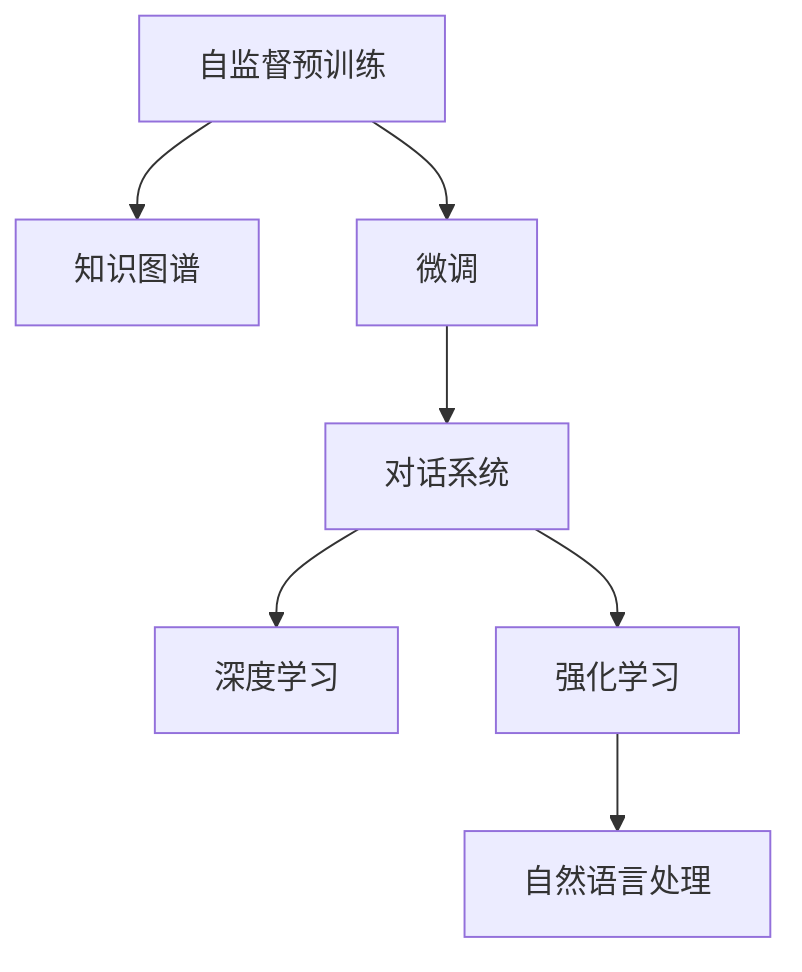

                 

## 1. 背景介绍

### 1.1 问题由来

随着人工智能技术的飞速发展，AI助手正迅速成为人们日常生活和工作中的重要伙伴。从最早的简单查询系统，到现在的智能问答、自然对话、甚至是创作辅助，AI助手的功能和应用场景不断拓展，其影响力也在日益扩大。特别是2023年发布的ChatGPT，以其卓越的文本生成能力和丰富的知识储备，重新定义了AI助手的标准。

然而，尽管ChatGPT取得了令人瞩目的成果，其在某些复杂任务上的表现仍有所局限。如何进一步提升AI助手的智能水平，使其能够应对更多、更复杂的场景，仍然是AI领域的重要课题。本文将从ChatGPT出发，探讨AI助手的核心技术及其未来发展趋势，为AI助手的未来发展提供参考。

### 1.2 问题核心关键点

当前，AI助手的发展主要依赖于深度学习技术，尤其是Transformer模型和自监督预训练。其中，自监督预训练通过在大规模无标签数据上训练模型，使其具备对语言规则和语义关系的深刻理解。基于预训练模型，AI助手通过微调等技术，针对特定任务进行参数优化，提升模型在特定任务上的表现。

微调是AI助手实现特定任务智能化的关键方法。通过微调，模型可以在少量的标注数据上快速适应任务需求，实现高效、准确的知识迁移。而ChatGPT作为大语言模型的一个代表，其微调方法具有一定的通用性和普适性，为AI助手的未来发展提供了重要的借鉴和基础。

## 2. 核心概念与联系

### 2.1 核心概念概述

为了更好地理解ChatGPT及其未来AI助手，我们首先介绍几个核心概念：

- **大语言模型(Large Language Model, LLM)**：以Transformer模型为代表，通过在大规模无标签文本语料上进行自监督预训练，学习通用的语言表示。常见的预训练任务包括掩码语言模型和语言建模等。

- **自监督预训练(Pre-training)**：指在大规模无标签文本数据上，通过自监督学习任务训练通用语言模型的过程。自监督预训练使得模型学习到语言的通用表示，能够在特定任务上进行微调。

- **微调(Fine-tuning)**：指在预训练模型的基础上，使用下游任务的少量标注数据，通过有监督学习优化模型在特定任务上的性能。通常只调整顶层分类器或解码器，以较小的学习率更新全部或部分模型参数。

- **对话系统(Conversational System)**：一种能够模拟人类对话的智能系统，用于回答问题、执行命令、提供信息等。

- **知识图谱(Knowledge Graph)**：一种用于表示实体和实体之间关系的图形结构，帮助AI助手更好地理解和组织知识。

- **深度学习(Deep Learning)**：一类基于人工神经网络的机器学习技术，通过多层非线性变换，学习复杂的数据表示和模式识别。

- **强化学习(Reinforcement Learning)**：一种通过试错学习，使智能体在特定环境中最大化累积奖励的机器学习方法。

这些核心概念共同构成了AI助手的技术基础，使得AI助手能够通过预训练和微调技术，实现对大量知识的整合和应用，提供智能化的对话和决策支持。

### 2.2 核心概念原理和架构的 Mermaid 流程图



以上流程图展示了AI助手技术栈的核心架构：自监督预训练是基础，知识图谱和微调是核心的知识获取和任务适配方法，对话系统和深度学习用于模拟人类对话，强化学习用于提升系统性能，自然语言处理用于理解语言的语义和语法。这些模块共同构成了AI助手的核心技术栈，使其能够高效地处理各种任务。

## 3. 核心算法原理 & 具体操作步骤

### 3.1 算法原理概述

AI助手的核心算法基于深度学习和自监督预训练，通过在大规模无标签数据上进行预训练，学习到语言的通用表示。在此基础上，AI助手通过微调技术，在特定任务上进行有监督学习，优化模型在任务上的表现。

AI助手的微调过程通常包括以下步骤：

1. **数据准备**：收集和预处理下游任务的标注数据，划分为训练集、验证集和测试集。
2. **模型选择**：选择合适的预训练模型，如BERT、GPT等，作为初始化参数。
3. **任务适配层设计**：根据任务类型，设计合适的输出层和损失函数，如分类任务中的线性分类器和交叉熵损失函数。
4. **超参数设置**：选择合适的优化器及其参数，如AdamW、SGD等，设置学习率、批大小、迭代轮数等。
5. **模型训练**：使用训练集数据对模型进行梯度训练，在每个epoch结束时，在验证集上评估模型性能，并根据性能决定是否触发Early Stopping。
6. **模型评估**：在测试集上评估微调后模型的性能，与微调前后的精度提升进行对比。
7. **模型部署**：将微调后的模型集成到实际的应用系统中，持续收集新的数据，定期重新微调模型。

### 3.2 算法步骤详解

以下以ChatGPT为例，详细讲解微调的各个步骤：

#### 3.2.1 数据准备

ChatGPT的微调数据主要来源于特定领域的对话数据集，如客服、医疗咨询、法律咨询等。这些数据集需要经过清洗、标注和预处理，才能用于模型训练。具体步骤如下：

1. **数据收集**：收集特定领域的对话数据集，如客服对话记录、医疗咨询记录等。
2. **数据清洗**：去除噪声、无关信息，保留高质量的对话数据。
3. **数据标注**：对对话数据进行标注，标注用户的意图和系统的回复。

#### 3.2.2 模型选择

ChatGPT采用Transformer模型作为基础模型，其预训练过程在Google的Pile、BigQuery、BigPython等大规模无标签文本语料上完成。这些语料涵盖了广泛的知识领域，使得ChatGPT具备了丰富的语言表示能力。

#### 3.2.3 任务适配层设计

ChatGPT的任务适配层主要包括线性分类器和交叉熵损失函数。在线性分类器中，模型将输入的对话历史映射到特定的意图或回复上。在交叉熵损失函数中，模型计算预测输出与真实标签之间的差异。

#### 3.2.4 超参数设置

ChatGPT的微调超参数主要包括优化器、学习率、批大小等。在微调过程中，一般使用AdamW优化器，设置较小的学习率（如1e-5），避免破坏预训练权重。

#### 3.2.5 模型训练

在模型训练过程中，ChatGPT使用训练集数据进行梯度训练。每个epoch结束后，在验证集上评估模型性能，并根据性能决定是否停止训练。

#### 3.2.6 模型评估

在测试集上评估微调后模型的性能，与微调前后的精度提升进行对比，确保模型在特定任务上的表现有所提升。

#### 3.2.7 模型部署

微调后的ChatGPT模型可以部署到实际的AI助手系统中，持续收集新的对话数据，定期重新微调模型，以适应数据分布的变化。

### 3.3 算法优缺点

ChatGPT的微调方法具有以下优点：

1. **简单高效**：只需准备少量标注数据，即可对预训练模型进行快速适配，获得较大的性能提升。
2. **通用适用**：适用于各种NLP下游任务，包括分类、匹配、生成等，设计简单的任务适配层即可实现微调。
3. **参数高效**：利用参数高效微调技术，在固定大部分预训练参数的情况下，仍可取得不错的提升。
4. **效果显著**：在学术界和工业界的诸多任务上，基于微调的方法已经刷新了最先进的性能指标。

同时，该方法也存在一定的局限性：

1. **依赖标注数据**：微调的效果很大程度上取决于标注数据的质量和数量，获取高质量标注数据的成本较高。
2. **迁移能力有限**：当目标任务与预训练数据的分布差异较大时，微调的性能提升有限。
3. **负面效果传递**：预训练模型的固有偏见、有害信息等，可能通过微调传递到下游任务，造成负面影响。
4. **可解释性不足**：微调模型的决策过程通常缺乏可解释性，难以对其推理逻辑进行分析和调试。

尽管存在这些局限性，但就目前而言，基于监督学习的微调方法仍是大语言模型应用的最主流范式。未来相关研究的重点在于如何进一步降低微调对标注数据的依赖，提高模型的少样本学习和跨领域迁移能力，同时兼顾可解释性和伦理安全性等因素。

### 3.4 算法应用领域

ChatGPT的微调方法已经广泛应用于多个领域，例如：

- **智能客服**：利用微调后的ChatGPT构建智能客服系统，能够7x24小时不间断服务，快速响应客户咨询，用自然流畅的语言解答各类常见问题。
- **医疗咨询**：通过微调ChatGPT，构建医疗咨询系统，帮助患者快速获得医生建议，提升医疗服务的智能化水平。
- **法律咨询**：利用微调后的ChatGPT，构建法律咨询系统，提供法律建议和信息查询服务，减轻律师的工作负担。
- **金融咨询**：通过微调ChatGPT，构建金融咨询系统，提供股票、基金等金融产品的分析与建议。
- **教育辅导**：利用微调后的ChatGPT，构建教育辅导系统，提供课程讲解、作业批改等服务，提升教学质量。

除了上述这些经典任务外，ChatGPT的微调方法还被创新性地应用到更多场景中，如可控文本生成、常识推理、代码生成、数据增强等，为NLP技术带来了全新的突破。随着预训练模型和微调方法的不断进步，相信NLP技术将在更广阔的应用领域大放异彩。

## 4. 数学模型和公式 & 详细讲解 & 举例说明

### 4.1 数学模型构建

在ChatGPT的微调过程中，通常使用交叉熵损失函数，其形式如下：

$$
\mathcal{L}(\theta) = -\frac{1}{N}\sum_{i=1}^N \log P(y_i|x_i; \theta)
$$

其中，$x_i$ 表示输入的对话历史，$y_i$ 表示真实的意图或回复，$\theta$ 表示模型的参数。在模型训练过程中，目标是最小化交叉熵损失，使得模型输出的概率分布逼近真实标签的概率分布。

### 4.2 公式推导过程

在交叉熵损失函数的推导过程中，我们假设模型的输出为$P(y_i|x_i; \theta)$，其概率形式为：

$$
P(y_i|x_i; \theta) = \frac{e^{\mathcal{L}(y_i,x_i; \theta)}}{Z(x_i; \theta)}
$$

其中，$Z(x_i; \theta)$ 为归一化因子，保证概率总和为1。将上述概率形式代入交叉熵损失函数，可得：

$$
\mathcal{L}(\theta) = -\frac{1}{N}\sum_{i=1}^N \log \frac{e^{\mathcal{L}(y_i,x_i; \theta)}}{Z(x_i; \theta)}
$$

进一步简化可得：

$$
\mathcal{L}(\theta) = -\frac{1}{N}\sum_{i=1}^N \mathcal{L}(y_i,x_i; \theta)
$$

其中，$\mathcal{L}(y_i,x_i; \theta)$ 表示在输入$x_i$下，输出$y_i$的损失。在实际微调过程中，通常使用反向传播算法计算损失函数的梯度，并通过梯度下降等优化算法更新模型参数。

### 4.3 案例分析与讲解

以智能客服系统为例，分析ChatGPT在微调过程中的具体应用。

在智能客服系统中，ChatGPT通过微调学习客服对话数据，生成回复。具体步骤如下：

1. **数据准备**：收集客服对话数据集，并对其进行清洗、标注和预处理。
2. **模型选择**：选择预训练的BERT模型作为基础模型，设计合适的线性分类器和交叉熵损失函数。
3. **超参数设置**：设置AdamW优化器，设置较小的学习率（如1e-5），避免破坏预训练权重。
4. **模型训练**：使用训练集数据对模型进行梯度训练，每个epoch结束后，在验证集上评估模型性能，并根据性能决定是否停止训练。
5. **模型评估**：在测试集上评估微调后模型的性能，与微调前后的精度提升进行对比。
6. **模型部署**：将微调后的ChatGPT模型部署到智能客服系统中，持续收集新的客服对话数据，定期重新微调模型，以适应数据分布的变化。

## 5. 项目实践：代码实例和详细解释说明

### 5.1 开发环境搭建

在进行ChatGPT微调实践前，我们需要准备好开发环境。以下是使用Python进行PyTorch开发的环境配置流程：

1. 安装Anaconda：从官网下载并安装Anaconda，用于创建独立的Python环境。

2. 创建并激活虚拟环境：
```bash
conda create -n pytorch-env python=3.8 
conda activate pytorch-env
```

3. 安装PyTorch：根据CUDA版本，从官网获取对应的安装命令。例如：
```bash
conda install pytorch torchvision torchaudio cudatoolkit=11.1 -c pytorch -c conda-forge
```

4. 安装Transformers库：
```bash
pip install transformers
```

5. 安装各类工具包：
```bash
pip install numpy pandas scikit-learn matplotlib tqdm jupyter notebook ipython
```

完成上述步骤后，即可在`pytorch-env`环境中开始微调实践。

### 5.2 源代码详细实现

以下以命名实体识别(NER)任务为例，给出使用Transformers库对BERT模型进行微调的PyTorch代码实现。

首先，定义NER任务的数据处理函数：

```python
from transformers import BertTokenizer
from torch.utils.data import Dataset
import torch

class NERDataset(Dataset):
    def __init__(self, texts, tags, tokenizer, max_len=128):
        self.texts = texts
        self.tags = tags
        self.tokenizer = tokenizer
        self.max_len = max_len
        
    def __len__(self):
        return len(self.texts)
    
    def __getitem__(self, item):
        text = self.texts[item]
        tags = self.tags[item]
        
        encoding = self.tokenizer(text, return_tensors='pt', max_length=self.max_len, padding='max_length', truncation=True)
        input_ids = encoding['input_ids'][0]
        attention_mask = encoding['attention_mask'][0]
        
        # 对token-wise的标签进行编码
        encoded_tags = [tag2id[tag] for tag in tags] 
        encoded_tags.extend([tag2id['O']] * (self.max_len - len(encoded_tags)))
        labels = torch.tensor(encoded_tags, dtype=torch.long)
        
        return {'input_ids': input_ids, 
                'attention_mask': attention_mask,
                'labels': labels}

# 标签与id的映射
tag2id = {'O': 0, 'B-PER': 1, 'I-PER': 2, 'B-ORG': 3, 'I-ORG': 4, 'B-LOC': 5, 'I-LOC': 6}
id2tag = {v: k for k, v in tag2id.items()}

# 创建dataset
tokenizer = BertTokenizer.from_pretrained('bert-base-cased')

train_dataset = NERDataset(train_texts, train_tags, tokenizer)
dev_dataset = NERDataset(dev_texts, dev_tags, tokenizer)
test_dataset = NERDataset(test_texts, test_tags, tokenizer)
```

然后，定义模型和优化器：

```python
from transformers import BertForTokenClassification, AdamW

model = BertForTokenClassification.from_pretrained('bert-base-cased', num_labels=len(tag2id))

optimizer = AdamW(model.parameters(), lr=2e-5)
```

接着，定义训练和评估函数：

```python
from torch.utils.data import DataLoader
from tqdm import tqdm
from sklearn.metrics import classification_report

device = torch.device('cuda') if torch.cuda.is_available() else torch.device('cpu')
model.to(device)

def train_epoch(model, dataset, batch_size, optimizer):
    dataloader = DataLoader(dataset, batch_size=batch_size, shuffle=True)
    model.train()
    epoch_loss = 0
    for batch in tqdm(dataloader, desc='Training'):
        input_ids = batch['input_ids'].to(device)
        attention_mask = batch['attention_mask'].to(device)
        labels = batch['labels'].to(device)
        model.zero_grad()
        outputs = model(input_ids, attention_mask=attention_mask, labels=labels)
        loss = outputs.loss
        epoch_loss += loss.item()
        loss.backward()
        optimizer.step()
    return epoch_loss / len(dataloader)

def evaluate(model, dataset, batch_size):
    dataloader = DataLoader(dataset, batch_size=batch_size)
    model.eval()
    preds, labels = [], []
    with torch.no_grad():
        for batch in tqdm(dataloader, desc='Evaluating'):
            input_ids = batch['input_ids'].to(device)
            attention_mask = batch['attention_mask'].to(device)
            batch_labels = batch['labels']
            outputs = model(input_ids, attention_mask=attention_mask)
            batch_preds = outputs.logits.argmax(dim=2).to('cpu').tolist()
            batch_labels = batch_labels.to('cpu').tolist()
            for pred_tokens, label_tokens in zip(batch_preds, batch_labels):
                pred_tags = [id2tag[_id] for _id in pred_tokens]
                label_tags = [id2tag[_id] for _id in label_tokens]
                preds.append(pred_tags[:len(label_tags)])
                labels.append(label_tags)
                
    print(classification_report(labels, preds))
```

最后，启动训练流程并在测试集上评估：

```python
epochs = 5
batch_size = 16

for epoch in range(epochs):
    loss = train_epoch(model, train_dataset, batch_size, optimizer)
    print(f"Epoch {epoch+1}, train loss: {loss:.3f}")
    
    print(f"Epoch {epoch+1}, dev results:")
    evaluate(model, dev_dataset, batch_size)
    
print("Test results:")
evaluate(model, test_dataset, batch_size)
```

以上就是使用PyTorch对BERT进行命名实体识别任务微调的完整代码实现。可以看到，得益于Transformers库的强大封装，我们可以用相对简洁的代码完成BERT模型的加载和微调。

### 5.3 代码解读与分析

让我们再详细解读一下关键代码的实现细节：

**NERDataset类**：
- `__init__`方法：初始化文本、标签、分词器等关键组件。
- `__len__`方法：返回数据集的样本数量。
- `__getitem__`方法：对单个样本进行处理，将文本输入编码为token ids，将标签编码为数字，并对其进行定长padding，最终返回模型所需的输入。

**tag2id和id2tag字典**：
- 定义了标签与数字id之间的映射关系，用于将token-wise的预测结果解码回真实的标签。

**训练和评估函数**：
- 使用PyTorch的DataLoader对数据集进行批次化加载，供模型训练和推理使用。
- 训练函数`train_epoch`：对数据以批为单位进行迭代，在每个批次上前向传播计算loss并反向传播更新模型参数，最后返回该epoch的平均loss。
- 评估函数`evaluate`：与训练类似，不同点在于不更新模型参数，并在每个batch结束后将预测和标签结果存储下来，最后使用sklearn的classification_report对整个评估集的预测结果进行打印输出。

**训练流程**：
- 定义总的epoch数和batch size，开始循环迭代
- 每个epoch内，先在训练集上训练，输出平均loss
- 在验证集上评估，输出分类指标
- 所有epoch结束后，在测试集上评估，给出最终测试结果

可以看到，PyTorch配合Transformers库使得BERT微调的代码实现变得简洁高效。开发者可以将更多精力放在数据处理、模型改进等高层逻辑上，而不必过多关注底层的实现细节。

当然，工业级的系统实现还需考虑更多因素，如模型的保存和部署、超参数的自动搜索、更灵活的任务适配层等。但核心的微调范式基本与此类似。

## 6. 实际应用场景

### 6.1 智能客服系统

基于ChatGPT的微调方法，智能客服系统可以通过对历史客服对话数据的微调，构建自然流畅的对话模型。微调后的模型能够在客户提出问题时，快速理解客户意图，并提供准确、个性化的回复，显著提升客服效率和客户满意度。

### 6.2 医疗咨询

在医疗咨询领域，ChatGPT通过微调学习医学知识库和临床经验，能够提供专业医学建议和疾病查询服务。微调后的模型可以帮助患者快速获得医生建议，提升医疗服务的智能化水平。

### 6.3 法律咨询

通过微调ChatGPT，构建法律咨询系统，能够提供法律建议和信息查询服务，减轻律师的工作负担，提升法律服务的效率和准确性。

### 6.4 金融咨询

金融领域需要实时监测市场舆论动向，以便及时应对负面信息传播，规避金融风险。ChatGPT通过微调学习金融领域相关的新闻、报道、评论等文本数据，能够自动监测不同主题下的情感变化趋势，一旦发现负面信息激增等异常情况，系统便会自动预警，帮助金融机构快速应对潜在风险。

### 6.5 教育辅导

利用微调后的ChatGPT，构建教育辅导系统，能够提供课程讲解、作业批改等服务，提升教学质量。微调后的模型能够回答学生提出的问题，提供个性化的学习建议，帮助学生更好地理解和掌握知识。

### 6.6 个性化推荐

在个性化推荐系统中，ChatGPT通过微调学习用户的历史行为数据和物品特征，能够生成个性化的推荐内容。微调后的模型能够从文本内容中准确把握用户的兴趣点，生成更符合用户需求的推荐列表。

### 6.7 未来应用展望

随着ChatGPT等大语言模型的不断发展，AI助手将逐步实现更复杂、更智能的任务处理能力。未来的AI助手将不仅仅是回答问题的工具，而是能够进行多轮对话、执行复杂任务、甚至是帮助决策的智能伙伴。

在智慧医疗领域，基于ChatGPT的AI助手可以帮助患者进行初步诊断、提供病情监测和跟踪服务，甚至能够辅助医生进行病例分析和治疗方案的制定。

在智能教育领域，AI助手能够提供个性化的学习方案，帮助学生制定学习计划、提供即时反馈和评估，提升学习效率和质量。

在金融领域，AI助手能够进行市场预测、风险评估、投资建议等复杂金融任务，辅助金融机构进行决策。

在司法领域，AI助手能够提供法律建议、案例分析、文书生成等服务，提升司法工作效率和准确性。

在客服领域，AI助手能够进行多轮对话，理解客户需求，提供个性化服务，提升客户满意度。

在娱乐领域，AI助手能够生成个性化的音乐、电影、书籍推荐，提升用户体验。

在智能家居领域，AI助手能够进行语音交互、场景控制、家庭管理等任务，提升家居智能化水平。

总之，未来的AI助手将成为一个全方位、多功能的智能伙伴，能够提供从生活、工作到娱乐各个方面的智能服务，真正实现人工智能与人类社会的深度融合。

## 7. 工具和资源推荐

### 7.1 学习资源推荐

为了帮助开发者系统掌握ChatGPT及其未来AI助手，这里推荐一些优质的学习资源：

1. 《Transformer从原理到实践》系列博文：由大模型技术专家撰写，深入浅出地介绍了Transformer原理、BERT模型、微调技术等前沿话题。

2. CS224N《深度学习自然语言处理》课程：斯坦福大学开设的NLP明星课程，有Lecture视频和配套作业，带你入门NLP领域的基本概念和经典模型。

3. 《Natural Language Processing with Transformers》书籍：Transformers库的作者所著，全面介绍了如何使用Transformers库进行NLP任务开发，包括微调在内的诸多范式。

4. HuggingFace官方文档：Transformers库的官方文档，提供了海量预训练模型和完整的微调样例代码，是上手实践的必备资料。

5. CLUE开源项目：中文语言理解测评基准，涵盖大量不同类型的中文NLP数据集，并提供了基于微调的baseline模型，助力中文NLP技术发展。

通过对这些资源的学习实践，相信你一定能够快速掌握ChatGPT的微调技术和未来AI助手的开发方法，实现高效、智能的AI助手应用。

### 7.2 开发工具推荐

高效的开发离不开优秀的工具支持。以下是几款用于ChatGPT微调开发的常用工具：

1. PyTorch：基于Python的开源深度学习框架，灵活动态的计算图，适合快速迭代研究。大部分预训练语言模型都有PyTorch版本的实现。

2. TensorFlow：由Google主导开发的开源深度学习框架，生产部署方便，适合大规模工程应用。同样有丰富的预训练语言模型资源。

3. Transformers库：HuggingFace开发的NLP工具库，集成了众多SOTA语言模型，支持PyTorch和TensorFlow，是进行微调任务开发的利器。

4. Weights & Biases：模型训练的实验跟踪工具，可以记录和可视化模型训练过程中的各项指标，方便对比和调优。与主流深度学习框架无缝集成。

5. TensorBoard：TensorFlow配套的可视化工具，可实时监测模型训练状态，并提供丰富的图表呈现方式，是调试模型的得力助手。

6. Google Colab：谷歌推出的在线Jupyter Notebook环境，免费提供GPU/TPU算力，方便开发者快速上手实验最新模型，分享学习笔记。

合理利用这些工具，可以显著提升ChatGPT微调的开发效率，加快创新迭代的步伐。

### 7.3 相关论文推荐

ChatGPT等大语言模型和微调技术的发展源于学界的持续研究。以下是几篇奠基性的相关论文，推荐阅读：

1. Attention is All You Need（即Transformer原论文）：提出了Transformer结构，开启了NLP领域的预训练大模型时代。

2. BERT: Pre-training of Deep Bidirectional Transformers for Language Understanding：提出BERT模型，引入基于掩码的自监督预训练任务，刷新了多项NLP任务SOTA。

3. Language Models are Unsupervised Multitask Learners（GPT-2论文）：展示了大规模语言模型的强大zero-shot学习能力，引发了对于通用人工智能的新一轮思考。

4. Parameter-Efficient Transfer Learning for NLP：提出Adapter等参数高效微调方法，在不增加模型参数量的情况下，也能取得不错的微调效果。

5. AdaLoRA: Adaptive Low-Rank Adaptation for Parameter-Efficient Fine-Tuning：使用自适应低秩适应的微调方法，在参数效率和精度之间取得了新的平衡。

这些论文代表了大语言模型微调技术的发展脉络。通过学习这些前沿成果，可以帮助研究者把握学科前进方向，激发更多的创新灵感。

## 8. 总结：未来发展趋势与挑战

### 8.1 总结

本文对ChatGPT及其未来AI助手的发展进行了全面系统的介绍。首先阐述了ChatGPT作为大语言模型在微调技术上的优势和应用场景，明确了AI助手未来发展的方向和潜力。其次，从原理到实践，详细讲解了ChatGPT的微调过程和实际应用，给出了微调任务开发的完整代码实例。同时，本文还广泛探讨了AI助手在智能客服、医疗咨询、法律咨询等多个行业领域的应用前景，展示了ChatGPT微调技术的巨大潜力。

通过本文的系统梳理，可以看到，ChatGPT的微调方法在实现特定任务智能化方面具有显著优势，为AI助手的未来发展提供了重要借鉴和基础。未来，伴随预训练语言模型和微调方法的持续演进，相信AI助手将在更广阔的应用领域大放异彩，深刻影响人类的生产生活方式。

### 8.2 未来发展趋势

展望未来，ChatGPT等大语言模型微调技术将呈现以下几个发展趋势：

1. **模型规模持续增大**：随着算力成本的下降和数据规模的扩张，预训练语言模型的参数量还将持续增长。超大规模语言模型蕴含的丰富语言知识，有望支撑更加复杂多变的下游任务微调。

2. **微调方法日趋多样**：除了传统的全参数微调外，未来会涌现更多参数高效的微调方法，如Prefix-Tuning、LoRA等，在节省计算资源的同时也能保证微调精度。

3. **持续学习成为常态**：随着数据分布的不断变化，微调模型也需要持续学习新知识以保持性能。如何在不遗忘原有知识的同时，高效吸收新样本信息，将成为重要的研究课题。

4. **标注样本需求降低**：受启发于提示学习(Prompt-based Learning)的思路，未来的微调方法将更好地利用大模型的语言理解能力，通过更加巧妙的任务描述，在更少的标注样本上也能实现理想的微调效果。

5. **多模态微调崛起**：当前的微调主要聚焦于纯文本数据，未来会进一步拓展到图像、视频、语音等多模态数据微调。多模态信息的融合，将显著提升语言模型对现实世界的理解和建模能力。

6. **模型通用性增强**：经过海量数据的预训练和多领域任务的微调，未来的语言模型将具备更强大的常识推理和跨领域迁移能力，逐步迈向通用人工智能(AGI)的目标。

以上趋势凸显了ChatGPT等大语言模型微调技术的广阔前景。这些方向的探索发展，必将进一步提升AI助手的性能和应用范围，为人类认知智能的进化带来深远影响。

### 8.3 面临的挑战

尽管ChatGPT等大语言模型微调技术已经取得了瞩目成就，但在迈向更加智能化、普适化应用的过程中，它仍面临着诸多挑战：

1. **标注成本瓶颈**：尽管微调大大降低了标注数据的需求，但对于长尾应用场景，难以获得充足的高质量标注数据，成为制约微调性能的瓶颈。如何进一步降低微调对标注样本的依赖，将是一大难题。

2. **模型鲁棒性不足**：当前微调模型面对域外数据时，泛化性能往往大打折扣。对于测试样本的微小扰动，微调模型的预测也容易发生波动。如何提高微调模型的鲁棒性，避免灾难性遗忘，还需要更多理论和实践的积累。

3. **推理效率有待提高**：大规模语言模型虽然精度高，但在实际部署时往往面临推理速度慢、内存占用大等效率问题。如何在保证性能的同时，简化模型结构，提升推理速度，优化资源占用，将是重要的优化方向。

4. **可解释性亟需加强**：当前微调模型更像是"黑盒"系统，难以解释其内部工作机制和决策逻辑。对于医疗、金融等高风险应用，算法的可解释性和可审计性尤为重要。如何赋予微调模型更强的可解释性，将是亟待攻克的难题。

5. **安全性有待保障**。预训练语言模型难免会学习到有偏见、有害的信息，通过微调传递到下游任务，产生误导性、歧视性的输出，给实际应用带来安全隐患。如何从数据和算法层面消除模型偏见，避免恶意用途，确保输出的安全性，也将是重要的研究课题。

6. **知识整合能力不足**。现有的微调模型往往局限于任务内数据，难以灵活吸收和运用更广泛的先验知识。如何让微调过程更好地与外部知识库、规则库等专家知识结合，形成更加全面、准确的信息整合能力，还有很大的想象空间。

正视ChatGPT等大语言模型微调面临的这些挑战，积极应对并寻求突破，将是大语言模型微调走向成熟的必由之路。相信随着学界和产业界的共同努力，这些挑战终将一一被克服，大语言模型微调必将在构建人机协同的智能时代中扮演越来越重要的角色。

### 8.4 研究展望

面对ChatGPT等大语言模型微调所面临的种种挑战，未来的研究需要在以下几个方面寻求新的突破：

1. **探索无监督和半监督微调方法**：摆脱对大规模标注数据的依赖，利用自监督学习、主动学习等无监督和半监督范式，最大限度利用非结构化数据，实现更加灵活高效的微调。

2. **研究参数高效和计算高效的微调范式**：开发更加参数高效的微调方法，在固定大部分预训练参数的同时，只更新极少量的任务相关参数。同时优化微调模型的计算图，减少前向传播和反向传播的资源消耗，实现更加轻量级、实时性的部署。

3. **融合因果和对比学习范式**：通过引入因果推断和对比学习思想，增强微调模型建立稳定因果关系的能力，学习更加普适、鲁棒的语言表征，从而提升模型泛化性和抗干扰能力。

4. **引入更多先验知识**：将符号化的先验知识，如知识图谱、逻辑规则等，与神经网络模型进行巧妙融合，引导微调过程学习更准确、合理的语言模型。同时加强不同模态数据的整合，实现视觉、语音等多模态信息与文本信息的协同建模。

5. **结合因果分析和博弈论工具**：将因果分析方法引入微调模型，识别出模型决策的关键特征，增强输出解释的因果性和逻辑性。借助博弈论工具刻画人机交互过程，主动探索并规避模型的脆弱点，提高系统稳定性。

6. **纳入伦理道德约束**：在模型训练目标中引入伦理导向的评估指标，过滤和惩罚有偏见、有害的输出倾向。同时加强人工干预和审核，建立模型行为的监管机制，确保输出符合人类价值观和伦理道德。

这些研究方向的探索，必将引领ChatGPT等大语言模型微调技术迈向更高的台阶，为构建安全、可靠、可解释、可控的智能系统铺平道路。面向未来，ChatGPT等大语言模型微调技术还需要与其他人工智能技术进行更深入的融合，如知识表示、因果推理、强化学习等，多路径协同发力，共同推动自然语言理解和智能交互系统的进步。只有勇于创新、敢于突破，才能不断拓展语言模型的边界，让智能技术更好地造福人类社会。

## 9. 附录：常见问题与解答

**Q1：ChatGPT的微调是否适用于所有NLP任务？**

A: ChatGPT的微调方法在大多数NLP任务上都能取得不错的效果，特别是对于数据量较小的任务。但对于一些特定领域的任务，如医学、法律等，仅仅依靠通用语料预训练的模型可能难以很好地适应。此时需要在特定领域语料上进一步预训练，再进行微调，才能获得理想效果。此外，对于一些需要时效性、个性化很强的任务，如对话、推荐等，微调方法也需要针对性的改进优化。

**Q2：微调过程中如何选择合适的学习率？**

A: 微调的学习率一般要比预训练时小1-2个数量级，如果使用过大的学习率，容易破坏预训练权重，导致过拟合。一般建议从1e-5开始调参，逐步减小学习率，直至收敛。也可以使用warmup策略，在开始阶段使用较小的学习率，再逐渐过渡到预设值。需要注意的是，不同的优化器(如AdamW、Adafactor等)以及不同的学习率调度策略，可能需要设置不同的学习率阈值。

**Q3：采用ChatGPT微调时会面临哪些资源瓶颈？**

A: 目前主流的预训练大模型动辄以亿计的参数规模，对算力、内存、存储都提出了很高的要求。GPU/TPU等高性能设备是必不可少的，但即便如此，超大批次的训练和推理也可能遇到显存不足的问题。因此需要采用一些资源优化技术，如梯度积累、混合精度训练、模型并行等，来突破硬件瓶颈。同时，模型的存储和读取也可能占用大量时间和空间，需要采用模型压缩、稀疏化存储等方法进行优化。

**Q4：如何缓解微调过程中的过拟合问题？**

A: 过拟合是微调面临的主要挑战，尤其是在标注数据不足的情况下。常见的缓解策略包括：
1. 数据增强：通过回译、近义替换等方式扩充训练集
2. 正则化：使用L2正则、Dropout、Early Stopping等避免过拟合
3. 对抗训练：引入对抗样本，提高模型鲁棒性
4. 参数高效微调：只调整少量参数(如Adapter、Prefix等)，减小过拟合风险
5. 多模型集成：训练多个微调模型，取平均输出，抑制过拟合

这些策略往往需要根据具体任务和数据特点进行灵活组合。只有在数据、模型、训练、推理等各环节进行全面优化，才能最大限度地发挥ChatGPT微调的威力。

**Q5：微调模型在落地部署时需要注意哪些问题？**

A: 将微调模型转化为实际应用，还需要考虑以下因素：
1. 模型裁剪：去除不必要的层和参数，减小模型尺寸，加快推理速度
2. 量化加速：将浮点模型转为定点模型，压缩存储空间，提高计算效率
3. 服务化封装：将模型封装为标准化服务接口，便于集成调用
4. 弹性伸缩：根据请求流量动态调整资源配置，平衡服务质量和成本
5. 监控告警：实时采集系统指标，设置异常告警阈值，确保服务稳定性
6. 安全防护：采用访问鉴权、数据脱敏等措施，保障数据和模型安全

ChatGPT微调为NLP应用开启了广阔的想象空间，但如何将强大的性能转化为稳定、高效、安全的业务价值，还需要工程实践的不断打磨。唯有从数据、算法、工程、业务等多个维度协同发力，才能真正实现人工智能技术在垂直行业的规模化落地。总之，微调需要开发者根据具体任务，不断迭代和优化模型、数据和算法，方能得到理想的效果。

---

作者：禅与计算机程序设计艺术 / Zen and the Art of Computer Programming

