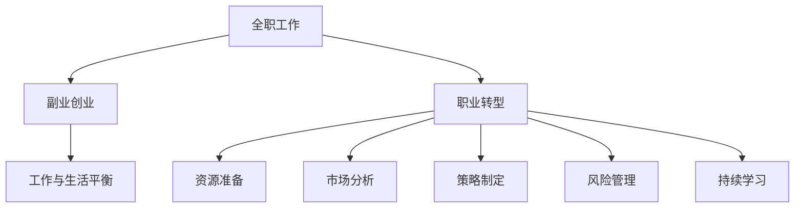

                 

# 从全职工作到副业创业的过渡

> 关键词：职业转型,副业创业,职场发展,工作与生活平衡,创业指南

## 1. 背景介绍

### 1.1 问题由来
在当今快速变化的职业环境中，许多人开始考虑从全职工作转向副业创业，以实现更大的职业成长和经济回报。这一趋势反映了人们对自由、创造性和自主性的渴望，以及对于不稳定工作环境的不满。但这一转变并非易事，涉及诸多挑战和风险。

### 1.2 问题核心关键点
成功的职业转型和副业创业，需要清晰的目标、详细的规划和系统的执行策略。以下是成功转型和创业的关键要素：
1. **明确目标**：明确自己的职业愿景和创业目标。
2. **资源准备**：评估现有的资源，包括时间、资金和技能，以及如何获得更多资源。
3. **市场分析**：分析目标市场的需求和竞争状况。
4. **策略制定**：制定详细的创业策略和计划，包括产品开发、市场推广和财务规划。
5. **风险管理**：识别和应对潜在的风险，包括市场、财务和运营风险。
6. **持续学习**：保持持续学习和适应新趋势的能力。

### 1.3 问题研究意义
了解从全职工作到副业创业的过渡过程，对于有志于此领域的人来说具有重要意义：
1. **职业成长**：副业创业提供了一个学习和成长的平台，提升个人技能和专业水平。
2. **财务自由**：通过副业创业，可以实现财务独立和自由，提升生活质量。
3. **工作与生活平衡**：副业创业可以带来更加灵活的工作时间，更好地平衡工作与生活。
4. **创新与创业精神**：培养创新思维和创业精神，为未来的职业发展奠定坚实基础。
5. **社会贡献**：通过创业项目，为社会提供价值，推动行业发展。

## 2. 核心概念与联系

### 2.1 核心概念概述

为了更好地理解从全职工作到副业创业的过渡过程，我们先介绍几个核心概念：

1. **全职工作(Full-Time Employment)**：指个体主要时间投入到某个机构的工作中，通常会有固定收入和福利待遇。
2. **副业创业(Side Hustle or Side Business)**：指在主要工作之外，利用业余时间开展的盈利性活动，以实现个人职业或财务目标。
3. **职业转型(Career Transition)**：指个体从一种职业角色或工作环境，转变为另一种职业角色或工作环境的过程。
4. **工作与生活平衡(Work-Life Balance)**：指个体在工作和个人生活之间寻找一个和谐的状态，以实现高效工作和健康生活的平衡。

这些概念之间的联系可以通过以下Mermaid流程图来展示：



这个流程图展示了几组关键概念及其之间的逻辑关系：

1. 全职工作可以过渡到副业创业，为个体提供更多的职业选择和发展机会。
2. 职业转型是实现副业创业的第一步，需要明确目标、评估资源和市场。
3. 副业创业过程有助于工作与生活平衡，提升个体的生活质量。
4. 资源准备、市场分析、策略制定和风险管理是副业创业的关键步骤。
5. 持续学习是保持创业项目持续发展的必要条件。

## 3. 核心算法原理 & 具体操作步骤

### 3.1 算法原理概述

从全职工作到副业创业的过渡，本质上是一个系统化的目标实现过程。其核心算法原理可以概括为以下几个步骤：

1. **目标设定**：明确创业目标，包括预期收入、市场定位、产品或服务类型等。
2. **资源评估**：评估现有资源，包括时间、资金、技能和人际关系等。
3. **市场研究**：分析目标市场的潜在需求和竞争环境。
4. **策略制定**：根据目标和资源情况，制定详细的创业策略和行动计划。
5. **项目执行**：按照计划执行项目，逐步实现创业目标。
6. **反馈与调整**：根据实际情况，及时调整策略和行动计划，确保项目顺利进行。

### 3.2 算法步骤详解

以下是详细的算法步骤：

**Step 1: 目标设定**
- **设定明确的财务目标**：明确希望通过副业创业实现的经济回报。
- **确定产品或服务类型**：根据自身兴趣和市场需求，选择适合的创业方向。

**Step 2: 资源评估**
- **时间评估**：分析每天可投入副业的时间，确定时间管理策略。
- **资金评估**：评估启动资金和运营资金的需求，以及资金来源（如储蓄、贷款、投资等）。
- **技能评估**：盘点现有技能，以及需要哪些新技能来支持创业项目。

**Step 3: 市场研究**
- **目标市场分析**：研究目标市场的规模、增长趋势、消费习惯和潜在需求。
- **竞争环境分析**：分析竞争对手的优势和劣势，确定自身的市场定位。

**Step 4: 策略制定**
- **商业模式设计**：选择适合的商业模式，如B2B、B2C、SaaS等。
- **市场进入策略**：制定市场推广策略，包括线上和线下渠道。
- **财务规划**：制定详细的财务计划，包括收入、支出和盈亏平衡点。

**Step 5: 项目执行**
- **产品开发**：开发核心产品或服务，确保其满足市场需求。
- **营销推广**：通过各种渠道进行市场推广，吸引潜在客户。
- **团队建设**：组建或招募团队成员，共同推进项目发展。

**Step 6: 反馈与调整**
- **定期评估**：定期评估项目进展和市场反馈，及时调整策略。
- **持续改进**：根据反馈信息，不断改进产品和服务，提升用户体验。

### 3.3 算法优缺点

副业创业从全职工作过渡，具有以下优点：
1. **经济回报**：副业项目成功后，可实现财务自由，提升生活质量。
2. **职业成长**：通过创业，积累丰富的管理经验和技能，提升职业竞争力。
3. **工作与生活平衡**：副业项目灵活安排时间，减轻工作压力，提升生活品质。
4. **创新与发展**：副业项目可以探索新领域，实现创新和突破。

同时，也存在以下缺点：
1. **风险较高**：创业面临市场、资金和运营等多方面的风险，需要承担失败的风险。
2. **时间管理**：需要同时兼顾全职工作和副业创业，可能面临时间管理困难。
3. **资源不足**：创业初期资源有限，可能影响项目推进速度和质量。
4. **心理压力**：创业过程中的不确定性和压力，可能导致心理负担加重。

### 3.4 算法应用领域

副业创业的应用领域广泛，涵盖多个行业和领域，例如：

- **电商**：开设网店或开发电商平台，销售产品或服务。
- **内容创作**：通过自媒体平台发布文章、视频、音频等内容，获得收入。
- **技术开发**：开发和销售软件、应用或工具，解决特定问题。
- **咨询服务**：提供专业咨询服务，如财务、法律、人力资源等。
- **教育培训**：开设线上或线下课程，提供教育和培训服务。
- **设计创意**：提供设计、创意和内容制作服务，如品牌设计、广告创意等。

## 4. 数学模型和公式 & 详细讲解 & 举例说明

### 4.1 数学模型构建

副业创业的数学模型可以构建为：
$$
C_{\text{total}} = C_{\text{initial}} + C_{\text{daily}} \times D + I \times R
$$
其中，$C_{\text{total}}$ 表示总成本，$C_{\text{initial}}$ 表示初始成本，$C_{\text{daily}}$ 表示每天固定成本，$D$ 表示工作天数，$I$ 表示投资回报率，$R$ 表示收入。

### 4.2 公式推导过程

推导过程如下：

1. **初始成本**：包括设备、软件、物料等一次性支出。
2. **日常成本**：包括员工工资、房租、水电费等每日支出。
3. **投资回报**：通过计算收入与成本的差额，以及投资回报率，计算出实际收益。

### 4.3 案例分析与讲解

假设某创业者计划开办一家电商店铺，初始成本为5万元，每天固定成本为300元，预计需要工作360天，假设月收入为10万元，投资回报率为0.2。根据上述公式，计算总成本和实际收益如下：

$$
C_{\text{total}} = 50000 + 300 \times 360 + 100000 \times 0.2 \times 12
$$

$$
C_{\text{total}} = 50000 + 108000 + 240000
$$

$$
C_{\text{total}} = 398000
$$

$$
\text{实际收益} = 100000 \times 12 - 398000
$$

$$
\text{实际收益} = 1200000 - 398000
$$

$$
\text{实际收益} = 802000
$$

## 5. 项目实践：代码实例和详细解释说明

### 5.1 开发环境搭建

要进行副业创业项目的开发，首先需要搭建开发环境。以下是常用的开发环境配置流程：

1. **安装Python**：下载并安装Python解释器，建议选择最新版本。
2. **安装IDE**：安装如PyCharm、Visual Studio Code等集成开发环境。
3. **配置版本控制**：安装Git等版本控制系统，进行代码管理。
4. **环境部署**：搭建本地开发环境或使用云平台如AWS、Azure等。
5. **依赖管理**：使用pip或conda管理第三方依赖库。

### 5.2 源代码详细实现

以开发一个简单的电商网站为例，以下是主要步骤的代码实现：

1. **数据库设计**：使用SQLite或MySQL设计产品、订单、用户等数据表。
2. **网站框架搭建**：使用Django或Flask等框架搭建网站架构。
3. **API接口开发**：使用Flask或FastAPI开发API接口，支持用户登录、商品浏览、订单管理等功能。
4. **前端开发**：使用HTML、CSS、JavaScript等技术开发网站前端页面。
5. **测试与部署**：编写单元测试和集成测试，确保代码质量，使用Docker进行容器化部署。

### 5.3 代码解读与分析

以下是关键代码的详细解读和分析：

**数据库模型设计**
```python
# 用户模型
class User(models.Model):
    username = models.CharField(max_length=50)
    email = models.EmailField()

# 商品模型
class Product(models.Model):
    name = models.CharField(max_length=100)
    price = models.DecimalField(max_digits=10, decimal_places=2)
```

**API接口开发**
```python
# 用户注册API
@app.route('/register', methods=['POST'])
def register():
    # 获取前端提交的用户信息
    username = request.json.get('username')
    email = request.json.get('email')
    # 创建用户
    user = User(username=username, email=email)
    user.save()
    # 返回成功响应
    return jsonify({'status': 'success'})
```

**前端开发**
```html
<!-- 商品列表页面 -->
<table>
    <tr>
        <th>商品名</th>
        <th>价格</th>
        <th>操作</th>
    </tr>
    
        <tr>
            <td>{{ product.name }}</td>
            <td>{{ product.price }}</td>
            <td><a href="/product/{{ product.id }}">详情</a></td>
        </tr>
    
</table>
```

### 5.4 运行结果展示

运行上述代码后，可以通过访问本地服务器或云平台，查看电商网站的运行效果。以下是运行结果的示例：

- 用户注册页面：显示注册表单，用户提交信息后，系统创建新用户并返回注册成功信息。
- 商品浏览页面：展示商品列表，用户可以点击商品链接查看详情。
- 订单管理页面：记录订单信息，包括商品列表、订单总金额等，方便用户管理和结算。

## 6. 实际应用场景

### 6.1 电商创业

电商创业是最常见的副业创业项目之一。通过电商平台销售产品，能够快速实现盈利，且市场规模大，发展空间广阔。适合有一定商业嗅觉和市场营销经验的人。

### 6.2 内容创作

内容创作，如自媒体运营、博客写作、视频制作等，利用内容平台进行变现。适合具有写作、拍摄或视频剪辑等特长的人。

### 6.3 技术开发

技术开发，如软件开发、应用程序开发、系统集成等，提供专业解决方案，获得项目报酬。适合有编程和技术背景的人。

### 6.4 未来应用展望

副业创业的未来发展方向，包括：

1. **多渠道拓展**：通过线上线下渠道，提升品牌知名度和客户覆盖面。
2. **技术创新**：采用新技术和新方法，提高产品和服务的竞争力。
3. **国际化**：开拓海外市场，扩大业务范围和客户群体。
4. **垂直化**：聚焦特定领域，提供专业化和深度服务。
5. **智能化**：采用AI和大数据技术，提升运营效率和客户体验。

## 7. 工具和资源推荐

### 7.1 学习资源推荐

为了帮助创业者系统掌握副业创业的知识和技能，以下是一些优质的学习资源：

1. **《副业创业指南》**：系统介绍副业创业的基本概念、策略和步骤。
2. **Coursera《创业基础》课程**：涵盖创业项目的规划、融资、运营等内容。
3. **《商业模型画布》**：介绍如何使用商业模型画布来设计创业项目。
4. **Udemy《副业创业成功指南》**：实战案例和经验分享，助力副业创业成功。
5. **Youtube《副业创业系列》**：众多创业者的实战经验分享，提供实际操作指导。

### 7.2 开发工具推荐

以下是几个常用的副业创业开发工具：

1. **Python**：主流的编程语言，适合各种类型的创业项目开发。
2. **Django**：高效的前端后端集成框架，适用于电商、内容创作等项目。
3. **Flask**：轻量级Web框架，适合快速开发API接口和微服务。
4. **Git**：流行的版本控制工具，支持代码管理和协作。
5. **Docker**：容器化工具，方便应用部署和扩展。

### 7.3 相关论文推荐

副业创业的相关研究不断涌现，以下是几篇有影响力的论文：

1. **《副业创业的经济影响》**：研究副业创业对经济和社会的影响。
2. **《从全职到副业的职业转型》**：分析职业转型的动机和影响因素。
3. **《副业创业的成功策略》**：总结成功的副业创业项目，提供实战经验和教训。
4. **《副业创业的市场机会》**：探讨副业创业的市场潜力和发展方向。

## 8. 总结：未来发展趋势与挑战

### 8.1 研究成果总结

本文对从全职工作到副业创业的过渡过程进行了全面系统的介绍，涵盖了关键概念、算法原理、操作步骤和实际应用场景。主要结论包括：
1. 副业创业提供职业成长和经济回报，但要面对高风险和资源不足的问题。
2. 需要明确目标、评估资源、市场分析和策略制定等关键步骤。
3. 技术工具和资源推荐有助于实现副业创业成功。

### 8.2 未来发展趋势

副业创业的未来发展趋势包括：
1. **技术驱动**：采用AI、大数据、区块链等新技术，提升创业项目的竞争力。
2. **多元化发展**：从单一业务向多渠道、多领域扩展，构建更加完整的商业生态。
3. **全球化布局**：开拓海外市场，实现业务国际化，提升品牌影响力和市场份额。
4. **社区化运营**：利用社交媒体和社区平台，提升用户互动和品牌忠诚度。
5. **可持续发展**：关注环境和社会责任，实现可持续发展。

### 8.3 面临的挑战

副业创业面临的挑战包括：
1. **资源限制**：创业初期资源有限，需要灵活调配和优化。
2. **市场竞争**：面对激烈的市场竞争，需要持续创新和优化。
3. **资金压力**：初期投资和运营成本高，资金不足可能影响项目推进。
4. **市场准入**：某些领域有严格的准入条件，需要获得相关资质和认证。
5. **运营管理**：需要建立完善的运营管理体系，提升运营效率和客户服务。

### 8.4 研究展望

未来研究应重点关注以下几个方向：
1. **新兴技术应用**：探索AI、大数据、区块链等新技术在副业创业中的应用。
2. **个性化服务**：根据用户需求和行为，提供定制化和个性化服务。
3. **跨领域融合**：实现不同领域的协同创新和业务融合，提升综合竞争力。
4. **可持续性发展**：关注社会和环境影响，实现可持续发展目标。
5. **市场趋势研究**：深入分析市场趋势和用户需求，及时调整战略和方向。

## 9. 附录：常见问题与解答

**Q1：副业创业需要多少启动资金？**

A: 启动资金需求因项目规模和运营模式而异。通常需要考虑初期购买设备、租用办公空间、招聘人员、市场推广等成本。建议进行详细的财务规划和预算。

**Q2：副业创业如何寻找客户？**

A: 可以通过社交媒体、搜索引擎、线上线下活动等方式寻找客户。建立完善的客户管理系统，如CRM系统，可以帮助跟踪和管理客户信息。

**Q3：副业创业如何平衡全职工作和时间管理？**

A: 制定详细的时间管理计划，划分工作和创业时间，避免过度疲劳。同时，利用工具如Trello、Asana等进行任务管理和时间安排。

**Q4：副业创业如何获得更多资源？**

A: 可以通过众筹、天使投资、风险投资等方式获得资金支持。同时，参加创业孵化器、创业大赛等活动，获取资源和网络支持。

**Q5：副业创业如何应对市场变化？**

A: 保持市场敏感度，定期进行市场调研和分析，及时调整战略和产品。建立灵活的运营机制，应对市场变化和风险。

总之，从全职工作到副业创业的过渡，需要系统的规划和执行。通过明确目标、评估资源、市场分析和策略制定，可以有效提升创业成功率。同时，持续学习和灵活应对市场变化，也是创业成功的关键。未来，副业创业将成为许多人实现职业和财务目标的重要途径，为社会带来更多创新和活力。

---

作者：禅与计算机程序设计艺术 / Zen and the Art of Computer Programming

