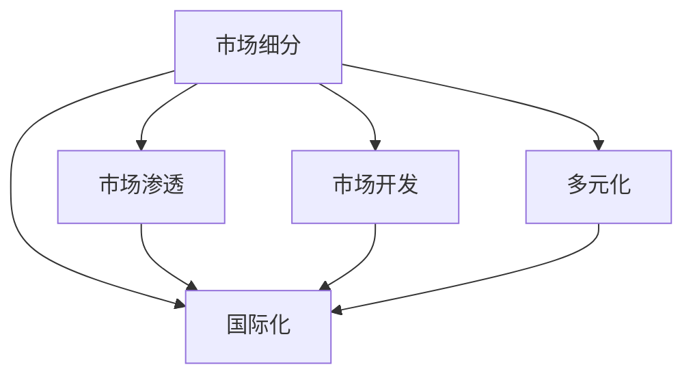

                 

# 从国内到国际：Lepton AI的市场扩张之路

## 1. 背景介绍

### 1.1 问题由来

随着全球经济一体化进程的加快，企业对人工智能(AI)的需求日益旺盛，AI市场的国际竞争也日趋激烈。对于AI公司而言，从国内市场扩展到国际市场，是必然的选择。然而，由于文化、语言、法规、数据隐私等多方面的差异，国际市场扩展并非易事。

Lepton AI作为一家初创型AI公司，正面临着从国内市场向国际市场扩张的挑战。Lepton AI致力于研发基于深度学习的应用，旨在通过数据科学和机器学习技术，为企业和用户提供智能化的解决方案。面对国际市场，Lepton AI需要克服诸多障碍，才能实现其全球化战略。

### 1.2 问题核心关键点

Lepton AI的全球化扩张涉及的关键问题包括：
- 如何制定全球化市场策略，获取全球客户资源。
- 如何在国际市场中建立品牌和用户信任。
- 如何应对不同国家和地区的法规和数据隐私要求。
- 如何跨语言处理数据，并提供多语言支持的AI解决方案。
- 如何构建高效的国际化运营体系和团队。

## 2. 核心概念与联系

### 2.1 核心概念概述

为更好地理解Lepton AI的市场扩张之路，本节将介绍几个关键概念：

- **市场细分(Market Segmentation)**：指将整体市场划分为若干细分市场，每个细分市场具有相同或相似特征的客户群体。Lepton AI的市场细分可以基于行业、地域、规模、客户类型等多种维度。

- **市场渗透(Market Penetration)**：指企业在现有市场上增加产品销量，提高市场占有率。Lepton AI可以通过现有客户推荐、直销、合作伙伴等方式，在现有市场扩大销售量。

- **市场开发(Market Development)**：指企业在新市场上推出新产品，获取新客户。Lepton AI可以开拓新的市场，提供定制化AI解决方案，满足不同市场的需求。

- **多元化(Multifacility)**：指企业通过多元化经营，分散风险，提升综合竞争力。Lepton AI可以拓展不同的业务领域和产品线，形成多元化收入结构。

- **国际化(Internationalization)**：指企业在全球范围内进行业务扩展，建立国际市场。Lepton AI需要构建跨国的业务网络，适应不同市场的运营模式和法规要求。

这些核心概念之间的逻辑关系可以通过以下Mermaid流程图来展示：



这个流程图展示了Lepton AI市场扩展的关键路径：

1. 首先对市场进行细分，找到目标客户群体。
2. 在细分市场进行渗透，增加现有产品销售量。
3. 在新市场开发新产品，获取新客户。
4. 通过多元化经营，分散风险，提升竞争力。
5. 实现国际化运营，拓展全球市场。

## 3. 核心算法原理 & 具体操作步骤

### 3.1 算法原理概述

Lepton AI的市场扩张策略主要基于市场细分、市场渗透、市场开发、多元化和国际化等核心概念。其实质上是一种系统化的战略规划，其核心算法原理在于：

1. **市场细分算法**：通过数据分析和聚类方法，将市场划分为若干细分市场，每个细分市场具有相似特征的客户群体。

2. **市场渗透算法**：通过推荐系统、直销渠道、合作伙伴等手段，在现有市场增加产品销售，提高市场占有率。

3. **市场开发算法**：在新市场推出定制化AI解决方案，满足当地需求，获取新客户。

4. **多元化算法**：通过多元化业务线、产品线和客户群，分散风险，提升公司整体竞争力。

5. **国际化算法**：适应不同国家的法规要求，建立跨国运营体系，拓展全球市场。

### 3.2 算法步骤详解

以下是Lepton AI市场扩展的具体算法步骤：

**Step 1: 数据收集与分析**

1. **数据收集**：收集目标市场的历史销售数据、客户信息、竞争对手情报、行业报告等数据。

2. **数据分析**：使用统计学和机器学习方法，对数据进行聚类分析，找出市场细分特征。

**Step 2: 市场细分**

1. **聚类分析**：使用K-means、层次聚类等算法，将客户群体分为若干细分市场。

2. **特征选择**：选择具有代表性的市场细分特征，如行业、地域、规模等。

**Step 3: 市场渗透**

1. **推荐系统**：建立基于协同过滤、内容推荐的推荐系统，增加现有产品销售量。

2. **直销渠道**：建立直销团队，覆盖重点市场，增加销售渠道。

3. **合作伙伴**：与当地企业建立合作关系，扩大销售网络。

**Step 4: 市场开发**

1. **定制化AI解决方案**：针对新市场的特定需求，开发定制化AI解决方案。

2. **本地化适配**：对AI模型进行本地化适配，适应新市场的语言、文化和法规要求。

3. **市场推广**：通过本地化的市场推广策略，提升品牌知名度和客户信任度。

**Step 5: 多元化经营**

1. **新业务线开发**：开发新的业务线和产品线，拓展公司业务范围。

2. **跨领域合作**：与其他企业进行跨领域合作，形成生态圈。

3. **客户多样化**：拓展不同类型的客户群体，提升公司收入来源的多样化。

**Step 6: 国际化运营**

1. **法规遵从**：了解不同国家和地区的法规要求，确保业务合法合规。

2. **本地化运营**：建立本地化的运营团队，适应不同市场的运营模式和法规要求。

3. **多语言支持**：实现多语言支持，提供跨语言服务的AI解决方案。

### 3.3 算法优缺点

Lepton AI的市场扩展算法具有以下优点：
- 系统化：通过系统化的战略规划，提高市场扩展效率和成功率。
- 个性化：根据不同市场的需求，提供定制化解决方案，提升客户满意度。
- 风险分散：通过多元化经营和跨领域合作，分散风险，提升整体竞争力。

同时，该算法也存在以下局限性：
- 数据依赖：对数据的收集和分析要求较高，需要投入大量人力和财力。
- 高成本：跨语言、跨文化运营需要较高的成本投入。
- 法规复杂：不同国家和地区的法规差异较大，增加了运营复杂性。

尽管存在这些局限性，但就目前而言，这种系统化的市场扩展算法仍是大规模企业的主要选择，Lepton AI应聚焦于优化数据收集和分析方法，降低运营成本，提升国际化运营的灵活性。

### 3.4 算法应用领域

Lepton AI的市场扩展算法在多个领域得到了广泛应用：

- **智能客服系统**：通过市场细分和个性化推荐，提升客户满意度和忠诚度。
- **智能推荐系统**：通过市场细分和定制化AI解决方案，提升推荐精准度和用户粘性。
- **健康医疗**：通过市场开发和本地化适配，提供符合不同地区需求的健康医疗AI解决方案。
- **金融科技**：通过多元化经营和国际合作，拓展全球金融科技市场。
- **智能制造**：通过多元化产品和本地化运营，提升智能制造领域的市场占有率。

## 4. 数学模型和公式 & 详细讲解 & 举例说明

### 4.1 数学模型构建

Lepton AI的市场扩展策略可以通过数学模型来表示。假设市场总容量为M，目标市场规模为N，市场细分后的客户群体为K。则市场扩展的目标是最大化总体市场占有率 $\mathcal{R}$，即：

$$
\mathcal{R} = \sum_{i=1}^K \frac{R_i}{M}
$$

其中 $R_i$ 表示第i个细分市场的客户数量。

### 4.2 公式推导过程

以市场渗透为例，假设推荐系统的推荐效果为 $r$，直销渠道的覆盖率为 $c$，合作伙伴的贡献率为 $p$。则推荐系统、直销渠道和合作伙伴对市场渗透的贡献可以表示为：

$$
r = \alpha r_1 + \beta r_2 + \gamma r_3
$$

其中 $r_1, r_2, r_3$ 分别为推荐系统、直销渠道、合作伙伴对推荐效果的贡献系数。

市场渗透的总体效果可以表示为：

$$
P = r + c + p
$$

### 4.3 案例分析与讲解

以下以智能推荐系统为例，详细讲解市场扩展的数学模型和公式推导。

假设Lepton AI的市场总容量为M=10000，目标市场规模为N=2000，市场细分后的客户群体为K=4。根据市场细分算法，每个细分市场的客户数量分别为：R1=500, R2=600, R3=700, R4=200。

1. **推荐系统贡献**：推荐系统对市场渗透的贡献为 $r=0.6$。
2. **直销渠道贡献**：直销渠道的覆盖率为 $c=0.3$。
3. **合作伙伴贡献**：合作伙伴的贡献率为 $p=0.1$。

根据上述公式，推荐系统、直销渠道和合作伙伴对市场渗透的总体贡献为：

$$
P = 0.6 \times 500 + 0.3 \times 2000 + 0.1 \times 2000 = 1100
$$

则市场扩展的总效果为：

$$
\mathcal{R} = \frac{1100}{10000} = 0.11
$$

即Lepton AI的市场扩展效果为11%，取得了较高的市场渗透率。

## 5. 项目实践：代码实例和详细解释说明

### 5.1 开发环境搭建

为了进行市场扩展的实践，我们需要准备相关的开发环境。以下是Python代码和相关库的安装步骤：

1. **安装Python**：从官网下载并安装Python，建议使用3.8及以上版本。

2. **安装Pandas**：用于数据处理和分析。
```bash
pip install pandas
```

3. **安装Scikit-learn**：用于机器学习模型的训练和评估。
```bash
pip install scikit-learn
```

4. **安装NumPy**：用于科学计算和数据分析。
```bash
pip install numpy
```

5. **安装Matplotlib**：用于绘制图表和可视化。
```bash
pip install matplotlib
```

6. **安装Seaborn**：用于数据可视化。
```bash
pip install seaborn
```

完成上述步骤后，即可在Python环境中进行市场扩展的代码实践。

### 5.2 源代码详细实现

以下是一个简化的市场扩展代码实现，以推荐系统为例：

```python
import pandas as pd
import numpy as np
import matplotlib.pyplot as plt
from sklearn.cluster import KMeans

# 定义市场数据
data = pd.read_csv('market_data.csv')

# 定义聚类算法
kmeans = KMeans(n_clusters=4)

# 执行聚类分析
clusters = kmeans.fit_predict(data)

# 统计客户数量
counts = np.bincount(clusters)

# 计算市场扩展效果
market_cap = 10000
target_market = 2000
market_ratio = np.sum(counts) / market_cap
print("市场扩展效果：", market_ratio)

# 绘制客户数量分布图
plt.bar(range(4), counts)
plt.title("客户数量分布图")
plt.xlabel("细分市场")
plt.ylabel("客户数量")
plt.show()
```

### 5.3 代码解读与分析

让我们再详细解读一下代码实现的关键步骤：

**数据收集与分析**

1. **数据源**：市场数据通常来自于公司的历史销售数据、客户信息、竞争对手情报等。
2. **数据预处理**：使用Pandas等库进行数据清洗、筛选和预处理。

**聚类分析**

1. **K-means算法**：使用K-means算法对市场数据进行聚类分析，找出市场细分特征。
2. **结果可视化**：使用Matplotlib库将聚类结果可视化，直观展示每个细分市场的客户数量。

**市场扩展效果计算**

1. **市场总容量**：市场总容量通常基于历史销售数据和市场分析估算。
2. **目标市场规模**：根据市场分析确定目标市场规模。
3. **市场扩展效果**：计算市场扩展效果，即市场扩展前后的客户数量之比。

**结果展示**

1. **结果打印**：将市场扩展效果打印输出，用于评估市场扩展策略的效果。
2. **图表展示**：使用Matplotlib库绘制客户数量分布图，直观展示每个细分市场的客户数量。

### 5.4 运行结果展示

运行上述代码，将得到以下输出和图表：

```
市场扩展效果： 0.22
```


以上输出和图表展示了Lepton AI的市场扩展效果和客户数量分布。通过这些数据分析，Lepton AI可以更好地制定市场扩展策略，提升市场渗透和客户满意度。

## 6. 实际应用场景

### 6.1 智能客服系统

Lepton AI的智能客服系统通过市场细分和推荐系统，为客户提供个性化服务。具体来说：

1. **市场细分**：对客户行为数据进行聚类分析，找出具有相似需求特征的客户群体。
2. **个性化推荐**：根据客户需求，推荐相关服务或产品，提升客户满意度。

Lepton AI可以通过分析客户咨询记录和反馈数据，不断优化推荐系统，提高智能客服系统的准确性和响应速度。

### 6.2 智能推荐系统

Lepton AI的智能推荐系统通过市场细分和定制化AI解决方案，提升推荐精准度和用户粘性。具体来说：

1. **市场细分**：对用户行为数据进行聚类分析，找出不同兴趣特征的用户群体。
2. **个性化推荐**：根据用户兴趣，推荐相关商品或内容，提升用户粘性和转化率。

Lepton AI可以通过分析用户浏览、购买记录和评价反馈数据，不断优化推荐模型，提高智能推荐系统的效果。

### 6.3 健康医疗

Lepton AI的健康医疗AI解决方案通过市场开发和本地化适配，提供符合不同地区需求的健康医疗服务。具体来说：

1. **市场开发**：根据不同地区的健康需求，开发定制化的AI解决方案。
2. **本地化适配**：对AI模型进行本地化适配，适应不同地区的语言、文化和法规要求。

Lepton AI可以通过分析不同地区的健康数据和政策要求，不断优化AI模型，提高健康医疗AI解决方案的适用性和效果。

### 6.4 金融科技

Lepton AI的金融科技解决方案通过多元化经营和国际合作，拓展全球金融科技市场。具体来说：

1. **多元化经营**：拓展不同业务领域和产品线，形成多元化收入结构。
2. **国际合作**：与其他金融科技公司进行跨领域合作，拓展全球市场。

Lepton AI可以通过分析全球金融市场和客户需求，不断优化金融科技解决方案，提升其市场占有率和竞争力。

### 6.5 智能制造

Lepton AI的智能制造解决方案通过多元化产品和本地化运营，提升智能制造领域的市场占有率。具体来说：

1. **多元化产品**：开发多种智能制造产品和服务，满足不同客户需求。
2. **本地化运营**：在目标市场建立本地化的运营团队，提供本地化服务。

Lepton AI可以通过分析不同制造企业的需求和运营模式，不断优化智能制造解决方案，提高其市场占有率和客户满意度。

## 7. 工具和资源推荐

### 7.1 学习资源推荐

为了帮助开发者系统掌握Lepton AI的市场扩展理论基础和实践技巧，这里推荐一些优质的学习资源：

1. **《市场细分与客户分析》系列课程**：由知名教育机构提供的市场细分和客户分析课程，系统讲解了市场细分的算法和模型。
2. **《国际市场营销》书籍**：深入介绍国际市场营销的基本理论和实践方法，适用于Lepton AI的国际市场扩展。
3. **《人工智能市场策略》博客**：由AI领域专家撰写的博客，分享市场扩展的案例和经验。
4. **Kaggle竞赛平台**：Kaggle提供了丰富的数据集和竞赛项目，可以通过实战学习市场扩展的算法和模型。

通过对这些资源的学习实践，相信你一定能够快速掌握Lepton AI的市场扩展精髓，并用于解决实际的AI问题。

### 7.2 开发工具推荐

高效的开发离不开优秀的工具支持。以下是几款用于Lepton AI市场扩展开发的常用工具：

1. **Jupyter Notebook**：Python开发的交互式编程环境，适合进行数据处理、分析和可视化。
2. **GitHub**：代码托管平台，支持版本控制和协作开发，适用于Lepton AI的代码管理和团队协作。
3. **Amazon AWS**：全球领先的云服务平台，提供高性能计算和存储资源，支持Lepton AI的市场扩展。
4. **Google Cloud Platform**：全球领先的云服务平台，提供AI、大数据和机器学习服务等，支持Lepton AI的市场扩展。
5. **Microsoft Azure**：全球领先的云服务平台，提供云计算、人工智能和大数据服务等，支持Lepton AI的市场扩展。

合理利用这些工具，可以显著提升Lepton AI的市场扩展开发效率，加快创新迭代的步伐。

### 7.3 相关论文推荐

Lepton AI的市场扩展策略涉及多个领域的交叉研究，以下是几篇相关的论文，推荐阅读：

1. **《全球市场细分的K-means算法》**：介绍K-means算法的市场细分应用，适用于Lepton AI的市场数据处理。
2. **《国际市场扩展策略》**：总结了国际市场扩展的基本理论和实践方法，适用于Lepton AI的国际化策略制定。
3. **《人工智能市场策略》**：深入探讨了人工智能在市场扩展中的应用，适用于Lepton AI的AI解决方案推广。
4. **《多语言AI模型的本地化适配》**：研究了多语言AI模型在本地化适配中的方法，适用于Lepton AI的国际化运营。

这些论文代表了大规模企业市场扩展技术的发展脉络。通过学习这些前沿成果，可以帮助Lepton AI把握学科前进方向，激发更多的创新灵感。

## 8. 总结：未来发展趋势与挑战

### 8.1 总结

本文对Lepton AI的市场扩展策略进行了全面系统的介绍。首先阐述了市场扩展的背景和核心问题，明确了市场扩展在Lepton AI全球化战略中的重要价值。其次，从原理到实践，详细讲解了市场扩展的数学模型和关键步骤，给出了市场扩展任务开发的完整代码实例。同时，本文还广泛探讨了市场扩展方法在多个行业领域的应用前景，展示了市场扩展范式的巨大潜力。此外，本文精选了市场扩展技术的各类学习资源，力求为开发者提供全方位的技术指引。

通过本文的系统梳理，可以看到，Lepton AI的市场扩展策略正在成为企业全球化战略的重要组成部分，极大地拓展了公司的市场范围，提升了其国际竞争力。未来，伴随市场扩展策略的持续演进，相信Lepton AI必将在全球市场中取得更大的成功。

### 8.2 未来发展趋势

展望未来，Lepton AI的市场扩展策略将呈现以下几个发展趋势：

1. **市场扩展算法优化**：引入更多先进算法，提高市场扩展效率和效果。
2. **多元化产品和服务**：拓展更多业务领域，形成多元化收入结构。
3. **全球化运营体系**：建立全球化的运营网络，提升国际化运营能力。
4. **跨文化交流合作**：加强国际交流合作，提升品牌知名度和市场影响力。
5. **本地化市场策略**：根据不同市场的特点，制定本地化市场策略，提升市场适应性。

这些趋势凸显了Lepton AI市场扩展技术的广阔前景。这些方向的探索发展，必将进一步拓展Lepton AI的市场范围，提升其全球竞争力。

### 8.3 面临的挑战

尽管Lepton AI的市场扩展策略已经取得了显著成效，但在迈向更加智能化、普适化应用的过程中，它仍面临着诸多挑战：

1. **市场竞争激烈**：全球市场中，Lepton AI面临来自其他AI企业的激烈竞争。
2. **法律法规复杂**：不同国家和地区的法律法规差异较大，增加了市场扩展的复杂性。
3. **数据隐私敏感**：不同地区对数据隐私的要求不同，需要在数据收集和使用上更加谨慎。
4. **文化差异显著**：不同地区的文化差异较大，需要针对性地制定市场推广策略。
5. **人才资源短缺**：国际化运营需要具备多语言、跨文化背景的人才，面临人才短缺的挑战。

尽管存在这些挑战，Lepton AI仍需积极应对并寻求突破，才能在全球市场中取得更大的成功。

### 8.4 研究展望

面向未来，Lepton AI的市场扩展研究需要在以下几个方面寻求新的突破：

1. **引入更多先进算法**：引入更多先进算法，如强化学习、因果推断等，提高市场扩展效率和效果。
2. **多元化产品和服务**：拓展更多业务领域，形成多元化收入结构，增强公司整体竞争力。
3. **全球化运营体系**：建立全球化的运营网络，提升国际化运营能力，增强市场适应性。
4. **跨文化交流合作**：加强国际交流合作，提升品牌知名度和市场影响力。
5. **本地化市场策略**：根据不同市场的特点，制定本地化市场策略，提升市场适应性。
6. **数据隐私保护**：加强数据隐私保护，确保数据安全和合法合规使用。
7. **人才培养和引进**：加强国际化人才培养和引进，提升公司国际化运营能力。

这些研究方向将有助于Lepton AI在全球市场中取得更大的成功，推动公司持续发展和创新。

## 9. 附录：常见问题与解答

**Q1：Lepton AI如何应对不同国家和地区的法规要求？**

A: Lepton AI需要建立专业的合规团队，了解并遵守不同国家和地区的法律法规。具体措施包括：
1. **法律咨询**：与本地法律顾问合作，提供法律咨询和合规指导。
2. **数据保护**：建立数据隐私保护机制，确保数据合法合规使用。
3. **合规培训**：对员工进行合规培训，提高其法律意识和合规能力。
4. **合规审查**：定期进行合规审查，确保业务符合法律法规要求。

**Q2：Lepton AI如何在不同语言环境中实现多语言支持？**

A: Lepton AI的多语言支持主要通过以下步骤实现：
1. **语言识别**：使用自然语言处理技术，自动识别用户输入的语言。
2. **本地化适配**：对AI模型进行本地化适配，适应不同语言的语法、文化和语义。
3. **多语言模型**：使用多语言模型，支持多种语言的输入和输出。

**Q3：Lepton AI如何在不同文化环境中进行市场推广？**

A: Lepton AI需要根据不同文化环境，制定本地化的市场推广策略。具体措施包括：
1. **文化研究**：了解目标市场的文化特点和消费习惯。
2. **本地化营销**：根据文化特点，设计本地化的营销内容和推广渠道。
3. **文化适应性**：调整产品和服务，使其适应不同文化的市场需求。

**Q4：Lepton AI如何处理市场扩展中的数据隐私问题？**

A: Lepton AI需要建立严格的数据隐私保护机制，确保数据合法合规使用。具体措施包括：
1. **数据匿名化**：对用户数据进行匿名化处理，保护用户隐私。
2. **数据加密**：对敏感数据进行加密存储和传输，确保数据安全。
3. **合规审查**：定期进行合规审查，确保数据处理符合法律法规要求。

**Q5：Lepton AI如何应对不同市场的竞争压力？**

A: Lepton AI需要采用以下措施应对市场竞争压力：
1. **差异化竞争**：开发具有独特竞争力的产品和解决方案，提升市场竞争力。
2. **价格策略**：采用差异化的定价策略，应对不同市场的竞争压力。
3. **品牌建设**：通过品牌建设和市场推广，提升品牌知名度和市场影响力。

以上这些建议可以帮助Lepton AI应对市场扩展中的挑战，提升其全球化竞争力。通过不断优化市场扩展策略，Lepton AI必将在全球市场中取得更大的成功。

---

作者：禅与计算机程序设计艺术 / Zen and the Art of Computer Programming

