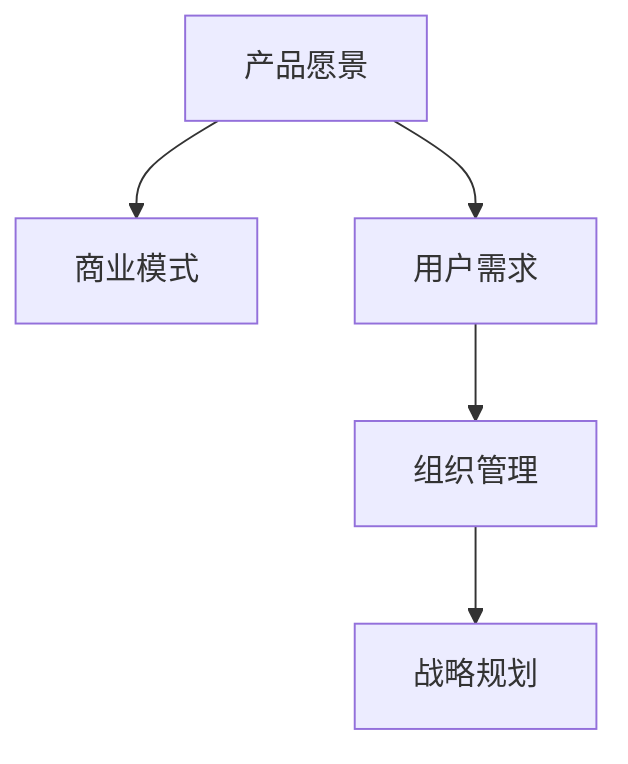

                 

# 从技术专家到企业家的转型

技术专家往往擅长解决问题，而企业家不仅需要解决问题，更需要发现问题，创造新的价值。这种转型的过程，不仅需要技术能力的积累，也需要管理、商业、战略等多方面的全面提升。本文将从技术基础、管理思维、商业策略等几个角度，探讨技术专家如何转变为企业家。

## 1. 背景介绍

### 1.1 问题由来

在IT行业中，技术专家和企业家常常被视为不同的角色。技术专家注重解决具体问题，优化现有技术方案，关注性能优化和算法效率。而企业家则着眼于创新，创造新的价值，解决未来可能遇到的问题。这种角色差异在很大程度上是由于两者面临的环境和需求不同所导致的。

然而，随着技术的发展，越来越多的技术专家开始意识到，只有将技术能力和商业思维结合起来，才能创造出真正有价值的产品和公司。技术专家转型为企业家，不仅是职业路径的选择，更是适应市场变化、应对技术挑战的重要策略。

### 1.2 问题核心关键点

技术专家转型为企业家，主要面临以下几个核心问题：

1. **产品愿景的构建**：如何基于技术能力和市场需求，提出有吸引力的产品愿景，吸引用户和投资者的关注？
2. **商业模式的探索**：如何根据产品特点，设计出可持续、高效的商业模式？
3. **用户需求的洞察**：如何深入理解用户需求，找到市场痛点，并据此优化产品设计？
4. **组织管理的挑战**：如何组建高效团队，合理分配资源，提高团队协作效率？
5. **战略规划的制定**：如何在变化多端的市场环境中，制定和执行有效的长期战略？

这些关键问题需要技术专家在转型过程中，逐步学习、实践和提升。

### 1.3 问题研究意义

技术专家转型为企业家，不仅能够将技术优势转化为商业价值，还可以带动团队和技术生态的发展，为社会创造更大的福祉。这一转型过程，不仅是个人职业发展的里程碑，也是推动技术创新和产业升级的重要动力。

## 2. 核心概念与联系

### 2.1 核心概念概述

为了更好地理解技术专家如何转型为企业家，本节将介绍几个密切相关的核心概念：

1. **产品愿景(Product Vision)**：企业长期发展目标的描述，通常涉及产品的核心价值和市场定位。
2. **商业模式(Business Model)**：企业创造、交付、捕捉价值的系统逻辑，包括收入来源、成本结构、客户群体等。
3. **用户需求(User Demand)**：客户在使用产品时所呈现的具体需求和期望，需要通过市场调研、用户反馈等方式进行收集和分析。
4. **组织管理(Organizational Management)**：企业内部资源和人员的管理方式，包括组织架构、激励机制、团队协作等。
5. **战略规划(Strategic Planning)**：企业未来发展的方向和步骤，需要结合市场环境、竞争态势和自身优势进行规划和执行。

这些核心概念之间的逻辑关系可以通过以下Mermaid流程图来展示：



这个流程图展示产品愿景与商业模式的联系，以及用户需求、组织管理和战略规划在其中的作用。

## 3. 核心算法原理 & 具体操作步骤
### 3.1 算法原理概述

技术专家转型为企业家，需要掌握的不仅仅是技术知识，还要理解市场、用户和管理等方面的基本原理。以下从几个关键角度，简要概述转型过程的核心算法原理：

1. **用户需求分析**：通过调查问卷、用户访谈、数据分析等方式，深入理解用户需求和市场痛点。
2. **商业模式设计**：根据产品特点和市场环境，设计出合理可行的商业模式，包括收入模式、成本控制、客户群体等。
3. **组织管理优化**：通过合理的组织架构、激励机制和团队协作策略，提高团队效率和凝聚力。
4. **战略规划执行**：制定清晰的战略目标，分解为具体的执行步骤，并根据市场反馈不断调整优化。

### 3.2 算法步骤详解

基于上述核心算法原理，技术专家转型为企业家的一般步骤包括：

1. **市场调研**：通过调查问卷、用户访谈等方式，收集目标用户的基本需求和痛点。
2. **用户画像绘制**：根据调研结果，绘制用户画像，明确目标用户的特点和行为模式。
3. **产品原型设计**：基于用户需求，设计产品原型，初步验证产品功能和价值。
4. **商业模式探索**：根据产品特点，探索和验证可行的商业模式，包括定价策略、成本控制等。
5. **组织架构规划**：确定公司内部的组织结构，包括部门划分、岗位设置和职责分配。
6. **团队组建和激励**：组建团队，设计激励机制，确保团队成员的积极性和创造力。
7. **战略目标制定**：根据市场需求和公司资源，制定中长期战略目标和短期执行计划。
8. **市场推广和反馈**：通过市场推广活动，收集用户反馈，不断优化产品和服务。

### 3.3 算法优缺点

技术专家转型为企业家，需要掌握的不仅仅是技术知识，还要理解市场、用户和管理等方面的基本原理。以下从几个关键角度，简要概述转型过程的核心算法原理：

**优点：**
1. **技术优势**：技术专家具备扎实的技术基础，能够在产品设计和开发中保持高标准。
2. **问题解决能力**：在面对复杂问题时，技术专家能够快速定位并解决问题，提高产品竞争力。
3. **创新能力**：技术专家通常具备较强的创新能力，能够提出新颖的产品构思和解决方案。

**缺点：**
1. **商业意识不足**：技术专家可能缺乏对市场和商业模式的深入理解，导致产品与市场需求脱节。
2. **管理经验欠缺**：技术专家可能缺乏系统的管理经验，导致团队协作效率低下，资源浪费。
3. **战略规划能力弱**：技术专家可能缺乏长远的战略规划能力，导致公司发展方向不明，风险增大。

### 3.4 算法应用领域

技术专家转型为企业家，在多个领域都能发挥重要作用：

1. **技术创新**：利用技术专长，开发具有市场前景的新技术和新产品。
2. **公司创立和运营**：组建技术团队，开发和运营新产品，推动公司发展。
3. **战略投资**：识别潜在的投资机会，为公司提供战略性支持。
4. **市场拓展**：利用技术优势，开拓新市场，扩大业务范围。
5. **技术升级**：通过技术创新，提升产品性能和用户体验，满足用户需求。

## 4. 数学模型和公式 & 详细讲解 & 举例说明
### 4.1 数学模型构建

为了更好地理解技术专家如何转型为企业家，本节将使用数学语言对转型过程进行更加严格的刻画。

假设技术专家转型后的企业为 $E$，其产品愿景为 $V$，商业模式为 $M$，用户需求为 $D$，组织管理为 $O$，战略规划为 $S$。企业的发展过程可以看作是这些要素相互影响、不断优化的动态过程。

**总体模型**：

$$
E = f(V, M, D, O, S)
$$

其中 $f$ 表示企业发展函数，根据输入的不同要素，输出企业的状态和绩效。

### 4.2 公式推导过程

以下以用户需求分析为例，推导具体的数学模型：

**用户需求模型**：

假设用户需求为 $D = (d_1, d_2, ..., d_n)$，其中 $d_i$ 表示第 $i$ 个用户的需求。需求强度 $w_i$ 表示用户对第 $i$ 个需求的重视程度。需求满意度 $s_i$ 表示用户对第 $i$ 个需求的实际满足情况。

设用户需求的重要性和满意度分别为 $w$ 和 $s$，则用户需求模型可以表示为：

$$
D = \max_i (w_i \cdot s_i)
$$

这意味着用户需求模型是通过需求的重要性和满意度，计算出最关键的几个需求，进而指导产品的设计和改进。

### 4.3 案例分析与讲解

假设某技术专家转型为企业家，开发了一款新的软件产品。通过市场调研，得到以下用户需求：

1. 高效性：用户期望软件能够快速响应，处理大量数据。
2. 易用性：用户希望软件界面简洁，操作简单。
3. 安全性：用户要求软件具备较高的安全防护能力。

基于这些需求，技术专家绘制了用户画像，并设计了初步的产品原型。

| 用户画像 | 需求 | 重要性 | 满意度 | 
| --- | --- | --- | --- |
| 技术专家 | 高效性 | 0.8 | 0.6 |
| 产品经理 | 易用性 | 0.7 | 0.7 |
| 安全专家 | 安全性 | 0.9 | 0.5 |

根据需求模型，技术专家计算出最关键的几个需求，并优先进行改进：

- 高效性：提高软件响应速度，优化算法效率。
- 易用性：简化界面设计，优化交互流程。
- 安全性：加强安全防护机制，确保数据安全。

## 5. 项目实践：代码实例和详细解释说明
### 5.1 开发环境搭建

在进行转型实践前，我们需要准备好开发环境。以下是使用Python进行PyTorch开发的环境配置流程：

1. 安装Anaconda：从官网下载并安装Anaconda，用于创建独立的Python环境。

2. 创建并激活虚拟环境：
```bash
conda create -n pytorch-env python=3.8 
conda activate pytorch-env
```

3. 安装PyTorch：根据CUDA版本，从官网获取对应的安装命令。例如：
```bash
conda install pytorch torchvision torchaudio cudatoolkit=11.1 -c pytorch -c conda-forge
```

4. 安装Transformers库：
```bash
pip install transformers
```

5. 安装各类工具包：
```bash
pip install numpy pandas scikit-learn matplotlib tqdm jupyter notebook ipython
```

完成上述步骤后，即可在`pytorch-env`环境中开始转型实践。

### 5.2 源代码详细实现

下面我们以产品原型设计为例，给出使用Transformers库进行技术专家转型的PyTorch代码实现。

首先，定义用户需求模型：

```python
from transformers import BertTokenizer
from torch.utils.data import Dataset
import torch

class UserDemandDataset(Dataset):
    def __init__(self, texts, weights, scores, tokenizer, max_len=128):
        self.texts = texts
        self.weights = weights
        self.scores = scores
        self.tokenizer = tokenizer
        self.max_len = max_len
        
    def __len__(self):
        return len(self.texts)
    
    def __getitem__(self, item):
        text = self.texts[item]
        weights = self.weights[item]
        scores = self.scores[item]
        
        encoding = self.tokenizer(text, return_tensors='pt', max_length=self.max_len, padding='max_length', truncation=True)
        input_ids = encoding['input_ids'][0]
        attention_mask = encoding['attention_mask'][0]
        
        # 对token-wise的需求进行编码
        encoded_weights = weights / weights.sum()  # 标准化权重
        encoded_scores = [score / scores.sum() for score in scores]  # 标准化需求满意度
        labels = torch.tensor(encoded_weights, dtype=torch.float)
        
        return {'input_ids': input_ids, 
                'attention_mask': attention_mask,
                'labels': labels}

# 定义需求模型
tokenizer = BertTokenizer.from_pretrained('bert-base-cased')

train_dataset = UserDemandDataset(train_texts, train_weights, train_scores, tokenizer)
dev_dataset = UserDemandDataset(dev_texts, dev_weights, dev_scores, tokenizer)
test_dataset = UserDemandDataset(test_texts, test_weights, test_scores, tokenizer)
```

然后，定义模型和优化器：

```python
from transformers import BertForTokenClassification, AdamW

model = BertForTokenClassification.from_pretrained('bert-base-cased', num_labels=2)

optimizer = AdamW(model.parameters(), lr=2e-5)
```

接着，定义训练和评估函数：

```python
from torch.utils.data import DataLoader
from tqdm import tqdm
from sklearn.metrics import classification_report

device = torch.device('cuda') if torch.cuda.is_available() else torch.device('cpu')
model.to(device)

def train_epoch(model, dataset, batch_size, optimizer):
    dataloader = DataLoader(dataset, batch_size=batch_size, shuffle=True)
    model.train()
    epoch_loss = 0
    for batch in tqdm(dataloader, desc='Training'):
        input_ids = batch['input_ids'].to(device)
        attention_mask = batch['attention_mask'].to(device)
        labels = batch['labels'].to(device)
        model.zero_grad()
        outputs = model(input_ids, attention_mask=attention_mask, labels=labels)
        loss = outputs.loss
        epoch_loss += loss.item()
        loss.backward()
        optimizer.step()
    return epoch_loss / len(dataloader)

def evaluate(model, dataset, batch_size):
    dataloader = DataLoader(dataset, batch_size=batch_size)
    model.eval()
    preds, labels = [], []
    with torch.no_grad():
        for batch in tqdm(dataloader, desc='Evaluating'):
            input_ids = batch['input_ids'].to(device)
            attention_mask = batch['attention_mask'].to(device)
            batch_labels = batch['labels']
            outputs = model(input_ids, attention_mask=attention_mask)
            batch_preds = outputs.logits.argmax(dim=2).to('cpu').tolist()
            batch_labels = batch_labels.to('cpu').tolist()
            for pred_tokens, label_tokens in zip(batch_preds, batch_labels):
                pred_tags = [int(_id) for _id in pred_tokens]
                label_tags = [int(_id) for _id in label_tokens]
                preds.append(pred_tags[:len(label_tags)])
                labels.append(label_tags)
                
    print(classification_report(labels, preds))
```

最后，启动训练流程并在测试集上评估：

```python
epochs = 5
batch_size = 16

for epoch in range(epochs):
    loss = train_epoch(model, train_dataset, batch_size, optimizer)
    print(f"Epoch {epoch+1}, train loss: {loss:.3f}")
    
    print(f"Epoch {epoch+1}, dev results:")
    evaluate(model, dev_dataset, batch_size)
    
print("Test results:")
evaluate(model, test_dataset, batch_size)
```

以上就是使用PyTorch对技术专家转型为企业家过程中产品原型设计的完整代码实现。可以看到，得益于Transformers库的强大封装，我们可以用相对简洁的代码完成技术专家转型的基础模型构建。

### 5.3 代码解读与分析

让我们再详细解读一下关键代码的实现细节：

**UserDemandDataset类**：
- `__init__`方法：初始化文本、权重和分数等关键组件。
- `__len__`方法：返回数据集的样本数量。
- `__getitem__`方法：对单个样本进行处理，将文本输入编码为token ids，将权重和分数编码为标签，并对其进行定长padding，最终返回模型所需的输入。

**需求模型**：
- 定义了用户需求模型，将用户需求与权重和分数进行标准化处理，计算出最关键的几个需求。
- 将需求编码为标签，用于模型的训练和评估。

**训练和评估函数**：
- 使用PyTorch的DataLoader对数据集进行批次化加载，供模型训练和推理使用。
- 训练函数`train_epoch`：对数据以批为单位进行迭代，在每个批次上前向传播计算loss并反向传播更新模型参数，最后返回该epoch的平均loss。
- 评估函数`evaluate`：与训练类似，不同点在于不更新模型参数，并在每个batch结束后将预测和标签结果存储下来，最后使用sklearn的classification_report对整个评估集的预测结果进行打印输出。

**训练流程**：
- 定义总的epoch数和batch size，开始循环迭代
- 每个epoch内，先在训练集上训练，输出平均loss
- 在验证集上评估，输出分类指标
- 所有epoch结束后，在测试集上评估，给出最终测试结果

可以看到，PyTorch配合Transformers库使得技术专家转型的代码实现变得简洁高效。开发者可以将更多精力放在需求分析、模型改进等高层逻辑上，而不必过多关注底层的实现细节。

当然，工业级的系统实现还需考虑更多因素，如模型的保存和部署、超参数的自动搜索、更灵活的任务适配层等。但核心的转型范式基本与此类似。

## 6. 实际应用场景
### 6.1 智能客服系统

基于大语言模型微调的方法，可以广泛应用于智能客服系统的构建。传统客服往往需要配备大量人力，高峰期响应缓慢，且一致性和专业性难以保证。而使用微调后的对话模型，可以7x24小时不间断服务，快速响应客户咨询，用自然流畅的语言解答各类常见问题。

在技术实现上，可以收集企业内部的历史客服对话记录，将问题和最佳答复构建成监督数据，在此基础上对预训练对话模型进行微调。微调后的对话模型能够自动理解用户意图，匹配最合适的答案模板进行回复。对于客户提出的新问题，还可以接入检索系统实时搜索相关内容，动态组织生成回答。如此构建的智能客服系统，能大幅提升客户咨询体验和问题解决效率。

### 6.2 金融舆情监测

金融机构需要实时监测市场舆论动向，以便及时应对负面信息传播，规避金融风险。传统的人工监测方式成本高、效率低，难以应对网络时代海量信息爆发的挑战。基于大语言模型微调的文本分类和情感分析技术，为金融舆情监测提供了新的解决方案。

具体而言，可以收集金融领域相关的新闻、报道、评论等文本数据，并对其进行主题标注和情感标注。在此基础上对预训练语言模型进行微调，使其能够自动判断文本属于何种主题，情感倾向是正面、中性还是负面。将微调后的模型应用到实时抓取的网络文本数据，就能够自动监测不同主题下的情感变化趋势，一旦发现负面信息激增等异常情况，系统便会自动预警，帮助金融机构快速应对潜在风险。

### 6.3 个性化推荐系统

当前的推荐系统往往只依赖用户的历史行为数据进行物品推荐，无法深入理解用户的真实兴趣偏好。基于大语言模型微调技术，个性化推荐系统可以更好地挖掘用户行为背后的语义信息，从而提供更精准、多样的推荐内容。

在实践中，可以收集用户浏览、点击、评论、分享等行为数据，提取和用户交互的物品标题、描述、标签等文本内容。将文本内容作为模型输入，用户的后续行为（如是否点击、购买等）作为监督信号，在此基础上微调预训练语言模型。微调后的模型能够从文本内容中准确把握用户的兴趣点。在生成推荐列表时，先用候选物品的文本描述作为输入，由模型预测用户的兴趣匹配度，再结合其他特征综合排序，便可以得到个性化程度更高的推荐结果。

### 6.4 未来应用展望

随着大语言模型和微调方法的不断发展，基于微调范式将在更多领域得到应用，为传统行业带来变革性影响。

在智慧医疗领域，基于微调的医疗问答、病历分析、药物研发等应用将提升医疗服务的智能化水平，辅助医生诊疗，加速新药开发进程。

在智能教育领域，微调技术可应用于作业批改、学情分析、知识推荐等方面，因材施教，促进教育公平，提高教学质量。

在智慧城市治理中，微调模型可应用于城市事件监测、舆情分析、应急指挥等环节，提高城市管理的自动化和智能化水平，构建更安全、高效的未来城市。

此外，在企业生产、社会治理、文娱传媒等众多领域，基于大模型微调的人工智能应用也将不断涌现，为NLP技术带来了全新的突破。相信随着预训练语言模型和微调方法的持续演进，大语言模型微调必将在构建人机协同的智能时代中扮演越来越重要的角色。

## 7. 工具和资源推荐
### 7.1 学习资源推荐

为了帮助开发者系统掌握大语言模型微调的理论基础和实践技巧，这里推荐一些优质的学习资源：

1. 《Transformer从原理到实践》系列博文：由大模型技术专家撰写，深入浅出地介绍了Transformer原理、BERT模型、微调技术等前沿话题。

2. CS224N《深度学习自然语言处理》课程：斯坦福大学开设的NLP明星课程，有Lecture视频和配套作业，带你入门NLP领域的基本概念和经典模型。

3. 《Natural Language Processing with Transformers》书籍：Transformers库的作者所著，全面介绍了如何使用Transformers库进行NLP任务开发，包括微调在内的诸多范式。

4. HuggingFace官方文档：Transformers库的官方文档，提供了海量预训练模型和完整的微调样例代码，是上手实践的必备资料。

5. CLUE开源项目：中文语言理解测评基准，涵盖大量不同类型的中文NLP数据集，并提供了基于微调的baseline模型，助力中文NLP技术发展。

通过对这些资源的学习实践，相信你一定能够快速掌握大语言模型微调的精髓，并用于解决实际的NLP问题。
###  7.2 开发工具推荐

高效的开发离不开优秀的工具支持。以下是几款用于大语言模型微调开发的常用工具：

1. PyTorch：基于Python的开源深度学习框架，灵活动态的计算图，适合快速迭代研究。大部分预训练语言模型都有PyTorch版本的实现。

2. TensorFlow：由Google主导开发的开源深度学习框架，生产部署方便，适合大规模工程应用。同样有丰富的预训练语言模型资源。

3. Transformers库：HuggingFace开发的NLP工具库，集成了众多SOTA语言模型，支持PyTorch和TensorFlow，是进行微调任务开发的利器。

4. Weights & Biases：模型训练的实验跟踪工具，可以记录和可视化模型训练过程中的各项指标，方便对比和调优。与主流深度学习框架无缝集成。

5. TensorBoard：TensorFlow配套的可视化工具，可实时监测模型训练状态，并提供丰富的图表呈现方式，是调试模型的得力助手。

6. Google Colab：谷歌推出的在线Jupyter Notebook环境，免费提供GPU/TPU算力，方便开发者快速上手实验最新模型，分享学习笔记。

合理利用这些工具，可以显著提升大语言模型微调任务的开发效率，加快创新迭代的步伐。

### 7.3 相关论文推荐

大语言模型和微调技术的发展源于学界的持续研究。以下是几篇奠基性的相关论文，推荐阅读：

1. Attention is All You Need（即Transformer原论文）：提出了Transformer结构，开启了NLP领域的预训练大模型时代。

2. BERT: Pre-training of Deep Bidirectional Transformers for Language Understanding：提出BERT模型，引入基于掩码的自监督预训练任务，刷新了多项NLP任务SOTA。

3. Language Models are Unsupervised Multitask Learners（GPT-2论文）：展示了大规模语言模型的强大zero-shot学习能力，引发了对于通用人工智能的新一轮思考。

4. Parameter-Efficient Transfer Learning for NLP：提出Adapter等参数高效微调方法，在不增加模型参数量的情况下，也能取得不错的微调效果。

5. Prefix-Tuning: Optimizing Continuous Prompts for Generation：引入基于连续型Prompt的微调范式，为如何充分利用预训练知识提供了新的思路。

6. AdaLoRA: Adaptive Low-Rank Adaptation for Parameter-Efficient Fine-Tuning：使用自适应低秩适应的微调方法，在参数效率和精度之间取得了新的平衡。

这些论文代表了大语言模型微调技术的发展脉络。通过学习这些前沿成果，可以帮助研究者把握学科前进方向，激发更多的创新灵感。

## 8. 总结：未来发展趋势与挑战
### 8.1 总结

本文对技术专家如何转型为企业家进行了全面系统的介绍。首先阐述了转型过程的关键点和技术基础，明确了产品愿景、商业模式、用户需求、组织管理和战略规划在其中的作用。其次，从产品原型设计、市场需求分析、商业模式探索等多个角度，详细讲解了转型的具体操作步骤。同时，本文还广泛探讨了转型的实际应用场景，展示了微调技术在智能客服、金融舆情、个性化推荐等多个领域的应用前景。

通过本文的系统梳理，可以看到，技术专家转型为企业家不仅是职业路径的转变，更是从技术专家向综合型企业家的全面转变。这一过程中，需要技术、管理、商业等多方面的综合提升。只有在不断实践中学习和积累，才能真正实现转型，引领企业走向成功。

### 8.2 未来发展趋势

展望未来，技术专家转型为企业家将呈现以下几个发展趋势：

1. **技术创新能力增强**：技术专家将更加关注新技术和新方法，推动产品和服务的创新。
2. **市场敏锐度提升**：通过市场调研和用户反馈，快速识别市场机会和用户需求，灵活调整产品策略。
3. **管理经验丰富**：具备系统的组织管理和团队协作能力，提高团队效率和凝聚力。
4. **战略规划能力提升**：能够制定中长期战略目标，并根据市场变化进行灵活调整。
5. **多领域交叉融合**：技术专家将更多地与其他领域的专家合作，推动跨领域技术和应用的发展。

这些趋势凸显了技术专家转型为企业家所带来的综合优势，预示着他们将在未来的企业发展中发挥更大的作用。

### 8.3 面临的挑战

尽管技术专家转型为企业家具有诸多优势，但在实践中仍然面临诸多挑战：

1. **知识结构单一**：技术专家可能在市场、管理等方面知识储备不足，影响转型效果。
2. **心理转变困难**：从技术专家到企业家的角色转变，需要心理上的调整和适应，可能遇到瓶颈。
3. **资源配置不均衡**：技术专家可能缺乏全面的资源配置能力，导致资源浪费或分配不均。
4. **市场环境复杂**：市场变化快，竞争激烈，技术专家需要快速适应和应对市场变化。
5. **风险控制难度大**：企业运营涉及多方面风险，技术专家需要具备一定的风险管理能力。

这些挑战需要通过不断学习和实践，逐步克服和提升。

### 8.4 研究展望

未来的研究需要在以下几个方面进行深入探索：

1. **跨领域知识融合**：将技术、市场、管理等多领域的知识进行整合，提升技术专家的综合能力。
2. **系统化转型培训**：建立系统的转型培训体系，帮助技术专家逐步适应企业家角色。
3. **实时监控与反馈**：建立实时监控和反馈机制，及时调整和优化转型过程中的决策和策略。
4. **风险管理体系**：建立全面的风险管理体系，帮助技术专家应对企业运营中的各种风险。
5. **创新能力提升**：通过持续学习和创新实践，不断提升技术专家的创新能力和市场敏锐度。

这些研究方向将推动技术专家在转型过程中不断成长和突破，实现从技术专家到企业家的全面转变。面向未来，技术专家需要具备更加全面和系统的能力，才能引领企业在激烈的市场竞争中立于不败之地。

## 9. 附录：常见问题与解答
**Q1：技术专家转型为企业家是否需要具备全面的知识？**

A: 是的，技术专家转型为企业家需要具备技术、市场、管理等多方面的知识。全面的知识结构不仅有助于理解和把握市场需求，还能提高决策的科学性和准确性。因此，技术专家需要在转型过程中不断学习和积累相关知识。

**Q2：技术专家转型为企业家，如何克服心理转变困难？**

A: 心理转变是转型过程中的一大挑战。技术专家需要逐步转变角色定位，培养企业家精神，学会从用户和市场的角度出发思考问题。可以通过阅读相关书籍、参与企业经营活动、向成功企业家请教等方式，逐步适应新角色。

**Q3：技术专家转型为企业家，如何提高市场敏锐度？**

A: 市场敏锐度是企业家的核心能力之一。技术专家可以通过市场调研、用户访谈、数据分析等方式，深入了解市场需求和用户痛点。同时，保持对行业动态的关注，及时把握市场变化，做出快速反应。

**Q4：技术专家转型为企业家，如何建立全面的资源配置能力？**

A: 资源配置是企业管理的重要环节。技术专家可以通过学习相关的管理课程、咨询专业管理顾问、参与企业的资源配置实践等方式，逐步提高资源配置能力。同时，建立科学的资源评估体系，合理分配资源，避免浪费和冗余。

**Q5：技术专家转型为企业家，如何应对市场变化？**

A: 市场变化快，竞争激烈，技术专家需要具备较强的应变能力和快速反应能力。可以通过建立预警机制、保持市场敏感度、灵活调整产品策略等方式，及时应对市场变化，保持企业的竞争力。

---

作者：禅与计算机程序设计艺术 / Zen and the Art of Computer Programming

