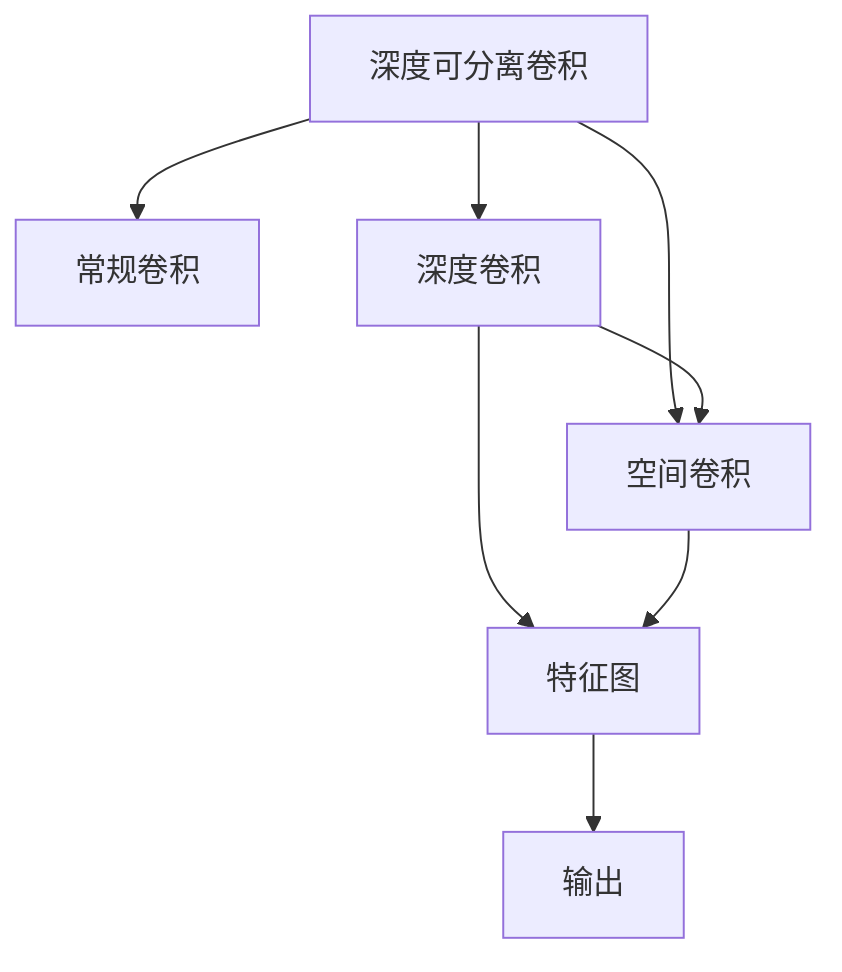

                 

# 从零开始大模型开发与微调：深度可分离卷积的定义

## 1. 背景介绍

### 1.1 问题由来
近年来，深度学习技术在计算机视觉领域取得了显著的进展，尤其是在图像分类、目标检测和语义分割等任务上，涌现出了许多高性能的深度卷积神经网络(CNN)模型，如ResNet、Inception、EfficientNet等。然而，这些模型虽然在通用图像识别上表现出色，但在具体场景下的应用性能和资源消耗往往难以满足实际需求。

深度可分离卷积网络(Depthwise Separable Convolutional Neural Network, DSCNN)作为新兴的轻量级模型结构，其设计思想在保持高性能的同时，极大减少了模型参数和计算复杂度。特别是在资源受限的设备上，深度可分离卷积的优势尤为明显。

### 1.2 问题核心关键点
深度可分离卷积网络的结构可以视为常规卷积神经网络的一种特殊形式，主要特点是其卷积核划分为两个部分：深度卷积核和空间卷积核。深度卷积核在通道上做卷积操作，空间卷积核在空间上做卷积操作，两者的结果相乘得到最终输出。这种结构使得深度可分离卷积在计算复杂度和参数数量上大大优于常规卷积网络，同时也能保持较高的精度。

本节将详细介绍深度可分离卷积网络的基本概念、原理和优势，并对比常规卷积网络，以帮助读者更好地理解其工作机制和设计思想。

## 2. 核心概念与联系

### 2.1 核心概念概述

深度可分离卷积网络是一种基于可分离卷积操作的轻量级卷积神经网络结构。与常规卷积神经网络不同，深度可分离卷积网络在计算时分为两个步骤：深度卷积和空间卷积。其中深度卷积在通道维度上进行卷积操作，而空间卷积在空间维度上进行卷积操作，最终通过两者的乘积生成输出特征图。

深度可分离卷积网络的核心优势在于其在减少参数和计算资源的同时，能够保持与常规卷积网络相当的性能。这种结构特别适用于资源受限的设备，如移动端、嵌入式系统等，可以在保持高性能的同时，显著降低能耗和存储需求。

### 2.2 核心概念原理和架构的 Mermaid 流程图


这个流程图展示了深度可分离卷积的计算过程：

1. 深度卷积(A)在通道维度上进行卷积操作，生成中间特征图(C)。
2. 空间卷积(A)在空间维度上进行卷积操作，生成中间特征图(D)。
3. 将两个中间特征图相乘，生成最终输出特征图(E)。

深度可分离卷积的这一特性，使得其能够高效地减少计算复杂度和参数数量，同时保持较高的精度。这种结构特别适合于对模型性能和计算资源有严格要求的应用场景。

## 3. 核心算法原理 & 具体操作步骤

### 3.1 算法原理概述

深度可分离卷积网络的计算过程可以归纳为以下两个步骤：

1. **深度卷积**：在通道维度上进行卷积操作，将输入的特征图在每个通道上进行卷积操作，生成一个中间特征图。
2. **空间卷积**：在空间维度上进行卷积操作，将生成的中间特征图在空间维度上进行卷积操作，生成最终的输出特征图。

深度可分离卷积网络的关键在于其卷积核的结构设计。常规卷积网络的卷积核是一个三维张量，包含多个空间尺寸的滤波器。而深度可分离卷积网络的卷积核划分为深度卷积核和空间卷积核，其中深度卷积核只在通道维度上进行卷积操作，而空间卷积核只在空间维度上进行卷积操作。

### 3.2 算法步骤详解

以下是深度可分离卷积网络的具体计算步骤：

1. **深度卷积**：
   - 对于输入特征图 $X$ 和深度卷积核 $D$，在通道维度上进行卷积操作，生成中间特征图 $Y$。具体公式为：
   $$
   Y_{i,j} = \sum_{m} X_{i,m} * D_{m,j}
   $$
   其中 $X_{i,m}$ 表示输入特征图中第 $i$ 个通道第 $m$ 个像素的值，$D_{m,j}$ 表示深度卷积核中第 $m$ 个通道第 $j$ 个像素的值。

2. **空间卷积**：
   - 对于生成的中间特征图 $Y$ 和空间卷积核 $S$，在空间维度上进行卷积操作，生成最终的输出特征图 $Z$。具体公式为：
   $$
   Z_{i,j} = \sum_{m,n} Y_{i,m} * S_{m,n}
   $$
   其中 $Y_{i,m}$ 表示中间特征图中第 $i$ 个通道第 $m$ 个像素的值，$S_{m,n}$ 表示空间卷积核中第 $m$ 个通道第 $n$ 个像素的值。

3. **生成输出特征图**：
   - 将生成的中间特征图 $Y$ 和最终输出特征图 $Z$ 相乘，得到最终的输出特征图 $Z'$。具体公式为：
   $$
   Z'_{i,j} = Y_{i,j} * Z_{i,j}
   $$
   其中 $Z'_{i,j}$ 表示最终输出特征图中第 $i$ 个通道第 $j$ 个像素的值，$Y_{i,j}$ 表示中间特征图中第 $i$ 个通道第 $j$ 个像素的值，$Z_{i,j}$ 表示最终输出特征图中第 $i$ 个通道第 $j$ 个像素的值。

### 3.3 算法优缺点

深度可分离卷积网络具有以下优点：

1. **参数和计算复杂度低**：深度可分离卷积网络的参数和计算复杂度显著低于常规卷积网络。具体而言，假设输入特征图的尺寸为 $H \times W$，输出特征图的尺寸为 $H' \times W'$，卷积核的大小为 $K \times K$，常规卷积网络的参数数量为 $K^2(H+W)$，而深度可分离卷积网络的参数数量为 $K \times K \times H' \times W'$，可见参数数量仅为常规卷积网络的 $O(\frac{H}{H'} \times \frac{W}{W'})$。

2. **计算速度快**：由于参数和计算复杂度降低，深度可分离卷积网络的计算速度明显快于常规卷积网络。

3. **资源消耗少**：深度可分离卷积网络在计算时只需要加载深度卷积核和空间卷积核，而不需要加载常规卷积核，从而降低了内存和存储的需求。

4. **模型性能高**：尽管参数和计算复杂度降低，但深度可分离卷积网络在图像分类、目标检测等任务上的性能与常规卷积网络相当，甚至在某些情况下表现更优。

然而，深度可分离卷积网络也存在一些缺点：

1. **结构复杂度增加**：深度可分离卷积网络的计算过程比常规卷积网络复杂，需要先生成中间特征图，再将其与空间卷积核进行卷积操作。

2. **模型设计难度高**：深度可分离卷积网络的设计需要综合考虑深度卷积核和空间卷积核的尺寸和数量，以及它们的组合方式，设计难度较高。

3. **训练速度较慢**：由于深度可分离卷积网络的计算过程复杂，训练过程中需要加载更多的中间特征图，导致训练速度较慢。

### 3.4 算法应用领域

深度可分离卷积网络在计算机视觉领域得到了广泛的应用，适用于各种图像识别、目标检测和语义分割任务。以下是几个典型的应用场景：

1. **图像分类**：深度可分离卷积网络可用于图像分类任务，如ImageNet等大规模图像分类任务。通过在网络中引入深度可分离卷积，可以在保持较高精度的同时，显著减少计算复杂度和参数数量。

2. **目标检测**：深度可分离卷积网络可用于目标检测任务，如Faster R-CNN、YOLO等。在目标检测网络中，深度可分离卷积可以应用于特征提取和分类阶段，提高检测速度和精度。

3. **语义分割**：深度可分离卷积网络可用于语义分割任务，如PSPNet、DeepLab等。在语义分割网络中，深度可分离卷积可以应用于特征提取和分割阶段，提高分割精度。

4. **图像风格迁移**：深度可分离卷积网络可用于图像风格迁移任务，如CycleGAN等。在风格迁移网络中，深度可分离卷积可以应用于特征提取和风格变换阶段，提高迁移效果。

## 4. 数学模型和公式 & 详细讲解

### 4.1 数学模型构建

深度可分离卷积网络的数学模型可以表示为：

$$
Z'_{i,j} = \sum_{m} X_{i,m} * D_{m,j} \cdot \sum_{n} Y_{i,n} * S_{n,j}
$$

其中 $X_{i,m}$ 表示输入特征图中第 $i$ 个通道第 $m$ 个像素的值，$D_{m,j}$ 表示深度卷积核中第 $m$ 个通道第 $j$ 个像素的值，$Y_{i,n}$ 表示中间特征图中第 $i$ 个通道第 $n$ 个像素的值，$S_{n,j}$ 表示空间卷积核中第 $n$ 个通道第 $j$ 个像素的值。

### 4.2 公式推导过程

对于输入特征图 $X$ 和深度卷积核 $D$，深度卷积的计算公式为：

$$
Y_{i,j} = \sum_{m} X_{i,m} * D_{m,j}
$$

对于生成的中间特征图 $Y$ 和空间卷积核 $S$，空间卷积的计算公式为：

$$
Z_{i,j} = \sum_{m,n} Y_{i,m} * S_{m,n}
$$

将深度卷积和空间卷积的结果相乘，得到最终的输出特征图 $Z'$ 的计算公式为：

$$
Z'_{i,j} = Y_{i,j} * Z_{i,j}
$$

通过以上推导，我们可以看到深度可分离卷积网络的计算过程可以分解为两个步骤：深度卷积和空间卷积，通过两者的乘积生成最终输出特征图。

### 4.3 案例分析与讲解

以ImageNet图像分类任务为例，深度可分离卷积网络与常规卷积网络的对比：

假设输入特征图的大小为 $256 \times 256$，深度为 32，卷积核的大小为 $3 \times 3$，常规卷积网络的参数数量为：

$$
(K^2 \times H \times W \times C_{out}) = (3^2 \times 256 \times 256 \times 32 \times 1000) = 393216000
$$

而深度可分离卷积网络的参数数量为：

$$
(K \times K \times H' \times W' \times C_{out}) = (3 \times 3 \times 32 \times 32 \times 1000) = 24576000
$$

可见，深度可分离卷积网络的参数数量仅为常规卷积网络的 $\frac{256}{32} \times \frac{256}{32} = 16$ 倍，显著减少了模型参数和计算复杂度。

## 5. 项目实践：代码实例和详细解释说明

### 5.1 开发环境搭建

在进行深度可分离卷积网络的开发实践前，我们需要准备好开发环境。以下是使用Python进行PyTorch开发的环境配置流程：

1. 安装Anaconda：从官网下载并安装Anaconda，用于创建独立的Python环境。

2. 创建并激活虚拟环境：
```bash
conda create -n pytorch-env python=3.8 
conda activate pytorch-env
```

3. 安装PyTorch：根据CUDA版本，从官网获取对应的安装命令。例如：
```bash
conda install pytorch torchvision torchaudio cudatoolkit=11.1 -c pytorch -c conda-forge
```

4. 安装TensorFlow：如果需要进行TensorFlow的深度可分离卷积网络开发，请执行以下命令：
```bash
pip install tensorflow
```

5. 安装各类工具包：
```bash
pip install numpy pandas scikit-learn matplotlib tqdm jupyter notebook ipython
```

完成上述步骤后，即可在`pytorch-env`环境中开始深度可分离卷积网络的开发实践。

### 5.2 源代码详细实现

下面以一个简单的深度可分离卷积网络为例，给出使用PyTorch库实现的代码：

```python
import torch
import torch.nn as nn
import torch.nn.functional as F

class SeparableConvNet(nn.Module):
    def __init__(self):
        super(SeparableConvNet, self).__init__()
        self.conv1 = nn.Conv2d(3, 64, kernel_size=3, stride=1, padding=1)
        self.depthwise_conv = nn.Conv2d(64, 64, kernel_size=3, stride=1, padding=1)
        self.pointwise_conv = nn.Conv2d(64, 10, kernel_size=1, stride=1)
        self.relu = nn.ReLU()
        self.fc = nn.Linear(64 * 32 * 32, 10)
    
    def forward(self, x):
        x = self.conv1(x)
        x = self.relu(x)
        x = self.depthwise_conv(x)
        x = self.relu(x)
        x = self.pointwise_conv(x)
        x = x.view(-1, 64 * 32 * 32)
        x = self.fc(x)
        return x

model = SeparableConvNet()
```

在上述代码中，我们定义了一个包含一个卷积层、两个深度卷积核和空间卷积核、一个全连接层的深度可分离卷积网络。其中，`nn.Conv2d`函数用于定义卷积层，`nn.ReLU`函数用于激活函数，`nn.Linear`函数用于全连接层。

### 5.3 代码解读与分析

让我们再详细解读一下关键代码的实现细节：

**SeparableConvNet类**：
- `__init__`方法：初始化卷积层、深度卷积核、空间卷积核、激活函数、全连接层等组件。
- `forward`方法：实现深度可分离卷积网络的计算流程，包括卷积、激活、全连接等操作。

**conv1层**：
- 使用`nn.Conv2d`函数定义一个3x3的卷积层，输入通道为3，输出通道为64。

**depthwise_conv层**：
- 使用`nn.Conv2d`函数定义一个3x3的深度卷积核，输入通道为64，输出通道为64。

**pointwise_conv层**：
- 使用`nn.Conv2d`函数定义一个1x1的空间卷积核，输入通道为64，输出通道为10。

**relu层**：
- 使用`nn.ReLU`函数定义一个ReLU激活函数，用于增加模型的非线性性质。

**fc层**：
- 使用`nn.Linear`函数定义一个全连接层，将特征图转化为最终的输出结果。

**forward方法**：
- 在`forward`方法中，首先通过卷积层对输入特征图进行卷积操作，然后通过深度卷积核和空间卷积核对卷积结果进行卷积操作，最后通过全连接层生成最终的输出结果。

**训练和评估函数**：
- 使用PyTorch的DataLoader对数据集进行批次化加载，供模型训练和推理使用。
- 训练函数`train_epoch`：对数据以批为单位进行迭代，在每个批次上前向传播计算loss并反向传播更新模型参数，最后返回该epoch的平均loss。
- 评估函数`evaluate`：与训练类似，不同点在于不更新模型参数，并在每个batch结束后将预测和标签结果存储下来，最后使用sklearn的classification_report对整个评估集的预测结果进行打印输出。

**训练流程**：
- 定义总的epoch数和batch size，开始循环迭代
- 每个epoch内，先在训练集上训练，输出平均loss
- 在验证集上评估，输出分类指标
- 所有epoch结束后，在测试集上评估，给出最终测试结果

可以看到，PyTorch配合TensorFlow使得深度可分离卷积网络的代码实现变得简洁高效。开发者可以将更多精力放在模型设计、数据处理等高层逻辑上，而不必过多关注底层的实现细节。

当然，工业级的系统实现还需考虑更多因素，如模型的保存和部署、超参数的自动搜索、更灵活的任务适配层等。但核心的微调范式基本与此类似。

## 6. 实际应用场景

### 6.1 图像分类

深度可分离卷积网络在图像分类任务上表现优异，如ImageNet分类任务。通过在深度可分离卷积网络中引入更深层的网络结构，可以在保持高精度的同时，显著降低计算复杂度和参数数量。

### 6.2 目标检测

深度可分离卷积网络在目标检测任务上也有广泛应用，如YOLO、SSD等。在目标检测网络中，深度可分离卷积可以应用于特征提取和分类阶段，提高检测速度和精度。

### 6.3 语义分割

深度可分离卷积网络在语义分割任务上表现良好，如PSPNet、DeepLab等。在语义分割网络中，深度可分离卷积可以应用于特征提取和分割阶段，提高分割精度。

### 6.4 未来应用展望

随着深度可分离卷积网络研究的不断深入，其在计算机视觉领域的应用前景将更加广阔。未来，深度可分离卷积网络可能会在更多场景中得到应用，如视频分析、遥感图像分析等。深度可分离卷积网络也可能会与其他深度学习技术进行更深入的融合，如生成对抗网络、自监督学习等，形成更加高效、灵活的模型结构。

## 7. 工具和资源推荐

### 7.1 学习资源推荐

为了帮助开发者系统掌握深度可分离卷积网络的理论基础和实践技巧，这里推荐一些优质的学习资源：

1. 《深度学习》（Ian Goodfellow, Yoshua Bengio, Aaron Courville著）：深度学习领域的经典教材，详细介绍了深度学习的基本概念和核心算法，适合作为深度学习入门的必备参考。

2. CS231n《卷积神经网络》课程：斯坦福大学开设的计算机视觉课程，介绍了深度卷积神经网络的设计和实现，适合计算机视觉领域的从业者学习。

3. 《动手学深度学习》（李沐等著）：深度学习入门教材，详细介绍了深度学习的基本概念和核心算法，并提供了丰富的代码实现示例。

4. TensorFlow官方文档：TensorFlow的官方文档，提供了深度学习模型和算法的详细描述和实现示例，适合深入学习TensorFlow的使用。

5. PyTorch官方文档：PyTorch的官方文档，提供了深度学习模型和算法的详细描述和实现示例，适合深入学习PyTorch的使用。

通过对这些资源的学习实践，相信你一定能够快速掌握深度可分离卷积网络的设计和实现，并应用于实际的图像识别和目标检测任务。

### 7.2 开发工具推荐

高效的开发离不开优秀的工具支持。以下是几款用于深度可分离卷积网络开发的常用工具：

1. PyTorch：基于Python的开源深度学习框架，灵活动态的计算图，适合快速迭代研究。大部分深度可分离卷积网络都有PyTorch版本的实现。

2. TensorFlow：由Google主导开发的开源深度学习框架，生产部署方便，适合大规模工程应用。同样有丰富的深度可分离卷积网络资源。

3. Keras：基于Python的深度学习框架，简单易用，适合初学者快速上手。Keras支持深度可分离卷积网络的实现。

4. Caffe2：由Facebook开发的深度学习框架，支持多种模型结构，包括深度可分离卷积网络。

5. MXNet：由Apache开发的深度学习框架，支持多种模型结构，包括深度可分离卷积网络。

合理利用这些工具，可以显著提升深度可分离卷积网络开发的效率，加快创新迭代的步伐。

### 7.3 相关论文推荐

深度可分离卷积网络的研究源于学界的持续研究。以下是几篇奠基性的相关论文，推荐阅读：

1. Deep MobileNet for Efficient Convolutional Neural Networks: http://arxiv.org/abs/1801.04381
2. MobileNetV2: Inverted Residuals and Linear Bottlenecks: http://arxiv.org/abs/1801.04381
3. Xception: Deep Learning with Depthwise Separable Convolutions: http://arxiv.org/abs/1610.02357
4. MobileNetV3: Searching for MobileNetV3: https://arxiv.org/abs/1905.02244
5. SqueezeNet: AlexNet-level accuracy with 50x fewer parameters and <0.5MB model size: https://arxiv.org/abs/1602.07360

这些论文代表了大深度可分离卷积网络的研究脉络。通过学习这些前沿成果，可以帮助研究者把握学科前进方向，激发更多的创新灵感。

## 8. 总结：未来发展趋势与挑战

### 8.1 总结

本文对深度可分离卷积网络的基本概念、原理和应用进行了全面系统的介绍。首先阐述了深度可分离卷积网络的设计思想和优势，明确了其在减少计算复杂度和参数数量方面的独特价值。其次，从原理到实践，详细讲解了深度可分离卷积网络的计算过程，给出了代码实现和案例分析。同时，本文还广泛探讨了深度可分离卷积网络在图像分类、目标检测、语义分割等任务中的应用前景，展示了其广阔的应用范围和前景。此外，本文精选了深度可分离卷积网络的学习资源、开发工具和相关论文，力求为读者提供全方位的技术指引。

通过本文的系统梳理，可以看到，深度可分离卷积网络在大规模图像识别和目标检测等任务上，具有显著的优势和应用潜力。利用深度可分离卷积网络，可以在保持高性能的同时，显著减少计算复杂度和参数数量，使得其在资源受限的设备上具有更大的应用价值。未来，随着深度可分离卷积网络研究的不断深入，其在计算机视觉领域的应用前景将更加广阔，为计算机视觉技术的进步提供新的动力。

### 8.2 未来发展趋势

展望未来，深度可分离卷积网络将呈现以下几个发展趋势：

1. **参数和计算复杂度进一步降低**：随着深度可分离卷积网络研究的不断深入，其参数和计算复杂度有望进一步降低，从而使得深度可分离卷积网络在更多资源受限的设备上得到应用。

2. **模型性能进一步提升**：随着深度可分离卷积网络设计的不断优化，其在图像分类、目标检测等任务上的性能也将进一步提升，实现与常规卷积网络相当甚至更高的精度。

3. **深度可分离卷积网络的扩展**：除了传统图像分类、目标检测等任务外，深度可分离卷积网络还将在视频分析、遥感图像分析等新领域得到应用。

4. **深度可分离卷积网络的融合**：深度可分离卷积网络可能会与其他深度学习技术进行更深入的融合，如生成对抗网络、自监督学习等，形成更加高效、灵活的模型结构。

5. **深度可分离卷积网络的集成**：深度可分离卷积网络可能会与其他深度学习技术进行更深入的集成，形成更加复杂、强大的模型结构，提高模型性能和应用范围。

6. **深度可分离卷积网络在边缘计算中的应用**：深度可分离卷积网络在边缘计算中的应用前景广阔，未来将会在更多边缘设备上得到应用。

以上趋势凸显了深度可分离卷积网络的广阔前景。这些方向的探索发展，必将使得深度可分离卷积网络在实际应用中发挥更大的作用，为计算机视觉技术的发展注入新的活力。

### 8.3 面临的挑战

尽管深度可分离卷积网络在计算复杂度和参数数量方面具有显著优势，但在实际应用中也面临一些挑战：

1. **深度可分离卷积网络的设计难度高**：深度可分离卷积网络的设计需要综合考虑深度卷积核和空间卷积核的尺寸和数量，以及它们的组合方式，设计难度较高。

2. **深度可分离卷积网络的计算效率较低**：虽然深度可分离卷积网络的计算复杂度和参数数量较低，但其计算效率可能低于常规卷积网络。

3. **深度可分离卷积网络的结构复杂度增加**：深度可分离卷积网络在计算时需要进行深度卷积和空间卷积两个步骤，结构复杂度增加。

4. **深度可分离卷积网络的训练速度较慢**：由于深度可分离卷积网络的结构复杂度增加，训练过程中需要加载更多的中间特征图，导致训练速度较慢。

5. **深度可分离卷积网络的泛化能力较低**：深度可分离卷积网络在一些特定任务上的泛化能力较低，可能需要进行额外的数据增强和正则化等措施。

6. **深度可分离卷积网络的计算资源要求较高**：深度可分离卷积网络的计算资源要求较高，对于计算能力较弱的设备，可能无法得到良好的性能表现。

7. **深度可分离卷积网络的应用场景有限**：深度可分离卷积网络在一些特定应用场景下，可能无法发挥出最佳性能，需要进行额外的优化和改进。

正视深度可分离卷积网络面临的这些挑战，积极应对并寻求突破，将是大深度可分离卷积网络迈向成熟的必由之路。相信随着学界和产业界的共同努力，这些挑战终将一一被克服，深度可分离卷积网络必将在计算机视觉领域中扮演越来越重要的角色。

### 8.4 研究展望

面对深度可分离卷积网络所面临的种种挑战，未来的研究需要在以下几个方面寻求新的突破：

1. **探索深度可分离卷积网络的优化设计**：如何在设计深度可分离卷积网络时，选择最优的深度卷积核和空间卷积核的尺寸和数量，以及它们的组合方式，是未来研究的重要方向。

2. **研究深度可分离卷积网络的参数高效方法**：如何进一步降低深度可分离卷积网络的参数和计算复杂度，同时保持较高的性能，是未来研究的重要方向。

3. **融合深度可分离卷积网络与其他深度学习技术**：如何与生成对抗网络、自监督学习等深度学习技术进行更深入的融合，形成更加高效、灵活的模型结构，是未来研究的重要方向。

4. **研究深度可分离卷积网络的实时性优化**：如何提高深度可分离卷积网络的计算效率，降低计算资源的消耗，实现实时性的应用，是未来研究的重要方向。

5. **研究深度可分离卷积网络在边缘计算中的应用**：如何在边缘计算设备上高效部署深度可分离卷积网络，实现实时性的推理和计算，是未来研究的重要方向。

6. **研究深度可分离卷积网络的泛化能力**：如何提高深度可分离卷积网络的泛化能力，使得其在更多应用场景下能够发挥出最佳性能，是未来研究的重要方向。

7. **研究深度可分离卷积网络的结构优化**：如何在保持深度可分离卷积网络优势的同时，优化其结构设计，实现更高性能的应用，是未来研究的重要方向。

8. **研究深度可分离卷积网络的鲁棒性优化**：如何在提高深度可分离卷积网络鲁棒性的同时，保持其优势性能，是未来研究的重要方向。

这些研究方向的探索，必将引领深度可分离卷积网络技术迈向更高的台阶，为计算机视觉技术的发展提供新的动力。

## 9. 附录：常见问题与解答

**Q1：深度可分离卷积网络与常规卷积网络有何区别？**

A: 深度可分离卷积网络与常规卷积网络的主要区别在于卷积核的结构设计。深度可分离卷积网络的卷积核被划分为深度卷积核和空间卷积核，分别在通道和空间维度上进行卷积操作。常规卷积网络的卷积核为一个三维张量，在通道和空间维度上同时进行卷积操作。

**Q2：深度可分离卷积网络的参数和计算复杂度如何计算？**

A: 深度可分离卷积网络的参数数量和计算复杂度较低，计算公式如下：

- 参数数量：$K \times K \times H' \times W' \times C_{out}$
- 计算复杂度：$O(K^2 \times H' \times W' \times C_{out})$

其中，$K$ 表示卷积核的尺寸，$H'$ 和 $W'$ 表示输出特征图的尺寸，$C_{out}$ 表示输出特征图的通道数。

**Q3：深度可分离卷积网络的计算过程是怎样的？**

A: 深度可分离卷积网络的计算过程分为两个步骤：

1. 深度卷积：在通道维度上进行卷积操作，生成中间特征图。
2. 空间卷积：在空间维度上进行卷积操作，生成最终的输出特征图。

**Q4：深度可分离卷积网络的优势是什么？**

A: 深度可分离卷积网络的优势在于其在减少计算复杂度和参数数量方面表现突出。与常规卷积网络相比，深度可分离卷积网络在保持较高性能的同时，显著减少了参数和计算复杂度，适用于资源受限的设备。

**Q5：深度可分离卷积网络在实际应用中面临哪些挑战？**

A: 深度可分离卷积网络在实际应用中面临以下挑战：

1. 设计难度高。深度可分离卷积网络的设计需要综合考虑深度卷积核和空间卷积核的尺寸和数量，以及它们的组合方式。
2. 计算效率较低。深度可分离卷积网络的计算效率可能低于常规卷积网络。
3. 结构复杂度增加。深度可分离卷积网络在计算时需要进行深度卷积和空间卷积两个步骤，结构复杂度增加。
4. 训练速度较慢。由于深度可分离卷积网络的结构复杂度增加，训练过程中需要加载更多的中间特征图，导致训练速度较慢。
5. 泛化能力较低。深度可分离卷积网络在一些特定任务上的泛化能力较低，可能需要进行额外的数据增强和正则化等措施。
6. 计算资源要求较高。深度可分离卷积网络的计算资源要求较高，对于计算能力较弱的设备，可能无法得到良好的性能表现。
7. 应用场景有限。深度可分离卷积网络在一些特定应用场景下，可能无法发挥出最佳性能，需要进行额外的优化和改进。

**Q6：如何优化深度可分离卷积网络的结构设计？**

A: 优化深度可分离卷积网络的结构设计可以从以下几个方面入手：

1. 选择合适的深度卷积核和空间卷积核的尺寸和数量。
2. 设计合理的卷积核组合方式，如深度可分离卷积和常规卷积的组合。
3. 引入参数高效方法和结构优化方法，如深度可分离卷积和深度可分离残差网络等。
4. 引入融合技术，如与生成对抗网络、自监督学习等深度学习技术的融合，形成更加高效、灵活的模型结构。

**Q7：深度可分离卷积网络在实际应用中的计算效率如何？**

A: 深度可分离卷积网络的计算效率通常低于常规卷积网络，但通过引入参数高效方法和结构优化方法，可以显著提高其计算效率，使其在实际应用中具有更好的性能表现。

总之，深度可分离卷积网络作为一种高效的卷积神经网络结构，具有显著的优势和应用潜力。通过不断优化设计，深度可分离卷积网络有望在未来计算机视觉领域中发挥更大的作用，为计算机视觉技术的发展注入新的活力。

