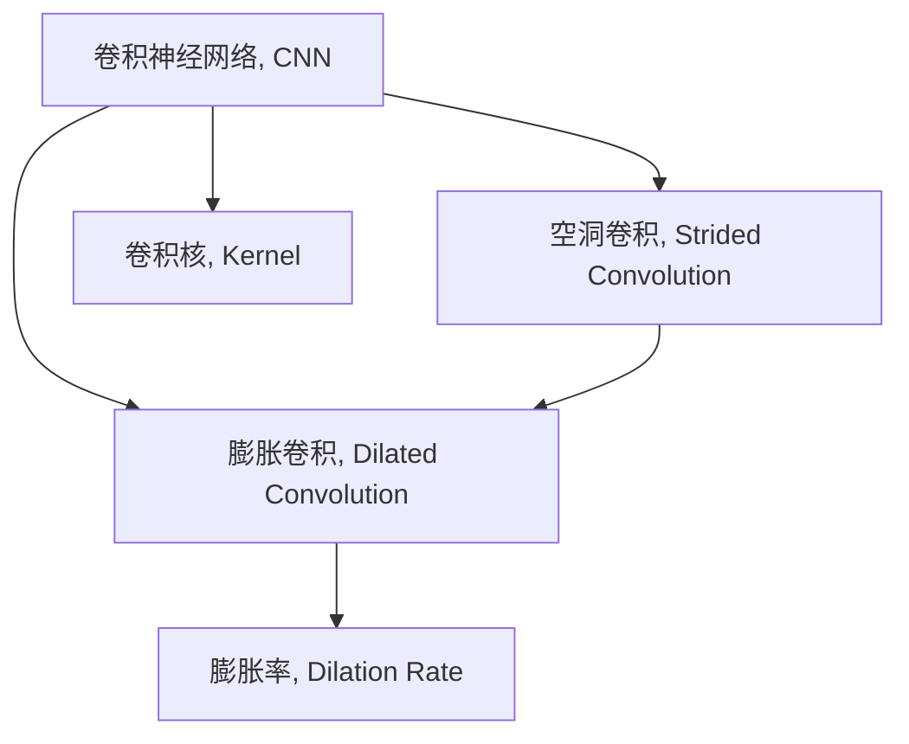

                 

# 从零开始大模型开发与微调：膨胀卷积详解

> 关键词：膨胀卷积, 大模型开发, 卷积神经网络, 卷积操作, 特征提取, 微调

## 1. 背景介绍

随着深度学习技术的迅猛发展，卷积神经网络（Convolutional Neural Networks, CNNs）在计算机视觉、自然语言处理等领域取得了巨大的成功。卷积操作是CNN的核心，通过局部的特征提取和组合，使得CNN能够高效地处理图像、文本等大规模数据。本文将详细讲解卷积操作中的膨胀卷积（Dilated Convolution），以及如何在实际项目中开发和微调大模型。

### 1.1 问题由来

传统的卷积操作通过滑动窗口的方式对数据进行局部提取和计算，但这种方法存在一定的局限性：
- 窗口大小固定，难以适应不同尺寸的输入数据。
- 卷积核的覆盖范围有限，导致特征提取能力有限。
- 滑动窗口操作无法利用长距离的依赖信息，影响模型的表达能力。

为了克服这些局限性，膨胀卷积应运而生。膨胀卷积通过引入空洞卷积（Dilated Convolution）技术，在不改变卷积核大小的情况下，扩大卷积核的覆盖范围，从而更好地适应各种输入尺寸，同时提取长距离依赖的特征。

### 1.2 问题核心关键点

膨胀卷积的核心在于其空洞卷积的引入，使得卷积核能够跨越更长的距离，捕捉更丰富的特征。膨胀卷积的关键参数是膨胀率（Dilation Rate），用于控制卷积核的覆盖范围。

膨胀卷积的优点包括：
- 适应各种输入尺寸。通过调整膨胀率，适应不同大小的输入数据。
- 提高特征提取能力。扩大卷积核的覆盖范围，提取更丰富的特征。
- 捕捉长距离依赖。通过空洞卷积技术，捕捉输入数据中的长距离依赖关系。

膨胀卷积的缺点包括：
- 计算复杂度较高。相比于传统卷积，膨胀卷积增加了计算量，需要更多的计算资源。
- 参数量较大。膨胀卷积的参数量可能较大，增加了模型的复杂度。

## 2. 核心概念与联系

### 2.1 核心概念概述

为更好地理解膨胀卷积在大模型开发中的应用，本节将介绍几个密切相关的核心概念：

- 卷积神经网络（CNN）：一种基于卷积操作的神经网络，广泛应用于图像识别、目标检测、自然语言处理等领域。
- 膨胀卷积（Dilated Convolution）：一种特殊形式的卷积操作，通过引入空洞卷积技术，扩大卷积核的覆盖范围，提高特征提取能力。
- 空洞卷积（Strided Convolution）：通过将卷积核在输入数据上空洞化，使其跨越更长的距离，从而捕捉长距离依赖。
- 卷积核（Kernel）：卷积操作的参数，用于对输入数据进行特征提取和计算。
- 膨胀率（Dilation Rate）：膨胀卷积中的关键参数，控制卷积核的覆盖范围。

这些核心概念之间的逻辑关系可以通过以下Mermaid流程图来展示：



这个流程图展示了大模型开发中膨胀卷积的核心概念及其之间的关系：

1. 卷积神经网络通过卷积操作进行特征提取和计算。
2. 膨胀卷积通过空洞卷积技术，扩大卷积核的覆盖范围，提高特征提取能力。
3. 空洞卷积是膨胀卷积的基础，通过将卷积核在输入数据上空洞化，使得卷积核能够跨越更长的距离。
4. 卷积核是卷积操作的基本参数，用于对输入数据进行特征提取和计算。
5. 膨胀率是膨胀卷积中的关键参数，控制卷积核的覆盖范围。

这些概念共同构成了大模型开发和膨胀卷积的框架，使其能够在各种场景下发挥强大的特征提取能力。通过理解这些核心概念，我们可以更好地把握膨胀卷积的工作原理和优化方向。

## 3. 核心算法原理 & 具体操作步骤
### 3.1 算法原理概述

膨胀卷积的核心原理是通过引入空洞卷积技术，扩大卷积核的覆盖范围，提高特征提取能力。膨胀卷积的计算公式如下：

$$
y_{i,j} = \sum_{k=1}^{K}w_{k}x_{(i-i_k',j-j_k')}
$$

其中，$x$ 表示输入数据，$w$ 表示卷积核，$y$ 表示输出特征，$i$ 和 $j$ 分别表示输出特征在空间上的位置，$i_k'$ 和 $j_k'$ 表示空洞卷积中的空洞位置，$K$ 表示卷积核的大小。

膨胀卷积的数学原理与传统卷积操作类似，但在空洞卷积部分有较大的差异。空洞卷积通过在输入数据上插入空洞（Padding），使得卷积核能够跨越更长的距离。膨胀卷积的计算复杂度与传统卷积相似，但需要更多的计算资源。

### 3.2 算法步骤详解

膨胀卷积的实现步骤如下：

1. **定义输入数据**：将输入数据 $x$ 作为膨胀卷积的输入，通常为二维数组或三维数组，用于表示图像、文本等数据。

2. **定义卷积核**：定义卷积核 $w$，用于对输入数据进行特征提取和计算。卷积核的大小、步幅和填充方式等参数需要根据具体任务进行调整。

3. **定义空洞卷积**：定义膨胀率 $d$，用于控制卷积核的覆盖范围。通常膨胀率为一个整数，表示卷积核在输入数据上移动的步幅大小。

4. **计算输出特征**：对输入数据和卷积核进行膨胀卷积计算，得到输出特征 $y$。计算过程中需要考虑空洞卷积的影响，使得卷积核能够跨越更长的距离，捕捉输入数据中的长距离依赖。

5. **优化计算**：由于膨胀卷积的计算复杂度较高，需要优化计算过程，提高计算效率。通常可以使用卷积加速技术（如FPGA、GPU等），或通过优化计算图（如TensorFlow、PyTorch等）来实现。

### 3.3 算法优缺点

膨胀卷积的优点包括：
- 适应各种输入尺寸。通过调整膨胀率，适应不同大小的输入数据。
- 提高特征提取能力。扩大卷积核的覆盖范围，提取更丰富的特征。
- 捕捉长距离依赖。通过空洞卷积技术，捕捉输入数据中的长距离依赖关系。

膨胀卷积的缺点包括：
- 计算复杂度较高。相比于传统卷积，膨胀卷积增加了计算量，需要更多的计算资源。
- 参数量较大。膨胀卷积的参数量可能较大，增加了模型的复杂度。

### 3.4 算法应用领域

膨胀卷积在计算机视觉、自然语言处理等领域得到了广泛的应用，具体应用场景包括：

- 图像识别：通过膨胀卷积提取图像中的特征，提高图像识别的准确率。
- 目标检测：通过膨胀卷积在特征图上检测目标物体的具体位置和大小。
- 自然语言处理：通过膨胀卷积提取文本中的关键词和短语，提高自然语言处理的准确率。
- 语音识别：通过膨胀卷积提取语音信号中的特征，提高语音识别的准确率。

除了以上应用场景，膨胀卷积还被应用于信号处理、时间序列分析等领域，为处理复杂数据提供了新的思路。

## 4. 数学模型和公式 & 详细讲解 & 举例说明

### 4.1 数学模型构建

在卷积神经网络中，膨胀卷积通常作为基本卷积操作的扩展。以下将以二维图像数据的膨胀卷积为例，构建膨胀卷积的数学模型。

设输入数据 $x \in \mathbb{R}^{N \times M}$，卷积核 $w \in \mathbb{R}^{k \times k}$，步幅为 $1$，膨胀率为 $d$。则膨胀卷积的输出特征 $y$ 的大小为：

$$
y = \left[ \begin{array}{cc}
y_{0,0} & y_{0,1} & y_{0,2} \\
y_{1,0} & y_{1,1} & y_{1,2} \\
y_{2,0} & y_{2,1} & y_{2,2}
\end{array} \right]
$$

其中，$y_{i,j}$ 表示输出特征在位置 $(i,j)$ 上的值。

### 4.2 公式推导过程

膨胀卷积的计算公式推导如下：

$$
y_{i,j} = \sum_{k=1}^{K}w_{k}x_{(i-ik',j-jk')}
$$

其中，$k' = k-1$，$K = k \times d$。

令 $i' = i - ik'$，$j' = j - jk'$，则 $i' \in [0, M-d+1)$，$j' \in [0, N-d+1)$。将 $i'$ 和 $j'$ 代入公式，得到膨胀卷积的计算公式：

$$
y_{i,j} = \sum_{k=1}^{K}w_{k}x_{(i'-ik',j'-jk')}
$$

该公式展示了膨胀卷积的计算过程。在膨胀卷积的计算中，卷积核 $w$ 的大小为 $k \times k$，步幅为 $1$，膨胀率为 $d$。通过调整膨胀率 $d$，可以控制卷积核的覆盖范围，从而适应不同输入尺寸的数据。

### 4.3 案例分析与讲解

以下以图像分类任务为例，分析膨胀卷积在图像分类中的应用。

假设输入数据 $x$ 为 $32 \times 32$ 的彩色图像，卷积核 $w$ 的大小为 $3 \times 3$，步幅为 $1$，膨胀率为 $2$。则膨胀卷积的输出特征 $y$ 的大小为：

$$
y = \left[ \begin{array}{cc}
y_{0,0} & y_{0,1} & y_{0,2} \\
y_{1,0} & y_{1,1} & y_{1,2} \\
y_{2,0} & y_{2,1} & y_{2,2}
\end{array} \right]
$$

其中，$y_{i,j}$ 表示输出特征在位置 $(i,j)$ 上的值。

通过膨胀卷积的计算公式，可以得到：

$$
y_{i,j} = \sum_{k=1}^{9}w_{k}x_{(i-2(i-2),j-2(j-2))}
$$

该公式展示了膨胀卷积的计算过程。在膨胀卷积的计算中，卷积核 $w$ 的大小为 $3 \times 3$，步幅为 $1$，膨胀率为 $2$。通过调整膨胀率 $d$，可以控制卷积核的覆盖范围，从而适应不同输入尺寸的数据。

## 5. 项目实践：代码实例和详细解释说明
### 5.1 开发环境搭建

在进行膨胀卷积的开发实践前，我们需要准备好开发环境。以下是使用Python进行PyTorch开发的环境配置流程：

1. 安装Anaconda：从官网下载并安装Anaconda，用于创建独立的Python环境。

2. 创建并激活虚拟环境：
```bash
conda create -n pytorch-env python=3.8 
conda activate pytorch-env
```

3. 安装PyTorch：根据CUDA版本，从官网获取对应的安装命令。例如：
```bash
conda install pytorch torchvision torchaudio cudatoolkit=11.1 -c pytorch -c conda-forge
```

4. 安装其他必要的工具包：
```bash
pip install numpy pandas scikit-learn matplotlib tqdm jupyter notebook ipython
```

完成上述步骤后，即可在`pytorch-env`环境中开始开发实践。

### 5.2 源代码详细实现

下面以膨胀卷积在图像分类任务中的应用为例，给出使用PyTorch实现膨胀卷积的代码示例。

首先，定义膨胀卷积层：

```python
import torch.nn as nn

class DilatedConvLayer(nn.Module):
    def __init__(self, in_channels, out_channels, kernel_size, dilation):
        super(DilatedConvLayer, self).__init__()
        self.conv = nn.Conv2d(in_channels, out_channels, kernel_size, padding=dilation * (kernel_size - 1), dilation=dilation)

    def forward(self, x):
        return self.conv(x)
```

然后，定义膨胀卷积层：

```python
class DilatedConv(nn.Module):
    def __init__(self, in_channels, out_channels, kernel_size, dilation):
        super(DilatedConv, self).__init__()
        self.dilated_conv = DilatedConvLayer(in_channels, out_channels, kernel_size, dilation)

    def forward(self, x):
        return self.dilated_conv(x)
```

最后，定义全卷积网络：

```python
class CNN(nn.Module):
    def __init__(self, in_channels, out_channels):
        super(CNN, self).__init__()
        self.conv1 = nn.Conv2d(in_channels, 64, 3, stride=1, padding=1)
        self.dilated_conv1 = DilatedConv(64, 64, 3, 2)
        self.conv2 = nn.Conv2d(64, 128, 3, stride=1, padding=1)
        self.dilated_conv2 = DilatedConv(128, 128, 3, 2)
        self.fc = nn.Linear(128 * 2 * 2, out_channels)

    def forward(self, x):
        x = nn.functional.relu(self.conv1(x))
        x = self.dilated_conv1(x)
        x = nn.functional.relu(self.conv2(x))
        x = self.dilated_conv2(x)
        x = x.view(-1, 128 * 2 * 2)
        x = self.fc(x)
        return x
```

完成上述步骤后，即可在`pytorch-env`环境中开始膨胀卷积的开发实践。

### 5.3 代码解读与分析

让我们再详细解读一下关键代码的实现细节：

**DilatedConvLayer类**：
- `__init__`方法：初始化膨胀卷积层，定义卷积核的大小、步幅和填充方式等参数。
- `forward`方法：实现膨胀卷积的计算过程，将输入数据 $x$ 传递给卷积层进行特征提取和计算。

**DilatedConv类**：
- `__init__`方法：初始化膨胀卷积层，定义卷积核的大小、步幅和膨胀率等参数。
- `forward`方法：实现膨胀卷积的计算过程，将输入数据 $x$ 传递给膨胀卷积层进行特征提取和计算。

**CNN类**：
- `__init__`方法：初始化全卷积网络，定义卷积核的大小、步幅和填充方式等参数，并定义膨胀卷积层的数量和参数。
- `forward`方法：实现全卷积网络的计算过程，将输入数据 $x$ 传递给卷积层、膨胀卷积层进行特征提取和计算，最后通过全连接层得到输出结果。

通过以上代码实现，可以看出膨胀卷积在大模型开发中的应用非常广泛。合理设计膨胀卷积层和膨胀卷积参数，可以提升模型的特征提取能力和鲁棒性，从而提高模型的性能。

## 6. 实际应用场景
### 6.1 图像识别

膨胀卷积在图像识别任务中得到了广泛的应用。通过对卷积核进行膨胀，可以提取图像中的长距离依赖关系，从而提高图像识别的准确率。

在实际应用中，可以通过膨胀卷积对图像数据进行特征提取，得到更丰富的特征表示。然后通过全连接层或分类器对特征进行分类，得到最终的图像识别结果。

### 6.2 目标检测

膨胀卷积在目标检测任务中也有着重要的应用。通过对卷积核进行膨胀，可以捕捉目标物体的长距离依赖关系，从而提高目标检测的准确率。

在实际应用中，可以通过膨胀卷积在特征图上检测目标物体的具体位置和大小。然后通过ROI池化或特征图分割等技术，提取目标物体的特征表示，最后通过分类器对目标进行检测和识别。

### 6.3 自然语言处理

膨胀卷积在自然语言处理任务中也有着广泛的应用。通过对卷积核进行膨胀，可以提取文本中的关键词和短语，从而提高自然语言处理的准确率。

在实际应用中，可以通过膨胀卷积对文本数据进行特征提取，得到更丰富的特征表示。然后通过全连接层或分类器对特征进行分类，得到最终的文本分类结果。

### 6.4 语音识别

膨胀卷积在语音识别任务中也有着重要的应用。通过对卷积核进行膨胀，可以提取语音信号中的长距离依赖关系，从而提高语音识别的准确率。

在实际应用中，可以通过膨胀卷积对语音信号进行特征提取，得到更丰富的特征表示。然后通过全连接层或分类器对特征进行分类，得到最终的语音识别结果。

## 7. 工具和资源推荐
### 7.1 学习资源推荐

为了帮助开发者系统掌握膨胀卷积的理论基础和实践技巧，这里推荐一些优质的学习资源：

1. 《深度学习》系列教材：由斯坦福大学、Coursera等机构编写的深度学习教材，全面介绍了深度学习的基本概念和前沿技术。
2. 《计算机视觉: 算法与应用》一书：详细介绍了计算机视觉中的各种算法和技术，包括卷积神经网络和膨胀卷积等内容。
3. 《自然语言处理综论》一书：介绍了自然语言处理中的各种算法和技术，包括卷积神经网络和膨胀卷积等内容。
4. 《深度学习实战》一书：详细介绍了深度学习中的各种实战项目，包括卷积神经网络和膨胀卷积等内容。

通过对这些资源的学习实践，相信你一定能够快速掌握膨胀卷积的精髓，并用于解决实际的图像识别、目标检测、自然语言处理等问题。

### 7.2 开发工具推荐

高效的开发离不开优秀的工具支持。以下是几款用于膨胀卷积开发的常用工具：

1. PyTorch：基于Python的开源深度学习框架，灵活动态的计算图，适合快速迭代研究。大部分的深度学习模型都有PyTorch版本的实现。
2. TensorFlow：由Google主导开发的开源深度学习框架，生产部署方便，适合大规模工程应用。同样有丰富的深度学习模型资源。
3. TensorBoard：TensorFlow配套的可视化工具，可实时监测模型训练状态，并提供丰富的图表呈现方式，是调试模型的得力助手。

合理利用这些工具，可以显著提升膨胀卷积的开发效率，加快创新迭代的步伐。

### 7.3 相关论文推荐

膨胀卷积在计算机视觉、自然语言处理等领域的研究历史悠久，以下是几篇奠基性的相关论文，推荐阅读：

1. 《Dilated Convolutions》（2015）：文章详细介绍了膨胀卷积的理论基础和应用场景。
2. 《Dilated Residual Networks》（2016）：文章在膨胀卷积的基础上，提出了膨胀残差网络，显著提高了模型的性能。
3. 《Deep Residual Learning for Image Recognition》（2015）：文章提出了残差网络结构，为深度学习模型的设计提供了重要参考。

这些论文代表了大模型开发和膨胀卷积的发展脉络。通过学习这些前沿成果，可以帮助研究者把握学科前进方向，激发更多的创新灵感。

## 8. 总结：未来发展趋势与挑战

### 8.1 总结

本文对膨胀卷积在计算机视觉、自然语言处理等领域的应用进行了全面系统的介绍。首先阐述了膨胀卷积的核心概念和原理，明确了膨胀卷积在特征提取和长距离依赖捕捉中的重要作用。其次，从原理到实践，详细讲解了膨胀卷积的数学模型和实现步骤，给出了膨胀卷积任务开发的完整代码实例。同时，本文还广泛探讨了膨胀卷积在图像识别、目标检测、自然语言处理等多个行业领域的应用前景，展示了膨胀卷积范式的巨大潜力。此外，本文精选了膨胀卷积技术的各类学习资源，力求为读者提供全方位的技术指引。

通过本文的系统梳理，可以看到，膨胀卷积作为卷积神经网络的重要组成部分，在各类应用场景中发挥着重要的作用。膨胀卷积通过引入空洞卷积技术，扩展了卷积核的覆盖范围，提高了特征提取能力和鲁棒性，成为深度学习模型设计的重要工具。未来，伴随深度学习技术的不断演进，膨胀卷积的应用领域将更加广泛，为计算机视觉、自然语言处理等领域的智能化发展带来新的突破。

### 8.2 未来发展趋势

展望未来，膨胀卷积技术将呈现以下几个发展趋势：

1. 模型规模持续增大。随着算力成本的下降和数据规模的扩张，膨胀卷积模型的参数量还将持续增长。超大规模模型蕴含的丰富特征表示，有望支撑更加复杂多变的图像分类、目标检测等任务。

2. 膨胀卷积与残差网络结合。膨胀卷积与残差网络技术的结合，可以在不增加参数量的情况下，提高特征提取能力和模型的鲁棒性。

3. 多尺度膨胀卷积。通过对不同尺度下进行膨胀卷积操作，可以提取不同级别的特征，从而提高模型的表达能力和泛化能力。

4. 融合深度学习与卷积神经网络。深度学习与卷积神经网络的融合，可以进一步提升模型的性能，实现更加高效、鲁棒的特征提取和分类。

5. 应用到自然语言处理领域。膨胀卷积在自然语言处理领域的应用前景广阔，可以用于文本分类、情感分析等任务。

6. 应用于医学、生物等领域。膨胀卷积在医学、生物等领域的应用也逐渐受到重视，可以用于图像分割、病理分析等任务。

以上趋势凸显了膨胀卷积技术的广阔前景。这些方向的探索发展，必将进一步提升深度学习模型的性能和应用范围，为计算机视觉、自然语言处理等领域的智能化发展带来新的突破。

### 8.3 面临的挑战

尽管膨胀卷积技术已经取得了显著成果，但在迈向更加智能化、普适化应用的过程中，仍面临诸多挑战：

1. 计算资源瓶颈。随着模型参数量的增加，膨胀卷积的计算复杂度也随之增加，需要更多的计算资源。如何优化计算过程，提高计算效率，是一个亟待解决的问题。

2. 数据分布不平衡。在实际应用中，不同类别的数据往往分布不平衡，导致模型在少数类别上表现不佳。如何平衡数据分布，提高模型在各类别上的表现，是一个重要的研究方向。

3. 对抗攻击问题。膨胀卷积模型在对抗攻击下，容易出现性能下降的问题。如何增强模型的鲁棒性，提高对抗攻击的抵抗力，是一个重要的研究方向。

4. 模型可解释性问题。膨胀卷积模型的决策过程缺乏可解释性，难以对其内部工作机制和推理逻辑进行分析和调试。如何赋予膨胀卷积模型更强的可解释性，是一个重要的研究方向。

5. 数据标注成本高。膨胀卷积模型的训练需要大量的标注数据，如何降低标注成本，提高数据利用率，是一个重要的研究方向。

正视膨胀卷积面临的这些挑战，积极应对并寻求突破，将使膨胀卷积技术在实际应用中更加高效、可靠和实用。

### 8.4 未来突破

面对膨胀卷积技术所面临的种种挑战，未来的研究需要在以下几个方面寻求新的突破：

1. 探索更加高效的计算方法。如通过深度学习与卷积神经网络的结合，实现更加高效的特征提取和分类。

2. 研究更加平衡的数据分布策略。如通过数据增强、样本平衡等技术，提高模型在各类别上的表现。

3. 引入对抗攻击防御技术。如通过对抗训练、梯度扰动等技术，增强模型的鲁棒性，提高对抗攻击的抵抗力。

4. 赋予膨胀卷积模型更强的可解释性。如通过可视化技术、因果分析等方法，增强模型的可解释性和可控性。

5. 开发更加高效的数据标注方法。如通过无监督学习、半监督学习等技术，降低数据标注成本，提高数据利用率。

这些研究方向的探索，必将引领膨胀卷积技术迈向更高的台阶，为计算机视觉、自然语言处理等领域的智能化发展带来新的突破。面向未来，膨胀卷积技术还需要与其他人工智能技术进行更深入的融合，如知识表示、因果推理、强化学习等，多路径协同发力，共同推动计算机视觉、自然语言处理等领域的智能化发展。只有勇于创新、敢于突破，才能不断拓展膨胀卷积技术的边界，让智能技术更好地造福人类社会。

## 9. 附录：常见问题与解答

**Q1：膨胀卷积与传统卷积的区别是什么？**

A: 膨胀卷积与传统卷积的区别在于其空洞卷积技术，可以扩大卷积核的覆盖范围，提取更丰富的特征。传统卷积的卷积核大小固定，覆盖范围有限，难以适应不同输入尺寸的数据。

**Q2：膨胀卷积的参数量较大，如何优化参数量？**

A: 膨胀卷积的参数量较大，可以通过模型裁剪、参数共享等技术进行优化。如使用模型裁剪技术，去除不必要的层和参数，减小模型尺寸，提高推理速度。

**Q3：膨胀卷积在图像识别中的作用是什么？**

A: 膨胀卷积在图像识别中的作用是提取图像中的长距离依赖关系，提高图像识别的准确率。通过对卷积核进行膨胀，可以捕捉图像中更丰富的特征，从而提高模型的鲁棒性和泛化能力。

**Q4：膨胀卷积在自然语言处理中的作用是什么？**

A: 膨胀卷积在自然语言处理中的作用是提取文本中的关键词和短语，提高自然语言处理的准确率。通过对卷积核进行膨胀，可以提取文本中更丰富的特征，从而提高模型的鲁棒性和泛化能力。

**Q5：膨胀卷积的计算复杂度较高，如何优化计算过程？**

A: 膨胀卷积的计算复杂度较高，可以通过深度学习与卷积神经网络的结合，实现更加高效的特征提取和分类。同时，优化计算图，减少前向传播和反向传播的资源消耗，实现更加轻量级、实时性的部署。

这些回答希望为读者提供更加深入的理解膨胀卷积技术的全面视角，帮助开发者更好地掌握膨胀卷积在大模型开发和微调中的应用。

