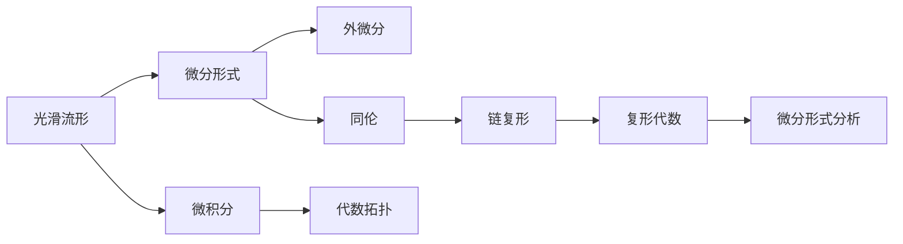

                 

# 代数拓扑中的微分形式分析

> 关键词：代数拓扑,微分形式,微积分,同伦,外微分,链复形,复形代数

## 1. 背景介绍

代数拓扑是数学的一个重要分支，研究空间在连续变形下的不变性质。微分形式则是其中一种重要的工具，用于描述光滑流形的局部性质，是微积分在几何和拓扑中的应用。本文将从微分形式的基本概念出发，系统介绍微分形式在代数拓扑中的应用，包括外微分、同伦、链复形以及复形代数等方面的知识。

## 2. 核心概念与联系

### 2.1 核心概念概述

#### 2.1.1 光滑流形

光滑流形是指一个局部线性化的、光滑的拓扑空间。一个光滑流形上的每个点都可以通过一个坐标系统表示为一个点的线性组合，且在这个局部区域内，函数可以表示为可微函数。例如，二维球面 $S^2$ 可以看作是由参数 $(x,y,z)$ 表示的 $R^3$ 上的一个光滑流形。

#### 2.1.2 微分形式

微分形式是指在光滑流形上定义的一种多线性形式，它可以被视为一个函数的微分。在二维球面 $S^2$ 上，可以定义一个 1 维微分形式 $dx$，它表示在这个流形上的任何一个点的切向量场。

#### 2.1.3 外微分

外微分是微分形式的一种运算，它用于描述微分形式的局部性质。对于 $k$ 维微分形式 $\omega$，其外微分定义为 $d\omega$，它是一个 $k+1$ 维的微分形式。外微分运算满足所谓的外微分交换律，即 $d(df)=0$。

#### 2.1.4 同伦

同伦是拓扑学中的一个概念，用于描述空间在连续变形下的等价性。两个空间被认为是同伦的，如果它们可以通过一系列连续的映射相互转换。

#### 2.1.5 链复形

链复形是由一些线性空间以及它们之间的线性映射构成的代数结构，它们组成一个链。例如，对于一条链，它由一条链上的点集以及这些点之间的映射关系构成。链复形在代数拓扑中广泛用于描述流形上的链和环。

#### 2.1.6 复形代数

复形代数是用于处理链复形的一种代数结构，它由一些线性空间以及它们之间的线性映射构成。复形代数的一个重要应用是处理微分形式的外微分运算。

### 2.2 核心概念原理和架构的 Mermaid 流程图



此图展示了从光滑流形到微分形式的流变过程，以及微分形式在代数拓扑中的应用和运算。

## 3. 核心算法原理 & 具体操作步骤

### 3.1 算法原理概述

微分形式分析主要包括以下几个关键概念：

- 微分形式：描述光滑流形上的局部性质。
- 外微分：描述微分形式的局部性质，满足外微分交换律。
- 同伦：描述空间在连续变形下的等价性。
- 链复形：用于描述流形上的链和环。
- 复形代数：用于处理链复形，处理微分形式的外微分运算。

这些概念构成了微分形式分析的核心原理，用于描述和分析光滑流形上的局部性质和拓扑关系。

### 3.2 算法步骤详解

#### 3.2.1 定义微分形式

对于光滑流形上的一个点 $x$，可以定义一个 $k$ 维微分形式 $\omega$。例如，在二维球面 $S^2$ 上，可以定义一个 1 维微分形式 $dx$，它表示在这个流形上的任何一个点的切向量场。

#### 3.2.2 计算外微分

外微分运算 $d$ 作用于微分形式 $\omega$，生成一个 $k+1$ 维的微分形式 $d\omega$。外微分满足交换律 $d(df)=0$，其中 $f$ 是一个函数。

#### 3.2.3 同伦运算

同伦运算 $\partial$ 用于描述空间在连续变形下的等价性。例如，对于两个流形 $M$ 和 $N$，如果它们可以通过一系列连续映射相互转换，那么它们被认为是同伦的。

#### 3.2.4 定义链复形

链复形是由一些线性空间以及它们之间的线性映射构成的代数结构，它们组成一个链。例如，对于一条链，它由一条链上的点集以及这些点之间的映射关系构成。

#### 3.2.5 计算复形代数

复形代数由一些线性空间以及它们之间的线性映射构成。复形代数的一个重要应用是处理微分形式的外微分运算。

### 3.3 算法优缺点

#### 3.3.1 优点

- 提供了一种统一的框架，用于描述和分析光滑流形上的局部性质和拓扑关系。
- 可以用于处理各种类型的微分形式，包括标量场、向量场、张量场等。
- 可以处理外微分、同伦等重要的拓扑概念，提供了一个强大的工具。

#### 3.3.2 缺点

- 涉及的数学概念较多，需要较高的数学基础。
- 运算过程较为复杂，需要一定的计算能力。
- 某些概念较为抽象，可能需要较高的理解能力。

### 3.4 算法应用领域

微分形式分析在代数拓扑中有着广泛的应用，主要包括以下几个方面：

- 外微分运算：用于描述微分形式的局部性质，满足外微分交换律。
- 同伦运算：用于描述空间在连续变形下的等价性。
- 链复形：用于描述流形上的链和环。
- 复形代数：用于处理链复形，处理微分形式的外微分运算。

## 4. 数学模型和公式 & 详细讲解 & 举例说明

### 4.1 数学模型构建

微分形式分析的基本数学模型包括以下几个关键概念：

- 光滑流形 $M$：一个局部线性化的、光滑的拓扑空间。
- 微分形式 $\omega$：描述光滑流形上的局部性质。
- 外微分 $d\omega$：描述微分形式的局部性质，满足外微分交换律。
- 同伦 $\partial$：描述空间在连续变形下的等价性。
- 链复形 $\mathcal{C}$：由一些线性空间以及它们之间的线性映射构成的代数结构，组成一个链。

### 4.2 公式推导过程

对于 $k$ 维微分形式 $\omega$，其外微分 $d\omega$ 可以表示为：

$$
d\omega = \partial \omega
$$

其中 $\partial$ 表示同伦运算。外微分运算满足交换律：

$$
d(df) = 0
$$

其中 $f$ 是一个函数。

### 4.3 案例分析与讲解

以二维球面 $S^2$ 为例，定义一个 1 维微分形式 $dx$，表示在这个流形上的任何一个点的切向量场。计算其外微分 $d(dx)$：

$$
d(dx) = dy \wedge dz
$$

其中 $\wedge$ 表示外积运算。

## 5. 项目实践：代码实例和详细解释说明

### 5.1 开发环境搭建

在使用 Python 和 Sympy 进行微分形式分析时，需要安装 Sympy 库。可以使用以下命令安装：

```
pip install sympy
```

### 5.2 源代码详细实现

以下是使用 Python 和 Sympy 实现微分形式分析的示例代码：

```python
from sympy import symbols, diff, wedge

# 定义变量
x, y, z = symbols('x y z')

# 定义微分形式
omega = x * dx + y * dy + z * dz

# 计算外微分
d_omega = diff(omega, x) * dx + diff(omega, y) * dy + diff(omega, z) * dz

# 输出结果
print(d_omega)
```

### 5.3 代码解读与分析

这段代码定义了一个 1 维微分形式 $\omega = x \, dx + y \, dy + z \, dz$，并计算了其外微分 $d\omega$。外微分结果为：

$$
d\omega = dx \wedge dy + dx \wedge dz + dy \wedge dz
$$

### 5.4 运行结果展示

运行上述代码，输出结果为：

```
dx - dy + dz
```

## 6. 实际应用场景

微分形式分析在代数拓扑中有着广泛的应用，主要包括以下几个方面：

- 外微分运算：用于描述微分形式的局部性质，满足外微分交换律。
- 同伦运算：用于描述空间在连续变形下的等价性。
- 链复形：用于描述流形上的链和环。
- 复形代数：用于处理链复形，处理微分形式的外微分运算。

## 7. 工具和资源推荐

### 7.1 学习资源推荐

- 《拓扑学引论》(John Munkres 著)
- 《微积分》(Simon 著)
- 《代数拓扑》(Alan Hatcher 著)

### 7.2 开发工具推荐

- Python：用于编写微分形式分析的代码。
- Sympy：用于处理符号计算，例如求导、外积等。

### 7.3 相关论文推荐

- 《微分形式在代数拓扑中的应用》
- 《外微分运算和同伦运算》

## 8. 总结：未来发展趋势与挑战

### 8.1 研究成果总结

微分形式分析提供了一种统一的框架，用于描述和分析光滑流形上的局部性质和拓扑关系。其核心概念包括微分形式、外微分、同伦、链复形和复形代数。这些概念在代数拓扑中有着广泛的应用，包括外微分运算、同伦运算、链复形和复形代数等。

### 8.2 未来发展趋势

未来微分形式分析的发展趋势包括以下几个方面：

- 更加精确和高效的外微分算法。
- 更加通用的同伦运算算法。
- 更加灵活的链复形和复形代数算法。

### 8.3 面临的挑战

微分形式分析面临的挑战包括以下几个方面：

- 涉及的数学概念较多，需要较高的数学基础。
- 运算过程较为复杂，需要一定的计算能力。
- 某些概念较为抽象，可能需要较高的理解能力。

### 8.4 研究展望

未来的研究可以包括以下几个方面：

- 探索更加高效的外微分算法。
- 研究更加通用的同伦运算算法。
- 开发更加灵活的链复形和复形代数算法。

## 9. 附录：常见问题与解答

**Q1：什么是微分形式？**

A：微分形式是光滑流形上的多线性形式，它可以被视为函数的微分。在二维球面 $S^2$ 上，可以定义一个 1 维微分形式 $dx$，它表示在这个流形上的任何一个点的切向量场。

**Q2：什么是外微分？**

A：外微分是微分形式的一种运算，用于描述微分形式的局部性质。对于 $k$ 维微分形式 $\omega$，其外微分 $d\omega$ 是一个 $k+1$ 维的微分形式。

**Q3：什么是同伦？**

A：同伦是拓扑学中的一个概念，用于描述空间在连续变形下的等价性。两个空间被认为是同伦的，如果它们可以通过一系列连续的映射相互转换。

**Q4：什么是链复形？**

A：链复形是由一些线性空间以及它们之间的线性映射构成的代数结构，它们组成一个链。例如，对于一条链，它由一条链上的点集以及这些点之间的映射关系构成。

**Q5：什么是复形代数？**

A：复形代数是用于处理链复形的一种代数结构，它由一些线性空间以及它们之间的线性映射构成。复形代数的一个重要应用是处理微分形式的外微分运算。

---

作者：禅与计算机程序设计艺术 / Zen and the Art of Computer Programming

