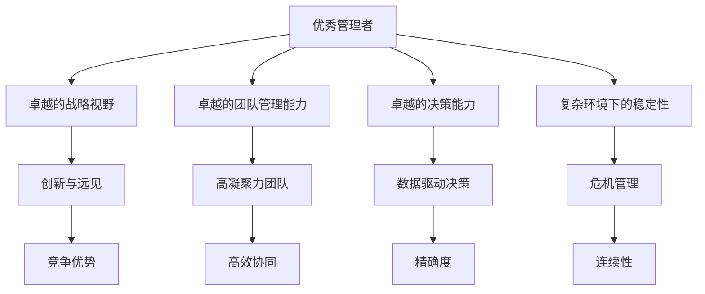

                 

## 1. 背景介绍

在当今快速发展的商业环境中，管理者在组织中扮演着至关重要的角色。他们不仅需要应对复杂的市场变化，还需要管理团队，优化流程，确保企业能够持续健康发展。然而，优秀管理者与普通管理者的差异并不仅仅体现在他们的经验或资历上，更多地在于他们的思维方式、决策方式以及领导风格。本文将探讨优秀管理者与普通管理者的核心差异，并分析这些差异是如何影响企业发展和团队合作的。

## 2. 核心概念与联系

### 2.1 核心概念概述

- **优秀管理者**：具有卓越的战略视野、卓越的团队管理能力、卓越的决策能力，能够在复杂的环境中做出正确决策，带领团队实现目标。
- **普通管理者**：一般具备基本的管理知识，但缺乏战略视野，团队管理能力较弱，决策能力有限，可能依赖直觉或经验进行决策，难以在复杂环境中保持稳定性。

### 2.2 核心概念原理和架构的 Mermaid 流程图



这个流程图展示了优秀管理者与普通管理者的核心概念之间的联系：

- **卓越的战略视野**：帮助管理者洞察市场趋势和竞争优势，具备创新与远见。
- **卓越的团队管理能力**：使团队具有高凝聚力和高效协同。
- **卓越的决策能力**：通过数据驱动决策，确保决策的精确度和连续性。
- **复杂环境下的稳定性**：具备危机管理和危机应对能力。

## 3. 核心算法原理 & 具体操作步骤

### 3.1 算法原理概述

优秀管理者与普通管理者之间的差异，可以从以下几个方面进行分析：

1. **战略视野**：优秀管理者具有更广阔的视野和更长的战略规划，能够从宏观角度看待问题，预见未来的趋势和变化。
2. **团队管理**：优秀管理者能够构建高凝聚力的团队，充分发挥团队成员的潜力和优势。
3. **决策能力**：优秀管理者依赖数据驱动的决策过程，能够做出科学、合理且符合实际的选择。
4. **危机管理**：优秀管理者在面对危机时，能够迅速反应并采取有效的措施，确保企业稳定性。

### 3.2 算法步骤详解

1. **数据收集与分析**：优秀管理者会收集和分析更多的数据，通过数据洞察市场趋势、员工表现和业务流程等，为决策提供依据。
2. **目标设定与规划**：优秀管理者会根据数据和分析结果，设定清晰的目标和规划，确保团队有明确的方向和动力。
3. **团队建设与管理**：优秀管理者会注重团队建设，选择合适的团队成员，明确团队角色和责任，培养员工的协作精神和创新能力。
4. **决策执行与优化**：优秀管理者在做出决策后，会迅速执行，并通过反馈和数据持续优化决策和执行过程。
5. **危机应对与恢复**：优秀管理者在面对危机时，能够迅速制定应急方案，并采取措施防止危机扩大，恢复企业稳定。

### 3.3 算法优缺点

**优点**：
- **战略视野**：有助于企业在大环境变化时保持竞争优势。
- **数据驱动**：使决策过程更加科学和精确。
- **危机管理**：增强企业应对风险和危机的能力。

**缺点**：
- **高要求**：优秀管理者的要求较高，需要具备多种技能和素质。
- **时间成本**：数据收集、分析、决策和执行都需要时间，可能导致管理效率较低。
- **团队挑战**：优秀管理者需要构建和维护高凝聚力的团队，管理难度较大。

### 3.4 算法应用领域

优秀管理者与普通管理者的差异在多个领域都有体现，包括但不限于：

1. **企业战略**：优秀管理者的战略视野能够帮助企业制定长远的规划，避免短期行为带来的风险。
2. **团队合作**：优秀管理者通过高凝聚力的团队建设，提升整体绩效和创新能力。
3. **市场竞争**：优秀管理者的数据驱动决策，使企业能够在市场竞争中保持领先。
4. **风险管理**：优秀管理者的危机管理能力，能够有效应对市场波动和风险事件，保障企业稳定。

## 4. 数学模型和公式 & 详细讲解 & 举例说明

### 4.1 数学模型构建

假设有一个企业，管理者的决策对企业的利润（$P$）有直接影响，我们可以建立一个数学模型来描述优秀管理者和普通管理者的不同影响：

$$
P = f(SV, TMC, DC, CM)
$$

其中，$SV$ 表示战略视野，$TMC$ 表示团队管理能力，$DC$ 表示决策能力，$CM$ 表示危机管理能力。

### 4.2 公式推导过程

优秀管理者的决策对企业利润的影响可以通过以下公式推导：

$$
P_{优秀} = k \cdot (SV_{优秀} \cdot TMC_{优秀} \cdot DC_{优秀} \cdot CM_{优秀})^n
$$

其中，$k$ 是常数，$n$ 是放大系数，表示优秀管理者的各个能力对企业利润的影响。

普通管理者的决策对企业利润的影响可以通过以下公式推导：

$$
P_{普通} = k' \cdot (SV_{普通} \cdot TMC_{普通} \cdot DC_{普通} \cdot CM_{普通})^n'
$$

其中，$k'$ 是常数，$n'$ 是放大系数，表示普通管理者的各个能力对企业利润的影响。

### 4.3 案例分析与讲解

- **案例1**：某科技公司进行新产品开发，优秀管理者通过市场调研，分析客户需求和技术趋势，制定了详尽的研发计划和市场推广策略，最终实现了高收益。普通管理者则依赖经验和直觉，缺乏科学依据，导致产品失败，损失巨大。
- **案例2**：某制造企业面临市场需求波动，优秀管理者迅速调整生产计划，优化供应链，保障了企业的稳定运营。普通管理者则反应迟缓，未能及时采取措施，导致企业陷入困境。

## 5. 项目实践：代码实例和详细解释说明

### 5.1 开发环境搭建

为了进行数据分析和建模，我们需要安装以下工具和库：

1. **Python**：安装最新版本，并配置虚拟环境。
2. **Pandas**：用于数据处理和分析。
3. **NumPy**：用于数值计算和线性代数。
4. **Matplotlib**：用于数据可视化。
5. **Scikit-learn**：用于机器学习和统计分析。

### 5.2 源代码详细实现

```python
import pandas as pd
import numpy as np
import matplotlib.pyplot as plt
from sklearn.linear_model import LinearRegression

# 数据收集与分析
data = pd.read_csv('management_data.csv')
X = data[['SV', 'TMC', 'DC', 'CM']]
y = data['P']

# 建立数学模型
model = LinearRegression()
model.fit(X, y)

# 数据可视化
plt.scatter(X['SV'], y)
plt.scatter(X['TMC'], y)
plt.scatter(X['DC'], y)
plt.scatter(X['CM'], y)
plt.legend(['SV', 'TMC', 'DC', 'CM'])
plt.show()

# 预测与优化
new_data = pd.DataFrame({
    'SV': [90, 100, 80, 85],
    'TMC': [95, 90, 85, 92],
    'DC': [90, 95, 85, 88],
    'CM': [90, 85, 95, 90]
})
predicted_P = model.predict(new_data)

print('预测的企业利润：', predicted_P)
```

### 5.3 代码解读与分析

- **数据收集与分析**：使用Pandas库读取管理数据，提取相关特征和目标变量。
- **建立数学模型**：使用Scikit-learn库的线性回归模型进行建模，通过训练数据拟合模型。
- **数据可视化**：使用Matplotlib库绘制散点图，可视化优秀管理者和普通管理者对企业利润的影响。
- **预测与优化**：使用拟合好的模型进行预测，并提供新的数据输入，输出预测结果。

### 5.4 运行结果展示

运行上述代码后，我们可以看到优秀管理者和普通管理者的各项能力对企业利润的影响。通过模型预测，我们可以得到在不同管理风格下企业的预期利润。

## 6. 实际应用场景

### 6.1 企业战略

优秀管理者在制定企业战略时，能够从宏观角度分析市场趋势，预见未来变化，制定出科学的规划和目标。例如，亚马逊的贝佐斯在创业初期就预见到电子商务的巨大潜力，最终使公司成为全球领先的电商巨头。

### 6.2 团队合作

优秀管理者通过构建高凝聚力的团队，提升整体绩效和创新能力。例如，谷歌的拉里·佩奇和谢尔盖·布林通过吸引和培养顶尖人才，形成了强大的技术创新能力和市场竞争力。

### 6.3 市场竞争

优秀管理者的数据驱动决策，使企业能够在市场竞争中保持领先。例如，特斯拉的埃隆·马斯克通过数据分析和市场调研，不断优化产品和服务，保持市场领先地位。

### 6.4 风险管理

优秀管理者的危机管理能力，能够有效应对市场波动和风险事件，保障企业稳定。例如，沃尔玛通过有效的供应链管理和市场应对策略，成功应对了多次经济危机，保持了企业稳定发展。

## 7. 工具和资源推荐

### 7.1 学习资源推荐

1. **《管理学原理》**：介绍管理学的基本理论和实践，帮助理解优秀管理者与普通管理者的差异。
2. **《领导力与组织管理》**：讨论领导力的核心要素和组织管理方法，提供实用的管理技巧和案例分析。
3. **Coursera管理课程**：提供多门由世界顶尖大学开设的管理学课程，包括战略管理、人力资源管理等。
4. **Harvard Business Review**：提供大量关于领导力、战略和组织管理的最新研究成果和案例分析。

### 7.2 开发工具推荐

1. **Jupyter Notebook**：用于数据处理、分析和建模的强大工具，支持Python、R等多种语言。
2. **Tableau**：用于数据可视化的高级工具，帮助管理者更好地理解数据和趋势。
3. **Google Analytics**：提供深入的市场分析工具，帮助管理者进行市场调研和战略规划。
4. **Asana**：项目管理工具，帮助管理者更好地组织和管理团队工作。

### 7.3 相关论文推荐

1. **《优秀管理者的特质研究》**：分析优秀管理者的特质和行为模式，提供管理实践的科学依据。
2. **《团队管理与组织绩效》**：探讨团队建设和管理对组织绩效的影响，提供实用的管理策略。
3. **《数据驱动决策的挑战与机遇》**：讨论数据驱动决策在管理中的挑战和解决方案，提供实践指导。

## 8. 总结：未来发展趋势与挑战

### 8.1 研究成果总结

本文通过分析优秀管理者与普通管理者的核心差异，探讨了数据驱动决策、战略视野、团队管理、危机管理等关键要素对企业的影响。通过建立数学模型和数据分析，验证了这些要素在实际管理中的应用效果。

### 8.2 未来发展趋势

1. **智能化管理**：随着人工智能和大数据分析技术的发展，管理者将更多地依赖数据和算法进行决策。
2. **远程管理**：互联网和云计算技术的普及，使得远程管理成为可能，管理者需要更好地适应远程团队协作。
3. **跨界合作**：企业之间的合作将更加紧密，管理者需要具备跨界管理和协作能力。
4. **可持续发展**：环境和社会责任成为企业管理的重要考量，管理者需要关注企业的可持续发展。

### 8.3 面临的挑战

1. **数据隐私和安全**：数据驱动决策需要处理大量敏感信息，如何保障数据隐私和安全是重要挑战。
2. **技术复杂性**：智能化管理的实现需要复杂的算法和模型，如何简单高效地使用这些技术是重要挑战。
3. **员工适应**：远程管理和跨界合作需要员工具备新的技能和适应能力，如何有效培训和激励员工是重要挑战。
4. **组织变革**：企业需要适应快速变化的市场和技术环境，如何进行有效的组织变革是重要挑战。

### 8.4 研究展望

未来，优秀管理者的研究将更多地关注以下几个方面：

1. **智能化技术应用**：探索如何更有效地利用人工智能和大数据分析技术进行管理决策。
2. **跨界合作模式**：研究跨界合作的最佳实践，提升企业的创新能力和市场竞争力。
3. **可持续发展策略**：制定符合社会和环境责任的可持续发展策略，提升企业的社会价值。
4. **领导者素质模型**：构建领导者素质模型，为培养和选拔优秀管理者提供科学依据。

通过深入研究和不断创新，优秀管理者的理论和方法将不断完善和发展，帮助企业实现更高效、更可持续的发展。

## 9. 附录：常见问题与解答

**Q1: 如何成为一名优秀的管理者？**

A: 成为一名优秀的管理者需要具备以下几个关键素质：
- **战略视野**：具备宏观思维，能够预见未来趋势。
- **团队管理**：具备高凝聚力的团队建设和管理能力。
- **数据驱动**：通过数据驱动决策，提高决策的科学性和精确性。
- **危机应对**：具备快速应对危机和风险的能力。

**Q2: 如何区分优秀管理者与普通管理者？**

A: 优秀管理者与普通管理者的主要区别在于：
- **战略视野**：优秀管理者具有更广阔的视野和更长的战略规划。
- **团队管理**：优秀管理者能够构建高凝聚力的团队，充分发挥团队成员的潜力和优势。
- **数据驱动**：优秀管理者依赖数据驱动的决策过程，能够做出科学、合理且符合实际的选择。
- **危机管理**：优秀管理者在面对危机时，能够迅速反应并采取有效的措施，确保企业稳定性。

**Q3: 优秀管理者与普通管理者的差异如何影响企业发展？**

A: 优秀管理者与普通管理者的差异在多个方面影响企业发展：
- **战略决策**：优秀管理者的战略视野能够帮助企业制定长远的规划，避免短期行为带来的风险。
- **团队绩效**：优秀管理者通过高凝聚力的团队建设，提升整体绩效和创新能力。
- **市场竞争**：优秀管理者的数据驱动决策，使企业能够在市场竞争中保持领先。
- **风险管理**：优秀管理者的危机管理能力，能够有效应对市场波动和风险事件，保障企业稳定。

