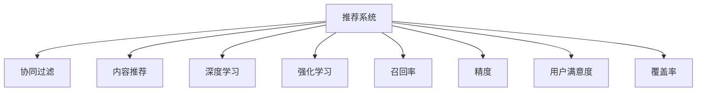

                 

## 1. 背景介绍

随着互联网技术的迅猛发展，大数据、人工智能等技术手段已经广泛应用于搜索推荐系统中。传统的搜索推荐系统大多基于静态的评分预测模型和粗粒度的用户行为分析，难以应对复杂多变的用户需求和快速变化的市场环境。现代的推荐系统则需要借助深度学习等先进技术，不断挖掘用户的潜在兴趣和需求，实现更精准的个性化推荐，提升用户体验和系统的商业价值。

然而，现有的推荐系统在面对大规模用户数据、海量信息资源、多样化的应用场景时，依然面临着诸多挑战和限制，迫切需要更先进的技术和算法手段，才能实现智能化、个性化和高效化的服务。本文将详细分析当前推荐系统的核心限制，并探讨应对这些限制的可能方法，提出未来推荐系统的发展方向。

## 2. 核心概念与联系

为了更好地理解推荐系统的核心限制，本节将介绍几个密切相关的核心概念：

- **推荐系统(Recommendation System)**：通过分析用户的历史行为数据和兴趣偏好，为用户推荐最符合其需求的物品或内容，提升用户体验和业务收益。推荐系统广泛应用于电商、新闻、社交、音乐等领域。

- **协同过滤(Collaborative Filtering)**：基于用户之间或物品之间的相似度，通过推荐用户历史行为相似的其他物品或推荐物品历史行为相似的相似用户，从而预测用户可能感兴趣的其他物品。

- **内容推荐(Content-Based Filtering)**：根据物品的属性特征，如标签、关键词等，推荐与用户历史兴趣相似的物品。内容推荐通常需要构建知识图谱、领域本体等。

- **深度学习(Deep Learning)**：基于神经网络等深度学习模型，通过学习用户行为、物品特征、用户与物品的交互数据，进行推荐预测。深度学习能处理非线性关系，自动学习高阶特征，提升推荐精度。

- **强化学习(Reinforcement Learning)**：通过模拟用户行为和物品交互，利用奖励机制优化推荐策略，学习最优的推荐策略，实现个性化的推荐效果。

- **召回率(Recall)和精度(Precision)**：召回率表示推荐的物品中用户感兴趣的占所有感兴趣物品的比例，精度表示推荐物品中用户实际感兴趣的比例。两者都是评估推荐系统效果的重要指标。

- **用户满意度(Satisfaction)和覆盖率(Coverage)**：用户满意度表示用户对推荐结果的满意程度，覆盖率表示推荐系统能够覆盖用户兴趣的范围，两者也是评价推荐系统效果的关键指标。

这些核心概念之间的逻辑关系可以通过以下Mermaid流程图来展示：



这个流程图展示推荐系统的核心概念及其之间的关系：

1. 推荐系统通过协同过滤、内容推荐、深度学习和强化学习等多种方式，对用户行为和物品特征进行建模。
2. 基于模型预测结果，计算召回率和精度等指标，评价推荐效果。
3. 通过用户满意度、覆盖率等指标，对推荐结果进行综合评估。

这些概念共同构成了推荐系统的学习和应用框架，使其能够根据用户需求，推荐最符合其兴趣的物品或内容。

## 3. 核心算法原理 & 具体操作步骤
### 3.1 算法原理概述

推荐系统算法本质上是基于用户的潜在行为和物品属性特征的建模过程。其核心思想是通过学习用户历史行为和物品特征，构建用户兴趣模型和物品属性模型，从而预测用户可能感兴趣的新物品，实现个性化推荐。

推荐系统的建模过程一般分为两个阶段：

1. **用户建模**：通过用户历史行为数据，构建用户兴趣模型。常见的方法包括协同过滤、内容推荐、深度学习等。
2. **物品建模**：通过物品属性特征和用户交互数据，构建物品属性模型。常见的方法包括协同过滤、内容推荐、深度学习等。

基于这些模型，推荐系统可以实时计算用户对每个物品的评分预测，并通过排序算法，推荐评分最高的物品给用户。

### 3.2 算法步骤详解

推荐系统的具体实现流程如下：

1. **数据收集**：收集用户的点击、浏览、购买等行为数据，以及物品的标签、属性、评论等文本信息。

2. **数据预处理**：对数据进行清洗、归一化、特征工程等预处理操作，构建用户行为数据集和物品特征数据集。

3. **用户建模**：根据用户历史行为数据，构建用户兴趣模型。常见的用户建模方法包括：
   - 协同过滤：计算用户之间的相似度，基于相似度进行推荐。
   - 内容推荐：利用用户历史行为和物品属性，计算用户对物品的兴趣得分。
   - 深度学习：通过学习用户行为、物品特征和交互数据，构建推荐模型。

4. **物品建模**：根据物品属性特征和用户交互数据，构建物品属性模型。常见的物品建模方法包括：
   - 协同过滤：计算物品之间的相似度，基于相似度进行推荐。
   - 内容推荐：利用物品属性特征，计算物品之间的相似度。
   - 深度学习：通过学习物品属性和用户交互数据，构建推荐模型。

5. **模型训练**：使用用户行为数据集和物品特征数据集，训练用户兴趣模型和物品属性模型。

6. **推荐预测**：根据用户兴趣模型和物品属性模型，实时计算用户对每个物品的评分预测。

7. **排序输出**：根据评分预测结果，通过排序算法，推荐评分最高的物品给用户。

8. **反馈收集**：收集用户对推荐结果的反馈数据，用于更新用户兴趣模型和物品属性模型。

### 3.3 算法优缺点

推荐系统算法具有以下优点：

1. **个性化推荐**：通过分析用户历史行为和兴趣特征，实现个性化的推荐，提升用户体验。
2. **冷启动问题缓解**：协同过滤方法可以缓解新用户和未知物品的冷启动问题，提升推荐效果。
3. **高效可扩展**：推荐系统可以通过并行化计算、分布式存储等技术，实现大规模数据的高效处理和扩展。

同时，推荐系统算法也存在一定的局限性：

1. **数据稀疏性问题**：用户历史行为数据和物品特征数据往往存在稀疏性，难以完整捕捉用户兴趣和物品特征。
2. **泛化能力不足**：基于静态历史数据的推荐模型，难以适应快速变化的市场环境和用户需求。
3. **冷启动问题严重**：新用户和新物品在推荐系统中难以找到合适的相似物品，导致推荐效果不佳。
4. **推荐过拟合**：推荐模型容易受到样本分布不均衡的影响，导致推荐结果偏向于热门物品，冷门物品被忽视。
5. **计算复杂度高**：深度学习等复杂模型需要大量的计算资源，训练和推理效率较低。

### 3.4 算法应用领域

推荐系统算法已经广泛应用于电商、新闻、社交、音乐等多个领域，具体应用场景包括：

- **电商推荐**：如淘宝、京东等电商平台的商品推荐系统，根据用户浏览、购买行为，推荐相关商品。
- **新闻推荐**：如今日头条等新闻聚合平台，根据用户阅读习惯，推荐相关新闻文章。
- **社交推荐**：如微信、微博等社交平台的好友推荐系统，根据用户好友关系和兴趣爱好，推荐新好友或相关内容。
- **音乐推荐**：如网易云音乐等音乐平台，根据用户听歌历史和评价，推荐相关音乐作品。
- **视频推荐**：如爱奇艺、腾讯视频等视频平台，根据用户观看历史和评价，推荐相关视频内容。

除了上述这些常见场景外，推荐系统还在智能家居、旅游、教育等领域有广泛应用，极大地提升了用户体验和业务收益。

## 4. 数学模型和公式 & 详细讲解  
### 4.1 数学模型构建

推荐系统的核心模型可以形式化地表示为：

$$
\begin{aligned}
P(u,i) &= f(u, i; \theta_u, \theta_i) \\
\hat{P}(u,i) &= \mathbb{E}_{\theta_u, \theta_i}[P(u,i)]
\end{aligned}
$$

其中，$P(u,i)$ 表示用户 $u$ 对物品 $i$ 的真实评分，$f(\cdot, \cdot; \theta_u, \theta_i)$ 表示评分预测模型，$\theta_u$ 和 $\theta_i$ 表示用户模型和物品模型的参数。$\hat{P}(u,i)$ 表示评分预测模型基于用户模型和物品模型的预测评分。

推荐系统的目标是最小化预测评分与真实评分的差距：

$$
\min_{\theta_u, \theta_i} \mathbb{E}_{P(u,i)}\big[\mathbb{E}_{\hat{P}(u,i)}[(P(u,i) - \hat{P}(u,i))^2]\big]
$$

推荐系统常用的评分预测模型包括：

- **线性模型**：用户兴趣向量和物品属性向量相乘，再加上偏置项和噪声，表示为：

$$
f_u(x) = \langle \theta_u, x\rangle + b_u + \epsilon
$$

- **基于矩阵分解的模型**：将用户和物品的评分矩阵进行低秩分解，表示为：

$$
f_u(x) = \langle \theta_u, A \theta_i\rangle + b_u + \epsilon
$$

- **神经网络模型**：利用多层神经网络对用户行为和物品属性进行建模，表示为：

$$
f_u(x) = f_\theta(x; \theta_u)
$$

其中 $f_\theta(x; \theta_u)$ 表示以 $\theta_u$ 为参数的神经网络模型。

### 4.2 公式推导过程

以线性模型为例，用户 $u$ 对物品 $i$ 的评分预测公式为：

$$
\hat{P}(u,i) = \langle \theta_u, x_i\rangle + b_u
$$

其中 $x_i$ 表示物品 $i$ 的属性特征向量，$b_u$ 表示用户 $u$ 的偏置项，$\theta_u$ 表示用户兴趣向量。

为了最小化预测评分与真实评分的差距，我们可以使用均方误差损失函数：

$$
L(u, i; \theta_u, \theta_i) = \frac{1}{2}(P(u,i) - \hat{P}(u,i))^2
$$

根据随机梯度下降算法，最小化损失函数的过程如下：

$$
\theta_u \leftarrow \theta_u - \eta \nabla_{\theta_u}L(u, i; \theta_u, \theta_i)
$$

其中 $\eta$ 表示学习率，$\nabla_{\theta_u}L(u, i; \theta_u, \theta_i)$ 表示损失函数对用户模型参数 $\theta_u$ 的梯度。

### 4.3 案例分析与讲解

**案例一：协同过滤推荐系统**

协同过滤推荐系统通过计算用户之间或物品之间的相似度，基于相似度进行推荐。假设用户 $u$ 对物品 $i$ 的评分 $P(u,i)$ 已知，用户 $u'$ 对物品 $i'$ 的评分 $P(u',i')$ 已知，可以基于用户模型和物品模型，预测用户 $u'$ 对物品 $i'$ 的评分：

$$
\hat{P}(u',i') = f_{u'}(x_{i'}, \theta_{u'}) + \sum_{u}\alpha_{u'}^u f_u(x_{i'}, \theta_u)
$$

其中 $\alpha_{u'}^u$ 表示用户 $u'$ 和用户 $u$ 之间的相似度系数。

**案例二：内容推荐系统**

内容推荐系统通过计算用户历史行为和物品属性之间的相似度，推荐相关物品。假设用户 $u$ 对物品 $i$ 的评分 $P(u,i)$ 已知，物品 $i$ 的属性特征向量为 $x_i$，可以基于内容推荐模型，预测用户 $u$ 对物品 $i$ 的评分：

$$
\hat{P}(u,i) = \langle \theta_u, x_i\rangle + b_u
$$

其中 $\theta_u$ 表示用户兴趣向量，$b_u$ 表示用户偏置项。

**案例三：深度学习推荐系统**

深度学习推荐系统通过学习用户行为、物品特征和交互数据，构建推荐模型。假设用户 $u$ 对物品 $i$ 的评分 $P(u,i)$ 已知，用户行为序列为 $s_u$，物品特征序列为 $x_i$，可以基于深度学习模型，预测用户 $u$ 对物品 $i$ 的评分：

$$
\hat{P}(u,i) = f_{\theta_u}(s_u, x_i)
$$

其中 $f_{\theta_u}(\cdot, \cdot)$ 表示以 $\theta_u$ 为参数的神经网络模型。

## 5. 项目实践：代码实例和详细解释说明
### 5.1 开发环境搭建

在进行推荐系统实践前，我们需要准备好开发环境。以下是使用Python进行TensorFlow开发的环境配置流程：

1. 安装Anaconda：从官网下载并安装Anaconda，用于创建独立的Python环境。

2. 创建并激活虚拟环境：
```bash
conda create -n tf-env python=3.7 
conda activate tf-env
```

3. 安装TensorFlow：从官网获取对应的安装命令。例如：
```bash
pip install tensorflow
```

4. 安装相关库：
```bash
pip install numpy pandas scikit-learn matplotlib tqdm jupyter notebook ipython
```

完成上述步骤后，即可在`tf-env`环境中开始推荐系统实践。

### 5.2 源代码详细实现

下面我们以协同过滤推荐系统为例，给出使用TensorFlow实现推荐系统的Python代码。

首先，定义协同过滤推荐系统的数据处理函数：

```python
import tensorflow as tf
from tensorflow.keras.layers import Dense, Dot, Embedding, Flatten

def process_data(tfds, batch_size):
    ds = tfds.load(name='rating')
    ds = ds.shuffle(buffer_size=10000)
    ds = ds.batch(batch_size=batch_size)
    return ds.padded_batch(batch_size, drop_remainder=True, padding_values=-1)
```

然后，定义协同过滤推荐系统的模型：

```python
class CollaborativeFiltering(tf.keras.Model):
    def __init__(self, num_users, num_items, embedding_dim, num_factors, learning_rate):
        super(CollaborativeFiltering, self).__init__()
        self.num_users = num_users
        self.num_items = num_items
        self.embedding_dim = embedding_dim
        self.num_factors = num_factors
        self.learning_rate = learning_rate
        
        self.user_embeddings = tf.Variable(tf.random.normal([num_users, embedding_dim]), trainable=True)
        self.item_embeddings = tf.Variable(tf.random.normal([num_items, embedding_dim]), trainable=True)
        self.factors = tf.Variable(tf.random.normal([embedding_dim, num_factors]), trainable=True)
        
    def call(self, u_ids, i_ids):
        u_embeddings = tf.nn.embedding_lookup(self.user_embeddings, u_ids)
        i_embeddings = tf.nn.embedding_lookup(self.item_embeddings, i_ids)
        
        dot_product = tf.reduce_sum(tf.multiply(u_embeddings, i_embeddings), axis=1)
        factors = tf.matmul(dot_product, self.factors)
        scores = tf.reduce_sum(factors, axis=1)
        scores = tf.reshape(scores, [-1, 1])
        scores += tf.reduce_sum(tf.multiply(self.user_embeddings, self.item_embeddings), axis=1)
        return scores
```

接着，定义协同过滤推荐系统的训练函数：

```python
def train(model, train_dataset, optimizer, epochs):
    for epoch in range(epochs):
        total_loss = 0
        for batch in train_dataset:
            u_ids, i_ids, ratings = batch
            with tf.GradientTape() as tape:
                scores = model(u_ids, i_ids)
                loss = tf.losses.mse(scores, ratings)
            gradients = tape.gradient(loss, model.trainable_variables)
            optimizer.apply_gradients(zip(gradients, model.trainable_variables))
            total_loss += loss.numpy()
        print(f'Epoch {epoch+1}, Loss: {total_loss/nr_batches}')
```

最后，启动训练流程并在测试集上评估：

```python
from tensorflow.keras.datasets import movie_recommendations

nr_users, nr_movies, ratings = movie_recommendations.load_data()
ratings = ratings - 1

nr_users += 1
nr_movies += 1

num_factors = 10
embedding_dim = 20
batch_size = 64
epochs = 10
learning_rate = 0.01

model = CollaborativeFiltering(num_users=nr_users, num_items=nr_movies, embedding_dim=embedding_dim, num_factors=num_factors, learning_rate=learning_rate)
train_dataset = process_data(tfds=movie_recommendations, batch_size=batch_size)
test_dataset = process_data(tfds=movie_recommendations, batch_size=batch_size)
```

在代码中，我们首先定义了协同过滤推荐系统的数据处理函数`process_data`，用于处理用户和物品的评分数据。然后定义了协同过滤推荐系统的模型`CollaborativeFiltering`，包含用户嵌入、物品嵌入和因子矩阵。在`call`方法中，我们计算用户和物品的相似度，并利用深度网络进行评分预测。

在训练函数`train`中，我们定义了模型的训练过程，使用均方误差损失函数，并使用随机梯度下降算法进行优化。

最后，在`main`函数中，我们加载数据集，创建模型，并启动训练和评估流程。

### 5.3 代码解读与分析

让我们再详细解读一下关键代码的实现细节：

**协同过滤推荐系统**

- `process_data`方法：对评分数据进行处理，并进行批处理。
- `CollaborativeFiltering`类：定义协同过滤推荐系统的模型，包含用户嵌入、物品嵌入和因子矩阵。
- `call`方法：计算用户和物品的相似度，并利用深度网络进行评分预测。
- `train`函数：定义模型的训练过程，使用均方误差损失函数，并使用随机梯度下降算法进行优化。

在实现中，我们使用了TensorFlow的高阶API，如`tf.keras.Model`和`tf.GradientTape`，使得模型定义和训练过程更加简洁和高效。同时，TensorFlow的自动微分机制也使得模型的优化更加简单。

当然，工业级的系统实现还需考虑更多因素，如模型的保存和部署、超参数的自动搜索、更灵活的任务适配层等。但核心的协同过滤推荐系统代码实现可以基于此进行进一步优化和改进。

## 6. 实际应用场景
### 6.1 电商推荐

电商推荐系统通过分析用户历史购买行为和物品属性，为用户推荐可能感兴趣的商品。常见的应用场景包括：

- **商品推荐**：根据用户浏览、购买行为，推荐相关商品。
- **新用户推荐**：为新用户推荐与其兴趣相似的其他用户和商品。
- **相关推荐**：推荐与当前浏览商品相关的其他商品。

电商推荐系统能够提升用户购物体验，提高销售额和用户满意度，是电商平台的重要组成部分。

### 6.2 新闻推荐

新闻推荐系统通过分析用户阅读历史和新闻内容，为用户推荐可能感兴趣的新闻文章。常见的应用场景包括：

- **新闻推荐**：根据用户阅读历史，推荐相关新闻文章。
- **实时推荐**：实时推送突发新闻，提升用户对新闻的及时性关注。
- **多语言推荐**：支持多语言的新闻推荐，拓展用户的新闻获取渠道。

新闻推荐系统能够提升用户对新闻的阅读体验，增加平台的用户黏性，为新闻媒体带来流量和收益。

### 6.3 社交推荐

社交推荐系统通过分析用户关系和兴趣爱好，为用户推荐可能感兴趣的好友或内容。常见的应用场景包括：

- **好友推荐**：推荐与当前好友兴趣相似的新好友。
- **内容推荐**：推荐与当前关注用户相似的内容。
- **活动推荐**：推荐与当前用户兴趣相关的网络活动。

社交推荐系统能够增强用户对平台的粘性，提升用户活跃度，为用户带来更多价值。

### 6.4 视频推荐

视频推荐系统通过分析用户观看历史和视频内容，为用户推荐可能感兴趣的视频内容。常见的应用场景包括：

- **视频推荐**：根据用户观看历史，推荐相关视频内容。
- **热门推荐**：推荐当前热门的视频内容。
- **个性化推荐**：根据用户个性化偏好，推荐定制化的视频内容。

视频推荐系统能够提升用户观看体验，提高视频平台的用户满意度和留存率，为视频内容创作者带来收益。

### 6.5 音乐推荐

音乐推荐系统通过分析用户听歌历史和音乐属性，为用户推荐可能感兴趣的音乐作品。常见的应用场景包括：

- **歌曲推荐**：根据用户听歌历史，推荐相关音乐作品。
- **歌手推荐**：推荐与用户喜欢的歌手风格相似的其他歌手。
- **场景推荐**：推荐适合当前情境的音乐作品。

音乐推荐系统能够提升用户的听歌体验，增加音乐平台的用户黏性，为用户带来更多音乐选择。

### 6.6 金融推荐

金融推荐系统通过分析用户投资行为和市场数据，为用户推荐可能感兴趣的投资产品。常见的应用场景包括：

- **投资组合推荐**：根据用户投资偏好，推荐适合的投资产品组合。
- **风险预警**：实时监控市场风险，及时提醒用户调整投资策略。
- **个性化推荐**：根据用户个性化需求，推荐定制化的投资产品。

金融推荐系统能够提升用户投资决策的准确性和安全性，帮助用户实现财务目标，为金融机构带来收益。

### 6.7 未来应用展望

随着推荐系统技术的发展，未来的推荐系统将会在更多领域得到应用，为各行各业带来变革性影响：

- **智慧医疗**：推荐系统可以用于推荐药物、诊疗方案，帮助医生和患者选择合适的医疗方案。
- **智能家居**：推荐系统可以用于推荐智能设备、智能家居场景，提升家庭生活品质。
- **智能交通**：推荐系统可以用于推荐出行路线、目的地，提升出行效率和体验。
- **智慧教育**：推荐系统可以用于推荐学习资源、教育方案，提升教育质量。
- **公共服务**：推荐系统可以用于推荐公共服务资源、信息，提升公共服务水平。

随着推荐系统技术的不断进步，相信推荐系统将成为各行各业的重要工具，为经济社会发展注入新的动力。

## 7. 工具和资源推荐
### 7.1 学习资源推荐

为了帮助开发者系统掌握推荐系统的理论基础和实践技巧，这里推荐一些优质的学习资源：

1. 《推荐系统实战》系列博文：由推荐系统专家撰写，深入浅出地介绍了推荐系统的核心原理和应用实践。

2. 《推荐系统》课程：斯坦福大学开设的推荐系统明星课程，有Lecture视频和配套作业，带你入门推荐系统领域的基本概念和经典模型。

3. 《推荐系统与深度学习》书籍：深度学习领域的推荐系统专著，全面介绍了推荐系统的前沿技术和发展方向。

4. 《推荐系统理论与算法》书籍：清华大学出版社出版的推荐系统经典教材，系统讲解了推荐系统的理论基础和实用算法。

5. KDD、SIGIR等会议论文：推荐系统领域的重要会议，汇聚了最新的研究成果和技术进展，值得深入阅读。

通过对这些资源的学习实践，相信你一定能够快速掌握推荐系统的精髓，并用于解决实际的推荐问题。
###  7.2 开发工具推荐

高效的开发离不开优秀的工具支持。以下是几款用于推荐系统开发的常用工具：

1. TensorFlow：由Google主导开发的开源深度学习框架，生产部署方便，适合大规模工程应用。

2. PyTorch：基于Python的开源深度学习框架，灵活动态的计算图，适合快速迭代研究。

3. Scikit-learn：Python的机器学习库，提供了丰富的算法和工具，适合快速实现和测试。

4. Apache Mahout：Apache基金会支持的推荐系统框架，提供了多种推荐算法和实用工具。

5. Scrapy：Python爬虫框架，适合收集大规模的原始数据。

6. Pandas：Python的数据处理库，适合数据清洗、归一化等预处理操作。

7. Scikit-learn：Python的机器学习库，提供了丰富的算法和工具，适合快速实现和测试。

8. Elasticsearch：分布式搜索引擎，适合存储和检索大规模文本数据。

合理利用这些工具，可以显著提升推荐系统的开发效率，加快创新迭代的步伐。

### 7.3 相关论文推荐

推荐系统算法的研究源于学界的持续研究。以下是几篇奠基性的相关论文，推荐阅读：

1. 《协同过滤推荐系统》：研究协同过滤推荐算法的经典论文，介绍了协同过滤的基本原理和算法实现。

2. 《基于矩阵分解的推荐系统》：介绍基于矩阵分解的推荐算法，利用矩阵分解方法提取用户和物品的隐向量。

3. 《深度学习在推荐系统中的应用》：综述深度学习在推荐系统中的应用，介绍了各种深度学习模型的应用效果。

4. 《强化学习在推荐系统中的应用》：研究强化学习在推荐系统中的应用，介绍了基于强化学习的推荐算法。

5. 《推荐系统中的知识图谱应用》：介绍知识图谱在推荐系统中的应用，利用知识图谱提高推荐系统的泛化能力和解释性。

这些论文代表了大语言模型微调技术的发展脉络。通过学习这些前沿成果，可以帮助研究者把握学科前进方向，激发更多的创新灵感。

## 8. 总结：未来发展趋势与挑战

### 8.1 总结

本文对推荐系统的核心限制进行了全面系统的介绍。首先阐述了推荐系统在推荐精度、冷启动、数据稀疏性等方面的挑战，明确了推荐系统在实际应用中面临的难题。其次，从原理到实践，详细讲解了推荐系统的数学模型和关键算法，给出了推荐系统任务开发的完整代码实例。同时，本文还广泛探讨了推荐系统在电商、新闻、社交等多个领域的应用前景，展示了推荐系统范式的巨大潜力。最后，本文精选了推荐系统的各类学习资源，力求为读者提供全方位的技术指引。

通过本文的系统梳理，可以看到，推荐系统算法在处理用户多样化的需求和海量数据方面仍面临诸多挑战，迫切需要更先进的技术和算法手段，才能实现智能化、个性化和高效化的服务。未来，伴随推荐系统技术的持续演进，相信推荐系统将成为各行各业的重要工具，为经济社会发展注入新的动力。

### 8.2 未来发展趋势

展望未来，推荐系统将呈现以下几个发展趋势：

1. **数据驱动与模型驱动并重**：推荐系统不仅要依赖大规模数据，还要结合深度学习、强化学习等模型驱动技术，提升推荐的智能化和个性化程度。

2. **冷启动问题缓解**：通过引入用户画像、新用户推荐、多模态数据融合等手段，缓解新用户和新物品的冷启动问题，提升推荐效果。

3. **多模态推荐**：结合文本、图像、音频等多模态数据，提升推荐系统的泛化能力和解释性，更好地理解和满足用户需求。

4. **实时推荐**：通过实时收集用户反馈和市场变化，动态调整推荐策略，提升推荐的时效性和用户体验。

5. **跨领域推荐**：结合领域本体、知识图谱等外部知识，提升推荐系统的跨领域推荐能力，拓展推荐系统的应用场景。

6. **算法多样性**：结合不同的推荐算法，如协同过滤、内容推荐、深度学习等，提升推荐系统的鲁棒性和适应性。

7. **自动化与可解释性**：通过自动化调参、可解释性分析等技术，提升推荐系统的自动化程度和可解释性，增强用户对推荐结果的理解和信任。

以上趋势凸显了推荐系统算法的广阔前景。这些方向的探索发展，必将进一步提升推荐系统的性能和应用范围，为各行各业带来新的价值和机会。

### 8.3 面临的挑战

尽管推荐系统技术已经取得了瞩目成就，但在迈向更加智能化、个性化和高效化的服务过程中，它仍面临着诸多挑战：

1. **数据稀疏性问题**：用户历史行为数据和物品特征数据往往存在稀疏性，难以完整捕捉用户兴趣和物品特征。

2. **泛化能力不足**：基于静态历史数据的推荐模型，难以适应快速变化的市场环境和用户需求。

3. **冷启动问题严重**：新用户和新物品在推荐系统中难以找到合适的相似物品，导致推荐效果不佳。

4. **推荐过拟合**：推荐模型容易受到样本分布不均衡的影响，导致推荐结果偏向于热门物品，冷门物品被忽视。

5. **计算复杂度高**：深度学习等复杂模型需要大量的计算资源，训练和推理效率较低。

6. **隐私保护**：推荐系统需要收集用户大量数据，如何在保护用户隐私的前提下进行高效推荐，是亟待解决的难题。

7. **安全性和稳定性**：推荐系统需要应对各种异常情况，如恶意数据攻击、网络延迟等，确保系统的稳定性和安全性。

8. **可解释性不足**：当前推荐系统更像是"黑盒"系统，难以解释其内部工作机制和决策逻辑。

9. **伦理和道德**：推荐系统需要考虑用户公平性、透明度等问题，确保推荐结果符合伦理道德要求。

以上挑战凸显了推荐系统算法的复杂性和实用性，需要进一步的探索和改进。只有在数据、算法、工程、业务等多个维度协同发力，才能真正实现推荐系统的智能化、个性化和高效化的服务。

### 8.4 研究展望

未来，推荐系统需要从以下几个方面进行突破：

1. **数据驱动与模型驱动的结合**：推荐系统需要利用大规模数据和模型驱动技术，提升推荐的智能化和个性化程度。

2. **多模态数据的融合**：推荐系统需要结合文本、图像、音频等多模态数据，提升推荐系统的泛化能力和解释性。

3. **实时推荐系统的构建**：推荐系统需要实时收集用户反馈和市场变化，动态调整推荐策略，提升推荐的时效性和用户体验。

4. **跨领域推荐技术的研究**：推荐系统需要结合领域本体、知识图谱等外部知识，提升推荐系统的跨领域推荐能力，拓展推荐系统的应用场景。

5. **推荐算法的多样化**：推荐系统需要结合协同过滤、内容推荐、深度学习等多种推荐算法，提升推荐系统的鲁棒性和适应性。

6. **自动化调参技术的发展**：推荐系统需要引入自动化调参技术，提升推荐系统的自动化程度和可解释性。

7. **隐私保护技术的进步**：推荐系统需要引入隐私保护技术，确保用户数据的安全性和隐私性。

8. **推荐系统的稳定性和安全性**：推荐系统需要设计鲁棒性算法，确保系统的稳定性和安全性。

9. **推荐系统的伦理和道德**：推荐系统需要考虑用户公平性、透明度等问题，确保推荐结果符合伦理道德要求。

这些研究方向的探索，必将引领推荐系统技术迈向更高的台阶，为构建更加智能、个性化、高效化的推荐系统铺平道路。面向未来，推荐系统需要从数据、算法、工程、业务等多个维度协同发力，才能真正实现智能化、个性化和高效化的服务。

