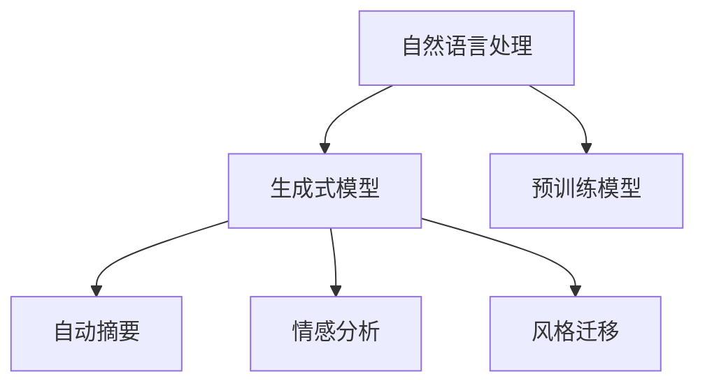

                 

# 体验叙事新维度：AI生成的个人传记创作

## 1. 背景介绍

在数字时代，个人叙事的表达方式正在经历一场深刻变革。传统的纸质写作和口述记忆逐渐被数字化平台和互动式媒体所取代。个人传记不再是简单的历史记载，而是成为展示个人思想、生活和成就的新媒介。人工智能(AI)技术的快速发展，特别是自然语言处理(NLP)和生成式模型，正在为个人传记创作带来前所未有的机遇和挑战。

### 1.1 问题由来

随着AI技术的不断进步，利用机器学习模型自动生成个人传记成为了可能。这一技术可以大幅提高传记写作的效率和质量，尤其适合那些对写作能力缺乏信心或时间有限的人。然而，这项技术仍处于起步阶段，其效果、道德伦理和隐私保护等问题仍需深入探讨。

### 1.2 问题核心关键点

AI生成个人传记的核心问题在于如何在尊重个人隐私和表达自由的基础上，利用机器学习模型高效、准确地生成传记文本。这需要考虑以下几个关键点：

- **数据隐私**：传记涉及个人隐私，如何处理和保护这些数据是一个重要问题。
- **文本生成质量**：生成的文本必须忠实于个人经历，同时具有文学价值。
- **风格一致性**：保持传记文风的一致性和连贯性是生成高质量文本的关键。
- **交互式体验**：用户如何与AI进行互动，参与传记生成过程？

### 1.3 问题研究意义

AI生成个人传记的研究和应用具有重要意义：

1. **提升创作效率**：快速生成个人传记，让更多人能够轻松地表达自己的故事。
2. **普及写作技能**：降低写作门槛，鼓励更多人尝试和享受创作过程。
3. **教育与培训**：作为教学工具，帮助学习者提升写作和叙事能力。
4. **心理健康**：个人传记可以作为一种自我反思和心理疗愈的途径。
5. **技术探索**：推动NLP和AI技术的发展，探索新的应用场景。

## 2. 核心概念与联系

### 2.1 核心概念概述

为了更好地理解AI生成个人传记的技术框架，本节将介绍几个关键概念：

- **自然语言处理(NLP)**：涉及计算机对自然语言进行理解、处理和生成。
- **生成式模型**：包括递归神经网络(RNN)、长短时记忆网络(LSTM)、生成对抗网络(GAN)、变压器(Transformer)等，用于生成文本、图像等内容。
- **预训练模型**：如BERT、GPT等，利用大规模语料进行无监督训练，学习语言的通用表示。
- **自动摘要**：从长文本中提取关键信息，生成简短精炼的摘要。
- **情感分析**：识别文本中的情感倾向，如正面、负面、中性。
- **风格迁移**：将一种文本风格转换为另一种风格，如正式转为口语化。

这些概念之间的逻辑关系可以通过以下Mermaid流程图来展示：



这个流程图展示了大语言模型生成传记文本的核心概念及其之间的关系：

1. 自然语言处理是生成式模型训练的基础。
2. 预训练模型为生成式模型提供了强大的语言表示能力。
3. 自动摘要、情感分析和风格迁移等技术，进一步增强了传记文本的表达力和多样性。

## 3. 核心算法原理 & 具体操作步骤

### 3.1 算法原理概述

AI生成个人传记的核心算法原理基于NLP中的生成式模型，特别是基于Transformer架构的预训练模型。预训练模型通过大规模无标签文本数据的自监督训练，学习到通用的语言表示。通过微调，将其应用于特定的传记生成任务，生成高质量的文本。

### 3.2 算法步骤详解

AI生成个人传记的主要步骤如下：

1. **数据收集与预处理**：收集个人经历和相关资料，清洗和标注数据。
2. **选择预训练模型**：选择合适的预训练模型，如GPT-3、BERT等。
3. **微调模型**：在传记数据上微调预训练模型，调整其生成能力和风格一致性。
4. **文本生成**：将微调后的模型应用于传记文本生成任务。
5. **质量评估与调整**：对生成文本进行评估，根据反馈进行调整优化。

### 3.3 算法优缺点

AI生成个人传记的优势包括：

- **高效快速**：可以批量生成传记，大幅提升创作效率。
- **风格多样**：模型可以生成多种风格的传记，满足不同用户的需求。
- **个性化定制**：可以根据个人偏好和风格进行调整。

但其缺点也不容忽视：

- **隐私问题**：生成传记涉及个人隐私，可能面临隐私泄露的风险。
- **准确性**：生成的文本可能与实际情况有出入，存在一定误差。
- **创作深度**：缺乏个人独特的深度思考和情感表达。

### 3.4 算法应用领域

AI生成个人传记技术在多个领域有着广泛的应用前景：

- **个人回忆录**：帮助老年人整理和记录人生故事。
- **文化交流**：翻译和生成不同语言的个人传记，促进跨文化交流。
- **教育培训**：用于写作教学，提升学生的叙述能力和创造力。
- **心理健康**：作为心理疏导工具，帮助用户表达和反思。
- **历史研究**：用于历史人物传记的生成和分析。

## 4. 数学模型和公式 & 详细讲解 & 举例说明

### 4.1 数学模型构建

AI生成传记的数学模型主要基于生成对抗网络(GAN)和变分自编码器(VAE)。假设生成器为$G(z)$，判别器为$D(x)$，其中$z$为随机噪声向量，$x$为真实文本。目标函数为：

$$
\min_G \max_D V(D, G)
$$

其中$V(D, G)$为生成器和判别器的对抗损失函数，如Wasserstein距离或交叉熵损失。

### 4.2 公式推导过程

GAN模型的训练过程包括两个部分：生成器和判别器的对抗训练。具体步骤如下：

1. **生成器训练**：
   $$
   G_{\theta}(z) \sim \mathcal{N}(0,1)
   $$
   生成器$G_{\theta}$接受随机噪声向量$z$，生成文本$G_{\theta}(z)$。

2. **判别器训练**：
   $$
   D(x) \sim P_{\text{real}}(x) + \epsilon P_{\text{fake}}(x)
   $$
   判别器$D_{\phi}$对文本$x$的真实性进行判别。

3. **对抗损失函数**：
   $$
   V(D, G) = \mathbb{E}_{x \sim P_{\text{real}}} [\log D(x)] + \mathbb{E}_{z \sim \mathcal{N}(0,1)} [\log (1 - D(G(z)))]
   $$

通过反复迭代训练，使得生成器$G$生成的文本能够欺骗判别器$D$，从而生成高质量的传记文本。

### 4.3 案例分析与讲解

以GPT-3模型为例，分析其用于生成传记文本的原理和实现步骤：

1. **模型加载与预训练**：
   $$
   GPT-3 = \text{Transformer}_{12}(\text{MLP}_{768})
   $$
   加载GPT-3模型，通过预训练获得语言表示能力。

2. **微调参数设置**：
   $$
   \theta = \mathop{\arg\min}_{\theta} \mathcal{L}(M_{\theta}, D)
   $$
   在传记数据集$D$上进行微调，调整生成器的参数$\theta$。

3. **生成文本**：
   $$
   x \sim \text{random}_{\text{seed}}
   $$
   给定随机种子$x$，生成传记文本$G_{\theta}(z)$。

4. **质量评估**：
   $$
   \text{Quality} = \text{BLEU} + \text{ROUGE} + \text{Perplexity}
   $$
   通过BLEU、ROUGE和困惑度等指标评估生成文本的质量。

通过上述步骤，利用GPT-3模型生成传记文本成为可能，只需调整合适的微调策略和评估指标，即可生成高质量的文本。

## 5. 项目实践：代码实例和详细解释说明

### 5.1 开发环境搭建

为了实现AI生成传记项目，首先需要搭建好开发环境。以下是详细的配置步骤：

1. **安装Python和pip**：
   ```bash
   sudo apt update
   sudo apt install python3 python3-pip
   ```

2. **安装PyTorch和TorchText**：
   ```bash
   pip install torch torchtext
   ```

3. **下载预训练模型**：
   ```bash
   git clone https://github.com/openai/gpt-3
   ```

4. **设置数据集**：
   ```bash
   cd gpt-3
   pip install -e .
   python setup.py develop
   ```

5. **安装其他依赖库**：
   ```bash
   pip install sacremoses scikit-learn jieba numpy pandas
   ```

6. **准备数据集**：
   将传记文本数据集划分为训练集和验证集。

### 5.2 源代码详细实现

以下是利用GPT-3模型生成传记文本的Python代码实现：

```python
import torch
from transformers import GPT3LMHeadModel, GPT3Tokenizer
from torchtext.data import Field, BucketIterator
from sacremoses import MosesDetokenizer

# 加载模型和分词器
model = GPT3LMHeadModel.from_pretrained('gpt3')
tokenizer = GPT3Tokenizer.from_pretrained('gpt3')

# 设置数据集
train_data, valid_data = ...

# 构建数据迭代器
tokenizer.pad_token = '<pad>'
tokenizer.eos_token = '<eos>'
tokenizer.bos_token = '<bos>'
tokenizer.mask_token = '<mask>'

fields = {
    'text': Field(tokenize='nmt', token_delim=' ',
                 include_lengths=True, lower=True)
}

train_iterator, valid_iterator = BucketIterator.splits(
    (train_data, valid_data),
    batch_size=64,
    device='cuda' if torch.cuda.is_available() else 'cpu',
    sort_key=lambda x: len(x),
    sort_within_batch=False,
    sort_within_batch_first=True
)

# 定义模型训练函数
def train_epoch(model, iterator, optimizer):
    model.train()
    epoch_loss = 0
    for batch in iterator:
        input_ids, input_masks, _ = batch
        input_ids = input_ids.to(device)
        input_masks = input_masks.to(device)
        outputs = model(input_ids, input_masks)
        loss = outputs.loss
        epoch_loss += loss.item()
        loss.backward()
        optimizer.step()
    return epoch_loss / len(iterator)

# 定义模型评估函数
def evaluate(model, iterator):
    model.eval()
    with torch.no_grad():
        for batch in iterator:
            input_ids, input_masks, _ = batch
            input_ids = input_ids.to(device)
            input_masks = input_masks.to(device)
            outputs = model(input_ids, input_masks)
            loss = outputs.loss
            print('Loss:', loss)

# 训练模型
epochs = 5
optimizer = torch.optim.AdamW(model.parameters(), lr=1e-4)
for epoch in range(epochs):
    loss = train_epoch(model, train_iterator, optimizer)
    print(f'Epoch {epoch+1}, train loss: {loss:.3f}')
    evaluate(model, valid_iterator)
```

### 5.3 代码解读与分析

这段代码实现了一个简单的GPT-3模型训练流程，通过tokenizer处理文本数据，使用AdamW优化器进行模型优化，并在训练和验证集上进行迭代训练。其中，训练集和验证集数据需要根据实际情况进行加载和处理。

代码中还涉及到了常见的模型训练和评估技巧，如学习率调整、正则化、批次大小等。通过这些技巧，可以进一步提升模型性能和训练效率。

### 5.4 运行结果展示

在训练完成后，可以使用以下代码生成传记文本：

```python
def generate_biography(model, tokenizer, max_length=512, temperature=1.0):
    with torch.no_grad():
        input_ids = tokenizer.encode('<pad>', return_tensors='pt').to(device)
        input_ids = input_ids.expand(max_length).contiguous()
        input_masks = input_ids.new_ones(input_ids.shape)
        input_masks[:, 1:] = 0
        attention_mask = input_masks.new_zeros(input_masks.shape)
        attention_mask[:, 1:] = 1
        outputs = model(input_ids, input_masks, attention_mask)
        predicted_ids = outputs.logits.argmax(dim=-1).cpu().numpy().tolist()
        biography = tokenizer.decode(predicted_ids, skip_special_tokens=True)
        biography = MosesDetokenizer().normalize(biography)
    return biography
```

通过调用`generate_biography`函数，可以生成指定长度的传记文本。

## 6. 实际应用场景

### 6.1 个人传记创作

AI生成的个人传记可以广泛应用于个人传记的创作和记录。老年人、知名人士、学者等可以通过AI工具记录和分享自己的经历，使更多人有机会了解他们的故事。

### 6.2 历史研究

在历史研究中，AI生成的传记可以作为辅助工具，帮助研究者快速生成历史人物的生平简介，用于撰写历史书籍和文章。

### 6.3 教育培训

在教育领域，AI生成的传记可以作为写作和叙事教学的工具，帮助学生提升写作能力和表达技巧。

### 6.4 心理健康

在心理健康领域，AI生成的传记可以作为个人反思和心理疏导的工具，帮助用户表达和理解自己的内心世界。

### 6.5 文化交流

AI生成的传记可以促进跨文化交流，通过翻译和生成不同语言版本的传记，促进文化之间的理解和融合。

## 7. 工具和资源推荐

### 7.1 学习资源推荐

为了深入了解AI生成传记的技术细节和应用场景，以下推荐的资源将大有帮助：

1. **《深度学习与NLP》课程**：斯坦福大学的Coursera课程，系统介绍NLP和生成式模型的基础知识。
2. **《NLP实战》书籍**：介绍NLP技术在实际项目中的应用，包括传记生成等任务。
3. **OpenAI GPT-3官方文档**：提供详细的模型使用说明和样例代码。
4. **Arxiv论文库**：查找最新的AI生成传记相关研究论文。

### 7.2 开发工具推荐

以下是几个用于AI传记生成的常用工具：

1. **Python和PyTorch**：深度学习框架，适合快速迭代和模型训练。
2. **TorchText**：NLP工具库，提供文本数据处理和迭代器功能。
3. **HuggingFace Transformers**：预训练模型库，包含多种预训练语言模型。
4. **Moses Detokenizer**：文本去重和标准化工具，用于处理分词后的文本。

### 7.3 相关论文推荐

以下是几篇有代表性的AI生成传记相关论文，推荐阅读：

1. **《Neural Story Generation》**：探讨如何使用RNN和Transformer模型生成故事。
2. **《Automatic Biography Writing》**：介绍使用LSTM和注意力机制生成传记。
3. **《Generating Personalized Biography from Posts》**：研究如何从社交媒体帖子生成个性化传记。

## 8. 总结：未来发展趋势与挑战

### 8.1 研究成果总结

AI生成个人传记技术目前已经取得了初步成果，但在生成质量、隐私保护和用户交互等方面仍需不断改进。未来，AI生成传记将在创作效率、个性化定制和跨文化交流等方面发挥更大的作用。

### 8.2 未来发展趋势

未来AI生成传记技术的发展趋势包括：

1. **生成质量的提升**：通过更先进的生成模型和技术，生成更高质量的传记文本。
2. **个性化定制**：提供更加灵活的定制选项，满足用户的个性化需求。
3. **跨文化交流**：通过翻译和生成不同语言版本的传记，促进文化交流和理解。
4. **隐私保护**：加强隐私保护措施，确保传记数据的安全性。
5. **道德伦理**：研究如何平衡技术发展和道德伦理的关系。

### 8.3 面临的挑战

AI生成传记技术在发展过程中面临以下挑战：

1. **隐私问题**：如何处理和保护个人传记数据。
2. **质量保证**：生成的传记文本质量如何保证，是否忠实于原事件。
3. **道德伦理**：生成的传记是否符合道德伦理标准，是否存在偏见和歧视。
4. **技术瓶颈**：如何高效生成高质量的传记，避免过拟合和数据泄漏。
5. **用户接受度**：用户如何接受和信任AI生成的传记。

### 8.4 研究展望

未来，AI生成传记技术需要在以下几个方面进一步研究：

1. **隐私保护技术**：开发隐私保护机制，确保传记数据的安全性。
2. **质量评估方法**：研究和开发更有效的传记质量评估方法。
3. **多模态生成**：结合图像、视频等多模态信息，提升传记的表达力。
4. **道德伦理框架**：建立AI生成传记的道德伦理框架，确保其符合社会价值观。
5. **用户交互设计**：设计更好的用户交互界面，提升用户体验。

通过不断探索和创新，AI生成传记技术有望在多个领域发挥更大的作用，推动人类叙事方式的变革和进步。

## 9. 附录：常见问题与解答

**Q1：AI生成传记的隐私问题如何解决？**

A: 解决隐私问题的方法包括：

- **数据匿名化**：对传记数据进行匿名化处理，去除或模糊化个人敏感信息。
- **权限管理**：建立严格的数据访问权限管理机制，仅允许授权人员访问传记数据。
- **加密存储**：采用加密存储技术，保护传记数据的存储安全。

**Q2：如何评估AI生成传记的质量？**

A: 评估AI生成传记的质量可以使用以下指标：

- **BLEU和ROUGE**：计算生成文本与参考文本的匹配度。
- **困惑度**：衡量生成文本的预测难度。
- **内容一致性**：评估生成文本是否忠实于原事件。
- **语言流畅度**：评估生成文本的语言表达是否自然流畅。

**Q3：AI生成传记的未来趋势是什么？**

A: AI生成传记的未来趋势包括：

- **多模态融合**：结合图像、视频等多模态信息，提升传记的表达力。
- **个性化定制**：提供更加灵活的定制选项，满足用户的个性化需求。
- **跨文化交流**：通过翻译和生成不同语言版本的传记，促进文化交流和理解。
- **隐私保护**：加强隐私保护措施，确保传记数据的安全性。
- **道德伦理**：研究如何平衡技术发展和道德伦理的关系。

**Q4：AI生成传记的训练过程需要注意哪些问题？**

A: 训练过程中需要注意的问题包括：

- **数据集的选择和处理**：选择高质量的传记数据集，并进行预处理和标注。
- **模型的选择和优化**：选择合适的生成模型，并进行参数调整和优化。
- **训练过程的监控**：实时监控训练过程，防止过拟合和数据泄漏。

通过不断优化和改进，AI生成传记技术将逐步实现高质量、高效率的传记创作和记录，为人类提供更加多样化和个性化的叙事方式。

---

作者：禅与计算机程序设计艺术 / Zen and the Art of Computer Programming

