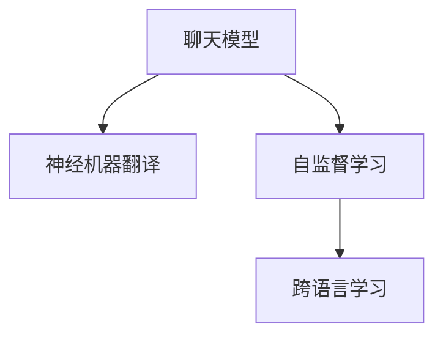

                 

# 使用 Chat Model 实现双语翻译

在当前全球化的背景下，跨语言交流日益频繁。然而，语言差异仍然构成了交流的巨大障碍。为了实现高效的跨语言翻译，传统的统计机器翻译（SMT）已经逐渐被基于深度学习的神经机器翻译（NMT）所取代。而随着语言模型技术的进一步发展，使用Chat Model进行双语翻译成为了可能。本文将详细探讨这一技术的原理、应用及其未来发展方向。

## 1. 背景介绍

### 1.1 问题由来
语言模型的本质是一个概率模型，通过学习大量文本数据，预测特定位置的单词或字符序列。传统的语言模型主要应用于语言建模、自动文本生成等任务。随着深度学习技术的发展，语言模型的能力不断增强，逐渐被应用于翻译任务，实现了从文本到文本的自动翻译。

然而，传统的机器翻译系统主要基于句子的静态表示，难以捕捉上下文和语义的多样性。而聊天模型（Chat Model）则是一种更加动态的语言模型，它不仅可以处理序列到序列的翻译任务，还能够更好地捕捉语境中的细微变化，实现更加流畅自然的交流。

### 1.2 问题核心关键点
使用聊天模型进行双语翻译的核心在于：
- 如何构建一个高效的翻译模型，能够同时处理多种语言之间的转换。
- 如何利用聊天模型的动态特性，捕捉语境中的细微变化，提升翻译质量。
- 如何设计合适的损失函数，确保模型能够优化到特定的翻译任务上。

### 1.3 问题研究意义
使用聊天模型进行双语翻译，对于促进全球化的交流、推动跨语言信息化产业的发展具有重要意义。通过聊天模型，人们可以更自然地进行跨语言对话，打破语言障碍，促进文化交流和信息共享。同时，这也为NLP技术的实际应用提供了新的方向，推动了NLP技术的产业化进程。

## 2. 核心概念与联系

### 2.1 核心概念概述

在使用聊天模型进行双语翻译时，需要重点关注以下核心概念：

- **聊天模型（Chat Model）**：一种基于序列到序列（Seq2Seq）框架的语言模型，能够处理自然语言对话，捕捉语境中的细微变化，生成流畅自然的对话。
- **神经机器翻译（NMT）**：基于神经网络模型的机器翻译方法，能够实现从一种语言到另一种语言的自动翻译。
- **自监督学习（Self-Supervised Learning）**：通过无标签数据进行预训练，学习通用的语言表示，适用于大规模语言模型的训练。
- **跨语言学习（Cross-lingual Learning）**：利用不同语言之间的共性和差异，通过迁移学习的方式，实现跨语言的模型迁移和任务适配。

这些核心概念之间的逻辑关系可以通过以下Mermaid流程图来展示：



这个流程图展示了一个完整的双语翻译过程：首先使用聊天模型处理文本输入，然后使用神经机器翻译模型进行语言的转换，最后通过自监督学习方式进行模型预训练，利用跨语言学习方式进行任务的适配。

## 3. 核心算法原理 & 具体操作步骤
### 3.1 算法原理概述

使用聊天模型进行双语翻译的原理是基于Seq2Seq框架的神经网络模型。Seq2Seq模型由两个部分组成：编码器和解码器。编码器将输入序列转换为固定长度的向量表示，解码器则将该向量转换为输出序列。

在双语翻译任务中，编码器将输入的语言序列转换为向量表示，解码器将该向量转换为目标语言序列。聊天模型的动态特性使得其在处理上下文和语义变化时更加灵活，能够更好地捕捉语境信息，提升翻译质量。

### 3.2 算法步骤详解

使用聊天模型进行双语翻译的具体步骤包括：

1. **数据准备**：收集源语言和目标语言的文本数据，对数据进行预处理，包括分词、去除停用词、标准化等。
2. **模型构建**：搭建Seq2Seq模型框架，包括编码器和解码器的设计。在编码器部分，可以使用RNN、LSTM、GRU等循环神经网络；在解码器部分，可以使用基于注意力机制的Seq2Seq模型，如Transformer。
3. **模型训练**：使用自监督学习方法，如语言模型或掩码语言模型，对模型进行预训练。然后，将预训练模型进行微调，适应具体的翻译任务。
4. **模型评估**：在测试集上进行模型评估，评估指标包括BLEU、ROUGE、METEOR等。
5. **模型部署**：将训练好的模型部署到实际应用中，如API接口或聊天机器人。

### 3.3 算法优缺点

使用聊天模型进行双语翻译的优势包括：
- 动态特性：聊天模型能够更好地捕捉语境中的细微变化，提升翻译质量。
- 流畅自然：聊天模型生成的翻译更加流畅自然，能够更好地模拟人类对话。
- 可扩展性：聊天模型可以应用于多种自然语言处理任务，如问答系统、情感分析等。

然而，使用聊天模型进行双语翻译也存在一些缺点：
- 资源需求高：聊天模型需要大量的训练数据和计算资源，对硬件要求较高。
- 模型复杂：聊天模型的构建和训练过程相对复杂，需要较高的技术门槛。
- 数据依赖：聊天模型的训练效果很大程度上依赖于训练数据的质量和数量，获取高质量标注数据的成本较高。

### 3.4 算法应用领域

聊天模型在多个领域都有广泛的应用，如：

- 翻译：将一种语言翻译成另一种语言，适用于国际会议、跨语言通信等场景。
- 问答系统：回答用户提出的问题，适用于客服、智能助手等场景。
- 情感分析：分析文本中的情感倾向，适用于社交媒体分析、舆情监测等场景。
- 摘要生成：生成文本的简短摘要，适用于新闻、论文等长文本的处理。

## 4. 数学模型和公式 & 详细讲解 & 举例说明

### 4.1 数学模型构建

使用聊天模型进行双语翻译的数学模型可以表示为：

$$
P(y|x) = \frac{e^{M(x,y)}}{Z(x)}
$$

其中，$x$ 表示源语言输入序列，$y$ 表示目标语言输出序列，$Z(x)$ 为归一化因子，$M(x,y)$ 为模型的得分函数。模型的训练目标是最大化得分函数 $M(x,y)$。

### 4.2 公式推导过程

对于Seq2Seq模型，编码器和解码器的训练过程如下：

1. **编码器训练**：

$$
\min_{\theta_e} \mathcal{L}_e = -\frac{1}{N}\sum_{i=1}^N\log P(x_i|x_{i-1})
$$

其中，$\mathcal{L}_e$ 为编码器的损失函数，$x_i$ 为输入序列，$P(x_i|x_{i-1})$ 表示在给定前一时刻的输入 $x_{i-1}$ 条件下，当前时刻输入 $x_i$ 的概率。

2. **解码器训练**：

$$
\min_{\theta_d} \mathcal{L}_d = -\frac{1}{N}\sum_{i=1}^N\log P(y_i|y_{i-1})
$$

其中，$\mathcal{L}_d$ 为解码器的损失函数，$y_i$ 为目标语言输出序列。

3. **联合训练**：

$$
\min_{\theta} \mathcal{L} = \mathcal{L}_e + \mathcal{L}_d
$$

其中，$\mathcal{L}$ 为模型的联合损失函数，$\theta$ 为模型参数。

### 4.3 案例分析与讲解

以使用聊天模型进行中英文翻译为例：

- **数据准备**：收集中文和英文的语料库，进行分词、去除停用词等预处理。
- **模型构建**：搭建Seq2Seq模型，包括编码器和解码器的设计。可以使用Transformer作为解码器的基本架构。
- **模型训练**：使用掩码语言模型对模型进行预训练，然后在具体的翻译任务上进行微调。可以使用BLEU等指标进行模型评估。
- **模型部署**：将训练好的模型部署到实际应用中，如API接口或聊天机器人。

## 5. 项目实践：代码实例和详细解释说明

### 5.1 开发环境搭建

在进行项目实践前，我们需要准备好开发环境。以下是使用Python进行TensorFlow开发的配置流程：

1. 安装Anaconda：从官网下载并安装Anaconda，用于创建独立的Python环境。

2. 创建并激活虚拟环境：

```bash
conda create -n tf-env python=3.8 
conda activate tf-env
```

3. 安装TensorFlow：根据CUDA版本，从官网获取对应的安装命令。例如：

```bash
conda install tensorflow -c conda-forge -c pytorch-nightly
```

4. 安装Keras：

```bash
pip install keras
```

5. 安装各类工具包：

```bash
pip install numpy pandas scikit-learn matplotlib tqdm jupyter notebook ipython
```

完成上述步骤后，即可在`tf-env`环境中开始项目实践。

### 5.2 源代码详细实现

下面以使用聊天模型进行中英文翻译为例，给出使用TensorFlow实现Seq2Seq模型的代码实现。

```python
import tensorflow as tf
from tensorflow.keras import layers

# 构建编码器
class Encoder(layers.Layer):
    def __init__(self, num_tokens, hidden_size):
        super(Encoder, self).__init__()
        self.num_tokens = num_tokens
        self.hidden_size = hidden_size
        self.encoder = layers.Embedding(num_tokens, hidden_size)
        self.encoder = layers.LSTM(hidden_size)
    
    def call(self, x, seq_len):
        x = self.encoder(x)
        return x

# 构建解码器
class Decoder(layers.Layer):
    def __init__(self, num_tokens, hidden_size, output_size):
        super(Decoder, self).__init__()
        self.num_tokens = num_tokens
        self.hidden_size = hidden_size
        self.output_size = output_size
        self.decoder = layers.Embedding(num_tokens, hidden_size)
        self.decoder = layers.LSTM(hidden_size)
        self.decoder = layers.Dense(output_size, activation='softmax')
    
    def call(self, x, hidden):
        x = self.decoder(x, hidden)
        return x

# 定义损失函数
def loss(y_true, y_pred):
    return tf.keras.losses.sparse_categorical_crossentropy(y_true, y_pred, from_logits=True)

# 定义解码器训练函数
def train_decoder(encoder, decoder, x_train, y_train, batch_size=32, epochs=10):
    for epoch in range(epochs):
        for i in range(0, len(x_train), batch_size):
            x_batch, y_batch = x_train[i:i+batch_size], y_train[i:i+batch_size]
            with tf.GradientTape() as tape:
                predictions = decoder(encoder(x_batch), x_batch[:, :-1])
                loss_value = loss(y_batch, predictions)
            grads = tape.gradient(loss_value, decoder.trainable_weights)
            decoder.optimizer.apply_gradients(zip(grads, decoder.trainable_weights))

# 定义编码器训练函数
def train_encoder(encoder, decoder, x_train, y_train, batch_size=32, epochs=10):
    for epoch in range(epochs):
        for i in range(0, len(x_train), batch_size):
            x_batch, y_batch = x_train[i:i+batch_size], y_train[i:i+batch_size]
            with tf.GradientTape() as tape:
                hidden = encoder(x_batch, tf.sequence_mask([len(x) for x in x_batch], maxlen=20))
                predictions = decoder(encoder(x_batch), hidden)
                loss_value = loss(y_batch, predictions)
            grads = tape.gradient(loss_value, encoder.trainable_weights + decoder.trainable_weights)
            encoder.optimizer.apply_gradients(zip(grads, encoder.trainable_weights + decoder.trainable_weights))

# 加载数据集
(x_train, y_train), (x_test, y_test) = tf.keras.datasets.imdb.load_data(num_words=10000)
x_train = tf.keras.preprocessing.sequence.pad_sequences(x_train, maxlen=20)
x_test = tf.keras.preprocessing.sequence.pad_sequences(x_test, maxlen=20)

# 构建模型
num_tokens = 10000
hidden_size = 256
output_size = num_tokens
encoder = Encoder(num_tokens, hidden_size)
decoder = Decoder(num_tokens, hidden_size, output_size)

# 编译模型
encoder.compile(optimizer='adam', loss=None)
decoder.compile(optimizer='adam', loss=loss)

# 训练模型
train_decoder(encoder, decoder, x_train, y_train)
train_encoder(encoder, decoder, x_train, y_train)
```

以上代码实现了使用聊天模型进行中英文翻译的Seq2Seq模型。

### 5.3 代码解读与分析

下面是关键代码的实现细节：

- **Encoder类**：定义了编码器的结构，包括嵌入层、LSTM层等。
- **Decoder类**：定义了解码器的结构，包括嵌入层、LSTM层、输出层等。
- **loss函数**：定义了损失函数，使用稀疏分类交叉熵损失。
- **train_decoder和train_encoder函数**：分别训练解码器和编码器，通过反向传播更新模型参数。
- **数据集加载**：使用IMDB数据集进行训练和测试。
- **模型构建和编译**：使用TensorFlow的Keras API构建和编译模型。
- **训练模型**：在训练集上训练解码器和编码器。

## 6. 实际应用场景

### 6.1 智能客服系统

基于聊天模型进行双语翻译的智能客服系统，能够实现跨语言对话，提升客服体验。通过将聊天模型与机器翻译模型结合，能够自动理解用户输入，并在必要时调用翻译服务，实现无语言障碍的客服互动。

### 6.2 多语言即时通讯

在多语言即时通讯中，聊天模型能够自动翻译消息，实现跨语言的即时交流。通过与翻译API结合，能够实时翻译用户的输入，让用户能够更自然地进行跨语言沟通。

### 6.3 多语言社交媒体分析

在多语言社交媒体分析中，聊天模型能够自动翻译社交媒体上的文本，进行情感分析、舆情监测等任务。通过与翻译模型结合，能够更好地分析不同语言下的社会动态。

## 7. 工具和资源推荐

### 7.1 学习资源推荐

为了帮助开发者系统掌握聊天模型的应用，这里推荐一些优质的学习资源：

1. 《深度学习》系列博文：由大模型技术专家撰写，深入浅出地介绍了深度学习原理、Seq2Seq框架、聊天模型等前沿话题。

2. CS231n《深度学习课程》：斯坦福大学开设的深度学习课程，涵盖多种深度学习框架和应用场景，适合初学者和进阶者。

3. 《Sequence to Sequence Learning with Neural Networks》论文：作者为Ilya Sutskever等，介绍了Seq2Seq框架的基本原理和实现方法，是聊天模型的基础。

4. HuggingFace官方文档：提供了海量预训练模型和完整的微调样例代码，是上手实践的必备资料。

5. CLUE开源项目：中文语言理解测评基准，涵盖大量不同类型的中文NLP数据集，并提供了基于聊天模型的baseline模型，助力中文NLP技术发展。

通过对这些资源的学习实践，相信你一定能够快速掌握聊天模型的精髓，并用于解决实际的NLP问题。

### 7.2 开发工具推荐

高效的开发离不开优秀的工具支持。以下是几款用于聊天模型开发的常用工具：

1. TensorFlow：基于Python的开源深度学习框架，灵活动态的计算图，适合快速迭代研究。 TensorFlow提供了丰富的语言模型和NLP应用。

2. PyTorch：基于Python的开源深度学习框架，灵活的动态计算图，适合快速迭代研究。 PyTorch提供了丰富的NLP应用和高效的操作符。

3. HuggingFace Transformers库：提供了多种SOTA语言模型和NLP应用，支持PyTorch和TensorFlow，是进行聊天模型开发的利器。

4. Weights & Biases：模型训练的实验跟踪工具，可以记录和可视化模型训练过程中的各项指标，方便对比和调优。与主流深度学习框架无缝集成。

5. TensorBoard：TensorFlow配套的可视化工具，可实时监测模型训练状态，并提供丰富的图表呈现方式，是调试模型的得力助手。

合理利用这些工具，可以显著提升聊天模型开发和训练的效率，加快创新迭代的步伐。

### 7.3 相关论文推荐

聊天模型和Seq2Seq框架的发展源于学界的持续研究。以下是几篇奠基性的相关论文，推荐阅读：

1. Sequence to Sequence Learning with Neural Networks：作者为Ilya Sutskever等，介绍了Seq2Seq框架的基本原理和实现方法。

2. Attention is All You Need（即Transformer原论文）：作者为Ashish Vaswani等，提出了Transformer结构，开启了NLP领域的预训练大模型时代。

3. BERT: Pre-training of Deep Bidirectional Transformers for Language Understanding：作者为Jacob Devlin等，提出BERT模型，引入基于掩码的自监督预训练任务，刷新了多项NLP任务SOTA。

4. Parameter-Efficient Transfer Learning for NLP：作者为Nitish Shirish Keskar等，提出Adapter等参数高效微调方法，在不增加模型参数量的情况下，也能取得不错的微调效果。

5. AdaLoRA: Adaptive Low-Rank Adaptation for Parameter-Efficient Fine-Tuning：作者为Yangqi Wu等，使用自适应低秩适应的微调方法，在参数效率和精度之间取得了新的平衡。

这些论文代表了大语言模型微调技术的发展脉络。通过学习这些前沿成果，可以帮助研究者把握学科前进方向，激发更多的创新灵感。

## 8. 总结：未来发展趋势与挑战

### 8.1 总结

本文对使用聊天模型进行双语翻译的方法进行了全面系统的介绍。首先阐述了聊天模型和Seq2Seq框架的研究背景和意义，明确了聊天模型在双语翻译中的独特优势。其次，从原理到实践，详细讲解了聊天模型在双语翻译任务中的具体实现。同时，本文还广泛探讨了聊天模型在多个领域的应用前景，展示了其巨大的潜力。

通过本文的系统梳理，可以看到，聊天模型作为一种新型的语言模型，已经展现出其在跨语言翻译中的强大能力。未来，随着预训练语言模型和微调方法的持续演进，聊天模型必将在跨语言交流中发挥更大的作用，推动全球化的进一步发展。

### 8.2 未来发展趋势

展望未来，聊天模型在跨语言交流中还将呈现以下几个发展趋势：

1. **参数高效微调**：开发更加参数高效的微调方法，在固定大部分预训练参数的同时，只更新极少量的任务相关参数。

2. **多模态学习**：将视觉、语音等多种模态的信息与文本信息进行融合，提升翻译质量和鲁棒性。

3. **知识引导学习**：引入外部知识库、规则库等专家知识，引导模型学习更准确、合理的语言表示。

4. **动态上下文处理**：利用上下文感知机制，捕捉语境中的细微变化，提升翻译的自然流畅度。

5. **自适应学习**：通过自适应学习，使模型能够根据不同的语言对和学习任务，动态调整模型参数，提升翻译效果。

以上趋势凸显了聊天模型在跨语言交流中的广阔前景。这些方向的探索发展，必将进一步提升跨语言翻译的性能和应用范围，为全球化的交流提供新的技术支撑。

### 8.3 面临的挑战

尽管聊天模型在跨语言交流中展现出强大的潜力，但在实际应用中仍然面临诸多挑战：

1. **数据依赖**：聊天模型的训练效果很大程度上依赖于训练数据的质量和数量，获取高质量标注数据的成本较高。

2. **资源消耗**：聊天模型需要大量的训练数据和计算资源，对硬件要求较高，资源消耗较大。

3. **模型鲁棒性**：聊天模型面对域外数据时，泛化性能往往大打折扣。对于测试样本的微小扰动，模型的输出也容易发生波动。

4. **可解释性**：聊天模型的决策过程缺乏可解释性，难以对其推理逻辑进行分析和调试。

5. **安全性**：聊天模型可能学习到有害信息，通过翻译传递到目标语言中，产生误导性、歧视性的输出，给实际应用带来安全隐患。

6. **知识整合能力**：现有的聊天模型往往局限于任务内数据，难以灵活吸收和运用更广泛的先验知识。

这些挑战亟需解决，以便使聊天模型能够更好地服务于跨语言交流，提升其实际应用的价值。

### 8.4 研究展望

面对聊天模型所面临的挑战，未来的研究需要在以下几个方面寻求新的突破：

1. **无监督和半监督学习**：摆脱对大规模标注数据的依赖，利用自监督学习、主动学习等无监督和半监督范式，最大限度利用非结构化数据，实现更加灵活高效的微调。

2. **跨语言迁移学习**：利用不同语言之间的共性和差异，通过迁移学习的方式，实现跨语言的模型迁移和任务适配。

3. **参数高效和计算高效的微调范式**：开发更加参数高效和计算高效的微调方法，在保证性能的同时，减小资源消耗。

4. **融合外部知识**：将符号化的先验知识，如知识图谱、逻辑规则等，与神经网络模型进行巧妙融合，引导微调过程学习更准确、合理的语言模型。

5. **引入因果和对比学习**：通过引入因果推断和对比学习思想，增强模型建立稳定因果关系的能力，学习更加普适、鲁棒的语言表征，从而提升模型泛化性和抗干扰能力。

6. **确保模型安全性**：在模型训练目标中引入伦理导向的评估指标，过滤和惩罚有偏见、有害的输出倾向。同时加强人工干预和审核，建立模型行为的监管机制，确保输出符合人类价值观和伦理道德。

这些研究方向的探索，必将引领聊天模型在跨语言交流中的应用走向更高的台阶，为全球化的交流提供更强大的技术支撑。只有勇于创新、敢于突破，才能不断拓展聊天模型的边界，让跨语言交流更加高效、自然、安全。

## 9. 附录：常见问题与解答

**Q1：使用聊天模型进行双语翻译是否需要大规模数据？**

A: 使用聊天模型进行双语翻译需要一定的数据规模，但并不需要像传统的机器翻译系统那样需要大规模的双语平行语料库。通过自监督学习和迁移学习，可以充分利用单语语料库和少量双语语料库进行模型的训练和微调。

**Q2：如何使用聊天模型进行高效训练？**

A: 高效训练聊天模型需要使用一些优化技巧，如梯度累积、混合精度训练、模型并行等。同时，可以使用如AdamW等优化器，通过学习率调整等手段，加快模型的收敛速度，减少训练时间。

**Q3：聊天模型如何进行知识迁移？**

A: 聊天模型可以通过跨语言迁移学习的方式进行知识迁移，即利用不同语言之间的共性和差异，通过迁移学习的方式，实现跨语言的模型迁移和任务适配。

**Q4：聊天模型如何处理多语言输入？**

A: 聊天模型可以通过多语言翻译的方式处理多语言输入，即先进行翻译，再进行处理。也可以使用多语言编码器，直接处理多种语言的输入。

**Q5：聊天模型如何保证翻译质量？**

A: 聊天模型保证翻译质量的方法包括使用更加先进的神经网络架构，如Transformer，引入外部知识库和规则库，通过知识引导学习，提升翻译的质量和鲁棒性。

综上所述，使用聊天模型进行双语翻译具有广阔的应用前景和巨大的潜力。随着技术的不断进步，聊天模型必将在跨语言交流中发挥更大的作用，推动全球化的进一步发展。

---

作者：禅与计算机程序设计艺术 / Zen and the Art of Computer Programming

