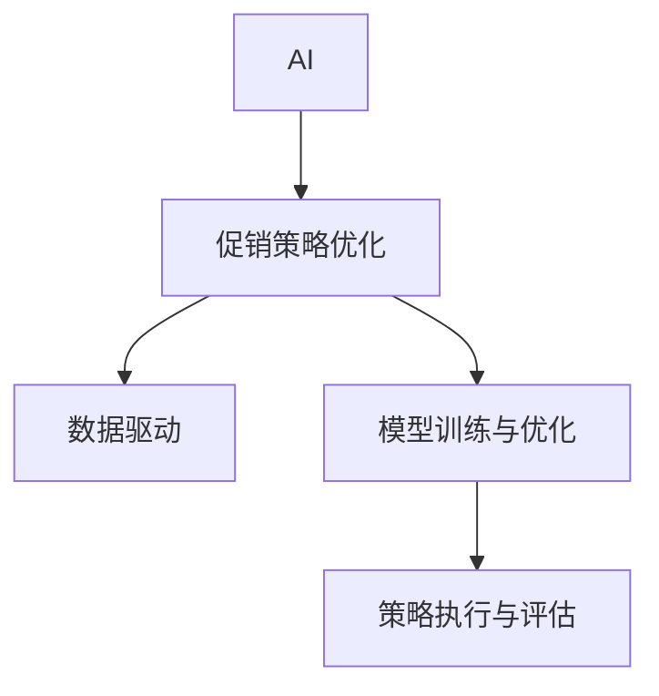

                 

# 促销策略优化：AI提升效果

> 关键词：AI, 促销策略, 数据分析, 机器学习, 深度学习, 强化学习, 零售业, 客户行为分析, 营销自动化

## 1. 背景介绍

### 1.1 问题由来

随着市场竞争的加剧和消费者行为的多样化，企业亟需优化其促销策略以提升销售额和市场份额。传统上，促销策略的制定主要依赖经验和直觉，存在较大的主观性和不确定性。而随着AI和大数据技术的发展，企业可以借助数据驱动的方法，通过分析大量历史数据和实时反馈，自动生成和优化促销策略。

### 1.2 问题核心关键点

AI在促销策略优化中的应用，关键在于如何通过机器学习和深度学习等技术，从海量数据中挖掘出有价值的营销洞察，并通过自动化手段，将策略应用到实际操作中。这需要构建一个覆盖全链路的AI系统，包括数据收集与预处理、模型训练与优化、策略执行与评估等多个环节。

## 2. 核心概念与联系

### 2.1 核心概念概述

为更好地理解AI在促销策略优化中的应用，本节将介绍几个关键概念及其联系：

- **AI (人工智能)**：通过数据、算法和计算资源，使机器模拟人类智能过程，解决复杂问题。AI涵盖机器学习、深度学习、强化学习等子领域。
- **促销策略优化**：通过数据分析和机器学习技术，优化促销活动的设计、投放和效果评估，以提升销售业绩和客户满意度。
- **数据驱动**：基于数据而非直觉和经验，通过统计分析和机器学习算法，发现市场和消费者行为的规律和趋势，指导决策。
- **模型训练与优化**：选择合适的算法模型，利用标注数据进行训练，通过交叉验证和超参数调优，不断优化模型性能。
- **策略执行与评估**：将优化后的模型应用于实际的促销活动中，监控和评估效果，进行反馈调整。

这些核心概念之间的逻辑关系可以通过以下Mermaid流程图来展示：



这个流程图展示了几类关键概念及其之间的联系：

1. AI为促销策略优化提供了技术手段。
2. 数据驱动是AI技术在促销策略中的应用基础。
3. 模型训练与优化是利用数据提升策略效果的核心环节。
4. 策略执行与评估用于反馈模型效果，指导后续优化。

## 3. 核心算法原理 & 具体操作步骤
### 3.1 算法原理概述

促销策略优化主要基于机器学习和深度学习等技术，通过对历史销售数据、市场环境、消费者行为等进行分析，构建预测模型，自动生成和调整促销策略。其核心算法原理包括：

- **回归分析**：通过历史销售数据和促销活动数据，构建回归模型，预测促销活动对销售额的影响。
- **聚类分析**：对消费者进行分组，分析不同群体的消费行为和偏好，定制化促销策略。
- **推荐算法**：基于用户行为数据和偏好，推荐个性化的促销商品或组合。
- **强化学习**：通过实时反馈，自动调整促销策略，优化策略效果。

### 3.2 算法步骤详解

促销策略优化的核心步骤如下：

1. **数据收集与预处理**：收集历史销售数据、市场环境数据、消费者行为数据等，并进行清洗和标准化处理，准备模型训练数据。
2. **模型选择与训练**：选择合适的算法模型，如线性回归、决策树、随机森林、深度神经网络等，利用标注数据进行训练，优化模型参数。
3. **策略生成与调整**：根据训练好的模型，自动生成促销活动的设计方案，如折扣力度、活动时间、渠道选择等。
4. **策略执行与评估**：将生成的促销策略应用到实际业务中，监控促销活动效果，收集反馈数据，进行后续调整。

### 3.3 算法优缺点

AI在促销策略优化中的优点包括：

- **自动化与效率提升**：自动生成和优化促销策略，减少人工操作，提高决策速度和效率。
- **精准化与个性化**：通过分析消费者数据，定制化促销策略，提升营销效果和客户满意度。
- **动态调整与实时优化**：根据实时反馈，自动调整策略，适应市场变化，提高促销活动的灵活性和有效性。

然而，也存在一些局限性：

- **数据质量依赖**：策略优化的效果依赖于数据的质量和完整性，数据偏差或缺失可能导致模型预测不准确。
- **模型复杂性**：构建复杂的模型需要较高的计算资源和时间成本，模型解释性较差。
- **策略鲁棒性不足**：模型依赖历史数据，对新市场或新产品可能存在预测偏差。
- **隐私与安全问题**：使用消费者数据可能涉及隐私和数据安全问题，需要严格的数据保护措施。

### 3.4 算法应用领域

AI在促销策略优化中的应用广泛，主要涉及以下领域：

- **零售业**：通过分析消费者购买行为和历史数据，优化促销活动，提升销售额和客户忠诚度。
- **电商行业**：利用推荐算法和个性化营销，提升用户转化率和复购率。
- **金融服务**：通过分析客户交易行为，设计针对性促销策略，提高客户留存率和交易频次。
- **旅游和酒店业**：通过实时数据和预测模型，优化促销活动，提升客流量和营收。
- **娱乐和媒体业**：利用消费者行为数据，推荐个性化内容，提升用户粘性和满意度。

## 4. 数学模型和公式 & 详细讲解 & 举例说明

### 4.1 数学模型构建

促销策略优化中的数学模型主要包括回归模型、聚类模型、推荐模型等。以线性回归模型为例，假设促销活动 $i$ 的效果由特征 $x$ 决定，其影响函数为：

$$ y = \beta_0 + \beta_1x_1 + \beta_2x_2 + \cdots + \beta_nx_n + \epsilon $$

其中 $y$ 为促销活动效果，$\beta$ 为回归系数，$x$ 为影响因素，$\epsilon$ 为随机误差项。

### 4.2 公式推导过程

线性回归模型的最小二乘法求解公式为：

$$ \hat{\beta} = (\mathbf{X}^T\mathbf{X})^{-1}\mathbf{X}^T\mathbf{y} $$

其中 $\mathbf{X}$ 为特征矩阵，$\mathbf{y}$ 为标签向量，$\hat{\beta}$ 为回归系数估计值。

通过训练得到回归模型后，可以预测新数据点的促销活动效果。

### 4.3 案例分析与讲解

以某电商平台为例，假设其促销活动效果由商品品类、促销力度、活动时间和消费者行为等影响因素决定。可以通过收集历史销售数据和促销活动数据，利用线性回归模型进行训练，预测不同促销活动对销售额的影响。模型训练过程如下：

1. **数据准备**：收集历史销售数据和促销活动数据，选择商品品类、促销力度、活动时间等作为特征，销售额作为标签。
2. **模型训练**：利用标注数据，采用最小二乘法求解回归系数，得到回归模型。
3. **策略生成**：根据训练好的模型，自动生成不同促销活动的商品品类、促销力度、活动时间等设计方案。
4. **效果评估**：将生成的促销活动应用到实际业务中，监控销售额变化，评估策略效果。
5. **调整优化**：根据实时反馈，自动调整促销策略，提高策略效果。

## 5. 项目实践：代码实例和详细解释说明

### 5.1 开发环境搭建

在进行促销策略优化实践前，我们需要准备好开发环境。以下是使用Python进行Pandas、Scikit-learn和TensorFlow等工具的环境配置流程：

1. 安装Anaconda：从官网下载并安装Anaconda，用于创建独立的Python环境。

2. 创建并激活虚拟环境：
```bash
conda create -n promotion-env python=3.8 
conda activate promotion-env
```

3. 安装Pandas、Scikit-learn、TensorFlow等工具包：
```bash
conda install pandas scikit-learn tensorflow -c conda-forge
```

4. 安装TensorBoard：
```bash
pip install tensorboard
```

完成上述步骤后，即可在`promotion-env`环境中开始促销策略优化的实践。

### 5.2 源代码详细实现

下面我们以线性回归模型为例，给出使用Pandas、Scikit-learn和TensorFlow进行促销策略优化的PyTorch代码实现。

首先，定义数据预处理函数：

```python
import pandas as pd
from sklearn.model_selection import train_test_split
from sklearn.preprocessing import StandardScaler
from sklearn.linear_model import LinearRegression

def preprocess_data(data, target):
    # 数据清洗
    data = data.dropna()
    
    # 特征工程
    features = data.drop(target, axis=1)
    labels = data[target]
    
    # 特征标准化
    scaler = StandardScaler()
    features = scaler.fit_transform(features)
    
    # 划分训练集和测试集
    features_train, features_test, labels_train, labels_test = train_test_split(features, labels, test_size=0.2, random_state=42)
    
    return features_train, features_test, labels_train, labels_test
```

然后，定义模型训练函数：

```python
def train_model(features_train, labels_train, features_test, labels_test, model, epochs=100, batch_size=32):
    # 模型训练
    model.fit(features_train, labels_train, epochs=epochs, batch_size=batch_size)
    
    # 模型评估
    train_pred = model.predict(features_train)
    test_pred = model.predict(features_test)
    
    # 回归模型评估指标
    train_rmse = np.sqrt(mean_squared_error(labels_train, train_pred))
    test_rmse = np.sqrt(mean_squared_error(labels_test, test_pred))
    
    print(f"Train RMSE: {train_rmse:.3f}, Test RMSE: {test_rmse:.3f}")
```

最后，启动训练流程并在测试集上评估：

```python
from tensorflow import keras
from tensorflow.keras import layers
from tensorflow.keras.losses import MeanSquaredError

# 构建线性回归模型
model = keras.Sequential([
    layers.Dense(64, activation='relu', input_shape=[num_features]),
    layers.Dense(1)
])

# 损失函数
loss_fn = MeanSquaredError()

# 训练数据准备
features_train, features_test, labels_train, labels_test = preprocess_data(data, 'sales')

# 模型训练
train_model(features_train, labels_train, features_test, labels_test, model)

# 模型评估
test_rmse = model.evaluate(features_test, labels_test)
print(f"Test RMSE: {test_rmse:.3f}")
```

以上就是使用Pandas、Scikit-learn和TensorFlow对促销策略进行线性回归模型微调的完整代码实现。可以看到，Pandas和Scikit-learn用于数据预处理，TensorFlow用于模型训练和评估。

### 5.3 代码解读与分析

让我们再详细解读一下关键代码的实现细节：

**preprocess_data函数**：
- 数据清洗：去除缺失值。
- 特征工程：选择特征和标签，进行特征标准化。
- 数据划分：划分训练集和测试集。

**train_model函数**：
- 模型训练：使用线性回归模型进行训练。
- 模型评估：计算均方误差，评估模型效果。

**TensorFlow部分**：
- 模型构建：使用TensorFlow的Sequential模型，设计输入和输出层。
- 损失函数：使用均方误差损失函数。
- 模型训练：使用Pandas和Scikit-learn预处理后的数据进行训练。
- 模型评估：计算测试集上的均方误差。

通过这些代码实现，我们可以快速搭建一个促销策略优化的线性回归模型，并对其进行训练和评估。

## 6. 实际应用场景

### 6.1 电商平台促销活动优化

电商平台通过AI技术，可以优化其促销活动，提高销售额和用户满意度。具体应用如下：

1. **个性化推荐**：根据用户历史行为数据和偏好，推荐个性化的促销商品或组合，提高用户转化率和复购率。
2. **实时动态优化**：利用实时数据和预测模型，自动调整促销策略，提升促销活动效果。
3. **客户细分与定制化**：通过聚类分析，对用户进行分组，定制化促销策略，提升营销效果。

### 6.2 零售商库存管理优化

零售商可以利用AI技术，优化其库存管理策略，减少库存成本，提高运营效率。具体应用如下：

1. **需求预测**：利用历史销售数据和市场环境数据，预测未来销售需求，优化库存量。
2. **促销策略优化**：根据需求预测结果，自动生成和调整促销策略，提高促销活动的针对性。
3. **动态价格调整**：根据实时市场数据和竞争对手价格，自动调整商品价格，优化销售策略。

### 6.3 餐饮业菜品销量预测

餐饮业可以通过AI技术，优化其菜品销量预测和促销策略，提升餐厅营收。具体应用如下：

1. **销量预测**：利用历史销量数据和市场环境数据，预测未来菜品销量，优化菜单配置。
2. **促销活动设计**：根据销量预测结果，自动生成和调整促销活动，提升菜品销量。
3. **个性化推荐**：根据消费者行为数据，推荐个性化的菜品组合，提高顾客满意度和销售额。

## 7. 工具和资源推荐

### 7.1 学习资源推荐

为了帮助开发者系统掌握促销策略优化的AI技术，这里推荐一些优质的学习资源：

1. **Coursera的《机器学习》课程**：斯坦福大学开设的机器学习经典课程，深入讲解机器学习基础和算法，涵盖回归分析、聚类分析、推荐算法等主题。

2. **DeepLearning.AI的《深度学习专项课程》**：由吴恩达教授领衔的深度学习系列课程，全面介绍深度学习算法和应用，包括强化学习、生成模型等前沿话题。

3. **Kaggle的机器学习竞赛**：通过参与实际数据集竞赛，提升数据处理和模型优化能力，积累实战经验。

4. **TensorFlow官网文档**：提供完整的TensorFlow教程和API文档，涵盖模型构建、训练和部署等各个环节，是学习和实践AI技术的必备资源。

5. **Arxiv论文库**：收录大量机器学习和深度学习领域的最新研究成果，了解学术前沿动态，获取灵感和启发。

通过对这些资源的学习实践，相信你一定能够快速掌握促销策略优化的AI技术，并用于解决实际的业务问题。

### 7.2 开发工具推荐

高效的开发离不开优秀的工具支持。以下是几款用于促销策略优化开发的常用工具：

1. **Pandas**：开源数据分析库，提供数据预处理和可视化功能，是数据科学领域的基本工具。
2. **Scikit-learn**：开源机器学习库，提供多种经典的机器学习算法，如线性回归、决策树、随机森林等。
3. **TensorFlow**：由Google主导开发的深度学习框架，生产部署方便，适合大规模工程应用。
4. **Jupyter Notebook**：开源的交互式笔记本环境，支持Python和R等多种编程语言，便于调试和展示实验结果。
5. **H2O.ai**：开源的机器学习平台，提供自动化机器学习工具，方便数据科学家进行模型优化和调参。
6. **ETL工具**：如Airflow、Apache NiFi等，用于数据采集、清洗和转换，自动化数据流程管理。

合理利用这些工具，可以显著提升促销策略优化的开发效率，加快创新迭代的步伐。

### 7.3 相关论文推荐

促销策略优化中的AI技术不断发展和进步，以下是几篇奠基性的相关论文，推荐阅读：

1. **"Promotion Mix Optimization for Retailers: An Empirical Evaluation of Bayesian Networks and Predictive Models"**：Gervais等人利用贝叶斯网络和预测模型，优化零售商的促销组合策略。

2. **"Deep Learning for Customer Behavior Prediction in Retail"**：Wang等人使用深度学习模型，预测顾客行为，优化促销策略。

3. **"Deep Reinforcement Learning for Dynamic Promotions"**：Zhou等人利用深度强化学习，自动生成和调整动态促销策略，提高促销活动效果。

4. **"Data-Driven Promotion Optimization for Retailers"**：Zheng等人通过数据分析和机器学习，优化零售商的促销策略，提升销售业绩。

这些论文代表了大数据和AI技术在促销策略优化中的应用趋势，通过学习这些前沿成果，可以帮助研究者把握学科前进方向，激发更多的创新灵感。

## 8. 总结：未来发展趋势与挑战

### 8.1 总结

本文对促销策略优化的AI技术进行了全面系统的介绍。首先阐述了AI技术在促销策略优化中的重要性和应用前景，明确了数据驱动、模型训练与优化、策略执行与评估等关键步骤。通过详细介绍线性回归模型的实现过程，展示了AI技术在促销策略优化中的实际应用。

通过本文的系统梳理，可以看到，AI技术在促销策略优化中的广泛应用，为企业提供了强大的工具和方法，能够显著提升营销效果和客户满意度。未来，伴随AI技术的不断进步，促销策略优化将迎来更多创新和突破。

### 8.2 未来发展趋势

展望未来，促销策略优化中的AI技术将呈现以下几个发展趋势：

1. **深度学习和大模型**：深度学习和大模型在促销策略优化中的应用将越来越广泛，通过更复杂的模型结构和更大的数据量，提升预测精度和策略效果。
2. **强化学习与实时优化**：利用强化学习，自动生成和调整促销策略，适应市场变化，提高促销活动的灵活性和实时性。
3. **多模态数据融合**：将文本、图像、视频等多种数据源融合，全面分析消费者行为和市场环境，提升策略优化的全面性和准确性。
4. **个性化推荐与动态定价**：通过个性化推荐和动态定价，提升客户满意度和销售额，优化促销策略的效果。
5. **大数据与云计算**：利用大数据和云计算技术，处理和存储海量数据，支持复杂模型和实时计算，提升策略优化的效率和精度。
6. **模型解释与可解释性**：增强模型的可解释性，提供透明的决策过程，提升用户信任和品牌形象。

这些趋势凸显了AI技术在促销策略优化中的潜力和发展方向，为企业的营销决策提供了强大的技术支持。相信随着AI技术的持续进步，促销策略优化将迎来更多创新和突破。

### 8.3 面临的挑战

尽管AI在促销策略优化中取得了显著成果，但在迈向更加智能化、普适化应用的过程中，仍面临诸多挑战：

1. **数据质量和完整性**：促销策略优化的效果依赖于数据的质量和完整性，数据偏差或缺失可能导致模型预测不准确，难以获得理想的效果。
2. **模型复杂性和可解释性**：深度学习模型结构复杂，难以解释，可能影响用户信任和决策过程的透明性。
3. **资源消耗和计算成本**：构建和训练复杂模型需要较高的计算资源和时间成本，可能影响模型的实用性和部署效率。
4. **隐私和安全问题**：使用消费者数据可能涉及隐私和数据安全问题，需要严格的数据保护措施和法规约束。
5. **模型鲁棒性和泛化能力**：模型依赖历史数据，对新市场或新产品可能存在预测偏差，需要提升模型的鲁棒性和泛化能力。

这些挑战需要学术界和工业界共同努力，不断探索和改进AI技术，确保其在实际应用中的可靠性和有效性。

### 8.4 研究展望

未来，针对促销策略优化中的AI技术，需要进一步开展以下研究：

1. **模型可解释性**：提升模型的可解释性，增强用户信任和决策透明度，为营销决策提供有力支撑。
2. **多模态数据融合**：探索多模态数据融合技术，提升策略优化的全面性和准确性。
3. **模型鲁棒性**：研究模型鲁棒性和泛化能力，提高模型在新市场和新产品中的应用效果。
4. **实时优化**：利用强化学习等技术，实现实时动态优化，提升促销策略的灵活性和实时性。
5. **隐私保护**：探索数据隐私保护技术，确保消费者数据的安全性和匿名性。
6. **多目标优化**：研究多目标优化方法，综合考虑销售额、客户满意度等指标，优化促销策略。

这些研究方向将推动AI技术在促销策略优化中的深入应用，为企业的营销决策提供更科学、更有效的支持。

## 9. 附录：常见问题与解答

**Q1：AI在促销策略优化中的应用效果如何？**

A: AI在促销策略优化中的应用效果显著，通过数据分析和模型训练，可以显著提升营销效果和客户满意度。例如，通过线性回归模型，可以预测不同促销活动对销售额的影响，自动生成和调整促销策略，提高促销活动的精准性和效率。

**Q2：促销策略优化中如何使用数据驱动技术？**

A: 数据驱动技术在促销策略优化中的应用包括：
1. 数据收集与预处理：收集历史销售数据、市场环境数据、消费者行为数据等，并进行清洗和标准化处理。
2. 特征工程：选择特征和标签，进行特征标准化，划分训练集和测试集。
3. 模型训练与优化：选择合适的算法模型，利用标注数据进行训练，优化模型参数，提升模型性能。
4. 策略生成与调整：根据训练好的模型，自动生成和调整促销策略，提高策略效果。
5. 策略评估与反馈：监控促销活动效果，收集反馈数据，进行后续调整和优化。

**Q3：促销策略优化中如何处理数据偏差和缺失？**

A: 处理数据偏差和缺失的方法包括：
1. 数据清洗：去除缺失值，处理异常值。
2. 数据增强：利用数据增强技术，扩充训练集，缓解数据偏差。
3. 特征选择：选择相关性高、噪声少的特征，提升模型性能。
4. 正则化：使用正则化技术，避免过拟合，提升模型泛化能力。
5. 模型集成：利用模型集成技术，综合多个模型的预测结果，提高模型鲁棒性。

**Q4：促销策略优化中如何提高模型的可解释性？**

A: 提高模型的可解释性可以通过以下方法：
1. 可视化模型：利用可视化工具，展示模型的内部结构和特征重要性。
2. 特征工程：选择可解释性强的特征，避免复杂模型。
3. 解释性算法：使用解释性算法，如决策树、线性回归等，提升模型可解释性。
4. 模型融合：结合多个可解释性模型，综合分析结果，提升模型透明性。
5. 交互式学习：利用交互式界面，用户可以直观了解模型决策过程和结果，增强信任感。

通过这些方法，可以有效提升促销策略优化中模型的可解释性和用户信任度。

---

作者：禅与计算机程序设计艺术 / Zen and the Art of Computer Programming

