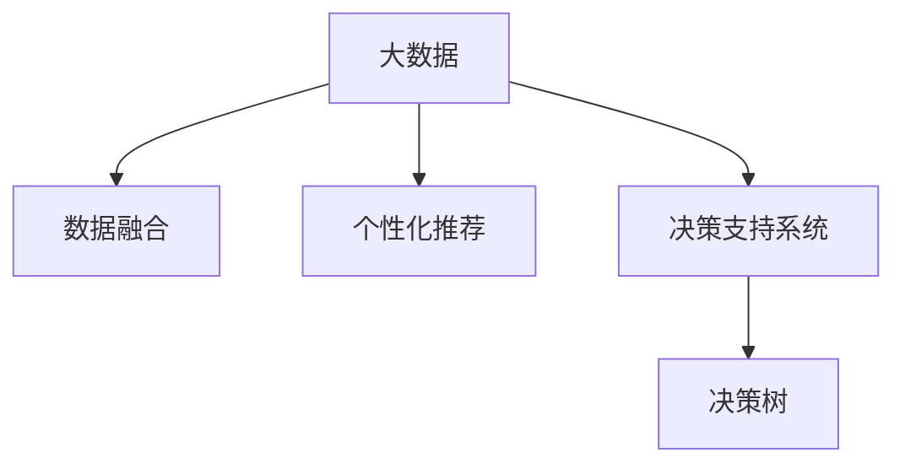

                 

## 1. 背景介绍

在信息化时代，决策过程已不再是基于单一的数据来源，而是逐渐变得多元化和复杂化。决策者面临的信息量和信息源的增加，使得传统的决策模式受到了挑战。决策的个性化需求日益凸显，需要考虑不同决策者的需求、偏好和决策风格。大数据技术的应用，为解决信息差问题提供了新的思路和工具，可以更好地支持决策的个性化。

### 1.1 问题由来
随着数字化进程的推进，各行业的决策环境发生了深刻变化。以下问题突显：

- **数据丰富性**：现代决策者拥有前所未有的数据量，这些数据包括但不限于消费者行为数据、市场趋势数据、运营效率数据等。数据量的增加，使得决策者能够从更多维度上分析问题。
- **数据复杂性**：数据类型从单一的结构化数据，扩展到结构化、半结构化和非结构化数据的混合。数据结构和类型的多样性，对决策分析提出了更高的要求。
- **信息孤岛**：各部门之间、不同企业之间的数据缺乏共享和整合，导致信息孤岛的形成，影响了数据的全面性和准确性。
- **个性化需求**：决策者背景、经验、偏好不同，决策风格也各异。如何根据个体特征进行个性化支持，成为决策技术发展的关键。

### 1.2 问题核心关键点
为了有效解决信息差问题，提升决策的个性化水平，核心关键点包括：

- **数据融合与集成**：如何从多源异构数据中提取有用信息，实现数据的整合与共享。
- **个性化数据挖掘**：根据决策者的不同需求和偏好，定制个性化的数据查询和分析结果。
- **智能决策辅助**：结合决策者的背景和风格，提供个性化的建议和支持。
- **决策自动化**：在部分决策场景中，通过智能算法自动完成决策过程，减少决策者的工作负担。

### 1.3 问题研究意义
研究信息差决策个性化支持，具有重要意义：

1. **提高决策效率**：通过个性化支持，决策者能够更快、更准确地获取所需信息，从而提高决策效率。
2. **降低决策成本**：个性化支持能够减少冗余信息和噪音，降低数据获取和处理的成本。
3. **提升决策质量**：通过深入挖掘和分析，提供更具针对性的决策建议，提升决策质量。
4. **支持个性化决策**：基于决策者的特征和偏好，定制化推荐方案，增强决策的个性化水平。
5. **推动智能化应用**：个性化支持与决策自动化相结合，推动智能化决策系统的构建和应用。

## 2. 核心概念与联系

### 2.1 核心概念概述

为更好地理解信息差决策个性化支持，本节将介绍几个关键概念：

- **大数据**：指的是数据量巨大、数据源多样、数据类型复杂的数据集合。大数据技术能够高效处理和分析大规模数据。
- **数据融合**：指将多个数据源的数据整合在一起，消除数据孤岛，实现数据的一致性和完整性。
- **个性化推荐**：根据用户的历史行为和偏好，推荐用户可能感兴趣的信息或商品。
- **决策支持系统**：通过收集和分析数据，提供辅助决策的方案和建议。
- **决策树**：一种基于树形结构的分支算法，用于决策过程的建模和优化。

这些核心概念之间的关系可以通过以下Mermaid流程图来展示：



这个流程图展示了大数据技术在决策支持系统中的应用，通过数据融合和个性化推荐，构建个性化的决策树，支持决策过程的自动化。

## 3. 核心算法原理 & 具体操作步骤

### 3.1 算法原理概述

信息差决策个性化支持主要涉及以下几个算法原理：

- **数据预处理**：包括数据清洗、数据标准化和数据转换等步骤，确保数据的准确性和一致性。
- **数据融合**：采用数据合并、数据重构等技术，实现多源异构数据的整合。
- **个性化推荐**：利用协同过滤、内容推荐等算法，提供个性化的信息或商品推荐。
- **决策支持系统**：通过数据挖掘、机器学习等技术，提供辅助决策的建议和方案。
- **决策树**：基于决策树算法，构建决策过程的树形结构，实现决策自动化。

### 3.2 算法步骤详解

信息差决策个性化支持的一般步骤包括：

**Step 1: 数据收集与预处理**

- **数据收集**：从不同渠道收集数据，包括内部系统数据、第三方数据、社交媒体数据等。
- **数据预处理**：清洗数据，去除噪声和冗余，确保数据质量。

**Step 2: 数据融合**

- **数据合并**：通过规则、算法等技术，将不同数据源的数据合并。
- **数据重构**：对合并后的数据进行重构，消除数据不一致和冗余。

**Step 3: 个性化推荐**

- **用户画像**：根据用户历史行为和偏好，构建用户画像。
- **推荐算法**：采用协同过滤、内容推荐等算法，生成个性化的推荐结果。
- **推荐展示**：将推荐结果展示给用户，供其参考和决策。

**Step 4: 决策支持**

- **数据挖掘**：从大数据中挖掘出有用的信息和规律。
- **模型训练**：基于挖掘结果，训练决策支持模型。
- **方案推荐**：根据决策目标和条件，提供个性化的方案和建议。

**Step 5: 决策自动化**

- **决策树构建**：基于决策树算法，构建决策过程的树形结构。
- **决策模拟**：通过模拟决策过程，评估不同决策方案的效果。
- **自动决策**：在决策规则明确、数据完备的情况下，自动完成决策过程。

### 3.3 算法优缺点

信息差决策个性化支持具有以下优点：

- **提升决策效率**：通过个性化推荐，决策者能够快速获取所需信息，提升决策效率。
- **降低决策成本**：减少冗余信息和噪音，降低数据获取和处理的成本。
- **提高决策质量**：个性化推荐和决策支持系统能够提供更具针对性的建议，提升决策质量。
- **支持个性化决策**：根据决策者的背景和偏好，定制化推荐方案，增强决策的个性化水平。
- **推动智能化应用**：决策自动化结合个性化支持，推动智能化决策系统的构建和应用。

但同时也存在一些缺点：

- **数据隐私问题**：在收集和处理数据时，需要关注用户的隐私和数据安全。
- **算法复杂性**：个性化推荐和决策支持系统的实现较为复杂，需要综合考虑多方面的因素。
- **系统可扩展性**：在大规模数据环境下，系统的可扩展性是一个重要挑战。

### 3.4 算法应用领域

信息差决策个性化支持在多个领域具有广泛的应用：

- **电商领域**：根据用户的浏览和购买历史，推荐个性化的商品和优惠信息。
- **金融领域**：根据用户的投资行为和风险偏好，推荐个性化的理财方案和投资产品。
- **医疗领域**：根据患者的历史诊疗记录和基因信息，推荐个性化的治疗方案和药物。
- **旅游领域**：根据用户的旅行偏好和行为，推荐个性化的旅游线路和活动。
- **政府管理**：根据不同地区和人群的需求，制定个性化的政策方案和管理措施。

## 4. 数学模型和公式 & 详细讲解

### 4.1 数学模型构建

基于信息差决策个性化支持，可以构建如下数学模型：

- **数据预处理模型**：
$$
D = \text{Preprocess}(\{D_1, D_2, ..., D_n\})
$$
其中 $D$ 表示预处理后的数据集，$D_i$ 表示第 $i$ 个原始数据源。

- **数据融合模型**：
$$
F = \text{Merge}(D)
$$
其中 $F$ 表示融合后的数据集。

- **个性化推荐模型**：
$$
R = \text{Recommend}(D, U)
$$
其中 $R$ 表示推荐结果，$U$ 表示用户画像。

- **决策支持模型**：
$$
S = \text{Support}(D)
$$
其中 $S$ 表示决策支持方案。

- **决策树模型**：
$$
T = \text{DecisionTree}(S)
$$
其中 $T$ 表示决策树，$S$ 表示决策支持方案。

### 4.2 公式推导过程

以个性化推荐为例，进行公式推导：

假设用户的特征表示为 $\mathbf{x} \in \mathbb{R}^n$，物品的特征表示为 $\mathbf{y} \in \mathbb{R}^m$，用户的评分矩阵表示为 $M \in \mathbb{R}^{n \times m}$。

**协同过滤算法**：
$$
\hat{y} = \frac{\sum_{i=1}^n \alpha_i x_i \cdot y_i}{\sum_{i=1}^n \alpha_i x_i^2}
$$
其中 $\alpha_i$ 为用户 $i$ 对物品的评分权重，$x_i$ 和 $y_i$ 分别表示用户和物品的特征向量。

**内容推荐算法**：
$$
\hat{y} = \mathbf{w}^T \cdot \mathbf{y}
$$
其中 $\mathbf{w}$ 为物品的特征权重，由用户特征向量 $\mathbf{x}$ 和物品特征矩阵 $M$ 计算得到。

### 4.3 案例分析与讲解

假设某电商平台收集了用户的浏览行为数据和购买行为数据，利用协同过滤算法进行个性化推荐。

**步骤1:** 收集数据，构建用户画像。
- 收集用户的浏览记录和购买记录，形成特征向量 $\mathbf{x}_i$。

**步骤2:** 融合数据，构建物品画像。
- 将用户画像和物品的评分矩阵 $M$ 融合，形成物品特征向量 $\mathbf{y}_i$。

**步骤3:** 推荐物品，展示结果。
- 根据用户画像 $\mathbf{x}_i$ 和物品画像 $\mathbf{y}_i$，使用协同过滤算法计算推荐结果 $\hat{y}_i$。
- 将推荐结果展示给用户，供其参考和选择。

## 5. 项目实践：代码实例和详细解释说明

### 5.1 开发环境搭建

在进行项目实践前，我们需要准备好开发环境。以下是使用Python进行PyTorch开发的环境配置流程：

1. 安装Anaconda：从官网下载并安装Anaconda，用于创建独立的Python环境。

2. 创建并激活虚拟环境：
```bash
conda create -n pytorch-env python=3.8 
conda activate pytorch-env
```

3. 安装PyTorch：根据CUDA版本，从官网获取对应的安装命令。例如：
```bash
conda install pytorch torchvision torchaudio cudatoolkit=11.1 -c pytorch -c conda-forge
```

4. 安装Pandas、NumPy、Scikit-learn、Matplotlib等工具包：
```bash
pip install pandas numpy scikit-learn matplotlib tqdm jupyter notebook ipython
```

5. 安装TensorFlow、TensorBoard等工具包：
```bash
pip install tensorflow tensorflow_probability tensorboard
```

完成上述步骤后，即可在`pytorch-env`环境中开始项目实践。

### 5.2 源代码详细实现

这里我们以协同过滤推荐系统为例，给出使用PyTorch进行个性化推荐代码实现。

首先，定义数据处理函数：

```python
import pandas as pd
import numpy as np

def load_data(file_path):
    data = pd.read_csv(file_path)
    return data

def preprocess_data(data):
    # 数据预处理，包括去除噪声、标准化等
    ...

def merge_data(data):
    # 数据融合，合并不同数据源
    ...

def build_user_profile(data):
    # 构建用户画像
    ...

def build_item_profile(data):
    # 构建物品画像
    ...
```

然后，定义模型和推荐函数：

```python
from sklearn.metrics.pairwise import cosine_similarity
from sklearn.decomposition import TruncatedSVD

class CollaborativeFiltering:
    def __init__(self, n_factors=50):
        self.n_factors = n_factors
        self.model = None

    def fit(self, X, y):
        self.model = TruncatedSVD(n_components=self.n_factors, random_state=0)
        self.model.fit(X)

    def predict(self, X_test):
        X_test = self.model.transform(X_test)
        return np.dot(X_test, self.model.components_.T)

# 加载数据
data = load_data('user_item.csv')

# 数据预处理和融合
X = preprocess_data(data)
X = merge_data(X)

# 构建用户和物品画像
user_profiles = build_user_profile(X)
item_profiles = build_item_profile(X)

# 初始化协同过滤模型
model = CollaborativeFiltering()

# 拟合模型
model.fit(user_profiles, item_profiles)

# 预测推荐结果
user_id = 12345
recommendations = model.predict(user_profiles[user_id])

# 展示推荐结果
print(recommendations)
```

以上就是使用PyTorch进行协同过滤个性化推荐的代码实现。可以看到，通过Pandas和Scikit-learn等工具，能够方便地处理和融合数据，使用TensorFlow和PyTorch等深度学习框架，能够高效地训练和预测推荐结果。

### 5.3 代码解读与分析

让我们再详细解读一下关键代码的实现细节：

**load_data函数**：
- 定义了加载数据的功能，用于从CSV文件中读取数据。

**preprocess_data函数**：
- 定义了数据预处理的功能，包括去除噪声、标准化等。

**merge_data函数**：
- 定义了数据融合的功能，将不同数据源的数据合并。

**build_user_profile函数**：
- 定义了构建用户画像的功能，将用户特征向量进行编码和转换。

**build_item_profile函数**：
- 定义了构建物品画像的功能，将物品特征矩阵进行降维和转换。

**CollaborativeFiltering类**：
- 定义了协同过滤模型的功能，包括拟合和预测。

**fit方法**：
- 训练协同过滤模型，使用TruncatedSVD算法进行降维和矩阵分解。

**predict方法**：
- 根据用户画像和物品画像，预测推荐结果。

## 6. 实际应用场景

### 6.1 电商平台

基于协同过滤推荐系统，电商平台可以为用户提供个性化的商品推荐。用户在浏览商品时，平台记录用户的浏览行为，生成用户画像。同时，收集用户购买行为，构建物品画像。利用协同过滤算法，推荐系统根据用户画像和物品画像，预测用户可能感兴趣的商品，并展示给用户。

**步骤1:** 收集用户浏览和购买行为数据，构建用户和物品画像。
- 收集用户浏览记录和购买记录，形成特征向量。

**步骤2:** 使用协同过滤算法，预测推荐结果。
- 利用协同过滤算法，根据用户画像和物品画像，计算推荐结果。

**步骤3:** 展示推荐结果，供用户选择。
- 将推荐结果展示给用户，供其参考和选择。

### 6.2 金融领域

金融领域中，根据用户的投资行为和风险偏好，利用协同过滤推荐系统，推荐个性化的理财方案和投资产品。

**步骤1:** 收集用户投资行为数据，构建用户画像。
- 收集用户的历史交易记录和风险偏好，形成特征向量。

**步骤2:** 使用协同过滤算法，预测推荐结果。
- 利用协同过滤算法，根据用户画像和物品画像，计算推荐结果。

**步骤3:** 展示推荐结果，供用户选择。
- 将推荐结果展示给用户，供其参考和选择。

### 6.3 医疗领域

在医疗领域，根据患者的历史诊疗记录和基因信息，利用协同过滤推荐系统，推荐个性化的治疗方案和药物。

**步骤1:** 收集患者诊疗记录和基因信息，构建患者画像。
- 收集患者的历史诊疗记录和基因信息，形成特征向量。

**步骤2:** 使用协同过滤算法，预测推荐结果。
- 利用协同过滤算法，根据患者画像和物品画像，计算推荐结果。

**步骤3:** 展示推荐结果，供医生选择。
- 将推荐结果展示给医生，供其参考和选择。

## 7. 工具和资源推荐

### 7.1 学习资源推荐

为了帮助开发者系统掌握信息差决策个性化支持的理论基础和实践技巧，这里推荐一些优质的学习资源：

1. **《Python大数据分析与处理》**：详细介绍了Python在数据预处理、数据融合、数据可视化等方面的应用，适合初学者快速入门。
2. **《机器学习实战》**：涵盖了协同过滤、内容推荐等常见算法，结合实战案例，帮助读者掌握决策支持系统的构建。
3. **Coursera的《数据科学与人工智能》课程**：由斯坦福大学教授讲授，全面介绍了大数据技术在决策支持中的应用，适合深入学习。
4. **Kaggle竞赛平台**：提供了大量数据集和实战项目，通过竞赛形式，帮助开发者提升实战能力。

通过对这些资源的学习实践，相信你一定能够快速掌握信息差决策个性化支持的精髓，并用于解决实际的决策问题。

### 7.2 开发工具推荐

高效的开发离不开优秀的工具支持。以下是几款用于信息差决策个性化支持开发的常用工具：

1. **Python**：Python语言简洁易学，拥有丰富的库和框架，适合数据处理和算法实现。
2. **Pandas**：用于数据处理和分析，提供了强大的数据结构和数据操作功能。
3. **Scikit-learn**：提供了丰富的机器学习算法，适合进行数据挖掘和推荐系统构建。
4. **TensorFlow**：深度学习框架，适合进行深度学习和神经网络模型的训练和推理。
5. **TensorBoard**：用于可视化模型训练和推理过程，方便调试和优化。

合理利用这些工具，可以显著提升信息差决策个性化支持的开发效率，加快创新迭代的步伐。

### 7.3 相关论文推荐

信息差决策个性化支持的研究源于学界的持续研究。以下是几篇奠基性的相关论文，推荐阅读：

1. **《协同过滤算法》**：详细介绍了协同过滤算法的原理和实现，是推荐系统的经典算法。
2. **《个性化推荐系统》**：全面介绍了个性化推荐系统的构建和应用，适合深入了解。
3. **《决策树算法》**：介绍了决策树算法的原理和实现，适合解决决策问题。

这些论文代表了大数据和决策支持技术的最新进展，通过学习这些前沿成果，可以帮助研究者把握学科前进方向，激发更多的创新灵感。

## 8. 总结：未来发展趋势与挑战

### 8.1 总结

本文对信息差决策个性化支持进行了全面系统的介绍。首先阐述了信息差决策个性化支持的研究背景和意义，明确了决策个性化在提高决策效率、降低决策成本等方面的价值。其次，从原理到实践，详细讲解了信息差决策个性化支持的核心算法和具体操作步骤，给出了代码实例和详细解释说明。同时，本文还广泛探讨了信息差决策个性化支持在电商、金融、医疗等多个领域的应用前景，展示了信息差决策个性化支持的广阔前景。此外，本文精选了信息差决策个性化支持的学习资源，力求为读者提供全方位的技术指引。

通过本文的系统梳理，可以看到，信息差决策个性化支持是大数据技术的重要应用方向，能够更好地支持决策的个性化。未来，伴随大数据技术的持续发展和优化，信息差决策个性化支持必将在更多领域得到广泛应用，为决策者提供更有力的支持。

### 8.2 未来发展趋势

展望未来，信息差决策个性化支持将呈现以下几个发展趋势：

1. **数据融合与集成技术的进步**：随着数据融合技术的不断进步，多源异构数据的整合将变得更加高效和准确。
2. **个性化推荐算法的优化**：协同过滤、内容推荐等算法的优化和创新，将进一步提升推荐系统的精准性和可解释性。
3. **决策支持系统的智能化**：机器学习和深度学习技术的引入，将使得决策支持系统更加智能化和自动化。
4. **决策树的扩展与应用**：基于决策树的决策支持系统，将向决策树集成、决策树网络等方向发展，提升决策过程的灵活性和准确性。
5. **跨领域数据融合**：实现不同领域数据的高效融合，提供更加全面和准确的决策支持。

以上趋势凸显了信息差决策个性化支持的广阔前景。这些方向的探索发展，必将进一步提升决策系统的性能和应用范围，为决策者提供更有力的支持。

### 8.3 面临的挑战

尽管信息差决策个性化支持已经取得了一定的进展，但在迈向更加智能化、普适化应用的过程中，它仍面临着诸多挑战：

1. **数据隐私问题**：在收集和处理数据时，需要关注用户的隐私和数据安全。
2. **算法复杂性**：信息差决策个性化支持涉及的数据处理和算法实现较为复杂，需要综合考虑多方面的因素。
3. **系统可扩展性**：在大规模数据环境下，系统的可扩展性是一个重要挑战。

### 8.4 研究展望

面对信息差决策个性化支持所面临的挑战，未来的研究需要在以下几个方面寻求新的突破：

1. **隐私保护技术**：研究如何在保护用户隐私的前提下，实现数据的高效处理和分析。
2. **算法优化与创新**：开发更加高效的个性化推荐算法，提升算法的精准性和可解释性。
3. **跨领域数据融合技术**：研究不同领域数据的融合方法，实现跨领域的数据协同分析。
4. **决策支持系统的智能化**：结合机器学习和深度学习技术，实现决策支持系统的智能化和自动化。
5. **决策树扩展与应用**：研究决策树扩展算法和决策树网络，提升决策过程的灵活性和准确性。

这些研究方向的探索，必将引领信息差决策个性化支持技术迈向更高的台阶，为决策者提供更有力的支持。相信随着技术的不断进步和优化，信息差决策个性化支持必将在构建人机协同的智能系统方面发挥更大的作用。

## 9. 附录：常见问题与解答

**Q1: 什么是信息差决策个性化支持？**

A: 信息差决策个性化支持是指在决策过程中，通过大数据技术，融合多源异构数据，根据决策者的不同需求和偏好，提供个性化的决策建议和方案，提升决策效率和质量。

**Q2: 信息差决策个性化支持的核心技术有哪些？**

A: 信息差决策个性化支持的核心技术包括数据预处理、数据融合、个性化推荐、决策支持系统和决策树等。

**Q3: 信息差决策个性化支持的应用场景有哪些？**

A: 信息差决策个性化支持在电商、金融、医疗、旅游、政府管理等领域具有广泛的应用。

**Q4: 信息差决策个性化支持的未来发展方向有哪些？**

A: 未来信息差决策个性化支持的发展方向包括数据融合与集成技术的进步、个性化推荐算法的优化、决策支持系统的智能化、决策树的扩展与应用以及跨领域数据融合等。

**Q5: 信息差决策个性化支持面临的主要挑战有哪些？**

A: 信息差决策个性化支持面临的主要挑战包括数据隐私问题、算法复杂性、系统可扩展性等。

作者：禅与计算机程序设计艺术 / Zen and the Art of Computer Programming

