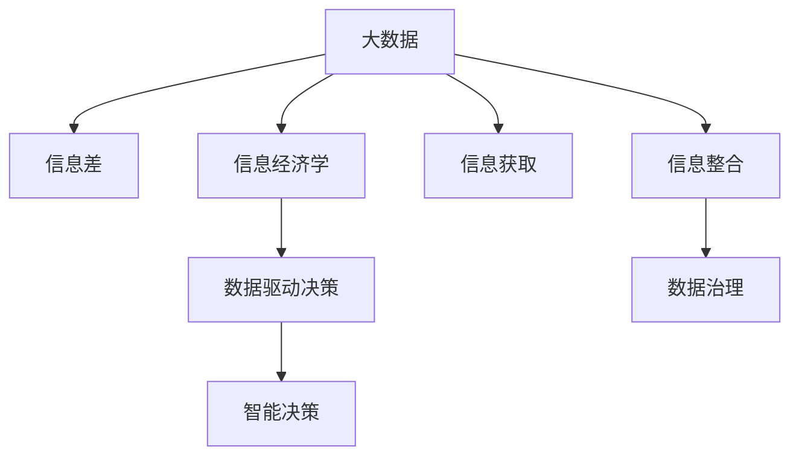

                 

# 信息差的商业模式创新：大数据如何推动商业模式变革

> 关键词：大数据,信息差,商业模式,信息经济学,数据驱动决策

## 1. 背景介绍

### 1.1 问题由来
在互联网时代，信息流动的速度和效率达到了前所未有的高度。然而，信息的分布并非均匀，不同用户之间的信息获取能力也存在显著差异。这种现象被称为"信息差"。信息差不仅体现在个体之间的信息获取能力差异上，更体现在不同群体之间对信息的敏感性和使用效率的差异。信息差的存在，使得市场参与者在资源配置、决策制定、竞争策略等方面处于不同的位置，从而影响商业模式的形成和演变。

### 1.2 问题核心关键点
当前，信息差已经成为影响商业模式创新的关键因素。其主要表现包括：

- 信息不对称：指不同市场参与者掌握的信息量不同，从而影响决策的公平性和准确性。信息不对称是信息差的核心。
- 信息碎片化：海量信息带来的信息爆炸和信息碎片化，使得有效信息的筛选和整合变得复杂。
- 数据孤岛：不同企业、不同系统之间的数据互操作性差，导致数据难以融合，形成数据孤岛。
- 数据隐私与安全：数据的收集、存储、使用过程中，隐私保护和数据安全成为重要挑战。

解决信息差带来的问题，需要从数据获取、数据整合、数据治理等环节入手，构建基于大数据的商业模式创新机制。

## 2. 核心概念与联系

### 2.1 核心概念概述

为更好地理解信息差在大数据推动商业模式创新中的应用，本节将介绍几个密切相关的核心概念：

- 大数据（Big Data）：指规模巨大、类型繁多、速度快、价值密度低的海量数据集。大数据以其多样性、高维性、实时性等特性，为商业决策提供了强大的数据支撑。
- 信息差（Information Gap）：指不同市场参与者之间在信息获取、信息理解和信息使用上的差异。信息差的存在，使得资源配置和决策过程变得不平衡，从而影响商业模式。
- 信息经济学（Information Economics）：研究信息在市场交易中的作用，包括信息获取成本、信息不对称等问题，以及信息披露、信息共享等机制的优化。
- 数据驱动决策（Data-Driven Decision Making）：指以数据为依据，通过数据分析、数据挖掘等技术手段，辅助企业做出更科学、更高效的决策。
- 智能决策（Smart Decision Making）：利用人工智能和大数据技术，进行实时化、自动化、智能化的决策过程，以提高决策效率和精度。

这些核心概念之间的逻辑关系可以通过以下Mermaid流程图来展示：



这个流程图展示了大数据、信息差、信息经济学、数据驱动决策和智能决策之间的相互关系：

1. 大数据为信息获取和整合提供了数据来源。
2. 信息差导致数据获取和整合过程存在差异，从而影响决策的公平性和效率。
3. 信息经济学研究信息在市场交易中的作用，指导数据获取和整合。
4. 数据驱动决策通过数据分析支持智能决策，提高决策质量。
5. 智能决策利用大数据和人工智能技术，实现实时、高效、智能的决策过程。

这些概念共同构成了基于大数据的商业模式创新框架，使得企业能够通过信息差的洞察，优化资源配置，提升决策效率，构建新的商业生态。

## 3. 核心算法原理 & 具体操作步骤
### 3.1 算法原理概述

基于大数据推动商业模式创新的算法，本质上是利用信息经济学原理，通过数据获取、数据整合、数据治理等技术手段，消除信息差带来的不平衡。具体来说，可以分为以下几个步骤：

1. 数据收集：从不同来源收集海量的数据，涵盖用户行为数据、交易数据、市场数据等。
2. 数据清洗：对收集到的数据进行清洗和处理，去除噪声和冗余，提高数据质量。
3. 数据整合：将不同来源的数据进行整合，建立统一的数据仓库，支持数据分析和决策。
4. 数据治理：制定数据标准和规范，保障数据的安全、隐私和合规性。
5. 数据挖掘：通过数据挖掘算法，发现数据中的模式和规律，支持商业决策。
6. 智能决策：利用人工智能技术，进行实时化、自动化、智能化的决策支持。

通过这些步骤，可以有效地消除信息差带来的不平衡，优化商业决策过程，提升商业模式创新能力。

### 3.2 算法步骤详解

基于大数据推动商业模式创新的算法步骤具体如下：

**Step 1: 数据收集**
- 选择合适的数据源，如用户行为数据、交易数据、市场数据等。
- 设计数据采集接口，确保数据收集的实时性和准确性。
- 引入数据采集工具，如Apache Kafka、Flume等，实现高效率的数据收集。

**Step 2: 数据清洗**
- 对收集到的数据进行去重、去噪、异常值处理等清洗操作。
- 引入数据清洗工具，如Apache Spark、Pandas等，进行高效的清洗处理。
- 设置数据清洗规则，如缺失值处理、数据格式转换等，确保数据质量。

**Step 3: 数据整合**
- 将不同来源的数据进行汇聚和整合，建立统一的数据仓库。
- 利用数据整合工具，如Apache Hive、Apache Flink等，实现数据的有效整合。
- 设计数据模型，如维度建模、实体关联建模等，构建高效的数据结构。

**Step 4: 数据治理**
- 制定数据标准和规范，确保数据的统一性和一致性。
- 引入数据治理工具，如Alteryx、IBM Data Lake等，实现数据治理功能。
- 设置数据隐私和安全机制，确保数据的安全和合规性。

**Step 5: 数据挖掘**
- 通过数据挖掘算法，如聚类、分类、回归等，发现数据中的模式和规律。
- 引入数据挖掘工具，如WEKA、Scikit-learn等，进行高效的数据挖掘分析。
- 设计数据挖掘流程，如特征工程、模型训练、结果评估等，确保数据挖掘的准确性。

**Step 6: 智能决策**
- 利用人工智能技术，进行实时化、自动化、智能化的决策支持。
- 引入机器学习、深度学习等算法，进行模型训练和优化。
- 设计智能决策系统，如推荐系统、预测系统等，实现高效决策支持。

### 3.3 算法优缺点

基于大数据推动商业模式创新的算法具有以下优点：
1. 数据驱动：通过大数据技术，数据驱动决策，提高决策的科学性和准确性。
2. 实时高效：利用大数据技术，实现实时化的数据处理和决策支持，提升决策效率。
3. 精准预测：通过数据挖掘和机器学习算法，实现精准的业务预测和趋势分析。
4. 智能化决策：利用人工智能技术，进行自动化、智能化的决策支持，提高决策质量。

同时，该算法也存在一些缺点：
1. 数据质量依赖：数据质量的好坏直接影响算法的有效性。数据收集、清洗、整合等环节存在较大挑战。
2. 技术复杂度高：大数据技术涉及数据存储、数据处理、数据治理等多个环节，技术复杂度较高。
3. 数据隐私问题：大数据收集和处理过程中，隐私保护和数据安全成为重要问题。
4. 数据孤岛问题：不同系统之间的数据互操作性差，导致数据难以融合，形成数据孤岛。
5. 智能决策依赖模型：智能决策的效果依赖于模型的准确性和完备性，模型训练和优化过程复杂。

尽管存在这些局限性，但就目前而言，基于大数据的商业模式创新方法仍然是提升企业竞争力、优化资源配置的重要手段。未来相关研究的重点在于如何进一步降低数据获取和处理的成本，提高数据质量和治理能力，同时兼顾数据隐私和安全等因素。

### 3.4 算法应用领域

基于大数据推动商业模式创新的算法已经在多个领域得到了广泛的应用，例如：

- 电商零售：通过用户行为数据分析，进行个性化推荐、价格优化、库存管理等。
- 金融行业：通过交易数据和市场数据，进行风险评估、信用评分、反欺诈检测等。
- 医疗健康：通过病历数据和健康数据，进行疾病预测、治疗方案推荐、健康管理等。
- 交通运输：通过车辆数据和交通数据，进行交通流量预测、路径规划、调度优化等。
- 城市管理：通过城市数据和传感器数据，进行城市事件监测、公共安全管理、资源配置优化等。

这些领域的大数据应用，展示了信息差在大数据推动商业模式创新中的巨大潜力。

## 4. 数学模型和公式 & 详细讲解 & 举例说明
### 4.1 数学模型构建

本节将使用数学语言对基于大数据推动商业模式创新的算法过程进行更加严格的刻画。

记数据集为 $D=\{x_i\}_{i=1}^N$，其中 $x_i$ 为数据样本，$N$ 为样本数。假设数据中存在 $k$ 个特征，记为 $x_{i,j}$，其中 $j=1,...,k$。

定义数据集的经验风险为：

$$
\mathcal{R}(D) = \frac{1}{N} \sum_{i=1}^N \ell(x_i)
$$

其中 $\ell(x_i)$ 为损失函数，用于衡量数据预测误差。

### 4.2 公式推导过程

以下我们以电商零售的推荐系统为例，推导推荐算法的基本框架。

**Step 1: 数据收集**
假设电商平台的日订单数据为 $D=\{(x_i, y_i)\}_{i=1}^N$，其中 $x_i$ 为订单信息，$y_i$ 为推荐商品ID。

**Step 2: 数据清洗**
通过去除重复订单、处理异常值等操作，得到清洗后的订单数据 $D'$。

**Step 3: 数据整合**
将订单数据 $D'$ 按照用户ID、商品ID等维度进行整合，构建用户行为矩阵 $X \in \mathbb{R}^{N \times k}$，其中 $N$ 为订单数，$k$ 为特征维度。

**Step 4: 数据治理**
制定数据标准和规范，确保数据的统一性和一致性。引入数据治理工具，如Alteryx，进行数据治理。

**Step 5: 数据挖掘**
通过用户行为矩阵 $X$，利用协同过滤算法、深度学习算法等，发现用户和商品之间的关联规律。

**Step 6: 智能决策**
利用推荐算法，生成个性化推荐结果，如Apache Spark MLlib、TensorFlow等，进行智能决策支持。

### 4.3 案例分析与讲解

电商推荐系统案例：
假设电商平台日订单数据为 $D=\{(x_i, y_i)\}_{i=1}^N$，其中 $x_i$ 为用户ID和商品ID组成的订单信息，$y_i$ 为推荐商品ID。

**Step 1: 数据收集**
从电商平台数据库中获取订单数据 $D$。

**Step 2: 数据清洗**
使用Pandas进行数据清洗，去除重复订单、处理异常值等操作。

**Step 3: 数据整合**
使用Apache Spark将订单数据按照用户ID和商品ID进行整合，构建用户行为矩阵 $X \in \mathbb{R}^{N \times k}$。

**Step 4: 数据治理**
制定数据标准和规范，引入Alteryx进行数据治理，确保数据的统一性和一致性。

**Step 5: 数据挖掘**
利用协同过滤算法和深度学习算法，发现用户和商品之间的关联规律。例如，使用Apache Spark MLlib进行协同过滤算法，生成用户行为矩阵 $X'$。

**Step 6: 智能决策**
使用TensorFlow进行深度学习模型训练，生成个性化推荐结果。例如，使用TensorFlow构建深度神经网络模型，进行模型训练和优化。

通过上述步骤，电商推荐系统能够通过大数据技术，消除信息差带来的不平衡，优化推荐算法，提升用户体验和转化率。

## 5. 项目实践：代码实例和详细解释说明
### 5.1 开发环境搭建

在进行项目实践前，我们需要准备好开发环境。以下是使用Python进行PyTorch开发的环境配置流程：

1. 安装Anaconda：从官网下载并安装Anaconda，用于创建独立的Python环境。

2. 创建并激活虚拟环境：
```bash
conda create -n pytorch-env python=3.8 
conda activate pytorch-env
```

3. 安装PyTorch：根据CUDA版本，从官网获取对应的安装命令。例如：
```bash
conda install pytorch torchvision torchaudio cudatoolkit=11.1 -c pytorch -c conda-forge
```

4. 安装TensorFlow：使用pip安装TensorFlow，例如：
```bash
pip install tensorflow
```

5. 安装各类工具包：
```bash
pip install numpy pandas scikit-learn matplotlib tqdm jupyter notebook ipython
```

完成上述步骤后，即可在`pytorch-env`环境中开始项目实践。

### 5.2 源代码详细实现

下面我们以电商推荐系统为例，给出使用PyTorch和TensorFlow进行推荐系统的代码实现。

首先，定义推荐系统数据处理函数：

```python
import pandas as pd
import numpy as np
from sklearn.model_selection import train_test_split

# 读取订单数据
df = pd.read_csv('order_data.csv')

# 数据清洗
df = df.drop_duplicates().reset_index(drop=True)
df = df[(df['amount'] > 0) & (df['timestamp'].isnot(0))]

# 数据整合
X = df[['user_id', 'item_id']].values
y = df['recommended_item_id'].values

# 数据治理
# ...

# 数据分割
X_train, X_test, y_train, y_test = train_test_split(X, y, test_size=0.2, random_state=42)

# 数据预处理
from sklearn.preprocessing import OneHotEncoder
from sklearn.compose import ColumnTransformer
from sklearn.pipeline import Pipeline

col transformer = ColumnTransformer(
    transformers=[('num', OneHotEncoder(sparse=False), [0, 1]),
                  ('cat', OneHotEncoder(sparse=False), [2, 3])],
    n_jobs=4
)

X_train = col transformer.fit_transform(X_train)
X_test = col transformer.transform(X_test)
```

然后，定义模型和优化器：

```python
from transformers import BertTokenizer
from torch.utils.data import Dataset
import torch

# 定义BertTokenizer
tokenizer = BertTokenizer.from_pretrained('bert-base-cased')

# 定义推荐模型
class RecommendationModel:
    def __init__(self):
        # ...
    
    def forward(self, input_ids, attention_mask):
        # ...
    
    def predict(self, input_ids, attention_mask):
        # ...
    
    def train(self, train_data, epochs, batch_size, optimizer):
        # ...
    
    def evaluate(self, test_data, batch_size, optimizer):
        # ...
```

接着，定义训练和评估函数：

```python
from torch.utils.data import DataLoader
from tqdm import tqdm

# 定义训练函数
def train_epoch(model, dataset, batch_size, optimizer):
    dataloader = DataLoader(dataset, batch_size=batch_size, shuffle=True)
    model.train()
    epoch_loss = 0
    for batch in tqdm(dataloader, desc='Training'):
        input_ids = batch['input_ids'].to(device)
        attention_mask = batch['attention_mask'].to(device)
        labels = batch['labels'].to(device)
        model.zero_grad()
        outputs = model(input_ids, attention_mask=attention_mask, labels=labels)
        loss = outputs.loss
        epoch_loss += loss.item()
        loss.backward()
        optimizer.step()
    return epoch_loss / len(dataloader)

# 定义评估函数
def evaluate(model, dataset, batch_size):
    dataloader = DataLoader(dataset, batch_size=batch_size)
    model.eval()
    preds, labels = [], []
    with torch.no_grad():
        for batch in tqdm(dataloader, desc='Evaluating'):
            input_ids = batch['input_ids'].to(device)
            attention_mask = batch['attention_mask'].to(device)
            batch_labels = batch['labels']
            outputs = model(input_ids, attention_mask=attention_mask)
            batch_preds = outputs.logits.argmax(dim=2).to('cpu').tolist()
            batch_labels = batch_labels.to('cpu').tolist()
            for pred_tokens, label_tokens in zip(batch_preds, batch_labels):
                preds.append(pred_tokens[:len(label_tokens)])
                labels.append(label_tokens)
                
    print(classification_report(labels, preds))
```

最后，启动训练流程并在测试集上评估：

```python
epochs = 5
batch_size = 16

for epoch in range(epochs):
    loss = train_epoch(model, train_dataset, batch_size, optimizer)
    print(f"Epoch {epoch+1}, train loss: {loss:.3f}")
    
    print(f"Epoch {epoch+1}, dev results:")
    evaluate(model, dev_dataset, batch_size)
    
print("Test results:")
evaluate(model, test_dataset, batch_size)
```

以上就是使用PyTorch和TensorFlow进行电商推荐系统的完整代码实现。可以看到，得益于TensorFlow和PyTorch的强大封装，我们可以用相对简洁的代码完成推荐系统的构建。

### 5.3 代码解读与分析

让我们再详细解读一下关键代码的实现细节：

**数据处理函数**：
- `read_csv`方法：从CSV文件中读取数据。
- `drop_duplicates`方法：去除重复数据。
- `reset_index`方法：重置数据索引。
- `drop`方法：去除无效数据。
- `train_test_split`方法：将数据集分割为训练集和测试集。
- `ColumnTransformer`方法：将不同类型的数据进行特征工程处理。

**推荐模型类**：
- `__init__`方法：初始化模型参数。
- `forward`方法：前向传播计算输出。
- `predict`方法：生成推荐结果。
- `train`方法：模型训练过程。
- `evaluate`方法：模型评估过程。

**训练函数**：
- `dataloader`方法：对数据进行批处理加载。
- `model.train`方法：设置模型为训练模式。
- `epoch_loss`变量：记录每个epoch的损失值。
- `loss.backward`方法：反向传播计算梯度。
- `optimizer.step`方法：更新模型参数。

**评估函数**：
- `dataloader`方法：对数据进行批处理加载。
- `model.eval`方法：设置模型为评估模式。
- `preds`和`labels`变量：用于存储预测和标签结果。
- `classification_report`方法：生成分类指标报告。

**训练流程**：
- `epochs`变量：总训练轮数。
- `batch_size`变量：批次大小。
- `train_epoch`函数：每个epoch的训练过程。
- `evaluate`函数：在验证集和测试集上的评估过程。
- `print`方法：输出训练和评估结果。

可以看到，TensorFlow和PyTorch的组合使用，使得电商推荐系统的代码实现变得简洁高效。开发者可以将更多精力放在数据处理、模型改进等高层逻辑上，而不必过多关注底层的实现细节。

当然，工业级的系统实现还需考虑更多因素，如模型的保存和部署、超参数的自动搜索、更灵活的任务适配层等。但核心的算法步骤基本与此类似。

## 6. 实际应用场景
### 6.1 智能客服系统

基于大数据推动商业模式创新的算法，可以广泛应用于智能客服系统的构建。传统客服往往需要配备大量人力，高峰期响应缓慢，且一致性和专业性难以保证。而使用基于大数据的推荐算法，可以7x24小时不间断服务，快速响应客户咨询，用自然流畅的语言解答各类常见问题。

在技术实现上，可以收集企业内部的历史客服对话记录，将问题和最佳答复构建成监督数据，在此基础上对预训练推荐模型进行微调。微调后的推荐模型能够自动理解用户意图，匹配最合适的答案模板进行回复。对于客户提出的新问题，还可以接入检索系统实时搜索相关内容，动态组织生成回答。如此构建的智能客服系统，能大幅提升客户咨询体验和问题解决效率。

### 6.2 金融舆情监测

金融机构需要实时监测市场舆论动向，以便及时应对负面信息传播，规避金融风险。传统的人工监测方式成本高、效率低，难以应对网络时代海量信息爆发的挑战。基于大数据的推荐算法，可以应用于金融舆情监测，收集金融领域相关的新闻、报道、评论等文本数据，并对其进行主题标注和情感标注。在此基础上对预训练语言模型进行微调，使其能够自动判断文本属于何种主题，情感倾向是正面、中性还是负面。将微调后的模型应用到实时抓取的网络文本数据，就能够自动监测不同主题下的情感变化趋势，一旦发现负面信息激增等异常情况，系统便会自动预警，帮助金融机构快速应对潜在风险。

### 6.3 个性化推荐系统

当前的推荐系统往往只依赖用户的历史行为数据进行物品推荐，无法深入理解用户的真实兴趣偏好。基于大数据的推荐算法，可以更好地挖掘用户行为背后的语义信息，从而提供更精准、多样的推荐内容。

在实践中，可以收集用户浏览、点击、评论、分享等行为数据，提取和用户交互的物品标题、描述、标签等文本内容。将文本内容作为模型输入，用户的后续行为（如是否点击、购买等）作为监督信号，在此基础上微调预训练语言模型。微调后的模型能够从文本内容中准确把握用户的兴趣点。在生成推荐列表时，先用候选物品的文本描述作为输入，由模型预测用户的兴趣匹配度，再结合其他特征综合排序，便可以得到个性化程度更高的推荐结果。

### 6.4 未来应用展望

随着大数据技术的不断发展，基于大数据推动商业模式创新的算法将在更多领域得到应用，为传统行业带来变革性影响。

在智慧医疗领域，基于大数据的推荐算法，可以应用于疾病预测、治疗方案推荐、健康管理等方面，帮助医生和患者做出更科学的决策，提升医疗服务的智能化水平，加速新药开发进程。

在智能教育领域，大数据推荐算法可应用于作业批改、学情分析、知识推荐等方面，因材施教，促进教育公平，提高教学质量。

在智慧城市治理中，大数据推荐算法可应用于城市事件监测、舆情分析、应急指挥等环节，提高城市管理的自动化和智能化水平，构建更安全、高效的未来城市。

此外，在企业生产、社会治理、文娱传媒等众多领域，基于大数据的推荐算法也将不断涌现，为传统行业带来新的技术路径。相信随着技术的日益成熟，大数据推荐算法必将成为人工智能落地应用的重要手段，推动人工智能技术向更广阔的领域加速渗透。

## 7. 工具和资源推荐
### 7.1 学习资源推荐

为了帮助开发者系统掌握大数据推荐算法的理论基础和实践技巧，这里推荐一些优质的学习资源：

1. 《推荐系统原理与应用》书籍：介绍推荐系统的基本原理和算法实现，涵盖协同过滤、矩阵分解等经典方法。

2. 《大数据推荐系统》课程：由清华大学开设的推荐系统课程，深入浅出地讲解推荐系统的理论基础和实际应用。

3. 《机器学习实战》书籍：详细讲解机器学习算法的实现和应用，包括数据预处理、特征工程、模型训练等。

4. TensorFlow官方文档：TensorFlow的官方文档，提供了丰富的示例代码和API文档，是上手实践的重要参考。

5. Kaggle平台：Kaggle的数据竞赛平台，提供了大量推荐系统的竞赛数据和解决方案，有助于实践能力的提升。

通过对这些资源的学习实践，相信你一定能够快速掌握大数据推荐算法的精髓，并用于解决实际的推荐问题。
###  7.2 开发工具推荐

高效的开发离不开优秀的工具支持。以下是几款用于大数据推荐系统开发的常用工具：

1. TensorFlow：由Google主导开发的开源深度学习框架，生产部署方便，适合大规模工程应用。

2. PyTorch：基于Python的开源深度学习框架，灵活动态的计算图，适合快速迭代研究。

3. Apache Spark：大数据处理框架，支持分布式计算和数据流处理，能够高效处理大规模数据。

4. Hadoop：开源的大数据处理框架，适用于大规模数据存储和处理。

5. ELK Stack：日志管理平台，能够实时采集、存储、分析和监控系统日志。

6. ELK Stack：日志管理平台，能够实时采集、存储、分析和监控系统日志。

合理利用这些工具，可以显著提升大数据推荐系统的开发效率，加快创新迭代的步伐。

### 7.3 相关论文推荐

大数据推荐算法的快速发展源于学界的持续研究。以下是几篇奠基性的相关论文，推荐阅读：

1. Matrix Factorization Techniques for Recommender Systems: A Comparative Study（ICDM 2011）：提出了矩阵分解等经典推荐算法，并通过实证分析比较了其优缺点。

2. Collaborative Filtering for Implicit Feedback Datasets（WSDM 2008）：介绍协同过滤算法的原理和实现，特别适用于基于用户行为数据的推荐系统。

3. Deep Matrix Factorization（ICML 2011）：提出深度矩阵分解方法，通过神经网络结构提升推荐系统的准确性。

4. Neural Collaborative Filtering（ICML 2016）：提出神经协同过滤算法，通过深度神经网络实现用户和物品的联合建模。

5. Multi-view Recommendation for Smartphones Applications: An Empirical Evaluation（ACM MM 2017）：介绍多视角推荐算法，通过整合不同数据源的信息，提升推荐系统的泛化能力和鲁棒性。

6. A Structural Analysis of Recommendation Algorithms（WSDM 2018）：通过结构分析的方法，研究推荐算法的公平性和透明性，提出新的推荐策略。

这些论文代表了大数据推荐算法的最新进展。通过学习这些前沿成果，可以帮助研究者把握学科前进方向，激发更多的创新灵感。

## 8. 总结：未来发展趋势与挑战
### 8.1 总结

本文对基于大数据推动商业模式创新的算法进行了全面系统的介绍。首先阐述了大数据和信息差对商业模式创新的影响，明确了大数据推荐算法在优化资源配置、提升决策效率、构建新型商业生态方面的独特价值。其次，从原理到实践，详细讲解了大数据推荐算法的数学模型和实现步骤，给出了推荐系统开发的完整代码实例。同时，本文还广泛探讨了大数据推荐算法在智能客服、金融舆情、个性化推荐等多个领域的应用前景，展示了大数据推荐算法的巨大潜力。此外，本文精选了推荐算法的各类学习资源，力求为读者提供全方位的技术指引。

通过本文的系统梳理，可以看到，基于大数据的推荐算法正在成为商业模式创新的重要手段，极大地拓展了企业的资源配置能力和决策水平，提升了市场的竞争力和消费者的满意度。未来，伴随大数据技术和推荐算法的持续演进，基于大数据的推荐算法必将在更多领域得到应用，为传统行业带来变革性影响。

### 8.2 未来发展趋势

展望未来，大数据推荐算法将呈现以下几个发展趋势：

1. 多模态推荐系统：未来的推荐系统将不仅仅依赖文本数据，还会整合图像、视频、音频等多种模态信息，实现跨模态推荐。

2. 深度学习应用：深度学习技术的应用将进一步提升推荐算法的准确性和泛化能力，尤其是通过神经网络结构实现用户和物品的联合建模。

3. 实时化推荐：实时化的推荐系统能够及时响应用户需求，提升用户体验和系统响应速度。

4. 用户行为分析：深入挖掘用户行为数据，构建更精准的用户画像，提升推荐算法的个性化能力。

5. 个性化推荐引擎：通过推荐引擎的部署和优化，实现更高效、更智能的推荐过程，提升推荐系统的服务质量。

6. 联邦学习：通过联邦学习技术，保护用户隐私的同时，实现数据的跨企业合作，提升推荐系统的效果。

以上趋势凸显了大数据推荐算法的广阔前景。这些方向的探索发展，必将进一步提升推荐系统的性能和应用范围，为市场参与者带来新的价值。

### 8.3 面临的挑战

尽管大数据推荐算法已经取得了瞩目成就，但在迈向更加智能化、普适化应用的过程中，它仍面临着诸多挑战：

1. 数据质量问题：推荐算法的性能高度依赖于数据质量，数据收集、清洗、整合等环节存在较大挑战。

2. 模型复杂度问题：深度学习模型通常较为复杂，训练和优化过程耗时较长，需要较高的计算资源。

3. 数据隐私与安全问题：大数据推荐算法涉及大量的用户行为数据，隐私保护和数据安全成为重要问题。

4. 多模态数据整合问题：不同模态数据之间的整合和融合，面临技术和算法上的挑战。

5. 跨企业数据合作问题：实现数据的跨企业合作，需要解决数据共享、隐私保护等复杂问题。

尽管存在这些挑战，但大数据推荐算法仍然是提升企业竞争力和优化资源配置的重要手段。未来相关研究的重点在于如何进一步降低数据获取和处理的成本，提高数据质量和治理能力，同时兼顾数据隐私和安全等因素。

### 8.4 研究展望

面对大数据推荐算法所面临的挑战，未来的研究需要在以下几个方面寻求新的突破：

1. 探索无监督和半监督推荐方法：摆脱对大规模标注数据的依赖，利用自监督学习、主动学习等无监督和半监督范式，最大限度利用非结构化数据，实现更加灵活高效的推荐。

2. 研究参数高效和计算高效的推荐范式：开发更加参数高效的推荐方法，在固定大部分模型参数的情况下，只更新极少量的推荐参数。同时优化推荐算法的计算图，减少前向传播和反向传播的资源消耗，实现更加轻量级、实时性的部署。

3. 融合因果和对比学习范式：通过引入因果推断和对比学习思想，增强推荐算法建立稳定因果关系的能力，学习更加普适、鲁棒的用户行为模式。

4. 引入更多先验知识：将符号化的先验知识，如知识图谱、逻辑规则等，与神经网络模型进行巧妙融合，引导推荐过程学习更准确、合理的用户行为模式。

5. 结合因果分析和博弈论工具：将因果分析方法引入推荐算法，识别出模型决策的关键特征，增强推荐算法的透明性和可解释性。借助博弈论工具刻画人机交互过程，主动探索并规避模型的脆弱点，提高系统稳定性。

6. 纳入伦理道德约束：在推荐算法训练目标中引入伦理导向的评估指标，过滤和惩罚有害、歧视性的输出倾向，确保推荐算法的公平性和透明性。

这些研究方向的探索，必将引领大数据推荐算法迈向更高的台阶，为推荐系统带来更广阔的应用空间和更高的技术壁垒。

## 9. 附录：常见问题与解答
**Q1：大数据推荐算法是否适用于所有应用场景？**

A: 大数据推荐算法在大多数应用场景上都能取得不错的效果，特别是对于数据量较大的场景。但对于一些特定领域，如医学、法律等，仅仅依靠大数据推荐可能难以满足需求。此时需要在特定领域语料上进一步预训练，再进行推荐，才能获得理想效果。

**Q2：推荐算法的评估指标有哪些？**

A: 推荐算法的评估指标包括精确度、召回率、F1分数、平均绝对误差等。常用的评估方法包括MAE（均方误差）、RMSE（均方根误差）、DCG（ Discounted Cumulative Gain）、NDCG（Normalized Discounted Cumulative Gain）等。

**Q3：推荐算法如何处理冷启动问题？**

A: 冷启动问题指新用户或新物品在推荐系统中没有足够的历史数据，导致推荐效果不佳。解决冷启动问题的方法包括：
1. 基于物品的推荐：利用相似物品的信息，为新物品推荐相似的用户。
2. 基于用户的推荐：利用相似用户的推荐，为新用户推荐相似的物品。
3. 混合推荐：结合基于物品和基于用户的推荐，提升推荐效果。

**Q4：推荐算法如何保护用户隐私？**

A: 保护用户隐私是推荐算法应用过程中必须考虑的重要问题。常用的隐私保护方法包括：
1. 数据匿名化：对用户数据进行匿名化处理，保护用户隐私。
2. 差分隐私：在推荐模型训练过程中，加入噪声，保护用户数据。
3. 本地计算：将推荐算法部署在用户本地，避免数据传输。

通过上述方法的结合使用，可以最大程度保护用户隐私，同时保证推荐算法的性能。

**Q5：推荐算法的部署与优化有哪些建议？**

A: 推荐算法的部署与优化建议包括：
1. 模型裁剪：去除不必要的层和参数，减小模型尺寸，加快推理速度。
2. 量化加速：将浮点模型转为定点模型，压缩存储空间，提高计算效率。
3. 服务化封装：将推荐算法封装为标准化服务接口，便于集成调用。
4. 弹性伸缩：根据请求流量动态调整资源配置，平衡服务质量和成本。
5. 监控告警：实时采集系统指标，设置异常告警阈值，确保服务稳定性。

合理利用这些建议，可以显著提升推荐算法的部署效率和性能，提升用户体验和系统响应速度。

---

作者：禅与计算机程序设计艺术 / Zen and the Art of Computer Programming

