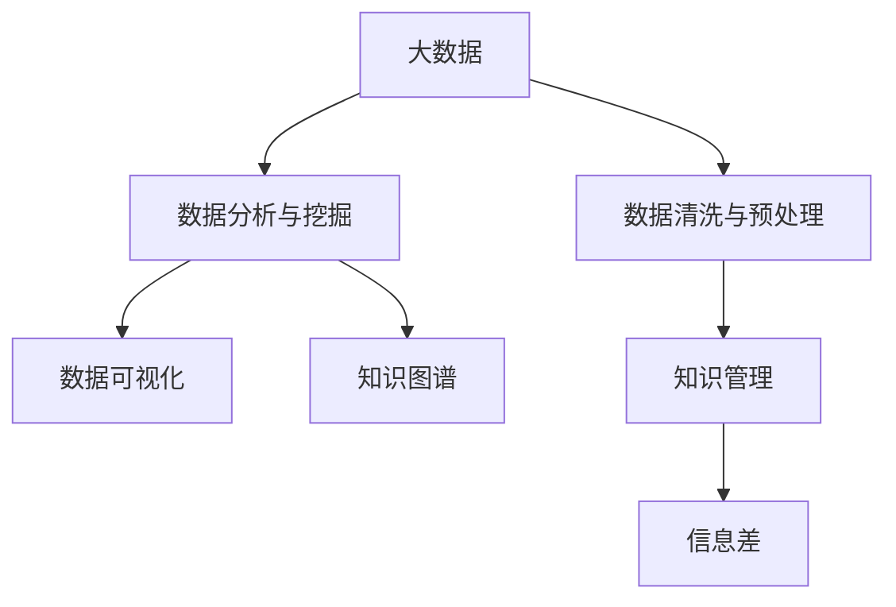

                 

# 信息差的商业知识管理：大数据如何促进知识管理

## 1. 背景介绍

### 1.1 问题由来

在当今数字化和信息化的时代，企业面对的信息量和复杂性前所未有。如何在海量数据中找到有价值的信息，并将其转化为企业的竞争优势，是每个企业都在思考的问题。知识管理（Knowledge Management, KM）成为了企业应对信息爆炸和竞争激烈的关键策略之一。

### 1.2 问题核心关键点

知识管理的基本目的是捕获、存储、共享和使用知识，以支持企业的战略目标和业务流程。大数据（Big Data）的兴起为知识管理提供了新的机遇和挑战。大数据可以为企业提供洞察力，帮助企业更好地理解客户、优化运营、驱动创新。然而，数据量庞大、数据来源多样、数据质量参差不齐等问题，使得企业难以直接从中获取有价值的信息。

### 1.3 问题研究意义

研究和解决如何在信息差异中有效管理和利用大数据，对于提升企业竞争力、促进创新具有重要意义：

1. **提升决策质量**：通过大数据分析，企业可以做出基于事实的决策，减少信息不对称带来的偏差。
2. **优化运营效率**：利用大数据技术，企业可以优化生产流程、降低成本、提高效率。
3. **促进创新**：大数据分析可以帮助企业发现新的商业模式和业务机会，驱动创新。
4. **增强市场竞争力**：通过数据分析，企业可以更好地了解市场需求和竞争格局，提升市场响应速度。
5. **提升员工知识水平**：通过知识共享平台，企业员工可以共享和学习新知识，提升整体知识水平。

## 2. 核心概念与联系

### 2.1 核心概念概述

为更好地理解大数据如何促进知识管理，本节将介绍几个密切相关的核心概念：

- **大数据**：指结构化、半结构化、非结构化数据的大规模集合。通常指数据量巨大、数据来源多样、数据种类繁多、数据更新快速。
- **知识管理**：通过系统的、智能化的方式捕获、组织、共享和应用知识，以支持企业的战略目标和业务流程。
- **信息差**：指企业内部或外部在信息获取、处理和利用方面的差异，包括信息获取的难易程度、信息的完整性和准确性、信息的时效性等。
- **数据清洗与预处理**：在数据分析之前，对数据进行清洗、转换和规范化，以提升数据质量。
- **数据分析与挖掘**：通过统计分析、机器学习等技术，从大数据中提取有用信息，进行模式发现和趋势预测。
- **知识图谱**：一种用图形表示的知识库，用于表示实体及其关系，帮助知识管理系统的知识组织和检索。
- **大数据平台**：用于存储、处理和分析大规模数据的技术和工具集合，包括Hadoop、Spark、Hive等。
- **数据可视化**：将数据转化为图形、图表等直观形式，帮助理解数据背后的信息和趋势。
- **人工智能**：通过模拟人类智能行为，使计算机具备学习、推理、决策等能力，包括机器学习、深度学习等技术。

这些核心概念之间的逻辑关系可以通过以下Mermaid流程图来展示：



这个流程图展示了大数据、数据清洗与预处理、数据分析与挖掘、数据可视化、知识图谱、知识管理以及信息差之间的关系：

1. 大数据通过数据清洗与预处理，提升数据质量。
2. 经过分析与挖掘后，数据转化为可视化的形式，帮助理解数据。
3. 知识图谱将数据转化为知识结构，便于知识管理。
4. 知识管理通过系统化的方式，将知识转化为企业的战略优势。
5. 信息差是知识管理需要解决的根本问题。

## 3. 核心算法原理 & 具体操作步骤

### 3.1 算法原理概述

大数据如何促进知识管理，本质上是一个多步骤、多维度的问题。其核心思想是通过数据分析和挖掘，将大数据转化为可用的知识，并通过知识管理系统进行组织和应用。

形式化地，假设企业有 $D$ 个数据源，每个数据源产生 $N$ 个数据点，记为 $d_{i,j}$，$i=1,2,\cdots,D$，$j=1,2,\cdots,N$。知识管理的目标是从这些数据点中提取有用信息，生成知识库 $\mathcal{K}$，并通过信息差分析，优化知识管理流程，使得知识的应用效果最大化。

知识管理的优化目标是最小化信息差，即：

$$
\min_{\mathcal{K}} \left(\sum_{i=1}^{D}\sum_{j=1}^{N} \left(\delta(d_{i,j},\mathcal{K})\right)^2
$$

其中，$\delta$ 表示信息差，即数据点与知识库之间的差异度量。

### 3.2 算法步骤详解

基于上述目标，企业进行知识管理的一般步骤如下：

**Step 1: 数据收集与预处理**
- 从各个数据源收集数据，并进行清洗、去重、去噪等预处理操作。
- 识别数据中的关键信息，如客户行为、销售记录、市场趋势等。

**Step 2: 数据存储与管理**
- 使用大数据平台如Hadoop、Spark等，存储和管理大规模数据。
- 设计合理的数据库结构，便于数据的检索和分析。

**Step 3: 数据分析与挖掘**
- 使用统计分析、机器学习等技术，从大数据中提取有用信息，进行模式发现和趋势预测。
- 引入人工智能技术，如深度学习，提高数据挖掘的精度和效率。

**Step 4: 知识组织与可视化**
- 使用知识图谱等技术，将分析结果转化为知识结构。
- 将知识结构可视化，通过图形、图表等形式展现，帮助理解和应用。

**Step 5: 知识应用与优化**
- 通过知识管理系统，将知识应用于企业决策、运营优化、客户服务等各个环节。
- 定期评估知识应用效果，识别信息差，进行优化。

**Step 6: 信息差分析与优化**
- 定期进行信息差分析，识别知识管理中的瓶颈和问题。
- 根据分析结果，调整知识管理的策略和流程。

通过上述步骤，企业可以有效地利用大数据，提升知识管理的水平，减少信息差，提升企业的竞争力。

### 3.3 算法优缺点

基于大数据的知识管理方法具有以下优点：

1. **数据驱动决策**：大数据分析可以帮助企业做出基于事实的决策，减少信息不对称带来的偏差。
2. **提高运营效率**：大数据分析可以帮助企业优化生产流程、降低成本、提高效率。
3. **促进创新**：大数据分析可以帮助企业发现新的商业模式和业务机会，驱动创新。
4. **增强市场竞争力**：通过数据分析，企业可以更好地了解市场需求和竞争格局，提升市场响应速度。
5. **提升员工知识水平**：通过知识共享平台，企业员工可以共享和学习新知识，提升整体知识水平。

同时，该方法也存在一定的局限性：

1. **数据隐私和安全性**：大数据分析涉及大量敏感数据，数据隐私和安全问题需要重视。
2. **数据质量问题**：数据质量不高、数据格式不一致等问题，会影响数据分析结果的准确性。
3. **技术复杂性**：大数据分析和人工智能技术的应用，需要较高的技术水平和专业技能。
4. **成本投入高**：大数据分析需要大量的计算资源和存储空间，成本较高。

尽管存在这些局限性，但就目前而言，基于大数据的知识管理方法仍是大企业知识管理的核心范式。未来相关研究的重点在于如何进一步降低技术复杂性、提升数据质量、保障数据隐私和安全。

### 3.4 算法应用领域

基于大数据的知识管理方法，在许多领域都有广泛应用，例如：

- **零售行业**：通过分析客户购买行为和市场趋势，优化库存管理、提升销售转化率。
- **金融行业**：通过分析交易数据和市场动态，进行风险控制、投资决策。
- **制造业**：通过分析生产数据和设备状态，优化生产流程、提高产品质量。
- **医疗行业**：通过分析患者数据和病历，提升医疗服务质量、优化诊疗流程。
- **教育行业**：通过分析学生学习数据，个性化推荐学习内容、优化教学方法。

除了上述这些经典领域，大数据知识管理还在更多新兴领域得到应用，如智能交通、智能城市、智慧农业等，为各行业带来全新的知识管理方式。随着大数据和人工智能技术的不断进步，相信大数据知识管理必将在更广阔的应用领域大放异彩。

## 4. 数学模型和公式 & 详细讲解 & 举例说明

### 4.1 数学模型构建

本节将使用数学语言对基于大数据的知识管理过程进行更加严格的刻画。

记企业收集的数据集合为 $D=\{d_{i,j}\}_{i=1}^D$，每个数据点 $d_{i,j}$ 包含 $k$ 个特征，记为 $x_{i,j}=\{x_{i,j}^1,x_{i,j}^2,\cdots,x_{i,j}^k\}$。假设知识管理的最终目标是从这些数据中提取 $m$ 个关键信息，记为 $\mathcal{K}=\{k_{1},k_{2},\cdots,k_{m}\}$。

知识管理的目标是最小化信息差，即：

$$
\min_{\mathcal{K}} \left(\sum_{i=1}^{D}\sum_{j=1}^{N} \left(\delta(x_{i,j},\mathcal{K})\right)^2
$$

其中，$\delta$ 表示信息差，即数据点与知识库之间的差异度量。

### 4.2 公式推导过程

以下我们以零售行业为例，推导基于大数据的知识管理模型的数学公式。

假设企业从电商平台收集了客户购买行为数据 $D=\{(x_{i,j},y_{i,j})\}_{i=1}^D$，其中 $x_{i,j}$ 表示客户在时间 $i$ 购买商品 $j$ 的特征向量，$y_{i,j}$ 表示客户在时间 $i$ 是否购买商品 $j$ 的标签（0表示未购买，1表示购买）。

定义模型 $M_{\theta}$ 在输入 $x_{i,j}$ 上的预测概率为 $p(y_{i,j}=1|x_{i,j})$，其中 $\theta$ 为模型参数。在训练过程中，模型通过最大化对数似然函数来优化：

$$
\mathcal{L}(\theta) = -\frac{1}{N}\sum_{i=1}^D \sum_{j=1}^N y_{i,j} \log p(y_{i,j}=1|x_{i,j}) + (1-y_{i,j}) \log (1-p(y_{i,j}=1|x_{i,j}))
$$

通过反向传播算法，计算损失函数对参数 $\theta$ 的梯度，并使用优化算法（如Adam、SGD等）更新模型参数，最小化损失函数，得到最优模型参数 $\hat{\theta}$。

在得到最优模型参数后，使用该模型对新数据进行预测，并将预测结果与真实标签进行比较，计算信息差：

$$
\delta(x_{i,j},\mathcal{K}) = y_{i,j} - p(y_{i,j}=1|x_{i,j},\hat{\theta})
$$

通过定期评估信息差，可以识别知识管理中的问题，优化知识库 $\mathcal{K}$。

### 4.3 案例分析与讲解

**案例1：客户行为分析**

一家零售公司希望通过大数据分析提升客户购买转化率。公司收集了客户历史购买数据和行为数据，包括客户的浏览记录、购买记录、评价信息等。通过大数据分析，公司可以发现不同特征（如年龄、性别、地域等）对购买行为的影响，进而优化推荐系统和促销策略，提升客户转化率。

**案例2：库存管理优化**

某电商企业通过大数据分析，发现某些商品的库存周期较长，导致资金占用过多。通过分析销售数据和市场趋势，企业可以优化库存策略，减少库存积压，提高资金利用率。

**案例3：客户流失预测**

一家金融机构希望通过大数据分析预测客户流失概率，以制定客户保留策略。公司收集了客户历史交易数据和行为数据，通过机器学习模型，预测客户的流失概率，提前采取措施，减少客户流失。

这些案例展示了大数据在知识管理中的应用，通过数据驱动的决策和分析，企业可以提升运营效率、降低成本、优化产品和服务。

## 5. 项目实践：代码实例和详细解释说明

### 5.1 开发环境搭建

在进行大数据知识管理实践前，我们需要准备好开发环境。以下是使用Python进行Pandas和Scikit-Learn开发的环境配置流程：

1. 安装Anaconda：从官网下载并安装Anaconda，用于创建独立的Python环境。

2. 创建并激活虚拟环境：
```bash
conda create -n py3-env python=3.8 
conda activate py3-env
```

3. 安装Pandas：
```bash
conda install pandas
```

4. 安装Scikit-Learn：
```bash
conda install scikit-learn
```

5. 安装其他工具包：
```bash
conda install numpy matplotlib seaborn jupyter notebook ipython
```

完成上述步骤后，即可在`py3-env`环境中开始知识管理实践。

### 5.2 源代码详细实现

这里我们以客户行为分析为例，给出使用Pandas和Scikit-Learn对客户数据进行知识管理的PyTorch代码实现。

首先，定义数据预处理函数：

```python
import pandas as pd
from sklearn.model_selection import train_test_split
from sklearn.preprocessing import StandardScaler

def preprocess_data(data_path):
    data = pd.read_csv(data_path)
    # 数据清洗
    data = data.dropna()
    data = data.drop_duplicates()
    # 特征选择
    features = ['age', 'gender', 'region', 'interests', 'buying_history']
    target = 'purchase'
    X = data[features]
    y = data[target]
    # 数据标准化
    scaler = StandardScaler()
    X = scaler.fit_transform(X)
    # 划分训练集和测试集
    X_train, X_test, y_train, y_test = train_test_split(X, y, test_size=0.2, random_state=42)
    return X_train, X_test, y_train, y_test
```

然后，定义模型训练函数：

```python
from sklearn.linear_model import LogisticRegression
from sklearn.metrics import accuracy_score

def train_model(X_train, y_train):
    model = LogisticRegression()
    model.fit(X_train, y_train)
    y_pred = model.predict(X_test)
    acc = accuracy_score(y_test, y_pred)
    return acc
```

接着，定义知识管理评估函数：

```python
def evaluate_km(model, X_test, y_test):
    acc = train_model(X_test, y_test)
    print(f"Accuracy: {acc:.2f}")
```

最后，启动知识管理流程：

```python
# 数据预处理
X_train, X_test, y_train, y_test = preprocess_data('customer_data.csv')

# 模型训练
model = train_model(X_train, y_train)

# 知识管理评估
evaluate_km(model, X_test, y_test)
```

以上就是使用Pandas和Scikit-Learn对客户数据进行知识管理的完整代码实现。可以看到，Pandas和Scikit-Learn的强大封装使得知识管理任务的数据预处理、模型训练和评估变得简洁高效。

### 5.3 代码解读与分析

让我们再详细解读一下关键代码的实现细节：

**preprocess_data函数**：
- `dropna`方法：去除缺失值，确保数据完整性。
- `drop_duplicates`方法：去除重复数据，确保数据一致性。
- `features`选择：根据业务需求选择特征，如年龄、性别、地域、兴趣爱好、购买历史等。
- `StandardScaler`标准化：对数据进行归一化处理，提高模型训练效果。
- `train_test_split`划分：将数据集划分为训练集和测试集，通常以80%作为训练集，20%作为测试集。

**train_model函数**：
- `LogisticRegression`模型：选择逻辑回归模型，简单高效。
- `fit`方法：使用训练数据拟合模型参数。
- `predict`方法：使用测试数据进行预测，并返回预测结果。
- `accuracy_score`方法：计算模型预测的准确率，评估模型效果。

**evaluate_km函数**：
- `train_model`方法：调用训练函数，评估模型性能。
- `print`方法：输出模型评估结果。

通过以上函数，我们可以从数据预处理、模型训练到知识管理评估，完整实现一个基于大数据的知识管理项目。

当然，工业级的系统实现还需考虑更多因素，如数据可视化、知识图谱构建、信息差分析等，但核心的知识管理范式基本与此类似。

## 6. 实际应用场景

### 6.1 智能客服系统

基于大数据的知识管理技术，智能客服系统可以实现更高效、更智能的客户服务。智能客服系统通过分析历史客服记录和客户行为数据，构建知识库，优化客服策略，实现客户需求自动匹配和智能回复。

在技术实现上，可以收集客户历史对话记录、常见问题及其解决方案，构建知识库，并使用机器学习模型训练客服机器人。通过知识库和机器学习模型的结合，智能客服系统可以自动识别客户需求，并提供个性化的智能回复，提高客户满意度。

### 6.2 金融风险控制

金融行业可以通过大数据知识管理技术，提升风险控制能力。金融机构可以收集客户交易数据、市场动态、信用评分等信息，构建知识库，并通过机器学习模型进行风险预测。

在实践应用中，可以使用深度学习模型，如卷积神经网络（CNN）、循环神经网络（RNN）等，对交易数据进行特征提取和模式发现，预测客户是否存在违约风险。通过定期更新知识库，金融机构可以及时调整风险控制策略，降低违约率，提高资金安全性。

### 6.3 健康医疗管理

健康医疗行业可以通过大数据知识管理技术，提升医疗服务质量和效率。医疗机构可以收集患者病历、健康数据、治疗效果等信息，构建知识库，并通过机器学习模型进行疾病预测和个性化治疗方案推荐。

在实践应用中，可以使用自然语言处理技术，从患者病历中提取关键信息，并使用深度学习模型进行疾病预测。通过定期更新知识库，医疗机构可以提供更加个性化、精准的医疗服务，提高患者满意度。

### 6.4 未来应用展望

随着大数据和人工智能技术的不断进步，基于大数据的知识管理技术将在更多领域得到应用，为各行各业带来变革性影响。

在智慧医疗领域，基于大数据的知识管理技术将提升医疗服务的智能化水平，辅助医生诊疗，加速新药开发进程。

在智能教育领域，大数据知识管理技术可以应用于作业批改、学情分析、知识推荐等方面，因材施教，促进教育公平，提高教学质量。

在智慧城市治理中，大数据知识管理技术可应用于城市事件监测、舆情分析、应急指挥等环节，提高城市管理的自动化和智能化水平，构建更安全、高效的未来城市。

此外，在企业生产、社会治理、文娱传媒等众多领域，基于大数据的知识管理技术也将不断涌现，为传统行业数字化转型升级提供新的技术路径。相信随着技术的日益成熟，大数据知识管理技术将成为各行各业知识管理的重要手段，促进数据驱动的决策和应用。

## 7. 工具和资源推荐

### 7.1 学习资源推荐

为了帮助开发者系统掌握大数据如何促进知识管理的技术基础和实践技巧，这里推荐一些优质的学习资源：

1. 《大数据技术与应用》系列博文：由大数据领域专家撰写，深入浅出地介绍了大数据技术的基本概念和应用场景。

2. 《Python数据科学手册》书籍：由数据科学专家撰写，系统讲解了Python在数据科学中的应用，包括Pandas、Scikit-Learn等工具的使用。

3. 《机器学习实战》书籍：由机器学习专家撰写，详细介绍了机器学习算法的实现和应用，适合初学者入门。

4. 《深度学习》课程：斯坦福大学开设的深度学习课程，有Lecture视频和配套作业，带你系统学习深度学习的基础和应用。

5. Kaggle：数据科学和机器学习竞赛平台，提供大量真实数据集和优秀代码，可以练习和提升大数据知识管理技能。

通过对这些资源的学习实践，相信你一定能够快速掌握大数据如何促进知识管理的精髓，并用于解决实际的商业问题。

### 7.2 开发工具推荐

高效的开发离不开优秀的工具支持。以下是几款用于大数据知识管理开发的常用工具：

1. Python：灵活的脚本语言，适用于数据预处理、机器学习等任务。

2. Pandas：强大的数据分析工具，提供丰富的数据处理功能，如数据清洗、转换等。

3. Scikit-Learn：简单易用的机器学习库，包含多种经典算法，如回归、分类、聚类等。

4. Hadoop：分布式计算框架，用于存储、处理和分析大规模数据。

5. Spark：快速的分布式计算框架，支持多种数据处理任务，如Spark SQL、Spark Streaming等。

6. Jupyter Notebook：交互式编程环境，支持Python、R等多种语言，方便代码调试和数据分析。

合理利用这些工具，可以显著提升大数据知识管理的开发效率，加快创新迭代的步伐。

### 7.3 相关论文推荐

大数据如何促进知识管理的研究源于学界的持续研究。以下是几篇奠基性的相关论文，推荐阅读：

1. Big Data: Principles and Best Practices of Scalable Real-time Data Systems：介绍大数据技术的架构和应用，是学习大数据知识管理的必读文献。

2. A Survey on Knowledge Discovery in Databases：综述知识发现技术的发展和应用，涵盖数据预处理、特征提取、模式发现等多个方面。

3. Deep Learning with Big Data：介绍深度学习在大数据中的应用，涵盖深度神经网络、卷积神经网络、循环神经网络等技术。

4. Data-Driven Business Intelligence with Big Data：介绍大数据在商业智能中的应用，涵盖数据可视化、数据挖掘、知识管理等多个方面。

5. Machine Learning Yearning：由深度学习专家Andrew Ng撰写，详细介绍了机器学习在实际应用中的技巧和经验，适合大数据知识管理的实践者阅读。

这些论文代表了大数据知识管理的研究脉络。通过学习这些前沿成果，可以帮助研究者把握学科前进方向，激发更多的创新灵感。

## 8. 总结：未来发展趋势与挑战

### 8.1 总结

本文对基于大数据的知识管理方法进行了全面系统的介绍。首先阐述了大数据在知识管理中的重要作用，明确了大数据如何通过数据分析和挖掘，将大数据转化为可用的知识，提升企业决策和运营效率。其次，从原理到实践，详细讲解了知识管理的数学模型和操作步骤，给出了知识管理任务开发的完整代码实例。同时，本文还广泛探讨了知识管理方法在多个行业领域的应用前景，展示了大数据知识管理的广泛潜力。最后，本文精选了知识管理技术的各类学习资源，力求为读者提供全方位的技术指引。

通过本文的系统梳理，可以看到，基于大数据的知识管理方法正在成为知识管理的重要范式，极大地拓展了企业的知识获取和应用边界，促进了数据驱动的决策和运营。未来，伴随大数据和人工智能技术的不断进步，基于大数据的知识管理技术必将进一步提升企业的智能化水平，助力企业在激烈的市场竞争中脱颖而出。

### 8.2 未来发展趋势

展望未来，基于大数据的知识管理技术将呈现以下几个发展趋势：

1. **数据规模和多样性**：随着数据采集技术的发展，企业可以采集更多的数据，包括结构化、半结构化和非结构化数据。同时，数据来源将更加多样，包括物联网设备、社交媒体、金融交易等。

2. **数据分析深度和广度**：大数据分析将从简单的描述性分析，逐步向预测性分析、解释性分析和因果分析发展。通过深度学习和人工智能技术，企业可以从大规模数据中提取更有价值的知识。

3. **知识管理自动化**：随着自动机器学习（AutoML）和知识图谱等技术的发展，知识管理将变得更加自动化。机器学习算法可以自动选择特征、模型和参数，知识图谱可以自动构建和更新，提升知识管理效率。

4. **实时知识管理**：随着流式数据处理和实时计算技术的发展，企业可以实时分析数据，及时获取知识，快速响应市场变化。

5. **多模态知识融合**：大数据不仅包括文本数据，还包括图像、视频、音频等多模态数据。未来，知识管理将融合多种模态的数据，提升对复杂问题的理解和处理能力。

6. **跨领域知识管理**：大数据知识管理将突破领域限制，跨越不同业务部门和领域，形成企业内部的知识网络，提升整体知识水平。

以上趋势凸显了大数据知识管理技术的广阔前景。这些方向的探索发展，必将进一步提升知识管理的效率和精度，为企业的战略决策和运营优化提供更有力的支持。

### 8.3 面临的挑战

尽管基于大数据的知识管理技术已经取得了显著成果，但在迈向更加智能化、普适化应用的过程中，它仍面临着诸多挑战：

1. **数据隐私和安全**：大数据分析涉及大量敏感数据，数据隐私和安全问题需要重视。如何确保数据的安全性和合法使用，是知识管理的重要挑战。

2. **数据质量问题**：数据质量不高、数据格式不一致等问题，会影响数据分析结果的准确性。如何提升数据质量，减少数据清洗和预处理的工作量，是知识管理的核心问题。

3. **技术复杂性**：大数据分析和人工智能技术的应用，需要较高的技术水平和专业技能。如何降低技术门槛，提升技术普及度，是知识管理的难点。

4. **成本投入高**：大数据分析需要大量的计算资源和存储空间，成本较高。如何优化资源配置，降低技术成本，是知识管理的现实问题。

5. **知识孤岛**：不同部门和业务领域的数据和知识往往孤立存在，难以形成统一的知识管理平台。如何打破知识孤岛，形成跨领域、跨部门的统一知识体系，是知识管理的瓶颈。

6. **知识更新和管理**：知识管理需要持续更新，以应对快速变化的市场和业务需求。如何高效管理和维护知识库，提升知识的时效性，是知识管理的长期挑战。

正视知识管理面临的这些挑战，积极应对并寻求突破，将是大数据知识管理技术迈向成熟的必由之路。相信随着学界和产业界的共同努力，这些挑战终将一一被克服，大数据知识管理技术必将在构建智能企业中发挥更大的作用。

### 8.4 研究展望

面对大数据知识管理所面临的挑战，未来的研究需要在以下几个方面寻求新的突破：

1. **知识图谱与知识管理结合**：利用知识图谱技术，将知识转化为结构化的知识库，提升知识管理的效率和精度。

2. **多模态数据分析**：融合文本、图像、视频等多种模态的数据，提升对复杂问题的理解和处理能力。

3. **自适应知识管理**：引入自适应学习算法，动态调整知识管理策略，提升知识管理的时效性和灵活性。

4. **知识管理系统集成**：构建统一的跨领域知识管理系统，打破知识孤岛，形成企业内部的知识网络。

5. **自动化知识管理**：利用自动机器学习和自动化工具，降低知识管理的复杂性和工作量，提升知识管理的普及度。

6. **知识管理的伦理和安全**：引入伦理和安全导向的评估指标，过滤和惩罚有害信息，保障知识管理的安全性和合法性。

这些研究方向的探索，必将引领大数据知识管理技术迈向更高的台阶，为企业的智能转型和知识创新提供新的动力。面向未来，大数据知识管理技术还需要与其他人工智能技术进行更深入的融合，如知识表示、因果推理、强化学习等，多路径协同发力，共同推动企业的智能化进程。只有勇于创新、敢于突破，才能不断拓展知识管理的边界，让大数据技术更好地造福企业和社会。

## 9. 附录：常见问题与解答

**Q1：大数据知识管理如何与传统知识管理结合？**

A: 大数据知识管理与传统知识管理并不是相互排斥的，而是相辅相成的。传统知识管理主要依赖于人工整理和总结的知识，而大数据知识管理则通过数据分析和挖掘，自动发现知识。通过将大数据分析与传统知识管理相结合，企业可以充分发挥两者的优势，提升知识管理的效率和精度。

**Q2：如何选择适合的知识管理工具？**

A: 选择适合的知识管理工具需要考虑以下几个因素：

1. 企业的需求：选择能够满足企业知识管理需求的工具，如数据清洗、数据可视化、知识图谱构建等。
2. 技术的成熟度：选择技术成熟、稳定可靠的工具，避免技术风险。
3. 易用性：选择易于上手、操作简单、界面友好的工具，提高知识管理的效率。
4. 成本和性价比：选择性价比高的工具，避免高成本投入。
5. 社区和支持：选择有活跃社区和良好技术支持的工具，方便问题解决和知识共享。

**Q3：如何提升大数据知识管理的效率？**

A: 提升大数据知识管理的效率需要从以下几个方面入手：

1. 数据质量控制：通过数据清洗和预处理，提升数据质量，减少数据噪声和冗余。
2. 自动化流程：引入自动机器学习和自动化工具，简化知识管理流程，减少人工干预。
3. 知识图谱构建：利用知识图谱技术，自动构建和更新知识库，提升知识管理的效率和精度。
4. 数据可视化：将知识管理的结果可视化，便于理解和管理。
5. 实时分析：利用流式数据处理和实时计算技术，实现实时知识管理，快速响应市场变化。

**Q4：大数据知识管理面临哪些安全问题？**

A: 大数据知识管理面临以下安全问题：

1. 数据隐私：大数据分析涉及大量敏感数据，如客户个人信息、交易记录等，需要采取数据加密、匿名化等措施，保护数据隐私。
2. 数据篡改：大数据分析结果可能被恶意篡改，影响决策准确性，需要加强数据完整性验证和防篡改措施。
3. 数据泄露：大数据分析过程中，可能泄露企业内部的敏感信息，需要采取数据访问控制和权限管理措施，保护数据安全。
4. 模型鲁棒性：大数据分析模型可能存在鲁棒性不足的问题，容易被恶意数据攻击，需要加强模型鲁棒性检测和防护。

通过采取上述措施，可以有效提升大数据知识管理的安全性，保障数据和模型的安全。

通过本文的系统梳理，可以看到，基于大数据的知识管理方法正在成为知识管理的重要范式，极大地拓展了企业的知识获取和应用边界，促进了数据驱动的决策和运营。未来，伴随大数据和人工智能技术的不断进步，基于大数据的知识管理技术必将进一步提升企业的智能化水平，助力企业在激烈的市场竞争中脱颖而出。面向未来，大数据知识管理技术还需要与其他人工智能技术进行更深入的融合，如知识表示、因果推理、强化学习等，多路径协同发力，共同推动企业的智能化进程。只有勇于创新、敢于突破，才能不断拓展知识管理的边界，让大数据技术更好地造福企业和社会。

