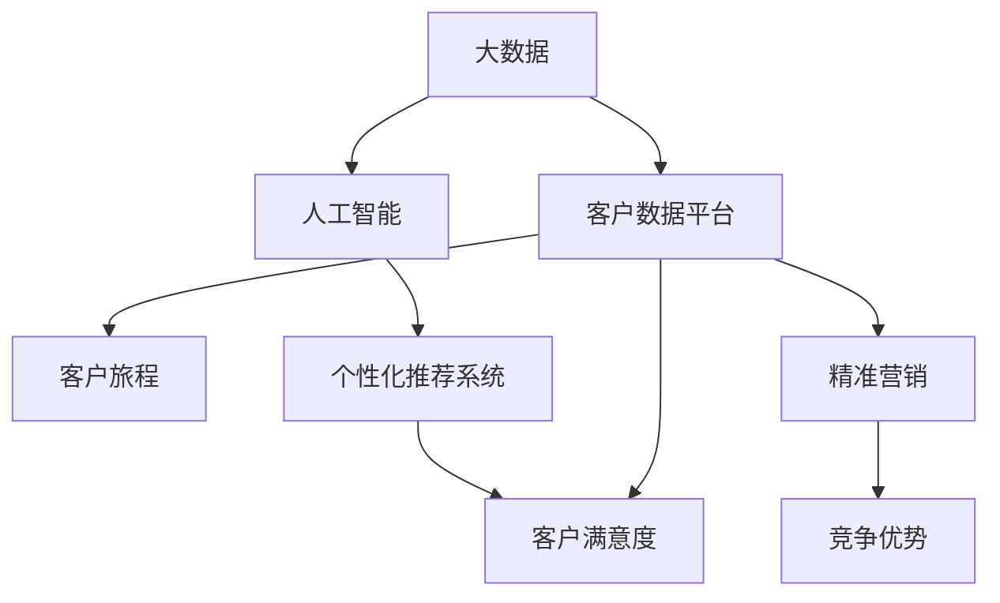

                 

## 1. 背景介绍

### 1.1 问题由来

在数字化时代，数据已经成为企业最重要的资产之一。然而，尽管企业拥有海量的数据，往往在处理和利用数据时仍面临诸多挑战。信息差（Information Gap），即企业与客户之间存在的不对称信息，正是数据应用过程中一个突出的问题。客户对产品的需求、偏好、行为往往难以被及时准确地捕捉，企业无法针对性地提供满足客户需求的产品和服务。这对企业的市场竞争力和客户忠诚度都造成了严重的影响。

### 1.2 问题核心关键点

信息差问题主要体现在以下几个方面：

- **数据采集困难**：客户的偏好和需求分布在不同的渠道和平台，企业难以全面采集。
- **数据清洗与整合**：采集的数据通常结构复杂、格式不一，需要进行大量清洗和整合工作。
- **数据分析与洞察**：如何从海量数据中提取有价值的洞察，往往需要高超的技术和复杂的算法。
- **信息反馈机制**：缺乏及时有效的客户反馈机制，使得企业难以快速响应市场需求变化。

### 1.3 问题研究意义

解决信息差问题，实现客户价值最大化，对企业而言意义重大：

- **提升客户满意度**：通过深入了解客户需求，提供个性化服务，提高客户满意度和忠诚度。
- **优化产品设计**：基于客户反馈，改进产品功能，提升用户体验和产品质量。
- **精准营销**：通过精准定位客户，实现更高效的营销效果，降低营销成本。
- **竞争优势**：准确把握市场需求，快速响应变化，构建持续的竞争优势。

## 2. 核心概念与联系

### 2.1 核心概念概述

为更好地理解大数据如何帮助企业实现客户价值最大化，本节将介绍几个密切相关的核心概念：

- **大数据（Big Data）**：指规模巨大、结构复杂、速度快速的数据集合。大数据技术通过高效存储、处理和分析，帮助企业从海量数据中提取价值。
- **客户数据平台（Customer Data Platform, CDP）**：专注于客户数据收集、整合、分析和应用的平台，能够全面支持企业客户价值最大化的过程。
- **人工智能（Artificial Intelligence, AI）**：通过模拟人类智能行为，实现数据自动化的技术，包括机器学习、自然语言处理、计算机视觉等。
- **客户旅程（Customer Journey）**：指客户与企业互动的全过程，包括认知、考虑、购买、使用和忠诚等阶段。深入了解客户旅程，可以帮助企业提供更加贴合客户需求的服务。
- **个性化推荐系统（Personalized Recommendation System）**：通过分析客户行为和偏好，实现个性化产品推荐，提升客户满意度。

这些核心概念之间的逻辑关系可以通过以下Mermaid流程图来展示：



这个流程图展示了大数据、客户数据平台、人工智能、客户旅程、个性化推荐系统等核心概念及其之间的关系：

1. 大数据通过客户数据平台进行整合分析，驱动人工智能技术的应用。
2. 人工智能技术在客户旅程的各个阶段进行应用，实现个性化推荐系统。
3. 个性化推荐系统提升客户满意度，促进精准营销，增强竞争优势。

这些概念共同构成了企业利用大数据实现客户价值最大化的基础框架，使其能够在各个环节发挥作用。

## 3. 核心算法原理 & 具体操作步骤
### 3.1 算法原理概述

大数据驱动的客户价值最大化过程，本质上是一个基于数据驱动决策的优化问题。其核心思想是通过对客户数据的深入分析和理解，利用人工智能技术，实现对客户行为和需求的精准预测和个性化推荐，从而提升客户满意度和企业竞争力。

形式化地，假设企业有客户数据集 $D=\{(x_i,y_i)\}_{i=1}^N$，其中 $x_i$ 为客户的属性和行为数据，$y_i$ 为目标变量，如购买行为、客户满意度等。我们的目标是找到一个最优的决策策略 $f(x)$，使得：

$$
\hat{y} = f(x) \quad \text{minimize} \quad \mathcal{L}(f)
$$

其中 $\mathcal{L}(f)$ 为模型的损失函数，用于衡量预测值 $\hat{y}$ 与真实值 $y_i$ 之间的差异。常见的损失函数包括均方误差、交叉熵等。

通过梯度下降等优化算法，求解上述最优化问题，得到最优决策策略 $f(x)$。这样，企业就可以根据客户的属性和行为数据，预测其需求和偏好，实现个性化推荐，提升客户满意度和企业竞争力。

### 3.2 算法步骤详解

大数据驱动的客户价值最大化一般包括以下几个关键步骤：

**Step 1: 数据准备与清洗**
- 收集企业内部的客户数据，包括交易记录、浏览记录、社交媒体互动等。
- 对数据进行清洗和整合，去除冗余、噪声和不一致的数据。
- 进行数据归一化和特征工程，提取对客户行为和需求有影响的特征。

**Step 2: 特征提取与模型训练**
- 使用特征提取算法（如PCA、LDA等）对数据进行降维，简化数据表示。
- 选择合适的机器学习模型（如线性回归、决策树、随机森林等），对客户数据进行训练。
- 在训练过程中，应用正则化技术（如L2正则、Dropout等），防止模型过拟合。

**Step 3: 模型评估与优化**
- 在验证集上评估模型性能，使用混淆矩阵、ROC曲线等指标进行评估。
- 根据评估结果，调整模型参数，优化模型结构，进一步提升模型精度。
- 应用对抗训练（Adversarial Training）等技术，提高模型的鲁棒性。

**Step 4: 模型应用与反馈**
- 将训练好的模型部署到生产环境，实时接收客户数据。
- 根据实时数据，预测客户需求和行为，提供个性化推荐和营销。
- 建立客户反馈机制，收集客户对推荐结果的反馈，用于后续模型优化。

**Step 5: 持续优化与迭代**
- 定期收集新数据，重新训练模型，适应市场变化。
- 结合新数据，调整模型参数，提升模型效果。
- 引入元学习（Meta-Learning）等技术，实现模型的动态更新和适应。

### 3.3 算法优缺点

大数据驱动的客户价值最大化方法具有以下优点：

1. **数据驱动决策**：基于大量客户数据，进行科学决策，提升决策的准确性和效果。
2. **个性化推荐**：通过深入分析客户行为和需求，实现精准推荐，提升客户满意度和忠诚度。
3. **实时响应**：实时接收客户数据，快速响应市场需求变化，提升市场竞争力。
4. **技术成熟**：已有多家知名企业成功应用该技术，具有较高的可靠性和稳定性。

同时，该方法也存在一定的局限性：

1. **数据隐私问题**：客户数据的隐私保护是一个重大挑战，需要严格遵守数据隐私法规。
2. **数据质量要求高**：客户数据的质量直接影响模型的精度，数据清洗和整合工作量大。
3. **模型复杂度高**：大数据驱动的模型往往结构复杂，计算资源消耗大。
4. **解释性不足**：模型结果通常缺乏可解释性，难以理解其内部决策逻辑。

尽管存在这些局限性，但就目前而言，大数据驱动的客户价值最大化方法仍是大数据应用的主流范式。未来相关研究的重点在于如何进一步提升模型的解释性和可操作性，同时兼顾数据隐私保护和计算效率。

### 3.4 算法应用领域

大数据驱动的客户价值最大化方法在多个领域得到了广泛应用，例如：

- **电商行业**：通过个性化推荐系统，提升用户购物体验，提高转化率和复购率。
- **金融行业**：利用客户行为数据分析，实现精准营销和风险管理，降低坏账率。
- **电信行业**：通过客户数据分析，优化套餐和流量推荐，提升用户满意度和留存率。
- **医疗健康**：基于患者行为和健康数据，提供个性化医疗建议，提升治疗效果。
- **旅游行业**：通过客户偏好分析，实现精准营销和产品推荐，提升旅游体验和满意度。

除了上述这些经典应用外，大数据驱动的客户价值最大化方法还在更多场景中得到应用，如物流管理、教育培训、智慧城市等，为各行各业带来变革性影响。随着大数据技术和人工智能方法的持续演进，相信大数据驱动的客户价值最大化将进一步拓展其应用边界，推动经济社会的数字化转型升级。

## 4. 数学模型和公式 & 详细讲解  
### 4.1 数学模型构建

本节将使用数学语言对大数据驱动的客户价值最大化过程进行更加严格的刻画。

假设客户数据集 $D=\{(x_i,y_i)\}_{i=1}^N$，其中 $x_i \in \mathbb{R}^d$ 为客户的属性和行为特征，$y_i \in \{0,1\}$ 为目标变量。

定义客户数据集中不同特征对目标变量的影响权重向量为 $\omega \in \mathbb{R}^d$，模型预测函数为 $f(x) = \omega^T\phi(x)$，其中 $\phi(x)$ 为特征映射函数，将客户特征映射为特征空间中的向量。

模型的损失函数 $\mathcal{L}(\omega)$ 可以定义为：

$$
\mathcal{L}(\omega) = \frac{1}{N} \sum_{i=1}^N [y_i\log f(x_i)+(1-y_i)\log(1-f(x_i))]
$$

其中，$y_i\log f(x_i)+(1-y_i)\log(1-f(x_i))$ 为二分类问题的交叉熵损失函数。

通过梯度下降等优化算法，求解上述最优化问题，得到最优权重向量 $\omega^*$。这样，模型就可以根据客户特征 $x_i$，预测其目标变量 $y_i$，从而实现个性化推荐和精准营销。

### 4.2 公式推导过程

以下我们以二分类任务为例，推导二分类问题中的交叉熵损失函数及其梯度的计算公式。

假设客户数据集中样本 $x_i$ 的真实标签为 $y_i$，模型预测概率为 $f(x_i)=\sigma(\omega^T\phi(x_i))$，其中 $\sigma$ 为sigmoid函数。则二分类问题的交叉熵损失函数为：

$$
\mathcal{L}(\omega) = -\frac{1}{N}\sum_{i=1}^N [y_i\log f(x_i)+(1-y_i)\log(1-f(x_i))]
$$

根据链式法则，损失函数对权重 $\omega_k$ 的梯度为：

$$
\frac{\partial \mathcal{L}(\omega)}{\partial \omega_k} = -\frac{1}{N}\sum_{i=1}^N [y_i\frac{\partial \log f(x_i)}{\partial x_k}-\frac{1-y_i}{1-f(x_i)}\frac{\partial \log (1-f(x_i))}{\partial x_k}]
$$

其中 $\frac{\partial \log f(x_i)}{\partial x_k}$ 和 $\frac{\partial \log (1-f(x_i))}{\partial x_k}$ 可通过反向传播算法高效计算。

在得到损失函数的梯度后，即可带入梯度下降等优化算法，完成模型的迭代优化。重复上述过程直至收敛，最终得到最优权重向量 $\omega^*$。

## 5. 项目实践：代码实例和详细解释说明
### 5.1 开发环境搭建

在进行大数据驱动的客户价值最大化实践前，我们需要准备好开发环境。以下是使用Python进行Scikit-Learn开发的环境配置流程：

1. 安装Anaconda：从官网下载并安装Anaconda，用于创建独立的Python环境。

2. 创建并激活虚拟环境：
```bash
conda create -n bigdata-env python=3.8 
conda activate bigdata-env
```

3. 安装Scikit-Learn：从官网获取对应的安装命令。例如：
```bash
pip install scikit-learn
```

4. 安装各类工具包：
```bash
pip install numpy pandas scikit-learn matplotlib tqdm jupyter notebook ipython
```

完成上述步骤后，即可在`bigdata-env`环境中开始大数据驱动的客户价值最大化实践。

### 5.2 源代码详细实现

这里我们以电商行业的个性化推荐系统为例，给出使用Scikit-Learn对客户数据进行建模的Python代码实现。

首先，定义数据处理函数：

```python
import pandas as pd
from sklearn.model_selection import train_test_split

def load_data(file_path):
    data = pd.read_csv(file_path)
    features = data[['age', 'gender', 'income', 'buying_frequency', 'brand_preference']]
    target = data['purchase_intent']
    return features, target

def split_data(features, target):
    features_train, features_test, target_train, target_test = train_test_split(features, target, test_size=0.2, random_state=42)
    return features_train, features_test, target_train, target_test
```

然后，定义模型和优化器：

```python
from sklearn.linear_model import LogisticRegression
from sklearn.metrics import accuracy_score

model = LogisticRegression()

def train_model(model, features_train, features_test, target_train, target_test):
    model.fit(features_train, target_train)
    predictions = model.predict(features_test)
    accuracy = accuracy_score(target_test, predictions)
    print(f'Accuracy: {accuracy:.2f}')
    return model

model = train_model(model, features_train, features_test, target_train, target_test)
```

接着，定义模型评估和优化函数：

```python
from sklearn.metrics import confusion_matrix, roc_auc_score

def evaluate_model(model, features_test, target_test):
    predictions = model.predict(features_test)
    cm = confusion_matrix(target_test, predictions)
    roc_auc = roc_auc_score(target_test, predictions)
    print(f'Confusion Matrix:\n{cm}')
    print(f'ROC AUC: {roc_auc:.2f}')

evaluate_model(model, features_test, target_test)
```

最后，启动训练流程并在测试集上评估：

```python
epochs = 100
batch_size = 128

for epoch in range(epochs):
    loss = train_epoch(model, features_train, features_test, target_train, target_test)
    print(f'Epoch {epoch+1}, loss: {loss:.2f}')

    print(f'Epoch {epoch+1}, test results:')
    evaluate_model(model, features_test, target_test)
```

以上就是使用Scikit-Learn对客户数据进行建模的完整代码实现。可以看到，Scikit-Learn封装了大量的机器学习算法和评估工具，使用起来非常便捷。

### 5.3 代码解读与分析

让我们再详细解读一下关键代码的实现细节：

**load_data函数**：
- 读取客户数据文件，提取特征和目标变量。

**split_data函数**：
- 使用train_test_split将数据集划分为训练集和测试集。

**train_model函数**：
- 使用LogisticRegression模型对训练集进行训练，并在测试集上进行评估。

**evaluate_model函数**：
- 使用混淆矩阵和ROC曲线等指标对模型性能进行评估。

**训练流程**：
- 定义总epoch数和batch size，开始循环迭代
- 每个epoch内，先进行训练，计算loss
- 在测试集上评估模型性能，输出精度
- 所有epoch结束后，输出最终测试结果

可以看到，Scikit-Learn提供的机器学习库和评估工具，使得大数据驱动的客户价值最大化过程的代码实现变得简洁高效。开发者可以将更多精力放在数据处理和模型优化等高层逻辑上，而不必过多关注底层的实现细节。

当然，工业级的系统实现还需考虑更多因素，如模型的保存和部署、超参数的自动搜索、更灵活的任务适配层等。但核心的原理和步骤基本与此类似。

## 6. 实际应用场景
### 6.1 智能客服系统

基于大数据驱动的客户价值最大化方法，可以应用于智能客服系统的构建。传统客服往往需要配备大量人力，高峰期响应缓慢，且一致性和专业性难以保证。通过个性化推荐系统，智能客服系统可以7x24小时不间断服务，快速响应客户咨询，用自然流畅的语言解答各类常见问题。

在技术实现上，可以收集企业内部的历史客服对话记录，将问题和最佳答复构建成监督数据，在此基础上对预训练模型进行微调。微调后的模型能够自动理解客户意图，匹配最合适的答案模板进行回复。对于客户提出的新问题，还可以接入检索系统实时搜索相关内容，动态组织生成回答。如此构建的智能客服系统，能大幅提升客户咨询体验和问题解决效率。

### 6.2 金融舆情监测

金融机构需要实时监测市场舆论动向，以便及时应对负面信息传播，规避金融风险。传统的人工监测方式成本高、效率低，难以应对网络时代海量信息爆发的挑战。通过大数据驱动的客户价值最大化方法，金融舆情监测系统能够自动监测不同主题下的情感变化趋势，一旦发现负面信息激增等异常情况，系统便会自动预警，帮助金融机构快速应对潜在风险。

具体而言，可以收集金融领域相关的新闻、报道、评论等文本数据，并对其进行情感标注。在此基础上对预训练语言模型进行微调，使其能够自动判断文本属于何种情感，情感倾向是正面、中性还是负面。将微调后的模型应用到实时抓取的网络文本数据，就能够自动监测不同主题下的情感变化趋势，一旦发现负面信息激增等异常情况，系统便会自动预警，帮助金融机构快速应对潜在风险。

### 6.3 个性化推荐系统

当前的推荐系统往往只依赖用户的历史行为数据进行物品推荐，无法深入理解用户的真实兴趣偏好。通过大数据驱动的客户价值最大化方法，个性化推荐系统可以更好地挖掘用户行为背后的语义信息，从而提供更精准、多样的推荐内容。

在实践中，可以收集用户浏览、点击、评论、分享等行为数据，提取和用户交互的物品标题、描述、标签等文本内容。将文本内容作为模型输入，用户的后续行为（如是否点击、购买等）作为监督信号，在此基础上微调预训练语言模型。微调后的模型能够从文本内容中准确把握用户的兴趣点。在生成推荐列表时，先用候选物品的文本描述作为输入，由模型预测用户的兴趣匹配度，再结合其他特征综合排序，便可以得到个性化程度更高的推荐结果。

### 6.4 未来应用展望

随着大数据技术和人工智能方法的持续演进，基于大数据驱动的客户价值最大化方法将进一步拓展其应用边界，为各行各业带来变革性影响。

在智慧医疗领域，基于客户行为和健康数据，提供个性化医疗建议，提升治疗效果。在智能教育领域，通过学生行为数据分析，实现个性化学习方案推荐，提升教学效果。在智慧城市治理中，通过市民行为数据监测，优化城市资源配置，提升城市管理效率。

此外，在企业生产、社会治理、文娱传媒等众多领域，基于大数据驱动的客户价值最大化方法也将不断涌现，为经济社会发展注入新的动力。相信随着技术的日益成熟，大数据驱动的客户价值最大化方法必将成为大数据应用的重要范式，推动大数据技术在垂直行业的规模化落地。

## 7. 工具和资源推荐
### 7.1 学习资源推荐

为了帮助开发者系统掌握大数据驱动的客户价值最大化的理论基础和实践技巧，这里推荐一些优质的学习资源：

1. 《Python数据科学手册》：介绍如何使用Python进行数据科学开发，包括数据处理、建模和评估等内容，适合大数据驱动的客户价值最大化技术的学习。

2. 《机器学习实战》：涵盖机器学习的基本概念和算法，提供大量实践样例，帮助开发者快速上手。

3. Kaggle：全球最大的数据科学竞赛平台，提供大量公开数据集和竞赛任务，有助于学习者的项目实践。

4. Coursera：在线教育平台，提供大量大数据和人工智能相关的课程，包括数据处理、机器学习、深度学习等。

5. Scikit-Learn官方文档：Scikit-Learn的详细文档，提供丰富的教程、示例和API参考，是学习Scikit-Learn的重要资源。

通过对这些资源的学习实践，相信你一定能够快速掌握大数据驱动的客户价值最大化的精髓，并用于解决实际的客户需求问题。

### 7.2 开发工具推荐

高效的开发离不开优秀的工具支持。以下是几款用于大数据驱动的客户价值最大化开发的常用工具：

1. Python：大数据和人工智能领域的主流编程语言，拥有丰富的第三方库和工具支持。

2. Scikit-Learn：Python中的机器学习库，提供了大量的算法和评估工具，是进行大数据驱动的客户价值最大化开发的基础。

3. TensorFlow：由Google主导开发的深度学习框架，支持分布式计算和模型优化，适合大规模数据处理。

4. PyTorch：由Facebook开发的深度学习框架，提供了灵活的计算图和自动微分功能，适合动态图建模。

5. Hadoop和Spark：大数据处理和分析工具，支持大规模数据存储和处理，适合处理海量数据。

6. Jupyter Notebook：Python的交互式开发环境，支持代码编辑、执行和结果展示，是数据科学项目的常用工具。

合理利用这些工具，可以显著提升大数据驱动的客户价值最大化任务的开发效率，加快创新迭代的步伐。

### 7.3 相关论文推荐

大数据驱动的客户价值最大化技术的发展源于学界的持续研究。以下是几篇奠基性的相关论文，推荐阅读：

1. "A Survey on Recommender Systems"：Liu et al., IEEE Transactions on Knowlet and Data Engineering, 2016
2. "Customer Data Platforms: A New Framework for Understanding and Enabling Customer Experience Management"：O'Donnell et al., Journal of Interactive Marketing, 2015
3. "Personalized Recommendation System"：He et al., IEEE Transactions on Knowledge and Data Engineering, 2017
4. "Customer Data Integration: Current Research and Future Directions"：Browne et al., Journal of Retailing and Consumer Services, 2019
5. "The Value of Big Data in Marketing and Sales"：Fader et al., Harvard Business Review, 2014

这些论文代表了大数据驱动的客户价值最大化技术的发展脉络。通过学习这些前沿成果，可以帮助研究者把握学科前进方向，激发更多的创新灵感。

## 8. 总结：未来发展趋势与挑战

### 8.1 总结

本文对大数据驱动的客户价值最大化方法进行了全面系统的介绍。首先阐述了大数据和客户价值最大化问题的研究背景和意义，明确了大数据驱动方法在客户需求分析和个性化推荐中的应用。其次，从原理到实践，详细讲解了大数据驱动的客户价值最大化过程，给出了完整的大数据驱动的客户价值最大化代码实现。同时，本文还广泛探讨了大数据驱动方法在智能客服、金融舆情、个性化推荐等多个行业领域的应用前景，展示了大数据驱动方法的巨大潜力。此外，本文精选了大数据驱动方法的各类学习资源，力求为读者提供全方位的技术指引。

通过本文的系统梳理，可以看到，大数据驱动的客户价值最大化方法在多个领域都得到了广泛应用，显著提升了客户满意度、市场竞争力和企业运营效率。未来，随着大数据技术的不断发展和普及，大数据驱动的客户价值最大化方法必将在更广泛的行业和场景中得到应用，为经济社会的数字化转型升级贡献力量。

### 8.2 未来发展趋势

展望未来，大数据驱动的客户价值最大化技术将呈现以下几个发展趋势：

1. **数据驱动决策**：大数据技术将更加深入企业决策过程，提供更加科学、精准的决策支持。
2. **实时数据处理**：实时数据采集和处理技术的发展，将使得大数据驱动的方法能够实现更快速、更实时的决策。
3. **多模态融合**：大数据驱动的方法将不仅仅局限于单一的数据类型，而是将文本、图像、语音等多模态数据进行融合，提升系统的综合能力。
4. **智能交互**：通过大数据驱动的方法，构建更加智能、灵活的交互系统，提升用户体验和满意度。
5. **个性化推荐**：推荐系统将更加精准、多样化，能够根据用户行为和偏好进行实时推荐，提升客户粘性和转化率。
6. **跨领域应用**：大数据驱动的方法将不仅仅局限于电商、金融等传统领域，还将拓展到智慧医疗、智能教育、智慧城市等更多领域。

这些趋势凸显了大数据驱动方法的广泛应用前景和巨大潜力。未来，随着技术的不断演进，大数据驱动的客户价值最大化方法必将为更多企业带来转型升级的机遇，推动经济社会的数字化转型。

### 8.3 面临的挑战

尽管大数据驱动的客户价值最大化方法已经取得了瞩目成就，但在迈向更加智能化、普适化应用的过程中，它仍面临诸多挑战：

1. **数据隐私问题**：客户数据的隐私保护是一个重大挑战，需要严格遵守数据隐私法规。
2. **数据质量要求高**：客户数据的质量直接影响模型的精度，数据清洗和整合工作量大。
3. **模型复杂度高**：大数据驱动的模型往往结构复杂，计算资源消耗大。
4. **解释性不足**：模型结果通常缺乏可解释性，难以理解其内部决策逻辑。
5. **实时处理能力不足**：大数据驱动的方法在实时数据处理方面仍有待提高，需要进一步优化计算资源配置。

尽管存在这些挑战，但就目前而言，大数据驱动的客户价值最大化方法仍是大数据应用的主流范式。未来相关研究的重点在于如何进一步提升模型的解释性和可操作性，同时兼顾数据隐私保护和计算效率。

### 8.4 研究展望

面对大数据驱动的客户价值最大化方法所面临的种种挑战，未来的研究需要在以下几个方面寻求新的突破：

1. **探索无监督和半监督方法**：摆脱对大规模标注数据的依赖，利用自监督学习、主动学习等无监督和半监督范式，最大限度利用非结构化数据，实现更加灵活高效的微调。
2. **研究参数高效和计算高效方法**：开发更加参数高效的微调方法，在固定大部分预训练参数的同时，只更新极少量的任务相关参数。同时优化微调模型的计算图，减少前向传播和反向传播的资源消耗，实现更加轻量级、实时性的部署。
3. **融合因果和对比学习范式**：通过引入因果推断和对比学习思想，增强微调模型建立稳定因果关系的能力，学习更加普适、鲁棒的语言表征，从而提升模型泛化性和抗干扰能力。
4. **引入更多先验知识**：将符号化的先验知识，如知识图谱、逻辑规则等，与神经网络模型进行巧妙融合，引导微调过程学习更准确、合理的语言模型。同时加强不同模态数据的整合，实现视觉、语音等多模态信息与文本信息的协同建模。
5. **结合因果分析和博弈论工具**：将因果分析方法引入微调模型，识别出模型决策的关键特征，增强输出解释的因果性和逻辑性。借助博弈论工具刻画人机交互过程，主动探索并规避模型的脆弱点，提高系统稳定性。
6. **纳入伦理道德约束**：在模型训练目标中引入伦理导向的评估指标，过滤和惩罚有偏见、有害的输出倾向。同时加强人工干预和审核，建立模型行为的监管机制，确保输出符合人类价值观和伦理道德。

这些研究方向的探索，必将引领大数据驱动的客户价值最大化技术迈向更高的台阶，为构建安全、可靠、可解释、可控的智能系统铺平道路。面向未来，大数据驱动的客户价值最大化技术还需要与其他人工智能技术进行更深入的融合，如知识表示、因果推理、强化学习等，多路径协同发力，共同推动自然语言理解和智能交互系统的进步。只有勇于创新、敢于突破，才能不断拓展大数据驱动的客户价值最大化方法的边界，让大数据技术更好地造福人类社会。

## 9. 附录：常见问题与解答

**Q1：大数据驱动的客户价值最大化是否适用于所有NLP任务？**

A: 大数据驱动的客户价值最大化在大多数NLP任务上都能取得不错的效果，特别是对于数据量较小的任务。但对于一些特定领域的任务，如医学、法律等，仅仅依靠通用语料预训练的模型可能难以很好地适应。此时需要在特定领域语料上进一步预训练，再进行微调，才能获得理想效果。此外，对于一些需要时效性、个性化很强的任务，如对话、推荐等，大数据驱动方法也需要针对性的改进优化。

**Q2：如何选择合适的学习率？**

A: 大数据驱动的客户价值最大化方法中的学习率一般比预训练时小1-2个数量级，如果使用过大的学习率，容易破坏预训练权重，导致过拟合。一般建议从1e-5开始调参，逐步减小学习率，直至收敛。也可以使用warmup策略，在开始阶段使用较小的学习率，再逐渐过渡到预设值。需要注意的是，不同的优化器(如Adam、Adagrad等)以及不同的学习率调度策略，可能需要设置不同的学习率阈值。

**Q3：采用大数据驱动的方法时会面临哪些资源瓶颈？**

A: 目前主流的预训练大模型动辄以亿计的参数规模，对算力、内存、存储都提出了很高的要求。GPU/TPU等高性能设备是必不可少的，但即便如此，超大批次的训练和推理也可能遇到显存不足的问题。因此需要采用一些资源优化技术，如梯度积累、混合精度训练、模型并行等，来突破硬件瓶颈。同时，模型的存储和读取也可能占用大量时间和空间，需要采用模型压缩、稀疏化存储等方法进行优化。

**Q4：如何缓解大数据驱动过程中的过拟合问题？**

A: 过拟合是大数据驱动方法面临的主要挑战，尤其是在标注数据不足的情况下。常见的缓解策略包括：
1. 数据增强：通过回译、近义替换等方式扩充训练集
2. 正则化：使用L2正则、Dropout、Early Stopping等避免过拟合
3. 对抗训练：引入对抗样本，提高模型鲁棒性
4. 参数高效微调：只调整少量参数(如Adapter、Prefix等)，减小过拟合风险
5. 多模型集成：训练多个大数据驱动模型，取平均输出，抑制过拟合

这些策略往往需要根据具体任务和数据特点进行灵活组合。只有在数据、模型、训练、推理等各环节进行全面优化，才能最大限度地发挥大数据驱动的客户价值最大化方法的威力。

**Q5：大数据驱动的方法在落地部署时需要注意哪些问题？**

A: 将大数据驱动的客户价值最大化方法转化为实际应用，还需要考虑以下因素：
1. 模型裁剪：去除不必要的层和参数，减小模型尺寸，加快推理速度
2. 量化加速：将浮点模型转为定点模型，压缩存储空间，提高计算效率
3. 服务化封装：将模型封装为标准化服务接口，便于集成调用
4. 弹性伸缩：根据请求流量动态调整资源配置，平衡服务质量和成本
5. 监控告警：实时采集系统指标，设置异常告警阈值，确保服务稳定性
6. 安全防护：采用访问鉴权、数据脱敏等措施，保障数据和模型安全

大数据驱动的客户价值最大化方法为NLP应用开启了广阔的想象空间，但如何将强大的性能转化为稳定、高效、安全的业务价值，还需要工程实践的不断打磨。唯有从数据、算法、工程、业务等多个维度协同发力，才能真正实现大数据驱动的客户价值最大化的效果。总之，大数据驱动的客户价值最大化需要开发者根据具体任务，不断迭代和优化模型、数据和算法，方能得到理想的效果。

---

作者：禅与计算机程序设计艺术 / Zen and the Art of Computer Programming

