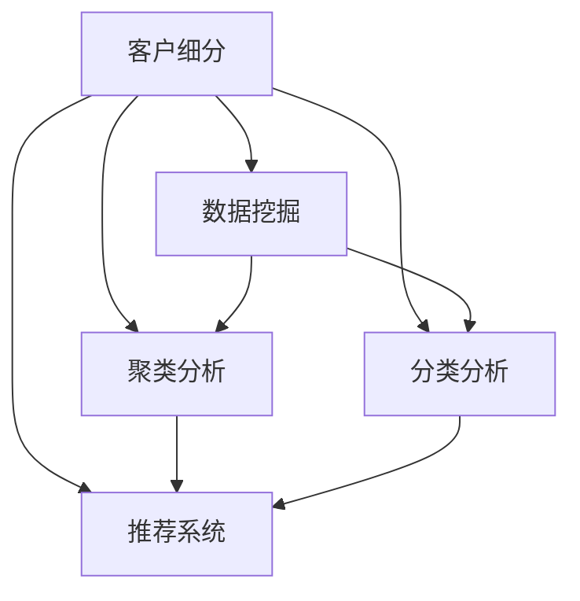
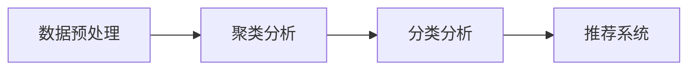

                 

# 信息差的客户细分精准化：大数据如何实现精准客户细分

## 1. 背景介绍

### 1.1 问题由来

在数字化浪潮的推动下，企业正加速数字化转型，以数据驱动运营决策。然而，面对海量数据，如何从中挖掘价值、实现精准客户细分和个性化推荐，成为了企业关注的重点。传统客户细分方法通常基于统计学或规则工程，存在高成本、低精度、低效率的问题。大数据和人工智能技术的融合，为精准客户细分提供了新的解决方案。

### 1.2 问题核心关键点

精准客户细分，即通过数据驱动的方式，将客户划分为具有相似特征的群体，以便实现更精准的营销、产品推荐和客户服务。核心挑战在于如何利用大数据和先进算法，高效、准确地进行客户行为分析和群体划分，并从中提取有价值的信息。

精准客户分细分的目标在于：
1. **降低成本**：减少传统统计学和规则工程的开发成本。
2. **提高效率**：快速响应市场变化，实时调整客户策略。
3. **提升精度**：通过大数据和算法模型，深入挖掘客户行为和需求。
4. **增强可解释性**：提供数据驱动的决策依据，减少人为偏差。

### 1.3 问题研究意义

精准客户细分是企业实现数字化转型和智能化运营的关键环节。通过精准客户细分，企业可以实现以下目标：
- **提升客户满意度**：提供个性化的产品和服务，提升客户忠诚度。
- **优化营销效果**：精准定位目标客户，提高广告和促销的转化率。
- **降低运营成本**：通过细分，实现资源合理配置，减少资源浪费。
- **增强竞争力**：在激烈的市场竞争中，实现差异化定位和差异化服务。

## 2. 核心概念与联系

### 2.1 核心概念概述

为更好地理解精准客户细分，本节将介绍几个密切相关的核心概念：

- **客户细分**：将客户按特定特征（如地理位置、消费行为、兴趣爱好等）进行分组，以便更准确地进行市场分析和管理。
- **数据挖掘**：从大规模数据集中提取有价值的信息和知识的过程，常用于客户行为分析和群体划分。
- **聚类分析**：一种无监督学习算法，用于将数据对象划分为多个子集，每个子集内部的数据对象具有相似特征，而不同子集之间的数据对象具有明显差异。
- **分类分析**：一种有监督学习算法，用于将数据对象分为不同的类别，常用于预测客户行为和需求。
- **推荐系统**：基于用户行为和偏好，为用户推荐个性化产品和服务的技术，常与客户细分结合使用。

这些核心概念之间的逻辑关系可以通过以下Mermaid流程图来展示：



这个流程图展示了几大核心概念之间的联系：

1. 客户细分的基础是数据挖掘，即从海量数据中提取有价值的信息。
2. 聚类分析和分类分析是数据挖掘的主要手段，分别用于无监督和有监督的群体划分和分类预测。
3. 推荐系统常与客户细分结合使用，提供个性化的产品和服务。

## 3. 核心算法原理 & 具体操作步骤

### 3.1 算法原理概述

精准客户细分通常涉及以下算法和技术：
1. **数据预处理**：清洗、归一化、特征选择等步骤，提高数据质量。
2. **聚类分析**：K-means、层次聚类、密度聚类等算法，用于将客户划分为不同的群体。
3. **分类分析**：逻辑回归、决策树、随机森林、神经网络等算法，用于预测客户行为和需求。
4. **推荐系统**：协同过滤、基于内容的推荐、矩阵分解等算法，用于为用户推荐个性化的产品和服务。

核心算法原理如图1所示：



图1：精准客户细分核心算法原理

### 3.2 算法步骤详解

#### 3.2.1 数据预处理

数据预处理是精准客户细分的第一步，涉及以下几个关键步骤：
1. **数据清洗**：去除异常值、重复值、缺失值，确保数据准确性。
2. **数据归一化**：将不同量级的特征归一化到[0,1]区间，提高算法效率。
3. **特征选择**：选择对客户行为和需求预测有影响的特征，去除无关或冗余特征。
4. **数据划分**：将数据划分为训练集、验证集和测试集，以便评估算法效果。

#### 3.2.2 聚类分析

聚类分析是精准客户细分的核心步骤，常用于无监督的群体划分。以下以K-means算法为例，介绍其基本步骤：
1. **初始化聚类中心**：随机选择K个数据点作为初始聚类中心。
2. **分配数据点**：计算每个数据点与聚类中心的距离，将其分配到最近的聚类中心。
3. **更新聚类中心**：计算每个聚类的均值，更新聚类中心。
4. **重复迭代**：重复步骤2和步骤3，直到聚类中心不再变化或达到预设迭代次数。

#### 3.2.3 分类分析

分类分析是精准客户细分的重要补充，常用于有监督的群体预测。以下以逻辑回归为例，介绍其基本步骤：
1. **数据准备**：将数据划分为训练集和测试集，准备训练数据和标签。
2. **模型训练**：使用训练集训练逻辑回归模型。
3. **模型评估**：在测试集上评估模型性能，计算准确率、召回率、F1值等指标。
4. **模型优化**：调整模型参数，提升模型性能。

#### 3.2.4 推荐系统

推荐系统是精准客户细分的最终应用，常用于提供个性化的产品和服务。以下以协同过滤为例，介绍其基本步骤：
1. **数据准备**：收集用户行为数据，如浏览、购买、评分等。
2. **模型训练**：使用协同过滤算法（如基于用户的协同过滤、基于物品的协同过滤）训练推荐模型。
3. **推荐输出**：根据用户行为和模型预测，生成推荐结果。
4. **效果评估**：评估推荐系统的效果，如点击率、转化率等指标。

### 3.3 算法优缺点

精准客户细分算法具有以下优点：
1. **自动化程度高**：大数据和算法模型的引入，减少了人工干预，提高了效率。
2. **精度高**：通过数据挖掘和机器学习，可以实现更高的预测准确率和群体划分精度。
3. **可扩展性强**：支持大规模数据处理和复杂算法模型，具有高度的可扩展性。
4. **适应性强**：可以处理不同类型的数据和问题，灵活应对市场变化。

同时，该算法也存在一定的局限性：
1. **数据质量要求高**：数据清洗、归一化、特征选择等步骤对数据质量要求较高，处理不当会影响结果。
2. **算法复杂度高**：聚类、分类、推荐等算法的计算复杂度较高，需要高性能计算资源。
3. **模型解释性差**：复杂的算法模型难以解释，难以理解其内部工作机制。
4. **业务理解不足**：算法模型依赖于数据和特征，需要业务人员对业务领域有深入理解。
5. **隐私保护问题**：处理大量客户数据时，需关注数据隐私和安全性问题。

### 3.4 算法应用领域

精准客户细分算法在多个领域得到了广泛应用，例如：

- **零售行业**：通过客户细分，实现个性化推荐、库存管理和促销策略优化。
- **金融行业**：通过客户细分，实现精准营销、风险评估和客户流失预警。
- **旅游行业**：通过客户细分，实现目的地推荐、行程规划和个性化服务。
- **媒体行业**：通过客户细分，实现内容推荐、广告投放和用户画像分析。
- **医疗行业**：通过客户细分，实现疾病预测、患者分流和精准治疗方案推荐。

除了上述这些典型应用外，精准客户细分算法还可以应用于更多场景中，如智慧城市、教育培训、智能交通等，为不同行业的数字化转型提供技术支持。

## 4. 数学模型和公式 & 详细讲解 & 举例说明

### 4.1 数学模型构建

为了更好地理解精准客户细分，本节将使用数学语言对主要算法进行更加严格的刻画。

假设客户数据集为 $D=\{(x_i,y_i)\}_{i=1}^N$，其中 $x_i$ 为特征向量， $y_i$ 为标签（0/1二分类）。精准客户细分的目标是找到最优的聚类中心 $c_1,c_2,...,c_K$ 和分类模型 $f$，使得 $f(x_i)=y_i$。

模型的目标函数为：

$$
\min_{c_1,...,c_K,f} \sum_{i=1}^N L(f(x_i),y_i)
$$

其中 $L$ 为损失函数，常用的有均方误差损失、交叉熵损失等。

### 4.2 公式推导过程

#### 4.2.1 K-means算法

K-means算法的目标是最小化每个数据点到其所属聚类中心的距离之和，即：

$$
\min_{c_1,...,c_K} \sum_{i=1}^N \min_{k=1,...,K} \|x_i-c_k\|
$$

其中 $\|.\|$ 为欧式距离。

K-means算法的基本步骤如下：
1. **初始化聚类中心**：随机选择K个数据点作为初始聚类中心。
2. **分配数据点**：计算每个数据点与聚类中心的距离，将其分配到最近的聚类中心。
3. **更新聚类中心**：计算每个聚类的均值，更新聚类中心。
4. **重复迭代**：重复步骤2和步骤3，直到聚类中心不再变化或达到预设迭代次数。

#### 4.2.2 逻辑回归

逻辑回归的目标是最小化交叉熵损失，即：

$$
\min_f \sum_{i=1}^N L(f(x_i),y_i) = \min_f \sum_{i=1}^N y_i \log f(x_i) + (1-y_i) \log (1-f(x_i))
$$

其中 $f$ 为逻辑回归模型， $L$ 为交叉熵损失函数。

逻辑回归的基本步骤如下：
1. **数据准备**：将数据划分为训练集和测试集，准备训练数据和标签。
2. **模型训练**：使用训练集训练逻辑回归模型。
3. **模型评估**：在测试集上评估模型性能，计算准确率、召回率、F1值等指标。
4. **模型优化**：调整模型参数，提升模型性能。

#### 4.2.3 协同过滤算法

协同过滤算法的目标是最小化预测误差，即：

$$
\min_{f} \sum_{i=1}^N \sum_{j=1}^N L(f(x_i,y_j),y_i)
$$

其中 $L$ 为预测误差损失函数，常用的有均方误差损失、绝对误差损失等。

协同过滤算法的基本步骤如下：
1. **数据准备**：收集用户行为数据，如浏览、购买、评分等。
2. **模型训练**：使用协同过滤算法（如基于用户的协同过滤、基于物品的协同过滤）训练推荐模型。
3. **推荐输出**：根据用户行为和模型预测，生成推荐结果。
4. **效果评估**：评估推荐系统的效果，如点击率、转化率等指标。

### 4.3 案例分析与讲解

#### 4.3.1 K-means算法案例

假设某电商平台的客户数据集包含100个客户的年龄、性别、消费金额、购买频率等特征，目标将其划分为5个客户群体。使用K-means算法进行聚类，步骤如下：
1. **数据预处理**：清洗数据，去除异常值和重复值，归一化特征，选择与客户行为相关的特征。
2. **初始化聚类中心**：随机选择5个数据点作为初始聚类中心。
3. **分配数据点**：计算每个数据点与聚类中心的距离，将其分配到最近的聚类中心。
4. **更新聚类中心**：计算每个聚类的均值，更新聚类中心。
5. **重复迭代**：重复步骤3和步骤4，直到聚类中心不再变化或达到预设迭代次数。

#### 4.3.2 逻辑回归案例

假设某银行的客户数据集包含50个客户的年龄、性别、收入、信用卡使用频率等特征，目标预测客户是否会违约。使用逻辑回归算法进行分类，步骤如下：
1. **数据准备**：将数据划分为训练集和测试集，准备训练数据和标签。
2. **模型训练**：使用训练集训练逻辑回归模型。
3. **模型评估**：在测试集上评估模型性能，计算准确率、召回率、F1值等指标。
4. **模型优化**：调整模型参数，提升模型性能。

#### 4.3.3 协同过滤算法案例

假设某在线视频平台的客户数据集包含1000个用户的观看历史，目标为用户推荐可能感兴趣的视频。使用协同过滤算法进行推荐，步骤如下：
1. **数据准备**：收集用户行为数据，如观看时间、评分、收藏等。
2. **模型训练**：使用协同过滤算法（如基于用户的协同过滤、基于物品的协同过滤）训练推荐模型。
3. **推荐输出**：根据用户行为和模型预测，生成推荐结果。
4. **效果评估**：评估推荐系统的效果，如点击率、转化率等指标。

## 5. 项目实践：代码实例和详细解释说明

### 5.1 开发环境搭建

在进行精准客户细分实践前，我们需要准备好开发环境。以下是使用Python进行TensorFlow开发的流程：

1. 安装Anaconda：从官网下载并安装Anaconda，用于创建独立的Python环境。

2. 创建并激活虚拟环境：
```bash
conda create -n tensorflow-env python=3.8 
conda activate tensorflow-env
```

3. 安装TensorFlow：根据CUDA版本，从官网获取对应的安装命令。例如：
```bash
conda install tensorflow==2.5 -c tensorflow -c conda-forge
```

4. 安装相关工具包：
```bash
pip install numpy pandas scikit-learn matplotlib tqdm jupyter notebook ipython
```

完成上述步骤后，即可在`tensorflow-env`环境中开始实践。

### 5.2 源代码详细实现

#### 5.2.1 数据预处理

```python
import pandas as pd
from sklearn.model_selection import train_test_split

# 读取数据集
data = pd.read_csv('customer_data.csv')

# 数据清洗
data = data.dropna()
data = data.drop_duplicates()

# 特征归一化
from sklearn.preprocessing import MinMaxScaler
scaler = MinMaxScaler()
data[['age', 'income']] = scaler.fit_transform(data[['age', 'income']])

# 特征选择
from sklearn.feature_selection import SelectKBest, f_classif
selector = SelectKBest(f_classif, k=5)
data_selected = selector.fit_transform(data, data['is_churn'])

# 数据划分
train_data, test_data = train_test_split(data_selected, test_size=0.2, random_state=42)
```

#### 5.2.2 K-means算法实现

```python
from sklearn.cluster import KMeans
import matplotlib.pyplot as plt

# 初始化聚类中心
K = 5
kmeans = KMeans(n_clusters=K)

# 训练聚类模型
kmeans.fit(train_data)

# 可视化聚类结果
plt.scatter(train_data[:, 0], train_data[:, 1], c=kmeans.labels_)
plt.show()
```

#### 5.2.3 逻辑回归实现

```python
from sklearn.linear_model import LogisticRegression
from sklearn.metrics import accuracy_score, precision_score, recall_score, f1_score

# 训练逻辑回归模型
model = LogisticRegression()
model.fit(train_data, train_data['is_churn'])

# 预测测试集结果
y_pred = model.predict(test_data)

# 评估模型性能
accuracy = accuracy_score(test_data['is_churn'], y_pred)
precision = precision_score(test_data['is_churn'], y_pred)
recall = recall_score(test_data['is_churn'], y_pred)
f1 = f1_score(test_data['is_churn'], y_pred)

print('Accuracy:', accuracy)
print('Precision:', precision)
print('Recall:', recall)
print('F1 Score:', f1)
```

#### 5.2.4 协同过滤算法实现

```python
import numpy as np
from sklearn.metrics.pairwise import cosine_similarity

# 计算用户相似度
def compute_similarity(user1, user2):
    similarity = cosine_similarity(train_data[user1], train_data[user2])
    return similarity[0][1]

# 计算物品相似度
def compute_item_similarity(item1, item2):
    similarity = cosine_similarity(train_data[:, item1], train_data[:, item2])
    return similarity[0][1]

# 预测用户可能感兴趣的视频
def recommend_video(user_id):
    similar_users = []
    for i in range(train_data.shape[0]):
        similarity = compute_similarity(user_id, i)
        if similarity > 0.8:
            similar_users.append(i)
    items = []
    for user in similar_users:
        for item in range(train_data.shape[1]):
            similarity = compute_item_similarity(item, user)
            if similarity > 0.8:
                items.append(item)
    return items
```

### 5.3 代码解读与分析

#### 5.3.1 数据预处理

- `pd.read_csv`：读取CSV格式的数据集。
- `dropna`和`drop_duplicates`：去除缺失值和重复值。
- `MinMaxScaler`：归一化特征，使其在[0,1]区间。
- `SelectKBest`：特征选择，选择与目标变量最相关的特征。
- `train_test_split`：数据划分，将数据集划分为训练集和测试集。

#### 5.3.2 K-means算法实现

- `KMeans`：初始化聚类中心。
- `fit`：训练聚类模型。
- `scatter`：可视化聚类结果，每个点代表一个数据点，颜色代表不同的聚类。

#### 5.3.3 逻辑回归实现

- `LogisticRegression`：初始化逻辑回归模型。
- `fit`：训练模型。
- `predict`：预测测试集结果。
- `accuracy_score`、`precision_score`、`recall_score`、`f1_score`：评估模型性能。

#### 5.3.4 协同过滤算法实现

- `cosine_similarity`：计算相似度。
- `compute_similarity`和`compute_item_similarity`：计算用户相似度和物品相似度。
- `recommend_video`：推荐用户可能感兴趣的视频。

## 6. 实际应用场景

### 6.1 智能客服系统

精准客户细分技术可以应用于智能客服系统的构建。智能客服系统通过分析客户的历史行为和特征，自动将其分为不同的客户群体，并针对不同群体提供个性化的服务。例如，对高价值客户提供VIP服务，对低价值客户进行回访营销。

在技术实现上，可以收集客户的历史咨询记录、反馈信息、投诉记录等数据，通过聚类和分类算法进行客户细分。细分后的客户群体，可以接入自然语言处理技术，实现智能问答和智能推荐，提升客户满意度和忠诚度。

### 6.2 个性化推荐系统

精准客户细分技术可以应用于个性化推荐系统，提升推荐系统的效果和用户满意度。推荐系统通过分析用户的历史行为和特征，自动将其分为不同的客户群体，并针对不同群体推荐个性化的产品和服务。例如，对高价值客户推荐高端产品，对低价值客户推荐高性价比产品。

在技术实现上，可以收集用户的行为数据，如浏览、点击、购买等，通过协同过滤算法进行推荐。同时，可以引入精准客户细分技术，将用户分为不同的群体，根据不同群体的特征进行推荐。

### 6.3 智能投顾系统

精准客户细分技术可以应用于智能投顾系统，提升投资顾问的服务质量和客户满意度。智能投顾系统通过分析客户的历史行为和特征，自动将其分为不同的客户群体，并针对不同群体提供个性化的投资建议和服务。例如，对高风险偏好客户推荐高风险投资，对低风险偏好客户推荐低风险投资。

在技术实现上，可以收集客户的历史投资记录、风险偏好、财务状况等数据，通过聚类和分类算法进行客户细分。细分后的客户群体，可以接入机器学习模型，进行投资风险评估和投资建议生成。

### 6.4 未来应用展望

随着精准客户细分技术的不断演进，未来将在更多领域得到应用，为数字化转型提供技术支持。

在智慧医疗领域，精准客户细分技术可以应用于患者细分和疾病预测，提升医疗服务的个性化和精准化。例如，对高风险患者进行重点关注和提前干预，对低风险患者进行常规健康管理。

在智能教育领域，精准客户细分技术可以应用于学生细分和个性化推荐，提升教育服务的个性化和效果。例如，对学习能力强学生提供高级课程，对学习能力弱学生提供基础课程。

在智慧城市治理中，精准客户细分技术可以应用于城市事件监测和应急管理，提升城市管理的智能化和精细化。例如，对高风险区域进行重点监控和应急响应，对低风险区域进行常规管理。

此外，在企业生产、金融、旅游、媒体等众多领域，精准客户细分技术也将不断涌现，为数字化转型提供技术支持。

## 7. 工具和资源推荐

### 7.1 学习资源推荐

为了帮助开发者系统掌握精准客户细分的理论基础和实践技巧，这里推荐一些优质的学习资源：

1. **《数据科学导论》**：这本书系统介绍了数据科学的基本概念和核心技术，包括数据预处理、聚类分析、分类分析等。

2. **Coursera上的《数据科学与机器学习》课程**：由斯坦福大学和IBM联合开设的在线课程，深入浅出地讲解了数据科学和机器学习的核心算法和应用。

3. **Kaggle上的数据科学竞赛**：Kaggle是全球最大的数据科学竞赛平台，可以参与各种数据科学竞赛，提升实践能力。

4. **TensorFlow官方文档**：TensorFlow的官方文档提供了丰富的代码示例和算法介绍，是学习TensorFlow的重要资源。

5. **Python数据科学社区**：Python数据科学社区是一个活跃的技术交流平台，提供大量的学习资源和实践经验分享。

通过这些资源的学习实践，相信你一定能够快速掌握精准客户细分的精髓，并用于解决实际的业务问题。

### 7.2 开发工具推荐

高效的开发离不开优秀的工具支持。以下是几款用于精准客户细分开发的常用工具：

1. **Python**：Python是一种灵活、高效、易于学习的编程语言，常用于数据科学和机器学习开发。

2. **TensorFlow**：由Google主导开发的开源深度学习框架，生产部署方便，适合大规模工程应用。

3. **NumPy**：Python的科学计算库，提供高效的数据处理和数学计算功能。

4. **Pandas**：Python的数据分析库，提供灵活的数据处理和数据可视化功能。

5. **Scikit-learn**：Python的机器学习库，提供丰富的算法和模型，支持数据预处理、聚类分析、分类分析等。

6. **Jupyter Notebook**：Python的交互式开发环境，支持代码编写、数据可视化、结果展示等多种功能。

合理利用这些工具，可以显著提升精准客户细分任务的开发效率，加快创新迭代的步伐。

### 7.3 相关论文推荐

精准客户细分技术的发展源于学界的持续研究。以下是几篇奠基性的相关论文，推荐阅读：

1. **K-means算法**：由MacQueen在1967年提出，是聚类分析的经典算法。

2. **逻辑回归**：由Fisher在1935年提出，是分类分析的经典算法。

3. **协同过滤算法**：由Herbrand和Resnick在1998年提出，是推荐系统的经典算法。

4. **深度学习在客户细分中的应用**：探索深度学习模型在客户细分中的表现和优势，如CNN、RNN、Transformer等。

5. **基于大数据的精准客户细分技术**：介绍大数据和机器学习技术在客户细分中的应用，如Hadoop、Spark等。

这些论文代表了大数据和机器学习在客户细分领域的发展脉络。通过学习这些前沿成果，可以帮助研究者把握学科前进方向，激发更多的创新灵感。

## 8. 总结：未来发展趋势与挑战

### 8.1 总结

本文对精准客户细分技术进行了全面系统的介绍。首先阐述了精准客户细分的背景和意义，明确了数据科学和机器学习在精准客户细分中的应用价值。其次，从原理到实践，详细讲解了聚类分析、分类分析和推荐系统的核心算法，给出了实现代码实例。同时，本文还广泛探讨了精准客户细分在智能客服、个性化推荐等领域的实际应用，展示了精准客户细分的广阔前景。

通过本文的系统梳理，可以看到，精准客户细分技术在数据驱动的运营决策中发挥着重要作用，能够实现更精准的客户细分和个性化推荐，提升企业的运营效率和客户满意度。未来，随着数据科学和机器学习技术的不断发展，精准客户细分技术必将迎来更多的应用场景和创新突破。

### 8.2 未来发展趋势

精准客户细分技术的未来发展趋势包括以下几个方面：

1. **自动化程度提升**：随着数据科学和机器学习技术的进步，精准客户细分的自动化程度将不断提高，减少人工干预，提高效率。

2. **多模态数据融合**：未来将更多地引入多模态数据，如语音、图像、文本等，提升客户细分的准确性和全面性。

3. **实时化处理**：随着流数据处理技术的进步，精准客户细分将实现实时化处理，提高响应速度和时效性。

4. **跨领域应用**：精准客户细分将不仅仅局限于电子商务和金融等领域，而是拓展到更多行业，如医疗、教育、政府等。

5. **可解释性和透明度**：未来将更加注重算法的可解释性和透明度，提高用户对模型的信任度和接受度。

6. **伦理和隐私保护**：随着数据隐私和伦理问题的重视，精准客户细分将更加注重数据安全和隐私保护。

### 8.3 面临的挑战

尽管精准客户细分技术已经取得了显著成果，但在实现精准化和智能化客户细分的过程中，仍面临诸多挑战：

1. **数据质量问题**：数据清洗、归一化和特征选择等步骤对数据质量要求较高，处理不当会影响结果。

2. **算法复杂性**：聚类、分类和协同过滤等算法复杂度高，需要高性能计算资源。

3. **模型解释性差**：复杂的算法模型难以解释，难以理解其内部工作机制。

4. **业务理解不足**：算法模型依赖于数据和特征，需要业务人员对业务领域有深入理解。

5. **隐私保护问题**：处理大量客户数据时，需关注数据隐私和安全性问题。

### 8.4 研究展望

面向未来，精准客户细分技术需要在以下几个方面寻求新的突破：

1. **自动化和智能化**：提高算法的自动化和智能化程度，减少人工干预，提高效率。

2. **多模态数据融合**：引入更多多模态数据，提升客户细分的准确性和全面性。

3. **实时化处理**：实现实时化处理，提高响应速度和时效性。

4. **可解释性和透明度**：增强算法的可解释性和透明度，提高用户对模型的信任度和接受度。

5. **伦理和隐私保护**：注重数据安全和隐私保护，确保数据使用合法合规。

这些研究方向的探索，将推动精准客户细分技术迈向更高的台阶，为数据驱动的运营决策提供更强大的支持。

## 9. 附录：常见问题与解答

### 9.1 问题一：如何选择合适的聚类算法？

**解答**：选择合适的聚类算法需要考虑数据的特点和应用场景。例如：
- K-means算法适合处理数据分布均匀的聚类问题，适用于大样本数据。
- 层次聚类算法适合处理数据分布不均匀的聚类问题，适用于小样本数据。
- 密度聚类算法适合处理数据密度分布不均匀的聚类问题，适用于高维数据。

### 9.2 问题二：数据预处理的重要性体现在哪里？

**解答**：数据预处理的重要性体现在以下几个方面：
- 去除噪声：数据清洗和归一化能够去除数据中的噪声和异常值，提高数据质量。
- 特征选择：特征选择能够去除无关或冗余特征，提高模型的泛化能力。
- 数据平衡：数据划分能够将数据分为训练集、验证集和测试集，保证模型评估的准确性。

### 9.3 问题三：精准客户细分在实际应用中需要注意哪些问题？

**解答**：精准客户细分在实际应用中需要注意以下问题：
- 数据隐私：处理客户数据时需关注数据隐私和安全性问题，确保数据使用合法合规。
- 算法可解释性：复杂的算法模型难以解释，需增强算法的可解释性和透明度，提高用户对模型的信任度和接受度。
- 模型性能：选择合适的算法和参数，确保模型性能稳定可靠。
- 业务理解：算法模型依赖于数据和特征，需业务人员对业务领域有深入理解，确保模型能够有效应用于实际场景。

通过不断优化数据预处理、聚类分析、分类分析和推荐系统等各个环节，可以有效提升精准客户细分的精度和效果，为企业带来更高的运营效率和客户满意度。

