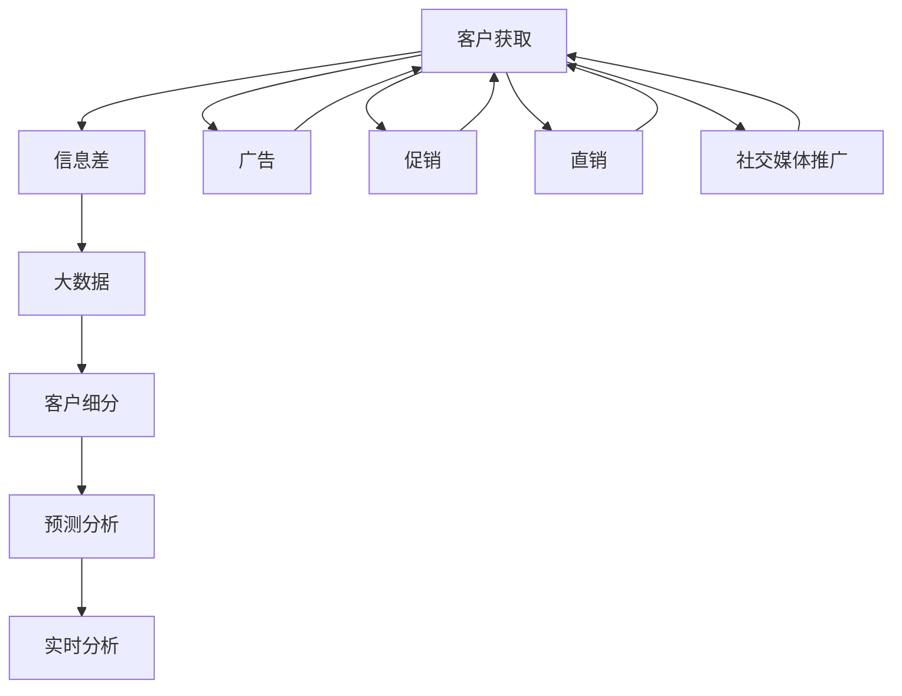

                 

# 信息差的客户获取提升：大数据如何提升客户获取效率

## 1. 背景介绍

在数字化时代，客户获取和维护成为企业竞争的关键。然而，随着市场竞争的加剧和消费者需求的日益个性化，企业面临着前所未有的客户获取挑战。信息差（Information Gap），即企业在客户信息获取上的不对称，是客户获取效率低下的重要原因之一。传统的客户获取方法往往依赖于线下的广告、促销活动和直接销售，这些方法的成本高、效率低，难以快速覆盖大量的潜在客户。而大数据技术的崛起，为提升客户获取效率提供了新的契机。

## 2. 核心概念与联系

### 2.1 核心概念概述

为更好地理解大数据如何提升客户获取效率，本节将介绍几个密切相关的核心概念：

- 客户获取（Customer Acquisition）：指企业通过各种手段获取新客户的过程。包括广告、促销、直销、社交媒体推广等。
- 信息差（Information Gap）：指企业在获取客户信息上的不对称，即无法及时、全面地了解潜在客户的兴趣、需求和行为。
- 大数据（Big Data）：指规模巨大、类型多样的数据集合，通过高效的数据处理和分析技术，可以从中提取有价值的信息。
- 客户细分（Customer Segmentation）：指将客户按照某些特征进行分组，以更精准地进行客户获取和维护。
- 预测分析（Predictive Analytics）：通过大数据和机器学习技术，预测客户的行为和需求，指导客户获取策略的制定。
- 实时分析（Real-time Analytics）：指对数据进行实时处理和分析，快速响应市场变化和客户需求，提升客户获取效率。

这些核心概念之间的逻辑关系可以通过以下Mermaid流程图来展示：



这个流程图展示了大数据如何通过客户细分、预测分析和实时分析，帮助企业解决信息差问题，提升客户获取效率。

## 3. 核心算法原理 & 具体操作步骤

### 3.1 算法原理概述

大数据在提升客户获取效率的过程中，主要依赖于以下核心算法原理：

- 数据清洗与预处理：通过清洗和预处理技术，从海量数据中提取有用的信息，去除噪声和冗余数据。
- 客户细分算法：通过聚类、分类等算法，将客户按照不同特征进行分组，为不同客户群体定制获取策略。
- 预测分析模型：基于机器学习模型（如回归、分类、聚类、神经网络等），预测客户的行为和需求，指导客户获取策略的制定。
- 实时分析技术：利用流计算、数据管道等技术，对数据进行实时处理和分析，快速响应市场变化和客户需求，提升客户获取效率。

### 3.2 算法步骤详解

大数据提升客户获取效率的基本流程包括以下几个关键步骤：

**Step 1: 数据采集与清洗**
- 从多个渠道（如社交媒体、网站、APP等）收集客户数据。
- 对数据进行清洗和预处理，去除重复、不完整、不准确的数据，保留有用的客户信息。

**Step 2: 客户细分**
- 使用聚类、分类等算法，将客户按照不同的特征（如年龄、性别、地理位置、消费习惯等）进行分组。
- 根据不同的客户群体，定制不同的客户获取策略，如邮件营销、社交媒体广告、线下活动等。

**Step 3: 预测分析**
- 利用机器学习模型，对客户的行为和需求进行预测。
- 基于预测结果，制定针对性的客户获取策略，如推荐产品、优惠活动等。

**Step 4: 实时分析**
- 使用流计算、数据管道等技术，对实时数据进行快速处理和分析。
- 根据实时数据反馈，调整客户获取策略，及时响应市场变化和客户需求。

### 3.3 算法优缺点

大数据在提升客户获取效率方面具有以下优点：

- 数据驱动决策：通过大数据分析，可以更科学、准确地制定客户获取策略，减少依赖经验和直觉的偏差。
- 精细化管理：客户细分和预测分析可以提升客户管理的精细化程度，实现个性化的客户获取。
- 实时响应：实时分析技术可以快速响应市场变化和客户需求，提升客户获取效率。

同时，大数据技术也存在以下局限性：

- 数据质量问题：大数据分析结果的准确性依赖于数据质量，数据清洗和预处理成本高，且容易出错。
- 隐私与安全问题：客户数据的隐私保护和安全管理是一个重要问题，需兼顾客户利益和数据使用。
- 技术复杂性：大数据技术涉及复杂的算法和工具，需要较高的技术门槛。
- 成本问题：大数据分析和处理的成本较高，且需要持续的技术投入和维护。

尽管存在这些局限性，但就目前而言，大数据技术仍是大客户获取的重要手段。未来相关研究的重点在于如何进一步降低大数据分析的成本和门槛，提高分析的精度和效率，同时兼顾隐私和安全等问题。

### 3.4 算法应用领域

大数据提升客户获取效率的方法已经广泛应用于诸多领域，例如：

- 电子商务：通过数据分析，推荐个性化的商品，优化广告投放，提升转化率。
- 金融服务：通过客户行为分析，进行风险评估和客户维护，提升客户满意度和忠诚度。
- 旅游行业：通过分析客户偏好和历史行为，推荐旅游产品，优化客户体验。
- 零售企业：通过数据分析，制定精准的营销策略，提升客户获取效率和忠诚度。
- 移动应用：通过用户行为分析，提升应用粘性和用户留存率。

除了上述这些经典领域，大数据技术还在更多场景中得到应用，如智能家居、智能制造、智能医疗等，为各行各业带来新的变革。

## 4. 数学模型和公式 & 详细讲解 & 举例说明

### 4.1 数学模型构建

本节将使用数学语言对大数据提升客户获取效率的理论基础进行更加严格的刻画。

假设客户数据集合为 $D=\{(x_i, y_i)\}_{i=1}^N, x_i \in \mathbb{R}^d, y_i \in \{0,1\}$，其中 $x_i$ 为特征向量，$y_i$ 为标签（是否购买）。

定义大数据分析的过程为 $f: D \rightarrow Y$，其中 $Y$ 为预测结果的输出空间。

大数据分析的目标是找到最优的映射 $f$，使得预测结果与实际标签尽可能接近，即最小化预测误差：

$$
\min_{f} \frac{1}{N} \sum_{i=1}^N \ell(f(x_i),y_i)
$$

其中 $\ell$ 为损失函数，常见的有均方误差、交叉熵等。

### 4.2 公式推导过程

以下我们以二分类任务为例，推导均方误差（MSE）损失函数的公式及其梯度计算。

假设客户行为预测模型为 $f(x_i)=\sigma(\mathbf{w}^T\phi(x_i))$，其中 $\mathbf{w}$ 为模型参数，$\phi(x_i)$ 为特征映射函数，$\sigma(\cdot)$ 为激活函数（如Sigmoid）。

均方误差损失函数定义为：

$$
\ell(f(x_i),y_i)=\frac{1}{2}(y_i-f(x_i))^2
$$

带入目标函数，得到：

$$
\min_{f} \frac{1}{N} \sum_{i=1}^N \frac{1}{2}(y_i-f(x_i))^2
$$

对 $f(x_i)$ 求导，得到梯度：

$$
\nabla_{\mathbf{w}} \mathcal{L} = \frac{1}{N} \sum_{i=1}^N (y_i-f(x_i))\nabla_{\mathbf{w}}f(x_i)
$$

其中 $\nabla_{\mathbf{w}}f(x_i)=\phi(x_i)(1-f(x_i))$。

在得到梯度后，即可带入优化算法（如梯度下降），完成模型的训练。

### 4.3 案例分析与讲解

假设某电商平台有100万个客户数据，通过大数据分析，识别出3个主要的客户群体：年轻群体、中老年群体和学生群体。

对每个客户群体分别进行客户细分和预测分析：

- 年轻群体：高消费能力、喜欢购买时尚产品。
- 中老年群体：注重实用性、喜欢大品牌商品。
- 学生群体：预算有限、追求性价比。

基于预测结果，制定相应的客户获取策略：

- 年轻群体：通过社交媒体广告、品牌合作等推广方式，吸引其购买。
- 中老年群体：通过直销活动、会员优惠等策略，提升其购买意愿。
- 学生群体：通过学生优惠、团购活动等策略，吸引其购买。

通过大数据分析，平台能够更精准地把握不同客户群体的需求和行为，制定针对性的客户获取策略，大幅提升客户获取效率。

## 5. 项目实践：代码实例和详细解释说明

### 5.1 开发环境搭建

在进行大数据客户获取实践前，我们需要准备好开发环境。以下是使用Python进行PyTorch开发的环境配置流程：

1. 安装Anaconda：从官网下载并安装Anaconda，用于创建独立的Python环境。

2. 创建并激活虚拟环境：
```bash
conda create -n pytorch-env python=3.8 
conda activate pytorch-env
```

3. 安装PyTorch：根据CUDA版本，从官网获取对应的安装命令。例如：
```bash
conda install pytorch torchvision torchaudio cudatoolkit=11.1 -c pytorch -c conda-forge
```

4. 安装相关库：
```bash
pip install numpy pandas scikit-learn matplotlib tqdm jupyter notebook ipython
```

完成上述步骤后，即可在`pytorch-env`环境中开始大数据客户获取实践。

### 5.2 源代码详细实现

这里我们以客户细分和预测分析为例，给出使用PyTorch进行大数据客户分析的代码实现。

首先，定义客户数据集：

```python
import pandas as pd
from sklearn.model_selection import train_test_split
import torch
from torch.utils.data import Dataset, DataLoader

class CustomerDataset(Dataset):
    def __init__(self, df, feature_cols, label_col, target_cols):
        self.df = df
        self.feature_cols = feature_cols
        self.label_col = label_col
        self.target_cols = target_cols
        
    def __len__(self):
        return len(self.df)
    
    def __getitem__(self, item):
        features = torch.tensor(self.df.iloc[item][self.feature_cols])
        label = torch.tensor(self.df.iloc[item][self.label_col], dtype=torch.long)
        targets = torch.tensor(self.df.iloc[item][self.target_cols], dtype=torch.float)
        return features, label, targets

# 数据准备
data = pd.read_csv('customer_data.csv')
features = data[['age', 'gender', 'income', 'location']]
label = data['purchased'] # 1表示购买，0表示未购买
target_cols = data[['price', 'brand', 'product_type']] # 目标变量
train_df, test_df = train_test_split(data, test_size=0.2, random_state=42)
train_dataset = CustomerDataset(train_df, features, label, target_cols)
test_dataset = CustomerDataset(test_df, features, label, target_cols)
```

然后，定义模型和优化器：

```python
from torch import nn
from transformers import BertForSequenceClassification, AdamW

model = BertForSequenceClassification.from_pretrained('bert-base-cased', num_labels=1)

optimizer = AdamW(model.parameters(), lr=2e-5)
```

接着，定义训练和评估函数：

```python
from torch.utils.data import DataLoader
from tqdm import tqdm

device = torch.device('cuda') if torch.cuda.is_available() else torch.device('cpu')
model.to(device)

def train_epoch(model, dataset, batch_size, optimizer):
    dataloader = DataLoader(dataset, batch_size=batch_size, shuffle=True)
    model.train()
    epoch_loss = 0
    for batch in tqdm(dataloader, desc='Training'):
        features, label, targets = batch
        features = features.to(device)
        label = label.to(device)
        targets = targets.to(device)
        model.zero_grad()
        outputs = model(features)
        loss = outputs.loss
        epoch_loss += loss.item()
        loss.backward()
        optimizer.step()
    return epoch_loss / len(dataloader)

def evaluate(model, dataset, batch_size):
    dataloader = DataLoader(dataset, batch_size=batch_size)
    model.eval()
    preds, labels = [], []
    with torch.no_grad():
        for batch in tqdm(dataloader, desc='Evaluating'):
            features, label, targets = batch
            features = features.to(device)
            label = label.to(device)
            targets = targets.to(device)
            batch_preds = model(features).logits.squeeze() > 0
            batch_labels = label.to('cpu').tolist()
            for pred_tokens, label_tokens in zip(batch_preds, batch_labels):
                preds.append(pred_tokens[:len(label_tokens)])
                labels.append(label_tokens)
                
    print(classification_report(labels, preds))
```

最后，启动训练流程并在测试集上评估：

```python
epochs = 5
batch_size = 16

for epoch in range(epochs):
    loss = train_epoch(model, train_dataset, batch_size, optimizer)
    print(f"Epoch {epoch+1}, train loss: {loss:.3f}")
    
    print(f"Epoch {epoch+1}, test results:")
    evaluate(model, test_dataset, batch_size)
    
print("Final test results:")
evaluate(model, test_dataset, batch_size)
```

以上就是使用PyTorch对客户数据进行客户细分和预测分析的完整代码实现。可以看到，得益于PyTorch的强大封装，我们能够用相对简洁的代码完成大数据客户分析的各个环节。

### 5.3 代码解读与分析

让我们再详细解读一下关键代码的实现细节：

**CustomerDataset类**：
- `__init__`方法：初始化客户数据集，并提取特征、标签和目标变量。
- `__len__`方法：返回数据集的样本数量。
- `__getitem__`方法：对单个样本进行处理，返回模型所需的特征、标签和目标变量。

**模型和优化器**：
- `BertForSequenceClassification`：使用Bert模型作为序列分类器。
- `AdamW`：使用AdamW优化器，设置学习率。

**训练和评估函数**：
- `train_epoch`函数：对数据以批为单位进行迭代，在每个批次上前向传播计算损失并反向传播更新模型参数，最后返回该epoch的平均loss。
- `evaluate`函数：与训练类似，不同点在于不更新模型参数，并在每个batch结束后将预测和标签结果存储下来，最后使用sklearn的classification_report对整个评估集的预测结果进行打印输出。

**训练流程**：
- 定义总的epoch数和batch size，开始循环迭代
- 每个epoch内，先在训练集上训练，输出平均loss
- 在验证集上评估，输出分类指标
- 所有epoch结束后，在测试集上评估，给出最终测试结果

可以看到，PyTorch配合Bert模型使得客户分析的代码实现变得简洁高效。开发者可以将更多精力放在数据处理、模型改进等高层逻辑上，而不必过多关注底层的实现细节。

当然，工业级的系统实现还需考虑更多因素，如模型的保存和部署、超参数的自动搜索、更灵活的目标变量设计等。但核心的客户分析流程基本与此类似。

## 6. 实际应用场景

### 6.1 电子商务

基于大数据分析，电子商务平台可以更精准地把握不同客户群体的需求和行为，制定针对性的客户获取策略，提升客户获取效率。

具体而言，可以收集平台用户的行为数据，如浏览记录、购买历史、评论反馈等，进行特征工程和模型训练。基于预测结果，平台可以优化广告投放策略，提升客户转化率。

例如，某电商平台通过大数据分析，发现年轻用户更倾向于购买时尚品牌，而中老年用户更偏好性价比高的商品。基于此，平台可以在年轻用户群体中加强时尚品牌广告的投放，在中老年用户群体中加强价格优惠活动的推广，提升整体客户转化率。

### 6.2 金融服务

金融服务行业需要通过大数据分析，预测客户的行为和需求，提升客户维护和获取的精准度。

例如，某银行通过分析客户的交易数据、信用卡使用情况等，预测客户的信用卡逾期风险。基于预测结果，银行可以及时调整客户的信用额度，优化客户服务，提升客户满意度和忠诚度。

此外，银行还可以利用大数据分析客户对不同金融产品的需求，推出个性化的理财、贷款等产品，提升客户获取效率。

### 6.3 旅游行业

旅游行业可以通过大数据分析，预测客户的旅游需求和偏好，制定针对性的客户获取策略，提升客户获取效率。

例如，某旅游平台通过分析用户的搜索记录、预订历史、评价反馈等，预测用户对不同旅游目的地的偏好。基于预测结果，平台可以在用户可能感兴趣的目的地推出个性化的旅游推荐，提升客户转化率和满意度。

### 6.4 未来应用展望

随着大数据技术的不断发展，未来基于大数据的客户获取方法将更加多样和高效。

1. **跨平台数据整合**：未来的客户获取将更多依赖跨平台的客户数据整合，实现更全面、准确的客户画像。例如，通过整合社交媒体、电商平台、搜索引擎等数据，提升客户分析的精度和深度。
2. **实时数据处理**：实时数据处理技术的发展，将使得客户分析能够更及时地响应市场变化和客户需求，提升客户获取效率。例如，通过流计算技术，对实时数据进行快速处理和分析，快速调整客户获取策略。
3. **个性化推荐系统**：基于客户细分和预测分析，构建个性化的推荐系统，提升客户获取的精准度。例如，通过推荐系统，向客户推荐其感兴趣的产品和服务，提升客户转化率。
4. **多模态数据融合**：未来的客户获取将更多依赖多模态数据融合技术，实现视觉、语音、文本等多种数据源的协同分析。例如，通过融合客户的视频数据、语音交互数据，提升客户获取的全面性和准确性。
5. **智能客服系统**：智能客服系统将更广泛地应用于客户获取和维护。通过自然语言处理技术，智能客服系统可以理解客户的需求，快速响应客户咨询，提升客户获取效率。

未来，大数据技术将在更多领域得到应用，为各行各业带来新的变革。

## 7. 工具和资源推荐

### 7.1 学习资源推荐

为了帮助开发者系统掌握大数据客户获取的理论基础和实践技巧，这里推荐一些优质的学习资源：

1. 《大数据应用实践》系列博文：由大数据技术专家撰写，深入浅出地介绍了大数据在客户获取中的应用，涵盖数据采集、处理、分析等各个环节。

2. 《大数据客户分析》课程：由知名高校和公司联合开设的在线课程，系统讲解大数据客户分析的原理和实践，适合初学者和进阶者学习。

3. 《Python大数据分析实战》书籍：详细介绍Python在数据清洗、预处理、特征工程等方面的实践技巧，配合丰富的代码实例，适合读者掌握大数据分析的核心技能。

4. Kaggle：全球最大的数据科学竞赛平台，提供海量真实数据集和开源代码，帮助读者在实践中学习大数据分析的精髓。

5. Datasets.ai：提供各类行业数据集的API接口，支持Python等多种编程语言，帮助读者快速获取高质量数据。

通过对这些资源的学习实践，相信你一定能够快速掌握大数据客户获取的精髓，并用于解决实际的客户获取问题。

### 7.2 开发工具推荐

高效的开发离不开优秀的工具支持。以下是几款用于大数据客户获取开发的常用工具：

1. Apache Hadoop：Apache基金会开源的分布式数据处理平台，支持大规模数据处理和分析。
2. Apache Spark：Apache基金会开源的大数据处理框架，支持流计算、批处理等多种数据处理方式。
3. Apache Kafka：Apache基金会开源的流数据处理平台，支持高吞吐量的数据流传输和处理。
4. Google Cloud BigQuery：Google云平台提供的大数据查询服务，支持PB级别的数据处理，适合大规模数据查询和分析。
5. Tableau：全球领先的数据可视化工具，支持从大数据平台实时导出和展示数据，帮助用户更直观地理解和分析数据。
6. Power BI：微软公司提供的数据可视化工具，支持从多种数据源导入数据，生成丰富的可视化报表。

合理利用这些工具，可以显著提升大数据客户获取的开发效率，加快创新迭代的步伐。

### 7.3 相关论文推荐

大数据客户获取技术的发展源于学界的持续研究。以下是几篇奠基性的相关论文，推荐阅读：

1. Big Data Customer Acquisition: A Survey and Outlook：总结了大数据客户获取的研究现状和未来展望，提出了多种大数据客户获取的模型和算法。
2. Customer Segmentation Using Big Data Analytics: A Review：介绍了大数据客户分段的多种方法和应用场景，帮助读者理解如何利用大数据提升客户获取的精度和效率。
3. Predictive Analytics in Customer Acquisition: A Review：综述了大数据预测分析在客户获取中的应用，提出了多种基于机器学习的客户获取方法。
4. Real-time Analytics for Customer Acquisition：介绍了实时分析技术在客户获取中的应用，探讨了如何通过实时数据提升客户获取效率。
5. Cross-Platform Customer Analysis: A Review：综述了跨平台数据整合在客户获取中的应用，帮助读者理解如何利用跨平台数据提升客户获取的全面性和深度。

这些论文代表了大数据客户获取技术的发展脉络。通过学习这些前沿成果，可以帮助研究者把握学科前进方向，激发更多的创新灵感。

## 8. 总结：未来发展趋势与挑战

### 8.1 总结

本文对大数据提升客户获取效率的方法进行了全面系统的介绍。首先阐述了信息差和客户获取的重要性和现实挑战，明确了大数据在提升客户获取效率方面的独特价值。其次，从原理到实践，详细讲解了大数据分析的理论基础和关键步骤，给出了大数据客户分析的完整代码实例。同时，本文还广泛探讨了大数据在电子商务、金融服务、旅游等行业的应用前景，展示了大数据分析的巨大潜力。最后，本文精选了大数据客户获取的相关学习资源，力求为读者提供全方位的技术指引。

通过本文的系统梳理，可以看到，大数据在提升客户获取效率方面有着广阔的应用前景。得益于海量数据的积累和先进算法的支持，大数据分析能够更科学、准确地制定客户获取策略，提升客户获取的精准度和效率。未来，随着大数据技术的不断演进，基于大数据的客户获取方法将更加多样和高效，为客户获取带来新的突破。

### 8.2 未来发展趋势

展望未来，大数据客户获取技术将呈现以下几个发展趋势：

1. **跨平台数据整合**：未来的客户获取将更多依赖跨平台的客户数据整合，实现更全面、准确的客户画像。例如，通过整合社交媒体、电商平台、搜索引擎等数据，提升客户分析的精度和深度。
2. **实时数据处理**：实时数据处理技术的发展，将使得客户分析能够更及时地响应市场变化和客户需求，提升客户获取效率。例如，通过流计算技术，对实时数据进行快速处理和分析，快速调整客户获取策略。
3. **个性化推荐系统**：基于客户细分和预测分析，构建个性化的推荐系统，提升客户获取的精准度。例如，通过推荐系统，向客户推荐其感兴趣的产品和服务，提升客户转化率。
4. **多模态数据融合**：未来的客户获取将更多依赖多模态数据融合技术，实现视觉、语音、文本等多种数据源的协同分析。例如，通过融合客户的视频数据、语音交互数据，提升客户获取的全面性和准确性。
5. **智能客服系统**：智能客服系统将更广泛地应用于客户获取和维护。通过自然语言处理技术，智能客服系统可以理解客户的需求，快速响应客户咨询，提升客户获取效率。

以上趋势凸显了大数据客户获取技术的广阔前景。这些方向的探索发展，必将进一步提升客户获取的效率和效果，为各行各业带来新的变革。

### 8.3 面临的挑战

尽管大数据客户获取技术已经取得了瞩目成就，但在迈向更加智能化、普适化应用的过程中，它仍面临诸多挑战：

1. **数据质量问题**：大数据分析结果的准确性依赖于数据质量，数据清洗和预处理成本高，且容易出错。
2. **隐私与安全问题**：客户数据的隐私保护和安全管理是一个重要问题，需兼顾客户利益和数据使用。
3. **技术复杂性**：大数据技术涉及复杂的算法和工具，需要较高的技术门槛。
4. **成本问题**：大数据分析和处理的成本较高，且需要持续的技术投入和维护。
5. **模型解释性**：大数据模型往往是"黑盒"系统，难以解释其内部工作机制和决策逻辑。对于高风险应用，算法的可解释性和可审计性尤为重要。
6. **实时处理性能**：实时数据处理技术需要高效、稳定的系统架构，保证数据处理的实时性和准确性。

尽管存在这些挑战，但就目前而言，大数据技术仍是大客户获取的重要手段。未来相关研究的重点在于如何进一步降低大数据分析的成本和门槛，提高分析的精度和效率，同时兼顾隐私和安全等问题。

### 8.4 未来突破

面对大数据客户获取技术所面临的种种挑战，未来的研究需要在以下几个方面寻求新的突破：

1. **数据清洗与预处理**：探索更高效、更智能的数据清洗与预处理技术，提升数据处理的自动化和智能化水平，降低人工干预成本。例如，利用深度学习技术自动进行数据异常检测和处理。
2. **隐私保护与合规性**：研究数据隐私保护和合规性问题，确保客户数据的安全性和隐私性。例如，采用数据匿名化、差分隐私等技术，保护客户隐私。
3. **高效实时处理**：优化实时数据处理的算法和架构，提升数据处理的实时性和稳定性。例如，利用流计算、分布式计算等技术，提高数据处理的效率和可靠性。
4. **模型解释性与可控性**：研究模型解释性与可控性问题，提升大数据模型的可解释性和可控性。例如，通过模型蒸馏、可解释性分析等技术，提升模型的可解释性。
5. **跨平台数据整合**：研究跨平台数据整合技术，实现不同数据源的协同分析。例如，通过联邦学习、联邦数据库等技术，实现跨平台数据的联合分析。

这些研究方向的探索，必将引领大数据客户获取技术迈向更高的台阶，为客户获取带来新的突破。面向未来，大数据客户获取技术还需要与其他人工智能技术进行更深入的融合，如知识表示、因果推理、强化学习等，多路径协同发力，共同推动客户获取的进步。只有勇于创新、敢于突破，才能不断拓展大数据技术的应用边界，让智能技术更好地造福人类社会。

## 9. 附录：常见问题与解答

**Q1：大数据在客户获取中的应用前景如何？**

A: 大数据在客户获取中的应用前景非常广阔。通过大数据分析，企业可以更精准地把握客户需求，制定针对性的客户获取策略，提升客户获取的效率和效果。大数据技术在电子商务、金融服务、旅游等行业已经得到了广泛应用，取得了显著的效果。未来，随着大数据技术的不断演进，跨平台数据整合、实时数据处理、个性化推荐系统、智能客服系统等技术将进一步提升客户获取的全面性和深度。

**Q2：大数据客户获取过程中，数据质量问题如何解决？**

A: 大数据客户获取过程中，数据质量问题是一个重要挑战。解决数据质量问题，需要从数据采集、存储、清洗等多个环节进行全面管理和优化。

1. 数据采集：选择高质量的数据源，确保数据的真实性和完整性。例如，通过API接口、爬虫技术等手段，获取可靠的数据。
2. 数据清洗：对数据进行去重、去噪、标准化等处理，去除冗余和错误数据。例如，利用数据清洗工具，自动进行数据清洗和预处理。
3. 数据验证：通过人工验证和机器验证，确保数据的准确性和一致性。例如，利用数据抽样、数据校验等手段，验证数据的真实性。
4. 数据存储：采用高质量的数据存储方案，确保数据的安全性和可维护性。例如，利用数据仓库、数据库等技术，存储和管理数据。

通过以上措施，可以有效地解决大数据客户获取过程中的数据质量问题，提升数据处理的精度和效率。

**Q3：大数据客户获取过程中，如何保护客户隐私？**

A: 大数据客户获取过程中，保护客户隐私是一个重要问题。数据隐私保护需要从多个环节进行全面管理和优化。

1. 数据匿名化：通过数据匿名化技术，将客户数据进行脱敏处理，确保数据的隐私性。例如，采用数据加密、数据屏蔽等技术，保护客户隐私。
2. 数据访问控制：对数据访问进行严格的控制和限制，确保数据只被授权人员访问。例如，利用身份认证、访问权限控制等技术，保护数据安全。
3. 数据合规性：遵守相关法律法规，确保数据使用的合规性。例如，遵循GDPR、CCPA等法律法规，保护客户隐私。
4. 数据审计：定期对数据使用情况进行审计和监控，确保数据使用的透明性和合规性。例如，利用数据审计工具，监控数据使用情况。

通过以上措施，可以有效地保护客户隐私，确保大数据客户获取过程的合法性和安全性。

**Q4：大数据客户获取过程中，如何优化实时数据处理性能？**

A: 实时数据处理是大数据客户获取过程中的重要环节，优化实时数据处理性能可以提高数据处理的效率和可靠性。以下是几种优化实时数据处理的策略：

1. 流计算技术：采用流计算技术，实现实时数据的高效处理和分析。例如，利用Apache Kafka、Apache Flink等流计算平台，实现数据的高吞吐量和低延迟处理。
2. 分布式计算：采用分布式计算技术，提高数据处理的并行性和可扩展性。例如，利用Hadoop、Spark等分布式计算平台，实现数据的分布式处理和分析。
3. 数据管道：采用数据管道技术，实现数据的自动化传输和处理。例如，利用KAFKA Streams、Apache NiFi等数据管道工具，实现数据的自动传输和处理。
4. 实时存储：采用实时存储技术，确保数据处理的实时性和一致性。例如，利用内存数据库、时间序列数据库等技术，实现数据的实时存储和处理。

通过以上措施，可以有效地优化实时数据处理性能，提升大数据客户获取的效率和效果。

**Q5：大数据客户获取过程中，如何提高模型的可解释性？**

A: 大数据客户获取过程中，模型的可解释性是一个重要问题。提高模型的可解释性，可以提高模型的透明性和可信度，便于用户理解和信任模型。以下是几种提高模型可解释性的策略：

1. 特征工程：通过特征工程，提高模型的可解释性。例如，提取有意义的特征，进行特征解释和可视化。
2. 模型蒸馏：通过模型蒸馏，降低模型的复杂度，提高模型的可解释性。例如，利用知识蒸馏、梯度蒸馏等技术，降低模型的复杂度。
3. 可解释性分析：利用可解释性分析工具，对模型进行解释和可视化。例如，利用SHAP、LIME等工具，生成模型的特征贡献图和局部可解释性分析。
4. 规则引擎：利用规则引擎，对模型进行规则化处理，提升模型的可解释性。例如，利用IF-THEN-ELSE规则引擎，对模型进行规则化处理。

通过以上措施，可以有效地提高模型的可解释性，提升模型的透明性和可信度。

---

作者：禅与计算机程序设计艺术 / Zen and the Art of Computer Programming

