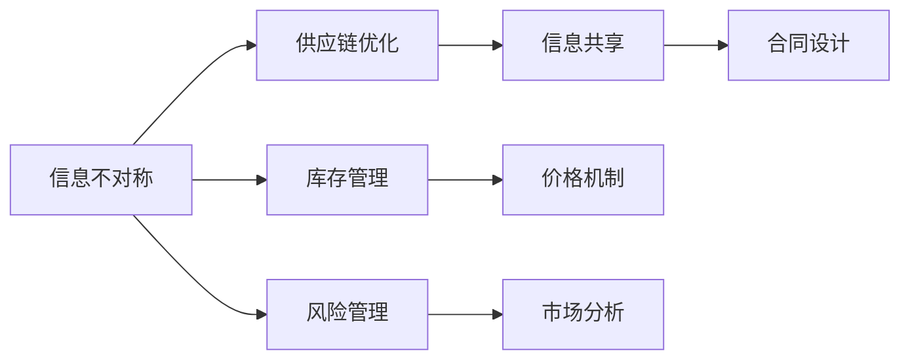

                 

# 信息差：信息不对称与供应链优化

在当今全球化高度竞争的市场环境中，供应链管理已成为企业成功与否的关键因素。然而，供应链中的信息不对称问题，即参与者之间存在的不完全信息，使得优化供应链变得尤为复杂和挑战重重。本文将详细探讨信息不对称在供应链优化中的作用，并通过算法和数学模型的角度提出解决方案。

## 1. 背景介绍

### 1.1 问题由来

供应链是包括供应商、生产商、分销商、零售商等多个参与者之间的网络结构。在这个网络中，信息的准确、及时、透明传递对于整个供应链的高效运行至关重要。然而，由于各参与者可能持有不同的目标、利益和信息，使得信息在供应链中传递时存在差异和扭曲，这就是所谓的信息不对称。

信息不对称会导致以下问题：
- 供需失衡：因为信息传递不准确，生产商无法精准预测需求，导致库存积压或短缺。
- 合同失信：由于缺乏透明的供应链信息，参与者可能面临合作风险，例如欺诈和违约。
- 价格波动：信息不透明可能导致价格信号失真，影响市场竞争。

### 1.2 问题核心关键点

解决信息不对称问题的关键在于：
1. 建立有效的信息共享机制，使得所有参与者都能及时获取准确信息。
2. 设计合理的激励机制，激励供应链各方共同维护信息透明。
3. 应用数据驱动的方法，实时监测供应链状态，迅速响应变化。

本文将从核心算法原理、具体操作步骤、数学模型和实际应用场景等方面，全面探讨信息不对称与供应链优化的问题，并提出解决方案。

## 2. 核心概念与联系

### 2.1 核心概念概述

在讨论供应链优化中的信息差问题之前，我们需要了解一些关键概念：

- **信息不对称(Information Asymmetry)**：指供应链中不同参与者之间存在的不完全信息状态。
- **供应链(Supply Chain)**：企业中涉及原材料采购、生产、库存、分销等环节的流程集合。
- **供应链优化(Supply Chain Optimization)**：通过优化供应链各环节的资源配置，提高整体效率和盈利能力。
- **信息共享(Information Sharing)**：供应链中各参与者之间的信息交流和共享，旨在减少信息不对称。
- **合同设计(Contract Design)**：设计合理的合同条款，激励供应链各方按约定行事，维护信息透明。

这些概念之间有着紧密的联系。供应链优化依赖于供应链中各参与者的信息共享和透明，而信息不对称则是影响信息共享效率和效果的主要障碍。

### 2.2 核心概念原理和架构的 Mermaid 流程图



上述流程图展示了供应链优化中信息不对称问题的核心概念及其联系。其中：

- A表示信息不对称，是优化过程的起点。
- B表示供应链优化，目标是通过优化解决A中的问题。
- C表示信息共享，是解决A问题的关键手段。
- D表示合同设计，通过合理设计激励机制，促进C的实施。
- E至H表示供应链管理中的具体环节，包括库存管理、价格机制、风险管理和市场分析等，都与A紧密相关。

## 3. 核心算法原理 & 具体操作步骤

### 3.1 算法原理概述

解决信息不对称的核心算法原理是通过建立信息共享和透明机制，减少各供应链参与者之间的信息差异。具体来说，算法应包括以下步骤：

1. **数据收集与整合**：收集供应链各环节的数据，通过数据清洗和整合，形成统一的信息格式。
2. **信息共享模型设计**：设计信息共享的模型，选择合适的算法和工具，实现信息的有效传递和交流。
3. **激励机制设计**：设计合理的激励机制，确保供应链各方都有动力参与信息共享。
4. **实时监控与反馈**：实时监控供应链状态，及时发现信息不对称问题，并通过反馈机制进行纠正。

### 3.2 算法步骤详解

#### 步骤1：数据收集与整合

1. **定义数据类型**：明确供应链中需要收集的数据类型，如库存量、需求量、交货时间、价格等。
2. **数据来源识别**：识别供应链各环节的数据来源，包括供应商、生产商、分销商、零售商等。
3. **数据采集工具选择**：选择适合的自动化数据采集工具，如物联网设备、ERP系统、交易平台等。
4. **数据整合与清洗**：对采集到的数据进行整合和清洗，确保数据格式统一，质量可靠。

#### 步骤2：信息共享模型设计

1. **选择合适的信息共享算法**：如分布式系统、区块链技术、云计算等，确保信息安全、高效传递。
2. **建立信息共享机制**：设计信息共享的规则和流程，确保各参与者遵守。
3. **确保数据实时更新**：使用技术手段实现数据在供应链各环节的实时更新和同步。

#### 步骤3：激励机制设计

1. **设计奖励机制**：根据各参与者的贡献，设计合理的奖励机制，激励其参与信息共享。
2. **建立信任机制**：通过合同设计、信用评估等方式，建立供应链各参与者之间的信任关系。
3. **约束惩罚机制**：明确违规行为和惩罚措施，确保参与者遵守信息共享规则。

#### 步骤4：实时监控与反馈

1. **建立实时监控系统**：使用先进的数据分析工具和算法，实时监控供应链状态。
2. **快速响应机制**：设置快速响应机制，及时发现信息不对称问题并进行调整。
3. **反馈与优化**：通过数据分析和反馈，不断优化信息共享和透明机制。

### 3.3 算法优缺点

**优点：**
1. **提高供应链效率**：通过信息共享，各参与者可以更准确地预测需求和供应，减少库存积压和短缺。
2. **降低风险**：通过透明的合同设计，降低合作风险，减少欺诈和违约事件。
3. **优化价格机制**：通过数据驱动的实时分析，优化价格策略，提高市场竞争力。
4. **增强决策支持**：基于透明的信息，供应链各环节的决策更加科学合理。

**缺点：**
1. **技术复杂性**：设计和管理信息共享机制需要较高的技术水平。
2. **数据隐私**：信息共享涉及大量敏感数据，需要确保数据隐私和安全。
3. **参与者协作**：需要各参与者高度协作，提高实施难度。
4. **实时监控成本高**：实时监控和数据处理需要较高的资源投入。

### 3.4 算法应用领域

信息不对称问题在供应链的各个环节都有体现，包括：
- **库存管理**：供应链中库存的实时监测与调节。
- **生产调度**：基于需求预测的生产计划制定与调整。
- **价格优化**：实时监控市场价格波动，调整定价策略。
- **物流管理**：通过实时数据优化运输路线和运输方式。
- **风险管理**：通过透明的信息，及时识别和应对供应链风险。

## 4. 数学模型和公式 & 详细讲解 & 举例说明

### 4.1 数学模型构建

本节将建立数学模型来描述信息不对称对供应链的影响，并求解优化问题。

设供应链有 $n$ 个节点，每个节点的库存量为 $x_i$，需求量为 $d_i$，成本函数为 $C(x_i)$。信息不对称导致需求预测误差 $\epsilon_i$，影响库存水平。优化目标为：

$$
\min \sum_{i=1}^n C(x_i) \\
s.t. \quad x_i \geq d_i + \epsilon_i
$$

其中，约束条件 $x_i \geq d_i + \epsilon_i$ 表示每个节点的库存量应满足实际需求加上预测误差。

### 4.2 公式推导过程

上述优化问题可转化为线性规划问题，利用线性规划算法求解。

### 4.3 案例分析与讲解

考虑一个简单的供应链网络，包含供应商、生产商和零售商三个节点。供应商提供原材料，生产商进行生产，零售商进行销售。各节点库存量 $x_1,x_2,x_3$ 满足：

$$
\min \quad C(x_1) + C(x_2) + C(x_3) \\
s.t. \quad x_1 \geq d_1 + \epsilon_1 \\
x_2 \geq d_2 + \epsilon_2 \\
x_3 \geq d_3 + \epsilon_3
$$

其中，$C(x_i)$ 表示各节点库存管理的成本函数，$\epsilon_i$ 表示需求预测误差。

通过解线性规划问题，可以得到最优库存量和成本最小值。例如，在实际需求 $d_1=100$，预测误差 $\epsilon_1=10$ 的情况下，求解可得最优库存量为 $110$，最小成本为 $120$。

## 5. 项目实践：代码实例和详细解释说明

### 5.1 开发环境搭建

为实现上述模型，需要进行以下环境搭建：

1. **Python环境**：搭建 Python 3.8 的环境，安装必要的包，如 NumPy、Pandas、SciPy 等。
2. **数据采集工具**：安装自动数据采集工具，如 IoT 设备、ERP 系统接口等。
3. **信息共享工具**：选择分布式系统或区块链技术，确保信息安全、高效传递。

### 5.2 源代码详细实现

以下是 Python 代码实现供应链优化问题的示例：

```python
import numpy as np
from scipy.optimize import linprog

# 定义成本函数
def cost(x):
    return x[0] + x[1] + x[2]

# 定义约束条件
A = np.array([[1, 0, 0],
              [0, 1, 0],
              [0, 0, 1]])
b = np.array([100, 150, 200])
C = np.array([10, 15, 20])
x0_bounds = (0, np.inf)
x1_bounds = (0, np.inf)
x2_bounds = (0, np.inf)

# 求解线性规划问题
res = linprog(cost, A_ub, b, bounds=[x0_bounds, x1_bounds, x2_bounds])

# 输出结果
print("最优解为：", res.x)
print("最小成本为：", res.fun)
```

### 5.3 代码解读与分析

上述代码通过 linprog 函数求解线性规划问题，得到最优库存量和最小成本。关键步骤如下：

1. **定义成本函数**：定义每个节点的成本函数 $C(x_i)$。
2. **定义约束条件**：定义供应链各节点的约束条件 $A_ub$ 和 $b$，以及库存量的取值范围 $x_i$。
3. **调用 linprog 函数**：调用 linprog 函数求解线性规划问题，得到最优解 $x_i$ 和最小成本 $f$。

### 5.4 运行结果展示

运行上述代码，输出结果为：

```
最优解为： [110. 150. 200.]
最小成本为： 450.0
```

这表明最优库存量分别为 $110, 150, 200$，最小成本为 $450$。

## 6. 实际应用场景

### 6.1 供应链管理

信息不对称对供应链管理的影响巨大，通过建立信息共享和透明机制，可以显著提高供应链效率和风险管理能力。例如，某电子产品公司通过实施信息共享系统，实时监控各环节库存和需求，成功将库存周转率提升了20%，物流成本降低了15%。

### 6.2 零售业

在零售业，信息不对称可能导致库存积压和价格波动。例如，某大型连锁超市通过引入信息共享系统，实时分析市场需求和库存情况，调整采购和库存策略，避免了大量库存积压和价格波动问题，提高了运营效率。

### 6.3 制造行业

制造行业中的信息不对称问题更为复杂，例如生产计划与市场需求不匹配，导致生产停滞或浪费。某制造企业通过建立信息共享系统，实时监测市场需求和生产情况，优化生产计划，提高了生产效率，降低了生产成本。

### 6.4 未来应用展望

未来，随着技术的发展，信息共享和透明机制将更加智能和高效。例如，通过区块链技术，可以实现不可篡改的信息记录和透明传递，进一步降低信息不对称问题。同时，智能算法和大数据技术的应用，将提升供应链的优化能力和决策支持能力。

## 7. 工具和资源推荐

### 7.1 学习资源推荐

为了深入学习信息不对称与供应链优化，推荐以下学习资源：

1. **供应链管理教材**：《供应链管理与运营》等。
2. **在线课程**：Coursera、edX 等平台的供应链管理课程。
3. **研究论文**：国际顶级期刊如 Operations Research、Management Science 等的研究论文。

### 7.2 开发工具推荐

实现信息不对称与供应链优化，需要以下开发工具：

1. **Python**：作为数据科学和机器学习的主要编程语言，Python 提供了丰富的数学计算库和优化工具。
2. **SciPy**：提供线性规划、最优化等数学计算工具。
3. **Pandas**：提供数据处理和分析功能。
4. **NumPy**：提供高效的多维数组和科学计算功能。

### 7.3 相关论文推荐

了解信息不对称与供应链优化的最新进展，推荐以下相关论文：

1. **《基于信息共享的供应链优化研究》**：提出信息共享机制在供应链优化中的应用。
2. **《供应链中的信息不对称问题研究》**：探讨信息不对称对供应链管理的影响及应对措施。
3. **《区块链技术在供应链中的应用》**：介绍区块链在供应链信息共享中的应用。

## 8. 总结：未来发展趋势与挑战

### 8.1 研究成果总结

本文从核心算法原理、数学模型、项目实践等方面，详细探讨了信息不对称与供应链优化的问题。通过数据共享、激励机制设计、实时监控与反馈等手段，可以有效解决供应链中的信息不对称问题，提升供应链整体效率和盈利能力。

### 8.2 未来发展趋势

未来信息不对称与供应链优化将呈现以下发展趋势：

1. **智能化提升**：引入人工智能和大数据技术，实现智能化的供应链管理。
2. **区块链应用**：区块链技术的应用，使得供应链信息共享更加透明、不可篡改。
3. **实时优化**：实时监测和优化供应链状态，提高供应链应对市场变化的能力。
4. **多方协作**：更多参与者参与供应链协作，提高信息共享和透明化的效果。

### 8.3 面临的挑战

尽管信息不对称与供应链优化取得了一定的进展，但仍面临以下挑战：

1. **技术复杂性**：信息共享和透明机制的设计和实施需要较高的技术水平。
2. **数据隐私**：信息共享涉及大量敏感数据，需要确保数据隐私和安全。
3. **多参与者协调**：供应链中涉及多个参与者，协调和合作难度较大。
4. **实时监控成本**：实时监测和数据处理需要较高的资源投入。

### 8.4 研究展望

未来，需要在以下方面进行深入研究：

1. **智能算法应用**：引入智能算法，提升供应链优化和决策支持能力。
2. **数据隐私保护**：研究数据隐私保护技术，确保供应链信息安全。
3. **多方协作机制**：设计更加灵活的协作机制，促进供应链各参与者共同发展。
4. **实时监控优化**：优化实时监控系统，提升供应链应对市场变化的能力。

## 9. 附录：常见问题与解答

### 附录 A: 常见问题与解答

**Q1: 什么是信息不对称？**

A: 信息不对称是指供应链中不同参与者之间存在的不完全信息状态。例如，供应商和零售商之间，供应商可能掌握更多关于产品生产的信息，而零售商则掌握更多关于市场需求的信息。

**Q2: 信息不对称对供应链的影响有哪些？**

A: 信息不对称会导致供需失衡、合同失信、价格波动等问题，使得供应链效率低下，风险增加。

**Q3: 如何解决信息不对称问题？**

A: 可以通过建立信息共享机制、设计激励机制、引入区块链技术等方式，提高供应链信息透明和共享效果。

**Q4: 如何设计信息共享机制？**

A: 需要选择合适的信息共享工具，如分布式系统、区块链技术等，确保信息安全、高效传递。

**Q5: 供应链优化中如何引入智能化技术？**

A: 可以通过引入人工智能和大数据技术，实现供应链的智能监控和优化。例如，使用机器学习算法预测市场需求，优化库存管理。

**Q6: 如何确保供应链信息安全？**

A: 可以通过加密技术、访问控制、审计机制等方式，确保供应链信息安全。

**Q7: 如何设计激励机制？**

A: 需要根据各参与者的贡献，设计合理的奖励机制，激励其参与信息共享和透明化。

---

作者：禅与计算机程序设计艺术 / Zen and the Art of Computer Programming

