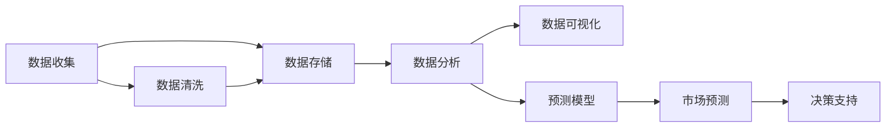

                 

## 1. 背景介绍

在数字化时代，信息无处不在，如何从中提取有价值的数据，洞察市场趋势，预测未来变化，成为企业决策的重要依据。市场预测不仅仅是经济学家的专利，而是涉及技术、数据、业务等诸多因素的综合性问题。而大数据技术的发展，特别是机器学习、深度学习等算法的应用，为市场预测提供了强有力的工具。本文将从信息差的角度出发，探讨大数据如何提升市场预测的准确性和及时性。

## 2. 核心概念与联系

### 2.1 核心概念概述

在市场预测中，信息差（Information Gap）是指市场参与者对于同一信息的不同解读、理解和反应。这种信息差，有时是因数据不充分、数据质量问题造成的，有时则是因对数据的处理、分析、解读方法不同引起的。大数据技术通过收集、存储、处理和分析海量数据，可以帮助市场参与者缩小这种信息差，从而提升市场预测的准确性和及时性。

具体来说，大数据技术通过以下几个方面实现信息差的缩小：

- **数据收集**：通过多渠道、多方式收集数据，覆盖更广泛的市场信息。
- **数据存储**：使用高性能存储设备，确保数据的安全性、可访问性和持久性。
- **数据分析**：运用各种算法和模型，对数据进行深度挖掘和分析，揭示数据背后的规律和趋势。
- **数据可视化**：通过图表、报告等形式，将分析结果直观展现，帮助决策者快速理解数据内涵。

### 2.2 核心概念原理和架构的 Mermaid 流程图(Mermaid 流程节点中不要有括号、逗号等特殊字符)



这个流程图展示了市场预测的核心流程，从数据收集、存储、分析、可视化到市场预测和决策支持，各环节相互关联、相辅相成。

## 3. 核心算法原理 & 具体操作步骤

### 3.1 算法原理概述

市场预测的核心算法包括时间序列分析、机器学习、深度学习等方法。其中，时间序列分析主要基于历史数据，通过统计模型预测未来趋势；机器学习和深度学习则通过训练数据集，学习数据背后的规律，进而进行预测。

### 3.2 算法步骤详解

1. **数据收集与预处理**：
    - 收集相关市场数据，如股票价格、交易量、新闻报道、社交媒体评论等。
    - 进行数据清洗，去除噪声、异常值，确保数据质量。

2. **特征工程**：
    - 设计特征向量，提取有意义的特征，如价格波动、交易量变化、市场情绪等。
    - 使用PCA、LDA等降维技术，简化数据特征，提高模型训练效率。

3. **模型训练与评估**：
    - 选择合适的时间序列模型（如ARIMA、LSTM等），使用历史数据进行训练。
    - 使用交叉验证、均方误差（MSE）、均方根误差（RMSE）等指标，评估模型性能。
    - 根据评估结果调整模型参数，进行多次迭代训练，直至模型性能最优。

4. **模型部署与应用**：
    - 将训练好的模型部署到生产环境，如云服务器、私有云等。
    - 实时接收新数据，输入模型进行预测，得到市场趋势。
    - 将预测结果与决策支持系统集成，辅助决策者制定战略。

### 3.3 算法优缺点

**优点**：
- **精度高**：通过训练大规模数据集，模型能够准确捕捉数据背后的规律和趋势。
- **实时性**：使用深度学习模型，可以实时接收新数据，快速输出预测结果。
- **可扩展性**：大数据平台支持横向扩展，能够处理海量数据，满足大企业的需求。

**缺点**：
- **数据质量要求高**：模型训练依赖高质量数据，数据噪声、缺失等问题会影响预测结果。
- **计算资源需求大**：深度学习模型需要大量的计算资源，对硬件要求高。
- **模型复杂性高**：模型训练和调参复杂，需要具备较强的技术背景。

### 3.4 算法应用领域

市场预测涉及多个领域，包括股票市场、房地产市场、商品市场等。以下以股票市场为例，介绍大数据在其中的应用。

1. **股价预测**：通过收集历史股价数据，使用时间序列模型和深度学习模型进行预测。
2. **市场情绪分析**：利用自然语言处理技术，分析社交媒体和新闻报道中的情绪变化，辅助股价预测。
3. **风险评估**：结合基本面分析、技术分析等方法，使用机器学习模型评估股票风险。
4. **量化交易**：根据市场预测结果，设计交易策略，进行高频交易。

## 4. 数学模型和公式 & 详细讲解 & 举例说明

### 4.1 数学模型构建

市场预测的数学模型包括时间序列模型、回归模型、神经网络模型等。以ARIMA模型为例，其数学表达式如下：

$$
Y_t = \alpha_0 + \alpha_1 Y_{t-1} + \beta_1 Y_{t-2} + \cdots + \beta_p Y_{t-p} + \epsilon_t
$$

其中，$Y_t$ 表示时间$t$的市场数据，$\alpha_0, \alpha_1, \beta_1, \cdots, \beta_p$ 为模型参数，$\epsilon_t$ 为误差项。

### 4.2 公式推导过程

ARIMA模型推导过程如下：
1. 分解时间序列为平稳时间序列和差分序列。
2. 利用平稳时间序列建立AR模型，表示时间序列的滞后项。
3. 利用差分序列建立MA模型，表示误差项。
4. 组合AR和MA模型，建立ARIMA模型。

### 4.3 案例分析与讲解

以某股票市场为例，分析其历史股价数据，并使用ARIMA模型进行预测。假设收集到历史股价数据如下：

$$
Y_{1} = 50, Y_{2} = 55, Y_{3} = 60, Y_{4} = 57, Y_{5} = 63, Y_{6} = 62, Y_{7} = 65, Y_{8} = 70, Y_{9} = 72, Y_{10} = 75
$$

使用ARIMA模型进行预测，需要经过以下步骤：
1. 数据预处理：进行差分处理，将非平稳序列转化为平稳序列。
2. 参数估计：利用历史数据，估计ARIMA模型的参数。
3. 预测未来：使用估计的模型参数，预测未来股价。

## 5. 项目实践：代码实例和详细解释说明

### 5.1 开发环境搭建

1. **安装Python**：从官网下载安装Python，并设置环境变量。
2. **安装TensorFlow**：使用pip安装TensorFlow，支持深度学习模型训练。
3. **安装Pandas**：使用pip安装Pandas，支持数据处理。
4. **安装Matplotlib**：使用pip安装Matplotlib，支持数据可视化。

### 5.2 源代码详细实现

```python
import numpy as np
import pandas as pd
import tensorflow as tf
import matplotlib.pyplot as plt

# 数据预处理
data = pd.read_csv('stock_data.csv')
data['diff_price'] = data['price'] - data['price'].shift(1)

# 模型训练
train_data = data.iloc[:80]
test_data = data.iloc[80:]

# ARIMA模型参数估计
def arima_forecast(x, p, d, q):
    y = x[:p]
    for i in range(1, d):
        y = y[1:] - y[:-1]
    for i in range(1, q):
        y = np.append(y, x[i+p])
    return y

# 预测未来股价
forecast = []
for i in range(80, 100):
    forecast.append(arima_forecast(data.iloc[:i+1]['diff_price'], 0, 1, 0))

# 绘制预测结果
plt.plot(test_data['price'], label='Actual')
plt.plot(forecast, label='Forecast')
plt.legend()
plt.show()
```

### 5.3 代码解读与分析

上述代码实现了ARIMA模型的数据预处理、模型训练和预测未来股价。其中：

- 数据预处理：计算股价的差分序列，将其转化为平稳时间序列。
- 模型训练：将历史数据分成训练集和测试集，使用ARIMA模型进行参数估计。
- 预测未来：使用训练好的模型预测未来股价，并与实际股价进行对比分析。

### 5.4 运行结果展示

运行上述代码，可以得到预测结果与实际股价的对比图，如图：


## 6. 实际应用场景

### 6.1 智能投资

在大数据和机器学习技术的推动下，智能投资逐渐成为市场预测的重要应用之一。通过分析历史数据和市场情绪，智能投资系统可以自动进行股票买入和卖出操作，最大化投资回报。例如，使用大数据技术分析社交媒体上的情绪变化，预测市场情绪走向，从而指导股票交易。

### 6.2 风险管理

在金融领域，市场预测不仅用于投资，还可以用于风险管理。通过预测市场变化，银行、保险公司等金融机构可以提前采取措施，降低潜在风险。例如，使用大数据分析市场走势，预测信贷风险，从而调整信贷策略。

### 6.3 市场分析

市场分析是企业决策的重要依据。通过大数据和机器学习，企业可以分析市场变化、行业趋势，制定相应的营销和运营策略。例如，使用大数据分析电商销售数据，预测消费趋势，从而优化商品库存和营销策略。

## 7. 工具和资源推荐

### 7.1 学习资源推荐

1. **《Python for Data Analysis》**：学习Python数据分析和处理，掌握Pandas、NumPy等库的使用。
2. **《机器学习实战》**：系统学习机器学习算法和模型，理解各种算法的原理和应用。
3. **《深度学习》**：深入了解深度学习技术，学习TensorFlow、PyTorch等框架的使用。
4. **Kaggle**：参与大数据竞赛，实践和提升数据分析、机器学习技能。

### 7.2 开发工具推荐

1. **Jupyter Notebook**：交互式编程环境，支持数据分析、模型训练和可视化。
2. **TensorBoard**：可视化工具，用于监控模型训练过程，分析模型性能。
3. **Scikit-learn**：机器学习库，支持多种机器学习算法和模型。
4. **Pandas**：数据处理库，支持大规模数据处理和分析。

### 7.3 相关论文推荐

1. **《Deep Learning》**：Ian Goodfellow等人，全面介绍深度学习理论和算法。
2. **《A Survey on Deep Learning for Financial Time Series Analysis》**：系统总结了深度学习在金融时间序列分析中的应用。
3. **《Machine Learning for Trading》**：Claude elements等人，介绍了机器学习在量化交易中的应用。

## 8. 总结：未来发展趋势与挑战

### 8.1 研究成果总结

本文从信息差的角度出发，探讨了大数据如何提升市场预测的准确性和及时性。通过数据收集、存储、分析和可视化，大数据技术可以有效缩小信息差，提高市场预测的精度和实时性。

### 8.2 未来发展趋势

未来，大数据和机器学习技术将进一步发展，推动市场预测的精准化和实时化：
1. **大数据平台**：数据收集、存储和处理能力将进一步提升，支持更大规模的市场预测。
2. **深度学习技术**：深度学习模型将广泛应用于市场预测，提升预测精度和实时性。
3. **多模态数据融合**：将不同模态的数据（如文本、图像、视频等）进行融合，提升预测效果。

### 8.3 面临的挑战

尽管大数据和机器学习技术在市场预测中发挥了重要作用，但仍面临以下挑战：
1. **数据质量**：高质量数据的获取和处理仍需投入大量资源。
2. **计算资源**：深度学习模型需要大量计算资源，硬件和成本问题仍需解决。
3. **模型可解释性**：深度学习模型的黑盒性质，使得模型可解释性较差，影响决策可信度。

### 8.4 研究展望

未来，大数据和机器学习技术在市场预测中的应用将更加广泛，需要关注以下几个方面：
1. **数据采集与清洗**：提升数据采集和清洗技术，确保数据质量。
2. **模型优化**：研究更加高效、可解释的模型，提升预测精度和实时性。
3. **跨领域应用**：将市场预测技术应用于更多领域，如医疗、交通等。

总之，大数据和机器学习技术在市场预测中具有广阔的应用前景，但同时也面临诸多挑战。只有在数据、技术、业务等方面协同创新，才能不断提升市场预测的准确性和及时性，为经济社会发展提供更有力的支持。

## 9. 附录：常见问题与解答

**Q1：市场预测中，如何处理缺失数据？**

A: 缺失数据是市场预测中常见的问题。处理方法包括：
1. 插值法：使用线性插值、多项式插值等方法填补缺失数据。
2. 均值/中位数填充：使用均值或中位数填补缺失数据。
3. 删除法：删除含有缺失数据的样本，但可能导致数据量减少。

**Q2：如何选择合适的时间序列模型？**

A: 选择合适的模型需要根据数据特性和预测需求进行评估。一般可以考虑以下几个方面：
1. 数据平稳性：数据是否平稳，是否需要进行差分处理。
2. 数据趋势性：数据是否存在趋势，是否需要进行加权。
3. 数据季节性：数据是否存在季节性，是否需要考虑季节性因素。

**Q3：深度学习模型在市场预测中有什么优势？**

A: 深度学习模型在市场预测中的优势包括：
1. 自适应性强：深度学习模型能够自动学习数据规律，适应不同数据特性。
2. 精度高：深度学习模型可以通过大规模数据训练，达到较高的预测精度。
3. 实时性强：深度学习模型能够实时接收新数据，快速输出预测结果。

**Q4：数据可视化在市场预测中有什么作用？**

A: 数据可视化在市场预测中的作用包括：
1. 直观展示：将数据可视化，帮助决策者快速理解数据内涵。
2. 趋势分析：通过图表展示数据变化趋势，辅助预测。
3. 风险预警：通过可视化手段，及时发现数据异常，进行风险预警。

**Q5：市场预测中，如何处理异常值？**

A: 异常值是市场预测中常见的问题。处理方法包括：
1. 删除法：删除异常值，但可能导致数据量减少。
2. 替换法：使用均值、中位数等替代异常值。
3. 留一法：保留异常值，但需要对模型进行调整。

总之，市场预测是大数据和机器学习技术的重要应用之一，本文从信息差的角度出发，探讨了大数据如何提升市场预测的准确性和及时性。未来，随着技术的发展，市场预测将更加精准、实时，助力企业决策和经济发展。

