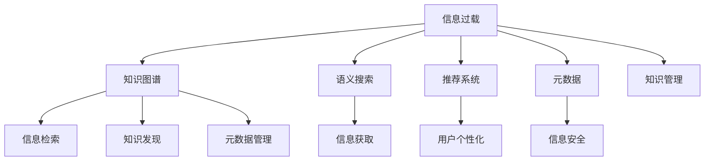

                 

# 信息过载与知识管理系统实施：有效组织和检索信息的指南

## 1. 背景介绍

### 1.1 问题由来
在互联网时代，信息量呈爆炸性增长，各行各业的用户每天被大量信息包围。然而，这些信息常常杂乱无章、重复交叉、真假难辨，给信息接收和处理带来了巨大的压力，形成所谓的“信息过载”。信息过载不仅影响了工作效率，还使得决策质量下降、创新能力受限。因此，如何有效组织、检索信息，提升信息管理能力，成为当前信息时代的重要课题。

### 1.2 问题核心关键点
信息过载问题的核心关键点在于信息的有效组织和快速检索。信息组织涉及对大量原始数据进行分类、整理、关联，形成有结构、有价值的知识库。信息检索则是对知识库中信息进行高效匹配、检索，快速获取相关知识。

1. **信息组织**：主要通过分类、标签、图谱等方法，将数据构建为有结构的知识体系。
2. **信息检索**：主要利用搜索算法、推荐系统等工具，从知识库中快速检索出满足用户需求的信息。
3. **知识管理**：将信息组织和信息检索相结合，形成完整的信息管理框架。

## 2. 核心概念与联系

### 2.1 核心概念概述

为更好地理解信息组织、检索和知识管理的原理与技术，本节将介绍几个密切相关的核心概念：

- **信息过载**：指信息量超出了个人或组织处理能力的极限，导致信息处理效率下降、信息质量受损的现象。
- **知识图谱**：通过节点和边的结构化方式，描述实体间的语义关系，辅助信息检索和知识发现。
- **语义搜索**：强调对文本内容的语义理解，超越关键词匹配，更精准地检索信息。
- **推荐系统**：利用用户行为数据和物品属性，为每个用户推荐最相关的信息。
- **元数据**：描述数据的基本信息，如创建日期、来源、权限等，有助于信息的有效管理和检索。
- **知识管理**：涵盖信息组织、信息检索、知识图谱构建等多个环节，旨在提升组织内外的信息处理能力。

这些核心概念之间的逻辑关系可以通过以下Mermaid流程图来展示：



这个流程图展示了几大核心概念及其之间的关系：

1. 信息过载驱动信息组织和检索技术的发展。
2. 知识图谱和语义搜索提供高效的信息组织和检索手段。
3. 推荐系统和元数据辅助个性化和信息安全。
4. 知识管理整合各个环节，提升信息处理能力。

## 3. 核心算法原理 & 具体操作步骤
### 3.1 算法原理概述

信息过载问题的解决，主要依赖于高效的信息组织和检索技术。核心算法原理包括：

- **信息组织算法**：如分类算法、聚类算法、图谱算法等，用于将大量原始数据构建为有结构的知识体系。
- **信息检索算法**：如倒排索引、向量空间模型、深度学习检索等，用于从知识库中快速检索出满足用户需求的信息。

### 3.2 算法步骤详解

信息组织和检索的技术实现一般包括以下关键步骤：

**Step 1: 数据收集与清洗**
- 从不同来源收集原始数据。
- 对数据进行清洗，去除噪声、缺失值等。

**Step 2: 信息分类与标签**
- 对数据进行自动或半自动的分类，形成主题目录。
- 给每个分类下的数据打上标签，用于描述其特征。

**Step 3: 知识图谱构建**
- 将分类后的数据构建为图谱，描述实体间的关系。
- 使用节点和边表示实体和关系，并添加属性信息。

**Step 4: 信息索引与建立**
- 对图谱中的每个节点和关系建立索引。
- 将索引存储到高效的数据结构中，如倒排索引、图数据库等。

**Step 5: 信息检索与推荐**
- 根据用户查询，在知识库中进行语义或关键词检索。
- 利用推荐算法，将检索结果与用户兴趣进行匹配，提供个性化推荐。

**Step 6: 知识发现与更新**
- 对检索结果进行知识发现，提取有用的信息。
- 定期更新知识库，保证信息的时效性和准确性。

### 3.3 算法优缺点

信息组织和检索的算法具有以下优点：

- **高效检索**：通过知识图谱和语义搜索，能够快速定位和检索信息。
- **多维关联**：知识图谱能够揭示实体间的复杂关系，增强信息关联性。
- **个性化推荐**：推荐系统能够根据用户偏好，提供定制化的信息。
- **易于扩展**：通过模块化设计和并行计算，算法可以方便扩展到更大规模数据。

同时，这些算法也存在一定的局限性：

- **数据质量依赖**：算法效果高度依赖于数据的质量，如分类准确性、标签完整性等。
- **复杂度较高**：知识图谱和深度学习检索算法计算复杂度高，对硬件要求高。
- **用户依赖性强**：推荐系统的效果受用户行为数据影响较大，难以跨用户迁移。
- **实时性不足**：推荐系统可能需要一段时间才能根据新数据更新，实时性较差。

### 3.4 算法应用领域

信息组织和检索技术已经被广泛应用于多个领域，包括但不限于：

- **图书馆与档案馆**：利用分类和标签，构建海量文献和档案的知识库。
- **电子商务平台**：根据用户浏览记录，推荐商品，提升购物体验。
- **社交媒体**：通过关键词检索和语义搜索，推荐用户感兴趣的内容。
- **企业内部知识管理**：对内部文档和信息进行分类、索引，形成知识图谱，帮助员工快速获取所需信息。
- **政府数据管理**：利用元数据和分类，管理政府公开数据，提供便捷的信息检索服务。
- **医疗健康**：构建电子病历和医学文献的知识图谱，辅助医生决策和治疗。

## 4. 数学模型和公式 & 详细讲解  
### 4.1 数学模型构建

信息组织和检索的数学模型主要基于分类、聚类、图谱构建和语义检索等算法，以下将详细介绍几个核心模型：

- **分类模型**：如决策树、支持向量机、K近邻等，用于将数据分为不同的类别。
- **聚类模型**：如K-Means、层次聚类等，用于将相似的数据聚集在一起。
- **图谱模型**：如RDF图谱、Neo4j图数据库等，用于描述实体间的语义关系。
- **语义检索模型**：如向量空间模型、TF-IDF等，用于根据语义匹配检索信息。

### 4.2 公式推导过程

以向量空间模型为例，介绍信息检索的数学原理：

假设有一个文本集合 $D=\{x_1,x_2,...,x_n\}$，每个文本可以表示为一个向量 $x_i=(w_{i1},w_{i2},...,w_{im})$，其中 $w_{ij}$ 表示文本 $x_i$ 中第 $j$ 个词的权重。向量空间模型中，文本 $x_i$ 与查询 $q$ 的相似度定义为它们的内积：

$$
sim(x_i, q) = \sum_{j=1}^m w_{ij}w_{jq}
$$

其中 $w_{jq}$ 为查询词 $q$ 中第 $j$ 个词的权重。

### 4.3 案例分析与讲解

以一个电商平台的商品推荐为例，展示信息组织和检索的实际应用：

- **数据收集**：收集用户浏览记录、购买历史、商品属性等数据。
- **分类与标签**：将商品按照类别进行分类，如服装、电子产品、家居等，并给每个商品打上标签，如品牌、价格、颜色等。
- **知识图谱构建**：将分类后的商品构建为图谱，描述商品之间的关联，如价格关系、上下架关系等。
- **信息索引与建立**：对图谱中的每个节点和关系建立索引，构建倒排索引。
- **信息检索与推荐**：根据用户查询，在知识库中进行语义或关键词检索，利用推荐算法匹配用户兴趣，提供个性化推荐。

## 5. 项目实践：代码实例和详细解释说明
### 5.1 开发环境搭建

在进行信息组织和检索实践前，我们需要准备好开发环境。以下是使用Python进行代码开发的环境配置流程：

1. 安装Anaconda：从官网下载并安装Anaconda，用于创建独立的Python环境。

2. 创建并激活虚拟环境：
```bash
conda create -n infomgt-env python=3.8 
conda activate infomgt-env
```

3. 安装必要的Python包：
```bash
pip install numpy pandas scikit-learn scipy matplotlib jupyter notebook ipython
```

4. 安装面向领域的信息管理工具：
```bash
pip install textblob networkx rdflib elasticsearch
```

完成上述步骤后，即可在`infomgt-env`环境中开始项目实践。

### 5.2 源代码详细实现

这里我们以一个简单的电商商品推荐系统为例，使用Python和Elasticsearch实现基于向量空间模型的商品推荐。

首先，定义商品分类、标签等基本概念：

```python
from collections import defaultdict

class Product:
    def __init__(self, id, name, category, tags):
        self.id = id
        self.name = name
        self.category = category
        self.tags = tags
        self.reviews = []

    def add_review(self, review):
        self.reviews.append(review)

class Review:
    def __init__(self, rating, comment):
        self.rating = rating
        self.comment = comment
```

然后，定义商品分类器和推荐引擎：

```python
from sklearn.feature_extraction.text import CountVectorizer
from sklearn.metrics.pairwise import cosine_similarity

class CategoryIndex:
    def __init__(self):
        self.categories = defaultdict(list)

    def add_product(self, product):
        self.categories[product.category].append(product)

    def get_products(self, category):
        return self.categories[category]

class TFIDFRecommender:
    def __init__(self, products):
        self.products = products
        self.vectorizer = CountVectorizer()

    def fit(self):
        all_reviews = ' '.join([review.comment for product in self.products for review in product.reviews])
        self.vectorizer.fit(all_reviews)

    def get_score(self, product, query):
        vectorizer = CountVectorizer().fit_transform(query)
        query = vectorizer.toarray()
        product_vectors = self.vectorizer.transform([review.comment for product in self.products if product.category == product.category])
        return cosine_similarity(query, product_vectors)[0]
```

最后，使用Elasticsearch进行推荐：

```python
from elasticsearch import Elasticsearch

class ElasticsearchRecommender:
    def __init__(self, products, es_addr='localhost:9200'):
        self.products = products
        self.es = Elasticsearch([{'host': es_addr}])
        self.create_index()

    def create_index(self):
        self.es.indices.create(index='product', ignore=[400, 404])

    def add_product(self, product):
        self.es.index(index='product', id=product.id, body=product.to_dict())

    def recommend(self, query):
        scores = []
        for product in self.products:
            score = self.get_score(product, query)
            scores.append((product, score))
        scores.sort(key=lambda x: x[1], reverse=True)
        return [product for product, score in scores[:5]]
```

以上就是使用Elasticsearch和Python实现商品推荐系统的完整代码实现。

### 5.3 代码解读与分析

让我们再详细解读一下关键代码的实现细节：

**Product类**：
- 定义了商品的基本属性，如ID、名称、分类、标签等。
- 添加了评论功能，并提供了获取评论的方法。

**CategoryIndex类**：
- 用于存储和管理商品分类器，将商品按照分类聚合。
- 提供了添加商品和获取商品的方法。

**TFIDFRecommender类**：
- 使用Scikit-learn的CountVectorizer和cosine_similarity函数，实现基于向量空间模型的推荐。
- fit方法用于训练模型，get_score方法用于获取商品与查询的相似度。

**ElasticsearchRecommender类**：
- 利用Elasticsearch存储和管理商品数据，创建索引，支持快速的查询和推荐。
- 提供了添加商品和推荐商品的方法。

可以看到，Python结合Elasticsearch可以方便地实现复杂的信息组织和检索功能。开发者可以通过灵活配置数据结构和查询语句，满足各种实际需求。

## 6. 实际应用场景
### 6.1 电商平台的商品推荐

基于信息组织和检索技术的推荐系统，已经成为电商平台上不可或缺的组件。通过分析用户行为数据，平台能够实时为用户推荐商品，提高用户满意度和购买转化率。

具体而言，可以收集用户浏览记录、点击记录、评价等数据，将其构建为向量空间模型，并使用TF-IDF算法进行相似度计算。推荐系统根据用户查询和历史行为，匹配最相关的商品，并以列表形式展示。

### 6.2 图书馆的信息检索

图书馆信息管理系统的核心功能之一是高效的信息检索。通过将图书分类、打标签，构建知识图谱，图书馆系统能够快速响应用户的查询需求，帮助用户快速找到所需文献。

在实践中，可以使用分类算法对图书进行自动分类，并使用标签进行二次分类。利用图数据库，构建图书与作者、出版社、主题等实体的关系图谱，提供灵活的检索接口。用户可以输入关键词、分类等查询条件，系统自动匹配并返回结果。

### 6.3 企业的知识管理

企业的知识管理系统需要高效组织和管理内部文档、专利、技术报告等知识资源，供员工快速检索和使用。通过构建知识图谱和分类体系，系统能够提供丰富的知识发现和检索功能。

具体而言，可以收集企业的文档、专利、项目报告等，使用聚类算法对文档进行分类。利用图数据库描述文档之间的关系，如引用关系、合作机构等。用户可以根据关键词、分类、作者等条件进行检索，获取相关文档。

### 6.4 未来应用展望

随着信息组织和检索技术的发展，未来的知识管理系统将具备更强的灵活性和智能化水平。

- **自适应学习**：通过机器学习算法，系统能够自动学习用户行为模式，提供更个性化的推荐。
- **多模态融合**：结合文本、图像、音频等多模态数据，提升知识表示的丰富性。
- **实时更新**：利用流式处理技术，系统能够实时更新知识库，保持信息的时效性。
- **语义理解**：引入自然语言处理技术，提升对用户查询的语义理解，提供更精准的检索结果。
- **跨平台集成**：通过API接口，系统能够与其他应用系统无缝集成，形成更全面的信息生态。

这些趋势表明，未来的信息组织和检索技术将更加智能、高效、灵活，为信息时代的各行各业提供强大的支持。

## 7. 工具和资源推荐
### 7.1 学习资源推荐

为了帮助开发者系统掌握信息组织和检索的理论基础和实践技巧，这里推荐一些优质的学习资源：

1. 《信息检索与内容推荐》系列书籍：详细介绍了信息检索、推荐系统、知识图谱等核心技术。
2. CS224D《信息检索》课程：斯坦福大学开设的信息检索课程，涵盖了核心算法和应用。
3. 《深度学习》书籍：涉及深度学习在信息检索、推荐系统等领域的广泛应用。
4. PyTorch官方文档：提供了丰富的深度学习工具和库，适用于信息组织和检索的实现。
5. Elasticsearch官方文档：详细介绍了Elasticsearch的使用方法和最佳实践。

通过对这些资源的学习实践，相信你一定能够快速掌握信息组织和检索的精髓，并用于解决实际的NLP问题。

### 7.2 开发工具推荐

高效的开发离不开优秀的工具支持。以下是几款用于信息组织和检索开发的常用工具：

1. Python：开源的编程语言，灵活易用，适用于深度学习、自然语言处理等应用。
2. Scikit-learn：基于Python的机器学习库，提供了丰富的分类、聚类、向量空间模型等算法。
3. NetworkX：用于构建和分析复杂网络的工具库，适用于图谱的构建和分析。
4. TensorFlow：Google开发的深度学习框架，支持分布式计算和大规模模型训练。
5. Elasticsearch：高扩展性、高可用的搜索引擎，支持复杂的查询和推荐功能。
6. Apache Spark：支持大规模数据处理和机器学习的分布式计算框架。

合理利用这些工具，可以显著提升信息组织和检索任务的开发效率，加快创新迭代的步伐。

### 7.3 相关论文推荐

信息组织和检索技术的发展源于学界的持续研究。以下是几篇奠基性的相关论文，推荐阅读：

1. TextRank: Beyond Bandit Algorithms for Information Retrieval: Theory and Experiments：提出基于图谱的信息检索算法，通过分析网页间的链接关系进行排序。
2. Neural Information Retrieval using Distributed Word Representations：利用深度学习模型进行文本相似度计算，提升信息检索效果。
3. Convolutional Information Retrieval：提出卷积神经网络进行文本分类和检索，有效提升检索性能。
4. Deep Learning for Recommender Systems：综述了深度学习在推荐系统中的应用，包括文本嵌入、深度神经网络等方法。
5. Transfer Learning for Scalable Text Retrieval：提出基于迁移学习的信息检索方法，利用预训练的词向量提升检索效果。

这些论文代表了大语言模型微调技术的发展脉络。通过学习这些前沿成果，可以帮助研究者把握学科前进方向，激发更多的创新灵感。

## 8. 总结：未来发展趋势与挑战
### 8.1 总结

本文对信息过载与知识管理系统的实施进行了全面系统的介绍。首先阐述了信息过载问题的背景和解决思路，明确了信息组织、信息检索和知识管理的重要性。其次，从原理到实践，详细讲解了信息组织、检索和知识管理的数学模型和算法，给出了信息管理系统的代码实现。同时，本文还广泛探讨了信息管理系统的实际应用场景，展示了信息管理系统的巨大潜力。此外，本文精选了信息管理系统的各类学习资源，力求为读者提供全方位的技术指引。

通过本文的系统梳理，可以看到，信息组织和检索技术正在成为信息时代的重要范式，极大地提升信息管理系统的处理能力。未来，伴随信息技术的不断发展，信息管理系统必将在各行各业中发挥越来越重要的作用，深刻影响人类的生产生活方式。

### 8.2 未来发展趋势

展望未来，信息组织和检索技术将呈现以下几个发展趋势：

1. **自适应学习**：通过机器学习算法，系统能够自动学习用户行为模式，提供更个性化的推荐。
2. **多模态融合**：结合文本、图像、音频等多模态数据，提升知识表示的丰富性。
3. **实时更新**：利用流式处理技术，系统能够实时更新知识库，保持信息的时效性。
4. **语义理解**：引入自然语言处理技术，提升对用户查询的语义理解，提供更精准的检索结果。
5. **跨平台集成**：通过API接口，系统能够与其他应用系统无缝集成，形成更全面的信息生态。

以上趋势表明，未来的信息组织和检索技术将更加智能、高效、灵活，为信息时代的各行各业提供强大的支持。

### 8.3 面临的挑战

尽管信息组织和检索技术已经取得了瞩目成就，但在迈向更加智能化、普适化应用的过程中，它仍面临着诸多挑战：

1. **数据质量依赖**：算法效果高度依赖于数据的质量，如分类准确性、标签完整性等。
2. **计算资源消耗**：算法计算复杂度高，对硬件要求高，需要合理的资源优化策略。
3. **用户行为复杂**：推荐系统的效果受用户行为数据影响较大，难以跨用户迁移。
4. **实时性不足**：推荐系统可能需要一段时间才能根据新数据更新，实时性较差。
5. **隐私和安全**：信息管理系统中包含大量敏感信息，需要有效的隐私保护和安全防护。
6. **模型可解释性**：推荐系统的决策过程缺乏可解释性，难以对其推理逻辑进行分析和调试。

这些挑战凸显了信息管理系统的发展方向，需要从多个维度进行优化和改进。

### 8.4 研究展望

面向未来，信息组织和检索技术需要在以下几个方面寻求新的突破：

1. **自适应学习算法**：开发更加自适应和可迁移的推荐算法，提升系统的跨用户能力。
2. **多模态融合技术**：结合多种数据源，提升知识表示的丰富性和准确性。
3. **实时性优化**：优化算法和数据结构，提升系统的实时响应能力。
4. **隐私保护机制**：设计合理的隐私保护和数据匿名化机制，确保用户隐私安全。
5. **模型可解释性**：引入可解释的算法和工具，提升系统的透明性和可信度。
6. **跨平台集成方法**：设计标准化的API接口，支持信息管理系统的跨平台集成。

这些研究方向的探索，必将引领信息组织和检索技术迈向更高的台阶，为构建智能、高效、安全的信息管理系统铺平道路。

## 9. 附录：常见问题与解答

**Q1: 信息管理系统的核心技术有哪些？**

A: 信息管理系统的核心技术主要包括信息组织、信息检索和知识图谱构建。其中，信息组织通过分类、标签等手段，将大量原始数据构建为有结构的知识库。信息检索通过倒排索引、向量空间模型等技术，快速定位和检索信息。知识图谱通过节点和边的结构化方式，描述实体间的语义关系，辅助信息检索和知识发现。

**Q2: 信息管理系统中如何处理信息过载问题？**

A: 信息过载问题主要通过信息组织和检索技术解决。首先，对大量原始数据进行分类和标签化，构建有序的知识库。然后，利用倒排索引和向量空间模型，快速定位和检索信息。通过知识图谱等技术，提供更精准的信息发现和推荐。

**Q3: 推荐系统有哪些算法？**

A: 推荐系统的算法包括基于协同过滤、基于内容的推荐、基于混合方法的推荐等。常用的算法包括K-Means聚类、TF-IDF算法、向量空间模型、协同过滤算法等。其中，协同过滤算法又分为基于用户的协同过滤和基于物品的协同过滤。

**Q4: 如何提高信息管理系统的实时性？**

A: 提高信息管理系统的实时性主要通过优化算法和数据结构实现。例如，使用倒排索引进行快速检索，利用缓存技术减少数据库访问时间。采用分布式计算和并行处理技术，提升系统处理能力。同时，优化推荐算法和数据结构，减少计算量和时间开销。

**Q5: 信息管理系统中如何保证数据安全？**

A: 信息管理系统中保证数据安全主要通过加密、匿名化、访问控制等手段实现。例如，对敏感数据进行加密存储和传输，防止未授权访问。采用数据匿名化技术，去除用户敏感信息，保护用户隐私。使用访问控制机制，限制用户对数据的访问权限。

通过这些技术手段，可以有效保护信息管理系统的数据安全，确保系统的稳定运行。

---

作者：禅与计算机程序设计艺术 / Zen and the Art of Computer Programming

