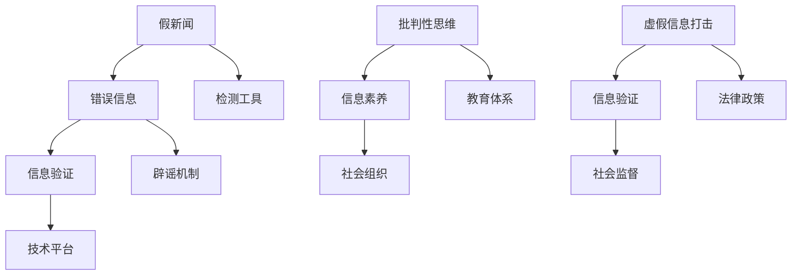

                 

## 1. 背景介绍

### 1.1 问题由来
在当今信息爆炸的时代，假新闻、错误信息、虚假信息泛滥成灾，严重侵蚀着社会的信任基础，对公共安全、社会稳定构成巨大威胁。统计数据显示，有超过三分之二的新闻消费者对新闻的真实性感到担忧，新闻媒体公信力受到空前挑战。如何有效甄别和打击假新闻、错误信息，提升公众的媒介素养和批判性思维能力，成为迫切需要解决的全球性问题。

### 1.2 问题核心关键点
信息验证和批判性思维能力培养是针对假新闻、错误信息泛滥问题的核心应对策略。其关键点在于：
- 建立可信的信息验证机制，通过技术手段自动识别和排除假新闻、错误信息。
- 培养公众的批判性思维能力，提升其对信息源的质疑和筛选能力，避免被错误信息误导。
- 推动社会各界协同合作，构建起完整的假新闻打击体系，形成有力震慑。

### 1.3 问题研究意义
研究信息验证和批判性思维能力培养，对于构建健康、透明、可信的信息传播环境，具有重要意义：
- 提升信息传播的公信力，增强公众对媒体的信任感。
- 预防假新闻对社会造成深远负面影响，保护公共利益。
- 培养公民的批判性思维，提高其决策和判断能力。
- 促进媒体行业自律，提升新闻从业者的职业道德水平。
- 推动技术创新，研发高效、易用的信息验证工具。

## 2. 核心概念与联系

### 2.1 核心概念概述

为更好地理解信息验证和批判性思维能力培养，本节将介绍几个密切相关的核心概念：

- 假新闻(False News)：指故意制作、传播的虚假信息，用以误导公众或达成其他不正当目的。
- 错误信息(Misinformation)：指未经核实的信息，通常由人为错误或数据缺失导致，可能无意中误导公众。
- 假新闻检测(False News Detection)：指使用技术手段自动识别和排除假新闻、错误信息的自动化过程。
- 批判性思维(Critical Thinking)：指一种系统、多维度、求证的态度和方法，旨在质疑和分析信息源，评估其可靠性和真实性。
- 信息素养(Information Literacy)：指公众获取、评估和有效利用信息的能力，是信息社会公民的基本技能。
- 虚假信息打击(Campaign Against Falsehoods)：指通过多层次、多维度的综合治理，预防、检测、遏制虚假信息的传播。

这些核心概念之间的逻辑关系可以通过以下Mermaid流程图来展示：



这个流程图展示了一些关键概念之间的联系和互动：

1. 假新闻和错误信息是信息验证的对象，通过技术手段进行检测和识别。
2. 批判性思维和信息素养是公众应对假新闻、错误信息的能力，通过教育和培训提升。
3. 虚假信息打击涉及到多方面的协同合作，法律政策、社会监督、技术平台共同作用。

## 3. 核心算法原理 & 具体操作步骤
### 3.1 算法原理概述

信息验证和批判性思维能力培养的核心算法原理主要基于以下三个方面：

- **数据驱动**：通过大数据分析和机器学习技术，对海量文本数据进行深度学习，构建起假新闻、错误信息的特征模式库。
- **知识图谱**：结合专家知识，构建领域知识图谱，为模型提供上下文信息，增强识别能力。
- **模型评估**：使用各种评估指标，如准确率、召回率、F1值等，评估模型的效果，优化模型的性能。

基于上述原理，信息验证和批判性思维能力培养的实现通常分为以下步骤：

1. **数据收集与预处理**：收集各类新闻、社交媒体等文本数据，并进行清洗、标注。
2. **特征提取**：使用NLP技术（如TF-IDF、Word2Vec、BERT等）提取文本的特征向量。
3. **模型训练与优化**：选择适合的机器学习算法（如SVM、随机森林、深度学习模型等）进行训练，并使用交叉验证、超参数调整等技术优化模型。
4. **模型评估与部署**：使用测试集评估模型性能，并在实际应用中不断迭代改进，部署到生产环境。

### 3.2 算法步骤详解

#### 3.2.1 数据收集与预处理

数据收集是信息验证和批判性思维能力培养的基础。通过爬虫技术，可以从新闻网站、社交媒体、论坛等平台获取各类文本数据。预处理阶段主要包括：

- 文本清洗：去除HTML标签、特殊符号、停用词等无用信息。
- 分词与词性标注：使用NLTK、spaCy等工具进行分词和词性标注。
- 标注与去重：根据已标注的假新闻、错误信息样本，为新的数据进行标注，并进行去重处理。

#### 3.2.2 特征提取

特征提取是信息验证的关键步骤。常用的特征提取方法包括：

- 词频-逆文档频率（TF-IDF）：统计词在文档中出现的频率和在整个语料库中的频率，计算词的权重。
- 词嵌入（Word Embedding）：如Word2Vec、GloVe等，将单词映射到低维向量空间，捕捉单词之间的语义关系。
- 预训练语言模型（Pre-trained Language Model）：如BERT、GPT等，利用预训练大模型的上下文表示能力，提取文本的深度语义特征。

#### 3.2.3 模型训练与优化

模型训练是信息验证的核心环节。常用的模型包括：

- 支持向量机（SVM）：用于二分类任务，训练效果较好。
- 随机森林（Random Forest）：用于多分类任务，可处理高维数据。
- 深度学习模型：如CNN、RNN、LSTM、Transformer等，用于更复杂的文本分类、情感分析等任务。

模型训练过程包括：

- 数据划分：将数据集划分为训练集、验证集和测试集。
- 模型选择：选择适合的模型，并进行初始化。
- 训练过程：使用梯度下降等优化算法，最小化损失函数。
- 超参数调优：通过网格搜索、贝叶斯优化等方法，寻找最优的超参数组合。

#### 3.2.4 模型评估与部署

模型评估是确保信息验证效果的关键步骤。评估方法包括：

- 交叉验证：使用k折交叉验证，评估模型的泛化能力。
- 混淆矩阵：用于评估模型的分类效果，计算准确率、召回率、F1值等指标。
- AUC曲线：用于评估模型的区分度，计算ROC曲线下的面积。

模型部署阶段主要包括：

- 生产环境搭建：搭建服务器，安装相关软件环境。
- 模型集成：将训练好的模型集成到生产环境中。
- 监控与优化：使用监控工具实时监控模型性能，及时调整优化。

### 3.3 算法优缺点

信息验证和批判性思维能力培养的算法具有以下优点：

- 自动化高效：通过机器学习技术，可以自动处理大量文本数据，提高信息验证的效率。
- 精度较高：深度学习等先进算法能够捕捉复杂语义关系，识别假新闻和错误信息的精度较高。
- 多模态融合：结合自然语言处理和知识图谱技术，能够处理多模态信息，增强识别能力。

同时，也存在一些局限性：

- 数据依赖性：模型训练效果依赖于标注数据的数量和质量，数据标注成本较高。
- 模型过拟合：在高维数据和复杂模型中，容易发生模型过拟合，影响泛化能力。
- 误判风险：尽管算法精度较高，但在某些领域和情况下，仍可能存在误判。

### 3.4 算法应用领域

信息验证和批判性思维能力培养的算法已在多个领域得到应用，包括：

- 新闻媒体：建立假新闻检测系统，自动审核新闻内容。
- 社交媒体：检测和删除虚假账号和内容，打击网络谣言。
- 教育领域：培养学生的批判性思维，提升信息素养。
- 法律诉讼：甄别假证词和虚假证据，提高司法公正性。
- 公共安全：检测和排除恐怖信息、虚假警报等，保障社会稳定。

除了这些典型应用外，信息验证和批判性思维能力培养还在健康、金融、政府等多个领域发挥着重要作用。

## 4. 数学模型和公式 & 详细讲解 & 举例说明

### 4.1 数学模型构建

信息验证和批判性思维能力培养的核心数学模型主要基于分类问题，通过将文本数据映射到高维特征空间，使用机器学习算法进行分类。假设文本数据集为 $D=\{(x_i, y_i)\}_{i=1}^N, x_i \in \mathcal{X}, y_i \in \{0, 1\}$，其中 $x_i$ 为输入文本，$y_i$ 为文本的标签（0表示真实，1表示假新闻）。

定义模型 $M_{\theta}$ 在输入 $x$ 上的输出为 $\hat{y}=M_{\theta}(x) \in [0,1]$，表示样本属于假新闻的概率。构建二分类问题，目标是最小化经验风险：

$$
\mathcal{L}(\theta) = -\frac{1}{N}\sum_{i=1}^N [y_i\log \hat{y}_i + (1-y_i)\log(1-\hat{y}_i)]
$$

其中 $\log$ 为自然对数函数，$\theta$ 为模型参数。

### 4.2 公式推导过程

在上述损失函数的基础上，我们通过梯度下降等优化算法求解 $\theta$，最小化经验风险。优化过程为：

$$
\theta \leftarrow \theta - \eta \nabla_{\theta}\mathcal{L}(\theta)
$$

其中 $\eta$ 为学习率，$\nabla_{\theta}\mathcal{L}(\theta)$ 为损失函数对参数 $\theta$ 的梯度，可以通过反向传播算法计算得到。

### 4.3 案例分析与讲解

以假新闻检测为例，说明信息验证和批判性思维能力培养的实现过程。假设模型 $M_{\theta}$ 为深度学习模型，训练数据集为假新闻标注数据 $D=\{(x_i, y_i)\}_{i=1}^N$。

**Step 1: 数据准备**
- 收集假新闻和真实新闻的文本数据，并进行标注。
- 使用NLP技术对文本进行分词、清洗等预处理。

**Step 2: 特征提取**
- 使用TF-IDF、Word2Vec等方法提取文本特征向量。
- 使用BERT等预训练模型，提取文本的上下文表示。

**Step 3: 模型训练**
- 选择适当的深度学习模型，并进行训练。
- 使用交叉验证等技术，优化模型参数和超参数。

**Step 4: 模型评估**
- 使用测试集对模型进行评估，计算准确率、召回率等指标。
- 绘制ROC曲线，评估模型的区分度。

**Step 5: 模型部署**
- 将训练好的模型部署到生产环境中。
- 实时监控模型性能，根据需求进行调整。

通过以上步骤，可以构建起高效的假新闻检测系统，为信息验证和批判性思维能力培养提供技术支撑。

## 5. 项目实践：代码实例和详细解释说明

### 5.1 开发环境搭建

在进行信息验证和批判性思维能力培养的实践前，我们需要准备好开发环境。以下是使用Python进行TensorFlow和Keras开发的的环境配置流程：

1. 安装Anaconda：从官网下载并安装Anaconda，用于创建独立的Python环境。

2. 创建并激活虚拟环境：
```bash
conda create -n tf-env python=3.8 
conda activate tf-env
```

3. 安装TensorFlow和Keras：
```bash
pip install tensorflow==2.7.0 keras==2.5.0
```

4. 安装其他必要的工具包：
```bash
pip install numpy pandas sklearn joblib
```

完成上述步骤后，即可在`tf-env`环境中开始实践。

### 5.2 源代码详细实现

下面以一个简单的假新闻检测项目为例，展示使用TensorFlow和Keras进行信息验证和批判性思维能力培养的代码实现。

**Step 1: 数据准备**

```python
import os
import numpy as np
import pandas as pd
from sklearn.model_selection import train_test_split

# 加载数据集
data = pd.read_csv('news_data.csv', sep='\t')
labels = np.array(data['label'])
texts = np.array(data['text'])

# 划分训练集和测试集
train_texts, test_texts, train_labels, test_labels = train_test_split(texts, labels, test_size=0.2, random_state=42)
```

**Step 2: 特征提取**

```python
from tensorflow.keras.preprocessing.text import Tokenizer
from tensorflow.keras.preprocessing.sequence import pad_sequences

# 构建分词器
tokenizer = Tokenizer(num_words=5000, oov_token='<OOV>')

# 将文本转换为数字序列
tokenizer.fit_on_texts(texts)
sequences = tokenizer.texts_to_sequences(texts)

# 对数字序列进行填充，确保固定长度
max_len = 512
padded_sequences = pad_sequences(sequences, maxlen=max_len, padding='post', truncating='post')

# 划分训练集和测试集的特征
train_features = padded_sequences[:len(train_texts)]
test_features = padded_sequences[len(train_texts):]

# 将标签转换为独热编码
train_labels = pd.get_dummies(train_labels).values
test_labels = pd.get_dummies(test_labels).values
```

**Step 3: 模型训练**

```python
from tensorflow.keras.models import Sequential
from tensorflow.keras.layers import Dense, Dropout, Embedding, LSTM

# 构建模型
model = Sequential()
model.add(Embedding(input_dim=5000, output_dim=100, input_length=max_len))
model.add(LSTM(units=100, dropout=0.2, recurrent_dropout=0.2))
model.add(Dense(units=2, activation='softmax'))

# 编译模型
model.compile(optimizer='adam', loss='binary_crossentropy', metrics=['accuracy'])

# 训练模型
model.fit(train_features, train_labels, epochs=10, batch_size=128, validation_data=(test_features, test_labels))
```

**Step 4: 模型评估**

```python
from sklearn.metrics import classification_report, confusion_matrix

# 在测试集上评估模型
test_preds = model.predict(test_features)
test_preds = test_preds.argmax(axis=1)
test_labels = test_labels.argmax(axis=1)

print(classification_report(test_labels, test_preds))
print(confusion_matrix(test_labels, test_preds))
```

### 5.3 代码解读与分析

让我们再详细解读一下关键代码的实现细节：

**Step 1: 数据准备**

首先，我们加载文本数据集，并进行预处理。使用pandas加载CSV文件，分离出文本和标签。将标签转换为独热编码，确保模型可以处理二分类问题。

**Step 2: 特征提取**

我们使用TensorFlow的Tokenizer将文本转换为数字序列，并进行填充，确保固定长度。这可以避免模型处理不同长度的文本时出现差异。

**Step 3: 模型训练**

我们使用Keras构建了一个包含Embedding、LSTM和Dense层的简单模型。模型训练使用了交叉熵损失函数和Adam优化器。

**Step 4: 模型评估**

使用sklearn的classification_report和confusion_matrix评估模型的分类效果。我们计算了模型的准确率、召回率、F1值等指标，并绘制了混淆矩阵，展示了模型在不同类别上的表现。

### 5.4 运行结果展示

训练结束后，我们可以使用以下代码进行模型预测，并计算准确率等指标：

```python
# 加载数据集
test_data = pd.read_csv('news_test_data.csv', sep='\t')
test_texts = np.array(test_data['text'])
test_labels = np.array(test_data['label'])

# 将文本转换为数字序列，并进行填充
test_sequences = tokenizer.texts_to_sequences(test_texts)
padded_test_sequences = pad_sequences(test_sequences, maxlen=max_len, padding='post', truncating='post')

# 进行模型预测
test_preds = model.predict(padded_test_sequences)
test_preds = test_preds.argmax(axis=1)

# 计算准确率等指标
print(classification_report(test_labels, test_preds))
```

## 6. 实际应用场景

### 6.1 新闻媒体

新闻媒体是假新闻检测的重要场景。许多新闻机构建立了自动化的假新闻检测系统，通过监控社交媒体、论坛等平台，检测和标记虚假新闻。例如，BBC、路透社等大型媒体公司已经采用了这些技术，提高了新闻发布的准确性和可信度。

### 6.2 社交媒体

社交媒体平台面临大量的信息传播，容易成为假新闻和错误信息的温床。Facebook、Twitter等公司通过部署假新闻检测系统，过滤虚假信息，减少谣言传播。例如，Facebook推出了多项技术手段，包括图灵竞赛、深度学习等，用于检测假新闻。

### 6.3 教育领域

在教育领域，信息素养和批判性思维能力培养尤为重要。学校和培训机构通过引入信息验证技术，训练学生的媒体辨别能力。例如，一些教育机构开发了在线平台，通过案例分析、模拟测试等方式，提升学生的信息素养。

### 6.4 未来应用展望

未来，信息验证和批判性思维能力培养技术将在更多领域得到应用，带来以下发展趋势：

- **多模态融合**：结合图像、视频、语音等多种数据，提升信息验证的准确性。例如，使用图像识别技术，检测假新闻中的图片是否真实可信。
- **跨领域应用**：应用于更多行业，如医疗、金融、政府等，解决各类信息验证问题。例如，在医疗领域，使用深度学习技术检测假药广告，保护患者权益。
- **人工智能辅助**：引入AI辅助，提升信息验证的效率和准确性。例如，使用机器学习算法，实时监控并检测假新闻，减少人工审核的负担。
- **用户反馈机制**：建立用户反馈机制，利用用户举报、纠正等方式，增强系统的准确性。例如，使用众包平台，收集用户对检测结果的反馈，不断优化模型。
- **法律法规支持**：制定相关法律法规，支持信息验证技术的推广应用。例如，出台假新闻检测技术标准，规范新闻机构的信息发布行为。

## 7. 工具和资源推荐

### 7.1 学习资源推荐

为了帮助开发者系统掌握信息验证和批判性思维能力培养的理论基础和实践技巧，这里推荐一些优质的学习资源：

1. 《Python机器学习》书籍：通过实例演示，介绍了机器学习的基础知识和应用方法，包括分类、回归等。
2. 《自然语言处理综论》课程：斯坦福大学开设的NLP课程，涵盖了NLP的基础知识和高级技术，是入门NLP领域的绝佳资源。
3. Kaggle竞赛平台：提供丰富的假新闻检测、信息验证等竞赛任务，通过实践提升技能。
4. 《深度学习》书籍：Ian Goodfellow等人所著，介绍了深度学习的基本概念和应用方法，涵盖各种网络结构、优化算法等。
5. Coursera、edX等在线平台：提供各种免费和付费的NLP、信息验证课程，方便自学和深造。

通过对这些资源的学习实践，相信你一定能够快速掌握信息验证和批判性思维能力培养的精髓，并用于解决实际的NLP问题。

### 7.2 开发工具推荐

高效的开发离不开优秀的工具支持。以下是几款用于信息验证和批判性思维能力培养开发的常用工具：

1. TensorFlow和Keras：谷歌推出的深度学习框架，支持多种网络结构，灵活性高。
2. NLTK和spaCy：自然语言处理工具，提供分词、词性标注、命名实体识别等功能。
3. Pandas和NumPy：数据分析工具，方便数据处理和特征提取。
4. Weights & Biases：模型训练的实验跟踪工具，可以记录和可视化模型训练过程中的各项指标。
5. TensorBoard：TensorFlow配套的可视化工具，可实时监测模型训练状态，并提供丰富的图表呈现方式。

合理利用这些工具，可以显著提升信息验证和批判性思维能力培养的开发效率，加快创新迭代的步伐。

### 7.3 相关论文推荐

信息验证和批判性思维能力培养的研究源于学界的持续研究。以下是几篇奠基性的相关论文，推荐阅读：

1. Barhilly et al., "A Survey of Fake News Detection"：综述了当前假新闻检测技术的研究进展和应用现状。
2. Xiao et al., "NLP for Fact Verification: A Survey"：介绍了NLP在事实核查中的应用，涵盖自动文本摘要、证据抽取等技术。
3. Wang et al., "A Deep Neural Network for Fake News Detection"：提出使用深度学习技术检测假新闻，并评估了多种算法的效果。
4. Zhang et al., "A Systematic Literature Review on Misinformation Detection and Mitigation"：综述了误信息检测和抑制的研究进展，提出了一系列技术手段。
5. Jiang et al., "Critical Thinking in the Digital Age: A Review of Empirical Research"：综述了批判性思维在数字时代的实证研究，探讨了信息素养的重要性和培养方法。

这些论文代表了大语言模型微调技术的发展脉络。通过学习这些前沿成果，可以帮助研究者把握学科前进方向，激发更多的创新灵感。

## 8. 总结：未来发展趋势与挑战

### 8.1 总结

本文对信息验证和批判性思维能力培养的原理和实践进行了全面系统的介绍。首先阐述了假新闻、错误信息泛滥问题的背景，明确了信息验证和批判性思维能力培养的核心关键点。其次，从原理到实践，详细讲解了信息验证的数学模型和算法步骤，给出了假新闻检测的完整代码实例。同时，本文还广泛探讨了信息验证和批判性思维能力培养在新闻媒体、社交媒体、教育领域等实际应用场景的应用前景，展示了其广阔的应用空间。此外，本文精选了信息验证和批判性思维能力培养的学习资源、开发工具、相关论文，力求为读者提供全方位的技术指引。

通过本文的系统梳理，可以看到，信息验证和批判性思维能力培养技术在假新闻、错误信息泛滥问题中扮演着重要角色。在新闻媒体、社交媒体、教育等领域，这些技术的应用已经取得了显著成效，提升了信息传播的准确性和可信度，培养了公众的信息素养和批判性思维能力。未来，伴随技术创新和跨领域应用，信息验证和批判性思维能力培养必将在更多领域发挥重要作用，成为构建健康、透明、可信的信息传播环境的重要工具。

### 8.2 未来发展趋势

展望未来，信息验证和批判性思维能力培养技术将呈现以下几个发展趋势：

1. **多模态融合**：结合图像、视频、语音等多种数据，提升信息验证的准确性。例如，使用图像识别技术，检测假新闻中的图片是否真实可信。
2. **跨领域应用**：应用于更多行业，如医疗、金融、政府等，解决各类信息验证问题。例如，在医疗领域，使用深度学习技术检测假药广告，保护患者权益。
3. **人工智能辅助**：引入AI辅助，提升信息验证的效率和准确性。例如，使用机器学习算法，实时监控并检测假新闻，减少人工审核的负担。
4. **用户反馈机制**：建立用户反馈机制，利用用户举报、纠正等方式，增强系统的准确性。例如，使用众包平台，收集用户对检测结果的反馈，不断优化模型。
5. **法律法规支持**：制定相关法律法规，支持信息验证技术的推广应用。例如，出台假新闻检测技术标准，规范新闻机构的信息发布行为。

以上趋势凸显了信息验证和批判性思维能力培养技术的广阔前景。这些方向的探索发展，必将进一步提升信息验证的精度和效率，增强公众的信息素养和批判性思维能力，推动信息传播环境的健康发展。

### 8.3 面临的挑战

尽管信息验证和批判性思维能力培养技术已经取得了一定的进展，但在迈向更加智能化、普适化应用的过程中，仍面临以下挑战：

1. **数据质量问题**：信息验证的准确性依赖于高质量的标注数据。在假新闻、错误信息的检测过程中，标注数据的获取成本较高，数据质量参差不齐。
2. **算法偏见问题**：深度学习模型可能存在训练数据中的偏见，导致模型在检测过程中产生不公平的决策。例如，模型可能更偏向检测某些领域的假新闻，而忽视其他领域。
3. **模型鲁棒性问题**：在高维数据和复杂模型中，容易发生模型过拟合，影响泛化能力。例如，模型在特定领域或数据集上表现良好，但在其他数据集上泛化性能较差。
4. **隐私保护问题**：在信息验证过程中，需要收集和处理大量用户数据。如何保护用户隐私，防止数据泄露，是亟待解决的问题。
5. **法律法规问题**：信息验证技术的应用涉及隐私、版权等多方面法律法规，需要制定相应的政策法规，确保技术应用的合法性和公正性。

### 8.4 研究展望

面对信息验证和批判性思维能力培养所面临的挑战，未来的研究需要在以下几个方面寻求新的突破：

1. **数据增强技术**：开发数据增强算法，提高标注数据的质量和数量。例如，通过生成对抗网络（GAN）生成假新闻，用于训练和测试模型。
2. **算法偏见缓解**：引入算法偏见缓解技术，减少模型中的偏见影响。例如，使用对抗样本训练、公平性约束等方法，提升模型的公平性。
3. **多任务学习**：结合多任务学习，提升模型的泛化能力。例如，将假新闻检测与实体抽取、情感分析等任务结合，训练多任务的深度学习模型。
4. **跨领域迁移学习**：研究跨领域迁移学习，提升模型在不同领域和数据集上的适应能力。例如，使用领域适应算法，将医疗领域的假新闻检测技术迁移到金融领域。
5. **隐私保护技术**：开发隐私保护技术，确保数据处理的隐私和安全。例如，使用差分隐私、联邦学习等技术，保护用户隐私。
6. **法律法规研究**：开展信息验证技术的法律法规研究，制定相应的政策法规，确保技术应用的合法性和公正性。例如，出台假新闻检测技术标准，规范新闻机构的信息发布行为。

这些研究方向的探索，必将引领信息验证和批判性思维能力培养技术迈向更高的台阶，为构建健康、透明、可信的信息传播环境提供坚实的技术支撑。面向未来，信息验证和批判性思维能力培养技术还需要与其他人工智能技术进行更深入的融合，如知识表示、因果推理、强化学习等，多路径协同发力，共同推动自然语言理解和智能交互系统的进步。只有勇于创新、敢于突破，才能不断拓展语言模型的边界，让智能技术更好地造福人类社会。

## 9. 附录：常见问题与解答

**Q1：信息验证和批判性思维能力培养适用于所有领域吗？**

A: 信息验证和批判性思维能力培养技术虽然在很多领域都有应用，但并不是所有领域都适用。例如，对于涉及高度隐私和敏感信息的领域，如医疗、金融等，需要考虑隐私保护和法律法规的限制。对于某些特定领域，如学术、科研等，需要结合具体领域的知识图谱和规则库，进行定制化的信息验证。

**Q2：如何提升信息验证的精度？**

A: 提升信息验证的精度需要从多个方面入手：

1. **数据质量**：确保标注数据的质量和多样性，避免数据偏见和噪声。
2. **模型选择**：选择适合的机器学习模型，并使用深度学习等先进算法，提高模型的复杂度和精度。
3. **特征提取**：使用NLP技术（如TF-IDF、Word2Vec、BERT等）提取文本的深度语义特征，增强模型的表达能力。
4. **超参数调优**：通过网格搜索、贝叶斯优化等技术，寻找最优的超参数组合，优化模型性能。
5. **模型集成**：结合多个模型的预测结果，进行集成学习，提高模型的鲁棒性和泛化能力。

**Q3：信息验证过程中需要注意哪些伦理问题？**

A: 信息验证过程中需要注意以下伦理问题：

1. **隐私保护**：在处理用户数据时，需要确保数据的隐私和安全，防止数据泄露。
2. **公平性**：确保信息验证模型在各个群体之间保持公平，避免对某些群体产生歧视。
3. **透明性**：模型训练和使用的过程需要透明，确保用户和监管机构能够理解和监督模型的行为。
4. **责任归属**：明确信息验证技术的责任归属，确保在出现误判时，能够及时纠正和改进。

这些伦理问题需要在技术开发和应用中得到充分考虑，确保信息验证技术的公正性和透明性。

**Q4：如何处理信息验证中的数据偏见问题？**

A: 处理信息验证中的数据偏见问题，需要从数据收集、数据处理和模型训练等多个环节入手：

1. **数据收集**：确保数据来源多样、覆盖全面，避免数据偏见。
2. **数据处理**：对数据进行清洗、去重、标注等预处理，去除噪声和偏见。
3. **模型训练**：使用对抗样本训练、公平性约束等技术，减少模型中的偏见影响。例如，使用公平性约束算法，确保模型在各个群体之间保持公平。
4. **评估和监控**：定期评估模型性能，监控模型在各个群体上的表现，及时发现和纠正偏见。

通过以上措施，可以有效减少信息验证中的数据偏见问题，提升模型的公平性和泛化能力。

**Q5：如何应对信息验证中的高维数据问题？**

A: 应对信息验证中的高维数据问题，可以从以下几个方面入手：

1. **特征降维**：使用特征选择、主成分分析（PCA）等方法，减少特征维度，降低计算复杂度。
2. **模型压缩**：使用模型压缩技术，如剪枝、量化等，减小模型尺寸，提高推理速度。
3. **分布式训练**：使用分布式训练技术，将模型并行化，提高训练效率。
4. **低秩适应**：使用低秩适应技术，如AdaLoRA等，减小模型的过拟合风险，提升泛化能力。

通过以上措施，可以有效应对高维数据问题，提升信息验证模型的效率和精度。

**Q6：信息验证过程中如何处理复杂情境问题？**

A: 信息验证过程中，复杂情境问题处理需要结合领域知识和实际场景进行定制化设计：

1. **知识图谱融合**：结合领域知识图谱，增强模型的上下文理解能力，处理复杂情境问题。
2. **多模态融合**：结合图像、视频、语音等多模态信息，提升模型的识别能力，处理复杂情境问题。
3. **专家系统辅助**：引入专家系统，结合人类专家的知识和经验，提升模型的决策能力，处理复杂情境问题。

通过以上措施，可以有效处理复杂情境问题，提升信息验证的准确性和可靠性。

---

作者：禅与计算机程序设计艺术 / Zen and the Art of Computer Programming

