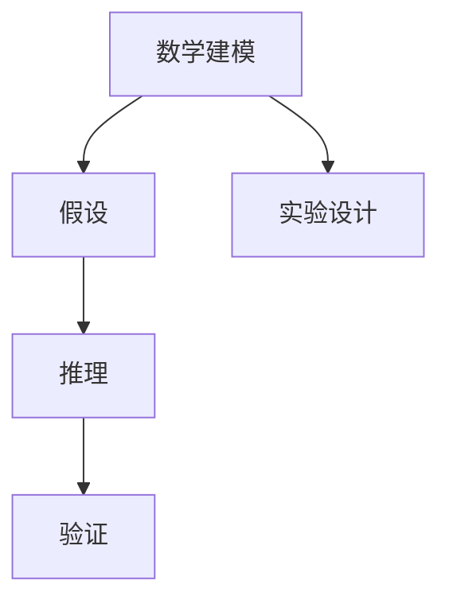

                 

# 像数学家一样思考：模拟原则

## 1. 背景介绍

### 1.1 问题由来

在计算机科学和人工智能领域，数学模型的构建和应用一直是推动技术进步的重要驱动力。从早期的线性回归、逻辑回归到近年来的深度学习、强化学习，数学模型提供了从数据中提取规律、进行预测和决策的工具。然而，尽管数学模型已经取得显著成就，其思维过程往往与人类的直观和实验思维有所差异。

因此，如何培养计算机科学家和工程师像数学家一样思考，理解和应用数学模型，成为一个重要的研究课题。这不仅有助于提升技术的创新性和可靠性，还为解决复杂问题提供了新的视角和方法。

### 1.2 问题核心关键点

本文旨在探讨如何培养计算机科学家和工程师以数学家的思维方式理解和应用数学模型。具体来说，将从以下三个方面展开讨论：

1. **数学建模的思维方式**：包括如何抽象问题、建立数学模型、理解模型假设和推理过程。
2. **数学模型与实际问题的映射**：如何从实际问题中提取数学模型，以及如何选择合适的数学模型。
3. **数学模型的应用与优化**：如何通过优化算法和实验设计来提升数学模型的性能。

通过这些讨论，希望读者能够掌握像数学家一样思考的能力，更好地应用数学模型解决实际问题。

## 2. 核心概念与联系

### 2.1 核心概念概述

为了更好地理解本文的内容，我们先介绍几个关键概念：

- **数学建模**：通过抽象和简化，将实际问题转化为数学模型的过程。数学建模是解决复杂问题的关键步骤。
- **数学模型假设**：数学模型为了简化计算和推理，通常会引入一些假设。理解这些假设对于正确应用模型至关重要。
- **数学推理**：基于数学模型进行的逻辑推导和证明。数学推理是验证数学模型正确性的重要手段。
- **实验设计**：为了验证数学模型的性能，进行的实验设计和方法选择。实验设计是评估数学模型有效性的基础。

这些概念之间相互关联，共同构成了数学建模的思维框架。

### 2.2 核心概念原理和架构的 Mermaid 流程图



这个流程图展示了数学建模的整个流程：从问题抽象、假设引入到实验验证，每一个步骤都是数学建模不可或缺的部分。

## 3. 核心算法原理 & 具体操作步骤

### 3.1 算法原理概述

数学建模的核心是建立与实际问题相符合的数学模型，并利用数学推理对其进行验证和优化。这一过程可以分为以下几个步骤：

1. **问题抽象**：将实际问题转化为数学问题，明确问题的输入、输出和约束条件。
2. **假设引入**：为了简化问题，引入一些合理的假设。
3. **模型构建**：基于问题和假设，构建数学模型。
4. **模型验证**：通过实验设计，验证模型的正确性和性能。
5. **模型优化**：利用优化算法，提升模型的精度和泛化能力。

### 3.2 算法步骤详解

#### 3.2.1 问题抽象

问题抽象是数学建模的第一步，其目的是将实际问题转化为数学问题。这一步骤通常涉及以下几个步骤：

- **识别问题**：明确问题的定义、目标和限制条件。
- **数据收集**：收集与问题相关的数据和信息。
- **数据预处理**：对数据进行清洗、归一化和特征提取。
- **抽象建模**：将数据和问题转化为数学表达式。

例如，假设我们要解决一个股票市场的预测问题，首先需要进行数据收集和预处理，然后将历史股价转化为时间序列数据，再通过统计方法或机器学习模型建立数学模型。

#### 3.2.2 假设引入

假设引入是为了简化问题，使模型能够更好地处理和预测。常见的假设包括：

- **独立同分布假设**：假设数据符合某种分布，例如正态分布。
- **平稳假设**：假设数据在不同时间段内具有相似的分布。
- **线性假设**：假设数据之间的关系是线性的。

以线性回归为例，我们假设自变量和因变量之间的关系是线性的，即 $y = \theta_0 + \theta_1 x_1 + \theta_2 x_2 + \cdots + \theta_n x_n + \epsilon$，其中 $\epsilon$ 是误差项。

#### 3.2.3 模型构建

模型构建是基于问题和假设，建立数学模型的过程。常见的数学模型包括：

- **统计模型**：如线性回归、逻辑回归、时间序列模型等。
- **机器学习模型**：如决策树、随机森林、神经网络等。
- **优化模型**：如线性规划、整数规划等。

在构建模型时，需要选择合适的算法和参数设置，以确保模型能够有效拟合数据，并进行准确的预测。例如，线性回归模型使用最小二乘法来拟合数据，并计算回归系数 $\theta_0, \theta_1, \cdots, \theta_n$。

#### 3.2.4 模型验证

模型验证是通过实验设计，验证模型的正确性和性能。常见的验证方法包括：

- **交叉验证**：将数据划分为训练集和测试集，评估模型在测试集上的表现。
- **A/B测试**：将模型应用于实际问题，比较其与基准模型的表现。
- **敏感性分析**：分析模型对输入参数的敏感度，确保模型的鲁棒性。

例如，在股票市场预测中，我们可以使用交叉验证来评估模型的预测精度，使用A/B测试来比较不同模型的表现，进行敏感性分析来评估模型对数据分布的敏感度。

#### 3.2.5 模型优化

模型优化是通过优化算法，提升模型的精度和泛化能力。常见的优化算法包括：

- **梯度下降法**：用于线性回归、逻辑回归等模型的参数优化。
- **遗传算法**：用于优化模型的参数设置。
- **粒子群优化**：用于寻找最优解。

例如，在优化线性回归模型时，我们通过梯度下降法不断调整回归系数，直到模型在测试集上达到最优性能。

### 3.3 算法优缺点

数学建模的优势在于其严格性和可验证性，能够提供精确的数学推导和结果。然而，数学建模也存在一些缺点，例如：

- **假设限制**：数学模型通常会引入一些假设，这些假设可能与实际问题不完全相符。
- **计算复杂性**：一些数学模型需要高计算资源，难以处理大规模数据。
- **过度拟合**：在复杂模型中，过度拟合现象容易发生。

### 3.4 算法应用领域

数学建模广泛应用于科学、工程、经济等多个领域，例如：

- **金融工程**：利用数学模型进行风险管理、资产定价等。
- **机器学习**：构建和优化机器学习模型，如神经网络、决策树等。
- **信号处理**：通过数学模型进行信号滤波、降噪等。
- **生物信息学**：利用数学模型分析基因序列、蛋白质结构等。
- **气象预测**：利用数学模型预测天气变化、气候变化等。

## 4. 数学模型和公式 & 详细讲解 & 举例说明

### 4.1 数学模型构建

数学建模的过程通常包括以下几个步骤：

1. **问题抽象**：将实际问题转化为数学问题，明确问题的输入、输出和约束条件。
2. **假设引入**：为了简化问题，引入一些合理的假设。
3. **模型构建**：基于问题和假设，构建数学模型。

以线性回归模型为例，其构建过程如下：

1. **问题抽象**：假设我们有一个时间序列 $y = \{y_1, y_2, \cdots, y_n\}$，我们想要预测未来的 $y_{n+1}$。
2. **假设引入**：我们假设 $y_{n+1}$ 与历史数据 $x = \{x_1, x_2, \cdots, x_n\}$ 之间存在线性关系，即 $y_{n+1} = \theta_0 + \theta_1 x_1 + \theta_2 x_2 + \cdots + \theta_n x_n + \epsilon$，其中 $\epsilon$ 是误差项。
3. **模型构建**：通过最小二乘法拟合数据，计算回归系数 $\theta_0, \theta_1, \cdots, \theta_n$。

### 4.2 公式推导过程

以线性回归模型为例，其最小二乘法的推导过程如下：

设 $y_{n+1} = \theta_0 + \theta_1 x_1 + \theta_2 x_2 + \cdots + \theta_n x_n + \epsilon$，其中 $\theta_0, \theta_1, \cdots, \theta_n$ 为未知参数，$\epsilon$ 为误差项。

我们需要最小化误差平方和 $\sum_{i=1}^n (y_i - \hat{y}_i)^2$，其中 $\hat{y}_i = \theta_0 + \theta_1 x_{1,i} + \theta_2 x_{2,i} + \cdots + \theta_n x_{n,i}$。

根据最小二乘法，我们需要求导数 $\frac{\partial \sum_{i=1}^n (y_i - \hat{y}_i)^2}{\partial \theta_j} = 0$，其中 $j = 0, 1, \cdots, n$。

推导过程如下：

$$
\frac{\partial \sum_{i=1}^n (y_i - \hat{y}_i)^2}{\partial \theta_j} = \frac{\partial \sum_{i=1}^n (y_i - (\theta_0 + \theta_1 x_{1,i} + \theta_2 x_{2,i} + \cdots + \theta_n x_{n,i}))^2}{\partial \theta_j} = 0
$$

化简得：

$$
\frac{\partial \sum_{i=1}^n (y_i - \hat{y}_i)^2}{\partial \theta_j} = 2 \sum_{i=1}^n (y_i - \hat{y}_i)x_{j,i} = 0
$$

进一步化简得：

$$
\sum_{i=1}^n (y_i - \hat{y}_i)x_{j,i} = 0
$$

解得回归系数 $\theta_j = \frac{\sum_{i=1}^n (y_i - \bar{y})x_{j,i}}{\sum_{i=1}^n x_{j,i}^2}$，其中 $\bar{y} = \frac{1}{n} \sum_{i=1}^n y_i$。

### 4.3 案例分析与讲解

以股票市场预测为例，我们可以使用线性回归模型来预测未来股价。假设我们有一组历史股价数据 $\{x_1, x_2, \cdots, x_n\}$ 和对应的收益率 $\{y_1, y_2, \cdots, y_n\}$。

1. **问题抽象**：我们想要预测未来的收益率 $y_{n+1}$。
2. **假设引入**：我们假设 $y_{n+1}$ 与历史数据 $x = \{x_1, x_2, \cdots, x_n\}$ 之间存在线性关系，即 $y_{n+1} = \theta_0 + \theta_1 x_1 + \theta_2 x_2 + \cdots + \theta_n x_n + \epsilon$。
3. **模型构建**：通过最小二乘法拟合数据，计算回归系数 $\theta_0, \theta_1, \cdots, \theta_n$。

计算回归系数：

$$
\theta_j = \frac{\sum_{i=1}^n (y_i - \bar{y})x_{j,i}}{\sum_{i=1}^n x_{j,i}^2}
$$

使用该模型进行预测时，我们可以输入新的历史数据 $x_{n+1}$，计算出预测值 $\hat{y}_{n+1} = \theta_0 + \theta_1 x_{1,n+1} + \theta_2 x_{2,n+1} + \cdots + \theta_n x_{n,n+1}$。

## 5. 项目实践：代码实例和详细解释说明

### 5.1 开发环境搭建

在进行数学建模的实践时，我们需要准备好开发环境。以下是使用Python进行SciPy和NumPy开发的开发环境配置流程：

1. 安装Anaconda：从官网下载并安装Anaconda，用于创建独立的Python环境。

2. 创建并激活虚拟环境：
```bash
conda create -n scipy-env python=3.8 
conda activate scipy-env
```

3. 安装SciPy和NumPy：
```bash
conda install scipy numpy
```

4. 安装各类工具包：
```bash
pip install matplotlib pandas scikit-learn seaborn statsmodels jupyter notebook ipython
```

完成上述步骤后，即可在`scipy-env`环境中开始数学建模的实践。

### 5.2 源代码详细实现

下面我们以线性回归模型为例，给出使用SciPy库进行数学建模的Python代码实现。

```python
import numpy as np
from scipy.optimize import minimize
from sklearn.linear_model import LinearRegression
from sklearn.datasets import make_regression

# 构建线性回归模型
def linear_regression(X, y):
    # 使用最小二乘法求解回归系数
    theta = minimize(np.linalg.norm(y - X @ np.linalg.lstsq(X, y, rcond=None)[0]), method='BFGS').x
    return theta

# 构建数据集
X, y = make_regression(n_samples=100, n_features=5, n_informative=3, noise=0.1, random_state=42)
X = np.insert(X, 0, 1, axis=1)  # 添加截距项

# 计算回归系数
theta = linear_regression(X, y)

# 预测新样本
X_new = np.array([[1, 2, 3, 4, 5]])
y_pred = X_new @ theta

print('回归系数:', theta)
print('预测结果:', y_pred)
```

### 5.3 代码解读与分析

让我们再详细解读一下关键代码的实现细节：

**linear_regression函数**：
- 定义线性回归模型，使用SciPy的`minimize`函数求解最小二乘法的回归系数。
- 输入为特征矩阵`X`和目标向量`y`，输出为回归系数向量`theta`。

**数据集构建**：
- 使用Scikit-learn的`make_regression`函数生成模拟数据集。
- 添加截距项，使其成为线性回归模型可处理的形式。

**回归系数计算**：
- 使用`linear_regression`函数计算回归系数向量`theta`。
- 通过`X_new @ theta`计算新样本的预测值`y_pred`。

可以看到，使用SciPy和NumPy进行数学建模的代码实现相对简洁高效，适合快速迭代研究。

## 6. 实际应用场景

### 6.1 金融工程

在金融工程中，数学建模被广泛应用于风险管理、资产定价、期权定价等领域。以期权定价为例，我们可以通过Black-Scholes模型对期权价格进行建模和预测。

### 6.2 机器学习

机器学习中的数学建模涉及目标函数的定义、损失函数的优化等。以决策树为例，我们可以通过信息熵、基尼系数等指标，建立数学模型并进行优化。

### 6.3 信号处理

在信号处理中，数学建模通常涉及滤波器设计、降噪、特征提取等。以滤波器设计为例，我们可以通过数学模型建立滤波器的频率响应，并进行优化。

## 7. 工具和资源推荐

### 7.1 学习资源推荐

为了帮助读者系统掌握数学建模的理论与实践，这里推荐一些优质的学习资源：

1. 《数学建模：统计、优化与机器学习》：全面介绍数学建模的基本概念和方法，适合初学者学习。
2. 《Python数据科学手册》：介绍NumPy、SciPy、Scikit-learn等数据科学工具的详细用法，适合实践操作。
3. Coursera的《机器学习》课程：由斯坦福大学Andrew Ng教授讲授，介绍机器学习的基本概念和算法，适合深入学习。
4. Kaggle：一个数据科学竞赛平台，提供大量数据集和解决方案，适合实战练习。

通过对这些资源的学习实践，相信读者能够全面掌握数学建模的精髓，并用于解决实际问题。

### 7.2 开发工具推荐

高效的工具支持是数学建模不可或缺的。以下是几款用于数学建模开发的常用工具：

1. Python：一种功能强大的编程语言，具有丰富的数据科学库和工具。
2. Jupyter Notebook：一种交互式的Python开发环境，适合编写和测试代码。
3. PyCharm：一种流行的IDE，提供自动补全、调试等功能，适合开发复杂算法。
4. MATLAB：一种专业的数学计算工具，适合数学建模和可视化。

合理利用这些工具，可以显著提升数学建模的开发效率，加速创新迭代的步伐。

### 7.3 相关论文推荐

数学建模和应用的研究源于学界的持续探索。以下是几篇奠基性的相关论文，推荐阅读：

1. Black-Scholes Model: Pricing of European and American Options:《Black-Scholes模型：欧式和美式期权的定价》：介绍Black-Scholes模型及其在期权定价中的应用。
2. Information Theory and Statistical Learning:《信息论与统计学习》：介绍信息熵、基尼系数等指标，以及它们在机器学习中的应用。
3. Linear Regression Analysis:《线性回归分析》：详细介绍线性回归模型的建立和优化过程。

这些论文代表了数学建模和应用的发展脉络。通过学习这些前沿成果，可以帮助研究者把握学科前进方向，激发更多的创新灵感。

## 8. 总结：未来发展趋势与挑战

### 8.1 总结

本文对数学建模的思维方式进行了全面系统的介绍。首先阐述了数学建模的思维方式，包括问题抽象、假设引入、模型构建、模型验证和模型优化。其次，从实际应用的角度，介绍了数学建模在金融工程、机器学习、信号处理等多个领域的应用。最后，推荐了一些学习资源和开发工具，帮助读者系统掌握数学建模的理论与实践。

通过本文的系统梳理，可以看到，数学建模已经成为解决复杂问题的有力工具，被广泛应用于科学、工程、经济等多个领域。未来，伴随计算资源和数据资源的不断丰富，数学建模技术必将迎来新的突破，推动人工智能技术的持续发展。

### 8.2 未来发展趋势

展望未来，数学建模技术将呈现以下几个发展趋势：

1. **跨领域应用**：数学建模的应用将从传统的工程、金融等领域扩展到更多新兴领域，如医疗、生物、环境等。
2. **多模态融合**：数学建模将与其他技术进行更深入的融合，如深度学习、因果推断等，形成更加全面的决策模型。
3. **自动化和智能化**：数学建模将与人工智能技术结合，实现自动化建模和智能化决策，提升效率和精度。
4. **可解释性和透明性**：数学建模将更加注重可解释性和透明性，提高模型的可信度和应用价值。

### 8.3 面临的挑战

尽管数学建模技术已经取得显著成就，但在迈向更加智能化、普适化应用的过程中，它仍面临诸多挑战：

1. **数据稀缺**：一些复杂问题需要大量高质量数据，而数据收集和标注往往耗时耗力。
2. **模型复杂性**：一些问题需要构建复杂的数学模型，高计算资源和专业知识要求较高。
3. **鲁棒性不足**：一些模型面对新数据或噪声数据时，泛化性能可能较差。

### 8.4 研究展望

未来的研究需要在以下几个方面寻求新的突破：

1. **自动化建模**：开发自动化建模工具，减少对人类专家的依赖，提升建模效率。
2. **多模态融合**：将数学建模与其他技术结合，形成多模态融合的决策模型。
3. **鲁棒性增强**：开发鲁棒性强的数学模型，提升模型在复杂环境下的性能。
4. **可解释性**：开发可解释性强的数学模型，提高模型的可信度和应用价值。

这些研究方向将引领数学建模技术迈向更高的台阶，为解决复杂问题提供新的方法和工具。

## 9. 附录：常见问题与解答

**Q1: 数学建模是否适用于所有问题？**

A: 数学建模通常适用于复杂问题，可以将其抽象为数学问题并构建模型。但对于一些简单问题，直接应用经验或规则即可。

**Q2: 数学建模中的假设是什么？**

A: 数学建模中的假设是为了简化问题，使模型能够更好地处理和预测。常见的假设包括独立同分布假设、平稳假设、线性假设等。

**Q3: 如何选择合适的数学模型？**

A: 选择合适的数学模型需要考虑问题的复杂性、数据的特点以及模型的可解释性。例如，线性回归模型适用于线性关系明显的问题，而神经网络模型适用于非线性关系明显的问题。

**Q4: 数学建模的实验设计如何进行？**

A: 数学建模的实验设计通常包括以下几个步骤：划分训练集和测试集、设置评估指标、进行交叉验证、调整模型参数等。

**Q5: 数学建模的优化算法有哪些？**

A: 数学建模的优化算法包括梯度下降法、牛顿法、遗传算法等。选择哪种算法取决于问题的特点和模型的复杂性。

---

作者：禅与计算机程序设计艺术 / Zen and the Art of Computer Programming

