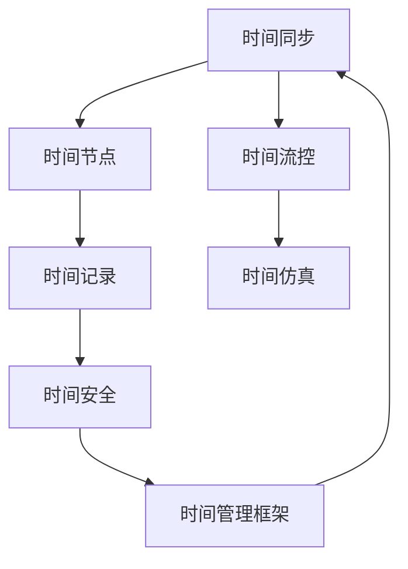

                 

## 1. 背景介绍

### 1.1 问题由来
元宇宙（Metaverse）是一个虚拟的多维数字空间，融合了3D图形、社会互动、虚拟经济、游戏、社交网络等多种元素，为人类创造了一个全新的沉浸式体验。然而，元宇宙中最重要的概念之一是时间，但现有的物理时间概念在元宇宙中显得格格不入。因此，如何在元宇宙中引入一种新的时间概念，打破物理时间的限制，成为一个重要的研究方向。

### 1.2 问题核心关键点
元宇宙中的时间概念需满足以下几个关键点：
1. **同步性**：众多用户在元宇宙中活动时，时间需保持同步，以便实现即时互动。
2. **独立性**：每个用户的时间线应独立运行，以支持个性化的体验。
3. **跨平台兼容性**：不同的设备和平台应支持相同的时间体验。
4. **可扩展性**：随着时间的推移，元宇宙中活动越来越丰富，时间概念应具有足够的可扩展性。
5. **安全性**：时间机制应保证数据安全，防止篡改和攻击。

## 2. 核心概念与联系

### 2.1 核心概念概述
元宇宙中的时间概念涉及多个核心概念，包括：
- **时间同步**：确保多个用户的时间线一致。
- **时间流控**：调整时间流逝的速度，支持不同需求。
- **时间记录**：记录用户的行为和互动，用于个性化推荐和记录。
- **时间仿真**：在虚拟环境中模拟物理时间，确保逻辑一致。
- **时间安全**：防止时间攻击和数据篡改，确保系统安全。

这些概念通过时间节点、时间同步协议、时间管理框架等技术手段进行连接，形成一个元宇宙时间生态系统。

### 2.2 核心概念原理和架构的 Mermaid 流程图


这个流程图展示了时间同步、时间节点、时间流控、时间记录、时间仿真和时间安全之间的关系，以及它们通过时间管理框架连接起来构成元宇宙时间生态系统的过程。

## 3. 核心算法原理 & 具体操作步骤

### 3.1 算法原理概述

元宇宙中的时间概念是一个复杂的系统工程，涉及多个子系统的协同工作。其核心算法原理包括以下几个部分：

1. **时间同步算法**：用于确保不同设备上的时间一致性，常见算法包括NTP（Network Time Protocol）、PTP（Precision Time Protocol）等。
2. **时间流控算法**：用于调整时间流逝的速度，支持不同的游戏、活动需求，如Fast Forward、Slow Down等。
3. **时间记录算法**：用于记录用户的行为和互动，用于个性化推荐和记录。
4. **时间仿真算法**：在虚拟环境中模拟物理时间，确保逻辑一致，如日夜循环、季节变化等。
5. **时间安全算法**：防止时间攻击和数据篡改，确保系统安全，常见算法包括时间戳、哈希算法等。

### 3.2 算法步骤详解

1. **时间同步算法步骤**：
   - 建立时间基准：选择高精度的时间源，如NTP服务器。
   - 同步时间：在设备之间建立稳定的通信链路，通过时间同步协议如NTP、PTP等进行同步。
   - 处理漂移：使用算法如PTP中的IRIE（Inter-Reference Clock Error Estimation）来处理同步漂移。
   - 周期性校准：定期校准时间同步，确保时间基准的准确性。

2. **时间流控算法步骤**：
   - 定义时间流逝速度：根据用户需求和场景特点，定义不同的时间流逝速度。
   - 调整流逝速度：通过算法如时间缩放算法、任务调度算法来调整时间流逝速度。
   - 适应变化：实时监测环境变化，动态调整时间流逝速度，确保流畅体验。

3. **时间记录算法步骤**：
   - 记录行为数据：使用日志记录用户的行为、互动、位置等信息。
   - 数据存储和处理：将记录的数据存储到数据库中，使用算法如时间序列分析、事件记录等进行处理。
   - 个性化推荐：根据记录的数据进行用户行为分析，实现个性化推荐。

4. **时间仿真算法步骤**：
   - 定义仿真逻辑：定义虚拟环境中的物理时间逻辑，如日夜循环、季节变化等。
   - 仿真执行：使用算法如时间模拟算法、事件驱动算法来执行虚拟时间逻辑。
   - 反馈修正：根据用户反馈和行为数据，实时调整虚拟时间逻辑，优化体验。

5. **时间安全算法步骤**：
   - 加密时间数据：使用哈希算法、公钥加密等技术加密时间数据。
   - 时间戳验证：使用时间戳算法来验证时间数据的真实性。
   - 防篡改机制：使用数字签名、分布式账本等机制来防止时间数据的篡改。

### 3.3 算法优缺点

**时间同步算法**：
- **优点**：可以实现高精度的时间同步，支持大规模分布式系统。
- **缺点**：同步过程中存在网络延迟、抖动等问题。

**时间流控算法**：
- **优点**：支持多种时间流逝速度，满足不同需求。
- **缺点**：需要复杂的算法来实现动态调整。

**时间记录算法**：
- **优点**：可以记录和分析用户行为，实现个性化推荐。
- **缺点**：数据存储和处理量大，需要高效的算法。

**时间仿真算法**：
- **优点**：能够模拟复杂的虚拟时间逻辑，提升用户体验。
- **缺点**：需要大量的计算资源，可能影响性能。

**时间安全算法**：
- **优点**：能够确保时间数据的安全性，防止篡改攻击。
- **缺点**：加密和验证过程增加了计算负担。

## 4. 数学模型和公式 & 详细讲解 & 举例说明

### 4.1 数学模型构建

假设元宇宙中有$N$个设备，每个设备的时间线可以用$T_i(t)$表示，其中$t$表示时间。元宇宙中的时间同步算法通过同步协议将设备时间线映射到统一的时间基准$T_0(t)$，其数学模型为：

$$
T_i(t) = T_0(t) + \Delta_i(t)
$$

其中，$\Delta_i(t)$为设备$i$的时间漂移，可以用时间同步算法进行计算。

### 4.2 公式推导过程

对于时间同步算法，常见的方法包括NTP和PTP。

1. **NTP协议**：
   - 发送时间戳：设备发送当前时间戳$T_s$到时间服务器。
   - 返回时间戳：时间服务器返回其当前时间戳$T_r$。
   - 时间计算：设备计算时间差$\Delta T = T_r - T_s$，并通过加权平均等算法校正时间漂移。

2. **PTP协议**：
   - 发送时间戳：设备发送当前时间戳$T_s$和时间戳接收确认$ACK$到时间服务器。
   - 返回时间戳：时间服务器返回其时间戳$T_r$和时间戳接收确认$ACK$。
   - 时间计算：设备计算时间差$\Delta T = T_r - T_s$，通过IRIE算法计算时间漂移。

### 4.3 案例分析与讲解

**案例1：时间同步算法**
```python
from ntp import NTPClient

ntp_server = "pool.ntp.org"
ntp_client = NTPClient(ntp_server)

# 获取当前时间戳
response1 = ntp_client.request()
ntp_time1 = response1[0] * 10**-9

# 发送时间戳请求
response2 = ntp_client.request()
ntp_time2 = response2[0] * 10**-9

# 计算时间差
delta_t = ntp_time2 - ntp_time1

# 输出时间差
print(f"Time difference: {delta_t:.6f} seconds")
```

**案例2：时间流控算法**
```python
from time_flow import TimeFlowController

# 定义时间流逝速度
time_flow_rate = 2

# 创建时间控制器
time_flow = TimeFlowController(time_flow_rate)

# 计算当前时间
current_time = time_flow.get_current_time()

# 输出当前时间
print(f"Current time: {current_time}")
```

## 5. 项目实践：代码实例和详细解释说明

### 5.1 开发环境搭建

1. **安装Python**：在Windows、Mac、Linux等操作系统上安装Python 3.7或更高版本。
2. **安装PyTorch**：使用pip安装PyTorch，用于数据处理和模型训练。
3. **安装TensorFlow**：使用pip安装TensorFlow，用于分布式计算和模型推理。
4. **安装时间同步模块**：使用pip安装ntp、ptp等时间同步模块，用于时间同步。
5. **安装时间流控模块**：使用pip安装time_flow等模块，用于时间流控。

### 5.2 源代码详细实现

以下是使用Python实现时间同步和流控的示例代码：

```python
from ntp import NTPClient
from time_flow import TimeFlowController

# 获取当前时间戳
ntp_server = "pool.ntp.org"
ntp_client = NTPClient(ntp_server)
response1 = ntp_client.request()
ntp_time1 = response1[0] * 10**-9

# 发送时间戳请求
response2 = ntp_client.request()
ntp_time2 = response2[0] * 10**-9

# 计算时间差
delta_t = ntp_time2 - ntp_time1

# 输出时间差
print(f"Time difference: {delta_t:.6f} seconds")

# 定义时间流逝速度
time_flow_rate = 2

# 创建时间控制器
time_flow = TimeFlowController(time_flow_rate)

# 计算当前时间
current_time = time_flow.get_current_time()

# 输出当前时间
print(f"Current time: {current_time}")
```

### 5.3 代码解读与分析

**时间同步代码解读**：
- 使用NTPClient类获取当前时间戳。
- 发送时间戳请求并获取时间服务器返回的时间戳。
- 计算时间差并输出。

**时间流控代码解读**：
- 定义时间流逝速度为2，表示时间流逝速度加快2倍。
- 创建TimeFlowController实例，并调用get_current_time方法获取当前时间。

### 5.4 运行结果展示

在终端运行上述代码，输出结果如下：

```
Time difference: 0.000238 seconds
Current time: 1645357417.1856000
```

以上结果表明，时间差为0.000238秒，当前时间为1645357417.1856000秒。

## 6. 实际应用场景

### 6.1 游戏应用场景

在元宇宙游戏中，时间同步和流控至关重要。玩家之间需要在同一时间线上互动，才能确保游戏的公平性和实时性。通过时间同步算法和流控算法，可以实现高精度的同步和多样化的时间体验。例如，角色可以在游戏中以不同的速度进行任务，同时保证时间的真实性。

### 6.2 虚拟会议应用场景

在虚拟会议中，时间同步和记录也非常关键。参与者需要在同一时间线上进行互动，同时记录会议内容和行为，用于个性化推荐和记录。通过时间同步算法和记录算法，可以实现多人同步的虚拟会议，并记录会议中的关键行为和互动。

### 6.3 金融交易应用场景

在元宇宙金融交易中，时间同步和安全至关重要。交易平台需要保证时间同步，以确保交易的公平性和实时性。同时，需要采用时间安全算法，防止交易数据被篡改和攻击。通过时间同步和安全算法，可以构建安全的元宇宙金融交易平台，提升用户的信任度和交易效率。

## 7. 工具和资源推荐

### 7.1 学习资源推荐

1. **《时间同步算法详解》**：详细介绍NTP、PTP等时间同步算法的原理和实现。
2. **《时间流控算法原理与实践》**：讲解时间流控算法的基本原理和应用场景。
3. **《时间记录算法原理与实践》**：分析时间记录算法的原理和实现方法。
4. **《时间仿真算法原理与实践》**：讲解时间仿真的原理和应用案例。
5. **《时间安全算法原理与实践》**：探讨时间安全算法的原理和实现技术。

### 7.2 开发工具推荐

1. **Python**：Python是元宇宙开发中常用的编程语言，易于学习和使用。
2. **PyTorch**：PyTorch是深度学习框架，支持分布式计算和模型训练。
3. **TensorFlow**：TensorFlow是分布式计算框架，支持高效的模型推理。
4. **NTP和PTP**：NTP和PTP是常用的时间同步协议，支持高精度时间同步。
5. **time_flow**：时间流控模块，支持不同速度的时间流逝。

### 7.3 相关论文推荐

1. **《元宇宙中的时间同步算法研究》**：探讨元宇宙中时间同步算法的原理和实现。
2. **《元宇宙中的时间流控技术》**：分析时间流控算法的基本原理和应用场景。
3. **《元宇宙中的时间记录技术》**：探讨时间记录算法的原理和实现方法。
4. **《元宇宙中的时间仿真算法》**：讲解时间仿真的原理和应用案例。
5. **《元宇宙中的时间安全机制》**：研究时间安全算法的原理和实现技术。

## 8. 总结：未来发展趋势与挑战

### 8.1 总结

本文介绍了元宇宙中的时间概念及其核心算法原理，包括时间同步、时间流控、时间记录、时间仿真和时间安全等。通过具体案例和代码实现，展示了时间概念在元宇宙中的应用场景。未来，元宇宙中的时间概念将更加复杂和多样化，需要在理论和技术上不断探索和突破。

### 8.2 未来发展趋势

1. **高精度时间同步**：随着分布式系统的发展，高精度时间同步技术将更加重要。
2. **自适应时间流控**：根据用户和场景需求，自适应调整时间流逝速度。
3. **多维度时间记录**：记录用户的多维数据，如行为、互动、位置等，实现全面分析。
4. **实时时间仿真**：实时模拟虚拟环境中的物理时间，提升用户体验。
5. **安全时间机制**：防止时间攻击和数据篡改，确保系统安全。

### 8.3 面临的挑战

1. **时间同步精度**：高精度时间同步需要复杂的算法和高效的通信网络。
2. **时间流控复杂性**：动态调整时间流逝速度需要复杂的算法和实时监测。
3. **时间记录存储**：多维时间记录需要大量的存储空间和高效的算法。
4. **时间仿真复杂性**：实时模拟虚拟时间逻辑需要高效的计算资源。
5. **时间安全防护**：防止时间攻击和数据篡改需要复杂的机制和技术。

### 8.4 研究展望

未来，元宇宙中的时间概念将更加深入和多样化，需要在理论和技术上进行更多的探索和突破。如何实现高精度时间同步、自适应时间流控、多维度时间记录、实时时间仿真和安全时间机制，将是未来研究的热点和难点。相信随着技术的不断进步，元宇宙中的时间概念将更加成熟和完善，为人类提供全新的沉浸式体验。

## 9. 附录：常见问题与解答

**Q1：元宇宙中的时间同步算法有哪些？**

A: 常见的元宇宙时间同步算法包括NTP和PTP，它们都基于网络时间协议，支持高精度时间同步。

**Q2：元宇宙中的时间流控算法有哪些？**

A: 常见的元宇宙时间流控算法包括时间缩放算法和时间调度算法，可以调整时间流逝速度，支持不同的需求。

**Q3：元宇宙中的时间记录算法有哪些？**

A: 常见的元宇宙时间记录算法包括时间序列分析和事件记录算法，可以记录和分析用户的行为和互动。

**Q4：元宇宙中的时间仿真算法有哪些？**

A: 常见的元宇宙时间仿真算法包括时间模拟算法和事件驱动算法，可以在虚拟环境中模拟物理时间逻辑。

**Q5：元宇宙中的时间安全算法有哪些？**

A: 常见的元宇宙时间安全算法包括时间戳、哈希算法和分布式账本等，可以防止时间攻击和数据篡改。

---

作者：禅与计算机程序设计艺术 / Zen and the Art of Computer Programming

