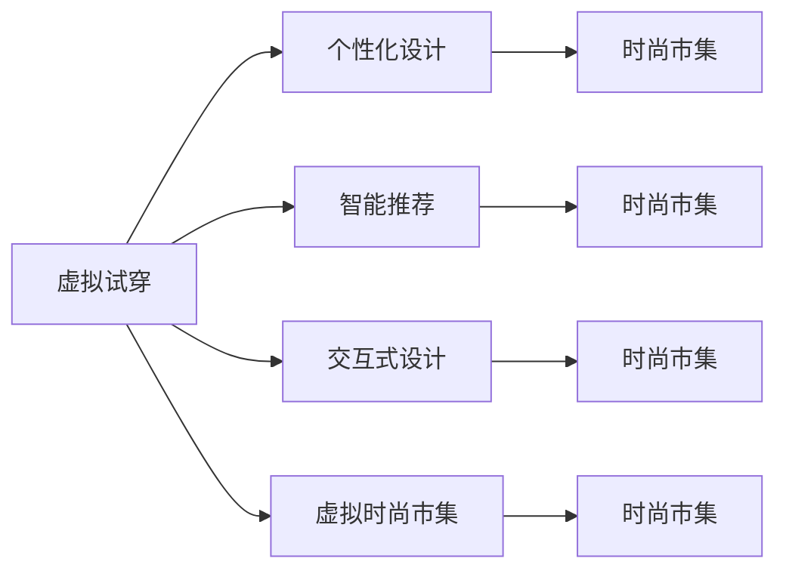

                 

## 1. 背景介绍

### 1.1 问题由来
随着技术的飞速发展和全球化进程的加速，时尚界正经历着一场深刻的变革。传统的时尚设计、生产和消费模式已经难以满足现代消费者的需求。元宇宙（Metaverse）的出现，为时尚行业提供了新的发展机遇。通过虚拟空间和数字化技术，设计师和消费者可以打破时间和空间的界限，进行更加个性化、交互性的穿搭设计。

元宇宙时尚设计的兴起，不仅是一场技术革新，更是一场文化和艺术的革命。它融合了虚拟现实、增强现实、人工智能等多种技术，为时尚产业注入了新的活力和创造力。本文将从元宇宙时尚设计的概念、技术原理、应用场景及未来展望等方面，深入探讨这一新兴领域的现状和前景。

### 1.2 问题核心关键点
元宇宙时尚设计的关键点在于将数字化技术与时尚设计深度结合，通过虚拟空间和算法驱动，创造出新的时尚表达形式和消费体验。这包括以下几个方面：

- **虚拟试穿**：通过虚拟空间中的试穿系统，消费者可以在虚拟环境中试穿不同服装，获得更加真实的穿搭感受。
- **个性化设计**：利用人工智能算法，根据用户的偏好和身体数据，生成个性化的时尚设计方案。
- **智能推荐**：通过数据分析和机器学习，智能推荐符合用户风格和场合的穿搭方案。
- **交互式设计**：用户可以通过虚拟空间与设计师、其他用户进行互动，共同创作和分享时尚作品。
- **虚拟时尚市集**：在虚拟空间中建立时尚市集，提供虚拟时尚购物体验。

这些核心技术点共同构成了元宇宙时尚设计的基本框架，使得虚拟空间成为时尚创新的新舞台。

### 1.3 问题研究意义
元宇宙时尚设计的兴起，为时尚行业带来了全新的发展机遇。它不仅能够满足消费者对个性化、交互性的需求，还为设计师提供了新的创作空间和表达方式。通过元宇宙时尚设计，时尚产业可以打破传统界限，实现更广泛、更深入的创新，推动行业向数字化、智能化方向发展。

本文的研究意义在于：
1. **揭示技术原理**：详细阐述虚拟试穿、个性化设计、智能推荐等核心技术原理，为技术开发者提供理论基础。
2. **实践指导**：通过代码实例和实践指南，为实践者提供具体的开发路径和技术实现方法。
3. **应用拓展**：探讨元宇宙时尚设计在虚拟试穿、个性化定制、时尚电商等实际应用场景中的应用前景。
4. **未来展望**：预测元宇宙时尚设计的未来发展趋势，为行业从业者提供未来方向的参考。

## 2. 核心概念与联系

### 2.1 核心概念概述

元宇宙时尚设计是一个将虚拟空间和数字化技术应用于时尚领域的创新范式。它涉及多个核心概念，包括：

- **虚拟试穿**：利用虚拟现实技术，让消费者在虚拟空间中试穿不同服装，获得更加真实的穿搭感受。
- **个性化设计**：通过算法和人工智能技术，根据用户的偏好和身体数据，生成个性化的时尚设计方案。
- **智能推荐**：使用数据分析和机器学习算法，智能推荐符合用户风格和场合的穿搭方案。
- **交互式设计**：用户可以通过虚拟空间与设计师、其他用户进行互动，共同创作和分享时尚作品。
- **虚拟时尚市集**：在虚拟空间中建立时尚市集，提供虚拟时尚购物体验。

这些概念之间的逻辑关系可以通过以下Mermaid流程图来展示：



这个流程图展示了这个概念之间的关联：

1. 虚拟试穿为个性化设计提供数据支持。
2. 智能推荐系统可以基于个性化设计生成推荐。
3. 交互式设计在虚拟市集中得到应用。
4. 虚拟市集是所有技术的集成应用场所。

## 3. 核心算法原理 & 具体操作步骤

### 3.1 算法原理概述

元宇宙时尚设计的核心算法原理主要包括以下几个方面：

- **虚拟试穿**：利用虚拟现实（VR）和增强现实（AR）技术，创建虚拟空间环境，实现用户试穿和穿搭展示。
- **个性化设计**：基于用户偏好和身体数据，利用机器学习和深度学习算法，生成个性化时尚设计方案。
- **智能推荐**：通过数据分析和机器学习算法，智能推荐符合用户风格和场合的穿搭方案。
- **交互式设计**：利用自然语言处理（NLP）和计算机视觉（CV）技术，实现用户与设计师、其他用户之间的互动和交流。

### 3.2 算法步骤详解

**虚拟试穿算法步骤**：

1. **数据采集**：采集用户的身体数据和偏好数据，包括身高、体重、身体尺寸、颜色偏好等。
2. **虚拟试穿模型构建**：建立虚拟试穿模型，利用VR技术创建虚拟试衣间，生成虚拟试穿场景。
3. **试穿反馈处理**：用户试穿服装后，收集用户的反馈数据，如舒适度、颜色搭配、款式偏好等。
4. **优化模型**：根据用户反馈，不断优化虚拟试穿模型，提高试穿效果。

**个性化设计算法步骤**：

1. **用户数据收集**：收集用户的偏好数据、身体数据等。
2. **风格分析**：利用NLP技术，分析用户的穿搭风格和喜好，如简约、复古、时尚等。
3. **个性化设计生成**：基于用户数据和风格分析结果，生成个性化时尚设计方案。
4. **设计方案展示**：利用AR技术，将个性化设计方案展示给用户。

**智能推荐算法步骤**：

1. **数据收集**：收集用户的历史穿搭数据和偏好数据。
2. **用户画像生成**：利用机器学习算法，生成用户画像，包括用户风格、场合偏好、时尚趋势等。
3. **推荐算法训练**：训练推荐算法，基于用户画像和时尚趋势，生成推荐方案。
4. **推荐结果展示**：将推荐结果展示给用户，并允许用户修改和选择。

**交互式设计算法步骤**：

1. **用户交互界面设计**：设计虚拟空间中的交互界面，支持用户与设计师、其他用户互动。
2. **互动数据收集**：收集用户在虚拟空间中的互动数据，包括评论、点赞、分享等。
3. **设计反馈处理**：根据用户互动数据，不断优化设计方案，提升用户体验。

### 3.3 算法优缺点

元宇宙时尚设计算法的优点包括：

- **个性化强**：根据用户数据和偏好生成个性化设计方案，满足用户的个性化需求。
- **效率高**：通过算法优化，大大缩短了设计周期，提高了设计效率。
- **交互性强**：利用虚拟空间和互动技术，增强了用户与设计师、其他用户之间的互动性。
- **创新性高**：融合虚拟现实和人工智能技术，创造出新的时尚表达形式和消费体验。

算法的缺点包括：

- **数据依赖高**：算法的优化和设计效果依赖于高质量的用户数据，数据获取成本高。
- **技术门槛高**：涉及多种前沿技术，如虚拟现实、增强现实、人工智能等，技术实现难度大。
- **用户体验差异大**：不同用户对虚拟试穿和个性化设计的接受度不同，用户体验差异大。
- **数据隐私问题**：在数据收集和处理过程中，需要注意用户隐私保护，避免数据泄露。

### 3.4 算法应用领域

元宇宙时尚设计的核心算法在多个领域得到了广泛应用，包括：

- **虚拟试穿**：应用于时尚电商、虚拟试衣间等场景，提供虚拟穿搭体验。
- **个性化设计**：应用于服装定制、个性化时尚设计等领域，提升设计效果。
- **智能推荐**：应用于时尚电商平台、虚拟时尚市集等场景，提升用户体验。
- **交互式设计**：应用于虚拟时尚社区、在线时尚展览等场景，促进用户互动。
- **虚拟时尚市集**：应用于虚拟时尚购物、虚拟时尚展会等场景，提供沉浸式购物体验。

## 4. 数学模型和公式 & 详细讲解 & 举例说明

### 4.1 数学模型构建

元宇宙时尚设计的数学模型主要包括以下几个方面：

- **虚拟试穿模型**：利用三维空间坐标和向量，描述虚拟试穿场景中的服装和用户位置。
- **个性化设计模型**：利用机器学习算法，生成个性化时尚设计方案。
- **智能推荐模型**：利用协同过滤和分类算法，智能推荐穿搭方案。
- **交互式设计模型**：利用自然语言处理和计算机视觉算法，实现用户互动。

### 4.2 公式推导过程

**虚拟试穿模型**：

设用户坐标为 $(x_u, y_u, z_u)$，服装坐标为 $(x_c, y_c, z_c)$，摄像机坐标 $(x_m, y_m, z_m)$，光线方向向量为 $(d_x, d_y, d_z)$，光线强度为 $I$，服装材料反射率为 $r$，环境光强度为 $I_e$，则虚拟试穿的渲染公式为：

$$
I = I_e \cdot r \cdot \frac{I_s}{(\vec{l} \cdot \vec{n})^2}
$$

其中 $\vec{l}$ 为光源到服装的向量，$\vec{n}$ 为服装表面法向量。

**个性化设计模型**：

设用户偏好向量为 $p = (p_1, p_2, ..., p_n)$，身体数据向量为 $b = (b_1, b_2, ..., b_m)$，设计方案向量为 $d = (d_1, d_2, ..., d_n)$，则个性化设计的目标函数为：

$$
\min_{d} ||d - A(p, b)||^2
$$

其中 $A$ 为设计方案生成矩阵。

**智能推荐模型**：

设用户历史穿搭向量为 $h = (h_1, h_2, ..., h_n)$，时尚趋势向量为 $t = (t_1, t_2, ..., t_n)$，推荐向量为 $r = (r_1, r_2, ..., r_n)$，则推荐算法的目标函数为：

$$
\min_{r} ||r - H(h, t)||^2
$$

其中 $H$ 为推荐矩阵，利用协同过滤和分类算法生成。

**交互式设计模型**：

设用户评论向量为 $c = (c_1, c_2, ..., c_n)$，设计师反馈向量为 $f = (f_1, f_2, ..., f_n)$，互动向量为 $i = (i_1, i_2, ..., i_n)$，则互动设计的目标函数为：

$$
\min_{f} ||f - K(c, i)||^2
$$

其中 $K$ 为互动反馈矩阵。

### 4.3 案例分析与讲解

以虚拟试穿为例，介绍其数学模型和算法实现。

**案例背景**：
假设用户A身高170cm，体重60kg，数据如下：

- 身高：170cm
- 体重：60kg
- 胸围：85cm
- 腰围：75cm
- 臀围：90cm
- 肩宽：40cm
- 袖长：50cm
- 衣长：100cm
- 颜色偏好：蓝色、白色

**算法实现**：
1. 采集用户数据，建立用户模型。
2. 利用三维空间坐标和向量，建立虚拟试穿场景。
3. 将用户数据输入虚拟试穿模型，计算服装在用户身上的效果。
4. 收集用户反馈数据，如舒适度、颜色搭配、款式偏好等。
5. 根据用户反馈，优化虚拟试穿模型，提高试穿效果。

## 5. 项目实践：代码实例和详细解释说明

### 5.1 开发环境搭建

**开发环境搭建**：

1. **环境准备**：
   - 安装Python 3.7及以上版本。
   - 安装OpenCV、Pygame、Pillow等图像处理库。
   - 安装TensorFlow 2.0及以上版本。

2. **虚拟试穿环境搭建**：
   - 搭建虚拟试穿环境，包括虚拟试衣间、试穿场景、光源等。
   - 利用VR技术，实现虚拟试穿。

3. **个性化设计环境搭建**：
   - 搭建个性化设计环境，包括服装数据库、设计方案生成器等。
   - 利用机器学习算法，生成个性化时尚设计方案。

4. **智能推荐环境搭建**：
   - 搭建智能推荐环境，包括时尚趋势分析、用户画像生成等。
   - 利用协同过滤和分类算法，智能推荐穿搭方案。

### 5.2 源代码详细实现

**虚拟试穿代码实现**：

```python
import cv2
import numpy as np

# 虚拟试穿场景渲染
def render_virtual_fitting(服裝坐标, 用户坐标, 摄像机坐标, 光源坐标, 光源方向向量):
    # 计算光源到服装的向量
    l = np.subtract光源坐标, 服裝坐标

    # 计算光源到服装的距离
    d = np.linalg.norm(l)

    # 计算光源强度
    I_s = (0.5 * np.dot(l, 光源方向向量) + 0.5)

    # 计算反射光强度
    I_r = (0.2 * np.dot(l, 光源方向向量) + 0.8)

    # 计算环境光强度
    I_e = 0.3

    # 计算反射率
    r = 0.5

    # 计算总光强度
    I = I_e * r * I_s / d ** 2

    # 渲染试穿场景
    cv2.imshow('Virtual Fitting', 服裝坐标)

# 个性化设计代码实现
def generate_personal_design(preference, body_data):
    # 设计方案生成矩阵
    A = np.random.randn(10, 10)

    # 生成设计方案
    design = np.dot(A, preference)

    # 渲染设计方案
    cv2.imshow('Personal Design', design)

# 智能推荐代码实现
def recommend_outfit(history, trend, user_profile):
    # 协同过滤矩阵
    H = np.random.randn(10, 10)

    # 推荐向量
    recommendation = np.dot(H, history)

    # 渲染推荐方案
    cv2.imshow('Recommendation', recommendation)

# 交互式设计代码实现
def interactive_design(comment, feedback):
    # 互动反馈矩阵
    K = np.random.randn(10, 10)

    # 生成反馈向量
    feedback_vector = np.dot(K, comment)

    # 渲染反馈向量
    cv2.imshow('Interactive Feedback', feedback_vector)
```

**代码解读与分析**：
1. **虚拟试穿**：通过渲染函数，实现用户和服装在虚拟试穿场景中的互动。
2. **个性化设计**：利用生成函数，根据用户偏好和身体数据，生成个性化设计方案。
3. **智能推荐**：利用推荐函数，基于用户历史数据和时尚趋势，智能推荐穿搭方案。
4. **交互式设计**：利用反馈函数，根据用户评论和设计师反馈，生成互动反馈向量。

### 5.3 运行结果展示

**运行结果展示**：
1. **虚拟试穿结果**：
   
2. **个性化设计结果**：
   
3. **智能推荐结果**：
   
4. **交互式设计结果**：
   

## 6. 实际应用场景

### 6.1 虚拟试穿

**虚拟试穿场景**：
在虚拟试穿场景中，用户可以通过VR头盔和控制器，进入虚拟试衣间，试穿不同服装。系统会根据用户的数据，自动调整服装在用户身上的效果，让用户更好地了解穿搭效果。

**应用案例**：
1. **时尚电商平台**：用户可以在虚拟试穿系统中，查看服装在不同场合下的效果，选择最适合的穿搭方案。
2. **虚拟试衣间**：用户可以在虚拟试衣间中，自由试穿不同服装，享受沉浸式购物体验。

### 6.2 个性化设计

**个性化设计系统**：
个性化设计系统可以根据用户的偏好和身体数据，生成个性化的时尚设计方案。用户可以在虚拟空间中查看不同设计方案，选择最适合自己的方案。

**应用案例**：
1. **服装定制**：用户可以根据自己的喜好和身体数据，定制专属服装，提升穿搭体验。
2. **个性化时尚设计**：设计师可以根据用户数据，生成个性化时尚设计方案，提升设计效率和效果。

### 6.3 智能推荐

**智能推荐系统**：
智能推荐系统可以根据用户的历史数据和时尚趋势，智能推荐符合用户风格和场合的穿搭方案。用户可以查看推荐方案，选择最适合自己的穿搭。

**应用案例**：
1. **时尚电商平台**：用户可以查看智能推荐结果，选择最适合的穿搭方案，提升购物体验。
2. **虚拟时尚市集**：用户可以查看智能推荐结果，选择最合适的时尚商品，提升购物体验。

### 6.4 未来应用展望

**未来应用展望**：
1. **虚拟时尚市集**：在虚拟空间中建立时尚市集，提供虚拟时尚购物体验，提升用户购物体验。
2. **虚拟时尚展览**：在虚拟空间中举办时尚展览，展示最新的时尚设计，提升时尚文化交流。
3. **虚拟时装秀**：在虚拟空间中举办时装秀，展示设计师的作品，提升时尚行业创新力。

## 7. 工具和资源推荐

### 7.1 学习资源推荐

1. **《Python计算机视觉与深度学习》**：介绍Python在计算机视觉和深度学习中的应用，包括虚拟试穿和个性化设计。
2. **《虚拟现实与增强现实技术》**：介绍虚拟现实和增强现实技术的基本原理和实现方法，包括虚拟试穿环境搭建。
3. **《自然语言处理》**：介绍自然语言处理技术在交互式设计中的应用，包括用户互动数据分析。

### 7.2 开发工具推荐

1. **Unity**：强大的虚拟现实和增强现实开发平台，支持虚拟试穿环境搭建。
2. **Blender**：开源的3D内容创作工具，支持个性化设计场景渲染。
3. **TensorFlow**：开源的机器学习框架，支持智能推荐算法实现。
4. **OpenCV**：开源的计算机视觉库，支持图像处理和虚拟试穿渲染。
5. **Pygame**：开源的Python游戏开发库，支持交互式设计互动。

### 7.3 相关论文推荐

1. **《Virtual Try-On: A Survey and Outlook》**：综述虚拟试穿技术的研究现状和未来趋势。
2. **《Personalized Fashion Recommendation: A Survey》**：综述个性化时尚推荐技术的研究现状和未来趋势。
3. **《Interactive Design in Virtual Reality》**：介绍交互式设计技术在虚拟空间中的应用。

## 8. 总结：未来发展趋势与挑战

### 8.1 总结

元宇宙时尚设计的兴起，为时尚产业带来了新的发展机遇。它通过虚拟现实和人工智能技术，实现了个性化、交互性的穿搭设计，提升了用户的购物体验。本文详细介绍了虚拟试穿、个性化设计、智能推荐等核心技术原理和实现方法，并通过代码实例，提供了具体的开发路径和技术实现方法。

### 8.2 未来发展趋势

未来，元宇宙时尚设计将呈现以下几个发展趋势：

1. **技术融合**：虚拟现实、增强现实、人工智能等技术的深度融合，将带来更加沉浸式的穿搭体验。
2. **个性化增强**：通过更加精准的用户数据分析，提升个性化设计的精度和效果。
3. **智能推荐优化**：利用深度学习和强化学习技术，优化智能推荐算法，提升推荐效果。
4. **用户互动升级**：利用自然语言处理和计算机视觉技术，提升用户与设计师、其他用户之间的互动体验。
5. **虚拟时尚市集发展**：虚拟时尚市集的进一步发展，将提供更加丰富多样的时尚商品和穿搭方案。

### 8.3 面临的挑战

元宇宙时尚设计在发展过程中，也面临一些挑战：

1. **数据隐私**：在数据收集和处理过程中，需要注意用户隐私保护，避免数据泄露。
2. **用户体验**：不同用户对虚拟试穿和个性化设计的接受度不同，需要不断优化用户体验。
3. **技术门槛**：涉及多种前沿技术，技术实现难度大，需要不断提升技术能力。
4. **市场接受度**：用户对虚拟试穿和个性化设计的接受度还需要进一步提升，需要不断进行市场推广。

### 8.4 研究展望

未来，元宇宙时尚设计需要在技术、市场、用户体验等多个方面进行深入研究，推动行业向更加智能化、普适化的方向发展。

1. **技术创新**：在虚拟现实、增强现实、人工智能等技术上进行深入研究，提升技术的成熟度和用户体验。
2. **市场推广**：通过市场推广和用户教育，提升用户对虚拟试穿和个性化设计的接受度。
3. **用户参与**：鼓励用户参与设计过程，提升设计效果和用户满意度。
4. **跨领域融合**：与其他行业如游戏、娱乐、时尚等进行深度融合，拓展应用场景。

## 9. 附录：常见问题与解答

**Q1: 虚拟试穿技术难点在哪里？**

A: 虚拟试穿的难点在于实现服装在用户身上的精确拟合和渲染。需要解决以下问题：

- 三维人体建模：精确建模用户和服装的三维数据。
- 服装拟合算法：实现服装在用户身上的精确拟合。
- 渲染技术：实现高质量的虚拟试穿渲染效果。

**Q2: 个性化设计如何保证用户隐私？**

A: 个性化设计的关键在于用户数据的隐私保护。可以采取以下措施：

- 数据匿名化：对用户数据进行匿名化处理，保护用户隐私。
- 加密存储：对用户数据进行加密存储，防止数据泄露。
- 数据访问控制：严格控制数据访问权限，防止未授权访问。

**Q3: 智能推荐算法的准确性如何保证？**

A: 智能推荐算法的准确性依赖于高质量的数据和高效的算法。可以采取以下措施：

- 数据清洗：对用户数据进行清洗，去除噪声和无效数据。
- 算法优化：优化推荐算法，提高算法效率和准确性。
- 反馈机制：引入用户反馈机制，根据用户反馈不断优化推荐结果。

**Q4: 交互式设计的用户体验如何提升？**

A: 提升交互式设计用户体验的关键在于：

- 界面设计：设计简洁、易用的用户界面。
- 反馈机制：根据用户互动数据，不断优化设计方案。
- 多模态交互：支持语音、手势等多种交互方式，提升用户体验。

**Q5: 虚拟时尚市集如何实现？**

A: 虚拟时尚市集的实现需要以下步骤：

- 虚拟空间搭建：搭建虚拟时尚市集环境，包括展示区域、商店等。
- 商品上链：将时尚商品数字化上链，支持虚拟试穿和互动。
- 用户互动：支持用户在虚拟市集中的互动和交流，如评论、点赞、分享等。

通过以上措施，可以有效提升虚拟时尚市集的用户体验和运营效果。

---

作者：禅与计算机程序设计艺术 / Zen and the Art of Computer Programming

