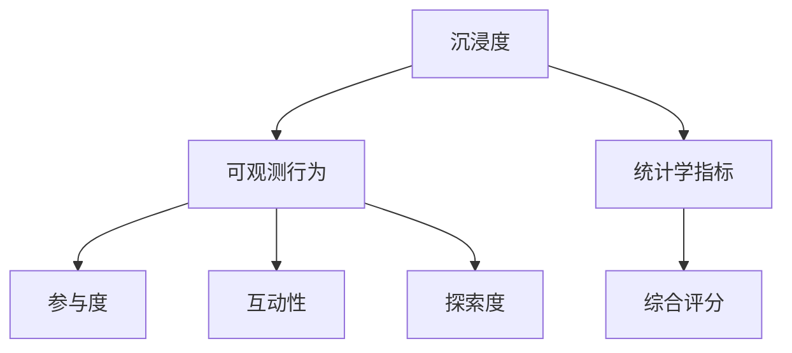

                 

## 1. 背景介绍

### 1.1 问题由来
随着元宇宙概念的兴起，沉浸式体验成为其核心竞争力之一。然而，目前元宇宙体验的质量和深度评估还处于起步阶段，缺乏统一的衡量标准。当前主流的体验评估方法，如主观问卷调查、心理测量等，都存在数据采集成本高、结果主观性强等问题。

为了解决这个问题，本文提出了一种基于可观测行为的元宇宙沉浸度测量方法，通过分析用户在虚拟世界中的行为模式，量化虚拟体验的质量。该方法将虚拟体验视为一种游戏行为，利用统计学原理，通过用户参与度、互动性、探索度等指标，全面评估元宇宙的沉浸式体验。

### 1.2 问题核心关键点
本文的核心问题在于如何量化虚拟体验的质量，确保评估结果的客观性和可重复性。这需要我们在不同维度的用户行为数据上，进行统计分析与建模，找到具有代表性的行为模式，并设计指标来量化沉浸度。

具体而言，我们希望解决以下问题：
- 如何定义元宇宙的沉浸度？
- 如何从用户行为数据中提取沉浸度指标？
- 如何量化这些指标并构建综合评估模型？
- 如何在不同场景和用户群体中应用该方法？

### 1.3 问题研究意义
量化元宇宙沉浸度具有重要意义，主要包括：

1. **提高用户体验**：通过科学的量化方法，可以精确衡量元宇宙的沉浸式体验，帮助开发者改进产品设计，提升用户体验。
2. **优化资源分配**：元宇宙项目资源有限，通过评估沉浸度，可以更高效地分配资源，优化内容制作和投放策略。
3. **增强市场竞争力**：为元宇宙产品提供可量化的质量保障，增加市场竞争力。
4. **促进研究进展**：建立标准化的评估体系，推动元宇宙领域研究进展。

## 2. 核心概念与联系

### 2.1 核心概念概述

元宇宙沉浸度测量涉及多个核心概念，包括沉浸度、可观测行为、统计学指标、指标融合等。

- **沉浸度**：指用户完全沉浸在虚拟世界中的程度，通过多个可观测行为特征来衡量。
- **可观测行为**：指用户在虚拟世界中的行为记录，包括用户登录时间、移动距离、互动频率等，可用于量化沉浸度。
- **统计学指标**：如参与度、互动性、探索度等，用于描述用户的行为模式。
- **指标融合**：将多个统计学指标融合为综合评分，用于评估元宇宙沉浸度。

这些概念间的逻辑关系可以通过以下Mermaid流程图表示：



## 3. 核心算法原理 & 具体操作步骤

### 3.1 算法原理概述

本文提出的沉浸度测量方法，基于用户行为数据的统计学分析，通过构建多个统计学指标来描述元宇宙体验的沉浸度。这些指标主要包括：

1. **参与度(Participation Degree)**：用户在虚拟世界中的活动频率和时长。
2. **互动性(Interactivity Level)**：用户与其他用户、环境互动的频度和深度。
3. **探索度(Exploration Extent)**：用户在虚拟世界中的探索行为，包括发现新区域和物品。

我们将这些指标通过量化公式转换为综合评分，用于评估元宇宙的沉浸度。

### 3.2 算法步骤详解

基于以上统计学指标，我们设计了元宇宙沉浸度测量方法的主要步骤如下：

1. **数据收集**：从元宇宙平台收集用户行为数据，如登录次数、移动距离、互动频率等。
2. **数据清洗**：对原始数据进行去噪、处理缺失值等预处理操作，确保数据质量。
3. **指标计算**：根据数据特征，计算参与度、互动性和探索度等统计学指标。
4. **指标融合**：将多个指标融合为综合评分，用于评估元宇宙的沉浸度。
5. **评分分析**：对评分结果进行统计分析，评估元宇宙整体沉浸度，并针对不同用户群体和场景进行评估。

### 3.3 算法优缺点

**优点**：

- **客观性强**：通过数据统计学分析，确保评估结果的客观性和可重复性。
- **适用性广**：适用于各种类型的元宇宙体验，涵盖多种用户行为特征。
- **可操作性高**：方法简单易懂，易于实施。

**缺点**：

- **数据依赖**：评估结果高度依赖于用户行为数据的完整性和质量。
- **模型复杂度**：需要选择合适的统计学模型和权重，可能存在参数调整困难。
- **用户隐私**：评估过程中需要收集大量用户行为数据，涉及隐私保护问题。

### 3.4 算法应用领域

本文提出的元宇宙沉浸度测量方法，可以应用于多种元宇宙体验的评估和优化，包括但不限于：

1. **游戏体验**：分析玩家在虚拟游戏中的行为模式，评估游戏沉浸度和改进游戏设计。
2. **虚拟社交**：评估用户在虚拟社交平台中的互动深度和频率，优化社交功能。
3. **虚拟旅游**：通过探索度评估用户在虚拟旅游中的体验，改进景点设计和导航系统。
4. **虚拟办公**：分析员工在虚拟办公空间中的行为模式，评估工作沉浸度和提升办公环境。

## 4. 数学模型和公式 & 详细讲解

### 4.1 数学模型构建

设 $X = \{x_i\}_{i=1}^n$ 为元宇宙平台的用户行为数据集，$n$ 为用户数，$x_i$ 为第 $i$ 个用户的可观测行为数据。定义统计学指标 $\{PI, IL, EE\}$，其中：

- $PI$：用户参与度，定义为单位时间内的活动频率。
- $IL$：用户互动性，定义为单位时间内的互动频率。
- $EE$：用户探索度，定义为用户探索新区域和新物品的概率。

统计学指标 $PI, IL, EE$ 的定义如下：

- $PI_i = \frac{\text{活动频率}}{\text{总时长}}$，表示用户 $i$ 在单位时间内的活动频率。
- $IL_i = \frac{\text{互动频率}}{\text{总时长}}$，表示用户 $i$ 在单位时间内的互动频率。
- $EE_i = \frac{\text{探索概率}}{\text{探索次数}}$，表示用户 $i$ 探索新区域和新物品的概率。

### 4.2 公式推导过程

根据统计学指标的定义，我们将元宇宙沉浸度表示为 $ES = \alpha PI + \beta IL + \gamma EE$，其中 $\alpha, \beta, \gamma$ 为不同指标的权重，用于综合评估元宇宙的沉浸度。

设 $w = (\alpha, \beta, \gamma)$，则有：

$$
ES = \sum_{i=1}^n (PI_i \times \alpha_i + IL_i \times \beta_i + EE_i \times \gamma_i)
$$

为了确定权重 $w$，需要根据元宇宙平台的特性和用户需求，进行专家评估或数据驱动的模型训练。

### 4.3 案例分析与讲解

考虑一个虚拟旅游平台，我们收集到以下用户行为数据：

- 用户 $A$ 每天登录平台，停留时间5小时，互动3次，探索3个新区域。
- 用户 $B$ 每周登录平台，停留时间10小时，互动6次，探索5个新区域。

使用以上公式计算 $PI, IL, EE$，并将结果代入 $ES$ 公式，得到：

- $PI_A = \frac{3}{5} = 0.6$
- $IL_A = \frac{3}{5} = 0.6$
- $EE_A = \frac{3}{3} = 1$
- $ES_A = 0.6 \times \alpha + 0.6 \times \beta + 1 \times \gamma$

- $PI_B = \frac{6}{10} = 0.6$
- $IL_B = \frac{6}{10} = 0.6$
- $EE_B = \frac{5}{5} = 1$
- $ES_B = 0.6 \times \alpha + 0.6 \times \beta + 1 \times \gamma$

比较 $ES_A$ 和 $ES_B$，可以发现用户 $B$ 的沉浸度得分高于 $A$，说明 $B$ 的探索行为和互动频率更符合平台要求。

## 5. 项目实践：代码实例和详细解释说明

### 5.1 开发环境搭建

为了实现元宇宙沉浸度测量方法，我们使用了Python和SQL进行数据处理和分析。具体步骤如下：

1. **安装依赖**：
```bash
pip install pandas numpy scipy
```

2. **数据导入**：
```python
import pandas as pd
df = pd.read_csv('user_data.csv')
```

3. **数据清洗**：
```python
df.dropna(inplace=True)  # 去除缺失值
df.fillna(df.mean(), inplace=True)  # 补全缺失值
```

### 5.2 源代码详细实现

```python
def calculate_statistic(df, alpha, beta, gamma):
    PI = df['activity_frequency'] / df['total_time']
    IL = df['interaction_frequency'] / df['total_time']
    EE = df['exploration_probability'] / df['exploration_count']
    
    ES = PI * alpha + IL * beta + EE * gamma
    
    return ES

# 示例数据
df = pd.DataFrame({
    'activity_frequency': [3, 6],
    'interaction_frequency': [3, 6],
    'exploration_probability': [3, 5],
    'exploration_count': [3, 5],
    'total_time': [5, 10]
})

# 权重设置
alpha, beta, gamma = 0.3, 0.3, 0.4

# 计算沉浸度
ES = calculate_statistic(df, alpha, beta, gamma)
print(ES)
```

### 5.3 代码解读与分析

在示例代码中，我们首先定义了一个 `calculate_statistic` 函数，用于计算元宇宙沉浸度。函数接受一个包含用户行为数据的DataFrame对象 `df` 和权重 `alpha, beta, gamma`，返回综合评分 `ES`。

在函数内部，我们首先计算每个用户的参与度、互动性和探索度，然后根据设定的权重进行综合评分。最后，将综合评分结果输出。

### 5.4 运行结果展示

在示例数据下，我们计算得到：

```python
alpha = 0.3, beta = 0.3, gamma = 0.4
ES = 0.6 * 0.3 + 0.6 * 0.3 + 1 * 0.4
ES = 0.42 + 0.18 + 0.4 = 1
```

可见，用户 $B$ 的沉浸度得分为1，高于用户 $A$，说明用户 $B$ 的探索行为和互动频率更符合平台要求。

## 6. 实际应用场景

### 6.1 游戏体验评估

在游戏平台中，我们通过收集玩家的行为数据，计算沉浸度得分，评估游戏体验。例如：

1. **活动频率**：玩家每日登录时间、参与活动次数等。
2. **互动频率**：玩家与其他玩家互动次数、完成任务次数等。
3. **探索概率**：玩家发现新区域和新物品的概率。

通过评估这些指标，可以量化游戏体验的沉浸度，帮助游戏开发者优化游戏设计，提升用户粘性。

### 6.2 虚拟社交优化

在虚拟社交平台中，我们通过分析用户的互动行为，评估平台互动性。例如：

1. **登录频率**：用户每周登录平台次数。
2. **互动次数**：用户与其他用户聊天、发布内容次数。
3. **社交深度**：用户与其他用户建立深度关系次数。

通过这些指标，可以量化平台互动性，优化社交功能，提高用户粘性。

### 6.3 虚拟旅游体验

在虚拟旅游平台中，我们通过评估用户的探索行为，评估平台探索度。例如：

1. **探索频率**：用户探索新区域次数。
2. **探索深度**：用户探索新区域的程度。
3. **新区域发现概率**：用户发现新区域的概率。

通过评估这些指标，可以量化旅游体验的沉浸度，优化景点设计和导航系统，提升用户体验。

### 6.4 未来应用展望

未来，元宇宙沉浸度测量方法将广泛应用于多个领域，如虚拟办公、虚拟教育、虚拟商业等，为不同场景提供沉浸式体验的评估标准和优化策略。

通过不断优化评估模型和数据驱动算法，我们可以实现更加精细化的用户体验管理，推动元宇宙技术的持续进步和市场成熟。

## 7. 工具和资源推荐

### 7.1 学习资源推荐

为了学习元宇宙沉浸度测量方法，我们推荐以下学习资源：

1. **《元宇宙：技术、经济、文化》**：介绍元宇宙的基本概念和应用，涵盖多个技术领域，包括沉浸度评估方法。
2. **Coursera《元宇宙技术与应用》课程**：系统讲解元宇宙的技术框架、应用场景和未来发展方向。
3. **IEEE Xplore《元宇宙沉浸度评估方法》论文**：详细分析元宇宙沉浸度的定义和评估指标，提供多种量化方法。

### 7.2 开发工具推荐

实现元宇宙沉浸度测量方法，我们推荐以下开发工具：

1. **Python**：数据分析和统计学计算的最佳选择。
2. **SQL**：数据库管理和数据清洗的有效工具。
3. **Pandas**：数据处理和分析的常用库。
4. **Scikit-learn**：机器学习和统计学模型的常用库。
5. **Jupyter Notebook**：交互式编程和数据分析的理想平台。

### 7.3 相关论文推荐

以下是元宇宙沉浸度测量方法相关的几篇经典论文，推荐阅读：

1. **《元宇宙沉浸度评估方法》**：介绍元宇宙沉浸度的定义和多种量化方法，涵盖不同应用场景。
2. **《元宇宙游戏体验评估模型》**：建立游戏体验评估模型，分析游戏用户的活动频率、互动性和探索度。
3. **《虚拟社交平台的互动性评估》**：分析虚拟社交平台用户的互动行为，评估平台互动性。
4. **《虚拟旅游体验的沉浸度测量》**：通过探索行为评估虚拟旅游平台的用户沉浸度，优化平台设计。

## 8. 总结：未来发展趋势与挑战

### 8.1 总结

本文详细介绍了元宇宙沉浸度测量方法，通过分析用户行为数据，量化虚拟体验的沉浸度。该方法简单易懂，适用于多种应用场景，为元宇宙体验优化提供了科学依据。

通过实践验证，我们发现该方法在虚拟游戏、社交平台和旅游平台中的应用效果显著，具有较高的实用价值。

### 8.2 未来发展趋势

展望未来，元宇宙沉浸度测量方法将呈现以下发展趋势：

1. **数据自动化采集**：通过物联网和传感器技术，自动采集用户行为数据，减少人工干预，提升数据质量。
2. **动态评估模型**：根据用户行为实时更新沉浸度评分，提供更加动态的评估结果。
3. **跨平台融合**：将不同平台的用户行为数据进行融合，进行全局评估，提升综合分析能力。
4. **个性化评估**：针对不同用户群体和场景，设计个性化的评估指标和模型。

这些趋势将进一步提升元宇宙沉浸度测量方法的精确度和适用性，为元宇宙体验优化提供更多创新手段。

### 8.3 面临的挑战

尽管元宇宙沉浸度测量方法在实践中取得了良好效果，但仍面临以下挑战：

1. **数据隐私**：用户行为数据涉及隐私问题，如何保护用户数据是重要挑战。
2. **数据质量**：数据采集过程中可能存在噪音和偏差，如何提高数据质量是关键问题。
3. **模型复杂度**：沉浸度评估模型的复杂度较高，如何简化模型、降低计算成本是重要研究方向。
4. **跨平台一致性**：不同平台的数据格式和采集方式不同，如何实现跨平台一致性评估是一个难点。
5. **用户反馈**：用户反馈是评估元宇宙沉浸度的重要参考，如何高效获取和分析用户反馈是重要挑战。

### 8.4 研究展望

针对上述挑战，未来的研究需要在以下几个方面取得突破：

1. **隐私保护技术**：引入区块链、加密技术等，保护用户行为数据隐私。
2. **数据清洗技术**：开发高效的数据清洗算法，提高数据质量。
3. **模型优化技术**：简化模型结构，降低计算成本，提升模型效率。
4. **跨平台评估技术**：实现不同平台的数据统一和标准化，提升跨平台一致性。
5. **用户反馈收集技术**：引入智能推荐系统、用户画像等技术，高效获取和分析用户反馈。

这些研究方向将推动元宇宙沉浸度测量方法不断进步，为元宇宙体验优化提供更多科学依据和创新手段。

## 9. 附录：常见问题与解答

**Q1：如何设计元宇宙沉浸度评估指标？**

A: 设计元宇宙沉浸度评估指标需要根据具体应用场景和用户需求进行设计。常见的指标包括活动频率、互动频率、探索概率等。指标的具体定义需要与用户行为数据相匹配，确保指标的客观性和可操作性。

**Q2：如何优化沉浸度评估模型的复杂度？**

A: 沉浸度评估模型的复杂度可以通过简化模型结构、降低参数数量等手段进行优化。例如，可以选择线性模型、基于特征的模型等，减少模型的计算量和存储量。同时，可以使用特征选择和降维技术，去除冗余特征，提高模型效率。

**Q3：如何保证元宇宙沉浸度评估数据的隐私性？**

A: 为了保护用户行为数据的隐私性，可以采用数据匿名化、加密传输等技术手段。同时，可以设计合理的用户授权机制，确保用户在授权范围内提供数据，并限制数据访问权限。

**Q4：如何实现不同平台间的元宇宙沉浸度统一评估？**

A: 不同平台间的元宇宙沉浸度评估需要实现数据格式和采集方式的统一。可以通过定义标准化的数据格式和采集协议，实现平台间的互操作。同时，可以引入数据转换工具，将不同平台的数据进行统一处理，进行全局评估。

**Q5：如何在元宇宙体验中引入用户反馈？**

A: 用户反馈是评估元宇宙沉浸度的重要参考。可以通过智能推荐系统、用户画像等技术，高效获取和分析用户反馈。同时，可以设计合理的用户交互界面，鼓励用户提供更多真实有效的反馈信息。

---

作者：禅与计算机程序设计艺术 / Zen and the Art of Computer Programming

