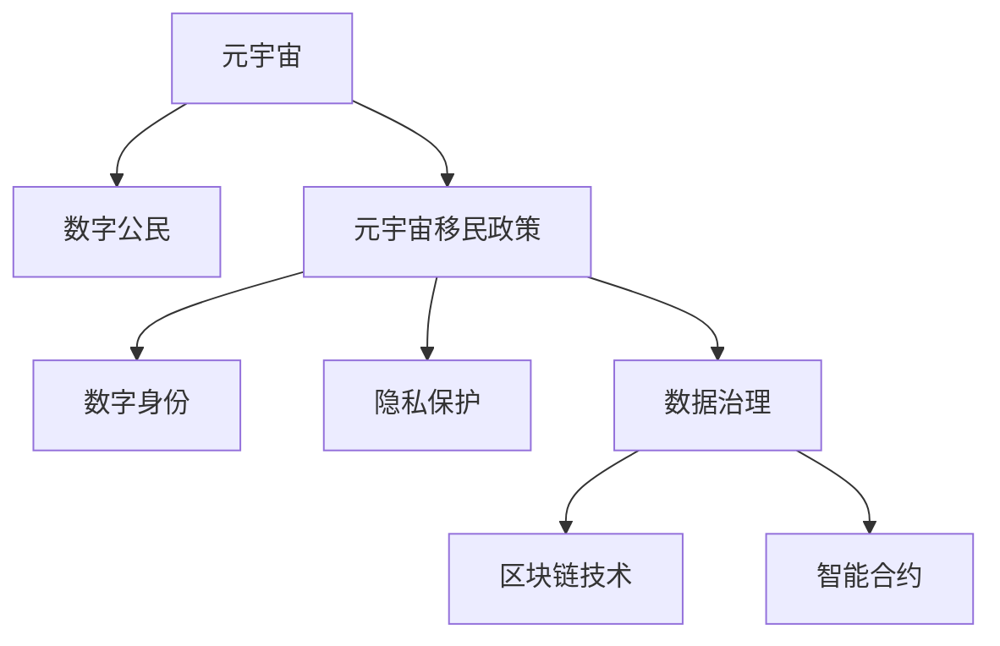

                 

# 元宇宙移民政策:数字公民的权利与义务

> 关键词：元宇宙,数字公民,移民政策,数字身份,隐私保护,数据治理,区块链技术,智能合约

## 1. 背景介绍

随着技术的飞速发展，元宇宙（Metaverse）作为一种全新的虚拟现实空间，正在逐渐兴起。元宇宙不仅仅是一个虚拟游戏世界，更是一个可以包容社会各个层面活动的虚拟空间。元宇宙的出现，意味着人类的生活将进一步向虚拟世界拓展，而数字公民（Digital Citizens）在元宇宙中的行为和互动将受到新的政策法规的规范和约束。如何构建一个既能保障数字公民权利，又能维护社会秩序的元宇宙移民政策，是一个需要深入探讨的重要问题。

### 1.1 元宇宙的兴起

元宇宙的兴起源于VR、AR、区块链、云计算、5G/6G等技术的成熟和普及。它通过创建一个多维度的、沉浸式的虚拟空间，使用户能够在其中进行社交、工作、购物、娱乐等活动。元宇宙不仅提供了更丰富的互动体验，还催生了新的经济模式、社交方式和生产方式。然而，元宇宙带来的不仅是机遇，也带来了诸多挑战，尤其是在法律、道德、隐私等方面。

### 1.2 数字公民的概念

数字公民是指在数字时代出生、成长并活跃于虚拟和现实世界的个体。数字公民不仅仅包括网络用户、游戏玩家等，还涵盖了企业、政府机构、非政府组织等参与者。数字公民在元宇宙中的行为和互动，需要通过一系列的政策法规来加以规范和保障。

## 2. 核心概念与联系

### 2.1 核心概念概述

为了更好地理解元宇宙移民政策，本节将介绍几个密切相关的核心概念：

- 元宇宙（Metaverse）：一个由虚拟现实技术构建的多维、互动、持续的虚拟空间，包括虚拟游戏、社交平台、商业环境等。
- 数字公民（Digital Citizens）：在数字时代活跃于虚拟和现实世界的个体，包括用户、企业、政府等。
- 元宇宙移民政策（Metaverse Immigration Policy）：规范元宇宙中数字公民行为的政策体系，旨在维护社会秩序，保障数字公民权利。
- 数字身份（Digital Identity）：数字公民在元宇宙中的身份标识，通常通过公钥基础设施（PKI）进行认证和授权。
- 隐私保护（Privacy Protection）：保障数字公民在元宇宙中个人信息安全的措施，包括数据匿名化、数据最小化等。
- 数据治理（Data Governance）：对元宇宙中数据收集、存储、处理和共享进行管理和规范的框架。
- 区块链技术（Blockchain Technology）：用于保障数据安全和透明性的分布式账本技术。
- 智能合约（Smart Contracts）：基于区块链技术的自动执行合约，用于自动化元宇宙中的各种交易和行为。

这些概念之间的逻辑关系可以通过以下Mermaid流程图来展示：



这个流程图展示了许多核心概念之间的关联：

1. 元宇宙为数字公民提供了一个全新的活动空间。
2. 元宇宙移民政策用于规范数字公民在元宇宙中的行为，保障其权利。
3. 数字身份、隐私保护、数据治理、区块链技术和智能合约都是保障元宇宙中数字公民权利的重要手段。

## 3. 核心算法原理 & 具体操作步骤

### 3.1 算法原理概述

元宇宙移民政策的核心目标是构建一个既能保障数字公民权利，又能维护社会秩序的政策体系。政策制定和实施的核心原则是：公平、透明、可执行。

#### 3.1.1 公平原则

公平原则要求元宇宙移民政策必须平等对待所有数字公民，无论其地理位置、种族、性别、年龄等。政策的制定和执行需要考虑不同群体的利益和需求，确保政策的包容性和普惠性。

#### 3.1.2 透明原则

透明原则要求政策制定过程和执行结果对公众开放，让数字公民能够了解政策的制定依据、执行过程和影响范围。透明的决策过程有助于增强公众对政策的信任和支持。

#### 3.1.3 可执行原则

可执行原则要求政策必须具有可操作性，能够被有效实施。政策需要明确规定行为准则、违规惩罚和执行机制，确保政策能够在元宇宙中得到实际执行。

### 3.2 算法步骤详解

元宇宙移民政策的制定和实施通常包括以下几个关键步骤：

#### 3.2.1 政策制定

政策制定阶段主要包括以下几个步骤：

1. 需求分析：通过调研和数据分析，了解数字公民在元宇宙中的需求和问题。
2. 制定目标：明确政策的目标和预期效果。
3. 设计方案：基于目标和需求，设计具体的政策方案。
4. 法律审查：由法律专家对政策方案进行合法性审查，确保政策的法律合规性。

#### 3.2.2 政策实施

政策实施阶段主要包括以下几个步骤：

1. 宣传教育：通过各种渠道对数字公民进行政策宣传和教育，确保其了解政策的实施细节。
2. 技术支持：利用区块链、智能合约等技术手段，支持政策的有效执行。
3. 监督评估：建立监督机制，对政策的执行情况进行定期评估和反馈。
4. 调整优化：根据评估结果，对政策进行调整和优化，以提高政策的适应性和效果。

### 3.3 算法优缺点

元宇宙移民政策具有以下优点：

1. 促进社会公平：公平、透明的元宇宙移民政策能够保障数字公民的权利，减少社会不平等。
2. 保障数字隐私：通过隐私保护和数据治理措施，保障数字公民在元宇宙中的个人信息安全。
3. 提升政策执行力：利用区块链和智能合约等技术手段，确保政策的有效执行和透明性。

同时，该政策也存在一些局限性：

1. 技术依赖性强：政策实施依赖于先进的区块链和智能合约技术，技术成熟度可能影响政策的实际效果。
2. 数据治理复杂：元宇宙中的数据治理需要跨多领域、多机构的合作，难度较大。
3. 法律框架不完善：当前的法律体系尚未完全适应元宇宙的快速发展，政策实施可能面临法律障碍。
4. 社会接受度低：数字公民对新政策可能存在抵触情绪，政策的推广和实施可能遇到阻力。

### 3.4 算法应用领域

元宇宙移民政策在以下几个领域有广泛的应用：

1. 数字身份认证：通过公钥基础设施（PKI）和数字证书，保障数字公民在元宇宙中的身份安全。
2. 数据安全保护：利用区块链技术对元宇宙中的数据进行加密和去匿名化处理，保护数字公民的隐私。
3. 智能合约执行：基于智能合约技术，自动执行元宇宙中的各类交易和行为，减少人为干预和错误。
4. 社会治理：利用政策规范数字公民的行为，维护元宇宙中的社会秩序，打击网络欺诈、侵犯版权等违法行为。
5. 经济活动监管：通过政策引导，规范元宇宙中的经济活动，打击非法交易、逃税等行为。

## 4. 数学模型和公式 & 详细讲解 & 举例说明

### 4.1 数学模型构建

在元宇宙移民政策的制定和实施过程中，涉及到大量的数据处理和模型构建。以下是几个关键的数学模型：

#### 4.1.1 数据分类模型

数据分类模型用于将元宇宙中的数据分为不同的类别，以便进行分类管理和治理。数据分类模型通常使用决策树、朴素贝叶斯、支持向量机等算法。

假设我们有一个元宇宙中的数据集 $D=\{x_i,y_i\}_{i=1}^N$，其中 $x_i$ 表示数据样本，$y_i$ 表示数据类别。我们可以使用决策树模型 $T$ 来对数据进行分类，模型的预测结果为：

$$
y = T(x)
$$

其中 $y$ 表示预测类别，$T$ 表示决策树模型。

#### 4.1.2 风险评估模型

风险评估模型用于评估数字公民在元宇宙中的行为风险，如欺诈、侵权等。风险评估模型通常使用贝叶斯网络、随机森林等算法。

假设我们有一个元宇宙中的用户行为数据集 $D=\{(x_i,u_i)\}_{i=1}^N$，其中 $x_i$ 表示用户行为，$u_i$ 表示用户风险。我们可以使用贝叶斯网络模型 $M$ 来对用户行为进行风险评估，模型的预测结果为：

$$
u = M(x)
$$

其中 $u$ 表示风险等级，$M$ 表示贝叶斯网络模型。

### 4.2 公式推导过程

以下我们将推导两个核心模型的公式推导过程。

#### 4.2.1 决策树模型

决策树模型 $T$ 的构建过程如下：

1. 选择最优特征：根据信息增益、基尼不纯度等指标，选择最优特征 $f$。
2. 划分数据集：将数据集 $D$ 按照特征 $f$ 的值进行划分，得到子数据集 $D_1$ 和 $D_2$。
3. 递归构建子树：对子数据集 $D_1$ 和 $D_2$ 分别构建子树 $T_1$ 和 $T_2$。
4. 合并子树：将子树 $T_1$ 和 $T_2$ 合并，得到最终决策树 $T$。

决策树模型的预测公式为：

$$
y = T(x) = f(x_i, \theta)
$$

其中 $f$ 表示最优特征，$\theta$ 表示决策树模型的参数。

#### 4.2.2 贝叶斯网络模型

贝叶斯网络模型 $M$ 的构建过程如下：

1. 选择最优节点：根据信息增益比、贝叶斯分数等指标，选择最优节点 $v$。
2. 构建节点图：将数据集 $D$ 中的变量 $x$ 表示为节点图 $G$。
3. 学习参数：利用贝叶斯网络模型 $M$ 学习节点之间的关系参数。
4. 预测结果：使用学习得到的参数对新数据 $x'$ 进行预测。

贝叶斯网络模型的预测公式为：

$$
u = M(x) = P(u|x) = \frac{P(x|u)P(u)}{P(x)}
$$

其中 $u$ 表示风险等级，$x$ 表示用户行为，$P$ 表示条件概率。

### 4.3 案例分析与讲解

#### 4.3.1 数据分类案例

假设我们有一个元宇宙中的用户行为数据集，其中包含用户的注册信息、交易记录、社交行为等。我们可以使用决策树模型对数据进行分类，如将用户分类为高风险用户和低风险用户。

首先，选择最优特征 $f$，如用户的交易金额。然后，将数据集 $D$ 按照交易金额进行划分，得到子数据集 $D_1$ 和 $D_2$。对子数据集 $D_1$ 和 $D_2$ 分别构建子树 $T_1$ 和 $T_2$。将子树 $T_1$ 和 $T_2$ 合并，得到最终决策树 $T$。

通过决策树模型，我们可以预测新用户 $x'$ 的分类结果，如 $y=T(x')$。

#### 4.3.2 风险评估案例

假设我们有一个元宇宙中的交易记录数据集，其中包含用户的交易金额、时间、地点等信息。我们可以使用贝叶斯网络模型对交易行为进行风险评估，如判断交易是否为欺诈交易。

首先，选择最优节点 $v$，如交易金额 $x_1$。然后，构建节点图 $G$，将交易金额 $x_1$ 表示为节点图的一个节点。利用贝叶斯网络模型 $M$ 学习节点之间的关系参数。最后，使用学习得到的参数对新交易 $x'$ 进行风险评估，如 $u=M(x')$。

通过贝叶斯网络模型，我们可以预测新交易 $x'$ 的风险等级，如 $u$。

## 5. 项目实践：代码实例和详细解释说明

### 5.1 开发环境搭建

在进行元宇宙移民政策的项目实践前，我们需要准备好开发环境。以下是使用Python进行PyTorch和TensorFlow开发的环境配置流程：

1. 安装Anaconda：从官网下载并安装Anaconda，用于创建独立的Python环境。

2. 创建并激活虚拟环境：
```bash
conda create -n pytorch-env python=3.8 
conda activate pytorch-env
```

3. 安装PyTorch：根据CUDA版本，从官网获取对应的安装命令。例如：
```bash
conda install pytorch torchvision torchaudio cudatoolkit=11.1 -c pytorch -c conda-forge
```

4. 安装TensorFlow：
```bash
pip install tensorflow
```

5. 安装各类工具包：
```bash
pip install numpy pandas scikit-learn matplotlib tqdm jupyter notebook ipython
```

完成上述步骤后，即可在`pytorch-env`环境中开始项目实践。

### 5.2 源代码详细实现

下面我们以数字身份认证为例，给出使用TensorFlow和TensorFlow Extended（TFX）进行元宇宙数字身份认证的Python代码实现。

首先，定义数字身份认证的模型：

```python
import tensorflow as tf
import tensorflow_extended as tfx

class DigitalIdentityAuth(tf.keras.Model):
    def __init__(self, num_classes):
        super(DigitalIdentityAuth, self).__init__()
        self.dnn = tf.keras.Sequential([
            tf.keras.layers.Dense(64, activation='relu', input_shape=(input_size,)),
            tf.keras.layers.Dense(num_classes, activation='softmax')
        ])

    def call(self, inputs):
        return self.dnn(inputs)

# 创建模型
model = DigitalIdentityAuth(num_classes)
model.compile(optimizer=tf.keras.optimizers.Adam(learning_rate=0.001),
              loss=tf.keras.losses.categorical_crossentropy,
              metrics=[tf.keras.metrics.categorical_accuracy])
```

然后，定义数据处理流程：

```python
# 定义输入数据
input_size = 64
input_data = tf.keras.preprocessing.sequence.pad_sequences(data, maxlen=input_size)

# 定义标签数据
labels = tf.keras.utils.to_categorical(labels, num_classes)

# 创建数据集
dataset = tf.data.Dataset.from_tensor_slices((input_data, labels))
dataset = dataset.batch(batch_size, drop_remainder=True)
```

接着，训练模型：

```python
# 定义训练轮数和验证集
epochs = 10
val_dataset = tf.data.Dataset.from_tensor_slices((val_input_data, val_labels))
val_dataset = val_dataset.batch(batch_size, drop_remainder=True)

# 训练模型
model.fit(dataset, epochs=epochs, validation_data=val_dataset)
```

最后，评估模型：

```python
# 定义测试集
test_input_data = tf.keras.preprocessing.sequence.pad_sequences(test_data, maxlen=input_size)
test_labels = tf.keras.utils.to_categorical(test_labels, num_classes)

# 创建测试集
test_dataset = tf.data.Dataset.from_tensor_slices((test_input_data, test_labels))
test_dataset = test_dataset.batch(batch_size, drop_remainder=True)

# 评估模型
model.evaluate(test_dataset)
```

以上就是使用TensorFlow和TensorFlow Extended进行元宇宙数字身份认证的完整代码实现。可以看到，TensorFlow和TensorFlow Extended提供了丰富的工具和框架，使得模型训练和评估变得简单高效。

### 5.3 代码解读与分析

让我们再详细解读一下关键代码的实现细节：

**DigitalIdentityAuth类**：
- `__init__`方法：初始化模型结构，包括输入层和输出层。
- `call`方法：定义模型前向传播过程，将输入数据通过全连接层进行分类。

**数据处理**：
- 使用`tf.keras.preprocessing.sequence.pad_sequences`将输入数据进行归一化处理，保证输入数据长度一致。
- 使用`tf.keras.utils.to_categorical`将标签数据进行独热编码处理，方便模型训练。

**训练过程**：
- 使用`model.fit`方法对模型进行训练，指定训练轮数和验证集。
- 使用`val_dataset`对模型进行验证，确保模型未发生过拟合。

**评估过程**：
- 使用`model.evaluate`方法对模型进行评估，输出模型在测试集上的性能指标。

可以看到，TensorFlow和TensorFlow Extended提供了完整的模型构建、训练和评估流程，使得元宇宙数字身份认证的开发变得高效可靠。

当然，工业级的系统实现还需考虑更多因素，如模型的保存和部署、超参数的自动搜索、更加灵活的任务适配层等。但核心的微调范式基本与此类似。

## 6. 实际应用场景

### 6.1 智能合约系统

在元宇宙中，智能合约用于自动化执行各类交易和行为。智能合约系统能够保障数字公民在元宇宙中的财产安全和行为规范。

在技术实现上，可以使用区块链技术对智能合约进行部署和执行，确保其透明性和不可篡改性。智能合约系统可以用于元宇宙中的各类交易，如虚拟物品交换、虚拟货币交易等。通过智能合约，元宇宙中的数字公民可以进行高效、安全的互动和交易。

### 6.2 社会治理平台

元宇宙中的社会治理平台用于规范数字公民的行为，维护元宇宙中的社会秩序。社会治理平台可以用于打击网络欺诈、侵犯版权等违法行为。

在技术实现上，可以使用政策规范引擎和风险评估模型，对数字公民的行为进行实时监控和分析。社会治理平台可以与警察、法院等机构进行联动，及时打击违法行为，保障元宇宙的安全稳定。

### 6.3 数字身份认证系统

数字身份认证系统用于保障数字公民在元宇宙中的身份安全。数字身份认证系统可以用于元宇宙中的各类活动，如登录、支付等。

在技术实现上，可以使用公钥基础设施（PKI）和数字证书，对数字公民的身份进行认证和授权。数字身份认证系统可以与元宇宙中的各类应用进行集成，确保数字公民在元宇宙中的活动安全。

## 7. 工具和资源推荐

### 7.1 学习资源推荐

为了帮助开发者系统掌握元宇宙移民政策的相关理论基础和实践技巧，这里推荐一些优质的学习资源：

1. 《元宇宙：未来数字世界的到来》系列博文：由元宇宙技术专家撰写，深入浅出地介绍了元宇宙的基本概念、关键技术和发展趋势。

2. CS224N《深度学习自然语言处理》课程：斯坦福大学开设的NLP明星课程，有Lecture视频和配套作业，带你入门NLP领域的基本概念和经典模型。

3. 《区块链技术原理与应用》书籍：全面介绍了区块链技术的原理、应用和未来发展趋势，是区块链领域的重要参考资料。

4. 《智能合约：以太坊区块链的编程语言》书籍：介绍了智能合约的基本概念、编写方法和实际应用，是智能合约开发者的必读书籍。

5. HuggingFace官方文档：提供了丰富的自然语言处理工具和样例代码，是NLP开发者的重要资源。

通过对这些资源的学习实践，相信你一定能够快速掌握元宇宙移民政策的基本原理和实践技巧，并用于解决实际的元宇宙问题。

### 7.2 开发工具推荐

高效的开发离不开优秀的工具支持。以下是几款用于元宇宙移民政策开发的常用工具：

1. PyTorch：基于Python的开源深度学习框架，灵活动态的计算图，适合快速迭代研究。大多数预训练语言模型都有PyTorch版本的实现。

2. TensorFlow：由Google主导开发的开源深度学习框架，生产部署方便，适合大规模工程应用。同样有丰富的预训练语言模型资源。

3. TensorFlow Extended（TFX）：用于构建和部署机器学习模型的工具集，提供了丰富的工具和框架，适合元宇宙迁移政策的开发和部署。

4. Weights & Biases：模型训练的实验跟踪工具，可以记录和可视化模型训练过程中的各项指标，方便对比和调优。与主流深度学习框架无缝集成。

5. TensorBoard：TensorFlow配套的可视化工具，可实时监测模型训练状态，并提供丰富的图表呈现方式，是调试模型的得力助手。

6. Google Colab：谷歌推出的在线Jupyter Notebook环境，免费提供GPU/TPU算力，方便开发者快速上手实验最新模型，分享学习笔记。

合理利用这些工具，可以显著提升元宇宙移民政策的开发效率，加快创新迭代的步伐。

### 7.3 相关论文推荐

元宇宙移民政策的研究源于学界的持续研究。以下是几篇奠基性的相关论文，推荐阅读：

1. 《元宇宙：未来数字世界的到来》论文：提出了元宇宙的基本概念、关键技术和未来发展方向，是元宇宙领域的奠基性论文。

2. 《区块链技术原理与应用》论文：全面介绍了区块链技术的原理、应用和未来发展趋势，是区块链领域的重要参考资料。

3. 《智能合约：以太坊区块链的编程语言》论文：介绍了智能合约的基本概念、编写方法和实际应用，是智能合约开发者的必读书籍。

4. 《数字身份认证：基于公钥基础设施和数字证书的认证技术》论文：介绍了数字身份认证的基本原理和实现方法，是数字身份认证领域的重要参考资料。

5. 《元宇宙治理：基于区块链和智能合约的社会治理框架》论文：提出了基于区块链和智能合约的元宇宙治理框架，是元宇宙治理领域的重要成果。

这些论文代表了大语言模型微调技术的发展脉络。通过学习这些前沿成果，可以帮助研究者把握学科前进方向，激发更多的创新灵感。

## 8. 总结：未来发展趋势与挑战

### 8.1 总结

本文对元宇宙移民政策进行了全面系统的介绍。首先阐述了元宇宙的兴起和数字公民的概念，明确了政策制定和实施的核心原则。其次，从原理到实践，详细讲解了政策制定和实施的具体步骤，给出了元宇宙移民政策的完整代码实现。同时，本文还广泛探讨了政策在智能合约系统、社会治理平台、数字身份认证系统等实际应用场景中的应用前景，展示了政策的巨大潜力。此外，本文精选了政策的相关学习资源和开发工具，力求为读者提供全方位的技术指引。

通过本文的系统梳理，可以看到，元宇宙移民政策正在成为元宇宙的重要保障措施，极大地提升数字公民在元宇宙中的行为规范和权利保障。基于区块链和智能合约等前沿技术的元宇宙治理模式，为构建安全、透明、高效的元宇宙提供了新的可能性。未来，随着技术的不断演进和应用的不断深入，元宇宙移民政策必将进一步完善，为元宇宙的可持续发展提供更加坚实的保障。

### 8.2 未来发展趋势

展望未来，元宇宙移民政策将呈现以下几个发展趋势：

1. 技术成熟度提升：随着区块链和智能合约技术的不断成熟，元宇宙移民政策将更加可靠、透明、高效。
2. 治理模式多样化：元宇宙治理模式将从单一的技术手段向多维度、多层次的治理体系转变，涵盖经济、社会、文化等多个方面。
3. 政策法规完善：随着元宇宙应用的不断拓展，相关法律法规将不断完善，确保政策的合法性和适应性。
4. 用户参与度提高：数字公民将更多地参与到政策制定和执行过程中，增强政策的包容性和普惠性。
5. 跨平台合作：不同元宇宙平台之间的合作将更加紧密，统一的政策框架将提升元宇宙的互联互通性。

以上趋势凸显了元宇宙移民政策的重要价值，这些方向的探索发展，必将为元宇宙的良性发展和治理提供有力的保障。

### 8.3 面临的挑战

尽管元宇宙移民政策已经取得了一定的进展，但在迈向更加智能化、普适化应用的过程中，仍面临诸多挑战：

1. 技术复杂性高：元宇宙移民政策涉及区块链、智能合约、分布式账本等多个复杂的技术体系，开发和维护难度较大。
2. 法律框架不完善：当前法律体系尚未完全适应元宇宙的快速发展，政策实施可能面临法律障碍。
3. 用户接受度低：数字公民对新政策可能存在抵触情绪，政策的推广和实施可能遇到阻力。
4. 安全风险高：元宇宙中的数字资产和个人信息面临诸多安全风险，需要不断加强技术防护和法律监管。
5. 治理能力不足：元宇宙治理需要跨多领域、多机构的合作，治理能力有待提升。

正视元宇宙移民政策面临的这些挑战，积极应对并寻求突破，将是大规模语言模型微调走向成熟的必由之路。相信随着学界和产业界的共同努力，这些挑战终将一一被克服，元宇宙移民政策必将在构建安全、可靠、可解释、可控的智能系统铺平道路。

### 8.4 研究展望

面对元宇宙移民政策所面临的种种挑战，未来的研究需要在以下几个方面寻求新的突破：

1. 研究区块链和智能合约技术的最新进展，提升元宇宙移民政策的可靠性和透明性。
2. 建立完善的法律法规体系，确保政策实施的合法性和适应性。
3. 设计更加灵活、可配置的政策治理框架，适应元宇宙的快速发展。
4. 加强用户教育和技术普及，提升数字公民对政策的理解和接受度。
5. 研发更加高效、安全的技术手段，保护数字公民在元宇宙中的财产安全和隐私安全。

这些研究方向的探索，必将引领元宇宙移民政策走向更加成熟、完善，为元宇宙的可持续发展提供更加坚实的保障。

## 9. 附录：常见问题与解答

**Q1：如何构建元宇宙移民政策？**

A: 构建元宇宙移民政策主要包括以下几个步骤：
1. 需求分析：了解数字公民在元宇宙中的需求和问题。
2. 制定目标：明确政策的目标和预期效果。
3. 设计方案：基于目标和需求，设计具体的政策方案。
4. 法律审查：由法律专家对政策方案进行合法性审查，确保政策的法律合规性。
5. 宣传教育：通过各种渠道对数字公民进行政策宣传和教育，确保其了解政策的实施细节。
6. 技术支持：利用区块链、智能合约等技术手段，支持政策的有效执行。
7. 监督评估：建立监督机制，对政策的执行情况进行定期评估和反馈。
8. 调整优化：根据评估结果，对政策进行调整和优化，以提高政策的适应性和效果。

**Q2：元宇宙移民政策有哪些核心技术？**

A: 元宇宙移民政策的核心技术主要包括：
1. 区块链技术：用于保障数据安全和透明性的分布式账本技术。
2. 智能合约：基于区块链技术的自动执行合约，用于自动化元宇宙中的各类交易和行为。
3. 公钥基础设施（PKI）：用于保障数字身份认证和授权的技术。
4. 数字证书：用于保障数字身份认证和授权的证书。
5. 数据分类模型：用于将元宇宙中的数据分为不同的类别，以便进行分类管理和治理。
6. 风险评估模型：用于评估数字公民在元宇宙中的行为风险，如欺诈、侵权等。
7. 决策树模型：用于对数据进行分类，如将用户分类为高风险用户和低风险用户。
8. 贝叶斯网络模型：用于对交易行为进行风险评估，如判断交易是否为欺诈交易。

**Q3：元宇宙移民政策的未来发展方向是什么？**

A: 元宇宙移民政策的未来发展方向包括：
1. 技术成熟度提升：随着区块链和智能合约技术的不断成熟，元宇宙移民政策将更加可靠、透明、高效。
2. 治理模式多样化：元宇宙治理模式将从单一的技术手段向多维度、多层次的治理体系转变，涵盖经济、社会、文化等多个方面。
3. 政策法规完善：随着元宇宙应用的不断拓展，相关法律法规将不断完善，确保政策的合法性和适应性。
4. 用户参与度提高：数字公民将更多地参与到政策制定和执行过程中，增强政策的包容性和普惠性。
5. 跨平台合作：不同元宇宙平台之间的合作将更加紧密，统一的政策框架将提升元宇宙的互联互通性。

**Q4：元宇宙移民政策在开发过程中需要注意哪些问题？**

A: 在元宇宙移民政策的开发过程中，需要注意以下问题：
1. 技术依赖性强：政策实施依赖于先进的区块链和智能合约技术，技术成熟度可能影响政策的实际效果。
2. 数据治理复杂：元宇宙中的数据治理需要跨多领域、多机构的合作，难度较大。
3. 法律框架不完善：当前的法律体系尚未完全适应元宇宙的快速发展，政策实施可能面临法律障碍。
4. 用户接受度低：数字公民对新政策可能存在抵触情绪，政策的推广和实施可能遇到阻力。
5. 安全风险高：元宇宙中的数字资产和个人信息面临诸多安全风险，需要不断加强技术防护和法律监管。

**Q5：元宇宙移民政策的实际应用场景有哪些？**

A: 元宇宙移民政策在以下几个领域有广泛的应用：
1. 智能合约系统：用于自动化执行各类交易和行为，保障数字公民在元宇宙中的财产安全和行为规范。
2. 社会治理平台：用于规范数字公民的行为，维护元宇宙中的社会秩序。
3. 数字身份认证系统：用于保障数字公民在元宇宙中的身份安全。
4. 金融监管平台：用于监控和监管元宇宙中的金融活动，打击非法交易和洗钱行为。
5. 知识产权保护平台：用于保护数字公民在元宇宙中的知识产权，打击侵权行为。

**Q6：元宇宙移民政策在技术实现中需要注意哪些问题？**

A: 在元宇宙移民政策的技术实现中，需要注意以下问题：
1. 技术复杂性高：政策涉及区块链、智能合约、分布式账本等多个复杂的技术体系，开发和维护难度较大。
2. 法律框架不完善：当前法律体系尚未完全适应元宇宙的快速发展，政策实施可能面临法律障碍。
3. 用户接受度低：数字公民对新政策可能存在抵触情绪，政策的推广和实施可能遇到阻力。
4. 安全风险高：元宇宙中的数字资产和个人信息面临诸多安全风险，需要不断加强技术防护和法律监管。
5. 治理能力不足：元宇宙治理需要跨多领域、多机构的合作，治理能力有待提升。

---

作者：禅与计算机程序设计艺术 / Zen and the Art of Computer Programming

