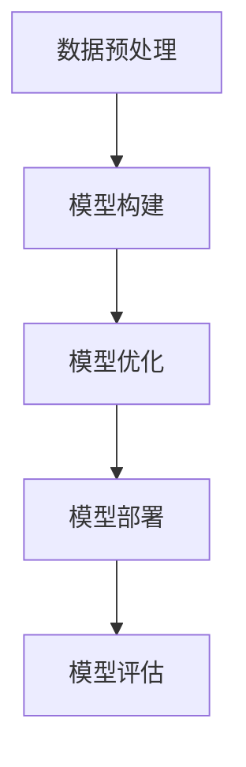

                 

# 全栈AI开发：从数据处理到模型部署

在人工智能(AI)的浪潮中，全栈AI开发正逐渐成为行业的重要趋势。全栈AI开发不仅关注模型构建，还涵盖了从数据预处理、模型训练到模型部署的整个流程。本文将系统介绍全栈AI开发的基本概念和关键技术，帮助读者构建高效、可维护、可持续发展的AI应用。

## 1. 背景介绍

### 1.1 问题由来
随着深度学习和大数据技术的发展，人工智能在各个领域的应用日益广泛。从图像识别、自然语言处理(NLP)、推荐系统到自动驾驶、医疗诊断，AI技术的落地应用离不开数据、模型、算力等多个环节的综合协同。然而，当前AI开发的流程复杂，各环节之间缺乏协调，导致项目周期长、开发成本高、部署困难等问题。

### 1.2 问题核心关键点
为解决这些问题，全栈AI开发应运而生。全栈AI开发旨在构建端到端的AI系统，从数据处理、模型训练到模型部署，涵盖AI应用开发的各个环节。这一全链条、全方位的方法论，能够显著提升AI开发的效率和效果，降低开发成本，加速应用落地。

全栈AI开发的核心关键点包括：
- 数据预处理：确保数据的高质量、高效率、高安全，为模型训练提供坚实基础。
- 模型构建：结合领域知识和深度学习算法，设计高效的模型结构，实现高性能的模型训练。
- 模型优化：应用模型压缩、剪枝、量化等技术，提升模型部署效率，减小计算资源消耗。
- 模型部署：将训练好的模型封装为标准化服务，实现高效、可靠、可扩展的模型部署。

## 2. 核心概念与联系

### 2.1 核心概念概述

为更好地理解全栈AI开发的框架和方法，本节将介绍几个关键核心概念：

- 数据预处理：指通过清洗、标注、归一化等步骤，将原始数据转换为适合模型训练的格式。数据预处理是AI应用开发的基础环节，直接影响模型的性能和泛化能力。

- 模型构建：指使用深度学习算法，结合领域知识，构建适合特定任务的高效模型。模型构建是AI应用开发的核心环节，决定了模型在特定场景下的性能。

- 模型优化：指通过参数调整、正则化、特征工程等手段，提升模型的精度和鲁棒性，减少计算资源消耗，提高模型部署效率。

- 模型部署：指将训练好的模型封装为可复用、可扩展的服务，部署到实际应用环境中，实现高效、可靠、可维护的AI应用。

- 模型评估：指在模型部署前，通过测试集等手段，评估模型的性能和泛化能力，确保模型在实际应用中表现稳定。

这些核心概念之间的逻辑关系可以通过以下Mermaid流程图来展示：



这个流程图展示了全栈AI开发的关键环节及其联系：数据预处理为模型构建提供数据基础；模型构建通过算法实现领域知识与数据的高效融合；模型优化通过参数调整等手段提升模型性能；模型部署将模型封装为服务，实现模型应用；模型评估确保模型在实际应用中表现稳定。

## 3. 核心算法原理 & 具体操作步骤
### 3.1 算法原理概述

全栈AI开发是一个包含数据预处理、模型训练、模型优化和模型部署的复杂流程。其核心算法原理包括以下几个方面：

- 数据预处理：通过清洗、标注、归一化等步骤，确保数据的高质量、高效率、高安全，为模型训练提供坚实基础。

- 模型构建：使用深度学习算法，结合领域知识，构建适合特定任务的高效模型。模型构建是AI应用开发的中心环节。

- 模型优化：通过参数调整、正则化、特征工程等手段，提升模型的精度和鲁棒性，减少计算资源消耗，提高模型部署效率。

- 模型部署：将训练好的模型封装为可复用、可扩展的服务，部署到实际应用环境中，实现高效、可靠、可维护的AI应用。

### 3.2 算法步骤详解

全栈AI开发的具体步骤包括：

**Step 1: 数据预处理**
- 收集原始数据：根据项目需求，通过网络爬虫、API接口、数据库等方式收集原始数据。
- 数据清洗：去除数据中的噪声、缺失值、异常值，确保数据质量。
- 数据标注：对数据进行标注，生成训练集、验证集、测试集。
- 数据归一化：对数据进行归一化处理，减少特征尺度差异，提高模型性能。

**Step 2: 模型构建**
- 选择合适的算法：根据任务类型，选择适合的深度学习算法，如卷积神经网络(CNN)、循环神经网络(RNN)、Transformer等。
- 设计模型结构：确定模型层次结构、激活函数、损失函数等。
- 训练模型：使用GPU/TPU等高性能设备，对模型进行训练，优化超参数，提高模型性能。

**Step 3: 模型优化**
- 参数调整：通过超参数调整，提升模型性能。
- 正则化：使用L2正则、Dropout等技术，避免模型过拟合。
- 特征工程：通过特征选择、特征变换等手段，提升模型性能。
- 模型压缩：通过剪枝、量化等技术，减小模型尺寸，提高模型部署效率。

**Step 4: 模型部署**
- 模型封装：将训练好的模型封装为标准化服务，生成API接口，便于集成调用。
- 部署服务：将模型部署到实际应用环境中，如Web应用、移动应用、物联网设备等。
- 监控维护：实时监控模型运行状态，进行必要的维护和升级。

**Step 5: 模型评估**
- 测试集评估：在测试集上评估模型性能，确保模型泛化能力强。
- 应用效果评估：在实际应用场景中，评估模型效果，确保模型能够满足实际需求。

以上是全栈AI开发的一般流程。在实际应用中，还需要针对具体任务的特点，对各个环节进行优化设计，如改进数据清洗算法，引入更多的正则化技术，搜索最优的超参数组合等，以进一步提升模型性能。

### 3.3 算法优缺点

全栈AI开发具有以下优点：
1. 提升开发效率：通过端到端的流程设计，减少项目周期，降低开发成本。
2. 确保模型质量：数据预处理和模型优化环节，确保模型在实际应用中表现稳定。
3. 提高模型效果：结合领域知识和深度学习算法，实现高性能的模型训练。
4. 简化模型部署：模型封装和服务化，实现高效、可靠、可扩展的模型部署。

同时，该方法也存在一定的局限性：
1. 数据处理复杂：数据预处理环节繁琐，需耗费大量时间和精力。
2. 资源消耗大：大模型的训练和优化消耗大量计算资源，需要高性能硬件支持。
3. 系统复杂度高：涉及数据、模型、部署等多个环节，系统复杂度较高。
4. 维护成本高：模型部署后需要持续监控和维护，投入人力成本高。

尽管存在这些局限性，但就目前而言，全栈AI开发已成为AI应用开发的主流范式。未来相关研究的重点在于如何进一步简化数据预处理流程，降低模型部署的资源消耗，同时兼顾模型的高效性和可维护性等因素。

### 3.4 算法应用领域

全栈AI开发已在多个领域得到了广泛应用，例如：

- 图像识别：如图像分类、物体检测、图像分割等。通过数据预处理、模型构建、模型优化，实现高效、精准的图像识别应用。
- 自然语言处理(NLP)：如情感分析、机器翻译、问答系统等。通过数据清洗、标注、特征工程等技术，提升NLP模型的性能。
- 推荐系统：如商品推荐、内容推荐、广告推荐等。通过模型构建、特征工程、模型优化等手段，提升推荐系统的效果。
- 自动驾驶：如环境感知、路径规划、行为决策等。通过数据预处理、模型构建、模型优化，实现高效、可靠的自动驾驶系统。
- 医疗诊断：如影像分析、病历分析、基因组学等。通过数据清洗、标注、模型构建，提升医疗诊断的准确性和效率。

除了上述这些经典领域，全栈AI开发还被创新性地应用于更多场景中，如智能客服、智能制造、智慧城市等，为各行各业带来了新的变革。

## 4. 数学模型和公式 & 详细讲解 & 举例说明

### 4.1 数学模型构建

本节将使用数学语言对全栈AI开发的基本流程进行更加严格的刻画。

**数据预处理**
数据预处理的目标是将原始数据转换为适合模型训练的格式。常见的预处理步骤包括：

- 数据清洗：去除噪声、缺失值、异常值。
- 数据标注：对数据进行标注，生成训练集、验证集、测试集。
- 数据归一化：对数据进行归一化处理，如Z-score归一化、标准化等。

**模型构建**
模型构建的目标是使用深度学习算法，结合领域知识，构建适合特定任务的高效模型。常见的模型包括：

- 卷积神经网络(CNN)：适用于图像识别、图像分割等任务。
- 循环神经网络(RNN)：适用于序列数据处理，如文本生成、语音识别等。
- Transformer模型：适用于自然语言处理(NLP)任务，如机器翻译、文本生成等。

**模型优化**
模型优化目标是通过参数调整、正则化、特征工程等手段，提升模型的精度和鲁棒性。常用的优化技术包括：

- 参数调整：通过超参数调整，如学习率、批大小、迭代轮数等，提升模型性能。
- 正则化：使用L2正则、Dropout等技术，避免模型过拟合。
- 特征工程：通过特征选择、特征变换等手段，提升模型性能。
- 模型压缩：通过剪枝、量化等技术，减小模型尺寸，提高模型部署效率。

**模型部署**
模型部署的目标是将训练好的模型封装为标准化服务，部署到实际应用环境中。常见的模型封装方式包括：

- RESTful API：将模型封装为RESTful API接口，通过HTTP请求调用模型。
- gRPC服务：使用gRPC协议，实现高性能的模型服务。
- 微服务架构：将模型封装为微服务，实现模块化、可扩展的模型部署。

**模型评估**
模型评估的目标是在测试集上评估模型性能，确保模型泛化能力强。常用的评估指标包括：

- 准确率：模型预测结果与真实结果的匹配率。
- 召回率：模型预测的正样本占真实正样本的比例。
- F1值：综合考虑准确率和召回率的指标。
- ROC曲线：评估模型在不同阈值下的性能。

### 4.2 公式推导过程

以下我们以二分类任务为例，推导模型构建和模型评估的数学公式。

**模型构建**
假设模型 $M_{\theta}$ 在输入 $x$ 上的输出为 $\hat{y}=M_{\theta}(x) \in [0,1]$，表示样本属于正类的概率。则二分类交叉熵损失函数定义为：

$$
\ell(M_{\theta}(x),y) = -[y\log \hat{y} + (1-y)\log (1-\hat{y})]
$$

其中，$y \in \{0,1\}$，为样本的真实标签。

在得到损失函数后，模型训练的目标是最小化经验风险：

$$
\mathcal{L}(\theta) = \frac{1}{N}\sum_{i=1}^N \ell(M_{\theta}(x_i),y_i)
$$

其中，$N$ 为样本数量。

根据链式法则，损失函数对参数 $\theta$ 的梯度为：

$$
\nabla_{\theta}\mathcal{L}(\theta) = -\frac{1}{N}\sum_{i=1}^N (\frac{y_i}{\hat{y}_i}-1) \frac{\partial \hat{y}_i}{\partial \theta}
$$

其中，$\frac{\partial \hat{y}_i}{\partial \theta}$ 可通过反向传播算法高效计算。

在得到损失函数的梯度后，即可带入参数更新公式，完成模型的迭代优化。重复上述过程直至收敛，最终得到适应下游任务的最优模型参数 $\theta^*$。

**模型评估**
模型评估的目标是在测试集上评估模型性能，确保模型泛化能力强。以二分类任务为例，计算模型在测试集上的准确率、召回率和F1值：

$$
\text{Accuracy} = \frac{\sum_{i=1}^N (y_i=M_{\theta}(x_i))}{N}
$$

$$
\text{Recall} = \frac{\sum_{i=1}^N (y_i=1 \text{ and } M_{\theta}(x_i)=1)}{\sum_{i=1}^N y_i=1}
$$

$$
\text{Precision} = \frac{\sum_{i=1}^N (y_i=1 \text{ and } M_{\theta}(x_i)=1)}{\sum_{i=1}^N M_{\theta}(x_i)=1}
$$

$$
\text{F1} = 2 \times \frac{\text{Precision} \times \text{Recall}}{\text{Precision} + \text{Recall}}
$$

在得到这些评估指标后，可以综合判断模型的性能。

### 4.3 案例分析与讲解

**案例：手写数字识别**
手写数字识别是一个经典的图像识别任务。通过数据预处理、模型构建、模型优化和模型部署，可以高效地实现该任务。

1. **数据预处理**
   - 数据收集：从公开数据集中收集手写数字图片。
   - 数据清洗：去除噪声、缺失值、异常值，确保数据质量。
   - 数据标注：对数据进行标注，生成训练集、验证集、测试集。
   - 数据归一化：对数据进行归一化处理，如Z-score归一化、标准化等。

2. **模型构建**
   - 模型选择：选择卷积神经网络(CNN)作为模型。
   - 模型设计：设计包含卷积层、池化层、全连接层的模型结构。
   - 模型训练：使用GPU/TPU等高性能设备，对模型进行训练，优化超参数，提高模型性能。

3. **模型优化**
   - 参数调整：通过超参数调整，如学习率、批大小、迭代轮数等，提升模型性能。
   - 正则化：使用L2正则、Dropout等技术，避免模型过拟合。
   - 特征工程：通过特征选择、特征变换等手段，提升模型性能。
   - 模型压缩：通过剪枝、量化等技术，减小模型尺寸，提高模型部署效率。

4. **模型部署**
   - 模型封装：将训练好的模型封装为RESTful API接口，通过HTTP请求调用模型。
   - 部署服务：将模型部署到实际应用环境中，如Web应用、移动应用等。
   - 监控维护：实时监控模型运行状态，进行必要的维护和升级。

5. **模型评估**
   - 测试集评估：在测试集上评估模型性能，确保模型泛化能力强。
   - 应用效果评估：在实际应用场景中，评估模型效果，确保模型能够满足实际需求。

## 5. 项目实践：代码实例和详细解释说明

### 5.1 开发环境搭建

在进行全栈AI开发实践前，我们需要准备好开发环境。以下是使用Python进行TensorFlow开发的环境配置流程：

1. 安装Anaconda：从官网下载并安装Anaconda，用于创建独立的Python环境。

2. 创建并激活虚拟环境：
```bash
conda create -n tf-env python=3.8 
conda activate tf-env
```

3. 安装TensorFlow：根据CUDA版本，从官网获取对应的安装命令。例如：
```bash
conda install tensorflow -c tf
```

4. 安装各类工具包：
```bash
pip install numpy pandas scikit-learn matplotlib tqdm jupyter notebook ipython
```

完成上述步骤后，即可在`tf-env`环境中开始全栈AI开发实践。

### 5.2 源代码详细实现

下面我们以手写数字识别任务为例，给出使用TensorFlow进行全栈AI开发的PyTorch代码实现。

首先，定义数据预处理函数：

```python
import numpy as np
import matplotlib.pyplot as plt
from tensorflow.keras.datasets import mnist

def load_mnist():
    (x_train, y_train), (x_test, y_test) = mnist.load_data()
    x_train, x_test = x_train / 255.0, x_test / 255.0
    return x_train, y_train, x_test, y_test

def plot_image(x, y, predicted_y, predicted_label):
    plt.imshow(x, cmap='gray')
    plt.title(f'Predicted Label: {predicted_label}, True Label: {y}')
    plt.show()
```

然后，定义模型构建函数：

```python
from tensorflow.keras import layers

def build_model(input_shape):
    model = layers.Sequential([
        layers.Conv2D(32, (3, 3), activation='relu', input_shape=input_shape),
        layers.MaxPooling2D((2, 2)),
        layers.Conv2D(64, (3, 3), activation='relu'),
        layers.MaxPooling2D((2, 2)),
        layers.Flatten(),
        layers.Dense(10, activation='softmax')
    ])
    return model
```

接着，定义模型优化和训练函数：

```python
from tensorflow.keras import optimizers

def train_model(model, x_train, y_train, epochs=10, batch_size=64):
    model.compile(optimizer=optimizers.Adam(), loss='sparse_categorical_crossentropy', metrics=['accuracy'])
    model.fit(x_train, y_train, epochs=epochs, batch_size=batch_size, validation_split=0.1)

def evaluate_model(model, x_test, y_test):
    test_loss, test_acc = model.evaluate(x_test, y_test)
    print(f'Test Loss: {test_loss}, Test Accuracy: {test_acc}')
```

最后，启动训练流程并在测试集上评估：

```python
input_shape = (28, 28, 1)
x_train, y_train, x_test, y_test = load_mnist()

model = build_model(input_shape)
train_model(model, x_train, y_train)
evaluate_model(model, x_test, y_test)
```

以上就是使用TensorFlow进行全栈AI开发的完整代码实现。可以看到，得益于TensorFlow的强大封装，我们可以用相对简洁的代码完成模型构建和训练。

### 5.3 代码解读与分析

让我们再详细解读一下关键代码的实现细节：

**load_mnist函数**：
- 该函数用于加载MNIST数据集，进行归一化处理，并返回训练集和测试集。

**plot_image函数**：
- 该函数用于展示手写数字图片，并标注预测结果。

**build_model函数**：
- 该函数定义了卷积神经网络的模型结构，包括卷积层、池化层、全连接层等。

**train_model函数**：
- 该函数用于训练模型，选择Adam优化器，并定义损失函数和评估指标。

**evaluate_model函数**：
- 该函数用于评估模型，计算测试集的损失和准确率。

在实际应用中，还需要考虑更多因素，如模型的保存和部署、超参数的自动搜索、更灵活的任务适配层等。但核心的全栈AI开发流程基本与此类似。

## 6. 实际应用场景
### 6.1 智能客服系统

全栈AI开发在智能客服系统中的应用非常广泛。传统的客服系统依赖人力，无法实现7x24小时不间断服务，且无法应对复杂客户咨询。使用全栈AI开发的智能客服系统，可以显著提升客户咨询体验和问题解决效率。

具体而言，可以收集企业内部的历史客服对话记录，将问题和最佳答复构建成监督数据，在此基础上对预训练对话模型进行微调。微调后的对话模型能够自动理解用户意图，匹配最合适的答案模板进行回复。对于客户提出的新问题，还可以接入检索系统实时搜索相关内容，动态组织生成回答。如此构建的智能客服系统，能大幅提升客户咨询体验和问题解决效率。

### 6.2 金融舆情监测

金融领域需要实时监测市场舆论动向，以便及时应对负面信息传播，规避金融风险。传统的金融舆情监测依赖人工，成本高、效率低，无法应对网络时代海量信息爆发的挑战。使用全栈AI开发的金融舆情监测系统，可以显著降低监测成本，提高监测效率。

具体而言，可以收集金融领域相关的新闻、报道、评论等文本数据，并对其进行主题标注和情感标注。在此基础上对预训练语言模型进行微调，使其能够自动判断文本属于何种主题，情感倾向是正面、中性还是负面。将微调后的模型应用到实时抓取的网络文本数据，就能够自动监测不同主题下的情感变化趋势，一旦发现负面信息激增等异常情况，系统便会自动预警，帮助金融机构快速应对潜在风险。

### 6.3 个性化推荐系统

当前的推荐系统往往只依赖用户的历史行为数据进行物品推荐，无法深入理解用户的真实兴趣偏好。使用全栈AI开发的个性化推荐系统，可以更好地挖掘用户行为背后的语义信息，从而提供更精准、多样的推荐内容。

具体而言，可以收集用户浏览、点击、评论、分享等行为数据，提取和用户交互的物品标题、描述、标签等文本内容。将文本内容作为模型输入，用户的后续行为（如是否点击、购买等）作为监督信号，在此基础上微调预训练语言模型。微调后的模型能够从文本内容中准确把握用户的兴趣点。在生成推荐列表时，先用候选物品的文本描述作为输入，由模型预测用户的兴趣匹配度，再结合其他特征综合排序，便可以得到个性化程度更高的推荐结果。

### 6.4 未来应用展望

随着全栈AI开发技术的发展，其在更多领域的应用前景将更加广阔。

在智慧医疗领域，全栈AI开发可用于医疗问答、病历分析、药物研发等应用，提升医疗服务的智能化水平，辅助医生诊疗，加速新药开发进程。

在智能教育领域，全栈AI开发可用于作业批改、学情分析、知识推荐等应用，因材施教，促进教育公平，提高教学质量。

在智慧城市治理中，全栈AI开发可用于城市事件监测、舆情分析、应急指挥等环节，提高城市管理的自动化和智能化水平，构建更安全、高效的未来城市。

此外，在企业生产、社会治理、文娱传媒等众多领域，全栈AI开发也将不断涌现，为各行各业带来新的变革。

## 7. 工具和资源推荐
### 7.1 学习资源推荐

为了帮助开发者系统掌握全栈AI开发的技术基础和实践技巧，这里推荐一些优质的学习资源：

1. 《深度学习基础》系列博文：由大模型技术专家撰写，全面介绍了深度学习的基本概念和算法原理。

2. CS231n《深度学习计算机视觉》课程：斯坦福大学开设的视觉深度学习明星课程，有Lecture视频和配套作业，带你入门计算机视觉领域的基本概念和经典模型。

3. 《自然语言处理综述》书籍：全面介绍了自然语言处理(NLP)领域的基本概念和经典算法，适合NLP初学者阅读。

4. Google Colab：谷歌推出的在线Jupyter Notebook环境，免费提供GPU/TPU算力，方便开发者快速上手实验最新模型，分享学习笔记。

5. TensorFlow官方文档：TensorFlow的官方文档，提供了海量预训练模型和完整的开发样例代码，是上手实践的必备资料。

通过对这些资源的学习实践，相信你一定能够快速掌握全栈AI开发的核心技术，并用于解决实际的AI问题。
###  7.2 开发工具推荐

高效的开发离不开优秀的工具支持。以下是几款用于全栈AI开发开发的常用工具：

1. TensorFlow：由Google主导开发的开源深度学习框架，生产部署方便，适合大规模工程应用。

2. PyTorch：基于Python的开源深度学习框架，灵活动态的计算图，适合快速迭代研究。

3. Keras：高级深度学习框架，提供了丰富的预训练模型和便捷的API接口，适合初学者使用。

4. Jupyter Notebook：交互式编程环境，支持多语言代码开发，适合进行快速原型开发和调试。

5. Weights & Biases：模型训练的实验跟踪工具，可以记录和可视化模型训练过程中的各项指标，方便对比和调优。

6. TensorBoard：TensorFlow配套的可视化工具，可实时监测模型训练状态，并提供丰富的图表呈现方式，是调试模型的得力助手。

合理利用这些工具，可以显著提升全栈AI开发任务的开发效率，加快创新迭代的步伐。

### 7.3 相关论文推荐

全栈AI开发的研究源于学界的持续研究。以下是几篇奠基性的相关论文，推荐阅读：

1. "ImageNet Classification with Deep Convolutional Neural Networks"：AlexNet论文，提出了卷积神经网络(CNN)，并首次在ImageNet数据集上取得优异成绩。

2. "LSTM: A Search Space Odyssey Through Time"：LSTM论文，提出了长短期记忆网络(LSTM)，适用于序列数据处理。

3. "Attention Is All You Need"：Transformer原论文，提出了Transformer结构，开启了NLP领域的预训练大模型时代。

4. "BERT: Pre-training of Deep Bidirectional Transformers for Language Understanding"：BERT模型，提出掩码自监督预训练任务，刷新了多项NLP任务SOTA。

5. "Deep Learning for Model and Data Engineering"：Gemini报告，系统介绍了AI模型和数据工程的最佳实践，适合全栈AI开发者阅读。

这些论文代表了大规模深度学习和大数据技术的发展脉络。通过学习这些前沿成果，可以帮助研究者把握学科前进方向，激发更多的创新灵感。

## 8. 总结：未来发展趋势与挑战

### 8.1 总结

本文对全栈AI开发的基本概念和关键技术进行了全面系统的介绍。首先阐述了全栈AI开发的背景和意义，明确了其从数据预处理、模型构建、模型优化到模型部署的完整流程。其次，从原理到实践，详细讲解了全栈AI开发的数学模型和操作步骤，给出了完整的代码实例和详细解读。同时，本文还广泛探讨了全栈AI开发在智能客服、金融舆情、个性化推荐等多个领域的应用前景，展示了其巨大的潜力。

通过本文的系统梳理，可以看到，全栈AI开发已经成为AI应用开发的重要范式，极大地提升了AI开发的效率和效果，降低了开发成本，加速应用落地。未来，伴随深度学习和大数据技术的不断发展，全栈AI开发必将在更广泛的领域得到应用，为各行各业带来新的变革。

### 8.2 未来发展趋势

展望未来，全栈AI开发将呈现以下几个发展趋势：

1. 自动化程度提升：自动化数据清洗、特征工程、模型优化等环节，减少人工干预，提升开发效率。
2. 模型可解释性增强：引入可解释性技术，提升模型的可理解性和可解释性，保障应用的安全性和透明性。
3. 跨领域应用拓展：将全栈AI开发技术应用于更多行业领域，如自动驾驶、智慧医疗等，拓展其应用范围。
4. 多模态数据融合：结合视觉、语音、文本等多模态数据，提升模型的综合感知能力，实现更智能的决策和推理。
5. 持续学习和自适应：引入强化学习等技术，使模型能够不断从新数据中学习，提高模型的适应性和鲁棒性。
6. 联邦学习与隐私保护：利用联邦学习技术，在保护隐私的前提下，实现模型的跨数据源协同训练。

以上趋势凸显了全栈AI开发的广阔前景。这些方向的探索发展，必将进一步提升AI开发的效率和效果，加速AI技术的落地应用。

### 8.3 面临的挑战

尽管全栈AI开发技术已经取得了瞩目成就，但在迈向更加智能化、普适化应用的过程中，它仍面临诸多挑战：

1. 数据预处理复杂：数据清洗、标注、归一化等环节繁琐，需耗费大量时间和精力。
2. 资源消耗大：大模型的训练和优化消耗大量计算资源，需要高性能硬件支持。
3. 系统复杂度高：涉及数据、模型、部署等多个环节，系统复杂度较高。
4. 模型鲁棒性不足：面对域外数据时，泛化性能往往大打折扣。
5. 可解释性不足：模型黑盒化，难以解释其内部工作机制和决策逻辑。
6. 安全性问题：模型可能学习到有害信息，产生误导性、歧视性的输出。

尽管存在这些挑战，但全栈AI开发已成为AI应用开发的主流范式。未来相关研究的重点在于如何进一步简化数据预处理流程，降低模型部署的资源消耗，同时兼顾模型的高效性和可维护性等因素。

### 8.4 研究展望

面对全栈AI开发所面临的种种挑战，未来的研究需要在以下几个方面寻求新的突破：

1. 数据预处理自动化：引入自动化数据清洗、标注工具，减少人工干预，提升数据预处理效率。
2. 模型优化技术创新：开发更加参数高效、计算高效的模型优化技术，提升模型部署效率。
3. 模型可解释性增强：引入可解释性技术，提升模型的可理解性和可解释性，保障应用的安全性和透明性。
4. 跨领域应用拓展：将全栈AI开发技术应用于更多行业领域，如自动驾驶、智慧医疗等，拓展其应用范围。
5. 多模态数据融合：结合视觉、语音、文本等多模态数据，提升模型的综合感知能力，实现更智能的决策和推理。
6. 持续学习和自适应：引入强化学习等技术，使模型能够不断从新数据中学习，提高模型的适应性和鲁棒性。
7. 联邦学习与隐私保护：利用联邦学习技术，在保护隐私的前提下，实现模型的跨数据源协同训练。

这些研究方向的探索，必将引领全栈AI开发技术迈向更高的台阶，为构建高效、智能、可解释的AI应用提供有力支持。面向未来，全栈AI开发技术还需要与其他AI技术进行更深入的融合，如知识表示、因果推理、强化学习等，多路径协同发力，共同推动AI技术的进步。

## 9. 附录：常见问题与解答

**Q1：全栈AI开发需要多少数据？**

A: 数据量对全栈AI开发的成功与否至关重要。一般而言，数据量越大，模型的泛化能力和性能越好。但数据量并非唯一因素，数据质量、标注质量等同样重要。在实际应用中，通常需要根据具体任务和数据特点进行综合评估，确保数据的高质量和高效率。

**Q2：如何提高模型的可解释性？**

A: 模型可解释性是全栈AI开发的重要考量。以下是一些提升模型可解释性的方法：
1. 可视化技术：使用可视化工具，展示模型在每个样本上的决策过程。
2. 特征重要性分析：使用特征重要性分析技术，识别出模型决策的关键特征。
3. 解释性模型：使用可解释性模型，如决策树、线性模型等，提升模型的可解释性。
4. 引入先验知识：通过引入领域知识，提升模型的可解释性。

**Q3：如何降低模型的计算资源消耗？**

A: 降低模型的计算资源消耗是全栈AI开发的重要目标。以下是一些降低模型计算资源消耗的方法：
1. 模型剪枝：通过剪枝技术，去除冗余参数，减小模型尺寸。
2. 模型量化：将模型从浮点数转化为定点数，减小内存占用和计算资源消耗。
3. 分布式训练：利用分布式训练技术，加速模型训练过程。
4. 混合精度训练：使用混合精度训练技术，提高计算效率。

**Q4：如何提高模型的鲁棒性？**

A: 提高模型的鲁棒性是全栈AI开发的重要目标。以下是一些提高模型鲁棒性的方法：
1. 数据增强：通过数据增强技术，增加训练集的多样性，提高模型的泛化能力。
2. 对抗训练：引入对抗样本，提高模型的鲁棒性。
3. 正则化技术：使用L2正则、Dropout等技术，避免模型过拟合。
4. 多模型集成：训练多个模型，取平均输出，抑制过拟合。

**Q5：全栈AI开发如何实现自动化？**

A: 实现全栈AI开发的自动化，是提升开发效率的重要方向。以下是一些实现自动化的方法：
1. 自动化数据预处理：引入自动化数据清洗、标注工具，减少人工干预，提升数据预处理效率。
2. 自动化模型构建：使用自动化模型构建工具，根据任务需求自动选择模型结构。
3. 自动化模型优化：引入自动化模型优化工具，自动搜索最优超参数组合。
4. 自动化模型部署：使用自动化模型部署工具，实现模型服务的自动化部署和管理。

这些方法可以通过开源工具和商业工具实现，大大提高全栈AI开发的效率和效果。

通过本文的系统梳理，可以看到，全栈AI开发已经成为AI应用开发的重要范式，极大地提升了AI开发的效率和效果，降低了开发成本，加速应用落地。未来，伴随深度学习和大数据技术的不断发展，全栈AI开发必将在更广泛的领域得到应用，为各行各业带来新的变革。

---

作者：禅与计算机程序设计艺术 / Zen and the Art of Computer Programming

