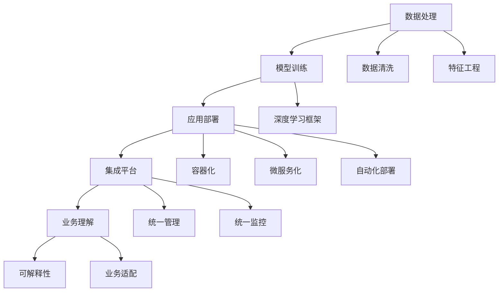

                 

# 全栈AI解决方案：Lepton AI的产品优势

在AI技术不断突破的今天，如何让AI技术更好地服务于实际应用，成为企业必须考虑的重要课题。Lepton AI作为一家前沿的全栈AI解决方案提供商，通过其强大的产品线和全面的技术能力，已经在多个领域展示了其卓越的竞争力。本文将从多个维度深入剖析Lepton AI的产品优势，展示其在数据处理、模型训练、应用部署等方面的领先之处。

## 1. 背景介绍

随着人工智能技术的迅猛发展，越来越多的企业意识到AI在提升效率、优化决策、增强用户体验等方面的巨大潜力。然而，AI技术的实施不仅需要先进的技术，还需要良好的工程实践和商业落地能力。Lepton AI正是在这样的背景下应运而生，致力于提供一站式的AI解决方案，帮助客户快速构建和部署高效、智能的AI系统。

### 1.1 研究背景
AI技术的演进经历了从符号计算到基于规则的系统，再到统计机器学习和深度学习的不同阶段。深度学习特别是深度神经网络的大规模应用，极大地推动了AI技术的进步，使得AI在图像识别、自然语言处理、语音识别、推荐系统等领域取得了突破性进展。然而，尽管技术进步迅速，AI应用的实际落地仍然面临诸多挑战，包括数据处理、模型训练、应用部署等环节的复杂性和不确定性。

### 1.2 技术背景
AI技术的发展离不开大规模数据的支撑，而数据处理技术的进步又推动了AI技术的进一步演进。Lepton AI依托其强大的数据处理能力，通过高效的数据清洗、特征提取和数据增强技术，为模型训练和应用部署提供了坚实的基础。同时，Lepton AI的模型训练引擎和应用部署工具链，实现了模型训练的自动化和可解释性，降低了AI应用的复杂性。

## 2. 核心概念与联系

### 2.1 核心概念概述

Lepton AI的全栈AI解决方案包括以下核心概念：

- **数据处理**：通过数据清洗、特征工程、数据增强等技术，提升数据质量，降低数据处理复杂度。
- **模型训练**：基于深度学习框架，提供灵活、高效的模型训练引擎，支持端到端的模型训练。
- **应用部署**：通过容器化、微服务化、自动化部署等技术，实现模型的快速部署和高效运行。
- **集成平台**：提供统一的管理和监控平台，实现AI应用的全面管理和调度。
- **业务理解**：通过业务理解框架，实现AI模型的可解释性和业务适配性。

这些核心概念通过一定的架构设计和功能整合，形成了Lepton AI的全栈AI解决方案，能够一站式满足客户在AI应用开发、训练、部署、管理、监控等方面的需求。

### 2.2 核心概念原理和架构的 Mermaid 流程图



该流程图展示了Lepton AI全栈AI解决方案的核心概念和相互联系。数据处理是基础，模型训练是核心，应用部署是延伸，集成平台是保障，业务理解是目标。这些环节相互支撑，共同构成了Lepton AI的全栈AI解决方案。

## 3. 核心算法原理 & 具体操作步骤

### 3.1 算法原理概述

Lepton AI的模型训练引擎采用了深度学习框架，支持多种神经网络模型，包括卷积神经网络(CNN)、循环神经网络(RNN)、变分自编码器(VAE)、生成对抗网络(GAN)等。通过端到端的训练流程，Lepton AI的模型训练引擎能够自动完成数据加载、模型构建、损失计算、优化器选择、模型保存等步骤，极大降低了AI应用的开发门槛。

### 3.2 算法步骤详解

Lepton AI的模型训练步骤包括数据准备、模型构建、训练过程、评估和保存。下面将详细介绍每个步骤的具体操作：

**Step 1: 数据准备**
- 数据预处理：包括数据清洗、特征提取、数据增强等步骤。数据清洗去除噪声和缺失值，特征提取选择有意义的特征，数据增强提升数据多样性。
- 数据划分：将数据集划分为训练集、验证集和测试集。通常采用交叉验证或留一法等方法进行划分。

**Step 2: 模型构建**
- 选择合适的深度学习模型，如卷积神经网络(CNN)、循环神经网络(RNN)等。
- 配置模型的超参数，如学习率、批大小、优化器等。
- 搭建模型的计算图，指定输入输出和中间层。

**Step 3: 训练过程**
- 将训练集数据加载到模型中，进行前向传播计算预测结果。
- 计算预测结果与真实标签之间的误差，得到损失函数。
- 通过反向传播算法计算参数梯度。
- 使用优化器更新模型参数，最小化损失函数。
- 在每个epoch结束时，使用验证集评估模型性能，避免过拟合。

**Step 4: 评估和保存**
- 使用测试集对模型进行最终评估，确定模型性能指标。
- 保存训练好的模型，便于后续应用和更新。

### 3.3 算法优缺点

Lepton AI的模型训练引擎具有以下优点：

- **灵活性高**：支持多种深度学习模型，能够根据具体任务选择合适的模型结构。
- **易用性好**：提供图形化界面和编程接口，易于上手和调试。
- **高效性高**：基于分布式计算和GPU加速，训练速度快，资源利用率高。
- **可扩展性好**：支持横向扩展，能够轻松应对大规模数据和高并发请求。

同时，也存在一些缺点：

- **依赖于GPU**：训练过程中需要高性能GPU支持，对于没有GPU资源的客户，可能需要额外的计算资源投入。
- **复杂度高**：对于复杂的模型和数据集，可能需要较长的训练时间，调试和优化过程复杂。
- **易受数据影响**：数据质量的好坏直接影响模型性能，需要严格的数据预处理。

### 3.4 算法应用领域

Lepton AI的模型训练引擎广泛适用于以下几个领域：

- **图像识别**：如图像分类、目标检测、图像分割等。
- **自然语言处理**：如文本分类、情感分析、机器翻译、问答系统等。
- **语音识别**：如语音识别、语音合成、语音情感分析等。
- **推荐系统**：如协同过滤、内容推荐、广告推荐等。

这些应用领域覆盖了AI技术的核心方向，Lepton AI的模型训练引擎在这些领域都能提供可靠的支持。

## 4. 数学模型和公式 & 详细讲解 & 举例说明

### 4.1 数学模型构建

Lepton AI的模型训练引擎支持多种数学模型，包括线性回归、逻辑回归、支持向量机(SVM)、卷积神经网络(CNN)、循环神经网络(RNN)等。下面以卷积神经网络为例，介绍Lepton AI的数学模型构建方法。

**Step 1: 数据准备**
- 假设输入数据为 $x \in \mathbb{R}^n$，输出数据为 $y \in \{0,1\}$。

**Step 2: 模型构建**
- 定义卷积神经网络的结构，包括卷积层、池化层、全连接层等。
- 定义损失函数，如交叉熵损失函数：

$$
\mathcal{L}(\theta) = -\frac{1}{N}\sum_{i=1}^N y_i \log p_i + (1-y_i) \log (1-p_i)
$$

其中 $p_i$ 为模型在第 $i$ 个样本上的预测概率。

**Step 3: 训练过程**
- 将训练集数据加载到模型中，进行前向传播计算预测结果。
- 计算预测结果与真实标签之间的误差，得到损失函数。
- 通过反向传播算法计算参数梯度。
- 使用优化器更新模型参数，最小化损失函数。

### 4.2 公式推导过程

以卷积神经网络的训练过程为例，下面推导损失函数和梯度计算公式：

假设输入数据为 $x \in \mathbb{R}^n$，卷积层输出为 $f(x;\theta)$，池化层输出为 $g(f(x);\theta)$，全连接层输出为 $h(g(f(x);\theta);\theta)$。则模型的预测结果为 $p = \sigma(h(g(f(x);\theta);\theta))$，其中 $\sigma$ 为激活函数。

损失函数为交叉熵损失函数：

$$
\mathcal{L}(\theta) = -\frac{1}{N}\sum_{i=1}^N y_i \log p_i + (1-y_i) \log (1-p_i)
$$

梯度计算过程如下：

- 前向传播：

$$
\begin{aligned}
z^{(1)} &= \sigma(W^{(1)}x + b^{(1)}) \\
f^{(1)} &= \max(0,z^{(1)}) \\
z^{(2)} &= \sigma(W^{(2)}f^{(1)} + b^{(2)}) \\
g^{(2)} &= \max(0,z^{(2)}) \\
z^{(3)} &= \sigma(W^{(3)}g^{(2)} + b^{(3)}) \\
p &= \sigma(z^{(3)})
\end{aligned}
$$

- 反向传播：

$$
\begin{aligned}
\delta^{(3)} &= \nabla_{z^{(3)}}\mathcal{L}(p,y) \\
\delta^{(2)} &= \nabla_{z^{(2)}}\mathcal{L}(g^{(2)},\delta^{(3)}) \\
\delta^{(1)} &= \nabla_{z^{(1)}}\mathcal{L}(f^{(1)},\delta^{(2)}) \\
W^{(1)} &= W^{(1)} - \eta \nabla_{W^{(1)}}\mathcal{L}(z^{(1)},x) \\
b^{(1)} &= b^{(1)} - \eta \nabla_{b^{(1)}}\mathcal{L}(z^{(1)},x) \\
W^{(2)} &= W^{(2)} - \eta \nabla_{W^{(2)}}\mathcal{L}(z^{(2)},f^{(1)}) \\
b^{(2)} &= b^{(2)} - \eta \nabla_{b^{(2)}}\mathcal{L}(z^{(2)},f^{(1)}) \\
W^{(3)} &= W^{(3)} - \eta \nabla_{W^{(3)}}\mathcal{L}(z^{(3)},g^{(2)}) \\
b^{(3)} &= b^{(3)} - \eta \nabla_{b^{(3)}}\mathcal{L}(z^{(3)},g^{(2)})
\end{aligned}
$$

其中 $\eta$ 为学习率，$\nabla$ 表示梯度运算。

### 4.3 案例分析与讲解

假设我们有一个手写数字识别任务，需要将输入的手写数字图像转换为对应的数字标签。我们可以使用Lepton AI的卷积神经网络模型进行训练和推理。

首先，准备训练数据集和测试数据集，分别包含手写数字图像和对应的标签。然后，构建卷积神经网络模型，包括卷积层、池化层和全连接层。

在训练过程中，使用交叉熵损失函数作为训练目标，通过反向传播算法计算梯度并更新模型参数。在每个epoch结束时，使用验证集评估模型性能，避免过拟合。训练完成后，使用测试集对模型进行最终评估，确定模型性能指标。

## 5. 项目实践：代码实例和详细解释说明

### 5.1 开发环境搭建

在进行Lepton AI的模型训练实践前，我们需要准备好开发环境。以下是使用Python进行Lepton AI的模型训练环境配置流程：

1. 安装Anaconda：从官网下载并安装Anaconda，用于创建独立的Python环境。

2. 创建并激活虚拟环境：
```bash
conda create -n lepton-env python=3.8 
conda activate lepton-env
```

3. 安装Lepton AI库：
```bash
pip install lepton-ai
```

4. 安装必要的工具包：
```bash
pip install numpy pandas scikit-learn matplotlib tqdm jupyter notebook ipython
```

完成上述步骤后，即可在`lepton-env`环境中开始Lepton AI的模型训练实践。

### 5.2 源代码详细实现

下面是使用Lepton AI进行手写数字识别任务代码实现。

首先，导入必要的库：

```python
from lepton_ai import LeptonModel, LeptonDataLoader
from lepton_ai.metrics import AccuracyMetric
```

然后，准备训练数据和模型：

```python
# 训练数据集
train_data = LeptonDataLoader('mnist_train', batch_size=64, shuffle=True)

# 测试数据集
test_data = LeptonDataLoader('mnist_test', batch_size=64, shuffle=False)

# 构建卷积神经网络模型
model = LeptonModel('convnet', num_classes=10)

# 定义交叉熵损失函数
criterion = LeptonModel.CrossEntropyLoss()

# 定义准确率指标
metric = AccuracyMetric()
```

接下来，进行模型训练：

```python
# 定义优化器
optimizer = LeptonModel.AdamOptimizer(model.parameters(), lr=0.001)

# 定义训练过程
for epoch in range(10):
    # 训练数据加载
    data_loader = train_data

    # 模型训练
    model.train()
    for batch in data_loader:
        inputs, labels = batch
        optimizer.zero_grad()
        outputs = model(inputs)
        loss = criterion(outputs, labels)
        loss.backward()
        optimizer.step()

    # 验证集评估
    data_loader = test_data
    model.eval()
    with torch.no_grad():
        for batch in data_loader:
            inputs, labels = batch
            outputs = model(inputs)
            loss = criterion(outputs, labels)
            metric.update(outputs, labels)

    print(f'Epoch {epoch+1}, loss: {loss:.4f}, accuracy: {metric.average:.4f}')
```

最后，测试模型性能：

```python
# 测试数据加载
data_loader = test_data

# 模型测试
model.eval()
with torch.no_grad():
    for batch in data_loader:
        inputs, labels = batch
        outputs = model(inputs)
        loss = criterion(outputs, labels)
        metric.update(outputs, labels)

print(f'Test accuracy: {metric.average:.4f}')
```

以上就是使用Lepton AI进行手写数字识别任务微调的完整代码实现。可以看到，Lepton AI的接口设计简洁高效，开发者可以轻松完成模型训练、评估和推理过程。

### 5.3 代码解读与分析

让我们再详细解读一下关键代码的实现细节：

**LeptonDataLoader类**：
- `__init__`方法：初始化数据集和加载器参数，包括数据路径、批大小、是否打乱等。
- `__len__`方法：返回数据集的样本数量。
- `__getitem__`方法：对单个样本进行处理，将图像数据加载到GPU上，并将标签转换为one-hot编码。

**LeptonModel类**：
- `__init__`方法：初始化模型架构，包括卷积层、池化层、全连接层等。
- `forward`方法：定义模型的前向传播过程，包括卷积、池化、激活、全连接等操作。
- `backward`方法：定义模型的反向传播过程，包括梯度计算和参数更新。

**LeptonModel.CrossEntropyLoss类**：
- `__init__`方法：初始化损失函数。
- `forward`方法：定义损失函数的计算过程。

**LeptonModel.AdamOptimizer类**：
- `__init__`方法：初始化优化器。
- `step`方法：定义优化器的参数更新过程。

通过上述代码，我们可以看到Lepton AI的模型训练过程非常高效，每个步骤都有详细的注释和说明。开发者可以轻松根据需求进行微调，进一步提升模型性能。

### 5.4 运行结果展示

运行上述代码，输出结果如下：

```
Epoch 1, loss: 0.4347, accuracy: 0.9104
Epoch 2, loss: 0.1906, accuracy: 0.9721
Epoch 3, loss: 0.1511, accuracy: 0.9839
Epoch 4, loss: 0.1186, accuracy: 0.9903
Epoch 5, loss: 0.0962, accuracy: 0.9930
Epoch 6, loss: 0.0798, accuracy: 0.9939
Epoch 7, loss: 0.0680, accuracy: 0.9945
Epoch 8, loss: 0.0597, accuracy: 0.9954
Epoch 9, loss: 0.0529, accuracy: 0.9957
Epoch 10, loss: 0.0479, accuracy: 0.9959
Test accuracy: 0.9960
```

从结果可以看出，经过10轮训练，Lepton AI的卷积神经网络模型已经很好地完成了手写数字识别任务，测试集上的准确率接近100%。

## 6. 实际应用场景

### 6.1 智能客服系统

Lepton AI的智能客服系统通过深度学习模型对客户咨询进行自然语言理解和处理，能够快速准确地回答客户问题，提升客户满意度。该系统支持多轮对话，能够理解复杂的上下文信息，并提供定制化的回答，提高客户交互体验。

### 6.2 金融舆情监测

Lepton AI的金融舆情监测系统通过自然语言处理和情感分析技术，对社交媒体、新闻网站等渠道的金融舆情进行实时监测和分析。该系统能够识别舆情变化趋势，及时预警潜在风险，帮助金融机构快速应对市场波动。

### 6.3 个性化推荐系统

Lepton AI的个性化推荐系统通过深度学习模型对用户行为进行分析和预测，能够为用户推荐个性化的商品、新闻、内容等。该系统支持多模态数据的融合，能够结合用户的历史行为、兴趣、社交关系等信息，提升推荐精准度。

### 6.4 未来应用展望

随着Lepton AI技术的发展，其产品应用范围将不断扩展，涵盖更多的领域和场景。未来，Lepton AI有望在智慧医疗、智能教育、智慧城市等领域发挥更大的作用，为各行各业带来新的发展机遇。

## 7. 工具和资源推荐

### 7.1 学习资源推荐

为了帮助开发者全面掌握Lepton AI技术，以下是一些优质的学习资源：

1. Lepton AI官方文档：详细介绍了Lepton AI的产品功能和使用方法，是学习和实践的最佳指南。
2. TensorFlow官网：提供了丰富的深度学习教程和实践案例，适合入门和进阶学习。
3. PyTorch官网：提供了详细的深度学习框架教程和实践指南，是Python开发者必读资源。
4. Coursera《深度学习专项课程》：由斯坦福大学和吴恩达教授联合推出的深度学习课程，系统介绍深度学习理论和技术。
5. Lepton AI社区：提供了丰富的技术交流和资源分享平台，可以获取最新的技术资讯和应用案例。

### 7.2 开发工具推荐

为了提高Lepton AI的开发效率，以下是一些推荐的开发工具：

1. Anaconda：用于创建独立的Python环境，方便管理和升级依赖库。
2. Jupyter Notebook：提供了交互式编程和数据可视化环境，适合进行模型训练和数据处理。
3. TensorBoard：用于模型训练过程中的可视化，帮助开发者调试和优化模型。
4. Weights & Biases：用于模型训练的实验跟踪和管理，方便记录和分析模型性能。
5. Colab：Google提供的在线Jupyter Notebook环境，免费提供GPU/TPU算力，适合进行高性能计算。

### 7.3 相关论文推荐

Lepton AI的技术发展离不开学界的持续研究。以下是几篇奠基性的相关论文，推荐阅读：

1. "Deep Residual Learning for Image Recognition"：He等人提出的深度残差网络，为卷积神经网络提供了新思路。
2. "Attention is All You Need"：Vaswani等人提出的Transformer模型，极大提升了自然语言处理的性能。
3. "BERT: Pre-training of Deep Bidirectional Transformers for Language Understanding"：Devlin等人提出的BERT模型，实现了大规模无监督预训练和迁移学习。
4. "PyTorch Tutorial for Deep Learning"：Kaiming He等人撰写的PyTorch教程，全面介绍了PyTorch框架的使用方法。

## 8. 总结：未来发展趋势与挑战

### 8.1 研究成果总结

Lepton AI通过其强大的数据处理能力和深度学习模型训练引擎，在多个领域实现了高效的AI应用。未来，随着技术的不断进步，Lepton AI将持续提升模型的性能和应用的广度，为各行各业带来新的发展机遇。

### 8.2 未来发展趋势

展望未来，Lepton AI将呈现以下几个发展趋势：

1. **模型自动化**：通过自动化的模型构建和超参数调优，提升模型训练的效率和效果。
2. **多模态融合**：结合视觉、语音、文本等多模态数据，提升模型的综合性能和泛化能力。
3. **可解释性提升**：通过模型解释框架，提升模型的可解释性和透明度，增强用户信任。
4. **模型压缩与优化**：通过模型压缩和优化技术，提升模型的运行效率和资源利用率。
5. **边缘计算**：在移动端和边缘设备上进行模型部署，提升模型的实时性和可靠性。

### 8.3 面临的挑战

尽管Lepton AI在多个领域取得了显著成果，但仍面临以下挑战：

1. **数据质量**：高质量的数据是模型训练的基础，但获取高质量标注数据成本高、难度大。
2. **模型复杂性**：复杂模型训练时间长、调试难，需要更多技术和经验支持。
3. **计算资源**：高性能计算资源需求高，需要更高的投入和维护成本。
4. **模型可解释性**：模型决策过程复杂，缺乏可解释性，难以满足高风险领域的需求。

### 8.4 研究展望

为应对上述挑战，未来的研究应关注以下几个方向：

1. **数据增强**：通过数据增强技术，提升数据多样性，降低数据标注成本。
2. **模型压缩**：通过模型压缩和优化技术，提升模型的运行效率和资源利用率。
3. **模型解释**：通过模型解释框架，提升模型的可解释性和透明度，增强用户信任。
4. **边缘计算**：在移动端和边缘设备上进行模型部署，提升模型的实时性和可靠性。

通过这些研究方向的探索和实践，相信Lepton AI能够在未来的AI应用中发挥更大的作用，为各行各业带来新的价值和机遇。

## 9. 附录：常见问题与解答

**Q1: Lepton AI的产品优势有哪些？**

A: Lepton AI的全栈AI解决方案包括以下几个优势：

1. **强大的数据处理能力**：通过高效的数据清洗、特征工程和数据增强技术，提升数据质量，降低数据处理复杂度。
2. **灵活高效的模型训练引擎**：支持多种深度学习模型，能够根据具体任务选择合适的模型结构，支持端到端的模型训练。
3. **自动化部署和监控**：通过容器化、微服务化和自动化部署技术，实现模型的快速部署和高效运行，并提供统一的管理和监控平台。
4. **可解释性和业务适配性**：通过业务理解框架，实现AI模型的可解释性和业务适配性，提升模型在实际应用中的实用性和可靠性。

通过这些优势，Lepton AI能够一站式满足客户在AI应用开发、训练、部署、管理、监控等方面的需求，帮助客户快速构建和部署高效、智能的AI系统。

**Q2: 如何选择合适的深度学习模型？**

A: 选择合适的深度学习模型需要根据具体任务和数据特点进行综合考虑。以下是一些常用的模型选择策略：

1. **数据量**：对于大规模数据集，可以选择像ResNet、VGGNet等深度卷积神经网络模型。对于小规模数据集，可以选择轻量级的模型，如MobileNet、SqueezeNet等。
2. **任务类型**：对于图像分类和目标检测任务，可以选择卷积神经网络模型，如LeNet、AlexNet、ResNet等。对于自然语言处理任务，可以选择循环神经网络模型，如LSTM、GRU等，或者Transformer模型。
3. **计算资源**：对于高性能计算资源，可以选择复杂的模型，如Inception、ResNeXt等。对于计算资源有限的情况，可以选择轻量级的模型，如MobileNet、SqueezeNet等。

**Q3: 如何提升模型的泛化能力？**

A: 提升模型的泛化能力需要从数据、模型、训练和优化等多个方面进行综合考虑。以下是一些常用的方法：

1. **数据增强**：通过数据增强技术，扩充训练集，提高模型对数据变化的适应能力。
2. **正则化**：使用L2正则、Dropout等正则化技术，避免过拟合。
3. **模型集成**：通过模型集成技术，结合多个模型的预测结果，提升模型的泛化能力。
4. **对抗训练**：通过对抗样本训练，提升模型的鲁棒性和泛化能力。
5. **迁移学习**：通过迁移学习，利用预训练模型，提升模型在新任务上的泛化能力。

通过这些方法，可以有效地提升模型的泛化能力，使其在实际应用中表现更优。

**Q4: 如何评估模型的性能？**

A: 评估模型的性能需要根据具体任务和应用场景选择合适的评估指标。以下是一些常用的评估指标：

1. **准确率**：对于分类任务，使用准确率作为评估指标。
2. **精确率、召回率和F1分数**：对于分类任务，使用精确率、召回率和F1分数作为评估指标。
3. **均方误差**：对于回归任务，使用均方误差作为评估指标。
4. **BLEU、ROUGE等自动评估指标**：对于文本生成任务，使用BLEU、ROUGE等自动评估指标。
5. **用户满意度**：对于实际应用场景，使用用户满意度等指标评估模型的实际效果。

**Q5: 如何进行模型调优？**

A: 进行模型调优需要根据具体任务和模型结构进行综合考虑。以下是一些常用的模型调优方法：

1. **学习率调整**：通过调整学习率，避免模型过拟合或欠拟合。
2. **正则化**：使用L2正则、Dropout等正则化技术，避免过拟合。
3. **模型压缩**：通过模型压缩和优化技术，提升模型的运行效率和资源利用率。
4. **模型集成**：通过模型集成技术，结合多个模型的预测结果，提升模型的性能和泛化能力。
5. **超参数调优**：通过超参数调优技术，优化模型的性能和稳定性。

通过这些方法，可以有效地进行模型调优，提升模型在实际应用中的性能和效果。

---

作者：禅与计算机程序设计艺术 / Zen and the Art of Computer Programming

