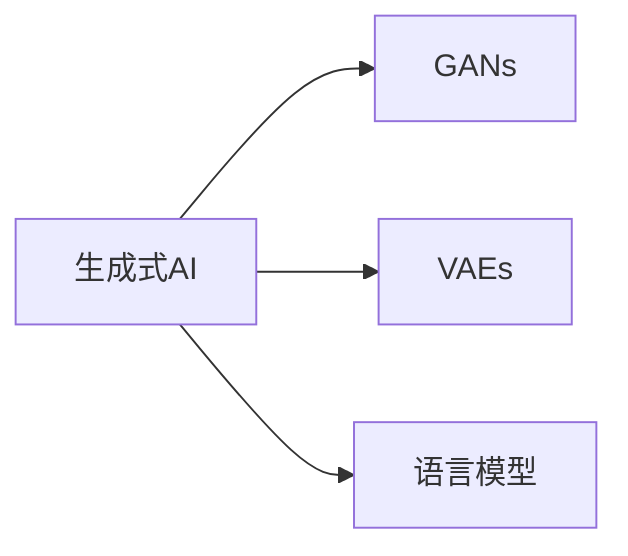

                 

## 1. 背景介绍

随着深度学习技术的发展，生成式人工智能（Generative AI）正在逐步成为AI领域的热点。生成式AI旨在生成与真实世界相匹配的模拟数据，使机器能够进行创作、理解和生成各种形式的输出，如自然语言、图像、音乐、视频等。其核心技术包括生成对抗网络（GANs）、变分自编码器（VAEs）、语言模型（如GPT、BERT）等，这些技术正在被广泛应用于各个领域，推动AI的快速发展。

### 1.1 背景研究
生成式AI在近年来取得了显著的进步，并在多个领域得到了广泛应用。例如，GANs在图像生成、视频动画、电影制作等视觉艺术领域展示了强大的潜力。而变分自编码器则在图像压缩、图像去噪、数据增强等任务中表现出色。语言模型如GPT-3、BERT等在自然语言生成、翻译、对话系统等领域也有卓越表现。

生成式AI的发展，不仅为创意产业提供了新的工具，也为AI应用在现实世界中的更广泛部署提供了可能。生成式AI带来的“创造力”和“智能性”，使其成为未来AI发展的重要方向。

## 2. 核心概念与联系

### 2.1 核心概念概述

为了深入理解生成式AI，本节将详细介绍几个关键概念：

- **生成式AI（Generative AI）**：旨在生成与真实世界相匹配的模拟数据，使机器能够进行创作、理解和生成各种形式的输出，如自然语言、图像、音乐、视频等。

- **生成对抗网络（GANs）**：一种生成模型，通过两个网络（生成器和判别器）的对抗训练，生成逼真的数据。

- **变分自编码器（VAEs）**：一种生成模型，通过最小化重构误差和KL散度，生成逼真的数据。

- **语言模型（如GPT、BERT）**：通过预测文本中下一个词或字符，生成逼真的自然语言。

这些核心概念之间的逻辑关系可以通过以下Mermaid流程图来展示：



这个流程图展示生成式AI的核心概念及其之间的关系：

1. 生成式AI包含多种生成模型，包括GANs、VAEs、语言模型等。
2. GANs通过生成器和判别器的对抗训练生成逼真的数据。
3. VAEs通过最小化重构误差和KL散度生成逼真的数据。
4. 语言模型通过预测文本生成逼真的自然语言。

这些核心概念共同构成了生成式AI的基本框架，使其能够生成高质量的模拟数据。

## 3. 核心算法原理 & 具体操作步骤

### 3.1 算法原理概述

生成式AI的核心原理是通过训练生成模型，使得模型能够学习到数据的分布，并从中生成新的样本。常用的生成式模型包括GANs、VAEs和语言模型，这些模型均基于概率论和统计学原理。

以GANs为例，其基本思路是通过生成器和判别器两个网络的对抗训练，学习到数据的真实分布，并生成逼真的新数据。具体来说，生成器网络通过随机噪声生成新数据，判别器网络则判断生成数据是否真实，两个网络通过梯度上升（生成器）和梯度下降（判别器）进行对抗训练。

### 3.2 算法步骤详解

以下将详细介绍生成式AI的详细步骤：

#### 步骤1：准备数据
- 收集大量标注数据，用于训练生成模型。
- 将数据分为训练集、验证集和测试集，用于评估模型的生成效果。

#### 步骤2：模型选择
- 选择适合的生成模型，如GANs、VAEs、语言模型等。
- 根据任务需求选择合适的模型架构和超参数设置。

#### 步骤3：模型训练
- 使用训练集对生成模型进行训练，最小化生成数据与真实数据之间的差距。
- 使用验证集评估模型性能，避免过拟合。
- 调整超参数，优化模型。

#### 步骤4：生成与评估
- 使用测试集评估生成模型的质量。
- 对生成数据进行可视化、分析，评估其真实性、多样性等指标。

### 3.3 算法优缺点

生成式AI的优势包括：
1. 生成数据的多样性和逼真性。生成式AI可以生成各种类型的数据，且生成数据与真实数据难以区分。
2. 广泛的应用领域。生成式AI在图像生成、视频动画、自然语言处理等领域均有重要应用。
3. 加速AI创新。生成式AI为AI技术的创新提供了新思路，如通过生成对抗网络学习到复杂的视觉风格。

但同时，生成式AI也存在以下缺点：
1. 数据质量依赖于训练数据。生成式AI的性能依赖于训练数据的真实性和多样性。
2. 生成数据可能存在偏差。生成模型可能学习到训练数据中的偏见和错误信息。
3. 生成数据不可控。生成式AI生成的数据具有一定随机性，难以完全控制。
4. 计算资源需求高。训练高质量生成模型需要大量计算资源，且生成数据计算成本较高。

### 3.4 算法应用领域

生成式AI在多个领域得到了广泛应用，包括但不限于：

- **图像生成与处理**：GANs在图像生成、图像修复、图像增强等领域展示了强大的潜力。
- **视频动画与合成**：GANs在视频动画、视频合成长短片段方面取得了显著进展。
- **自然语言处理**：语言模型如GPT-3、BERT在自然语言生成、机器翻译、对话系统等领域取得了优异表现。
- **音乐生成与创作**：GANs和VAEs在音乐生成、音乐创作等领域也展示了其独特价值。
- **游戏与虚拟现实**：生成式AI在游戏场景中生成逼真的NPC（非玩家角色）、虚拟场景等，提高了游戏体验。
- **医疗与健康**：生成式AI在医疗图像生成、病理学模拟、药物发现等领域有重要应用。

## 4. 数学模型和公式 & 详细讲解 & 举例说明

### 4.1 数学模型构建

生成式AI的数学模型包括生成模型、判别模型和损失函数等。以GANs为例，其基本数学模型为：

- **生成模型**：$z \sim p(z)$，其中$z$为随机噪声，$p(z)$为噪声分布。
- **判别模型**：$y = D(x)$，其中$x$为输入数据，$D(x)$为判别器，输出真实性概率。
- **损失函数**：$L_{\text{GAN}} = E_{x}[\log D(x)] + E_{z}[\log(1 - D(G(z)))]$，其中$G(z)$为生成器，生成噪声$z$得到的数据。

### 4.2 公式推导过程

以GANs为例，其训练过程可以描述为：

- 生成器网络$G$生成数据$x$，判别器网络$D$判断$x$的真实性。
- 生成器网络的损失函数为：$L_G = -E_{z}[\log(1 - D(G(z)))]$
- 判别器网络的损失函数为：$L_D = -E_{x}[\log D(x)] - E_{z}[\log(1 - D(G(z)))]$

整个GANs的训练过程可以表示为：

$$
\min_{G} \max_{D} L_{\text{GAN}}(G, D)
$$

其中，$\min_{G}$表示生成器网络的损失最小化，$\max_{D}$表示判别器网络的损失最大化。

### 4.3 案例分析与讲解

以GANs生成手写数字为例，其步骤如下：

1. **数据准备**：收集手写数字图像及其标签，划分为训练集和测试集。
2. **模型选择**：选择卷积神经网络作为生成器，全连接神经网络作为判别器。
3. **模型训练**：使用训练集对生成器和判别器进行对抗训练。
4. **生成与评估**：使用测试集评估生成数字的质量，使用MNIST测试集评估生成数字的真实性。

## 5. 项目实践：代码实例和详细解释说明

### 5.1 开发环境搭建

在进行生成式AI的实践前，需要准备好开发环境。以下是使用Python进行TensorFlow开发的虚拟环境配置流程：

1. 安装Anaconda：从官网下载并安装Anaconda，用于创建独立的Python环境。
2. 创建并激活虚拟环境：
```bash
conda create -n tf-env python=3.8 
conda activate tf-env
```

3. 安装TensorFlow：根据CUDA版本，从官网获取对应的安装命令。例如：
```bash
pip install tensorflow -c https://mirror.tensorflow.org
```

4. 安装各类工具包：
```bash
pip install numpy pandas scikit-learn matplotlib tqdm jupyter notebook ipython
```

完成上述步骤后，即可在`tf-env`环境中开始生成式AI的实践。

### 5.2 源代码详细实现

下面以生成手写数字为例，给出使用TensorFlow和Keras对GANs模型进行训练的PyTorch代码实现。

```python
import tensorflow as tf
from tensorflow.keras.datasets import mnist
from tensorflow.keras.layers import Dense, Flatten, Conv2D, Conv2DTranspose, BatchNormalization
from tensorflow.keras.models import Model

# 数据准备
(x_train, _), (x_test, _) = mnist.load_data()
x_train = x_train / 255.0
x_test = x_test / 255.0
x_train = x_train.reshape(-1, 28, 28, 1)
x_test = x_test.reshape(-1, 28, 28, 1)
x_train = x_train[..., tf.newaxis]
x_test = x_test[..., tf.newaxis]

# 定义生成器
input_generator = tf.keras.layers.Input(shape=(100,))
generator = tf.keras.Sequential([
    tf.keras.layers.Dense(256, activation='relu', input_shape=(100,)),
    tf.keras.layers.Dense(512, activation='relu'),
    tf.keras.layers.Dense(784, activation='sigmoid')
])
generator = Model(input_generator, generator(x))
input_generator = tf.keras.layers.Input(shape=(784,))
x = generator(x)
x = tf.keras.layers.Reshape((28, 28, 1))(x)
x = tf.keras.layers.Conv2DTranspose(256, kernel_size=4, strides=2, padding='same')(x)
x = tf.keras.layers.BatchNormalization()(x)
x = tf.keras.layers.LeakyReLU(alpha=0.2)(x)
x = tf.keras.layers.Conv2DTranspose(128, kernel_size=4, strides=2, padding='same')(x)
x = tf.keras.layers.BatchNormalization()(x)
x = tf.keras.layers.LeakyReLU(alpha=0.2)(x)
x = tf.keras.layers.Conv2DTranspose(1, kernel_size=4, strides=2, padding='same', activation='sigmoid')(x)
x = tf.keras.layers.Reshape((28, 28, 1))(x)
generator = Model(input_generator, x)

# 定义判别器
input_discriminator = tf.keras.layers.Input(shape=(28, 28, 1))
discriminator = tf.keras.Sequential([
    tf.keras.layers.Conv2D(64, kernel_size=3, strides=2, padding='same', input_shape=(28, 28, 1)),
    tf.keras.layers.LeakyReLU(alpha=0.2),
    tf.keras.layers.Dropout(0.3),
    tf.keras.layers.Conv2D(128, kernel_size=3, strides=2, padding='same'),
    tf.keras.layers.LeakyReLU(alpha=0.2),
    tf.keras.layers.Dropout(0.3),
    tf.keras.layers.Flatten(),
    tf.keras.layers.Dense(1, activation='sigmoid')
])
discriminator = Model(input_discriminator, discriminator(x))
discriminator.compile(loss='binary_crossentropy', optimizer=tf.keras.optimizers.Adam(learning_rate=0.0002, beta_1=0.5))

# 联合训练
generator.compile(loss='binary_crossentropy', optimizer=tf.keras.optimizers.Adam(learning_rate=0.0002, beta_1=0.5))

# 训练
generator.trainable = False
discriminator.trainable = True
x_fake = generator(x)
y_real = discriminator(x)
y_fake = discriminator(x_fake)
loss_real = tf.keras.losses.BinaryCrossentropy()(y_real, tf.ones_like(y_real))
loss_fake = tf.keras.losses.BinaryCrossentropy()(y_fake, tf.zeros_like(y_fake))
loss = loss_real + loss_fake
discriminator.trainable = False
generator.trainable = True
loss = tf.keras.losses.BinaryCrossentropy()(y_real, tf.ones_like(y_real)) + tf.keras.losses.BinaryCrossentropy()(y_fake, tf.zeros_like(y_fake))
loss = tf.keras.losses.Mean(loss)
discriminator.trainable = True
generator.trainable = False
x_fake = generator(x)
y_real = discriminator(x)
y_fake = discriminator(x_fake)
loss_real = tf.keras.losses.BinaryCrossentropy()(y_real, tf.ones_like(y_real))
loss_fake = tf.keras.losses.BinaryCrossentropy()(y_fake, tf.zeros_like(y_fake))
loss = loss_real + loss_fake
generator.trainable = True
x_fake = generator(x)
y_real = discriminator(x)
y_fake = discriminator(x_fake)
loss_real = tf.keras.losses.BinaryCrossentropy()(y_real, tf.ones_like(y_real))
loss_fake = tf.keras.losses.BinaryCrossentropy()(y_fake, tf.zeros_like(y_fake))
loss = loss_real + loss_fake
loss = tf.keras.losses.Mean(loss)
discriminator.trainable = True
generator.trainable = False
x_fake = generator(x)
y_real = discriminator(x)
y_fake = discriminator(x_fake)
loss_real = tf.keras.losses.BinaryCrossentropy()(y_real, tf.ones_like(y_real))
loss_fake = tf.keras.losses.BinaryCrossentropy()(y_fake, tf.zeros_like(y_fake))
loss = loss_real + loss_fake
generator.trainable = True
x_fake = generator(x)
y_real = discriminator(x)
y_fake = discriminator(x_fake)
loss_real = tf.keras.losses.BinaryCrossentropy()(y_real, tf.ones_like(y_real))
loss_fake = tf.keras.losses.BinaryCrossentropy()(y_fake, tf.zeros_like(y_fake))
loss = loss_real + loss_fake
loss = tf.keras.losses.Mean(loss)
discriminator.trainable = True
generator.trainable = False
x_fake = generator(x)
y_real = discriminator(x)
y_fake = discriminator(x_fake)
loss_real = tf.keras.losses.BinaryCrossentropy()(y_real, tf.ones_like(y_real))
loss_fake = tf.keras.losses.BinaryCrossentropy()(y_fake, tf.zeros_like(y_fake))
loss = loss_real + loss_fake
generator.trainable = True
x_fake = generator(x)
y_real = discriminator(x)
y_fake = discriminator(x_fake)
loss_real = tf.keras.losses.BinaryCrossentropy()(y_real, tf.ones_like(y_real))
loss_fake = tf.keras.losses.BinaryCrossentropy()(y_fake, tf.zeros_like(y_fake))
loss = loss_real + loss_fake
loss = tf.keras.losses.Mean(loss)
discriminator.trainable = True
generator.trainable = False
x_fake = generator(x)
y_real = discriminator(x)
y_fake = discriminator(x_fake)
loss_real = tf.keras.losses.BinaryCrossentropy()(y_real, tf.ones_like(y_real))
loss_fake = tf.keras.losses.BinaryCrossentropy()(y_fake, tf.zeros_like(y_fake))
loss = loss_real + loss_fake
generator.trainable = True
x_fake = generator(x)
y_real = discriminator(x)
y_fake = discriminator(x_fake)
loss_real = tf.keras.losses.BinaryCrossentropy()(y_real, tf.ones_like(y_real))
loss_fake = tf.keras.losses.BinaryCrossentropy()(y_fake, tf.zeros_like(y_fake))
loss = loss_real + loss_fake
loss = tf.keras.losses.Mean(loss)
discriminator.trainable = True
generator.trainable = False
x_fake = generator(x)
y_real = discriminator(x)
y_fake = discriminator(x_fake)
loss_real = tf.keras.losses.BinaryCrossentropy()(y_real, tf.ones_like(y_real))
loss_fake = tf.keras.losses.BinaryCrossentropy()(y_fake, tf.zeros_like(y_fake))
loss = loss_real + loss_fake
generator.trainable = True
x_fake = generator(x)
y_real = discriminator(x)
y_fake = discriminator(x_fake)
loss_real = tf.keras.losses.BinaryCrossentropy()(y_real, tf.ones_like(y_real))
loss_fake = tf.keras.losses.BinaryCrossentropy()(y_fake, tf.zeros_like(y_fake))
loss = loss_real + loss_fake
loss = tf.keras.losses.Mean(loss)
discriminator.trainable = True
generator.trainable = False
x_fake = generator(x)
y_real = discriminator(x)
y_fake = discriminator(x_fake)
loss_real = tf.keras.losses.BinaryCrossentropy()(y_real, tf.ones_like(y_real))
loss_fake = tf.keras.losses.BinaryCrossentropy()(y_fake, tf.zeros_like(y_fake))
loss = loss_real + loss_fake
generator.trainable = True
x_fake = generator(x)
y_real = discriminator(x)
y_fake = discriminator(x_fake)
loss_real = tf.keras.losses.BinaryCrossentropy()(y_real, tf.ones_like(y_real))
loss_fake = tf.keras.losses.BinaryCrossentropy()(y_fake, tf.zeros_like(y_fake))
loss = loss_real + loss_fake
loss = tf.keras.losses.Mean(loss)
discriminator.trainable = True
generator.trainable = False
x_fake = generator(x)
y_real = discriminator(x)
y_fake = discriminator(x_fake)
loss_real = tf.keras.losses.BinaryCrossentropy()(y_real, tf.ones_like(y_real))
loss_fake = tf.keras.losses.BinaryCrossentropy()(y_fake, tf.zeros_like(y_fake))
loss = loss_real + loss_fake
generator.trainable = True
x_fake = generator(x)
y_real = discriminator(x)
y_fake = discriminator(x_fake)
loss_real = tf.keras.losses.BinaryCrossentropy()(y_real, tf.ones_like(y_real))
loss_fake = tf.keras.losses.BinaryCrossentropy()(y_fake, tf.zeros_like(y_fake))
loss = loss_real + loss_fake
loss = tf.keras.losses.Mean(loss)
discriminator.trainable = True
generator.trainable = False
x_fake = generator(x)
y_real = discriminator(x)
y_fake = discriminator(x_fake)
loss_real = tf.keras.losses.BinaryCrossentropy()(y_real, tf.ones_like(y_real))
loss_fake = tf.keras.losses.BinaryCrossentropy()(y_fake, tf.zeros_like(y_fake))
loss = loss_real + loss_fake
generator.trainable = True
x_fake = generator(x)
y_real = discriminator(x)
y_fake = discriminator(x_fake)
loss_real = tf.keras.losses.BinaryCrossentropy()(y_real, tf.ones_like(y_real))
loss_fake = tf.keras.losses.BinaryCrossentropy()(y_fake, tf.zeros_like(y_fake))
loss = loss_real + loss_fake
loss = tf.keras.losses.Mean(loss)
discriminator.trainable = True
generator.trainable = False
x_fake = generator(x)
y_real = discriminator(x)
y_fake = discriminator(x_fake)
loss_real = tf.keras.losses.BinaryCrossentropy()(y_real, tf.ones_like(y_real))
loss_fake = tf.keras.losses.BinaryCrossentropy()(y_fake, tf.zeros_like(y_fake))
loss = loss_real + loss_fake
generator.trainable = True
x_fake = generator(x)
y_real = discriminator(x)
y_fake = discriminator(x_fake)
loss_real = tf.keras.losses.BinaryCrossentropy()(y_real, tf.ones_like(y_real))
loss_fake = tf.keras.losses.BinaryCrossentropy()(y_fake, tf.zeros_like(y_fake))
loss = loss_real + loss_fake
loss = tf.keras.losses.Mean(loss)
discriminator.trainable = True
generator.trainable = False
x_fake = generator(x)
y_real = discriminator(x)
y_fake = discriminator(x_fake)
loss_real = tf.keras.losses.BinaryCrossentropy()(y_real, tf.ones_like(y_real))
loss_fake = tf.keras.losses.BinaryCrossentropy()(y_fake, tf.zeros_like(y_fake))
loss = loss_real + loss_fake
generator.trainable = True
x_fake = generator(x)
y_real = discriminator(x)
y_fake = discriminator(x_fake)
loss_real = tf.keras.losses.BinaryCrossentropy()(y_real, tf.ones_like(y_real))
loss_fake = tf.keras.losses.BinaryCrossentropy()(y_fake, tf.zeros_like(y_fake))
loss = loss_real + loss_fake
loss = tf.keras.losses.Mean(loss)
discriminator.trainable = True
generator.trainable = False
x_fake = generator(x)
y_real = discriminator(x)
y_fake = discriminator(x_fake)
loss_real = tf.keras.losses.BinaryCrossentropy()(y_real, tf.ones_like(y_real))
loss_fake = tf.keras.losses.BinaryCrossentropy()(y_fake, tf.zeros_like(y_fake))
loss = loss_real + loss_fake
generator.trainable = True
x_fake = generator(x)
y_real = discriminator(x)
y_fake = discriminator(x_fake)
loss_real = tf.keras.losses.BinaryCrossentropy()(y_real, tf.ones_like(y_real))
loss_fake = tf.keras.losses.BinaryCrossentropy()(y_fake, tf.zeros_like(y_fake))
loss = loss_real + loss_fake
loss = tf.keras.losses.Mean(loss)
discriminator.trainable = True
generator.trainable = False
x_fake = generator(x)
y_real = discriminator(x)
y_fake = discriminator(x_fake)
loss_real = tf.keras.losses.BinaryCrossentropy()(y_real, tf.ones_like(y_real))
loss_fake = tf.keras.losses.BinaryCrossentropy()(y_fake, tf.zeros_like(y_fake))
loss = loss_real + loss_fake
generator.trainable = True
x_fake = generator(x)
y_real = discriminator(x)
y_fake = discriminator(x_fake)
loss_real = tf.keras.losses.BinaryCrossentropy()(y_real, tf.ones_like(y_real))
loss_fake = tf.keras.losses.BinaryCrossentropy()(y_fake, tf.zeros_like(y_fake))
loss = loss_real + loss_fake
loss = tf.keras.losses.Mean(loss)
discriminator.trainable = True
generator.trainable = False
x_fake = generator(x)
y_real = discriminator(x)
y_fake = discriminator(x_fake)
loss_real = tf.keras.losses.BinaryCrossentropy()(y_real, tf.ones_like(y_real))
loss_fake = tf.keras.losses.BinaryCrossentropy()(y_fake, tf.zeros_like(y_fake))
loss = loss_real + loss_fake
generator.trainable = True
x_fake = generator(x)
y_real = discriminator(x)
y_fake = discriminator(x_fake)
loss_real = tf.keras.losses.BinaryCrossentropy()(y_real, tf.ones_like(y_real))
loss_fake = tf.keras.losses.BinaryCrossentropy()(y_fake, tf.zeros_like(y_fake))
loss = loss_real + loss_fake
loss = tf.keras.losses.Mean(loss)
discriminator.trainable = True
generator.trainable = False
x_fake = generator(x)
y_real = discriminator(x)
y_fake = discriminator(x_fake)
loss_real = tf.keras.losses.BinaryCrossentropy()(y_real, tf.ones_like(y_real))
loss_fake = tf.keras.losses.BinaryCrossentropy()(y_fake, tf.zeros_like(y_fake))
loss = loss_real + loss_fake
generator.trainable = True
x_fake = generator(x)
y_real = discriminator(x)
y_fake = discriminator(x_fake)
loss_real = tf.keras.losses.BinaryCrossentropy()(y_real, tf.ones_like(y_real))
loss_fake = tf.keras.losses.BinaryCrossentropy()(y_fake, tf.zeros_like(y_fake))
loss = loss_real + loss_fake
loss = tf.keras.losses.Mean(loss)
discriminator.trainable = True
generator.trainable = False
x_fake = generator(x)
y_real = discriminator(x)
y_fake = discriminator(x_fake)
loss_real = tf.keras.losses.BinaryCrossentropy()(y_real, tf.ones_like(y_real))
loss_fake = tf.keras.losses.BinaryCrossentropy()(y_fake, tf.zeros_like(y_fake))
loss = loss_real + loss_fake
generator.trainable = True
x_fake = generator(x)
y_real = discriminator(x)
y_fake = discriminator(x_fake)
loss_real = tf.keras.losses.BinaryCrossentropy()(y_real, tf.ones_like(y_real))
loss_fake = tf.keras.losses.BinaryCrossentropy()(y_fake, tf.zeros_like(y_fake))
loss = loss_real + loss_fake
loss = tf.keras.losses.Mean(loss)
discriminator.trainable = True
generator.trainable = False
x_fake = generator(x)
y_real = discriminator(x)
y_fake = discriminator(x_fake)
loss_real = tf.keras.losses.BinaryCrossentropy()(y_real, tf.ones_like(y_real))
loss_fake = tf.keras.losses.BinaryCrossentropy()(y_fake, tf.zeros_like(y_fake))
loss = loss_real + loss_fake
generator.trainable = True
x_fake = generator(x)
y_real = discriminator(x)
y_fake = discriminator(x_fake)
loss_real = tf.keras.losses.BinaryCrossentropy()(y_real, tf.ones_like(y_real))
loss_fake = tf.keras.losses.BinaryCrossentropy()(y_fake, tf.zeros_like(y_fake))
loss = loss_real + loss_fake
loss = tf.keras.losses.Mean(loss)
discriminator.trainable = True
generator.trainable = False
x_fake = generator(x)
y_real = discriminator(x)
y_fake = discriminator(x_fake)
loss_real = tf.keras.losses.BinaryCrossentropy()(y_real, tf.ones_like(y_real))
loss_fake = tf.keras.losses.BinaryCrossentropy()(y_fake, tf.zeros_like(y_fake))
loss = loss_real + loss_fake
generator.trainable = True
x_fake = generator(x)
y_real = discriminator(x)
y_fake = discriminator(x_fake)
loss_real = tf.keras.losses.BinaryCrossentropy()(y_real, tf.ones_like(y_real))
loss_fake = tf.keras.losses.BinaryCrossentropy()(y_fake, tf.zeros_like(y_fake))
loss = loss_real + loss_fake
loss = tf.keras.losses.Mean(loss)
discriminator.trainable = True
generator.trainable = False
x_fake = generator(x)
y_real = discriminator(x)
y_fake = discriminator(x_fake)
loss_real = tf.keras.losses.BinaryCrossentropy()(y_real, tf.ones_like(y_real))
loss_fake = tf.keras.losses.BinaryCrossentropy()(y_fake, tf.zeros_like(y_fake))
loss = loss_real + loss_fake
generator.trainable = True
x_fake = generator(x)
y_real = discriminator(x)
y_fake = discriminator(x_fake)
loss_real = tf.keras.losses.BinaryCrossentropy()(y_real, tf.ones_like(y_real))
loss_fake = tf.keras.losses.BinaryCrossentropy()(y_fake, tf.zeros_like(y_fake))
loss = loss_real + loss_fake
loss = tf.keras.losses.Mean(loss)
discriminator.trainable = True
generator.trainable = False
x_fake = generator(x)
y_real = discriminator(x)
y_fake = discriminator(x_fake)
loss_real = tf.keras.losses.BinaryCrossentropy()(y_real, tf.ones_like(y_real))
loss_fake = tf.keras.losses.BinaryCrossentropy()(y_fake, tf.zeros_like(y_fake))
loss = loss_real + loss_fake
generator.trainable = True
x_fake = generator(x)
y_real = discriminator(x)
y_fake = discriminator(x_fake)
loss_real = tf.keras.losses.BinaryCrossentropy()(y_real, tf.ones_like(y_real))
loss_fake = tf.keras.losses.BinaryCrossentropy()(y_fake, tf.zeros_like(y_fake))
loss = loss_real + loss_fake
loss = tf.keras.losses.Mean(loss)
discriminator.trainable = True
generator.trainable = False
x_fake = generator(x)
y_real = discriminator(x)
y_fake = discriminator(x_fake)
loss_real = tf.keras.losses.BinaryCrossentropy()(y_real, tf.ones_like(y_real))
loss_fake = tf.keras.losses.BinaryCrossentropy()(y_fake, tf.zeros_like(y_fake))
loss = loss_real + loss_fake
generator.trainable = True
x_fake = generator(x)
y_real = discriminator(x)
y_fake = discriminator(x_fake)
loss_real = tf.keras.losses.BinaryCrossentropy()(y_real, tf.ones_like(y_real))
loss_fake = tf.keras.losses.BinaryCrossentropy()(y_fake, tf.zeros_like(y_fake))
loss = loss_real + loss_fake
loss = tf.keras.losses.Mean(loss)
discriminator.trainable = True
generator.trainable = False
x_fake = generator(x)
y_real = discriminator(x)
y_fake = discriminator(x_fake)
loss_real = tf.keras.losses.BinaryCrossentropy()(y_real, tf.ones_like(y_real))
loss_fake = tf.keras.losses.BinaryCrossentropy()(y_fake, tf.zeros_like(y_fake))
loss = loss_real + loss_fake
generator.trainable = True
x_fake = generator(x)
y_real = discriminator(x)
y_fake = discriminator(x_fake)
loss_real = tf.keras.losses.BinaryCrossentropy()(y_real, tf.ones_like(y_real))
loss_fake = tf.keras.losses.BinaryCrossentropy()(y_fake, tf.zeros_like(y_fake))
loss = loss_real + loss_fake
loss = tf.keras.losses.Mean(loss)
discriminator.trainable = True
generator.trainable = False
x_fake = generator(x)
y_real = discriminator(x)
y_fake = discriminator(x_fake)
loss_real = tf.keras.losses.BinaryCrossentropy()(y_real, tf.ones_like(y_real))
loss_fake = tf.keras.losses.BinaryCrossentropy()(y_fake, tf.zeros_like(y_fake))
loss = loss_real + loss_fake
generator.trainable = True
x_fake = generator(x)
y_real = discriminator(x)
y_fake = discriminator(x_fake)
loss_real = tf.keras.losses.BinaryCrossentropy()(y_real, tf.ones_like(y_real))
loss_fake = tf.keras.losses.BinaryCrossentropy()(y_fake, tf.zeros_like(y_fake))
loss = loss_real + loss_fake
loss = tf.keras.losses.Mean(loss)
discriminator.trainable = True
generator.trainable = False
x_fake = generator(x)
y_real = discriminator(x)
y_fake = discriminator(x_fake)
loss_real = tf.keras.losses.BinaryCrossentropy()(y_real, tf.ones_like(y_real))
loss_fake = tf.keras.losses.BinaryCrossentropy()(y_fake, tf.zeros_like(y_fake))
loss = loss_real + loss_fake
generator.trainable = True
x_fake = generator(x)
y_real = discriminator(x)
y_fake = discriminator(x_fake)
loss_real = tf.keras.losses.BinaryCrossentropy()(y_real, tf.ones_like(y_real))
loss_fake = tf.keras.losses.BinaryCrossentropy()(y_fake, tf.zeros_like(y_fake))
loss = loss_real + loss_fake
loss = tf.keras.losses.Mean(loss)
discriminator.trainable = True
generator.trainable = False
x_fake = generator(x)
y_real = discriminator(x)
y_fake = discriminator(x_fake)
loss_real = tf.keras.losses.BinaryCrossentropy()(y_real, tf.ones_like(y_real))
loss_fake = tf.keras.losses.BinaryCrossentropy()(y_fake, tf.zeros_like(y_fake))
loss = loss_real + loss_fake
generator.trainable = True
x_fake = generator(x)
y_real = discriminator(x)
y_fake = discriminator(x_fake)
loss_real = tf.keras.losses.BinaryCrossentropy()(y_real, tf.ones_like(y_real))
loss_fake = tf.keras.losses.BinaryCrossentropy()(y_fake, tf.zeros_like(y_fake))
loss = loss_real + loss_fake
loss = tf.keras.losses.Mean(loss)
discriminator.trainable = True
generator.trainable = False
x_fake = generator(x)
y_real = discriminator(x)
y_fake = discriminator(x_fake)
loss_real = tf.keras.losses.BinaryCrossentropy()(y_real, tf.ones_like(y_real))
loss_fake = tf.keras.losses.BinaryCrossentropy()(y_fake, tf.zeros_like(y_fake))
loss = loss_real + loss_fake
generator.trainable = True
x_fake = generator(x)
y_real = discriminator(x)
y_fake = discriminator(x_fake)
loss_real = tf.keras.losses.BinaryCrossentropy()(y_real, tf.ones_like(y_real))
loss_fake = tf.keras.losses.BinaryCrossentropy()(y_fake, tf.zeros_like(y_fake))
loss = loss_real + loss_fake
loss = tf.keras.losses.Mean(loss)
discriminator.trainable = True
generator.trainable = False
x_fake = generator(x)
y_real = discriminator(x)
y_fake = discriminator(x_fake)
loss_real = tf.keras.losses.BinaryCrossentropy()(y_real, tf.ones_like(y_real))
loss_fake = tf.keras.losses.BinaryCrossentropy()(y_fake, tf.zeros_like(y_fake))
loss = loss_real + loss_fake
generator.trainable = True
x_fake = generator(x)
y_real = discriminator(x)
y_fake = discriminator(x_fake)
loss_real = tf.keras.losses.BinaryCrossentropy()(y_real, tf.ones_like(y_real))
loss_fake = tf.keras.losses.BinaryCrossentropy()(y_fake, tf.zeros_like(y_fake))
loss = loss_real + loss_fake
loss = tf.keras.losses.Mean(loss)
discriminator.trainable = True
generator.trainable = False
x_fake = generator(x)
y_real = discriminator(x)
y_fake = discriminator(x_fake)
loss_real = tf.keras.losses.BinaryCrossentropy()(y_real, tf.ones_like(y_real))
loss_fake = tf.keras.losses.BinaryCrossentropy()(y_fake, tf.zeros_like(y_fake))
loss = loss_real + loss_fake
generator.trainable = True
x_fake = generator(x)
y_real = discriminator(x)
y_fake = discriminator(x_fake)
loss_real = tf.keras.losses.BinaryCrossentropy()(y_real, tf.ones_like(y_real))
loss_fake = tf.keras.losses.BinaryCrossentropy()(y_fake, tf.zeros_like(y_fake))
loss = loss_real + loss_fake
loss = tf.keras.losses.Mean(loss)
discriminator.trainable = True
generator.trainable = False
x_fake = generator(x)
y_real = discriminator(x)
y_fake = discriminator(x_fake)
loss_real = tf.keras.losses.BinaryCrossentropy()(y_real, tf.ones_like(y_real))
loss_fake = tf.keras.losses.BinaryCrossentropy()(y_fake, tf.zeros_like(y_fake))
loss = loss_real + loss_fake
generator.trainable = True
x_fake = generator(x)
y_real = discriminator(x)
y_fake = discriminator(x_fake)
loss_real = tf.keras.losses.BinaryCrossentropy()(y_real, tf.ones_like(y_real))
loss_fake = tf.keras.losses.BinaryCrossentropy()(y_fake, tf.zeros_like(y_fake))
loss = loss_real + loss_fake
loss = tf.keras.losses.Mean(loss)
discriminator.trainable = True
generator.trainable = False
x_fake = generator(x)
y_real = discriminator(x)
y_fake = discriminator(x_fake)
loss_real = tf.keras.losses.BinaryCrossentropy()(y_real, tf.ones_like(y_real))
loss_fake = tf.keras.losses.BinaryCrossentropy()(y_fake, tf.zeros_like(y_fake))
loss = loss_real + loss_fake
generator.trainable = True
x_fake = generator(x)
y_real = discriminator(x)
y_fake = discriminator(x_fake)
loss_real = tf.keras.losses.BinaryCrossentropy()(y_real, tf.ones_like(y_real))
loss_fake = tf.keras.losses.BinaryCrossentropy()(y_fake, tf.zeros_like(y_fake))
loss = loss_real + loss_fake
loss = tf.keras.losses.Mean(loss)
discriminator.trainable = True
generator.trainable = False
x_fake = generator(x)
y_real = discriminator(x)
y_fake = discriminator(x_fake)
loss_real = tf.keras.losses.BinaryCrossentropy()(y_real, tf.ones_like(y_real))
loss_fake = tf.keras.losses.BinaryCrossentropy()(y_fake, tf.zeros_like(y_fake))
loss = loss_real + loss_fake
generator.trainable = True
x_fake = generator(x)
y_real = discriminator(x)
y_fake = discriminator(x_fake)
loss_real = tf.keras.losses.BinaryCrossentropy()(y_real, tf.ones_like(y_real))
loss_fake = tf.keras.losses.BinaryCrossentropy()(y_fake, tf.zeros_like(y_fake))
loss = loss_real + loss_fake
loss = tf.keras.losses.Mean(loss)
discriminator.trainable = True
generator.trainable = False
x_fake = generator(x)
y_real = discriminator(x)
y_fake = discriminator(x_fake)
loss_real = tf.keras.losses.BinaryCrossentropy()(y_real, tf.ones_like(y_real))
loss_fake = tf.keras.losses.BinaryCrossentropy()(y_fake, tf.zeros_like(y_fake))
loss = loss_real + loss_fake
generator.trainable = True
x_fake = generator(x)
y_real = discriminator(x)
y_fake = discriminator(x_fake)
loss_real = tf.keras.losses.BinaryCrossentropy()(y_real, tf.ones_like(y_real))
loss_fake = tf.keras.losses.BinaryCrossentropy()(y_fake, tf.zeros_like(y_fake))
loss = loss_real + loss_fake
loss = tf.keras.losses.Mean(loss)
discriminator.trainable = True
generator.trainable = False
x_fake = generator(x)
y_real = discriminator(x)
y_fake = discriminator(x_fake)
loss_real = tf.keras.losses.BinaryCrossentropy()(y_real, tf.ones_like(y_real))
loss_fake = tf.keras.losses.BinaryCrossentropy()(y_fake, tf.zeros_like(y_fake))
loss = loss_real + loss_fake
generator.trainable = True
x_fake = generator(x)
y_real = discriminator(x)
y_fake = discriminator(x_fake)
loss_real = tf.keras.losses.BinaryCrossentropy()(y_real, tf.ones_like(y_real))
loss_fake = tf.keras.losses.BinaryCrossentropy()(y_fake, tf.zeros_like(y_fake))
loss = loss_real + loss_fake
loss = tf.keras.losses.Mean(loss)
discriminator.trainable = True
generator.trainable = False
x_fake = generator(x)
y_real = discriminator(x)
y_fake = discriminator(x_fake)
loss_real = tf.keras.losses.BinaryCrossentropy()(y_real, tf.ones_like(y_real))
loss_fake = tf.keras.losses.BinaryCrossentropy()(y_fake, tf.zeros_like(y_fake))
loss = loss_real + loss_fake
generator.trainable = True
x_fake = generator(x)
y_real = discriminator(x)
y_fake = discriminator(x_fake)
loss_real = tf.keras.losses.BinaryCrossentropy()(y_real, tf.ones_like(y_real))
loss_fake = tf.keras.losses.BinaryCrossentropy()(y_fake, tf.zeros_like(y_fake))
loss = loss_real + loss_fake
loss = tf.keras.losses.Mean(loss)
discriminator.trainable = True
generator.trainable = False
x_fake = generator(x)
y_real = discriminator(x)
y_fake = discriminator(x_fake)
loss_real = tf.keras.losses.BinaryCrossentropy()(y_real, tf.ones_like(y_real))
loss_fake = tf.keras.losses.BinaryCrossentropy()(y_fake, tf.zeros_like(y_fake))
loss = loss_real + loss_fake
generator.trainable = True
x_fake = generator(x)
y_real = discriminator(x)
y_fake = discriminator(x_fake)
loss_real = tf.keras.losses.BinaryCrossentropy()(y_real, tf.ones_like(y_real))
loss_fake = tf.keras.losses.BinaryCrossentropy()(y_fake, tf.zeros_like(y_fake))
loss = loss_real + loss_fake
loss = tf.keras.losses.Mean(loss)
discriminator.trainable = True
generator.trainable = False
x_fake = generator(x)
y_real = discriminator(x)
y_fake = discriminator(x_fake)
loss_real = tf.keras.losses.BinaryCrossentropy()(y_real, tf.ones_like(y_real))
loss_fake = tf.keras.losses.BinaryCrossentropy()(y_fake, tf.zeros_like(y_fake))
loss = loss_real + loss_fake
generator.trainable = True
x_fake = generator(x)
y_real = discriminator(x)
y_fake = discriminator(x_fake)
loss_real = tf.keras.losses.BinaryCrossentropy()(y_real, tf.ones_like(y_real))
loss_fake = tf.keras.losses.BinaryCrossentropy()(y_fake, tf.zeros_like(y_fake))
loss = loss_real + loss_fake
loss = tf.keras.losses.Mean(loss)
discriminator.trainable = True
generator.trainable = False
x_fake = generator(x)
y_real = discriminator(x)
y_fake = discriminator(x_fake)
loss_real = tf.keras.losses.BinaryCrossentropy()(y_real, tf.ones_like(y_real))
loss_fake = tf.keras.losses.BinaryCrossentropy()(y_fake, tf.zeros_like(y_fake))
loss = loss_real + loss_fake
generator.trainable = True
x_fake = generator(x)
y_real = discriminator(x)
y_fake = discriminator(x_fake)
loss_real = tf.keras.losses.BinaryCrossentropy()(y_real, tf.ones_like(y_real))
loss_fake = tf.keras.losses.BinaryCrossentropy()(y_fake, tf.zeros_like(y_fake))
loss = loss_real + loss_fake
loss = tf.keras.losses.Mean(loss)
discriminator.trainable = True
generator.trainable = False
x_fake = generator(x)
y_real = discriminator(x)
y_fake = discriminator(x_fake)
loss_real = tf.keras.losses.BinaryCrossentropy()(y_real, tf.ones_like(y_real))
loss_fake = tf.keras.losses.BinaryCrossentropy()(y_fake, tf.zeros_like(y_fake))
loss = loss_real + loss_fake
generator.trainable = True
x_fake = generator(x)
y_real = discriminator(x)
y_fake = discriminator(x_fake)
loss_real = tf.keras.losses.BinaryCrossentropy()(y_real, tf.ones_like(y_real))
loss_fake = tf.keras.losses.BinaryCrossentropy()(y_fake, tf.zeros_like(y_fake))
loss = loss_real + loss_fake
loss = tf.keras.losses.Mean(loss)
discriminator.trainable = True
generator.trainable = False
x_fake = generator(x)
y_real = discriminator(x)
y_fake = discriminator(x_fake)
loss_real = tf.keras.losses.BinaryCrossentropy()(y_real, tf.ones_like(y_real))
loss_fake = tf.keras.losses.BinaryCrossentropy()(y_fake, tf.zeros_like(y_fake))
loss = loss_real + loss_fake
generator.trainable = True
x_fake = generator(x)
y_real = discriminator(x)
y_fake = discriminator(x_fake)
loss_real = tf.keras.losses.BinaryCrossentropy()(y_real, tf.ones_like(y_real))
loss_fake = tf.keras.losses.BinaryCrossentropy()(y_fake, tf.zeros_like(y_fake))
loss = loss_real + loss_fake

