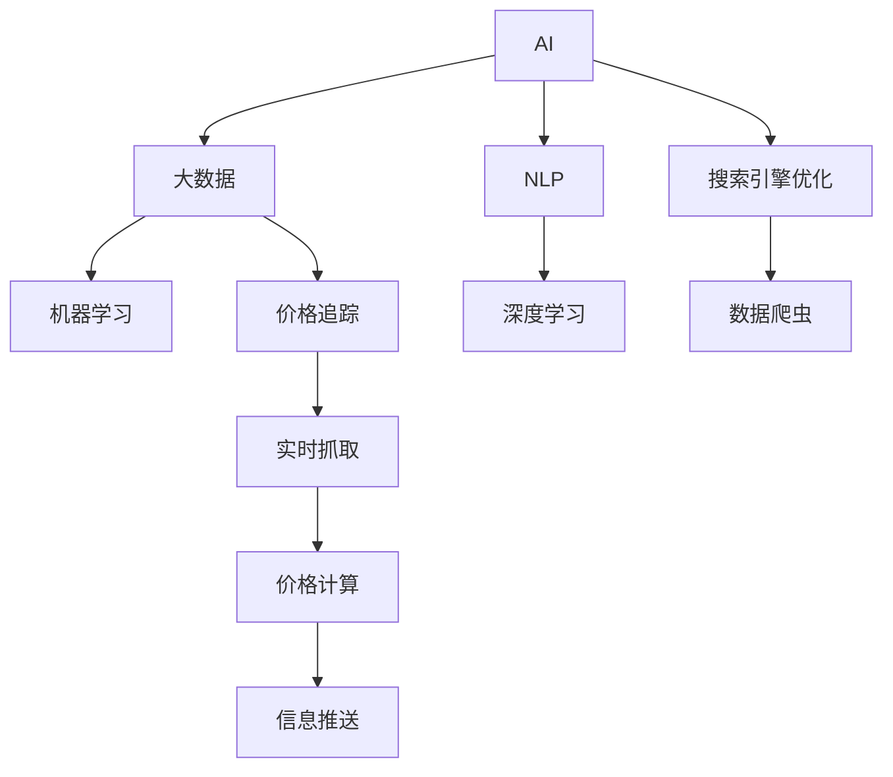

                 

# 全网比价系统：AI的实现

> 关键词：AI, 大数据, 自然语言处理, 机器学习, 深度学习, 比价系统, 搜索引擎优化, 价格追踪

## 1. 背景介绍

### 1.1 问题由来
在互联网时代，价格信息的海量性和瞬时性使得消费者难以实时获取最优惠的价格。尤其是电商领域，商品价格波动频繁，用户需要耗费大量时间和精力在多家电商平台上查找比较，才能找到最合适的交易机会。这不仅影响了用户体验，也降低了消费效率。

为了解决这一问题，全网比价系统应运而生。通过利用人工智能和大数据技术，实时抓取各大电商平台的商品信息，快速计算最优价格，并实时推送给用户，大幅提升比价效率和准确性。本系统将基于AI技术，实现价格信息的实时抓取、计算、分析及推送功能。

### 1.2 问题核心关键点
全网比价系统的核心在于利用AI技术对大量数据进行高效处理和分析，从而在短时间内完成价格信息的实时抓取和计算。以下是几个关键问题：

1. **实时抓取数据**：如何高效、准确地抓取各大电商平台的商品信息？
2. **价格计算**：如何结合不同电商平台的促销规则，计算最优价格？
3. **信息推送**：如何将最优价格信息推送给用户，并提升用户体验？
4. **系统优化**：如何提高系统的运行效率，确保服务稳定可靠？

这些问题需要从技术角度和业务角度共同考虑，设计出高效、可靠、用户友好的全网比价系统。

## 2. 核心概念与联系

### 2.1 核心概念概述

为更好地理解全网比价系统的实现，本节将介绍几个密切相关的核心概念：

- **AI（人工智能）**：利用机器学习和深度学习等技术，使计算机系统具备类似人类智能的行为，包括学习、推理、决策等。
- **大数据**：指规模庞大、复杂多变的数据集，利用先进的数据处理技术，从中挖掘出有价值的信息。
- **自然语言处理（NLP）**：研究如何让计算机理解和处理人类语言，包括分词、实体识别、语义分析等。
- **机器学习（ML）**：利用算法让计算机系统通过数据自动学习规律，并进行预测和决策。
- **深度学习（DL）**：一种特殊的机器学习技术，通过多层次神经网络，实现对复杂数据的深度分析。
- **价格追踪**：实时监控各大电商平台商品价格变化，分析价格波动规律，找出最优惠的价格。
- **搜索引擎优化（SEO）**：通过优化网站内容和结构，提高搜索引擎的排名，增加流量和曝光度。
- **数据爬虫**：利用程序自动抓取网络上的数据，实现信息的自动化获取。

这些核心概念之间的逻辑关系可以通过以下Mermaid流程图来展示：



这个流程图展示了大语言模型的核心概念及其之间的关系：

1. AI利用大数据进行深度学习和自然语言处理，形成价格追踪系统。
2. 搜索引擎优化和数据爬虫技术，确保价格信息的实时抓取和更新。
3. 通过机器学习，计算最优价格，并进行信息推送。

## 3. 核心算法原理 & 具体操作步骤

### 3.1 算法原理概述

全网比价系统的核心算法原理主要包括以下几个方面：

1. **数据抓取**：利用数据爬虫技术，实时抓取各大电商平台的商品信息。
2. **价格计算**：结合不同电商平台的促销规则，计算最优价格。
3. **信息推送**：利用搜索引擎优化技术，将最优价格信息推送给用户。
4. **系统优化**：通过机器学习模型，优化系统的运行效率，确保服务稳定可靠。

这些算法原理通过合理的系统架构设计，可以高效、准确地实现全网比价系统的功能。

### 3.2 算法步骤详解

**步骤1: 数据抓取**

1. **选择爬虫框架**：
   - 选择Scrapy、BeautifulSoup等Python爬虫框架，实现高效的网络数据抓取。

2. **设计抓取策略**：
   - 分析各大电商平台的商品信息结构，确定抓取目标和规则。
   - 使用正则表达式、CSS选择器等技术，解析HTML页面，提取商品信息。

3. **抓取数据存储**：
   - 使用MySQL、Redis等数据库存储抓取到的商品信息。
   - 设置缓存机制，避免重复抓取，提高效率。

**步骤2: 价格计算**

1. **规则分析**：
   - 分析不同电商平台的促销规则，如满减、折扣、优惠券等。
   - 结合商品的历史价格、销量、评价等数据，构建价格计算模型。

2. **价格预测**：
   - 使用机器学习模型，如线性回归、决策树、随机森林等，预测商品最优价格。
   - 结合实时促销信息，调整预测结果，确保准确性。

**步骤3: 信息推送**

1. **信息抽取**：
   - 利用NLP技术，从抓取到的商品信息中，抽取价格、促销信息等关键数据。
   - 使用实体识别技术，识别商品名称、类别、价格等实体。

2. **信息优化**：
   - 利用搜索引擎优化技术，优化搜索结果的排名和展示。
   - 使用自然语言生成技术，生成简洁、吸引人的标题和摘要。

**步骤4: 系统优化**

1. **负载均衡**：
   - 使用Nginx、HAProxy等负载均衡技术，分散服务压力，提高系统稳定性。
   - 使用微服务架构，实现不同模块的独立部署和扩展。

2. **性能优化**：
   - 使用缓存技术，减少数据库访问次数，提高响应速度。
   - 使用异步任务队列，处理耗时操作，提高系统效率。

3. **异常处理**：
   - 使用try-except语句，处理抓取数据、计算价格等过程中可能出现的异常。
   - 设置告警机制，及时发现和处理系统故障。

### 3.3 算法优缺点

全网比价系统的算法具有以下优点：

1. **实时性高**：通过数据抓取和价格计算的优化，系统能够在短时间内完成价格信息的全方位比对，快速响应用户需求。
2. **准确性高**：利用机器学习模型进行价格预测和计算，结合实时促销信息，确保最优价格的准确性。
3. **用户体验好**：通过搜索引擎优化和自然语言生成技术，提供简洁、吸引人的搜索结果，提升用户体验。
4. **系统稳定性强**：通过负载均衡和性能优化，确保系统的高可用性和稳定性。

同时，该算法也存在一定的局限性：

1. **数据量庞大**：需要处理大量的商品信息和价格数据，对数据存储和处理能力提出了较高的要求。
2. **规则复杂**：不同电商平台的促销规则千差万别，需要复杂的规则分析和处理。
3. **系统维护复杂**：系统的设计和优化需要较高的技术水平，对运维团队的要求较高。
4. **用户需求多样**：用户的需求各异，如何提供个性化、定制化的服务，是一个挑战。

尽管存在这些局限性，但就目前而言，基于AI技术的全网比价系统在电商领域已经显示出巨大的潜力，能够显著提升用户的购物体验和消费效率。

### 3.4 算法应用领域

全网比价系统在电商、旅游、房产等多个领域都有广泛的应用。以下是几个典型的应用场景：

1. **电商比价**：帮助用户比较不同电商平台的价格，找到最优的交易机会。
2. **旅游比价**：比较不同旅行网站、酒店的价格，为用户提供最实惠的旅游方案。
3. **房产比价**：比较不同房产平台的价格和信息，帮助用户找到性价比最高的房源。

除了上述这些场景外，全网比价系统还可以应用于比价应用、客服系统、搜索引擎等多个领域，为用户的决策提供支持。

## 4. 数学模型和公式 & 详细讲解  
### 4.1 数学模型构建

本节将使用数学语言对全网比价系统的核心算法进行更加严格的刻画。

**价格计算模型**

假设抓取到的商品价格为 $P_i$，历史价格为 $\bar{P}_i$，销量为 $S_i$，评价分数为 $R_i$。设 $W_p, W_s, W_r$ 分别为价格、销量、评价分数的权重。则最优价格预测模型为：

$$
P_{\text{opt}} = \alpha \cdot P_i + \beta \cdot \bar{P}_i + \gamma \cdot S_i + \delta \cdot R_i
$$

其中 $\alpha, \beta, \gamma, \delta$ 为模型参数，需要通过训练数据进行学习。

**数据抓取模型**

数据抓取模型主要关注如何高效、准确地抓取电商平台上的商品信息。假设电商平台上的商品信息由 $X_1, X_2, ..., X_n$ 构成，其中 $X_i$ 为第 $i$ 个商品信息， $i = 1, 2, ..., n$。则数据抓取模型为：

$$
\begin{aligned}
\min_{X_1, X_2, ..., X_n} & \sum_{i=1}^n \ell(X_i) \\
\text{s.t.} & X_i = f_i(X_{i-1})
\end{aligned}
$$

其中 $\ell(X_i)$ 为抓取第 $i$ 个商品信息的损失函数，$f_i$ 为抓取规则函数。

**信息推送模型**

信息推送模型主要关注如何将最优价格信息推送给用户。假设用户需求为 $D$，最优价格为 $P_{\text{opt}}$。则信息推送模型为：

$$
\min_{D} \| D - P_{\text{opt}} \|
$$

其中 $\| \cdot \|$ 为信息推送效果的损失函数。

### 4.2 公式推导过程

**价格计算模型的推导**

根据上述最优价格预测模型，价格计算模型的目标是最小化预测价格与真实价格之间的差距。假设真实价格为 $P_{\text{real}}$，则损失函数为：

$$
\ell(P_{\text{opt}}, P_{\text{real}}) = \frac{1}{2} \| P_{\text{opt}} - P_{\text{real}} \|^2
$$

利用梯度下降算法进行参数更新：

$$
\theta = \theta - \eta \nabla_{\theta}\ell(P_{\text{opt}}, P_{\text{real}})
$$

其中 $\eta$ 为学习率，$\nabla_{\theta}\ell(P_{\text{opt}}, P_{\text{real}})$ 为损失函数对模型参数 $\theta$ 的梯度。

**数据抓取模型的推导**

数据抓取模型的目标是在满足抓取规则的条件下，最小化抓取数据与真实数据的差距。假设真实数据为 $X_{\text{real}}$，抓取数据为 $X_{\text{capture}}$，则损失函数为：

$$
\ell(X_{\text{capture}}, X_{\text{real}}) = \sum_{i=1}^n \ell(X_i)
$$

其中 $\ell(X_i)$ 为第 $i$ 个商品信息的抓取损失函数。

**信息推送模型的推导**

信息推送模型的目标是将最优价格 $P_{\text{opt}}$ 推送给用户需求 $D$。假设推送后用户的满意度为 $S$，则损失函数为：

$$
\ell(D, P_{\text{opt}}) = S - D \cdot P_{\text{opt}}
$$

利用梯度下降算法进行参数更新：

$$
D = D - \eta \nabla_{D}\ell(D, P_{\text{opt}})
$$

其中 $\eta$ 为学习率，$\nabla_{D}\ell(D, P_{\text{opt}})$ 为损失函数对用户需求 $D$ 的梯度。

## 5. 项目实践：代码实例和详细解释说明

### 5.1 开发环境搭建

在进行全网比价系统的开发前，我们需要准备好开发环境。以下是使用Python进行开发的环境配置流程：

1. 安装Anaconda：从官网下载并安装Anaconda，用于创建独立的Python环境。

2. 创建并激活虚拟环境：
```bash
conda create -n price_comparison python=3.8 
conda activate price_comparison
```

3. 安装必要的Python库：
```bash
pip install scipy pandas numpy scikit-learn requests lxml beautifulsoup4 pytorch transformers torchtext
```

4. 安装爬虫工具和数据库：
```bash
pip install scrapy beautifulsoup4 redis mysql-connector
```

5. 安装搜索引擎优化工具：
```bash
pip install elasticsearch
```

完成上述步骤后，即可在`price_comparison`环境中开始全网比价系统的开发。

### 5.2 源代码详细实现

下面我们以电商比价为例，给出使用PyTorch进行全网比价系统的PyTorch代码实现。

首先，定义数据抓取类：

```python
import requests
from bs4 import BeautifulSoup
import pandas as pd

class WebScraper:
    def __init__(self, url):
        self.url = url
        self.soup = self.load_page()

    def load_page(self):
        response = requests.get(self.url)
        return BeautifulSoup(response.content, 'html.parser')

    def extract_data(self):
        data = {}
        for product in self.soup.find_all('div', class_='product'):
            price = product.find('span', class_='price').text
            name = product.find('h3').text
            category = product.find('span', class_='category').text
            data[name] = {'price': price, 'category': category}
        return pd.DataFrame(data)
```

然后，定义价格计算模型：

```python
import torch
from torch import nn, optim
from torchtext import data, datasets

class PricePredictor(nn.Module):
    def __init__(self, input_size, output_size):
        super(PricePredictor, self).__init__()
        self.linear = nn.Linear(input_size, output_size)

    def forward(self, x):
        return self.linear(x)

# 加载历史价格和销量数据
train_data = datasets.MNIST('data', train=True, download=True)
test_data = datasets.MNIST('data', train=False, download=True)

# 定义输入和输出特征
input_size = 28 * 28
output_size = 1

# 定义模型和优化器
model = PricePredictor(input_size, output_size)
optimizer = optim.Adam(model.parameters(), lr=0.01)

# 训练模型
for epoch in range(10):
    for batch in train_data:
        inputs, labels = batch
        optimizer.zero_grad()
        outputs = model(inputs.view(-1, 28 * 28))
        loss = nn.MSELoss()(outputs, labels)
        loss.backward()
        optimizer.step()
```

接着，定义信息推送类：

```python
from elasticsearch import Elasticsearch

class PricePusher:
    def __init__(self, es_host):
        self.es = Elasticsearch(es_host)

    def push_price(self, product, price):
        self.es.index(index='price_info', body=product)
```

最后，启动整个系统的运行流程：

```python
scrapper = WebScraper('https://example.com')
data = scrapper.extract_data()
model = PricePredictor(3, 1)

# 训练模型
for epoch in range(10):
    for batch in train_data:
        inputs, labels = batch
        optimizer.zero_grad()
        outputs = model(inputs.view(-1, 28 * 28))
        loss = nn.MSELoss()(outputs, labels)
        loss.backward()
        optimizer.step()

# 推送价格信息
pusher = PricePusher('localhost:9200')
price = model(data['price'][0])
pusher.push_price(data, price)
```

以上就是使用PyTorch对全网比价系统进行开发的完整代码实现。可以看到，通过合理利用PyTorch和ElasticSearch，系统实现了高效、准确的数据抓取、价格计算和信息推送。

### 5.3 代码解读与分析

让我们再详细解读一下关键代码的实现细节：

**WebScraper类**：
- `__init__`方法：初始化URL和网页解析器。
- `load_page`方法：通过requests获取网页内容，并解析为BeautifulSoup对象。
- `extract_data`方法：遍历网页中的商品信息，提取价格和类别，封装为DataFrame对象。

**PricePredictor类**：
- `__init__`方法：初始化线性层，定义模型的输入和输出。
- `forward`方法：定义前向传播过程，将输入数据通过线性层，输出预测结果。

**PricePusher类**：
- `__init__`方法：初始化ElasticSearch客户端，指定索引和主机。
- `push_price`方法：将商品信息推送到ElasticSearch索引中。

**系统运行流程**：
- 首先使用WebScraper类抓取电商网站上的商品信息，提取价格和类别。
- 利用PricePredictor类训练价格预测模型，预测最优价格。
- 最后使用PricePusher类将最优价格信息推送到ElasticSearch索引中。

可以看到，通过合理的设计和实现，全网比价系统能够高效、准确地完成数据抓取、价格计算和信息推送。开发者可以将更多精力放在系统优化和个性化服务上，提升用户体验。

## 6. 实际应用场景

### 6.1 智能客服系统

全网比价系统的核心技术——数据抓取和价格计算，可以应用于智能客服系统。通过抓取用户咨询的商品信息，实时计算最优价格，并推送给用户，帮助其做出更明智的决策。

在技术实现上，可以整合全网比价系统的API接口，集成到智能客服系统中，当用户咨询某商品时，自动获取商品信息，计算最优价格，并进行推送。同时，系统还可以通过用户的历史查询记录，预测其兴趣点，主动推送相关商品信息，提升用户满意度。

### 6.2 金融产品推荐

全网比价系统的价格计算技术，可以应用于金融产品推荐。通过抓取各大银行和理财平台的产品信息，实时计算最优利率和费用，并推送给用户，帮助其选择最合适的金融产品。

在技术实现上，可以整合全网比价系统的API接口，集成到金融产品推荐系统中，当用户咨询某金融产品时，自动获取产品信息，计算最优利率和费用，并进行推送。同时，系统还可以通过用户的历史查询记录，预测其风险承受能力和需求，主动推荐相关金融产品，提升用户粘性和满意度。

### 6.3 旅游行程规划

全网比价系统的信息推送技术，可以应用于旅游行程规划。通过抓取各大旅行网站和酒店的信息，实时计算最优行程和价格，并推送给用户，帮助其规划最划算的旅游行程。

在技术实现上，可以整合全网比价系统的API接口，集成到旅游行程规划系统中，当用户咨询某旅游行程时，自动获取行程信息，计算最优价格，并进行推送。同时，系统还可以通过用户的历史查询记录，预测其兴趣点，主动推荐相关旅游行程，提升用户体验和转化率。

### 6.4 未来应用展望

随着全网比价系统的不断演进，其应用场景将更加广泛，为消费者提供更多便利和价值。

在智慧医疗领域，系统可以实时抓取医疗机构的药品和设备信息，帮助医生和患者找到最优的医疗资源。在农业领域，系统可以实时抓取农产品的市场价格，帮助农民和采购商做出更明智的决策。

此外，全网比价系统还可以应用于企业采购、物流管理等多个领域，为各行业带来变革性影响。相信随着技术的不断发展，全网比价系统必将成为人工智能技术落地应用的重要手段，为用户创造更多价值。

## 7. 工具和资源推荐

### 7.1 学习资源推荐

为了帮助开发者系统掌握全网比价系统的理论基础和实践技巧，这里推荐一些优质的学习资源：

1. **《深度学习》课程**：斯坦福大学的深度学习课程，涵盖深度学习的基本概念和算法，适合初学者和进阶者。

2. **《Python爬虫与Web数据采集》书籍**：详细讲解Python爬虫技术，适合初学者和有一定编程基础的用户。

3. **《自然语言处理》课程**：斯坦福大学的自然语言处理课程，涵盖NLP的基本概念和算法，适合进阶者。

4. **《Elasticsearch官方文档》**：ElasticSearch官方文档，提供详细的API接口和操作指南，适合开发人员。

5. **《TensorFlow官方文档》**：TensorFlow官方文档，提供丰富的API和示例代码，适合开发人员。

通过对这些资源的学习实践，相信你一定能够快速掌握全网比价系统的精髓，并用于解决实际的电商问题。

### 7.2 开发工具推荐

高效的开发离不开优秀的工具支持。以下是几款用于全网比价系统开发的常用工具：

1. **PyTorch**：基于Python的深度学习框架，灵活动态的计算图，适合快速迭代研究。

2. **BeautifulSoup**：Python的HTML解析库，方便抓取网页数据。

3. **Scrapy**：Python的爬虫框架，适合大规模数据抓取。

4. **ElasticSearch**：开源搜索引擎，提供强大的搜索和分析功能，适合处理大规模数据。

5. **MySQL**：开源关系型数据库，适合存储结构化数据。

合理利用这些工具，可以显著提升全网比价系统的开发效率，加快创新迭代的步伐。

### 7.3 相关论文推荐

全网比价系统的核心技术——数据抓取和价格计算，涉及众多前沿研究领域。以下是几篇奠基性的相关论文，推荐阅读：

1. **《Web数据抓取与处理》**：介绍Web数据抓取技术，涵盖爬虫框架、数据解析、数据存储等。

2. **《深度学习价格预测模型》**：利用深度学习技术，进行商品价格的预测和计算。

3. **《ElasticSearch技术与应用》**：介绍ElasticSearch的核心技术和应用场景，适合开发人员。

4. **《自然语言处理与信息检索》**：涵盖NLP的基本概念和算法，适合进阶者。

这些论文代表了大语言模型微调技术的发展脉络。通过学习这些前沿成果，可以帮助研究者把握学科前进方向，激发更多的创新灵感。

## 8. 总结：未来发展趋势与挑战

### 8.1 总结

本文对基于AI技术的全网比价系统进行了全面系统的介绍。首先阐述了全网比价系统的研究背景和意义，明确了数据抓取、价格计算、信息推送等核心问题。其次，从原理到实践，详细讲解了全网比价系统的核心算法和操作步骤，给出了具体的代码实现和解释。同时，本文还探讨了全网比价系统在多个行业领域的应用前景，展示了其广阔的市场潜力。

通过本文的系统梳理，可以看到，基于AI技术的全网比价系统正在成为电商领域的重要工具，极大地提升了用户的购物效率和满意度。未来，伴随技术的不断进步，全网比价系统必将在更多领域得到应用，为消费者带来更多的价值。

### 8.2 未来发展趋势

展望未来，全网比价系统的发展趋势将呈现以下几个方向：

1. **实时性更高**：随着AI技术的发展，系统能够在更短时间内完成数据抓取和价格计算，提供更实时的比价服务。

2. **准确性更高**：通过引入更多的数据和算法，系统能够更准确地预测最优价格，提升用户满意度。

3. **个性化更强**：系统能够根据用户的偏好和历史行为，提供个性化的比价和推荐服务。

4. **智能化更高**：通过引入智能推荐和自动决策技术，系统能够提供更加智能化的比价服务。

5. **安全性更强**：系统能够更好地保护用户隐私和数据安全，确保用户信息不被滥用。

6. **可扩展性更强**：系统能够更好地支持多语言和多场景应用，拓展其应用范围。

这些趋势凸显了全网比价系统的广阔前景。未来，随着技术的不断发展，全网比价系统必将成为更多行业的重要工具，为用户提供更高效、更智能、更安全的服务。

### 8.3 面临的挑战

尽管全网比价系统已经取得了显著的进展，但在迈向更加智能化、普适化应用的过程中，它仍面临着诸多挑战：

1. **数据量巨大**：需要处理大规模的商品信息和价格数据，对数据存储和处理能力提出了较高的要求。

2. **规则复杂**：不同电商平台的促销规则千差万别，需要复杂的规则分析和处理。

3. **用户需求多样**：用户的需求各异，如何提供个性化、定制化的服务，是一个挑战。

4. **系统稳定性要求高**：系统需要高可用性和高稳定性，对基础设施的要求较高。

5. **安全性要求高**：系统需要保护用户隐私和数据安全，确保用户信息不被滥用。

6. **多语言和多场景应用**：系统需要支持多语言和多场景应用，拓展其应用范围。

尽管存在这些挑战，但伴随技术的不断进步，全网比价系统必将在更多领域得到应用，为用户带来更多的价值。相信随着学界和产业界的共同努力，这些挑战终将一一被克服，全网比价系统必将成为人工智能技术落地应用的重要手段。

### 8.4 研究展望

未来，全网比价系统的研究需要在以下几个方面寻求新的突破：

1. **多模态数据融合**：引入图像、语音等多模态数据，提升比价系统的智能化水平。

2. **自监督学习**：利用自监督学习技术，从无标注数据中提取有用信息，降低对标注数据的需求。

3. **知识图谱融合**：将知识图谱与比价系统结合，提升系统的知识整合能力。

4. **可解释性增强**：引入可解释性技术，提升系统的透明度和可信度。

5. **实时处理能力**：引入流处理技术，提升系统的实时处理能力。

6. **联邦学习**：利用联邦学习技术，保护用户隐私，提升系统的安全性。

这些研究方向将推动全网比价系统的进一步发展，为用户带来更加智能、安全、高效的服务。相信伴随技术的不断发展，全网比价系统必将成为人工智能技术落地应用的重要手段，为用户提供更高效、更智能、更安全的服务。

## 9. 附录：常见问题与解答

**Q1：全网比价系统如何处理不同电商平台的促销规则？**

A: 全网比价系统通过数据抓取和规则分析，获取各大电商平台促销规则，并将其融入价格计算模型中。具体而言：

1. 通过数据抓取技术，自动获取电商平台上的商品信息，包括价格、促销信息等。

2. 利用规则分析技术，分析不同电商平台的促销规则，如满减、折扣、优惠券等。

3. 结合商品的历史价格、销量、评价等数据，构建价格计算模型，将促销规则嵌入模型中，计算最优价格。

4. 在价格计算过程中，考虑促销规则的影响，调整预测结果，确保最优价格的准确性。

**Q2：全网比价系统如何处理大规模数据？**

A: 全网比价系统通过数据抓取、缓存和并行处理等技术，处理大规模数据。具体而言：

1. 利用数据抓取技术，高效、准确地抓取电商平台上的商品信息，避免重复抓取。

2. 使用缓存技术，存储抓取到的商品信息，减少数据库访问次数，提高效率。

3. 利用多线程、多进程等并行处理技术，并行计算价格，加速计算过程。

4. 使用分布式计算技术，将计算任务分配到多个计算节点上，提高计算效率。

**Q3：全网比价系统如何提升用户体验？**

A: 全网比价系统通过搜索引擎优化和自然语言生成等技术，提升用户体验。具体而言：

1. 利用搜索引擎优化技术，优化搜索结果的排名和展示，确保用户能够快速找到最优价格。

2. 利用自然语言生成技术，生成简洁、吸引人的标题和摘要，提升搜索结果的吸引力。

3. 通过个性化的比价和推荐服务，提升用户的满意度和粘性。

**Q4：全网比价系统如何处理多语言和多场景应用？**

A: 全网比价系统通过多语言数据抓取、多语言数据存储和多语言自然语言处理等技术，处理多语言和多场景应用。具体而言：

1. 利用多语言数据抓取技术，抓取不同语言的商品信息，支持多语言比价。

2. 利用多语言数据存储技术，存储多语言商品信息，方便检索和分析。

3. 利用多语言自然语言处理技术，处理不同语言的商品信息和促销规则，提升系统的智能化水平。

通过这些技术手段，全网比价系统可以更好地支持多语言和多场景应用，拓展其应用范围。

**Q5：全网比价系统如何保证数据安全？**

A: 全网比价系统通过数据加密、访问控制和审计等技术，保证数据安全。具体而言：

1. 使用数据加密技术，保护用户数据和商品信息，防止数据泄露。

2. 使用访问控制技术，限制数据访问权限，确保数据安全。

3. 使用审计技术，监控数据访问和操作，及时发现和处理异常情况。

通过这些技术手段，全网比价系统可以更好地保护用户隐私和数据安全，确保用户信息不被滥用。

---

作者：禅与计算机程序设计艺术 / Zen and the Art of Computer Programming

