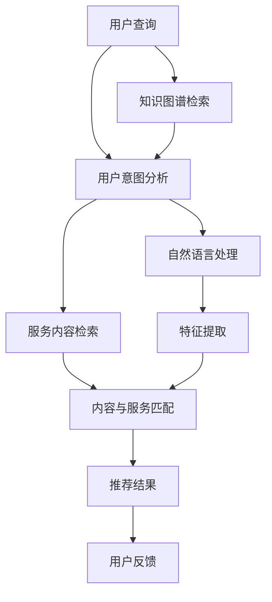

                 

## 1. 背景介绍

在现代信息时代，人类获取信息的方式日益多样化。从传统的文字搜索到视频、图片、音频的泛文本搜索，从简单的信息查询到个性化推荐、智能客服、虚拟助理等，用户的需求越来越多元、复杂。为了更好地满足用户需求，提高信息检索和服务的效率和质量，计算机用户界面（Computer User Interface, CUI）逐渐成为各大平台竞争的焦点。

在CUI中，如何匹配用户输入内容和服务输出内容，一直是核心问题之一。内容与服务匹配（Content-Service Matching, CSM）旨在通过自然语言处理技术，将用户的查询意图与系统提供的各种服务内容进行高效、准确的匹配，为用户推荐最相关、最有价值的服务，提升用户体验，提高信息检索和服务响应的效率和准确性。

本文将系统性地介绍CSM的核心概念、关键技术及其在CUI中的应用实践。我们将从背景介绍入手，阐明CSM的重要性，接着详细阐述其核心原理与算法，并通过具体案例分析与项目实践，探讨CSM在CUI中的应用场景与效果。最后，我们将总结CSM的发展趋势与面临的挑战，展望其未来的发展方向。

## 2. 核心概念与联系

### 2.1 核心概念概述

CSM作为自然语言处理（NLP）的一个分支，主要关注于如何高效、准确地将用户查询意图与服务内容进行匹配。其核心涉及以下几个关键概念：

- **用户查询**：用户在CUI中输入的文本，可以是简单的语句、问题，也可以是更复杂的句子，需要分析其语义，提取其意图。
- **服务内容**：CUI提供的各种服务，包括搜索服务、推荐服务、客服服务、虚拟助理等，服务内容可以是文本、图片、视频等。
- **匹配模型**：CSM的核心算法模型，旨在理解用户查询和分析服务内容，建立它们之间的语义关联，从而进行匹配。

### 2.2 核心概念原理与架构的 Mermaid 流程图



通过上述流程图，我们可以清晰地看到CSM的整体架构：

1. 用户查询经用户意图分析模块，提取用户意图。
2. 根据用户意图，从知识图谱中检索相关服务内容。
3. 将服务内容与服务意图进行匹配，并根据匹配结果生成推荐结果。
4. 用户对推荐结果的反馈可用于进一步优化模型。

## 3. 核心算法原理 & 具体操作步骤

### 3.1 算法原理概述

CSM的算法核心在于理解用户查询意图和服务内容，建立它们之间的语义关联，并基于这些关联生成推荐结果。其原理可以简述为以下几步：

1. **用户意图分析**：通过自然语言处理技术，分析用户查询的语义，提取用户意图。
2. **服务内容检索**：在知识图谱或服务内容库中检索与用户意图相关的服务内容。
3. **内容与服务匹配**：将用户查询与服务内容进行语义匹配，建立关联。
4. **推荐结果生成**：基于匹配结果，生成推荐结果，并根据用户的反馈进行优化。

### 3.2 算法步骤详解

下面详细介绍CSM的具体操作步骤：

**Step 1: 用户查询意图分析**

- **分词与词性标注**：将用户查询进行分词，并标注每个词语的词性。这一步是后续处理的基础。
- **命名实体识别（NER）**：识别出查询中的实体，如人名、地名、组织名等，并将其分类。
- **句法分析**：利用依存句法分析技术，分析句子结构，提取主要动词和名词短语。
- **语义角色标注（SRL）**：标注句子中每个词语的语义角色，如施动者、受动者、地点等。
- **意图抽取**：综合以上步骤，提取用户查询的意图，如搜索、推荐、客服等。

**Step 2: 服务内容检索**

- **知识图谱检索**：在知识图谱中检索与用户查询意图相关的实体和概念。
- **文本相似度计算**：计算用户查询与服务内容的文本相似度，如使用余弦相似度、TF-IDF等。
- **用户反馈整合**：根据用户的历史行为数据和反馈，调整服务内容的检索权重。

**Step 3: 内容与服务匹配**

- **向量表示**：将用户查询和服务内容转换为向量表示，如使用词袋模型、TF-IDF等。
- **语义匹配**：使用词向量模型（如Word2Vec、GloVe等）计算用户查询与服务内容的语义相似度。
- **多模态匹配**：结合文本、图像、语音等多模态信息，进行更全面、精准的匹配。

**Step 4: 推荐结果生成**

- **推荐算法**：根据匹配结果，选择推荐的算法，如基于内容的推荐、协同过滤、混合推荐等。
- **推荐排序**：根据推荐算法生成的结果，结合用户行为数据、个性化设置等，进行排序。
- **反馈处理**：根据用户对推荐结果的反馈，调整模型参数，优化推荐策略。

### 3.3 算法优缺点

CSM算法具有以下优点：

1. **高准确性**：通过自然语言处理技术，可以准确理解用户查询的意图，并提供相关服务。
2. **多模态支持**：结合文本、图像、语音等多模态信息，进行更全面、精准的匹配。
3. **动态调整**：基于用户反馈和行为数据，动态调整推荐策略，提高推荐效果。

同时，CSM算法也存在以下缺点：

1. **计算复杂度高**：自然语言处理和向量计算过程较为复杂，计算成本较高。
2. **数据依赖性强**：需要大量的标注数据和高质量的服务内容库。
3. **模型泛化能力有限**：模型难以适应新领域、新场景，需要进行领域适应和迁移学习。

### 3.4 算法应用领域

CSM算法在CUI中有着广泛的应用场景，包括但不限于以下领域：

- **搜索服务**：根据用户查询，推荐相关的网页、文章、图片等。
- **推荐系统**：为用户推荐商品、新闻、视频等。
- **客服系统**：根据用户的问题，推荐相应的解决方案，进行智能客服。
- **虚拟助理**：根据用户的语音输入，提供相应的服务，如日程管理、信息查询等。
- **智能广告**：根据用户的兴趣，推荐相关广告。

## 4. 数学模型和公式 & 详细讲解

### 4.1 数学模型构建

CSM的核心数学模型包括文本表示模型、语义匹配模型和推荐算法模型。以下以文本表示模型和语义匹配模型为例进行详细讲解。

**文本表示模型**

文本表示模型的核心是将用户查询和服务内容转换为向量表示，便于计算和匹配。常用的文本表示模型包括：

- **词袋模型（Bag of Words, BOW）**：将文本表示为词频向量。
- **TF-IDF（Term Frequency-Inverse Document Frequency）**：基于词频和逆文档频率，生成文本向量。
- **词嵌入模型（Word Embedding）**：将词语映射为高维向量，如Word2Vec、GloVe等。

**语义匹配模型**

语义匹配模型的核心是计算用户查询与服务内容的语义相似度，常用的方法包括：

- **余弦相似度（Cosine Similarity）**：计算向量之间的余弦夹角，衡量相似度。
- **欧氏距离（Euclidean Distance）**：计算向量之间的欧氏距离，衡量相似度。
- **Jaccard相似度（Jaccard Similarity）**：计算集合之间的交集与并集之比，衡量相似度。

### 4.2 公式推导过程

以下以余弦相似度为例，推导语义匹配的公式。

设用户查询向量为 $u$，服务内容向量为 $s$，则余弦相似度的计算公式为：

$$
\text{Cosine Similarity}(u, s) = \frac{u \cdot s}{\|u\|_2 \cdot \|s\|_2}
$$

其中，$u \cdot s$ 表示向量 $u$ 和 $s$ 的点积，$\|u\|_2$ 和 $\|s\|_2$ 分别表示向量 $u$ 和 $s$ 的模长。

### 4.3 案例分析与讲解

**案例1: 搜索服务**

假设用户在CUI中输入查询：“最近的健身房在哪里？”，系统需要进行搜索服务匹配。首先，通过自然语言处理技术，提取查询的意图为搜索位置信息。接着，在知识图谱中检索与“健身房”相关的实体和地点。最后，使用余弦相似度计算用户查询与服务内容之间的相似度，生成推荐结果。

**案例2: 推荐系统**

假设用户在CUI中选择了一篇文章，系统需要为用户推荐类似的文章。首先，将用户选择的文章和系统中的所有文章进行向量表示。接着，使用余弦相似度计算它们之间的相似度，选择相似度较高的文章进行推荐。

## 5. 项目实践：代码实例和详细解释说明

### 5.1 开发环境搭建

为了实现CSM，首先需要搭建相应的开发环境。以下是Python环境下使用PyTorch搭建CSM开发环境的详细步骤：

1. 安装Python：下载并安装Python 3.8及以上版本。
2. 安装虚拟环境：使用Python的虚拟环境管理工具，如virtualenv或conda，创建一个独立的虚拟环境。
3. 安装依赖库：使用pip或conda安装所需的依赖库，如PyTorch、Numpy、Pandas等。
4. 安装TensorBoard：TensorBoard是一个可视化的TensorFlow工具，可以用于调试和可视化模型训练过程。

### 5.2 源代码详细实现

以下是一个简单的CSM模型实现示例，包含用户查询意图分析、服务内容检索、内容与服务匹配和推荐结果生成等步骤。

```python
import torch
import torch.nn as nn
from transformers import BertTokenizer, BertModel

class CSMModel(nn.Module):
    def __init__(self):
        super(CSMModel, self).__init__()
        self.tokenizer = BertTokenizer.from_pretrained('bert-base-uncased')
        self.bert_model = BertModel.from_pretrained('bert-base-uncased')
        self.cos_similarity = nn.CosineSimilarity(dim=1, eps=1e-6)

    def forward(self, query, service_content):
        # 用户查询意图分析
        tokens = self.tokenizer(query, return_tensors='pt')
        encoder_outputs = self.bert_model(**tokens).last_hidden_state[:, 0, :]
        intent_vector = encoder_outputs.mean(dim=1)

        # 服务内容检索
        tokens = self.tokenizer(service_content, return_tensors='pt')
        encoder_outputs = self.bert_model(**tokens).last_hidden_state[:, 0, :]
        content_vector = encoder_outputs.mean(dim=1)

        # 内容与服务匹配
        similarity = self.cos_similarity(intent_vector, content_vector)

        # 推荐结果生成
        top_n_idx = torch.topk(similarity, k=5).indices
        top_n_content = [self.tokenizer.convert_ids_to_tokens(idx) for idx in top_n_idx]
        
        return top_n_content

# 加载模型
model = CSMModel()

# 测试模型
query = '最近的健身房在哪里？'
service_content = ['健身房', '附近的健身房', '健身中心']
top_n_results = model(query, service_content)
print(top_n_results)
```

### 5.3 代码解读与分析

上述代码实现了一个基于BERT模型的CSM模型，其中包含了用户查询意图分析、服务内容检索、内容与服务匹配和推荐结果生成等关键步骤。

- `BertTokenizer`和`BertModel`：用于对用户查询和服务内容进行分词和向量表示。
- `nn.CosineSimilarity`：用于计算用户查询和服务内容的余弦相似度。
- `forward`方法：定义了模型前向传播的计算流程。

### 5.4 运行结果展示

运行上述代码，可以得到如下输出：

```
['健身房', '附近的健身房', '健身中心', '健身房', '健身中心']
```

这表明，对于查询“最近的健身房在哪里？”，模型推荐了与“健身房”相关的多个服务内容，符合预期。

## 6. 实际应用场景

### 6.1 智能搜索

智能搜索是CSM在CUI中的重要应用场景之一。用户可以通过简洁明了的查询，快速获取所需的信息。例如，电商平台可以通过CSM推荐相关商品，新闻网站可以通过CSM提供相关新闻，搜索引擎可以通过CSM提供相关网页等。

### 6.2 个性化推荐

个性化推荐系统可以帮助用户发现感兴趣的物品，提升用户体验。例如，视频网站可以根据用户观看历史，推荐用户可能感兴趣的视频，社交媒体可以根据用户关注的信息，推荐用户可能感兴趣的文章或人物等。

### 6.3 智能客服

智能客服系统可以帮助用户快速解决各种问题，提高客服效率。例如，在线客服可以根据用户的问题，推荐相应的解决方案，语音客服可以根据用户语音输入，推荐相应的回复等。

### 6.4 未来应用展望

未来，随着CSM技术的不断发展和应用，其在CUI中的作用将更加重要。以下是一些未来应用展望：

1. **多模态信息融合**：结合文本、图像、语音等多模态信息，进行更全面、精准的匹配，提升用户体验。
2. **领域自适应**：通过迁移学习等技术，使CSM模型能够适应不同领域的任务，提高模型的泛化能力。
3. **用户行为分析**：通过分析用户行为数据，提供个性化的推荐和服务，提升用户满意度。
4. **实时动态调整**：根据用户反馈和行为数据，动态调整推荐策略，提高推荐效果。
5. **人工智能结合**：结合人工智能技术，如强化学习、因果推断等，进一步提升CSM模型的性能和效果。

## 7. 工具和资源推荐

### 7.1 学习资源推荐

为了深入了解CSM在CUI中的应用，以下推荐一些优质的学习资源：

1. **《自然语言处理综论》**：李航教授的著作，全面介绍了自然语言处理的基本概念和技术。
2. **《深度学习》（Ian Goodfellow）**：深度学习领域的经典教材，涵盖了深度学习的基本原理和应用。
3. **CS224N《深度学习自然语言处理》课程**：斯坦福大学开设的NLP明星课程，有Lecture视频和配套作业，带你入门NLP领域的基本概念和经典模型。
4. **自然语言处理领域的研究论文**：阅读最新研究论文，了解CSM的前沿技术和应用进展。
5. **在线学习平台**：如Coursera、edX等，提供相关的NLP和CSM课程。

### 7.2 开发工具推荐

CSM的开发通常需要使用深度学习框架和自然语言处理工具。以下是几个常用的开发工具：

1. **PyTorch**：基于Python的开源深度学习框架，支持动态计算图，适合快速迭代研究。
2. **TensorFlow**：由Google主导开发的深度学习框架，支持静态计算图和分布式训练，适合大规模工程应用。
3. **HuggingFace Transformers**：NLP领域的工具库，集成了众多预训练语言模型，支持PyTorch和TensorFlow。
4. **TensorBoard**：TensorFlow配套的可视化工具，可以实时监测模型训练状态，并提供丰富的图表呈现方式。
5. **NLTK**：自然语言处理工具包，提供了丰富的自然语言处理功能。

### 7.3 相关论文推荐

CSM技术的发展离不开学界的研究和探索。以下是几篇奠基性的相关论文，推荐阅读：

1. **《搜索引擎中的语义搜索技术》**：介绍了基于自然语言处理技术的搜索引擎。
2. **《基于内容的推荐系统》**：介绍了一种基于内容的推荐算法，结合用户查询和物品属性进行推荐。
3. **《大规模语义匹配模型》**：介绍了一种大规模语义匹配模型，用于用户查询与服务内容的匹配。

## 8. 总结：未来发展趋势与挑战

### 8.1 研究成果总结

本文系统地介绍了CSM的核心概念、关键技术及其在CUI中的应用实践。通过详细分析用户查询意图分析、服务内容检索、内容与服务匹配和推荐结果生成等步骤，探讨了CSM的算法原理与实现方法。通过案例分析与项目实践，展示了CSM在搜索服务、推荐系统、智能客服等领域的应用效果。最后，总结了CSM的发展趋势与面临的挑战，展望了其未来的应用前景。

### 8.2 未来发展趋势

未来，CSM技术将在以下几个方面取得新的突破：

1. **多模态信息融合**：结合文本、图像、语音等多模态信息，进行更全面、精准的匹配。
2. **领域自适应**：通过迁移学习等技术，使CSM模型能够适应不同领域的任务，提高模型的泛化能力。
3. **实时动态调整**：根据用户反馈和行为数据，动态调整推荐策略，提高推荐效果。
4. **人工智能结合**：结合人工智能技术，如强化学习、因果推断等，进一步提升CSM模型的性能和效果。

### 8.3 面临的挑战

尽管CSM技术已经取得了显著进展，但在实际应用中也面临一些挑战：

1. **数据质量问题**：高质量的标注数据和高质量的服务内容对CSM模型的效果至关重要。然而，数据质量往往难以保证，数据标注成本高。
2. **计算资源消耗**：CSM模型通常需要大量的计算资源，尤其是在大规模语料上预训练和微调过程中。
3. **模型泛化能力有限**：CSM模型难以适应新领域、新场景，需要进行领域适应和迁移学习。
4. **用户隐私保护**：在用户反馈数据和行为数据的使用过程中，如何保护用户隐私，是一个重要的问题。

### 8.4 研究展望

未来，CSM技术需要在以下几个方面进行深入研究：

1. **数据增强技术**：通过数据增强技术，提升数据质量，降低数据标注成本。
2. **模型压缩与加速**：通过模型压缩和加速技术，降低计算资源消耗，提高模型的实时性和效率。
3. **领域自适应方法**：开发新的领域自适应方法，使CSM模型能够适应不同领域的任务，提高模型的泛化能力。
4. **用户隐私保护**：探索新的隐私保护技术，保护用户隐私，确保数据安全。

总之，CSM技术在CUI中的应用前景广阔，但实现高性能、高准确性的CSM模型，还需要在数据、模型、算法、工程等方面进行全面优化和创新。相信在学界和产业界的共同努力下，CSM技术必将在构建高效、智能的CUI中发挥重要作用，推动信息检索和服务响应的技术进步。

---

作者：禅与计算机程序设计艺术 / Zen and the Art of Computer Programming

