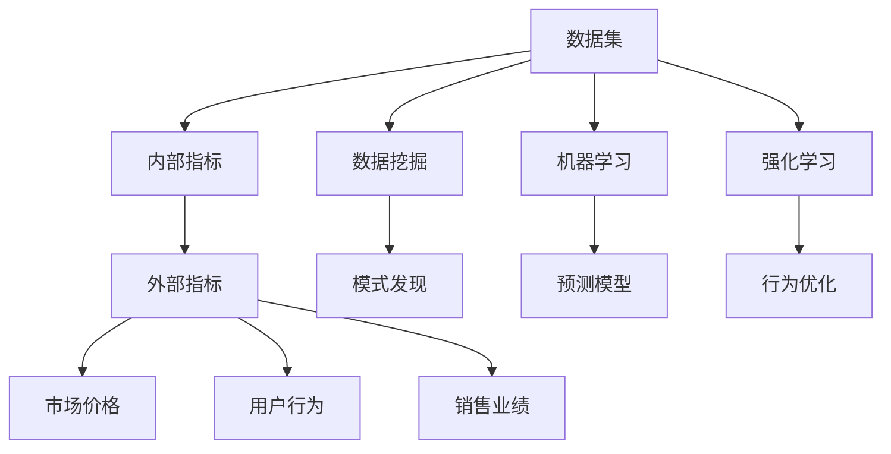

                 

## 1. 背景介绍

在信息时代，数据的重要性日益凸显。人们通过各种设备和渠道，不断生成、传输和存储海量数据，而如何从中提取有价值的信息，成为了数据科学和技术界面临的重大挑战。数据挖掘、机器学习和大数据分析技术的迅猛发展，使得这一挑战逐渐有了更多解决途径。

在大数据分析领域，尤其是数据挖掘和机器学习领域，内部指标和外部指标的概念被频繁提及。内部指标一般指数据本身具有的内在属性和特征，如数据的分布、频率、相关系数等；而外部指标通常指的是基于数据的外部属性或与现实世界相关联的指标，如市场价格、用户行为、销售业绩等。这两类指标之间的相互作用和影响，在多个层面上塑造了数据挖掘和机器学习的实践路径。

本文将详细探讨内部指标变化如何引起外部指标的变化，并分析这种变化在数据科学和机器学习中的应用和意义。

## 2. 核心概念与联系

### 2.1 核心概念概述

为了更好地理解内部指标变化对外部指标的影响，我们首先需要清晰界定以下几个核心概念：

- **内部指标(Internal Indicators)**：指数据集内在的属性和特征，如数据的分布、频率、相关系数等。这些指标反映了数据的本质属性，是数据本身固有的。
- **外部指标(External Indicators)**：指与数据集外部属性相关的指标，如市场价格、用户行为、销售业绩等。这些指标反映了数据与现实世界的关联性。
- **数据挖掘(Data Mining)**：指从大量数据中提取出有用信息和知识的过程。数据挖掘的目标是通过分析数据内部指标和外部指标之间的关系，寻找模式和规律。
- **机器学习(Machine Learning)**：指让计算机通过学习数据内部指标和外部指标之间的关系，预测未来趋势和行为的过程。机器学习依赖于数据和模型的结合，需要通过数据内部指标的特征来训练模型。
- **强化学习(Reinforcement Learning)**：指通过与环境的交互，让机器学习通过奖励和惩罚机制，调整行为策略的过程。强化学习关注模型对外部指标的响应和优化。

### 2.2 核心概念原理和架构的 Mermaid 流程图



这个流程图展示了内部指标、外部指标以及数据挖掘、机器学习、强化学习之间的关系。内部指标和外部指标之间的相互作用，驱动了数据挖掘、机器学习、强化学习的实践过程，从而形成了一个完整的分析与优化循环。

## 3. 核心算法原理 & 具体操作步骤

### 3.1 算法原理概述

内部指标变化对外部指标的影响，通常通过数据挖掘、机器学习和强化学习等算法来实现。这些算法基于数据内部指标的特征，发现模式、建立模型或优化策略，从而影响外部指标的变化。

具体来说，数据挖掘通过分析数据内部指标之间的关系，寻找有用的模式和规律；机器学习通过训练模型，学习数据内部指标和外部指标之间的映射关系；强化学习通过与环境的交互，调整策略来优化外部指标。

这些算法的核心原理可以概括为：通过数据内部指标的变化，识别出对外部指标有显著影响的模式，并据此采取相应的策略，最终影响外部指标的变化。

### 3.2 算法步骤详解

1. **数据收集与预处理**：收集和处理相关的数据集，确保数据的质量和一致性。
2. **内部指标分析**：使用数据挖掘算法，如聚类、关联规则等，分析数据内部指标之间的关系，识别出关键特征。
3. **模型训练与验证**：使用机器学习算法，如回归、分类、神经网络等，建立模型，训练模型参数，并通过交叉验证等方法验证模型的准确性和鲁棒性。
4. **策略优化**：使用强化学习算法，如Q-learning、Policy Gradient等，根据外部指标的变化，优化行为策略，以最大化外部指标的值。
5. **结果评估与反馈**：评估模型和策略的效果，收集反馈信息，不断迭代优化，以获得更好的性能。

### 3.3 算法优缺点

- **优点**：
  - 通过分析数据内部指标的变化，可以揭示数据集的本质属性和特征。
  - 模型能够通过学习数据内部指标和外部指标之间的关系，预测未来趋势和行为。
  - 强化学习算法能够动态调整策略，优化外部指标。
- **缺点**：
  - 数据挖掘和机器学习算法对数据质量、数据量有较高要求，数据噪声和异常值可能影响分析结果。
  - 强化学习算法需要大量的试错和交互，成本较高，且优化策略可能存在局部最优问题。
  - 模型复杂度高，需要大量的计算资源和存储空间。

### 3.4 算法应用领域

基于内部指标变化对外部指标的影响，数据挖掘、机器学习和强化学习技术已经广泛应用于多个领域，包括但不限于：

- **金融领域**：通过分析内部指标（如交易量、价格波动等），预测市场走势，进行投资决策。
- **零售行业**：通过分析内部指标（如销售额、顾客购买行为等），优化库存管理和销售策略。
- **医疗健康**：通过分析内部指标（如病历数据、患者历史数据等），预测疾病发展趋势，制定治疗方案。
- **供应链管理**：通过分析内部指标（如物流数据、库存水平等），优化供应链运作，降低成本，提高效率。
- **智能交通**：通过分析内部指标（如交通流量、车辆位置等），优化交通信号和路线规划，提升出行效率。

## 4. 数学模型和公式 & 详细讲解 & 举例说明

### 4.1 数学模型构建

在实际应用中，内部指标变化对外部指标的影响，可以通过数学模型来描述。以下是几个典型的数学模型：

- **回归模型**：用于预测连续的输出变量，如市场价格。数学表达式为：$y = \beta_0 + \beta_1x_1 + \beta_2x_2 + ... + \beta_nx_n + \epsilon$，其中 $y$ 为输出变量，$x_1, x_2, ..., x_n$ 为内部指标，$\beta_0, \beta_1, \beta_2, ..., \beta_n$ 为模型参数，$\epsilon$ 为误差项。
- **分类模型**：用于预测离散的输出变量，如用户行为分类。常用的分类模型包括逻辑回归、决策树、支持向量机等。数学表达式为：$P(y=1|x) = \frac{e^{z}}{1+e^{z}}$，其中 $z = \beta_0 + \beta_1x_1 + \beta_2x_2 + ... + \beta_nx_n$。
- **强化学习模型**：用于优化行为策略，以最大化外部指标。常用的强化学习模型包括Q-learning、Policy Gradient等。数学表达式为：$Q(s,a) = r + \gamma \max_a Q(s',a')$，其中 $s$ 为状态，$a$ 为动作，$r$ 为奖励，$\gamma$ 为折扣因子，$s'$ 和 $a'$ 为下一状态和动作。

### 4.2 公式推导过程

以回归模型为例，我们通过最小二乘法来推导模型参数 $\beta_0, \beta_1, \beta_2, ..., \beta_n$ 的估计值。

设样本集为 $D = \{(x_1,y_1),(x_2,y_2),...,(x_m,y_m)\}$，其中 $x_i = (x_{i1},x_{i2},...,x_{in})$，$y_i$ 为输出变量。根据最小二乘法，模型参数的估计值为：

$$
\hat{\beta} = (X^TX)^{-1}X^Ty
$$

其中 $X = \begin{bmatrix} 1 & x_{11} & x_{12} & ... & x_{1n} \\ 1 & x_{21} & x_{22} & ... & x_{2n} \\ ... & ... & ... & ... & ... \\ 1 & x_{m1} & x_{m2} & ... & x_{mn} \end{bmatrix}$，$y = \begin{bmatrix} y_1 \\ y_2 \\ ... \\ y_m \end{bmatrix}$。

### 4.3 案例分析与讲解

假设我们有一个电商平台的销售数据集，内部指标包括用户点击率、浏览时长、购买金额等。我们需要预测用户是否会购买商品，即外部指标为“购买行为”。

1. **数据收集与预处理**：收集平台的用户点击、浏览和购买数据，并进行数据清洗和预处理，如去除缺失值、异常值等。
2. **内部指标分析**：使用关联规则算法，如Apriori算法，分析用户点击和浏览行为与购买行为之间的关系。发现点击率、浏览时长和购买金额对购买行为有显著影响。
3. **模型训练与验证**：使用逻辑回归模型，将点击率、浏览时长和购买金额作为输入变量，训练模型，并通过交叉验证评估模型的准确性。
4. **策略优化**：使用Q-learning算法，根据用户购买行为，调整平台推荐策略，如广告投放、商品推荐等。
5. **结果评估与反馈**：评估模型和推荐策略的效果，收集用户反馈信息，不断迭代优化，提升推荐效果和用户满意度。

## 5. 项目实践：代码实例和详细解释说明

### 5.1 开发环境搭建

以下是Python环境中搭建数据挖掘、机器学习和强化学习项目的流程：

1. **安装必要的库**：安装numpy、pandas、scikit-learn、tensorflow、keras等数据挖掘、机器学习和深度学习库。
```bash
pip install numpy pandas scikit-learn tensorflow keras
```

2. **创建Python虚拟环境**：使用venv或conda创建Python虚拟环境。
```bash
python -m venv myenv
```

3. **激活虚拟环境**：在Windows或Linux中激活虚拟环境。
Windows：
```bash
.\myenv\Scripts\activate
```
Linux：
```bash
source myenv/bin/activate
```

4. **安装依赖包**：安装TensorBoard、TensorFlow等工具，用于可视化训练过程和评估结果。
```bash
pip install tensorflow-gpu tensorboard
```

5. **设置环境变量**：配置环境变量，如GPU路径、TensorBoard端口等。

### 5.2 源代码详细实现

以下是一个简单的数据挖掘项目实现，使用Python的scikit-learn库进行数据集分析和回归模型训练：

```python
import numpy as np
import pandas as pd
from sklearn.linear_model import LinearRegression
from sklearn.model_selection import train_test_split
from sklearn.metrics import mean_squared_error, r2_score

# 读取数据集
data = pd.read_csv('sales_data.csv')

# 数据预处理
X = data[['click_rate', 'browse_duration', 'purchase_amount']]
y = data['purchase']
X_train, X_test, y_train, y_test = train_test_split(X, y, test_size=0.2, random_state=42)

# 模型训练
model = LinearRegression()
model.fit(X_train, y_train)

# 模型评估
y_pred = model.predict(X_test)
rmse = np.sqrt(mean_squared_error(y_test, y_pred))
r2 = r2_score(y_test, y_pred)
print('RMSE:', rmse)
print('R2 Score:', r2)

# 绘制训练集与测试集的回归曲线
import matplotlib.pyplot as plt
plt.scatter(X_test, y_test, label='Test')
plt.plot(X_test, y_pred, label='Prediction')
plt.legend()
plt.show()
```

### 5.3 代码解读与分析

上述代码实现了基本的回归模型训练和评估。具体步骤如下：

1. **数据加载**：使用pandas库读取数据集。
2. **数据预处理**：将购买金额作为目标变量，点击率、浏览时长作为特征变量。
3. **模型训练**：使用scikit-learn库的LinearRegression模型，拟合训练数据。
4. **模型评估**：使用均方根误差和R2分数评估模型性能。
5. **可视化展示**：使用matplotlib库绘制训练集与测试集的回归曲线，直观展示模型效果。

### 5.4 运行结果展示

运行上述代码，会得到模型评估的均方根误差和R2分数，并绘制训练集与测试集的回归曲线。

## 6. 实际应用场景

### 6.1 金融市场预测

在金融领域，内部指标（如市场交易量、价格波动等）的变化，能够显著影响外部指标（如股票价格、基金收益率等）。通过分析内部指标，可以预测市场走势，进行投资决策。

### 6.2 供应链管理优化

在供应链管理中，内部指标（如物流数据、库存水平等）的变化，对外部指标（如物流成本、库存水平等）有显著影响。通过数据挖掘和机器学习算法，可以优化供应链运作，提高效率。

### 6.3 医疗健康预测

在医疗健康领域，内部指标（如病历数据、患者历史数据等）的变化，能够预测疾病发展趋势，制定治疗方案。通过强化学习算法，可以优化治疗策略，提升治疗效果。

### 6.4 未来应用展望

未来，基于内部指标变化对外部指标的影响，数据挖掘、机器学习和强化学习技术将广泛应用于更多领域，如智慧城市、智能交通、智能制造等。随着技术的不断进步，内部指标和外部指标之间的相互作用将更加复杂和多样，数据分析和建模的精度将进一步提升，为各行各业带来更多创新和价值。

## 7. 工具和资源推荐

### 7.1 学习资源推荐

- **Coursera《机器学习》课程**：由斯坦福大学Andrew Ng教授主讲，系统讲解机器学习和数据挖掘的基本概念和算法。
- **Kaggle竞赛平台**：全球最大的数据科学竞赛平台，提供丰富的数据集和实战项目，提升实践能力。
- **O'Reilly《数据科学实战》书籍**：全面介绍数据科学和机器学习技术，适合初学者和专业人士。

### 7.2 开发工具推荐

- **Jupyter Notebook**：一个开源的Web应用程序，支持Python、R等多种编程语言，方便进行数据挖掘和机器学习项目开发。
- **TensorFlow**：一个开源的机器学习框架，支持深度学习和强化学习等算法，具有高效的计算能力和丰富的API。
- **PyTorch**：另一个开源的机器学习框架，与TensorFlow类似，支持深度学习和强化学习等算法，具有灵活的计算图和动态网络构建能力。

### 7.3 相关论文推荐

- **《数据挖掘：概念与技术》（Jerry Kilfoyle）**：详细介绍数据挖掘的基本概念、技术和应用。
- **《深度学习》（Ian Goodfellow）**：全面介绍深度学习的基本原理和算法，适合深入学习。
- **《强化学习》（Richard S. Sutton）**：系统讲解强化学习的基本原理和算法，适合深入学习。

## 8. 总结：未来发展趋势与挑战

### 8.1 研究成果总结

本文探讨了内部指标变化对外部指标的影响，并通过数据挖掘、机器学习和强化学习等算法，展示了如何利用这种影响进行预测和优化。通过对多个实际应用场景的分析，我们认识到内部指标和外部指标之间的相互作用，对于数据挖掘和机器学习的重要性。

### 8.2 未来发展趋势

未来，基于内部指标变化对外部指标的影响，数据挖掘、机器学习和强化学习技术将进一步发展，应用范围将更加广泛。随着技术的进步，内部指标和外部指标之间的相互作用将更加复杂和多样，数据分析和建模的精度将进一步提升，为各行各业带来更多创新和价值。

### 8.3 面临的挑战

尽管数据挖掘、机器学习和强化学习技术在实际应用中取得了显著成果，但仍面临诸多挑战：

- **数据质量问题**：数据噪声和异常值可能影响分析结果，需要进行预处理和清洗。
- **算法复杂度**：模型训练和优化需要大量计算资源和存储空间，存在一定的技术难度。
- **模型解释性**：一些模型（如深度学习模型）存在黑盒问题，难以解释其决策过程。
- **外部因素干扰**：内部指标变化可能受到外部因素的干扰，需要进行充分的数据准备和模型设计。

### 8.4 研究展望

未来，需要在以下几个方面进行进一步研究：

- **数据预处理技术**：开发更高效的数据预处理算法，减少数据噪声和异常值的影响。
- **模型解释性**：研究模型的解释性技术，提升模型决策的透明度和可信度。
- **跨领域融合**：探索跨领域数据挖掘和机器学习技术，提高模型的普适性和鲁棒性。
- **自动化建模**：开发自动化建模工具，提升建模效率和质量。
- **模型优化**：研究高效的模型优化算法，提升模型的训练速度和准确性。

## 9. 附录：常见问题与解答

**Q1: 内部指标变化对外部指标的影响有何实际应用？**

A: 内部指标变化对外部指标的影响，在多个领域都有实际应用。例如，在金融市场预测中，通过分析市场交易量、价格波动等内部指标，可以预测股票价格、基金收益率等外部指标。在供应链管理优化中，通过分析物流数据、库存水平等内部指标，可以优化物流成本、库存水平等外部指标。

**Q2: 数据挖掘和机器学习算法在应用中需要注意哪些问题？**

A: 数据挖掘和机器学习算法在应用中需要注意以下几个问题：
- **数据质量**：数据噪声和异常值可能影响分析结果，需要进行预处理和清洗。
- **算法选择**：根据具体问题选择合适的算法，如回归、分类、聚类等。
- **模型解释性**：一些模型（如深度学习模型）存在黑盒问题，难以解释其决策过程。
- **模型调优**：通过交叉验证等方法，调整模型参数，优化模型性能。
- **模型评估**：评估模型性能，选择合适的评估指标，如均方根误差、准确率等。

**Q3: 强化学习算法在优化外部指标时需要注意哪些问题？**

A: 强化学习算法在优化外部指标时需要注意以下几个问题：
- **环境设计**：合理设计环境，确保环境具有足够的复杂度和多样性。
- **奖励设计**：合理设计奖励函数，确保奖励能够引导模型优化外部指标。
- **探索与利用平衡**：合理设计探索与利用策略，平衡模型的探索能力和利用能力。
- **稳定性**：确保模型在长期运行中能够稳定运行，避免过拟合和模型退化。
- **安全性**：确保模型在应用中的安全性，避免恶意利用。

**Q4: 如何提升数据挖掘和机器学习算法的效率？**

A: 提升数据挖掘和机器学习算法的效率可以从以下几个方面入手：
- **算法优化**：优化算法设计，减少时间复杂度和空间复杂度。
- **并行计算**：采用分布式计算和并行计算技术，提高计算速度。
- **模型压缩**：采用模型压缩和剪枝技术，减少模型规模和计算量。
- **硬件加速**：使用GPU、TPU等硬件设备进行加速计算。
- **数据预处理**：优化数据预处理算法，减少数据噪声和异常值的影响。

**Q5: 如何评估强化学习算法的性能？**

A: 评估强化学习算法的性能通常需要考虑以下几个指标：
- **奖励回报**：强化学习算法的最终目标是通过优化外部指标获得高奖励。
- **收敛性**：算法是否能够收敛到最优解，避免陷入局部最优。
- **稳定性**：算法是否能够在长期运行中保持稳定，避免过拟合和模型退化。
- **泛化能力**：算法是否能够在未见过的数据上表现良好，避免过拟合。
- **计算效率**：算法的计算效率，是否能够在合理的时间内完成优化。

---

作者：禅与计算机程序设计艺术 / Zen and the Art of Computer Programming

