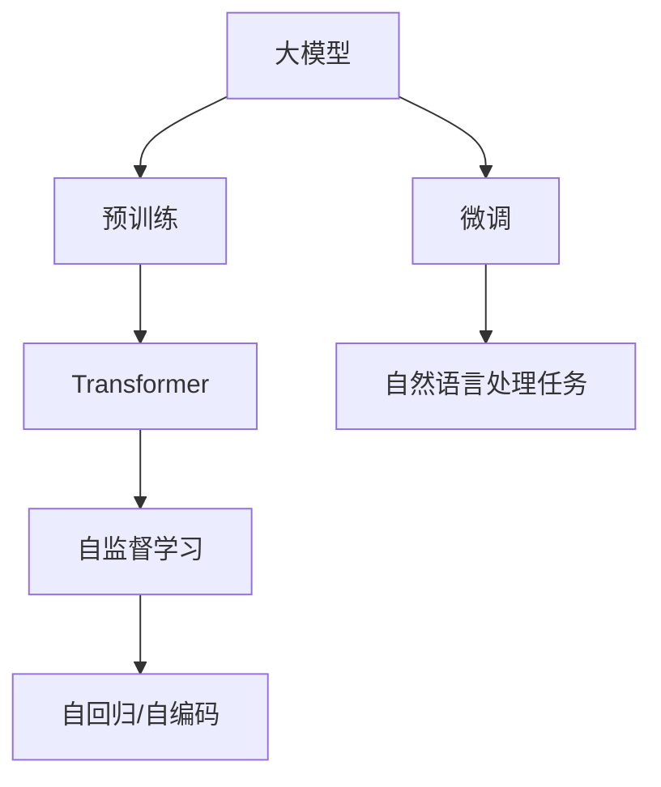

                 

# 初探大模型：起源与发展

## 1. 背景介绍

在信息技术飞速发展的今天，人工智能（AI）已经逐渐渗透到人类生活的方方面面。而作为AI的一个重要分支，大模型（Big Model）技术的诞生和发展，更是深刻地影响了NLP（自然语言处理）领域，推动了语言模型和自然语言处理技术的全面革新。本文章旨在从大模型的起源、发展历程以及当前应用情况等方面，系统地梳理大模型技术的脉络，并探讨其未来的发展方向。

## 2. 核心概念与联系

### 2.1 核心概念概述

大模型通常指的是使用大规模数据进行预训练，拥有海量参数的深度学习模型。这些模型通过自监督学习的方式，可以从大规模无标签数据中学习到丰富的语言知识和语义信息，从而在各种自然语言处理任务中表现优异。

在NLP中，大模型通常基于自回归或自编码的Transformer架构，如BERT、GPT-3、T5等。这些模型通过预训练学习到语言的一般规律，然后通过微调的方式，针对特定任务进行优化，从而适应实际应用场景。

### 2.2 核心概念原理和架构的 Mermaid 流程图



这个流程图展示了大模型的核心概念及其关系：大模型通过预训练学习语言知识，然后通过微调应对具体任务。Transformer作为大模型的核心架构，通常采用自监督学习的方式进行预训练，包括自回归和自编码两种形式。

## 3. 核心算法原理 & 具体操作步骤

### 3.1 算法原理概述

大模型的预训练和微调过程主要通过监督学习、自监督学习和迁移学习等方式实现。

- **监督学习**：通过标注好的数据进行训练，模型学习从输入到输出的映射关系。
- **自监督学习**：利用无标签数据，通过设计一些预训练任务，如语言模型（LM）、掩码语言模型（MLM）等，让模型自行学习语言知识和语义信息。
- **迁移学习**：利用预训练模型作为初始化参数，针对具体任务进行微调，提升模型在该任务上的性能。

### 3.2 算法步骤详解

1. **预训练步骤**：
    - 收集大规模无标签文本数据集。
    - 设计合适的预训练任务，如语言模型（LM）、掩码语言模型（MLM）等。
    - 使用大模型架构（如Transformer），在大规模数据集上进行预训练，学习语言知识。

2. **微调步骤**：
    - 收集目标任务的标注数据集。
    - 选择预训练模型，通常为已有的NLP模型如BERT、GPT-3等。
    - 根据微调任务，设计合适的任务适配层和损失函数。
    - 使用微调数据集训练模型，通过优化算法调整模型参数，直至达到最佳性能。

### 3.3 算法优缺点

**优点**：
- 利用大规模无标签数据进行预训练，可以学习到丰富的语言知识和语义信息。
- 在大规模数据集上进行微调，模型性能提升显著。
- 可以通过迁移学习，在大规模预训练的基础上，快速适应新任务。

**缺点**：
- 需要大量的计算资源和存储资源，预训练和微调过程耗时较长。
- 数据集的选择和标注对模型性能有很大影响。
- 对数据分布的泛化能力有限，对新数据和新任务适应性一般。

### 3.4 算法应用领域

大模型在自然语言处理领域的应用非常广泛，包括但不限于以下方面：
- **文本分类**：如情感分析、垃圾邮件识别、新闻分类等。
- **命名实体识别**：识别文本中的人名、地名、机构名等特定实体。
- **信息抽取**：从非结构化文本中抽取关键信息，如实体关系抽取、事件抽取等。
- **机器翻译**：将一种语言的文本翻译成另一种语言。
- **对话系统**：使机器能够与人类进行自然对话，如客服系统、智能助手等。
- **文本生成**：如自动摘要、自动创作、文本翻译等。

## 4. 数学模型和公式 & 详细讲解 & 举例说明

### 4.1 数学模型构建

假设大模型为 $M_{\theta}$，其中 $\theta$ 为模型参数。对于自然语言处理任务，假设输入为 $x$，输出为 $y$。预训练阶段，模型通过自监督任务进行训练，如掩码语言模型（MLM）。微调阶段，模型通过有监督学习进行训练，如分类任务。

### 4.2 公式推导过程

以BERT为例，其预训练任务主要为掩码语言模型（MLM）：
$$
\ell = -\log \sigma(\mathbf{W}[\mathbf{h}_0 + \mathbf{W}_i \mathbf{h}_i]^T[\mathbf{h}_0 + \mathbf{W}_i \mathbf{h}_i])
$$

其中，$\mathbf{h}_i$ 为模型在输入 $x$ 上的第 $i$ 个位置的隐藏向量，$\sigma$ 为softmax函数，$\mathbf{W}$ 为全连接层参数。

### 4.3 案例分析与讲解

假设我们希望使用BERT进行情感分类任务。首先，我们需要收集情感分类的标注数据集。然后，将标注数据集划分为训练集、验证集和测试集。在微调阶段，我们可以在BERT模型的最后一层添加一个全连接层和sigmoid函数，作为分类器的输出，损失函数选择交叉熵损失。

## 5. 项目实践：代码实例和详细解释说明

### 5.1 开发环境搭建

要使用大模型进行微调，首先需要搭建开发环境。这里以TensorFlow和Keras为例：

1. 安装TensorFlow和Keras：
   ```
   pip install tensorflow keras
   ```

2. 安装GPU支持：
   ```
   pip install tensorflow-gpu
   ```

3. 安装预训练模型：
   ```
   pip install transformers
   ```

### 5.2 源代码详细实现

以下是一个使用BERT进行情感分类的示例代码：

```python
from transformers import BertTokenizer, TFBertForSequenceClassification
from keras.layers import Dense
from keras.models import Sequential
from keras.optimizers import Adam

# 加载预训练模型和分词器
tokenizer = BertTokenizer.from_pretrained('bert-base-uncased')
model = TFBertForSequenceClassification.from_pretrained('bert-base-uncased', num_labels=2)

# 定义模型结构
model = Sequential([
    model,
    Dense(1, activation='sigmoid')
])

# 定义优化器
optimizer = Adam(learning_rate=2e-5)

# 编译模型
model.compile(optimizer=optimizer, loss='binary_crossentropy', metrics=['accuracy'])

# 训练模型
model.fit(x_train, y_train, validation_data=(x_val, y_val), epochs=3)
```

### 5.3 代码解读与分析

在上述代码中，我们使用了预训练的BERT模型作为特征提取器，通过添加一个全连接层和sigmoid函数进行情感分类。训练过程中，我们使用Adam优化器进行参数更新，交叉熵作为损失函数，准确率作为评估指标。

### 5.4 运行结果展示

运行上述代码后，我们可以得到模型在训练集和验证集上的准确率。在测试集上评估模型的性能，计算准确率、召回率和F1分数等指标。

## 6. 实际应用场景

### 6.1 文本分类

在文本分类任务中，大模型可以用于情感分析、垃圾邮件识别等。例如，将电影评论文本作为输入，使用BERT进行分类，预测评论的情感倾向为正面或负面。

### 6.2 命名实体识别

命名实体识别任务中，大模型可以识别文本中的实体，如人名、地名、机构名等。例如，将新闻文本作为输入，使用BERT进行命名实体识别，识别出文本中提及的实体，并将其分类。

### 6.3 机器翻译

机器翻译任务中，大模型可以将一种语言的文本翻译成另一种语言。例如，将英语文本作为输入，使用BERT进行翻译，生成对应的中文翻译。

### 6.4 对话系统

对话系统任务中，大模型可以与人类进行自然对话，如客服系统、智能助手等。例如，使用BERT进行对话生成，根据用户的输入生成相应的回复。

### 6.5 文本生成

文本生成任务中，大模型可以用于自动摘要、自动创作等。例如，将一篇新闻文章作为输入，使用BERT进行摘要生成，生成一篇简短的新闻摘要。

## 7. 工具和资源推荐

### 7.1 学习资源推荐

1. 《深度学习》系列书籍：深度学习领域的经典教材，涵盖了深度学习的基础理论和算法。
2. 《TensorFlow实战》：讲解TensorFlow的使用和实践，适合初学者入门。
3. 《自然语言处理》：斯坦福大学自然语言处理课程讲义，系统讲解NLP基础和前沿技术。
4. 《BERT》：介绍BERT模型的架构和应用，适合了解最新进展。

### 7.2 开发工具推荐

1. TensorFlow：深度学习领域的领先框架，适合进行大模型的预训练和微调。
2. Keras：基于TensorFlow的高级API，适合快速搭建和训练模型。
3. PyTorch：深度学习框架，灵活易用，适合快速迭代开发。
4. HuggingFace：提供了多种预训练语言模型，支持模型的预训练和微调。

### 7.3 相关论文推荐

1. "Attention is All You Need"：介绍Transformer架构的论文，开创了预训练大模型的新时代。
2. "BERT: Pre-training of Deep Bidirectional Transformers for Language Understanding"：介绍BERT模型的架构和预训练方法。
3. "GPT-3: Language Models are Unsupervised Multitask Learners"：介绍GPT-3模型的架构和预训练方法。
4. "T5: Exploring the Limits of Transfer Learning with a Unified Text-to-Text Transformer"：介绍T5模型的架构和预训练方法。

## 8. 总结：未来发展趋势与挑战

### 8.1 研究成果总结

大模型的研究已经取得了丰硕的成果，其在自然语言处理领域的表现已经超越了人类专家的水平。当前，大模型已经在多个任务上取得了最先进的结果，推动了自然语言处理技术的发展。

### 8.2 未来发展趋势

1. 模型规模进一步增大：未来的大模型将会拥有更多的参数和更强的学习能力，可以处理更加复杂和精细的任务。
2. 迁移学习和多任务学习：大模型将在多任务学习和迁移学习领域取得更多的突破，能够适应更多样化和复杂化的任务。
3. 更加高效的训练方法和硬件支持：未来的训练方法和硬件支持将进一步优化，使得大模型的训练和推理更加高效。
4. 大模型在更多领域的应用：大模型将在更多领域得到应用，如医疗、金融、教育等，推动这些领域的技术变革。

### 8.3 面临的挑战

1. 数据量和数据质量问题：大模型需要大量的数据进行预训练和微调，数据质量和数据分布的泛化能力是当前面临的主要挑战。
2. 模型的解释性和鲁棒性问题：大模型的黑盒特性使得其可解释性较差，且模型的鲁棒性有待提高。
3. 计算资源和存储资源问题：大模型的训练和推理需要大量的计算资源和存储资源，当前硬件资源的限制是一个重要挑战。
4. 模型的伦理和安全问题：大模型在应用过程中可能会面临伦理和安全问题，如何保证模型输出符合伦理道德标准是一个重要研究方向。

### 8.4 研究展望

未来的研究应该聚焦于以下方面：
1. 大模型的训练和推理效率：如何进一步提高大模型的训练和推理效率，减小对硬件资源的依赖。
2. 大模型的可解释性和鲁棒性：如何使大模型具备更好的可解释性和鲁棒性，解决当前模型解释性较差的问题。
3. 大模型的伦理和安全问题：如何设计大模型，使其输出符合伦理道德标准，避免偏见和有害信息的传播。
4. 大模型在更多领域的应用：如何将大模型应用到更多领域，推动这些领域的技术变革。

## 9. 附录：常见问题与解答

**Q1: 大模型在预训练和微调过程中，如何避免过拟合？**

A: 过拟合是大模型预训练和微调过程中面临的主要挑战之一。为了解决过拟合问题，可以采取以下措施：
1. 数据增强：通过回译、近义替换等方式扩充训练集。
2. 正则化：使用L2正则、Dropout等技术防止过拟合。
3. 对抗训练：引入对抗样本，提高模型的鲁棒性。
4. 参数高效微调：只调整少量参数，减小过拟合风险。

**Q2: 如何在大模型中进行参数高效微调？**

A: 参数高效微调（PEFT）是一种在大模型中微调的方法，可以在不增加大量参数的情况下，实现微调。具体方法包括：
1. Adapter：在大模型中增加一个微调层，只调整微调层参数，其他层保持不变。
2. Prefix-Tuning：通过调整模型中的微调参数，实现零样本学习。
3. Larger-Scale Self-Training：通过在大规模无标签数据上进行自训练，减少微调数据的依赖。

**Q3: 大模型的解释性问题如何解决？**

A: 大模型的黑盒特性使得其可解释性较差，可以通过以下方法提高模型的可解释性：
1. 使用可解释的模型结构：例如，使用注意力机制等可解释的模型结构。
2. 使用可解释的模型评估指标：例如，使用可解释的损失函数和评估指标。
3. 引入外部知识：例如，使用符号化的知识图谱等外部知识辅助模型的推理过程。

**Q4: 如何在大模型中进行迁移学习？**

A: 迁移学习是大模型在实际应用中的一个重要技术。具体方法包括：
1. 微调：将大模型的部分参数固定，只调整顶层参数。
2. 特征提取：使用大模型作为特征提取器，在不同任务上微调不同的输出层。
3. 联合训练：在大模型上进行多任务联合训练，提升模型的泛化能力。

**Q5: 大模型在实际应用中面临的伦理和安全问题如何解决？**

A: 大模型在实际应用中可能会面临伦理和安全问题，例如，模型输出可能包含偏见和有害信息。解决这些问题的方法包括：
1. 数据清洗：清洗数据集，去除偏见和有害信息。
2. 模型监控：对模型的输出进行监控，防止有害信息传播。
3. 伦理审查：建立伦理审查机制，确保模型的输出符合伦理道德标准。

---

作者：禅与计算机程序设计艺术 / Zen and the Art of Computer Programming

