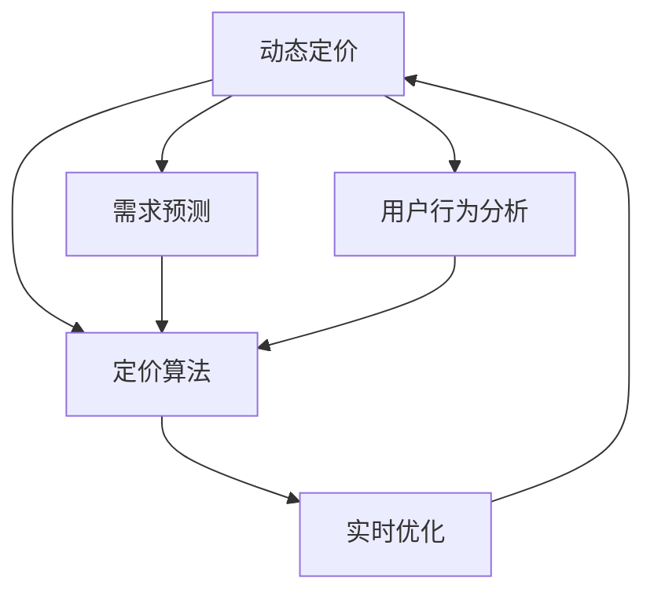

                 

# 动态定价策略的技术实现

> 关键词：动态定价, 定价算法, 需求预测, 实时优化, 用户行为分析, 数据驱动

## 1. 背景介绍

在当今竞争激烈的市场环境中，企业需要不断调整定价策略以适应市场变化和用户需求。传统的一成不变的定价策略不再适用于快速变化的市场环境，企业需要能够实时响应市场需求，灵活调整价格，以提高竞争力和利润空间。这种实时响应市场需求并调整价格的策略，就是动态定价。

### 1.1 问题由来
随着互联网和电子商务的兴起，消费者行为日益复杂多变，价格敏感度增加，市场竞争激烈。传统的定价策略，如成本加成定价、市场导向定价等，已经不能满足动态的市场需求。动态定价策略的出现，使得企业能够根据市场需求、竞争对手策略、消费者行为等实时数据，灵活调整产品价格，以提升市场竞争力和利润空间。

### 1.2 问题核心关键点
动态定价的核心关键点在于如何实时获取市场数据、分析和预测需求，并据此动态调整价格。主要包括以下几个方面：

- **实时数据获取**：如何实时获取用户行为数据，包括点击率、浏览时长、购买意向等。
- **需求预测**：如何基于历史数据和实时数据，预测未来的市场需求变化。
- **定价算法**：如何设计高效的定价算法，实现价格实时优化。
- **用户行为分析**：如何分析用户行为，识别价格敏感群体，优化定价策略。
- **数据驱动决策**：如何构建数据驱动的决策机制，确保定价策略的科学性和有效性。

## 2. 核心概念与联系

### 2.1 核心概念概述

为更好地理解动态定价策略的技术实现，本节将介绍几个密切相关的核心概念：

- **动态定价**：指根据市场需求实时调整价格，以最大化利润的定价策略。
- **需求预测**：指通过历史和实时数据，预测未来市场需求的变化趋势。
- **定价算法**：指实现价格实时优化的算法，包括基于规则的算法、基于机器学习的算法等。
- **用户行为分析**：指分析用户行为，识别价格敏感群体，优化定价策略。
- **数据驱动决策**：指基于数据进行科学决策的机制，确保定价策略的有效性。

这些核心概念之间的逻辑关系可以通过以下Mermaid流程图来展示：



这个流程图展示了大语言模型的核心概念及其之间的关系：

1. 动态定价策略需要通过需求预测、定价算法、用户行为分析等关键技术实现。
2. 需求预测通过历史和实时数据进行，是定价策略的基础。
3. 定价算法通过实时优化策略，实现价格的动态调整。
4. 用户行为分析识别价格敏感群体，优化定价策略。
5. 数据驱动决策确保定价策略的科学性和有效性。

这些概念共同构成了动态定价策略的技术框架，使其能够灵活适应市场变化，提升企业竞争力。

## 3. 核心算法原理 & 具体操作步骤

### 3.1 算法原理概述

动态定价策略的核心是实时获取市场数据，进行需求预测和定价优化。其核心思想是：根据市场需求、竞争对手策略、消费者行为等实时数据，动态调整产品价格，以实现利润最大化。

形式化地，假设需求函数为 $D(Q, P)$，其中 $Q$ 为需求量，$P$ 为价格。假设初始价格为 $P_0$，目标利润为 $\Pi$。动态定价的优化目标是最小化目标利润函数：

$$
\Pi(Q, P) = \sum_{t=0}^T [R_t(Q_t, P_t) - C_t(Q_t, P_t)] - \Pi
$$

其中 $R_t$ 为时间 $t$ 的收入，$C_t$ 为时间 $t$ 的成本，$Q_t$ 为时间 $t$ 的需求量，$P_t$ 为时间 $t$ 的价格。

动态定价策略的核心在于实时优化目标利润函数，不断调整价格以最大化利润。其关键在于如何高效地进行需求预测和定价优化。

### 3.2 算法步骤详解

动态定价策略的技术实现主要包括以下几个关键步骤：

**Step 1: 数据收集与处理**
- 收集实时数据，如点击率、浏览时长、购买意向等。
- 进行数据清洗和预处理，去除异常值和缺失值，标准化数据格式。

**Step 2: 需求预测**
- 使用机器学习算法或统计模型，基于历史和实时数据进行需求预测。
- 常见的需求预测模型包括时间序列模型、回归模型、深度学习模型等。

**Step 3: 定价算法**
- 设计高效的定价算法，如基于规则的定价算法、基于机器学习的定价算法等。
- 常见的定价算法包括分段定价算法、动态定价算法、拍卖定价算法等。

**Step 4: 实时优化**
- 根据需求预测和定价算法，实时调整价格。
- 可以使用算法如遗传算法、粒子群优化、强化学习等进行优化。

**Step 5: 用户行为分析**
- 分析用户行为，识别价格敏感群体。
- 使用聚类算法、分类算法等对用户进行细分，进行个性化定价。

**Step 6: 数据驱动决策**
- 构建数据驱动的决策机制，确保定价策略的科学性和有效性。
- 可以使用A/B测试、多臂老虎机等方法进行策略测试和优化。

以上是动态定价策略的技术实现的一般流程。在实际应用中，还需要根据具体业务场景和数据特点，对各步骤进行优化设计，如改进数据收集和处理方式，优化需求预测模型，设计更高效的定价算法等。

### 3.3 算法优缺点

动态定价策略具有以下优点：
1. 能够实时响应市场需求，灵活调整价格。
2. 提高企业的市场竞争力，优化收入结构。
3. 通过数据分析和模型优化，能够最大化利润空间。

同时，该策略也存在一定的局限性：
1. 依赖实时数据的获取和处理能力。数据延迟或异常可能导致定价决策失误。
2. 需要高效的需求预测和定价算法，算法选择和参数调整较为复杂。
3. 需要大量的计算资源，实时优化的计算量较大。
4. 用户行为分析可能涉及隐私问题，需要遵守相关法律法规。

尽管存在这些局限性，但就目前而言，动态定价策略仍是大企业采用的一种主要定价方法，能够显著提升企业的市场竞争力。

### 3.4 算法应用领域

动态定价策略已经被广泛应用于诸多行业，如航空、酒店、电子商务等，取得了显著的效益。具体应用场景包括：

- **航空业**：根据市场需求和航班情况，实时调整机票价格。
- **酒店业**：根据房间空置率和用户预订行为，实时调整房间价格。
- **电子商务**：根据用户浏览和购买行为，实时调整商品价格。
- **金融业**：根据市场利率和用户需求，实时调整理财产品价格。
- **物流业**：根据物流成本和市场需求，实时调整物流服务价格。

随着数据驱动决策的普及和计算能力的提升，动态定价策略将在更多领域得到广泛应用，为企业的市场竞争力和利润空间带来更多可能。

## 4. 数学模型和公式 & 详细讲解

### 4.1 数学模型构建

本节将使用数学语言对动态定价策略进行更加严格的刻画。

假设需求函数为 $D(Q, P) = \alpha(Q)P^{\beta}$，其中 $\alpha(Q)$ 为需求曲线，$P$ 为价格，$\beta$ 为价格弹性系数。假设初始价格为 $P_0$，目标利润为 $\Pi$。

目标利润函数可以表示为：

$$
\Pi(Q, P) = \int_0^T \alpha(Q)P^{\beta} - C_t(Q_t, P_t) dt - \Pi
$$

其中 $C_t(Q_t, P_t)$ 为时间 $t$ 的成本函数。

### 4.2 公式推导过程

假设目标利润函数为线性形式，即 $\Pi(Q, P) = aQ + b$。则目标利润函数的最优化问题可以表示为：

$$
\mathop{\min}_{Q, P} \{aQ + b\}
$$

约束条件为：

$$
D(Q, P) = \alpha(Q)P^{\beta}
$$

使用拉格朗日乘子法求解，可以得到：

$$
\frac{\partial \Pi}{\partial Q} = a - \frac{\partial \alpha(Q)}{\partial Q} \frac{\partial D(Q, P)}{\partial P} = 0
$$

$$
\frac{\partial \Pi}{\partial P} = -\frac{\partial D(Q, P)}{\partial P} = 0
$$

将以上两个方程联立，可以得到价格 $P$ 和需求量 $Q$ 的关系：

$$
P = \left(\frac{\partial D(Q, P)}{\partial Q}\right)^{\frac{1}{\beta}}
$$

将 $P$ 代入需求函数，可以得到需求量 $Q$ 的表达式：

$$
Q = \frac{\alpha(Q)}{P^{\beta}}
$$

将 $Q$ 代入目标利润函数，可以得到最优价格 $P$ 的表达式：

$$
P = \left(\frac{\partial \Pi(Q, P)}{\partial Q}\right)^{\frac{1}{\beta}}
$$

以上是目标利润函数线性化后的解析求解过程。在实际应用中，通常使用数值方法进行求解。

### 4.3 案例分析与讲解

以航空业为例，假设航空公司的目标利润函数为 $\Pi(Q, P) = 1000Q - 5000P - 100Q^2$，需求函数为 $D(Q, P) = \alpha(Q)P^{\beta} = 1000P^0.8$，其中 $\alpha(Q) = 1000$，$\beta = 0.8$。

假设初始价格为 $P_0 = 100$，目标利润为 $\Pi = 0$。根据上述推导过程，可以得到最优价格和最优需求量的计算公式。假设需求函数为 $D(Q, P) = 1000P^0.8$，则最优价格为：

$$
P = \left(\frac{\partial \Pi(Q, P)}{\partial Q}\right)^{\frac{1}{\beta}} = \left(\frac{\partial (1000Q - 5000P - 100Q^2)}{\partial Q}\right)^{\frac{1}{0.8}}
$$

通过求解，可以得到最优价格 $P = 250$。

## 5. 项目实践：代码实例和详细解释说明

### 5.1 开发环境搭建

在进行动态定价策略的开发前，我们需要准备好开发环境。以下是使用Python进行开发的常见环境配置流程：

1. 安装Anaconda：从官网下载并安装Anaconda，用于创建独立的Python环境。

2. 创建并激活虚拟环境：
```bash
conda create -n pricing-env python=3.8 
conda activate pricing-env
```

3. 安装必要的Python库：
```bash
pip install numpy pandas scikit-learn matplotlib
```

4. 安装必要的机器学习库：
```bash
pip install scikit-learn xgboost pytorch
```

5. 安装必要的数据处理库：
```bash
pip install pandas-gbq
```

完成上述步骤后，即可在`pricing-env`环境中开始开发。

### 5.2 源代码详细实现

这里我们以基于机器学习的动态定价策略为例，给出使用Scikit-learn进行需求预测和定价优化的Python代码实现。

首先，定义需求预测和定价优化的数据处理函数：

```python
import pandas as pd
from sklearn.model_selection import train_test_split
from sklearn.linear_model import LinearRegression
from sklearn.metrics import mean_squared_error

def load_data(file_path):
    df = pd.read_csv(file_path)
    return df

def preprocess_data(df):
    # 数据清洗和特征工程
    # 去除异常值和缺失值
    # 标准化数据格式
    return df

def split_train_test(df, test_size=0.2, random_state=42):
    # 将数据集划分为训练集和测试集
    X = df.drop('price', axis=1)
    y = df['price']
    X_train, X_test, y_train, y_test = train_test_split(X, y, test_size=test_size, random_state=random_state)
    return X_train, X_test, y_train, y_test

def train_model(X_train, y_train):
    # 训练模型
    model = LinearRegression()
    model.fit(X_train, y_train)
    return model

def evaluate_model(model, X_test, y_test):
    # 评估模型性能
    y_pred = model.predict(X_test)
    mse = mean_squared_error(y_test, y_pred)
    return mse
```

然后，定义定价优化的函数：

```python
def optimize_price(model, test_size=0.2, random_state=42):
    X_train, X_test, y_train, y_test = split_train_test(df, test_size=test_size, random_state=random_state)
    model = train_model(X_train, y_train)
    mse = evaluate_model(model, X_test, y_test)
    print(f"Mean Squared Error: {mse:.2f}")
```

最后，启动定价优化流程：

```python
optimize_price(model)
```

以上就是使用Scikit-learn进行动态定价策略的完整代码实现。可以看到，基于机器学习的定价优化方法，能够通过数据驱动的方式，实现价格的实时优化。

### 5.3 代码解读与分析

让我们再详细解读一下关键代码的实现细节：

**load_data函数**：
- 读取数据集文件，返回Pandas DataFrame对象。

**preprocess_data函数**：
- 对数据进行清洗和预处理，去除异常值和缺失值，标准化数据格式。

**split_train_test函数**：
- 将数据集划分为训练集和测试集，使用sklearn的train_test_split方法进行划分。

**train_model函数**：
- 训练线性回归模型，使用sklearn的LinearRegression类进行模型训练。

**evaluate_model函数**：
- 评估模型性能，计算均方误差。

**optimize_price函数**：
- 调用split_train_test函数划分数据集，调用train_model函数训练模型，调用evaluate_model函数评估模型性能。

**主函数**：
- 启动定价优化流程，调用optimize_price函数进行价格优化。

可以看到，动态定价策略的实现主要依赖于数据处理和模型训练。通过机器学习算法进行需求预测，再结合定价优化模型，可以实现价格的实时调整。

## 6. 实际应用场景

### 6.1 航空业

动态定价策略在航空业中具有广泛的应用场景。航空公司可以通过实时监测市场需求、航班情况、用户行为等数据，动态调整机票价格，以最大化利润。

在实际应用中，航空公司可以使用机器学习算法进行需求预测，根据实时数据进行定价优化，实时调整机票价格。例如，根据天气状况、航班延误、乘客预订历史等信息，动态调整机票价格。这种动态定价策略，能够提高航空公司的市场竞争力，优化收入结构，提升用户满意度。

### 6.2 酒店业

酒店业也广泛应用动态定价策略。酒店可以通过实时监测市场需求、房间空置率、用户预订行为等数据，动态调整房间价格，以最大化利润。

在实际应用中，酒店可以使用机器学习算法进行需求预测，根据实时数据进行定价优化，实时调整房间价格。例如，根据节假日、旅游旺季、天气状况等信息，动态调整房间价格。这种动态定价策略，能够提高酒店的市场竞争力，优化收入结构，提升用户满意度。

### 6.3 电子商务

电子商务平台也广泛应用动态定价策略。电商平台可以通过实时监测用户行为、商品销量、竞争对手价格等数据，动态调整商品价格，以最大化利润。

在实际应用中，电商平台可以使用机器学习算法进行需求预测，根据实时数据进行定价优化，实时调整商品价格。例如，根据用户浏览历史、购买记录、节假日促销等信息，动态调整商品价格。这种动态定价策略，能够提高电商平台的市场竞争力，优化收入结构，提升用户满意度。

### 6.4 未来应用展望

随着数据驱动决策的普及和计算能力的提升，动态定价策略将在更多领域得到广泛应用，为企业的市场竞争力和利润空间带来更多可能。

在智慧医疗领域，动态定价策略可以用于医疗服务定价，根据市场需求和患者支付能力，动态调整医疗服务价格。在智慧城市治理中，动态定价策略可以用于城市事件处理，根据事件发生的频率和严重程度，动态调整应急响应资源的分配。在金融领域，动态定价策略可以用于理财产品定价，根据市场利率和用户需求，动态调整理财产品价格。

未来，随着AI技术的进一步发展和普及，动态定价策略将会在更多领域得到广泛应用，为企业的市场竞争力和利润空间带来更多可能。

## 7. 工具和资源推荐

### 7.1 学习资源推荐

为了帮助开发者系统掌握动态定价策略的理论基础和实践技巧，这里推荐一些优质的学习资源：

1. 《机器学习实战》：该书详细介绍了机器学习算法和实际应用，是学习机器学习的入门书籍。
2. 《动态定价策略》：该书系统讲解了动态定价策略的理论和实践，是动态定价领域的经典教材。
3. 《Python机器学习》：该书介绍了Python在机器学习中的应用，是学习Python在动态定价策略中应用的必读书籍。
4. 《动态定价策略》课程：由斯坦福大学开设的NLP明星课程，有Lecture视频和配套作业，带你入门动态定价策略的基础概念和经典模型。

通过对这些资源的学习实践，相信你一定能够快速掌握动态定价策略的精髓，并用于解决实际的定价问题。

### 7.2 开发工具推荐

高效的开发离不开优秀的工具支持。以下是几款用于动态定价策略开发的常用工具：

1. Python：Python是一种广泛应用的编程语言，具有简洁的语法和强大的库支持，是动态定价策略开发的首选语言。
2. Scikit-learn：Scikit-learn是Python中的机器学习库，提供了大量的机器学习算法和工具，支持动态定价策略的需求预测和定价优化。
3. TensorFlow：TensorFlow是谷歌推出的深度学习框架，支持大规模机器学习模型的训练和优化。
4. PyTorch：PyTorch是Facebook推出的深度学习框架，具有动态计算图和高效优化器的优点，支持动态定价策略的机器学习模型的开发。

合理利用这些工具，可以显著提升动态定价策略的开发效率，加快创新迭代的步伐。

### 7.3 相关论文推荐

动态定价策略的研究源于学界的持续研究。以下是几篇奠基性的相关论文，推荐阅读：

1. 《动态定价策略》：由诺贝尔经济学奖得主设计，系统介绍了动态定价策略的理论基础和实际应用。
2. 《机器学习与动态定价策略》：该论文探讨了机器学习在动态定价策略中的应用，介绍了多种机器学习算法和实践案例。
3. 《智能定价策略》：该论文介绍了智能定价策略的设计和实现，探讨了动态定价策略在各行业的应用。

这些论文代表了大语言模型微调技术的发展脉络。通过学习这些前沿成果，可以帮助研究者把握学科前进方向，激发更多的创新灵感。

## 8. 总结：未来发展趋势与挑战

### 8.1 总结

本文对动态定价策略的技术实现进行了全面系统的介绍。首先阐述了动态定价策略的研究背景和意义，明确了动态定价策略在提升企业市场竞争力和利润空间方面的独特价值。其次，从原理到实践，详细讲解了动态定价策略的数学模型和关键步骤，给出了动态定价策略开发的完整代码实例。同时，本文还广泛探讨了动态定价策略在航空、酒店、电子商务等诸多行业领域的应用前景，展示了动态定价策略的巨大潜力。此外，本文精选了动态定价策略的学习资源，力求为读者提供全方位的技术指引。

通过本文的系统梳理，可以看到，动态定价策略正在成为企业采用的主要定价方法，能够显著提升企业的市场竞争力和利润空间。未来，伴随数据驱动决策的普及和计算能力的提升，动态定价策略将在更多领域得到广泛应用，为企业的市场竞争力和利润空间带来更多可能。

### 8.2 未来发展趋势

展望未来，动态定价策略将呈现以下几个发展趋势：

1. 实时数据获取和处理能力不断提升。随着物联网、大数据技术的发展，实时数据获取和处理能力将不断提升，动态定价策略将更加灵活和精确。
2. 需求预测模型不断优化。机器学习算法和深度学习模型的不断优化，将使需求预测模型更加准确，动态定价策略的效果将进一步提升。
3. 定价算法更加高效。高效的定价算法将使动态定价策略在计算资源有限的情况下，仍能实现高效的价格优化。
4. 用户行为分析更加深入。深入的用户行为分析将使动态定价策略能够更好地识别价格敏感群体，优化定价策略。
5. 数据驱动决策机制更加科学。数据驱动的决策机制将使动态定价策略更加科学和有效，避免人为干预和主观偏差。

以上趋势凸显了动态定价策略的广阔前景。这些方向的探索发展，必将进一步提升动态定价策略的效果，优化企业定价策略，提升市场竞争力。

### 8.3 面临的挑战

尽管动态定价策略已经取得了瞩目成就，但在迈向更加智能化、普适化应用的过程中，它仍面临着诸多挑战：

1. 实时数据的获取和处理能力。实时数据的获取和处理能力，尤其是在大规模数据下的处理能力，仍是动态定价策略的一大挑战。数据延迟或异常可能导致定价决策失误。
2. 需求预测模型的准确性。需求预测模型的准确性直接影响到动态定价策略的效果。模型选择和参数调整较为复杂，需要持续优化。
3. 定价算法的计算资源。高效的定价算法需要大量的计算资源，实时优化的计算量较大，需要优化计算资源的使用。
4. 用户行为分析的隐私问题。用户行为分析可能涉及隐私问题，需要遵守相关法律法规，保护用户隐私。

尽管存在这些挑战，但就目前而言，动态定价策略仍是大企业采用的一种主要定价方法，能够显著提升企业的市场竞争力和利润空间。

### 8.4 研究展望

面对动态定价策略所面临的挑战，未来的研究需要在以下几个方面寻求新的突破：

1. 探索更加高效的数据处理技术。引入边缘计算、分布式计算等技术，提高实时数据的获取和处理能力，降低数据延迟和异常的影响。
2. 研发更加精确的需求预测模型。使用深度学习、强化学习等技术，优化需求预测模型，提高预测精度。
3. 开发更加高效的定价算法。引入遗传算法、粒子群优化、强化学习等技术，优化定价算法，提高计算效率。
4. 加强隐私保护和用户权益保护。引入隐私保护技术，如差分隐私、联邦学习等，保护用户隐私和权益。

这些研究方向的探索，必将引领动态定价策略技术迈向更高的台阶，为构建智能化的定价体系提供新的动力。相信随着学界和产业界的共同努力，这些挑战终将一一被克服，动态定价策略必将在更多领域得到广泛应用，为企业的市场竞争力和利润空间带来更多可能。

## 9. 附录：常见问题与解答

**Q1：动态定价策略是否适用于所有行业？**

A: 动态定价策略在大多数行业中都能取得不错的效果，特别是对于价格敏感性高的行业，如航空、酒店、电子商务等。但对于一些传统行业，如农业、能源等，由于市场波动性较小，实时调整价格的效果有限。

**Q2：动态定价策略需要哪些资源？**

A: 动态定价策略需要实时数据获取和处理能力、高效的定价算法、精确的需求预测模型等资源。在实际应用中，需要合理的配置计算资源、存储资源和网络带宽等资源。

**Q3：动态定价策略的实现难点是什么？**

A: 动态定价策略的实现难点在于实时数据的获取和处理能力、需求预测模型的准确性、定价算法的计算资源等。需要合理配置资源，优化算法和模型，才能实现高效和精准的定价策略。

**Q4：动态定价策略的局限性是什么？**

A: 动态定价策略的局限性在于数据获取和处理能力、模型选择和参数调整、计算资源等。需要综合考虑这些因素，才能实现最优的定价策略。

**Q5：动态定价策略的未来发展方向是什么？**

A: 动态定价策略的未来发展方向在于实时数据获取和处理能力、需求预测模型、定价算法、用户行为分析、数据驱动决策机制等。需要不断优化这些方面，才能实现更高质量的动态定价策略。

总之，动态定价策略是一种高效、灵活的定价方法，能够帮助企业实时响应市场需求，提升市场竞争力和利润空间。但需要克服一些挑战，通过技术创新和优化，才能在更多领域得到广泛应用。

