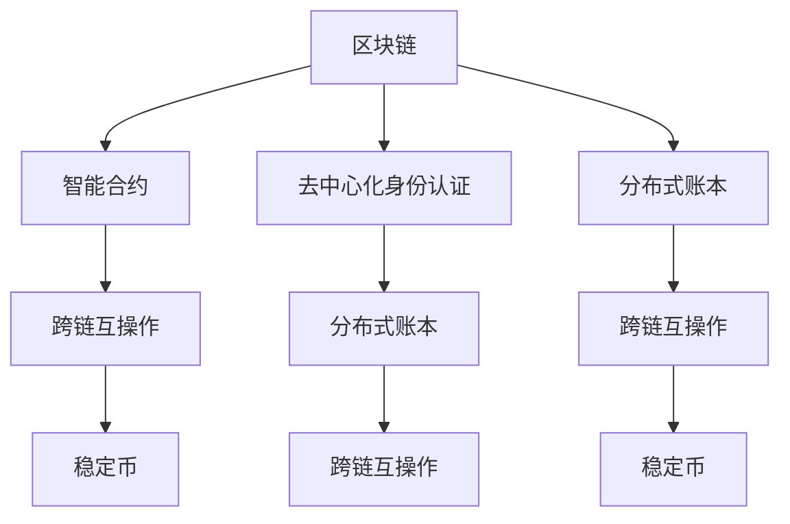

                 

## 1. 背景介绍

### 1.1 问题由来

近年来，区块链技术以其独特的分布式、去中心化、不可篡改等特点，逐步从加密货币领域延伸至金融科技(Fintech)的各个角落。金融科技行业面临着数据安全、交易效率、操作透明度等诸多挑战，而区块链技术的引入为这些问题提供了新的解决方案。

在传统金融行业，业务流程往往依赖于信任机制和中介机构，这导致了较高的运营成本和较长的交易周期。而区块链技术的去中心化特点，使得各方可以直接通过智能合约进行交易，降低了信任成本和时间成本，提升了金融服务的效率和透明度。

### 1.2 问题核心关键点

当前，区块链技术在金融科技中的创新应用主要围绕以下几个核心关键点展开：

- **智能合约**：通过编程语言定义的合约条款，自动执行和执行监控，无需中介，即可保障金融交易的安全和透明。
- **去中心化身份认证**：采用公钥加密技术和区块链分布式账本，确保用户身份的真实性和隐私性。
- **分布式账本**：确保交易记录的不可篡改性和可追溯性，提升金融数据的可信度和可靠性。
- **跨链互操作**：打破不同区块链之间的壁垒，实现资产、信息、数据等多维度的互联互通。
- **稳定币**：基于区块链的资产稳定器，旨在降低波动性，提升数字资产的可接受度。

### 1.3 问题研究意义

区块链在金融科技中的应用，可以大幅降低交易成本，提高金融服务的效率和安全性。具体来说：

1. **降低交易成本**：智能合约自动执行减少了中间环节和人工操作，降低了交易成本和时间成本。
2. **提升操作透明度**：区块链的分布式账本确保了所有交易记录的透明和可追溯性，降低了操作风险。
3. **保障数据安全**：去中心化身份认证和分布式账本技术，确保了数据的安全性和隐私保护。
4. **促进跨链互联**：跨链互操作性，使不同区块链之间的资产和信息可以无缝交互，提升金融系统的灵活性。
5. **增强市场信心**：稳定币等新型数字资产，为市场提供了更多选择，增加了市场的流动性和信任度。

## 2. 核心概念与联系

### 2.1 核心概念概述

在深入探讨区块链在金融科技中的应用前，有必要先理解以下核心概念：

- **区块链**：一种分布式账本技术，通过加密算法和共识机制，确保数据的安全性和不可篡改性。
- **智能合约**：使用编程语言编写的自动化合约，可在区块链上自动执行和执行监控，无需中介。
- **去中心化身份认证**：通过公钥加密技术和区块链分布式账本，实现用户身份的验证和隐私保护。
- **分布式账本**：所有交易记录公开透明，可追溯且不可篡改，确保数据的可信度。
- **跨链互操作**：通过技术手段，使不同区块链之间的资产、信息和数据进行互联互通。
- **稳定币**：基于区块链的资产稳定器，旨在降低波动性，提升数字资产的可接受度。

这些概念之间有着紧密的联系，共同构成了区块链技术的核心框架。以下是这些概念之间的逻辑关系通过Mermaid流程图来展示：



这个流程图展示了大语言模型的核心概念及其之间的联系：

1. 区块链提供了分布式账本技术，确保了数据的不可篡改性和透明性。
2. 智能合约定义了交易的规则，通过自动执行确保交易的安全和透明度。
3. 去中心化身份认证保障了用户身份的真实性和隐私性。
4. 分布式账本技术提供了可追溯的数据记录，确保了数据的可信度。
5. 跨链互操作性打破了不同区块链之间的壁垒，提升了系统的灵活性。
6. 稳定币为市场提供了更稳定的数字资产选择，增强了市场的流动性和信任度。

## 3. 核心算法原理 & 具体操作步骤
### 3.1 算法原理概述

区块链在金融科技中的应用，本质上是通过区块链技术实现金融数据的记录、验证和交易。其核心算法原理主要包括以下几个方面：

1. **共识算法**：确保网络节点之间就交易记录达成一致意见。常见的共识算法包括PoW、PoS、DPoS等。
2. **加密算法**：确保数据的完整性和安全性。常见的加密算法包括公钥加密、哈希函数等。
3. **分布式账本**：记录所有交易记录，确保数据的透明性和不可篡改性。
4. **智能合约**：自动执行和执行监控，确保交易的安全和透明度。
5. **去中心化身份认证**：通过公钥加密技术和区块链分布式账本，实现用户身份的验证和隐私保护。

### 3.2 算法步骤详解

基于区块链技术的金融科技应用，通常包括以下几个关键步骤：

**Step 1: 设计智能合约**  
- 根据具体的金融需求，使用编程语言设计智能合约，定义合约条款和执行逻辑。
- 确保合约的完整性、正确性和可执行性。

**Step 2: 部署智能合约**  
- 将智能合约部署到区块链网络，并通过网络节点进行验证和执行。
- 确保合约的透明性和不可篡改性。

**Step 3: 用户身份认证**  
- 采用公钥加密技术，生成用户的公钥和私钥，用于身份验证和交易。
- 确保用户身份的真实性和隐私性。

**Step 4: 进行交易**  
- 用户通过智能合约进行交易，系统自动验证并执行交易。
- 确保交易的安全性和透明度。

**Step 5: 交易记录验证**  
- 交易完成后，将交易记录存入区块链，并通过共识算法进行验证和确认。
- 确保交易记录的透明性和不可篡改性。

**Step 6: 数据查询和分析**  
- 用户可以通过区块链网络查询交易记录和数据分析。
- 确保数据的可信度和可靠性。

### 3.3 算法优缺点

区块链技术在金融科技中的应用，具有以下优点：

1. **降低运营成本**：智能合约和去中心化身份认证减少了中间环节和人工操作，降低了运营成本。
2. **提高操作透明度**：区块链的分布式账本确保了所有交易记录的透明和可追溯性，提升了操作透明度。
3. **保障数据安全**：去中心化身份认证和分布式账本技术，确保了数据的安全性和隐私保护。
4. **提升交易效率**：智能合约自动执行，减少了交易时间，提高了交易效率。
5. **促进跨链互联**：跨链互操作性，使不同区块链之间的资产和信息可以无缝交互，提升了系统的灵活性。

同时，区块链技术也存在一些局限性：

1. **计算资源消耗高**：共识算法如PoW需要大量的计算资源，增加了能源消耗。
2. **处理速度慢**：目前区块链的吞吐量较低，处理大量交易时效率较慢。
3. **技术复杂度高**：区块链技术相对复杂，对开发人员和运维人员的技术要求较高。
4. **安全性风险**：共识算法和加密算法的不完善，可能导致网络攻击和安全漏洞。

### 3.4 算法应用领域

区块链技术在金融科技中的应用，已经广泛应用于以下几个领域：

1. **支付和清算**：通过智能合约自动执行交易，降低支付和清算成本，提高效率。
2. **身份认证和KYC**：通过公钥加密技术和区块链分布式账本，实现用户身份的验证和隐私保护。
3. **供应链金融**：通过区块链技术记录供应链信息，确保交易的可追溯性和透明度。
4. **资产托管和交易**：通过区块链技术实现资产的托管和交易，提升资产管理的效率和安全性。
5. **数据共享和分析**：通过区块链技术实现数据的共享和分析，提升数据的可信度和可靠性。

## 4. 数学模型和公式 & 详细讲解 & 举例说明

### 4.1 数学模型构建

区块链在金融科技中的应用，涉及到多个数学模型和算法。以下是几个关键的数学模型：

- **公钥加密模型**：使用椭圆曲线加密算法(ECC)生成公钥和私钥，确保用户身份的真实性和隐私性。
- **哈希函数模型**：使用SHA-256等哈希函数计算数据的摘要，确保数据的完整性和不可篡改性。
- **共识算法模型**：如PoW、PoS、DPoS等，确保网络节点之间就交易记录达成一致意见。

### 4.2 公式推导过程

以椭圆曲线加密算法(ECC)为例，推导公钥加密的基本流程：

设椭圆曲线方程为：$y^2 \equiv x^3 + ax + b \pmod{p}$，其中 $p$ 为素数。

1. 生成随机数 $k$，计算 $K=kG$，其中 $G$ 为椭圆曲线上的生成点。
2. 计算 $Q=kG+P$，其中 $P$ 为用户A的公钥，$Q$ 为用户A的私钥对应的公钥。
3. 用户A将 $Q$ 公开，将 $kG$ 通过安全通道传递给用户B。
4. 用户B通过 $kG$ 计算 $kQ$，与自身私钥 $D$ 计算 $E=kD$，比较 $E$ 和 $Q$，确保用户B的身份。

### 4.3 案例分析与讲解

假设A向B进行交易，双方通过ECC进行身份验证和交易：

1. A生成随机数 $k$，计算 $K=kG$，将 $Q=kG+P$ 公开。
2. B通过安全通道接收 $kG$，计算 $kQ$。
3. B将 $E=kD$ 与 $Q$ 比较，确认A的身份。
4. A将交易信息通过哈希函数计算摘要，通过私钥 $D$ 计算签名，将签名和交易信息发送给B。
5. B通过哈希函数计算摘要，验证签名的有效性。
6. 验证通过后，B将交易记录存入区块链，并通过共识算法进行验证和确认。

## 5. 项目实践：代码实例和详细解释说明

### 5.1 开发环境搭建

在进行区块链应用开发前，需要准备好开发环境。以下是使用Python进行以太坊开发的环境配置流程：

1. 安装Node.js：从官网下载并安装Node.js，用于管理区块链网络。
2. 安装ethereum-wallet：通过npm安装ethereum-wallet，用于生成和管理钱包。
3. 安装Ganache：通过npm安装Ganache，本地模拟以太坊网络。

完成上述步骤后，即可在Ganache环境下进行区块链应用的开发和测试。

### 5.2 源代码详细实现

下面我们以智能合约为例，给出使用Solidity语言在以太坊上部署智能合约的代码实现。

```solidity
// SPDX-License-Identifier: MIT
pragma solidity ^0.8.0;

contract Savings {
    uint256 public balance;
    uint256 public interestRate = 0.01; // 年利率为1%
    uint256 private account;

    constructor(uint256 _initialBalance) {
        balance = _initialBalance;
        account = msg.sender; // 初始化账户
    }

    function deposit(uint256 _amount) public payable {
        require(msg.sender == account);
        balance += _amount;
    }

    function withdraw(uint256 _amount) public {
        require(msg.sender == account);
        require(_amount <= balance);
        balance -= _amount;
        payable(msg.sender).transfer(_amount + _amount * interestRate / 100);
    }

    function calculateInterest() public view {
        uint256 interest = balance * interestRate / 100;
        return interest;
    }
}
```

以上代码定义了一个储蓄合约，包含存款、取款和计算利息等功能。

### 5.3 代码解读与分析

让我们再详细解读一下关键代码的实现细节：

**Savings合同**：
- `uint256 public balance`：记录用户账户余额。
- `uint256 public interestRate`：记录年利率。
- `uint256 private account`：记录用户账户地址。
- `constructor`：初始化账户余额和账户地址。
- `deposit`：用户存款操作，需验证账户地址。
- `withdraw`：用户取款操作，需验证账户地址和余额。
- `calculateInterest`：计算存款利息，返回利息金额。

**用户身份验证**：
- 在`deposit`和`withdraw`函数中，通过`require(msg.sender == account)`确保操作者为合同账户所有者，防止恶意操作。
- 在`calculateInterest`函数中，通过`payable(msg.sender).transfer(_amount + _amount * interestRate / 100)`计算并转移利息，确保用户获得正确的利息。

### 5.4 运行结果展示

使用Ganache启动本地以太坊网络，将智能合约部署到区块链上。然后使用`ethereum-wallet`生成测试账号，通过智能合约进行存款和取款操作，并计算利息。

## 6. 实际应用场景

### 6.1 智能合约交易

智能合约是区块链在金融科技中最核心的应用之一。通过智能合约，用户可以在无需中介的情况下，直接进行交易和资产管理。例如：

- **债券发行和交易**：通过智能合约发行债券，并在债券到期时自动支付利息和本金。
- **保险理赔**：通过智能合约自动执行保险理赔操作，确保理赔的透明和公正。
- **证券交易**：通过智能合约进行证券交易，确保交易的透明和不可篡改性。

### 6.2 去中心化身份认证

去中心化身份认证通过区块链技术，实现了用户身份的真实性和隐私性保护。例如：

- **KYC（了解你的客户）验证**：通过区块链技术，验证用户的身份信息，减少金融机构的运营成本。
- **数字身份管理**：通过区块链技术，管理用户的数字身份信息，提升身份信息的安全性。

### 6.3 供应链金融

区块链技术在供应链金融中的应用，通过记录供应链信息，确保交易的可追溯性和透明度。例如：

- **供应链融资**：通过区块链技术，记录供应链上的所有交易信息，确保融资的可追溯性和透明度。
- **货物追踪**：通过区块链技术，记录货物的运输信息，确保货物的真实性和可追溯性。

### 6.4 未来应用展望

随着区块链技术的发展，未来的金融科技应用将更加广泛和深入。以下是一些未来可能的应用方向：

1. **DeFi（去中心化金融）**：通过智能合约实现去中心化的金融服务，如借贷、投资、保险等。
2. **跨链互操作**：打破不同区块链之间的壁垒，实现资产、信息、数据等多维度的互联互通。
3. **NFT（非同质化代币）**：通过区块链技术，实现数字资产的独特性和稀缺性，推动数字资产市场的发展。
4. **稳定币**：通过区块链技术，实现资产稳定器，降低数字资产的波动性，提升市场的接受度。
5. **金融隐私保护**：通过区块链技术，保护用户的隐私信息，提升金融系统的安全性。

## 7. 工具和资源推荐

### 7.1 学习资源推荐

为了帮助开发者系统掌握区块链在金融科技中的应用，这里推荐一些优质的学习资源：

1. **以太坊开发者文档**：以太坊官方提供的详细开发文档，涵盖智能合约、钱包、交易等方面的内容。
2. **Hyperledger Fabric文档**：Hyperledger Fabric官方提供的详细开发文档，涵盖区块链网络、智能合约、共识算法等方面的内容。
3. **Blockchain for Business**：Blockchain协会推出的区块链教育课程，涵盖区块链技术基础、应用案例等内容。
4. **Bitcoin and Cryptocurrency Technologies**：Andreas M. Antonopoulos所著的区块链技术入门书籍，适合初学者和中级开发者阅读。
5. **Mastering Bitcoin**：Andreas M. Antonopoulos所著的比特币和区块链技术深入讲解书籍，适合高级开发者阅读。

通过对这些资源的学习实践，相信你一定能够快速掌握区块链技术的应用，并将其应用于金融科技的实际场景中。

### 7.2 开发工具推荐

高效的区块链应用开发离不开优秀的工具支持。以下是几款用于区块链开发常用的工具：

1. **Ganache**：以太坊官方提供的本地区块链测试工具，适合开发和测试智能合约。
2. **Remix IDE**：以太坊官方提供的智能合约开发工具，支持实时测试和调试。
3. **Truffle**：以太坊官方提供的智能合约开发框架，支持测试、部署、集成等方面的功能。
4. **Hyperledger Composer**：Hyperledger Fabric官方提供的智能合约开发框架，支持测试、部署、调试等方面的功能。
5. **Blockchain Explorer**：用于区块链网络监控和分析的工具，帮助开发者跟踪交易和数据分析。

合理利用这些工具，可以显著提升区块链应用的开发效率，加快创新迭代的步伐。

### 7.3 相关论文推荐

区块链在金融科技中的应用，源于学界的持续研究。以下是几篇奠基性的相关论文，推荐阅读：

1. **Blockchain technology for business value creation in the age of digital disruption**：研究区块链技术在金融科技中的应用价值，探讨区块链技术如何推动金融业的数字化转型。
2. **Ethereum smart contracts in practice: the case of blockchain-based decentralized finance (DeFi)**：探讨智能合约在DeFi中的应用，分析其优势和挑战。
3. **Blockchain and cryptocurrency in the banking sector**：研究区块链技术在银行中的应用，分析其对银行系统的影响。
4. **The future of financial services in the age of blockchain**：探讨区块链技术对金融服务业的影响，展望未来发展趋势。
5. **Hyperledger Fabric: an architecture for the enterprise blockchain**：介绍Hyperledger Fabric技术架构，分析其在企业级区块链应用中的应用。

这些论文代表了大语言模型微调技术的发展脉络。通过学习这些前沿成果，可以帮助研究者把握学科前进方向，激发更多的创新灵感。

## 8. 总结：未来发展趋势与挑战

### 8.1 总结

本文对区块链在金融科技中的应用进行了全面系统的介绍。首先阐述了区块链技术的发展背景和研究意义，明确了智能合约、去中心化身份认证、分布式账本等核心概念及其应用场景。其次，从原理到实践，详细讲解了智能合约的数学模型和编程实现，给出了智能合约任务开发的完整代码实例。同时，本文还广泛探讨了区块链在金融科技中的应用前景，展示了区块链技术的巨大潜力。

通过本文的系统梳理，可以看到，区块链技术在金融科技中的应用已经初具规模，极大地提升了金融服务的效率和安全性。未来，伴随区块链技术的不断演进，相信区块链技术必将在更广泛的领域大放异彩，深刻影响金融行业的数字化进程。

### 8.2 未来发展趋势

展望未来，区块链技术在金融科技中的应用将呈现以下几个发展趋势：

1. **DeFi蓬勃发展**：去中心化金融将更加普及，提供更多金融服务，降低金融交易成本。
2. **跨链互操作性增强**：不同区块链之间的互联互通将更加顺畅，提升系统的灵活性和兼容性。
3. **NFT市场爆发**：非同质化代币将得到广泛应用，推动数字资产市场的发展。
4. **稳定币普及**：稳定币的普及将提升数字资产的接受度，推动金融市场的稳定性。
5. **隐私保护增强**：区块链技术将更好地保护用户隐私，提升金融系统的安全性。

### 8.3 面临的挑战

尽管区块链技术在金融科技中的应用已经取得了显著成果，但在迈向更加智能化、普适化应用的过程中，仍面临诸多挑战：

1. **技术门槛高**：区块链技术相对复杂，对开发人员和运维人员的技术要求较高。
2. **性能瓶颈**：区块链的吞吐量和处理速度较慢，需要进一步优化。
3. **安全风险**：共识算法和加密算法的安全性有待提高，可能面临网络攻击和漏洞的风险。
4. **监管法规不完善**：各国对区块链技术的监管法规不完善，可能影响区块链技术的普及和应用。

### 8.4 研究展望

面对区块链技术面临的挑战，未来的研究需要在以下几个方面寻求新的突破：

1. **优化共识算法**：开发更高效、更安全的共识算法，提升区块链的吞吐量和处理速度。
2. **提高隐私保护**：增强区块链的隐私保护能力，确保用户隐私信息的真实性和安全性。
3. **提升计算效率**：优化区块链的计算效率，减少能源消耗，提高系统的可靠性。
4. **加强监管合规**：制定更完善的监管法规，确保区块链技术的合规性和应用安全性。

这些研究方向的探索，将引领区块链技术迈向更高的台阶，为构建安全、可靠、可控的智能系统铺平道路。面向未来，区块链技术还需要与其他人工智能技术进行更深入的融合，如机器学习、大数据分析等，多路径协同发力，共同推动区块链技术的发展和应用。

## 9. 附录：常见问题与解答

**Q1：区块链技术是否只适用于去中心化应用？**

A: 区块链技术不仅可以用于去中心化应用，还可以应用于中心化应用。例如，在银行系统中，可以使用区块链技术进行账务管理和反欺诈检测。

**Q2：智能合约的执行效率如何？**

A: 智能合约的执行效率取决于区块链的网络性能和共识算法的优化程度。目前，以太坊等公链的执行效率相对较低，但通过L2扩展解决方案（如Plasma、Rollups等）可以显著提升执行效率。

**Q3：区块链技术在金融领域的应用存在哪些风险？**

A: 区块链技术在金融领域的应用存在以下风险：

1. **技术风险**：区块链技术的复杂性和不成熟性可能导致系统故障和漏洞。
2. **市场风险**：数字资产价格波动可能导致投资损失。
3. **法律风险**：区块链技术的法律地位不明确，可能导致法律纠纷。
4. **监管风险**：各国对区块链技术的监管法规不完善，可能影响区块链技术的普及和应用。

**Q4：如何进行区块链技术的风险管理？**

A: 区块链技术的风险管理主要包括以下几个方面：

1. **技术风险管理**：定期进行系统维护和升级，确保系统的稳定性和安全性。
2. **市场风险管理**：制定合理的资产配置策略，分散投资风险。
3. **法律风险管理**：了解并遵守相关法律法规，确保技术合规性。
4. **监管风险管理**：关注政府和监管机构的动态，及时调整策略。

这些风险管理措施，有助于提升区块链技术的可靠性和安全性，促进其在金融科技领域的广泛应用。

**Q5：区块链技术在金融领域有哪些应用场景？**

A: 区块链技术在金融领域有以下几个主要应用场景：

1. **智能合约**：自动执行金融交易，降低运营成本，提高交易效率。
2. **去中心化身份认证**：验证用户身份信息，保护用户隐私。
3. **供应链金融**：记录供应链信息，确保交易的可追溯性和透明度。
4. **资产托管和交易**：实现资产的托管和交易，提升资产管理的效率和安全性。
5. **数据共享和分析**：实现数据的共享和分析，提升数据的可信度和可靠性。

这些应用场景展示了区块链技术在金融领域的广泛应用，将进一步推动金融科技的发展。

---

作者：禅与计算机程序设计艺术 / Zen and the Art of Computer Programming

