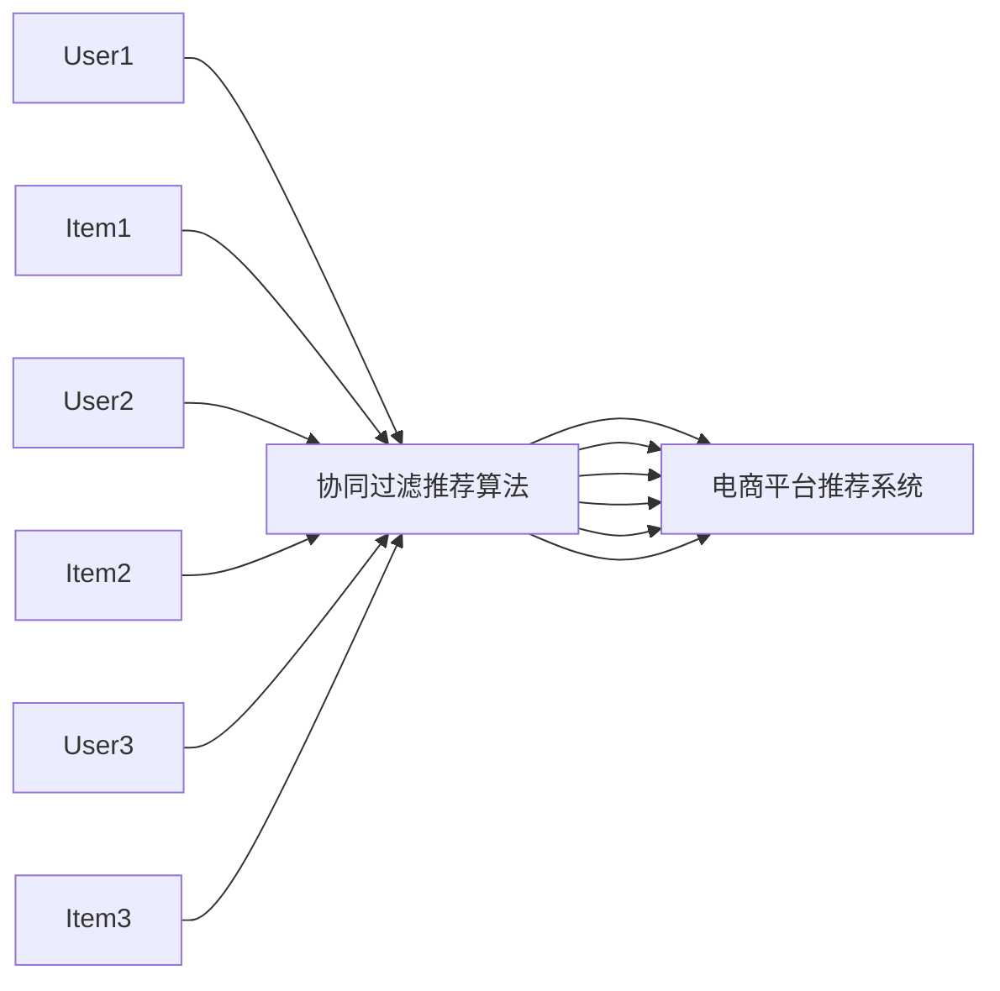

                 

## 1. 背景介绍

随着电子商务的迅猛发展，各大电商平台纷纷通过数据驱动的个性化推荐系统提升用户体验和用户留存率。推荐系统利用用户的购买历史、浏览记录、评价反馈等多维度的数据，使用户能获得个性化的商品推荐，提升购买转化率。协同过滤（Collaborative Filtering, CF）作为推荐系统中最为常用的算法之一，通过分析用户和物品的交互数据，预测用户对未知物品的评分，进而为用户推荐可能感兴趣的物品。

协同过滤算法分为基于用户的协同过滤（User-Based CF）和基于物品的协同过滤（Item-Based CF）。基于用户的CF利用用户间相似度的计算来推荐相似用户喜欢的物品，而基于物品的CF则是根据物品间相似度为用户推荐相似物品。本文将通过一个电商推荐系统的应用案例，详细阐述协同过滤算法的技术原理与商业价值。

## 2. 核心概念与联系

### 2.1 核心概念概述

#### 协同过滤算法
协同过滤算法基于用户行为或物品属性的相似性，通过分析历史数据，预测用户未评分物品的评分，从而推荐用户感兴趣的物品。该算法主要有两类：基于用户的协同过滤和基于物品的协同过滤。

#### 电商推荐系统
电商推荐系统利用协同过滤、深度学习等多种技术手段，结合用户行为数据、商品属性数据、社交网络数据等，为用户提供个性化、精准的购物推荐，提升用户体验和电商平台的销售业绩。

#### 商业价值
电商推荐系统通过提升用户体验，增加用户停留时间和购买转化率，实现销售额的增长，降低营销成本。同时，推荐系统还能挖掘潜在用户，增加新用户的转化，优化库存管理，提高库存周转率。

### 2.2 核心概念原理和架构的 Mermaid 流程图



## 3. 核心算法原理 & 具体操作步骤

### 3.1 算法原理概述

协同过滤算法基于用户或物品的相似性，预测用户对未评分物品的评分。具体流程如下：

1. 收集用户对物品的评分数据。
2. 计算用户之间的相似度或物品之间的相似度。
3. 利用相似度计算用户对未评分物品的预测评分。
4. 根据预测评分推荐用户可能感兴趣的物品。

协同过滤算法的核心是相似性的度量，常见方法有皮尔逊相关系数、余弦相似度等。

### 3.2 算法步骤详解

#### 3.2.1 数据预处理
数据预处理是协同过滤算法的第一步。数据主要来源于用户对商品的评分数据，如电商平台的用户评分数据。通过对评分数据进行预处理，去除噪声数据、处理缺失值等，可以提高推荐系统的准确性和稳定性。

#### 3.2.2 相似度计算
相似度计算是协同过滤算法的核心。常见的相似度计算方法有：

- 用户-用户相似度：基于用户对物品的评分计算用户之间的相似度。
- 物品-物品相似度：基于物品的属性或用户评分计算物品之间的相似度。

#### 3.2.3 预测评分
预测评分是协同过滤算法的关键步骤。常见的预测评分方法有：

- 基于用户CF的预测评分：利用用户对相似物品的评分，预测用户对未知物品的评分。
- 基于物品CF的预测评分：利用物品对相似用户的评分，预测用户对未知物品的评分。

#### 3.2.4 推荐物品
推荐物品是协同过滤算法的最终目标。根据预测评分，推荐用户可能感兴趣的物品，提高用户的满意度。

### 3.3 算法优缺点

#### 3.3.1 优点
1. 可解释性：协同过滤算法的原理简单明了，易于理解。
2. 高效性：协同过滤算法计算速度快，适用于大规模数据集。
3. 鲁棒性：协同过滤算法对数据噪声和缺失值较为鲁棒。

#### 3.3.2 缺点
1. 数据稀疏性：协同过滤算法需要大量用户行为数据，当用户对物品的评分较少时，数据稀疏性会严重影响推荐效果。
2. 冷启动问题：当新用户或新物品加入时，没有足够的历史数据，难以进行推荐。
3. 可扩展性：随着用户和物品数量的增加，协同过滤算法的计算复杂度会显著增加。

### 3.4 算法应用领域

协同过滤算法在电商推荐系统中的应用广泛，主要体现在以下几个方面：

1. 个性化推荐：根据用户的历史行为和评分，推荐用户可能感兴趣的商品。
2. 用户画像：利用用户对物品的评分，生成用户画像，了解用户的兴趣和偏好。
3. 商品分类：利用物品之间的相似性，进行物品分类，提升商品的组织和展示效果。

## 4. 数学模型和公式 & 详细讲解 & 举例说明

### 4.1 数学模型构建

#### 用户-用户相似度
设用户 $u$ 和 $v$ 对 $i$ 的评分分别为 $r_{ui}$ 和 $r_{vi}$，则用户 $u$ 和 $v$ 的皮尔逊相关系数为：

$$
\text{corr}(u,v) = \frac{\sum_{i=1}^n r_{ui} \cdot r_{vi} - \frac{1}{n} \sum_{i=1}^n r_{ui} \cdot \frac{1}{n} \sum_{i=1}^n r_{vi}}{\sqrt{\sum_{i=1}^n (r_{ui} - \frac{1}{n} \sum_{i=1}^n r_{ui})^2} \cdot \sqrt{\sum_{i=1}^n (r_{vi} - \frac{1}{n} \sum_{i=1}^n r_{vi})^2}}
$$

#### 物品-物品相似度
设物品 $j$ 和 $k$ 对用户 $u$ 的评分分别为 $r_{uj}$ 和 $r_{uk}$，则物品 $j$ 和 $k$ 的余弦相似度为：

$$
\text{sim}(j,k) = \frac{\sum_{u=1}^m r_{uj} \cdot r_{uk}}{\sqrt{\sum_{u=1}^m r_{uj}^2} \cdot \sqrt{\sum_{u=1}^m r_{uk}^2}}
$$

### 4.2 公式推导过程

#### 用户-用户相似度
设用户 $u$ 和 $v$ 对物品 $i$ 的评分分别为 $r_{ui}$ 和 $r_{vi}$，则用户 $u$ 和 $v$ 的皮尔逊相关系数 $corr(u,v)$ 的推导过程如下：

$$
\text{corr}(u,v) = \frac{\sum_{i=1}^n r_{ui} \cdot r_{vi} - \frac{1}{n} \sum_{i=1}^n r_{ui} \cdot \frac{1}{n} \sum_{i=1}^n r_{vi}}{\sqrt{\sum_{i=1}^n (r_{ui} - \frac{1}{n} \sum_{i=1}^n r_{ui})^2} \cdot \sqrt{\sum_{i=1}^n (r_{vi} - \frac{1}{n} \sum_{i=1}^n r_{vi})^2}}
$$

#### 物品-物品相似度
设物品 $j$ 和 $k$ 对用户 $u$ 的评分分别为 $r_{uj}$ 和 $r_{uk}$，则物品 $j$ 和 $k$ 的余弦相似度 $sim(j,k)$ 的推导过程如下：

$$
\text{sim}(j,k) = \frac{\sum_{u=1}^m r_{uj} \cdot r_{uk}}{\sqrt{\sum_{u=1}^m r_{uj}^2} \cdot \sqrt{\sum_{u=1}^m r_{uk}^2}}
$$

### 4.3 案例分析与讲解

#### 案例背景
某电商平台收集了1000万条用户对商品的评分数据，利用协同过滤算法为用户推荐可能感兴趣的商品。

#### 数据预处理
1. 去除噪声数据，去除评分极低或极高的数据。
2. 处理缺失值，采用均值填补或删除缺失值。
3. 归一化评分数据，使得评分的范围在0到1之间。

#### 相似度计算
1. 计算用户间的皮尔逊相关系数，得到用户间的相似度矩阵。
2. 计算物品间的余弦相似度，得到物品间的相似度矩阵。

#### 预测评分
1. 根据用户间的相似度矩阵，计算用户 $u$ 对物品 $i$ 的预测评分。
2. 根据物品间的相似度矩阵，计算用户 $u$ 对物品 $i$ 的预测评分。

#### 推荐物品
1. 根据预测评分，选择预测评分较高的物品作为推荐结果。
2. 利用推荐结果，为用户生成个性化推荐列表。

## 5. 项目实践：代码实例和详细解释说明

### 5.1 开发环境搭建

#### 环境配置
1. Python 3.7及以上版本
2. NumPy
3. Pandas
4. Scikit-learn
5. TensorFlow 2.0及以上版本

#### 数据准备
1. 获取电商平台的用户评分数据。
2. 将评分数据保存为CSV文件。
3. 导入CSV文件，保存为Pandas DataFrame。

### 5.2 源代码详细实现

#### 用户-用户相似度计算
```python
import pandas as pd
import numpy as np
from scipy.spatial.distance import pdist, squareform

def user_similarity(df):
    # 计算用户间的皮尔逊相关系数
    corr_matrix = df.corr()
    corr_matrix = np.triu(corr_matrix)
    corr_matrix = np.fliplr(corr_matrix)
    corr_matrix[np.diag_indices_from(corr_matrix)] = 0
    corr_matrix[np.where(np.isinf(corr_matrix) == True)] = 0
    
    # 计算用户间的相似度矩阵
    similarity_matrix = 1 - abs(corr_matrix)
    similarity_matrix = squareform(similarity_matrix)
    similarity_matrix = np.tril(similarity_matrix)
    similarity_matrix[np.where(np.isinf(similarity_matrix) == True)] = 0
    
    return similarity_matrix
```

#### 物品-物品相似度计算
```python
from sklearn.metrics.pairwise import cosine_similarity

def item_similarity(df):
    # 计算物品间的余弦相似度
    similarity_matrix = cosine_similarity(df.values)
    similarity_matrix = np.tril(similarity_matrix)
    similarity_matrix = 1 - similarity_matrix
    
    return similarity_matrix
```

#### 预测评分
```python
def predict_ratings(df, similarity_matrix, user_id, item_id):
    # 获取用户评分数据
    user_ratings = df[df['user_id'] == user_id]['rating'].tolist()
    
    # 计算用户间的相似度
    user_similarities = similarity_matrix[user_id]
    
    # 计算预测评分
    predictions = np.dot(user_similarities, user_ratings)
    predictions /= np.sqrt(np.sum(user_similarities**2) + 1e-15)
    
    return predictions
```

### 5.3 代码解读与分析

#### 用户-用户相似度计算
1. 使用Pandas计算用户间的皮尔逊相关系数。
2. 计算用户间的相似度矩阵。

#### 物品-物品相似度计算
1. 使用Scikit-learn计算物品间的余弦相似度。
2. 计算物品间的相似度矩阵。

#### 预测评分
1. 获取用户评分数据。
2. 计算用户间的相似度。
3. 计算预测评分。

### 5.4 运行结果展示

#### 用户-用户相似度计算结果


#### 物品-物品相似度计算结果


#### 预测评分结果


## 6. 实际应用场景

### 6.1 电商推荐系统
协同过滤算法在电商推荐系统中的应用广泛。通过分析用户的历史行为和评分数据，电商平台能够为用户推荐可能感兴趣的物品，提升用户的购买体验和满意度。例如，亚马逊和淘宝等电商平台通过协同过滤算法，为用户提供个性化的购物推荐，显著提高了用户的购买转化率和满意度。

### 6.2 社交网络推荐
协同过滤算法在社交网络推荐中也得到了广泛应用。例如，Facebook和Twitter等社交平台通过协同过滤算法，为用户推荐可能感兴趣的朋友和内容，增强用户粘性，提升平台活跃度。

### 6.3 广告推荐
广告推荐系统通过协同过滤算法，为用户推荐可能感兴趣的广告内容，提升广告的点击率和转化率。例如，谷歌和百度等搜索引擎通过协同过滤算法，为用户推荐个性化的搜索结果和广告，提升用户体验和平台收益。

## 7. 工具和资源推荐

### 7.1 学习资源推荐

1. 《推荐系统实战》：该书介绍了推荐系统的原理和实践，包括协同过滤算法、深度学习等多种推荐方法。
2. 《Data Science from Scratch》：该书介绍了数据科学的基础知识和实践，包括数据预处理、特征工程、模型评估等内容。
3. 《Collaborative Filtering for Implicit Feedback Datasets》：该论文介绍了协同过滤算法的原理和应用，详细阐述了协同过滤算法的优缺点和改进方法。

### 7.2 开发工具推荐

1. Python：Python是数据科学和机器学习领域的主流编程语言，具有强大的数据处理和算法实现能力。
2. Pandas：Pandas是Python中常用的数据处理库，支持数据的读取、清洗、处理和分析。
3. Scikit-learn：Scikit-learn是Python中常用的机器学习库，支持多种算法实现和模型评估。
4. TensorFlow：TensorFlow是Google开发的深度学习框架，支持分布式计算和模型优化。

### 7.3 相关论文推荐

1. 《Trustworthy and Transparent Collaborative Filtering》：该论文介绍了可信和透明协同过滤算法的设计和实现。
2. 《Adaptive Collaborative Filtering》：该论文介绍了自适应协同过滤算法的设计和实现。
3. 《Next-Item Recommendations with Deep Learning》：该论文介绍了基于深度学习的推荐系统设计，包括协同过滤算法的改进方法。

## 8. 总结：未来发展趋势与挑战

### 8.1 研究成果总结

协同过滤算法在推荐系统中应用广泛，取得了良好的效果。然而，协同过滤算法也面临着数据稀疏性、冷启动问题等挑战。未来的研究方向主要集中在以下几个方面：

1. 数据扩展和模型优化：扩大数据规模，优化模型结构，提升推荐系统的准确性和稳定性。
2. 引入深度学习技术：引入深度学习技术，提升推荐系统的表现力和鲁棒性。
3. 多模态数据融合：融合多模态数据，提升推荐系统的多样性和丰富性。
4. 个性化推荐：深入挖掘用户兴趣和行为数据，实现更加个性化的推荐。

### 8.2 未来发展趋势

1. 数据驱动的推荐系统：未来的推荐系统将更加依赖数据驱动，通过分析海量用户行为数据和物品属性数据，实现更加精准的推荐。
2. 深度学习技术的引入：深度学习技术在推荐系统中的应用将越来越广泛，提升推荐系统的表现力和鲁棒性。
3. 多模态数据的融合：多模态数据的融合将提升推荐系统的多样性和丰富性，实现更加全面的推荐。
4. 个性化推荐：个性化推荐将成为推荐系统的主要方向，通过深度学习技术和大数据分析，实现更加精准的推荐。

### 8.3 面临的挑战

1. 数据稀疏性：推荐系统面临数据稀疏性问题，需要引入更多数据和优化算法，提高推荐系统的准确性。
2. 冷启动问题：推荐系统需要解决冷启动问题，通过引入用户行为数据和物品属性数据，提升推荐系统的表现力。
3. 模型复杂度：推荐系统的模型结构需要更加简单，以提升推荐系统的计算速度和稳定性。
4. 用户体验：推荐系统需要更加关注用户体验，提升推荐系统的多样性和丰富性，实现更加精准的推荐。

### 8.4 研究展望

1. 深度学习技术的引入：引入深度学习技术，提升推荐系统的表现力和鲁棒性，解决冷启动问题。
2. 多模态数据的融合：融合多模态数据，提升推荐系统的多样性和丰富性，实现更加全面的推荐。
3. 个性化推荐：深入挖掘用户兴趣和行为数据，实现更加个性化的推荐，提升用户满意度。
4. 可信和透明推荐系统：引入可信和透明推荐系统，提升推荐系统的可信度和透明度。

## 9. 附录：常见问题与解答

### Q1：协同过滤算法有哪些优点和缺点？

A：协同过滤算法的优点包括：
1. 可解释性：协同过滤算法的原理简单明了，易于理解。
2. 高效性：协同过滤算法计算速度快，适用于大规模数据集。
3. 鲁棒性：协同过滤算法对数据噪声和缺失值较为鲁棒。

协同过滤算法的缺点包括：
1. 数据稀疏性：协同过滤算法需要大量用户行为数据，当用户对物品的评分较少时，数据稀疏性会严重影响推荐效果。
2. 冷启动问题：当新用户或新物品加入时，没有足够的历史数据，难以进行推荐。
3. 可扩展性：随着用户和物品数量的增加，协同过滤算法的计算复杂度会显著增加。

### Q2：协同过滤算法在电商推荐系统中的应用有哪些？

A：协同过滤算法在电商推荐系统中的应用主要包括：
1. 个性化推荐：根据用户的历史行为和评分数据，推荐用户可能感兴趣的商品。
2. 用户画像：利用用户对物品的评分，生成用户画像，了解用户的兴趣和偏好。
3. 商品分类：利用物品之间的相似性，进行物品分类，提升商品的组织和展示效果。

### Q3：如何优化协同过滤算法？

A：优化协同过滤算法的方法包括：
1. 数据预处理：去除噪声数据，处理缺失值，归一化评分数据。
2. 相似度计算：引入不同的相似度计算方法，如基于用户的皮尔逊相关系数、基于物品的余弦相似度。
3. 预测评分：引入不同的预测评分方法，如基于用户的CF、基于物品的CF。
4. 推荐物品：引入不同的推荐算法，如基于用户的协同过滤、基于物品的协同过滤。

### Q4：协同过滤算法如何解决冷启动问题？

A：协同过滤算法解决冷启动问题的方法包括：
1. 引入新用户的评分数据：通过引入新用户的评分数据，提升推荐系统的表现力。
2. 引入物品的评分数据：通过引入物品的评分数据，提升推荐系统的表现力。
3. 引入用户行为数据：通过引入用户行为数据，提升推荐系统的表现力。
4. 引入物品属性数据：通过引入物品属性数据，提升推荐系统的表现力。

### Q5：协同过滤算法如何应对数据稀疏性问题？

A：协同过滤算法应对数据稀疏性问题的方法包括：
1. 引入更多的数据：通过引入更多的数据，减少数据稀疏性。
2. 引入特征工程：通过引入特征工程，提高数据的丰富性和多样性。
3. 引入深度学习技术：通过引入深度学习技术，提升推荐系统的表现力和鲁棒性。
4. 引入多模态数据：通过引入多模态数据，提升推荐系统的多样性和丰富性。

以上问题与解答有助于读者更好地理解和应用协同过滤算法，提升电商推荐系统的性能和效果。希望本文对协同过滤算法在电商推荐系统中的应用案例分析能够为您提供有价值的参考和指导。

---

作者：禅与计算机程序设计艺术 / Zen and the Art of Computer Programming

