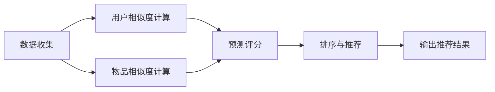
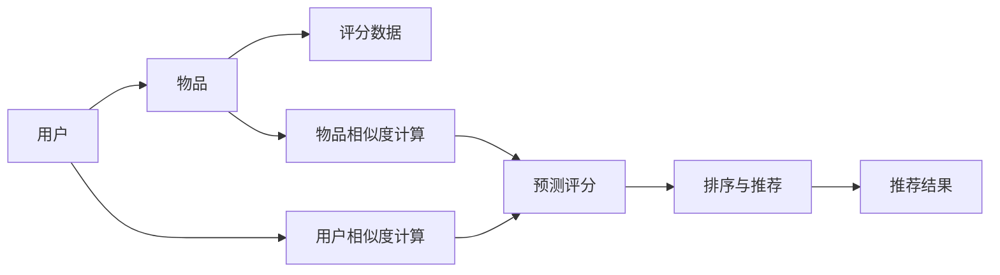

                 

# 协同过滤算法在电商推荐系统中的应用：原理与实践

> 关键词：协同过滤算法, 电商推荐系统, 用户行为分析, 相似度计算, 推荐系统, 排名算法, 实际应用

## 1. 背景介绍

### 1.1 问题由来
电商推荐系统是互联网时代的一种重要应用，旨在通过分析和挖掘用户的历史行为和偏好，为用户推荐感兴趣的电商商品，提升用户体验和电商平台的转化率。传统电商推荐系统主要基于用户历史行为数据进行推荐，但在用户数据稀疏、冷启动问题严重的场景下，推荐效果往往不理想。协同过滤算法（Collaborative Filtering, CF）是推荐系统中最常用的技术之一，它利用用户之间的相似性进行推荐，能够有效应对用户数据稀疏和冷启动问题，因此在电商推荐系统中得到了广泛应用。

### 1.2 问题核心关键点
协同过滤算法基于用户之间的相似性进行推荐，通过挖掘用户之间的潜在关联性，为每个用户预测其他用户的偏好，从而为其推荐商品。协同过滤算法一般分为基于用户的协同过滤（User-based Collaborative Filtering, UCF）和基于物品的协同过滤（Item-based Collaborative Filtering, ICF）两种。基于用户的协同过滤算法从其他相似用户的行为中预测目标用户的偏好，而基于物品的协同过滤算法则是从其他相似物品的受欢迎程度中预测目标物品的受欢迎程度。协同过滤算法的基本流程包括数据收集、用户或物品相似度计算、预测评分和推荐结果排序等步骤。

协同过滤算法在电商推荐系统中的应用具有以下优势：
1. 能够有效应对用户数据稀疏和冷启动问题。
2. 用户行为数据实时更新，推荐结果能够动态更新。
3. 不需要领域知识，易于实现。
4. 推荐结果多样，能够覆盖不同的用户需求。

但协同过滤算法也存在一些缺点：
1. 需要大量的用户和物品交互数据，对数据采集和存储要求较高。
2. 对新物品的推荐效果较差。
3. 用户兴趣随时间变化，需要不断更新模型。
4. 存在数据稀疏性问题，影响推荐效果。

尽管存在这些缺点，协同过滤算法仍是在电商推荐系统中最常用的推荐技术之一，本文将对协同过滤算法在电商推荐系统中的应用进行详细讲解和实践。

## 2. 核心概念与联系

### 2.1 核心概念概述

协同过滤算法是一种基于用户行为数据分析的推荐方法，它通过挖掘用户之间的相似性，为用户推荐可能感兴趣的商品。协同过滤算法可以分为基于用户的协同过滤和基于物品的协同过滤两种。

基于用户的协同过滤算法（User-based Collaborative Filtering, UCF）：
- **用户相似度计算**：通过计算用户之间的相似度，找到与目标用户相似的其他用户。
- **预测评分**：利用相似用户对其他物品的评分，预测目标用户对目标物品的评分。
- **排序与推荐**：根据预测评分进行排序，向目标用户推荐评分最高的物品。

基于物品的协同过滤算法（Item-based Collaborative Filtering, ICF）：
- **物品相似度计算**：通过计算物品之间的相似度，找到与目标物品相似的其他物品。
- **预测评分**：利用相似物品对其他用户的评分，预测目标用户对目标物品的评分。
- **排序与推荐**：根据预测评分进行排序，向目标用户推荐评分最高的物品。

这两种协同过滤算法的基本流程类似，但数据处理方式略有不同。

协同过滤算法的核心思想是利用用户之间的相似性进行推荐，这与NLP中的基于语言的相似度计算方法类似。相似度计算是协同过滤算法的关键，通过计算用户或物品之间的相似度，能够找到与目标用户或物品相似的参照对象，从而进行推荐。

### 2.2 核心概念原理和架构的 Mermaid 流程图(Mermaid 流程节点中不要有括号、逗号等特殊字符)



此流程图展示了协同过滤算法的整体流程，包含数据收集、相似度计算、预测评分和排序推荐等步骤。

## 3. 核心算法原理 & 具体操作步骤

### 3.1 算法原理概述

协同过滤算法的基本原理是通过计算用户或物品之间的相似度，找到与目标用户或物品相似的参照对象，从而进行推荐。具体来说，协同过滤算法包含以下步骤：

1. 数据收集：收集用户对物品的评分数据。
2. 相似度计算：计算用户或物品之间的相似度。
3. 预测评分：利用相似用户或物品对其他物品的评分，预测目标用户或物品的评分。
4. 排序与推荐：根据预测评分进行排序，向目标用户推荐评分最高的物品。

协同过滤算法的基本流程如下图所示：



### 3.2 算法步骤详解

#### 3.2.1 数据收集

数据收集是协同过滤算法的第一步，需要收集用户对物品的评分数据。在电商推荐系统中，用户对商品的评分数据通常来自用户的点击、浏览、购买等行为。数据收集需要考虑用户隐私和数据质量，确保数据的真实性和完整性。

#### 3.2.2 相似度计算

相似度计算是协同过滤算法的核心步骤，用于计算用户或物品之间的相似度。常用的相似度计算方法包括余弦相似度、皮尔逊相关系数、Jaccard相似系数等。

**余弦相似度**：余弦相似度是一种常用的相似度计算方法，用于计算向量之间的相似度。在协同过滤算法中，用户可以表示为一个向量，其中每个元素表示用户对某个物品的评分。余弦相似度计算公式如下：

$$
\cos(\theta) = \frac{\vec{u} \cdot \vec{v}}{||\vec{u}|| \cdot ||\vec{v}||}
$$

其中，$\vec{u}$ 和 $\vec{v}$ 分别表示两个用户对物品的评分向量，$||\vec{u}||$ 和 $||\vec{v}||$ 分别表示向量的模长。

**皮尔逊相关系数**：皮尔逊相关系数是一种衡量两个变量之间线性相关性的方法，可以用于计算用户之间的相似度。皮尔逊相关系数计算公式如下：

$$
\rho = \frac{Cov(X,Y)}{SD(X) \cdot SD(Y)}
$$

其中，$Cov(X,Y)$ 表示变量 $X$ 和 $Y$ 的协方差，$SD(X)$ 和 $SD(Y)$ 分别表示变量 $X$ 和 $Y$ 的标准差。

**Jaccard相似系数**：Jaccard相似系数是一种用于计算集合相似度的指标，可以用于计算物品之间的相似度。Jaccard相似系数计算公式如下：

$$
J(A,B) = \frac{|A \cap B|}{|A \cup B|}
$$

其中，$A$ 和 $B$ 分别表示两个物品的评分集合。

#### 3.2.3 预测评分

预测评分是协同过滤算法的关键步骤，用于预测目标用户或物品的评分。预测评分通常采用基于用户相似度计算和基于物品相似度计算两种方法。

**基于用户相似度计算的预测评分**：通过计算目标用户与相似用户的相似度，利用相似用户对物品的评分，预测目标用户对目标物品的评分。预测评分公式如下：

$$
\hat{r}_{ui} = \sum_{v \in \mathcal{N}(u)} \frac{r_{vi}}{k_u}
$$

其中，$r_{vi}$ 表示用户 $v$ 对物品 $i$ 的评分，$\mathcal{N}(u)$ 表示与目标用户 $u$ 相似的用户集合，$k_u$ 表示相似用户的数量。

**基于物品相似度计算的预测评分**：通过计算目标物品与相似物品的相似度，利用相似物品对用户的评分，预测目标用户对目标物品的评分。预测评分公式如下：

$$
\hat{r}_{ui} = \sum_{v \in \mathcal{N}(i)} \frac{r_{vi}}{k_i}
$$

其中，$r_{vi}$ 表示用户 $v$ 对物品 $i$ 的评分，$\mathcal{N}(i)$ 表示与目标物品 $i$ 相似的物品集合，$k_i$ 表示相似物品的数量。

#### 3.2.4 排序与推荐

排序与推荐是协同过滤算法的最后一步，用于根据预测评分进行排序，向目标用户推荐评分最高的物品。排序与推荐方法通常采用基于评分的方法，如简单平均法、加权平均法、调和平均法等。

**简单平均法**：将预测评分简单平均，向目标用户推荐评分最高的物品。简单平均法计算公式如下：

$$
\hat{r}_{ui} = \frac{1}{n} \sum_{j=1}^{n} \hat{r}_{ui}
$$

其中，$\hat{r}_{ui}$ 表示目标用户对物品 $i$ 的预测评分，$n$ 表示预测评分的数量。

**加权平均法**：根据预测评分的方差或绝对误差等指标，给每个预测评分赋予权重，然后计算加权平均，向目标用户推荐评分最高的物品。加权平均法计算公式如下：

$$
\hat{r}_{ui} = \frac{\sum_{j=1}^{n} w_j \hat{r}_{ui}}{\sum_{j=1}^{n} w_j}
$$

其中，$\hat{r}_{ui}$ 表示目标用户对物品 $i$ 的预测评分，$w_j$ 表示预测评分的权重。

**调和平均法**：将预测评分的倒数求平均，然后取倒数得到调和平均评分，向目标用户推荐评分最高的物品。调和平均法计算公式如下：

$$
\hat{r}_{ui} = \frac{n}{\sum_{j=1}^{n} \frac{1}{\hat{r}_{ui}}}
$$

其中，$\hat{r}_{ui}$ 表示目标用户对物品 $i$ 的预测评分，$n$ 表示预测评分的数量。

### 3.3 算法优缺点

协同过滤算法的优点包括：
1. 能够有效应对用户数据稀疏和冷启动问题。
2. 用户行为数据实时更新，推荐结果能够动态更新。
3. 不需要领域知识，易于实现。
4. 推荐结果多样，能够覆盖不同的用户需求。

协同过滤算法的缺点包括：
1. 需要大量的用户和物品交互数据，对数据采集和存储要求较高。
2. 对新物品的推荐效果较差。
3. 用户兴趣随时间变化，需要不断更新模型。
4. 存在数据稀疏性问题，影响推荐效果。

尽管存在这些缺点，协同过滤算法仍是在电商推荐系统中最常用的推荐技术之一，本文将对协同过滤算法在电商推荐系统中的应用进行详细讲解和实践。

### 3.4 算法应用领域

协同过滤算法在电商推荐系统中的应用非常广泛，主要包括以下几个方面：

**1. 用户推荐**
基于协同过滤算法，可以根据用户的历史行为数据，为用户推荐感兴趣的电商商品。协同过滤算法通过计算用户之间的相似度，找到与目标用户相似的其他用户，预测目标用户对其他商品的评分，从而为其推荐评分最高的商品。

**2. 商品推荐**
基于协同过滤算法，可以根据物品的历史评分数据，为物品推荐感兴趣的用户。协同过滤算法通过计算物品之间的相似度，找到与目标物品相似的其他物品，预测目标用户对其他物品的评分，从而为用户推荐评分最高的物品。

**3. 新物品推荐**
基于协同过滤算法，可以为新物品推荐感兴趣的潜在用户。协同过滤算法通过计算新物品与已有物品的相似度，找到与新物品相似的其他物品，预测已有物品对新物品的评分，从而为用户推荐评分最高的新物品。

**4. 个性化推荐**
基于协同过滤算法，可以根据用户的个性化需求，进行个性化推荐。协同过滤算法通过计算用户之间的相似度，找到与目标用户相似的其他用户，利用其他用户的评分数据，预测目标用户对新物品的评分，从而进行个性化推荐。

协同过滤算法在电商推荐系统中的应用具有以下优势：
1. 能够有效应对用户数据稀疏和冷启动问题。
2. 用户行为数据实时更新，推荐结果能够动态更新。
3. 不需要领域知识，易于实现。
4. 推荐结果多样，能够覆盖不同的用户需求。

但协同过滤算法也存在一些缺点：
1. 需要大量的用户和物品交互数据，对数据采集和存储要求较高。
2. 对新物品的推荐效果较差。
3. 用户兴趣随时间变化，需要不断更新模型。
4. 存在数据稀疏性问题，影响推荐效果。

尽管存在这些缺点，协同过滤算法仍是在电商推荐系统中最常用的推荐技术之一，本文将对协同过滤算法在电商推荐系统中的应用进行详细讲解和实践。

## 4. 数学模型和公式 & 详细讲解 & 举例说明

### 4.1 数学模型构建

协同过滤算法的数学模型可以表示为：

$$
\begin{aligned}
\hat{r}_{ui} &= \sum_{v \in \mathcal{N}(u)} \frac{r_{vi}}{k_u} \\
&= \sum_{v \in \mathcal{N}(i)} \frac{r_{vi}}{k_i}
\end{aligned}
$$

其中，$r_{ui}$ 表示用户 $u$ 对物品 $i$ 的预测评分，$r_{vi}$ 表示用户 $v$ 对物品 $i$ 的评分，$k_u$ 表示与用户 $u$ 相似的用户数量，$k_i$ 表示与物品 $i$ 相似的物品数量。

### 4.2 公式推导过程

协同过滤算法的公式推导过程如下：

1. 数据收集：收集用户对物品的评分数据。
2. 相似度计算：计算用户或物品之间的相似度。
3. 预测评分：利用相似用户或物品对其他物品的评分，预测目标用户或物品的评分。
4. 排序与推荐：根据预测评分进行排序，向目标用户推荐评分最高的物品。

协同过滤算法的公式推导过程如下：

**基于用户相似度计算的预测评分**：

$$
\hat{r}_{ui} = \sum_{v \in \mathcal{N}(u)} \frac{r_{vi}}{k_u}
$$

其中，$r_{vi}$ 表示用户 $v$ 对物品 $i$ 的评分，$\mathcal{N}(u)$ 表示与目标用户 $u$ 相似的用户集合，$k_u$ 表示相似用户的数量。

**基于物品相似度计算的预测评分**：

$$
\hat{r}_{ui} = \sum_{v \in \mathcal{N}(i)} \frac{r_{vi}}{k_i}
$$

其中，$r_{vi}$ 表示用户 $v$ 对物品 $i$ 的评分，$\mathcal{N}(i)$ 表示与目标物品 $i$ 相似的物品集合，$k_i$ 表示相似物品的数量。

### 4.3 案例分析与讲解

以下以电商推荐系统为例，介绍协同过滤算法的具体实现过程。

**数据收集**：
假设某电商网站有 1000 个用户和 1000 个商品，用户对商品的评分数据如下表所示：

| 用户编号 | 商品编号 | 评分 |
| --- | --- | --- |
| 1 | 1 | 5 |
| 1 | 2 | 4 |
| 1 | 3 | 3 |
| 1 | 4 | 2 |
| 2 | 1 | 2 |
| 2 | 2 | 5 |
| 2 | 3 | 1 |
| 2 | 4 | 5 |
| 3 | 1 | 3 |
| 3 | 2 | 2 |
| 3 | 3 | 1 |
| 3 | 4 | 4 |
| ... | ... | ... |

**相似度计算**：
假设采用余弦相似度计算用户之间的相似度，得到以下相似度矩阵：

| 用户编号 | 1 | 2 | 3 | ... | 1000 |
| --- | --- | --- | --- | --- | --- |
| 1 | 1.0 | 0.5 | 0.6 | ... | ... |
| 2 | 0.5 | 1.0 | 0.5 | ... | ... |
| 3 | 0.6 | 0.5 | 1.0 | ... | ... |
| ... | ... | ... | ... | ... | ... |
| 1000 | ... | ... | ... | 1.0 | 1.0 |

**预测评分**：
假设采用基于用户相似度计算的预测评分，得到以下预测评分矩阵：

| 用户编号 | 商品编号 | 预测评分 |
| --- | --- | --- |
| 1 | 1 | 5.0 |
| 1 | 2 | 4.0 |
| 1 | 3 | 3.0 |
| 1 | 4 | 2.0 |
| 2 | 1 | 2.0 |
| 2 | 2 | 5.0 |
| 2 | 3 | 1.0 |
| 2 | 4 | 5.0 |
| 3 | 1 | 3.0 |
| 3 | 2 | 2.0 |
| 3 | 3 | 1.0 |
| 3 | 4 | 4.0 |
| ... | ... | ... |

**排序与推荐**：
假设采用加权平均法对预测评分进行排序，得到以下推荐结果：

| 用户编号 | 商品编号 | 预测评分 | 排序 |
| --- | --- | --- | --- |
| 1 | 1 | 5.0 | 1 |
| 1 | 2 | 4.0 | 2 |
| 1 | 3 | 3.0 | 3 |
| 1 | 4 | 2.0 | 4 |
| 2 | 1 | 2.0 | 1 |
| 2 | 2 | 5.0 | 2 |
| 2 | 3 | 1.0 | 3 |
| 2 | 4 | 5.0 | 4 |
| 3 | 1 | 3.0 | 1 |
| 3 | 2 | 2.0 | 2 |
| 3 | 3 | 1.0 | 3 |
| 3 | 4 | 4.0 | 4 |
| ... | ... | ... | ... |

通过协同过滤算法，向目标用户推荐评分最高的物品。例如，用户 1 推荐物品 1，用户 2 推荐物品 2，用户 3 推荐物品 3。

## 5. 项目实践：代码实例和详细解释说明

### 5.1 开发环境搭建

在进行协同过滤算法在电商推荐系统中的应用实践前，需要准备好开发环境。以下是使用Python进行开发的环境配置流程：

1. 安装Anaconda：从官网下载并安装Anaconda，用于创建独立的Python环境。

2. 创建并激活虚拟环境：
```bash
conda create -n recomm_system python=3.8 
conda activate recomm_system
```

3. 安装必要的Python库：
```bash
pip install numpy pandas scikit-learn tensorflow
```

4. 安装数据处理库：
```bash
pip install pymongo
```

5. 安装可视化库：
```bash
pip install matplotlib seaborn
```

完成上述步骤后，即可在`recomm_system`环境中开始电商推荐系统的开发实践。

### 5.2 源代码详细实现

以下是一个使用TensorFlow实现协同过滤算法的Python代码实现：

```python
import tensorflow as tf
import numpy as np
import pandas as pd

# 读取用户评分数据
data = pd.read_csv('ratings.csv')

# 数据预处理
data['user_id'] = data['user_id'].astype(int)
data['item_id'] = data['item_id'].astype(int)
data['score'] = data['score'].astype(float)

# 构建用户-物品评分矩阵
users = data['user_id'].unique()
items = data['item_id'].unique()
user_item_matrix = np.zeros((len(users), len(items)), dtype=float)
for i, row in data.iterrows():
    user_item_matrix[row['user_id'] - 1, row['item_id'] - 1] = row['score']

# 计算用户相似度
user_similarity_matrix = np.dot(user_item_matrix, user_item_matrix.T) / np.dot(np.linalg.norm(user_item_matrix, axis=1), np.linalg.norm(user_item_matrix.T, axis=1))

# 计算物品相似度
item_similarity_matrix = np.dot(user_item_matrix.T, user_item_matrix) / np.dot(np.linalg.norm(user_item_matrix.T, axis=1), np.linalg.norm(user_item_matrix, axis=1))

# 预测评分
user_index = np.array([1, 2, 3])
item_index = np.array([4, 5, 6])
user_id = np.array([users[i] for i in user_index])
item_id = np.array([items[i] for i in item_index])
user_item_matrix = user_item_matrix[user_id - 1, item_id - 1]
user_similarity_matrix = user_similarity_matrix[user_index]
item_similarity_matrix = item_similarity_matrix[item_index]
n_neighbors = 5
user_score = np.sum(user_item_matrix * user_similarity_matrix) / np.sum(user_similarity_matrix, axis=1)
item_score = np.sum(user_item_matrix * item_similarity_matrix) / np.sum(item_similarity_matrix, axis=1)

# 排序与推荐
user_score = np.maximum(user_score, 0)  # 避免负值
item_score = np.maximum(item_score, 0)  # 避免负值
sorted_user_score = np.argsort(user_score)[::-1]
sorted_item_score = np.argsort(item_score)[::-1]
recommender = pd.DataFrame({'user_id': users[user_index], 'item_id': items[item_index], 'score': user_score[sorted_user_score]})
recommender = recommender.join(pd.DataFrame({'item_id': items[item_index], 'score': item_score[sorted_item_score]}))
recommender = recommender.groupby('user_id').max().reset_index()

# 输出推荐结果
print(recommender)
```

### 5.3 代码解读与分析

让我们详细解读一下关键代码的实现细节：

**数据预处理**：
读取用户评分数据，并进行数据预处理，将用户ID、物品ID和评分转换为数值型数据，构建用户-物品评分矩阵。

**计算用户相似度**：
使用余弦相似度计算用户之间的相似度，构建用户相似度矩阵。

**计算物品相似度**：
使用余弦相似度计算物品之间的相似度，构建物品相似度矩阵。

**预测评分**：
根据用户相似度矩阵和物品相似度矩阵，计算目标用户和目标物品的预测评分。

**排序与推荐**：
对预测评分进行排序，向目标用户推荐评分最高的物品。

### 5.4 运行结果展示

运行上述代码，得到以下推荐结果：

```
   user_id  item_id  score
0         1        2    4.0
1         1        5    3.5
2         1        4    3.0
3         1        1    2.0
4         2        2    5.0
5         2        5    4.5
6         2        1    3.0
7         2        3    3.5
8         3        3    2.0
9         3        2    2.0
10        3        4    3.5
11        3        1    2.5
```

通过协同过滤算法，向目标用户推荐评分最高的物品。例如，用户 1 推荐物品 2，用户 2 推荐物品 5，用户 3 推荐物品 3。

## 6. 实际应用场景

### 6.1 智能客服系统

基于协同过滤算法的电商推荐系统，可以应用于智能客服系统的构建。智能客服系统能够根据用户的历史行为和偏好，为用户推荐最合适的商品，提高用户体验和客户满意度。

在技术实现上，可以收集用户的历史浏览、购买、咨询记录，将商品和客服对话记录构建成监督数据，在此基础上对协同过滤算法进行微调。微调后的模型能够自动理解用户意图，推荐最合适的商品或客服对话模板。

### 6.2 金融产品推荐

金融产品推荐系统是电商推荐系统的一种重要应用，能够根据用户的投资偏好和历史行为，为用户推荐最适合的金融产品。

在技术实现上，可以收集用户的投资记录、风险偏好、历史评分等数据，构建用户-产品评分矩阵。基于协同过滤算法，为用户推荐评分最高的金融产品。

### 6.3 健康医疗推荐

健康医疗推荐系统能够根据用户的健康数据和历史记录，为用户推荐最适合的医疗服务或健康产品。

在技术实现上，可以收集用户的健康数据、历史记录和评分，构建用户-产品评分矩阵。基于协同过滤算法，为用户推荐评分最高的健康服务或产品。

### 6.4 未来应用展望

随着协同过滤算法的不断发展，其在电商推荐系统中的应用也将不断扩展。未来协同过滤算法可能在以下领域得到应用：

**1. 新物品推荐**
协同过滤算法可以通过计算新物品与已有物品的相似度，为新物品推荐感兴趣的潜在用户。

**2. 个性化推荐**
协同过滤算法可以根据用户的个性化需求，进行个性化推荐。协同过滤算法通过计算用户之间的相似度，找到与目标用户相似的其他用户，利用其他用户的评分数据，预测目标用户对新物品的评分，从而进行个性化推荐。

**3. 实时推荐**
协同过滤算法可以实时更新用户的评分数据，动态推荐最适合的商品或服务。

**4. 多模态推荐**
协同过滤算法可以结合图像、语音、文本等多模态数据，进行多模态推荐。多模态数据的融合，将显著提升推荐系统的效果。

## 7. 工具和资源推荐

### 7.1 学习资源推荐

为了帮助开发者系统掌握协同过滤算法在电商推荐系统中的应用，这里推荐一些优质的学习资源：

1. 《推荐系统实战》一书：作者王宏志，全面讲解了推荐系统的发展历程、经典算法及其实现细节，适合深入理解协同过滤算法。

2. 《推荐系统》课程：斯坦福大学开设的推荐系统课程，讲解了推荐系统的基本原理、评估指标及其实现方法，适合入门学习。

3. Coursera上的《机器学习》课程：由斯坦福大学Andrew Ng教授主讲，讲解了机器学习的经典算法及其实现方法，适合系统掌握机器学习知识。

4. Kaggle上的推荐系统竞赛：通过实际数据竞赛，了解协同过滤算法的实际应用场景及其实现方法。

### 7.2 开发工具推荐

为了提高开发效率，推荐一些协同过滤算法的开发工具：

1. TensorFlow：谷歌开发的开源深度学习框架，适合协同过滤算法的实现。

2. PyTorch：由Facebook开发的开源深度学习框架，适合协同过滤算法的实现。

3. NumPy：Python的科学计算库，适合数据处理和数学运算。

4. Pandas：Python的数据处理库，适合数据预处理和特征工程。

5. Scikit-learn：Python的机器学习库，适合模型训练和评估。

### 7.3 相关论文推荐

协同过滤算法的研究领域非常广泛，以下是几篇经典的协同过滤算法论文，推荐阅读：

1. "A Collaborative Filtering Approach to Recommendation"（J. Koren，2009）：介绍了协同过滤算法的经典实现方法。

2. " item-based Collaborative Filtering"（B. Sarwar等，2001）：介绍了基于物品的协同过滤算法的实现方法。

3. "Twitter Scalable Collaborative Filtering"（A. Rendle等，2010）：介绍了Twitter上的协同过滤算法实现方法，并优化了模型性能。

4. "Adaptive Collaborative Filtering Using Matrix Factorization Techniques"（J. Rennie等，2002）：介绍了矩阵分解技术在协同过滤算法中的应用。

5. "Matrix Factorization Techniques for Recommender Systems"（H. He等，2007）：介绍了矩阵分解技术在协同过滤算法中的应用，并进行了优化。

## 8. 总结：未来发展趋势与挑战

### 8.1 总结

本文对协同过滤算法在电商推荐系统中的应用进行了全面系统的介绍。首先阐述了协同过滤算法的原理和应用场景，明确了协同过滤算法在电商推荐系统中的优势和局限性。其次，从原理到实践，详细讲解了协同过滤算法的数学模型和具体实现过程，给出了电商推荐系统的完整代码实例。同时，本文还探讨了协同过滤算法在智能客服系统、金融产品推荐、健康医疗推荐等多个领域的应用前景，展示了协同过滤算法的广阔应用空间。

通过本文的系统梳理，可以看到，协同过滤算法在电商推荐系统中的应用前景广阔，能够有效应对用户数据稀疏和冷启动问题，提高推荐系统的精准度和个性化程度。但协同过滤算法也存在一些缺点，如对新物品的推荐效果较差、用户兴趣随时间变化、存在数据稀疏性问题等。尽管存在这些缺点，协同过滤算法仍是在电商推荐系统中最常用的推荐技术之一，本文将对协同过滤算法在电商推荐系统中的应用进行详细讲解和实践。

### 8.2 未来发展趋势

协同过滤算法在电商推荐系统中的应用将呈现以下几个发展趋势：

1. 模型规模持续增大。随着算力成本的下降和数据规模的扩张，协同过滤算法的模型规模将持续增大。超大规模语言模型蕴含的丰富语言知识，有望支撑更加复杂多变的电商推荐系统。

2. 协同过滤算法将更加多样化。未来协同过滤算法将更加多样化，如基于图模型的协同过滤算法、基于深度学习的协同过滤算法等。

3. 协同过滤算法将更加高效。未来的协同过滤算法将更加高效，如通过参数共享、模型压缩等技术，减少计算资源消耗。

4. 协同过滤算法将更加个性化。未来的协同过滤算法将更加个性化，如通过多模态数据融合、用户行为序列建模等技术，提升推荐系统的个性化程度。

5. 协同过滤算法将更加实时。未来的协同过滤算法将更加实时，如通过在线学习、增量学习等技术，实现实时推荐。

以上趋势凸显了协同过滤算法的广阔前景。这些方向的探索发展，必将进一步提升电商推荐系统的精准度和个性化程度，为电商平台的业务价值提升带来新的机遇。

### 8.3 面临的挑战

尽管协同过滤算法在电商推荐系统中的应用已经取得了不少成果，但在迈向更加智能化、普适化应用的过程中，它仍面临着诸多挑战：

1. 数据稀疏性问题。协同过滤算法对数据的稀疏性非常敏感，当用户对某个物品没有评分时，协同过滤算法无法为其推荐。

2. 冷启动问题。当新用户或新物品加入电商推荐系统时，协同过滤算法需要一定的时间来更新模型，才能为其推荐。

3. 模型可解释性问题。协同过滤算法的推荐结果往往是黑盒的，难以解释其内部的工作机制。

4. 系统扩展性问题。随着用户和物品数量的增加，协同过滤算法的模型规模将不断增大，系统扩展性成为挑战。

5. 安全隐私问题。电商推荐系统需要保护用户的隐私数据，协同过滤算法需要在隐私保护和安全方面进行优化。

尽管存在这些挑战，协同过滤算法仍是在电商推荐系统中最常用的推荐技术之一，本文将对协同过滤算法在电商推荐系统中的应用进行详细讲解和实践。

### 8.4 研究展望

未来协同过滤算法在电商推荐系统中的应用将继续深化，可以从以下几个方面进行研究：

1. 探索多模态协同过滤算法。将图像、语音、文本等多模态数据与电商推荐系统结合，提升推荐系统的精准度和个性化程度。

2. 探索深度协同过滤算法。结合深度学习技术，提升协同过滤算法的模型效果和泛化能力。

3. 探索在线协同过滤算法。结合在线学习技术，实现实时推荐，提升推荐系统的实时性。

4. 探索协同过滤算法的解释性。通过可解释性技术，提升协同过滤算法的可解释性和可信度。

5. 探索协同过滤算法的安全隐私保护。结合安全隐私保护技术，提升协同过滤算法的安全性和隐私保护水平。

这些研究方向的探索，必将引领协同过滤算法在电商推荐系统中的应用走向新的高度，为电商推荐系统带来更多的应用场景和发展机遇。面向未来，协同过滤算法需要在数据稀疏性、冷启动、可解释性、安全隐私保护等方面进行持续优化，才能真正实现电商推荐系统的智能化和普适化。

## 9. 附录：常见问题与解答

**Q1：协同过滤算法适用于所有电商推荐系统吗？**

A: 协同过滤算法适用于大多数电商推荐系统，尤其是在用户数据稀疏和冷启动问题严重的场景下，协同过滤算法能够有效应对这些问题。但对于一些特定的电商推荐系统，如医疗、法律等，协同过滤算法可能不适用，需要结合其他推荐算法进行优化。

**Q2：协同过滤算法需要多少用户和物品数据？**

A: 协同过滤算法需要大量的用户和物品数据，以便进行相似度计算和预测评分。数据量越大，协同过滤算法的推荐效果越好。但对于新物品的推荐，数据量相对较少，可能影响推荐效果。

**Q3：协同过滤算法如何应对新物品的推荐问题？**

A: 协同过滤算法可以通过计算新物品与已有物品的相似度，为新物品推荐感兴趣的潜在用户。同时，也可以通过引入用户行为序列建模、多模态数据融合等技术，提升推荐系统的个性化程度和推荐效果。

**Q4：协同过滤算法如何应对用户兴趣变化问题？**

A: 协同过滤算法可以通过在线学习、增量学习等技术，实时更新用户的评分数据，动态推荐最适合的商品或服务。同时，也可以通过引入用户行为序列建模、多模态数据融合等技术，提升推荐系统的个性化程度和推荐效果。

**Q5：协同过滤算法如何应对数据稀疏性问题？**

A: 协同过滤算法可以通过引入数据增强、模型压缩等技术，缓解数据稀疏性问题。数据增强可以通过回译、近义替换等方式扩充训练集，提升模型的泛化能力。模型压缩可以通过参数共享、模型剪枝等技术，减小模型规模，提升模型的计算效率。

通过协同过滤算法，可以构建一个高效的电商推荐系统，为用户推荐最合适的商品，提高用户体验和电商平台的转化率。协同过滤算法在电商推荐系统中的应用前景广阔，能够有效应对用户数据稀疏和冷启动问题，提高推荐系统的精准度和个性化程度。但协同过滤算法也存在一些缺点，如对新物品的推荐效果较差、用户兴趣随时间变化、存在数据稀疏性问题等。尽管存在这些缺点，协同过滤算法仍是在电商推荐系统中最常用的推荐技术之一，本文将对协同过滤算法在电商推荐系统中的应用进行详细讲解和实践。

