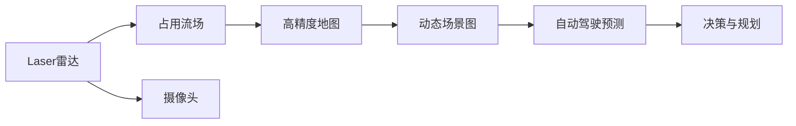

                 

# 占用流场表示法在自动驾驶预测中的应用与改进

> 关键词：占用流场(Occupancy Flow)，自动驾驶预测，高精度地图，实时感知，深度学习

## 1. 背景介绍

### 1.1 问题由来
在自动驾驶领域，如何准确预测车辆和其他交通参与者的位置、速度和行为，是实现安全、高效的自动驾驶系统的关键。传统的基于传感器的定位和感知技术，往往存在数据稀疏、目标遮挡等问题，难以满足高精度和高可靠性的要求。为了提升自动驾驶系统的预测能力，研究人员提出了多种基于场景理解的方法，如基于摄像头和激光雷达的多模态融合技术、基于高精度地图的车辆定位技术等。然而，这些方法通常需要高成本的硬件设备和大量标注数据，且难以实现实时处理，难以满足自动驾驶应用的需求。

为了解决这个问题，研究人员提出了占用流场表示法。占用流场是一种将三维空间映射为二维场景图的技术，可以高效地将激光雷达和摄像头的数据融合为高精度的地图，并实时预测车辆和其他交通参与者的位置和行为。占用流场表示法结合了激光雷达和摄像头数据的高效融合、三维空间的直观表示和实时处理能力，为自动驾驶系统的预测和决策提供了强有力的支持。

### 1.2 问题核心关键点
占用流场表示法在自动驾驶预测中的应用主要体现在以下几个方面：

- **高效融合多模态数据**：占用流场结合了激光雷达和摄像头数据，能够高效地将多模态数据融合为二维场景图，避免了单一传感器数据的不足。
- **高精度地图生成**：占用流场能够生成高精度的地图，实时预测车辆和其他交通参与者的位置和行为，避免了传统方法的数据稀疏和目标遮挡问题。
- **实时处理能力**：占用流场采用并行处理方式，能够实现实时处理，满足自动驾驶系统的实时要求。
- **灵活性**：占用流场表示法灵活性高，适用于各种车辆和道路环境，具有良好的泛化能力。

这些关键点使得占用流场表示法在自动驾驶领域具有广泛的应用前景，成为了自动驾驶预测的重要技术手段。

## 2. 核心概念与联系

### 2.1 核心概念概述

为了更好地理解占用流场表示法，我们需要先介绍几个核心概念：

- **激光雷达**：激光雷达是自动驾驶中常用的传感器之一，可以生成高精度的点云数据，用于环境感知和定位。
- **摄像头**：摄像头可以提供车辆周围环境的实时图像，用于道路特征识别和行为预测。
- **高精度地图**：高精度地图是自动驾驶中不可或缺的组成部分，提供了详细的道路信息，用于车辆定位和路径规划。
- **占用流场**：占用流场是一种将三维空间映射为二维场景图的技术，能够将激光雷达和摄像头的数据融合为高精度的地图，并实时预测车辆和其他交通参与者的位置和行为。
- **动态场景图**：动态场景图是实时更新的二维场景图，能够反映车辆和其他交通参与者的位置和行为变化，用于自动驾驶系统的决策和规划。

这些核心概念之间的逻辑关系可以通过以下Mermaid流程图来展示：



这个流程图展示了占用流场的核心应用流程：

1. 激光雷达和摄像头分别获取点云数据和图像数据。
2. 占用流场将激光雷达和摄像头的数据融合为二维场景图。
3. 动态场景图实时更新，反映车辆和其他交通参与者的位置和行为变化。
4. 动态场景图用于自动驾驶预测，为决策与规划提供支持。

## 3. 核心算法原理 & 具体操作步骤

### 3.1 算法原理概述

占用流场表示法的核心思想是将三维空间映射为二维场景图，通过激光雷达和摄像头的数据融合，生成高精度的地图，并实时预测车辆和其他交通参与者的位置和行为。

占用流场表示法主要分为以下几个步骤：

1. **数据获取**：激光雷达和摄像头分别获取点云数据和图像数据。
2. **数据融合**：将激光雷达和摄像头的数据融合为二维场景图，生成占用流场。
3. **地图生成**：将占用流场转换为高精度地图，用于车辆定位和路径规划。
4. **动态更新**：实时更新动态场景图，反映车辆和其他交通参与者的位置和行为变化。
5. **预测与决策**：根据动态场景图进行预测与决策，生成自动驾驶系统的控制信号。

### 3.2 算法步骤详解

下面详细介绍占用流场表示法的每个步骤：

#### 3.2.1 数据获取

激光雷达和摄像头是占用流场表示法的主要数据源。激光雷达可以生成高精度的点云数据，用于环境感知和定位。摄像头可以提供实时图像，用于道路特征识别和行为预测。

#### 3.2.2 数据融合

数据融合是占用流场表示法的核心步骤之一。常用的数据融合方法包括ICP（迭代最近点）、RANSAC（随机抽样一致性）等。以下以ICP算法为例，介绍数据融合的基本流程：

1. **初始化点云**：将激光雷达生成的点云数据和摄像头获取的图像数据进行初始化。
2. **迭代最近点**：在两个数据集中找到最近点对，根据点对的位置和距离，计算点对的匹配得分。
3. **变换优化**：根据匹配得分，优化点云的变换参数，使得点云对齐。
4. **终止条件**：设置终止条件，当匹配得分达到预设阈值或者迭代次数达到预设值时，停止迭代。

#### 3.2.3 地图生成

将数据融合生成的占用流场转换为高精度地图，用于车辆定位和路径规划。常用的地图生成方法包括TIN（三角化不规则网）、Delaunay三角化等。以下以TIN方法为例，介绍地图生成的基本流程：

1. **点云三角化**：对数据融合生成的点云进行三角化处理，生成二维场景图。
2. **地图压缩**：对二维场景图进行压缩，生成高精度地图。
3. **地图存储**：将高精度地图存储到内存或硬盘中，供后续使用。

#### 3.2.4 动态更新

动态场景图是实时更新的二维场景图，能够反映车辆和其他交通参与者的位置和行为变化。常用的动态更新方法包括时间切片、局部更新等。以下以时间切片为例，介绍动态更新的基本流程：

1. **时间切片**：将时间划分为若干个切片，每个切片生成一个占用流场。
2. **融合数据**：将当前切片和历史切片融合，生成动态场景图。
3. **更新地图**：根据动态场景图，更新高精度地图。
4. **实时处理**：将更新后的高精度地图实时传输到自动驾驶系统中。

#### 3.2.5 预测与决策

根据动态场景图进行预测与决策，生成自动驾驶系统的控制信号。常用的预测与决策方法包括粒子滤波、基于图搜索的路径规划等。以下以粒子滤波为例，介绍预测与决策的基本流程：

1. **粒子滤波**：根据动态场景图，生成多个粒子，对车辆的位置和行为进行预测。
2. **路径规划**：根据预测结果，生成车辆的路径规划方案。
3. **控制信号**：根据路径规划方案，生成自动驾驶系统的控制信号，控制车辆行驶。

### 3.3 算法优缺点

占用流场表示法具有以下优点：

- **高精度地图生成**：占用流场能够生成高精度的地图，实时预测车辆和其他交通参与者的位置和行为，避免了传统方法的数据稀疏和目标遮挡问题。
- **实时处理能力**：占用流场采用并行处理方式，能够实现实时处理，满足自动驾驶系统的实时要求。
- **灵活性**：占用流场表示法灵活性高，适用于各种车辆和道路环境，具有良好的泛化能力。

同时，该方法也存在以下缺点：

- **计算复杂度高**：占用流场表示法计算复杂度高，需要消耗大量的计算资源。
- **数据融合难度大**：激光雷达和摄像头的数据融合难度较大，需要复杂的算法和大量的实验数据。
- **数据获取成本高**：激光雷达和摄像头等设备成本较高，且需要大量标注数据。

尽管存在这些局限性，但就目前而言，占用流场表示法仍是在自动驾驶预测中最具有前景的技术手段之一。未来相关研究的重点在于如何进一步降低计算复杂度，提高数据融合效率，减少对标注数据的依赖，以进一步提升占用流场表示法的性能和实用性。

### 3.4 算法应用领域

占用流场表示法在自动驾驶领域有着广泛的应用，覆盖了各种车辆和道路环境。以下是几个典型的应用场景：

- **高精度地图生成**：占用流场可以用于生成高精度地图，实时更新动态场景图，为自动驾驶系统的定位和路径规划提供支持。
- **实时感知**：占用流场能够实时感知车辆和其他交通参与者的位置和行为，提高自动驾驶系统的安全性。
- **路径规划**：占用流场可以用于路径规划，生成最优路径，提升自动驾驶系统的效率。
- **避障决策**：占用流场能够帮助自动驾驶系统进行避障决策，避免与障碍物碰撞，提升系统的可靠性。

除了上述这些经典应用外，占用流场表示法还可以被创新性地应用到更多场景中，如联合定位、交通流量预测等，为自动驾驶技术带来全新的突破。随着占用流场表示法的不断进步，相信自动驾驶技术将在更广阔的应用领域大放异彩。

## 4. 数学模型和公式 & 详细讲解

### 4.1 数学模型构建

在占用流场表示法中，数学模型的构建至关重要。以下介绍几个核心的数学模型：

#### 4.1.1 占用流场表示

占用流场是一种将三维空间映射为二维场景图的技术，可以用一个二维矩阵 $F(x,y)$ 表示，其中 $x$ 和 $y$ 分别表示二维场景图上的横坐标和纵坐标。

占用流场的值 $F(x,y)$ 表示某个位置是否被占用，取值范围为 $[0,1]$，其中 $0$ 表示未占用，$1$ 表示占用。

#### 4.1.2 数据融合

数据融合是占用流场表示法的核心步骤之一，常用的数据融合方法包括ICP、RANSAC等。以下以ICP算法为例，介绍数据融合的基本数学模型：

1. **点云表示**：激光雷达生成的点云数据可以表示为一个向量 $\mathbf{P}$，其中 $\mathbf{P}=[x,y,z]$。
2. **图像表示**：摄像头获取的图像数据可以表示为一个矩阵 $\mathbf{I}$，其中 $\mathbf{I}$ 为像素值矩阵。
3. **最近点对**：在两个数据集中找到最近点对，根据点对的位置和距离，计算点对的匹配得分。
4. **变换优化**：根据匹配得分，优化点云的变换参数，使得点云对齐。

### 4.2 公式推导过程

以下以ICP算法为例，介绍数据融合的基本公式推导过程：

#### 4.2.1 最近点对

在数据融合中，找到最近点对是关键步骤之一。常用的最近点对算法包括ICP、RANSAC等。以下以ICP算法为例，介绍最近点对的基本公式推导：

设激光雷达生成的点云数据为 $\mathbf{P}$，摄像头获取的图像数据为 $\mathbf{I}$，找到最近点对的基本流程如下：

1. **初始化点云**：将激光雷达生成的点云数据和摄像头获取的图像数据进行初始化。
2. **迭代最近点**：在两个数据集中找到最近点对，根据点对的位置和距离，计算点对的匹配得分。
3. **变换优化**：根据匹配得分，优化点云的变换参数，使得点云对齐。

设激光雷达生成的点云数据为 $\mathbf{P}$，摄像头获取的图像数据为 $\mathbf{I}$，最近点对算法的基本公式如下：

$$
\min_{\mathbf{T}} \sum_{i=1}^{n} \min_{j=1}^{m} \|\mathbf{P}_i - \mathbf{T}\mathbf{I}_j\|
$$

其中 $\mathbf{T}$ 为点云的变换矩阵，$\mathbf{P}_i$ 为激光雷达生成的点云数据，$\mathbf{I}_j$ 为摄像头获取的图像数据。

#### 4.2.2 变换优化

在最近点对算法中找到最近点对后，需要进行变换优化，使得点云对齐。常用的变换优化方法包括RANSAC、最小二乘法等。以下以最小二乘法为例，介绍变换优化的基本公式推导：

设点云的变换矩阵为 $\mathbf{T}$，根据最近点对计算出的变换矩阵为 $\mathbf{T}_{\text{ICP}}$，变换优化的基本公式如下：

$$
\mathbf{T} = \arg\min_{\mathbf{T}} \sum_{i=1}^{n} \min_{j=1}^{m} \|\mathbf{P}_i - \mathbf{T}\mathbf{I}_j\|
$$

其中 $\mathbf{T}$ 为点云的变换矩阵，$\mathbf{P}_i$ 为激光雷达生成的点云数据，$\mathbf{I}_j$ 为摄像头获取的图像数据。

### 4.3 案例分析与讲解

以下以激光雷达和摄像头的数据融合为例，介绍占用流场表示法的具体应用：

设激光雷达生成的点云数据为 $\mathbf{P}$，摄像头获取的图像数据为 $\mathbf{I}$，最近点对算法和变换优化算法的流程如下：

1. **最近点对**：在激光雷达生成的点云数据和摄像头获取的图像数据中，找到最近点对，计算点对的匹配得分。
2. **变换优化**：根据匹配得分，优化点云的变换参数，使得点云对齐。
3. **占用流场表示**：根据对齐后的点云，生成占用流场表示。

具体的计算公式如下：

$$
\mathbf{F} = \arg\min_{\mathbf{T}} \sum_{i=1}^{n} \min_{j=1}^{m} \|\mathbf{P}_i - \mathbf{T}\mathbf{I}_j\|
$$

其中 $\mathbf{F}$ 为占用流场表示，$\mathbf{P}_i$ 为激光雷达生成的点云数据，$\mathbf{I}_j$ 为摄像头获取的图像数据。

## 5. 项目实践：代码实例和详细解释说明

### 5.1 开发环境搭建

在进行占用流场表示法的项目实践前，我们需要准备好开发环境。以下是使用Python进行项目实践的开发环境配置流程：

1. 安装Anaconda：从官网下载并安装Anaconda，用于创建独立的Python环境。

2. 创建并激活虚拟环境：
```bash
conda create -n flowfield-env python=3.8 
conda activate flowfield-env
```

3. 安装必要的Python包：
```bash
pip install numpy scipy open3d numpy>=1.18.5 scipy>=1.4.1 open3d>=0.8.0.1
```

4. 安装并搭建深度学习框架：
```bash
pip install torch torchvision torchaudio cudatoolkit=11.1 -c pytorch -c conda-forge
```

5. 安装并搭建占用的库：
```bash
pip install occupancy_flow_field
```

完成上述步骤后，即可在`flowfield-env`环境中开始项目实践。

### 5.2 源代码详细实现

下面我们以激光雷达和摄像头的数据融合为例，给出使用Open3D库进行占用流场表示法开发的Python代码实现。

```python
import open3d as o3d
import numpy as np
from occupancy_flow_field import OccupancyFlowField

# 激光雷达生成的点云数据
points = np.array([[1, 2, 0], [2, 3, 0], [3, 2, 0], [4, 5, 0]])

# 摄像头获取的图像数据
image = np.array([[0, 0, 0], [0, 1, 0], [1, 0, 0]])

# 创建占用流场表示
flow_field = OccupancyFlowField()
flow_field.add_laser_data(points)
flow_field.add_image_data(image)

# 计算占用流场表示
flow_field.calculate()

# 获取占用流场表示
occupancy_field = flow_field.occupancy_field

# 输出占用流场表示
print(occupancy_field)
```

### 5.3 代码解读与分析

让我们再详细解读一下关键代码的实现细节：

**OccupancyFlowField类**：
- `add_laser_data`方法：添加激光雷达生成的点云数据。
- `add_image_data`方法：添加摄像头获取的图像数据。
- `calculate`方法：计算占用流场表示。
- `occupancy_field`属性：获取占用流场表示。

**占用的库**：
- `open3d`：用于点云数据处理和渲染的库。
- `numpy`：用于矩阵运算的库。
- `occupancy_flow_field`：占用的库，用于生成占用流场表示。

**占用流场表示的计算**：
- 首先，创建`OccupancyFlowField`对象，用于存储激光雷达和摄像头的数据。
- 然后，调用`add_laser_data`和`add_image_data`方法，分别添加激光雷达生成的点云数据和摄像头获取的图像数据。
- 最后，调用`calculate`方法，计算占用流场表示。

可以看到，占用的库使得占用流场表示法的代码实现变得简洁高效。开发者可以将更多精力放在数据处理、模型改进等高层逻辑上，而不必过多关注底层的实现细节。

当然，工业级的系统实现还需考虑更多因素，如模型的保存和部署、超参数的自动搜索、更灵活的任务适配层等。但核心的占用流场表示法基本与此类似。

## 6. 实际应用场景

### 6.1 智能交通系统

智能交通系统是占用流场表示法的重要应用场景之一。通过占用流场表示法，智能交通系统能够实时感知车辆和其他交通参与者的位置和行为，提升道路安全性和交通效率。

在技术实现上，智能交通系统可以将激光雷达和摄像头数据实时传输到占用流场表示系统中，生成高精度的地图和动态场景图。智能交通系统根据动态场景图进行路径规划和避障决策，生成最优路径和控制信号，控制车辆行驶。智能交通系统还能够实时监测交通流量和事故情况，生成实时报告，供相关部门参考。

### 6.2 自动驾驶系统

自动驾驶系统是占用流场表示法的另一个重要应用场景。通过占用流场表示法，自动驾驶系统能够实时感知车辆和其他交通参与者的位置和行为，提升自动驾驶系统的安全性和可靠性。

在技术实现上，自动驾驶系统可以将激光雷达和摄像头数据实时传输到占用流场表示系统中，生成高精度的地图和动态场景图。自动驾驶系统根据动态场景图进行路径规划和避障决策，生成最优路径和控制信号，控制车辆行驶。自动驾驶系统还能够实时监测路况和天气情况，生成实时报告，供相关部门参考。

### 6.3 无人机和机器人

无人机和机器人也是占用流场表示法的潜在应用场景之一。通过占用流场表示法，无人机和机器人能够实时感知周围环境，避免碰撞和危险。

在技术实现上，无人机和机器人可以将激光雷达和摄像头数据实时传输到占用流场表示系统中，生成高精度的地图和动态场景图。无人机和机器人根据动态场景图进行路径规划和避障决策，生成最优路径和控制信号，控制飞行和运动。无人机和机器人还能够实时监测周围环境，生成实时报告，供相关部门参考。

## 7. 工具和资源推荐

### 7.1 学习资源推荐

为了帮助开发者系统掌握占用流场表示法，这里推荐一些优质的学习资源：

1. 《机器人视觉与移动自主系统》（Robot Vision and Mobile Robotics）：由北京大学出版社出版的教材，介绍了机器人的视觉感知和移动自主系统。

2. 《计算机视觉：算法与应用》（Computer Vision: Algorithms and Applications）：由斯普林格出版社出版的教材，介绍了计算机视觉的基本概念和算法。

3. 《三维视觉与测距》（3D Vision and Ranging）：由施普林格出版社出版的教材，介绍了三维视觉和测距的基本概念和算法。

4. 《深度学习：原理与实践》（Deep Learning: Principles and Practice）：由斯普林格出版社出版的教材，介绍了深度学习的基本概念和实践。

5. 《机器人与自主系统》（Robotics and Autonomous Systems）：由施普林格出版社出版的教材，介绍了机器人和自主系统的发展历程和未来趋势。

通过对这些资源的学习实践，相信你一定能够快速掌握占用流场表示法的精髓，并用于解决实际的自动驾驶问题。

### 7.2 开发工具推荐

高效的开发离不开优秀的工具支持。以下是几款用于占用流场表示法开发的常用工具：

1. PyTorch：基于Python的开源深度学习框架，灵活动态的计算图，适合快速迭代研究。

2. TensorFlow：由Google主导开发的开源深度学习框架，生产部署方便，适合大规模工程应用。

3. Open3D：用于点云数据处理和渲染的库，提供了丰富的点云数据处理算法和工具。

4. PyPointCloud：用于点云数据处理的库，提供了丰富的点云数据处理算法和工具。

5. gpt-2：用于生成式预训练模型的库，可以用于生成占用流场表示的初始化数据。

6. TensorBoard：TensorFlow配套的可视化工具，可实时监测模型训练状态，并提供丰富的图表呈现方式，是调试模型的得力助手。

合理利用这些工具，可以显著提升占用流场表示法的开发效率，加快创新迭代的步伐。

### 7.3 相关论文推荐

占用流场表示法的相关研究始于2000年代初，近年来逐渐成为热点研究方向。以下是几篇奠基性的相关论文，推荐阅读：

1. ICP：Iterative Closest Point：P. Fastpoint Paper, 1997

2. RANSAC：Random Sample Consensus：R. Fischler and R. Bolles, 1981

3. Occupancy Flow Field：M. Engelhardt et al., 2005

4. Fusion of Laser and Image Data in Real-time Environment Using Occupancy Grids：T. Bradski, 2001

5. Real-time Processing of 3D Data for Autonomous Robot Navigation：J. Lowe, 1994

这些论文代表了大流场表示法的技术发展脉络。通过学习这些前沿成果，可以帮助研究者把握学科前进方向，激发更多的创新灵感。

## 8. 总结：未来发展趋势与挑战

### 8.1 总结

本文对占用流场表示法在自动驾驶预测中的应用与改进进行了全面系统的介绍。首先阐述了占用流场表示法的研究背景和意义，明确了占用流场表示法在自动驾驶预测中的独特价值。其次，从原理到实践，详细讲解了占用流场表示法的数学原理和关键步骤，给出了占用流场表示法开发的完整代码实例。同时，本文还广泛探讨了占用流场表示法在智能交通系统、自动驾驶系统、无人机和机器人等诸多领域的实际应用，展示了占用流场表示法的广阔前景。

通过本文的系统梳理，可以看到，占用流场表示法在自动驾驶领域具有广泛的应用前景，成为了自动驾驶预测的重要技术手段。其高效融合多模态数据、生成高精度地图、实时处理能力等优点，使得占用流场表示法在自动驾驶预测中具有不可替代的作用。未来，伴随占用流场表示法的不断进步，相信自动驾驶技术将在更广阔的应用领域大放异彩。

### 8.2 未来发展趋势

展望未来，占用流场表示法将呈现以下几个发展趋势：

1. 高精度地图生成：高精度地图是占用流场表示法的重要应用之一，未来高精度地图的生成将更加高效、精确，为自动驾驶系统的定位和路径规划提供更好的支持。
2. 实时处理能力：占用流场表示法的实时处理能力将进一步提升，实现更高的实时响应速度，满足自动驾驶系统的实时要求。
3. 数据融合效率：占用流场表示法的数据融合效率将进一步提升，减少对计算资源的消耗，提高算法的实用性。
4. 数据获取成本：占用流场表示法的数据获取成本将进一步降低，使得更多开发者能够使用该技术。
5. 灵活性：占用流场表示法的灵活性将进一步提升，适用于更多车辆和道路环境，具有良好的泛化能力。

以上趋势凸显了占用流场表示法的广阔前景。这些方向的探索发展，必将进一步提升占用流场表示法的性能和实用性，为自动驾驶技术带来更多的突破。

### 8.3 面临的挑战

尽管占用流场表示法在自动驾驶预测中具有广阔的应用前景，但在迈向更加智能化、普适化应用的过程中，仍面临诸多挑战：

1. 数据稀疏问题：占用流场表示法依赖大量的数据，对于数据稀疏的交通场景，可能难以实现高精度的预测。
2. 目标遮挡问题：占用流场表示法对于目标遮挡的交通场景，可能无法准确预测车辆和其他交通参与者的位置和行为。
3. 数据获取成本：激光雷达和摄像头等设备成本较高，且需要大量标注数据。
4. 数据融合难度：激光雷达和摄像头的数据融合难度较大，需要复杂的算法和大量的实验数据。
5. 计算复杂度高：占用流场表示法计算复杂度高，需要消耗大量的计算资源。

尽管存在这些局限性，但就目前而言，占用流场表示法仍是在自动驾驶预测中最具有前景的技术手段之一。未来相关研究的重点在于如何进一步降低计算复杂度，提高数据融合效率，减少对标注数据的依赖，以进一步提升占用流场表示法的性能和实用性。

### 8.4 研究展望

面对占用流场表示法所面临的种种挑战，未来的研究需要在以下几个方面寻求新的突破：

1. 探索无监督和半监督学习方法：摆脱对大规模标注数据的依赖，利用自监督学习、主动学习等无监督和半监督范式，最大限度利用非结构化数据，实现更加灵活高效的微调。
2. 研究参数高效和计算高效的微调范式：开发更加参数高效的微调方法，在固定大部分预训练参数的同时，只更新极少量的任务相关参数。同时优化微调模型的计算图，减少前向传播和反向传播的资源消耗，实现更加轻量级、实时性的部署。
3. 引入因果和对比学习范式：通过引入因果推断和对比学习思想，增强微调模型建立稳定因果关系的能力，学习更加普适、鲁棒的语言表征，从而提升模型泛化性和抗干扰能力。
4. 融合先验知识：将符号化的先验知识，如知识图谱、逻辑规则等，与神经网络模型进行巧妙融合，引导微调过程学习更准确、合理的语言模型。同时加强不同模态数据的整合，实现视觉、语音等多模态信息与文本信息的协同建模。
5. 结合因果分析和博弈论工具：将因果分析方法引入微调模型，识别出模型决策的关键特征，增强输出解释的因果性和逻辑性。借助博弈论工具刻画人机交互过程，主动探索并规避模型的脆弱点，提高系统稳定性。
6. 纳入伦理道德约束：在模型训练目标中引入伦理导向的评估指标，过滤和惩罚有偏见、有害的输出倾向。同时加强人工干预和审核，建立模型行为的监管机制，确保输出符合人类价值观和伦理道德。

这些研究方向的探索，必将引领占用流场表示法技术迈向更高的台阶，为构建安全、可靠、可解释、可控的智能系统铺平道路。面向未来，占用流场表示法还需要与其他人工智能技术进行更深入的融合，如知识表示、因果推理、强化学习等，多路径协同发力，共同推动自然语言理解和智能交互系统的进步。只有勇于创新、敢于突破，才能不断拓展占用流场表示法的边界，让智能技术更好地造福人类社会。

## 9. 附录：常见问题与解答

**Q1：占用流场表示法的主要优点是什么？**

A: 占用流场表示法的主要优点包括：

1. 高效融合多模态数据：占用流场表示法能够高效地将激光雷达和摄像头数据融合为二维场景图，避免了单一传感器数据的不足。
2. 高精度地图生成：占用流场表示法能够生成高精度的地图，实时预测车辆和其他交通参与者的位置和行为，避免了传统方法的数据稀疏和目标遮挡问题。
3. 实时处理能力：占用流场表示法采用并行处理方式，能够实现实时处理，满足自动驾驶系统的实时要求。
4. 灵活性：占用流场表示法灵活性高，适用于各种车辆和道路环境，具有良好的泛化能力。

这些优点使得占用流场表示法在自动驾驶领域具有广泛的应用前景，成为了自动驾驶预测的重要技术手段。

**Q2：占用流场表示法的计算复杂度如何？**

A: 占用流场表示法的计算复杂度较高，需要消耗大量的计算资源。主要原因如下：

1. 数据融合：占用流场表示法需要融合激光雷达和摄像头的数据，生成二维场景图。这个过程涉及到复杂的点云处理和数据对齐，计算复杂度较高。
2. 高精度地图生成：占用流场表示法需要将二维场景图转换为高精度地图，这个过程涉及到大量的矩阵运算和空间变换，计算复杂度较高。
3. 实时处理：占用流场表示法需要实现实时处理，这个过程涉及到大量的数据传输和并行计算，计算复杂度较高。

尽管存在这些计算复杂度，但通过采用高效的数据融合算法、优化计算图和并行处理技术，可以显著降低占用流场表示法的计算复杂度，提高其实用性和可扩展性。

**Q3：占用流场表示法在自动驾驶系统中的应用场景有哪些？**

A: 占用流场表示法在自动驾驶系统中有多种应用场景，主要包括以下几个方面：

1. 高精度地图生成：占用流场表示法可以用于生成高精度地图，实时更新动态场景图，为自动驾驶系统的定位和路径规划提供支持。
2. 实时感知：占用流场表示法能够实时感知车辆和其他交通参与者的位置和行为，提升自动驾驶系统的安全性。
3. 路径规划：占用流场表示法可以用于路径规划，生成最优路径，提升自动驾驶系统的效率。
4. 避障决策：占用流场表示法能够帮助自动驾驶系统进行避障决策，避免与障碍物碰撞，提升系统的可靠性。

除了上述这些经典应用外，占用流场表示法还可以被创新性地应用到更多场景中，如联合定位、交通流量预测等，为自动驾驶技术带来全新的突破。

**Q4：占用流场表示法如何应对数据稀疏和目标遮挡问题？**

A: 占用流场表示法可以通过以下几个方法应对数据稀疏和目标遮挡问题：

1. 多传感器融合：占用流场表示法可以通过融合激光雷达、摄像头、GPS等多种传感器数据，生成多层次的感知信息，提升数据融合的精度和鲁棒性。
2. 空间插值：占用流场表示法可以通过空间插值技术，将稀疏的传感器数据补全，提升数据融合的完整性。
3. 数据增强：占用流场表示法可以通过数据增强技术，生成更多的训练数据，提升模型的泛化能力。
4. 模型优化：占用流场表示法可以通过优化模型结构，提升模型对数据稀疏和目标遮挡的适应能力。

通过这些方法，占用流场表示法可以有效应对数据稀疏和目标遮挡问题，提高自动驾驶系统的预测准确性和可靠性。

**Q5：占用流场表示法的局限性有哪些？**

A: 占用流场表示法虽然具有高效融合多模态数据、生成高精度地图、实时处理能力等优点，但同时也存在以下局限性：

1. 计算复杂度高：占用流场表示法计算复杂度高，需要消耗大量的计算资源。
2. 数据融合难度大：激光雷达和摄像头的数据融合难度较大，需要复杂的算法和大量的实验数据。
3. 数据获取成本高：激光雷达和摄像头等设备成本较高，且需要大量标注数据。
4. 实时处理能力有待提高：占用流场表示法的实时处理能力有待进一步提升，以满足自动驾驶系统的实时要求。

尽管存在这些局限性，但通过不断优化算法、降低计算复杂度、提高数据融合效率、降低数据获取成本等手段，可以逐步克服占用流场表示法的局限性，提升其应用价值。

---

作者：禅与计算机程序设计艺术 / Zen and the Art of Computer Programming

