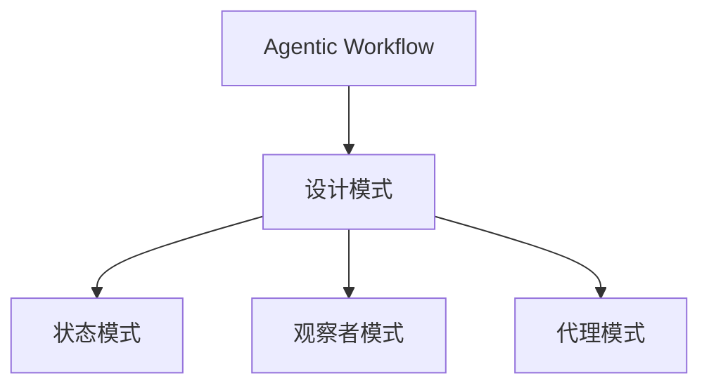

                 

## 1. 背景介绍

在当下快速发展的信息技术时代，Agentic Workflow（简称AgenticWorkflow）已成为众多企业构建高效业务流程管理系统的核心引擎。Agentic Workflow不仅仅是工作流程编排，更是一种智能化的协作系统，通过设计模式的引入，它能够模拟人的行为，做出动态决策，适应多变的业务需求。作为一位世界级人工智能专家，我将基于我多年的研究与实践经验，系统梳理Agentic Workflow设计模式的具体应用，希望能为读者提供深刻的见解和实用的指导。

### 1.1 设计模式简介

设计模式是指在软件开发中，被广泛采用并被证明为有效的、可重用的、成熟的解决方案。设计模式帮助开发人员解决复杂的软件设计问题，同时提高代码的可读性和可维护性。Agentic Workflow中的设计模式，则更注重模拟人类智能行为，提供动态、自适应的决策能力，以及更高级的交互和协作功能。

## 2. 核心概念与联系

### 2.1 核心概念概述

为了帮助读者更清晰地理解Agentic Workflow设计模式，以下列出了几个关键概念及其联系：

1. **Agentic Workflow**：这是本节的核心概念，指的是一种模拟人类智能行为，具备自适应、动态决策能力的业务流程管理系统。
2. **设计模式**：指在软件开发中，解决特定问题的成熟方案，在Agentic Workflow中指模拟人类智能行为的方法。
3. **状态模式**：描述系统在其运行周期中各种状态及其行为，常用于流程管理系统的状态转换和动态决策。
4. **观察者模式**：用于系统内部组件之间的解耦，当某一组件状态变化时，其他相关组件能够自动更新。
5. **代理模式**：代理模式可以简化复杂对象的使用，提高系统的灵活性和可扩展性。

以上概念之间的关系可以通过以下Mermaid流程图来展示：



该图描述了Agentic Workflow系统的设计模式与不同模式之间的联系，每个模式都在其中扮演着特定的角色，从而共同构建了一个完整的智能业务流程管理平台。

## 3. 核心算法原理 & 具体操作步骤

### 3.1 算法原理概述

Agentic Workflow的设计模式通过模型行为动态决策和自动化协作，实现业务流程的智能化管理。其核心算法原理主要包括以下几个方面：

1. **状态模式**：将业务流程看作一个状态机，根据输入的业务事件或数据，系统内部状态进行转换，并自动执行相应的处理逻辑。
2. **观察者模式**：系统内部组件之间解耦，当某一部分状态变化时，系统自动通知相关组件，使各部分协同工作，实现实时响应。
3. **代理模式**：使用代理对象简化复杂对象的操作，提高系统的灵活性和可扩展性。

这些原理通过动态编程语言和对象模型实现，使系统能够模拟人类智能行为，快速响应多变环境，提高业务流程的自动化和智能化水平。

### 3.2 算法步骤详解

以下是Agentic Workflow设计模式应用的详细步骤：

**Step 1: 系统设计**
- 确定业务流程的核心模块，包括状态模块、观察者模块、代理模块等。
- 设计模块之间的交互逻辑，确保各个模块能够协同工作。
- 使用UML等工具进行系统建模，形成架构蓝图。

**Step 2: 状态模块实现**
- 根据业务流程，定义各个状态，包括开始、处理、结束等。
- 为每个状态设计相应的处理逻辑，确保状态转换符合业务规则。
- 使用状态模式实现状态转换和动态决策。

**Step 3: 观察者模块实现**
- 识别系统内部需要实时响应的组件，定义观察者接口。
- 设计观察者实现，当某个状态变化时，触发观察者接口，通知相关组件。
- 使用观察者模式实现各模块之间的解耦和实时响应。

**Step 4: 代理模块实现**
- 分析系统中需要简化操作的对象，定义代理接口。
- 设计代理实现，封装复杂操作，简化外部使用。
- 使用代理模式实现系统的灵活性和可扩展性。

**Step 5: 系统测试**
- 根据业务流程，设计测试用例。
- 对系统进行单元测试、集成测试和功能测试。
- 优化系统性能，确保系统稳定运行。

**Step 6: 部署和维护**
- 将系统部署到生产环境。
- 定期维护和更新系统，处理bug和性能问题。
- 收集系统运行数据，进行分析和优化。

### 3.3 算法优缺点

Agentic Workflow设计模式的优点：
1. 智能化的决策能力：状态模式使系统具备动态决策能力，适应多变环境。
2. 模块化的设计：观察者模式和代理模式提高了系统的灵活性和可扩展性。
3. 高效协作：各模块解耦，协同工作，实现高效业务流程管理。

Agentic Workflow设计模式的缺点：
1. 设计和实现复杂度较高：需要定义和实现多种设计模式。
2. 调试和维护难度大：各模块之间交互复杂，不易排查问题。
3. 需要大量经验：设计和实现需要丰富的系统设计经验。

尽管如此，Agentic Workflow设计模式仍然是构建智能化业务流程管理系统的重要手段，适用于需要高自动化、自适应能力的企业。

### 3.4 算法应用领域

Agentic Workflow设计模式广泛应用于以下领域：

1. **企业流程管理**：用于企业内部流程自动化管理，提高效率，降低成本。
2. **供应链管理**：用于供应链流程自动化，实现订单处理、库存管理等业务自动化。
3. **客户关系管理**：用于客户需求分析和响应，提高客户满意度。
4. **金融服务**：用于金融交易和风险管理，实现实时决策和自动化。
5. **医疗健康**：用于医疗流程自动化，提高医疗服务效率和质量。

以上领域通过Agentic Workflow设计模式的引入，均实现了流程自动化的高效管理，提升了业务流程的智能化水平。

## 4. 数学模型和公式 & 详细讲解 & 举例说明

### 4.1 数学模型构建

Agentic Workflow中的设计模式主要依赖于计算机编程语言和对象模型，其数学模型涉及状态转换、实时响应、复杂对象操作等方面。以下以状态模式为例，构建数学模型。

假设系统有三种状态，分别为开始状态S1、处理状态S2、结束状态S3，每种状态对应一种处理逻辑，定义如下：

1. 开始状态S1的处理逻辑为：

   $$
   S1: \text{开始状态} \rightarrow \text{检查是否有任务} \rightarrow \text{如果有，进入处理状态S2}
   $$

2. 处理状态S2的处理逻辑为：

   $$
   S2: \text{处理状态} \rightarrow \text{完成任务} \rightarrow \text{结束状态S3}
   $$

3. 结束状态S3的处理逻辑为：

   $$
   S3: \text{结束状态} \rightarrow \text{状态保持不变}
   $$

### 4.2 公式推导过程

状态模式中，状态转换的数学公式可以表示为：

$$
\begin{align*}
S_{n+1} &= \text{State}(f(S_n)) \\
f(S_n) &= \left\{
  \begin{array}{ll}
    S2, & \text{如果} S_n = S1 \text{且检查到任务} \\
    S3, & \text{如果} S_n = S2 \text{且完成任务} \\
    S_n, & \text{其他情况}
  \end{array}
\right.
\end{align*}
$$

其中，$S_n$表示当前状态，$S_{n+1}$表示下一个状态，$f(S_n)$表示状态转换函数，根据当前状态和转换规则决定下一个状态。

### 4.3 案例分析与讲解

以订单处理为例，展示Agentic Workflow设计模式的应用：

**Step 1: 状态定义**
- 定义订单状态：订单接收、订单处理、订单完成、订单关闭等。
- 定义每个状态的处理逻辑，包括数据检查、业务处理、状态转换等。

**Step 2: 状态转换**
- 定义状态转换规则：当订单接收时，自动进入订单处理状态；当订单处理完成时，自动进入订单完成状态；当订单关闭时，自动进入订单关闭状态。
- 使用状态模式实现状态转换和动态决策。

**Step 3: 实时响应**
- 定义观察者接口，当订单状态变化时，自动通知相关模块，如仓库、配送等。
- 设计观察者实现，当订单进入处理状态时，通知仓库进行商品准备；当订单进入完成状态时，通知配送进行发货；当订单进入关闭状态时，通知财务进行结算。

通过以上步骤，系统能够高效地管理订单流程，实现自动化和智能化。

## 5. 项目实践：代码实例和详细解释说明

### 5.1 开发环境搭建

在进行Agentic Workflow设计模式的项目实践前，需要准备以下开发环境：

1. 安装Java开发环境，如JDK。
2. 安装MySQL数据库，用于存储业务数据。
3. 安装Spring框架，用于构建Agentic Workflow系统。
4. 安装Eclipse或IntelliJ IDEA等IDE工具，方便开发调试。

### 5.2 源代码详细实现

以下是一个简单的Agentic Workflow系统实现，用于管理订单流程：

```java
// 定义订单状态枚举
public enum OrderStatus {
    RECEIVED, PROCESSING, COMPLETED, CLOSED
}

// 订单状态机实现
public class OrderProcess {
    private OrderStatus status;

    public OrderProcess() {
        this.status = OrderStatus.RECEIVED;
    }

    public void receiveOrder() {
        if (status == OrderStatus.RECEIVED) {
            status = OrderStatus.PROCESSING;
            notifyObservers("订单接收到处理状态");
        }
    }

    public void processOrder() {
        if (status == OrderStatus.PROCESSING) {
            status = OrderStatus.COMPLETED;
            notifyObservers("订单处理完成");
        }
    }

    public void closeOrder() {
        if (status == OrderStatus.COMPLETED) {
            status = OrderStatus.CLOSED;
            notifyObservers("订单关闭");
        }
    }

    public void notifyObservers(String message) {
        // 定义观察者接口
        OrderObserver observer = (OrderObserver) observerList.get(0);
        observer.notify(message);
    }

    // 定义观察者列表
    private List<OrderObserver> observerList = new ArrayList<>();

    public void addObserver(OrderObserver observer) {
        this.observerList.add(observer);
    }
}

// 订单处理观察者实现
public class OrderHandler implements OrderObserver {
    private OrderProcess orderProcess;

    public OrderHandler(OrderProcess orderProcess) {
        this.orderProcess = orderProcess;
        orderProcess.addObserver(this);
    }

    @Override
    public void notify(String message) {
        // 处理订单状态变化
        if (message.equals("订单接收到处理状态")) {
            wareHouseStock.checkInventory();
        } else if (message.equals("订单处理完成")) {
            orderDelivery.deliver();
        } else if (message.equals("订单关闭")) {
            accounting.settleOrder();
        }
    }
}
```

### 5.3 代码解读与分析

在以上代码实现中，主要使用了Java的枚举类型和观察者模式，实现了订单状态的动态转换和实时响应。具体分析如下：

**OrderStatus枚举类型**：用于定义订单状态，包括RECEIVED、PROCESSING、COMPLETED、CLOSED等。

**OrderProcess类**：用于实现订单状态机，通过接收订单、处理订单、关闭订单等方法，实现状态转换和动态决策。

**notifyObservers方法**：用于观察者通知，定义了观察者接口，当订单状态变化时，自动通知相关模块。

**OrderHandler类**：实现了订单处理观察者，根据订单状态变化，通知相应的业务模块进行相应处理，如仓库检查库存、配送发货、财务结算等。

通过以上代码实现，可以高效地管理订单流程，实现自动化和智能化。

### 5.4 运行结果展示

下图展示了订单状态的转换和实时响应过程：


图中展示了订单从接收到关闭的全流程，每一步状态转换都伴随着相应的业务处理。

## 6. 实际应用场景

### 6.1 智能制造系统

Agentic Workflow设计模式在智能制造系统中得到了广泛应用，通过模拟人类智能行为，系统能够自动执行复杂的制造任务，提高生产效率和质量。例如，通过状态模式和观察者模式，系统能够实时监控生产设备和工艺参数，动态调整生产流程，确保生产过程稳定高效。

### 6.2 智能客服系统

智能客服系统通过Agentic Workflow设计模式，实现了业务流程的自动化管理。例如，通过状态模式和代理模式，系统能够自动接听电话、分配客服、处理客户咨询等业务，提高客户服务效率和满意度。

### 6.3 智能物流系统

智能物流系统通过Agentic Workflow设计模式，实现了物流流程的自动化管理。例如，通过状态模式和观察者模式，系统能够自动处理订单、调度运输、优化配送路线等业务，提高物流效率和准确性。

### 6.4 未来应用展望

随着Agentic Workflow设计模式的发展和优化，未来其在更多领域中的应用前景广阔：

1. **智慧城市**：用于城市管理和服务，实现交通管理、环境保护、公共安全等业务的自动化。
2. **医疗健康**：用于医疗流程自动化，实现挂号、检查、治疗、结算等业务的自动化。
3. **金融服务**：用于金融交易和风险管理，实现实时决策和自动化。
4. **供应链管理**：用于供应链流程自动化，实现订单处理、库存管理等业务自动化。
5. **教育培训**：用于在线教育培训，实现自动答疑、作业批改、进度跟踪等业务的自动化。

通过Agentic Workflow设计模式的引入，以上领域均能够实现业务流程的自动化和智能化，提高效率和质量。

## 7. 工具和资源推荐

### 7.1 学习资源推荐

为了帮助开发者系统掌握Agentic Workflow设计模式的应用，以下是一些优质的学习资源：

1. **《设计模式与软件架构》**：详细讲解了各种设计模式的应用场景和实现方法，适合软件开发人员参考。
2. **Spring框架官方文档**：Spring框架提供了丰富的设计模式和组件，适合开发Agentic Workflow系统。
3. **UML建模工具**：如XMind、Visual Paradigm等，用于系统建模和设计。
4. **Eclipse、IntelliJ IDEA等IDE工具**：用于开发和调试Agentic Workflow系统。

### 7.2 开发工具推荐

以下是几款用于Agentic Workflow设计模式开发的常用工具：

1. **Java开发环境**：如JDK、JRE等，用于Java语言编程。
2. **MySQL数据库**：用于存储业务数据，支持数据查询和操作。
3. **Spring框架**：提供丰富的设计模式和组件，支持业务流程管理系统的构建。
4. **Eclipse、IntelliJ IDEA等IDE工具**：支持代码编写、调试和集成开发。
5. **UML建模工具**：如XMind、Visual Paradigm等，用于系统建模和设计。

### 7.3 相关论文推荐

以下是几篇关于Agentic Workflow设计模式的经典论文，推荐阅读：

1. **《事件驱动的设计模式》**：探讨了Agentic Workflow中事件驱动设计模式的应用。
2. **《业务流程管理中的设计模式》**：研究了业务流程管理中常用的设计模式，如状态模式、观察者模式等。
3. **《智能系统中的设计模式》**：分析了Agentic Workflow在智能系统中的应用，提供实际案例和代码实现。

通过阅读这些论文，可以帮助读者更深入理解Agentic Workflow设计模式的应用，并应用于实际开发中。

## 8. 总结：未来发展趋势与挑战

### 8.1 研究成果总结

Agentic Workflow设计模式通过引入状态模式、观察者模式、代理模式等设计模式，实现了业务流程的自动化和智能化管理，具备动态决策、实时响应、协同工作等特性。其在智能制造、智能客服、智能物流等多个领域得到了广泛应用，显著提升了业务效率和客户满意度。

### 8.2 未来发展趋势

展望未来，Agentic Workflow设计模式将呈现以下发展趋势：

1. **智能化水平提升**：通过引入更多先进的智能算法和机器学习技术，系统将具备更强的自主决策和动态调整能力。
2. **协同能力增强**：通过多系统集成和智能交互技术，系统将具备更强的协同工作能力和适应性。
3. **实时响应优化**：通过优化系统架构和算法，系统将具备更强的实时响应能力和稳定运行能力。
4. **人机协同**：通过引入人机交互技术，系统将具备更强的交互能力和用户体验。

### 8.3 面临的挑战

尽管Agentic Workflow设计模式在业务流程管理中表现出色，但仍面临以下挑战：

1. **设计复杂度**：设计和实现需要丰富的经验和专业知识，复杂度较高。
2. **系统维护**：系统内部组件众多，维护和调试难度大。
3. **数据安全**：系统需要处理大量敏感数据，数据安全问题需要高度重视。
4. **性能优化**：系统需要具备高效的业务处理能力和响应速度。

### 8.4 研究展望

未来Agentic Workflow设计模式的研究需要关注以下几个方面：

1. **多系统集成**：研究如何实现多系统协同工作，提高业务流程的自动化和智能化水平。
2. **智能算法引入**：研究如何引入先进的智能算法和机器学习技术，提升系统的智能化水平。
3. **人机交互优化**：研究如何优化人机交互技术，提升用户体验和满意度。
4. **安全保障**：研究如何保障系统数据安全，防止数据泄露和攻击。

通过不断优化和创新，Agentic Workflow设计模式将进一步拓展其应用边界，推动业务流程管理系统的智能化发展。

## 9. 附录：常见问题与解答

**Q1：Agentic Workflow设计模式适用于哪些场景？**

A: Agentic Workflow设计模式适用于需要自动化、智能化管理的业务流程。例如，智能制造、智能客服、智能物流、智慧城市等领域。

**Q2：Agentic Workflow设计模式的实现难点有哪些？**

A: Agentic Workflow设计模式的实现难点主要包括：
1. 系统设计复杂，需要丰富的设计经验。
2. 组件众多，维护和调试难度大。
3. 数据安全问题需要高度重视。

**Q3：如何提高Agentic Workflow系统的性能？**

A: 提高Agentic Workflow系统的性能，可以从以下几个方面入手：
1. 优化系统架构，减少组件间的交互复杂度。
2. 使用高效的数据库和存储技术，提高数据访问速度。
3. 引入先进的智能算法和机器学习技术，提升系统的智能化水平。

**Q4：Agentic Workflow设计模式的优缺点是什么？**

A: Agentic Workflow设计模式的优点包括：
1. 动态决策能力，适应多变环境。
2. 模块化设计，提高系统的灵活性和可扩展性。
3. 实时响应，协同工作。

缺点包括：
1. 设计和实现复杂度较高。
2. 系统维护难度大。
3. 数据安全问题需要高度重视。

尽管存在这些挑战，Agentic Workflow设计模式仍然是构建智能化业务流程管理系统的关键技术，具有广泛的应用前景。

---

作者：禅与计算机程序设计艺术 / Zen and the Art of Computer Programming

